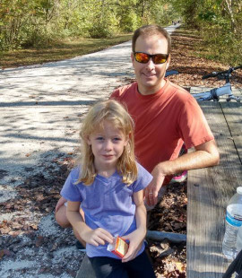
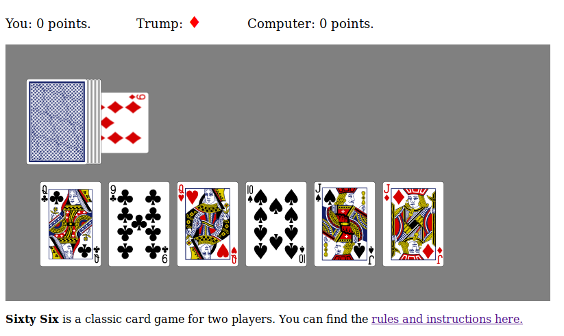

<table>
<tr>
<td>
</img>
</td>
<td>

Professor of Mathematics \
[Math & CS Department](http://www.hsc.edu/academics/mathematics-and-computer-science) \
[Hampden-Sydney College](https://www.hsc.edu)

Office: Pauley 301 \
E-mail: 

[About](about.html) | [Research](research.html) | [Teaching](index.html) 

</td>
</tr>
</table>

I've been a professor of mathematics at Hampden-Sydney College since 2008. I live in the Richmond area with my wife and two children.

### Running

I like to run, but not very fast. Two of my favorite places to run are High Bridge State Park and Pocohantas State Park. These are also great places for a bike ride.

### Card Games

I love classic card games like hearts, cribbage, and 500. I also like programming. A few years ago I started making card games that you can play online against the computer. The best one I've made so far is a version of [sixty-six](https://www.pagat.com/marriage/66.html), which happens to be one of the best two-player card games ever. Click on the picture below to try it.

 
 
 
 
 
 
 
 
 
 
