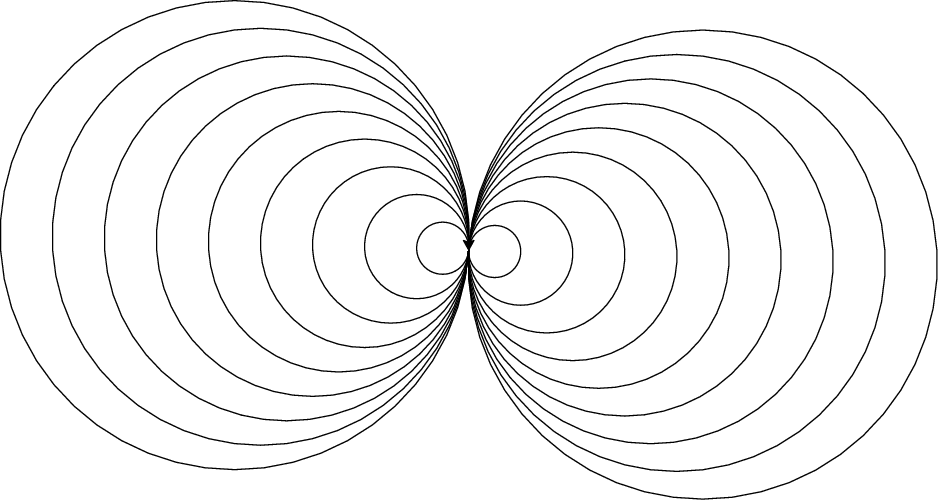

## COMS 261 - Fall 2024


<center>
Jump to: [Syllabus](index.html), [Week 1](#week-1-notes) , [Week 2](#week-2-notes), [Week 3](#week-3-notes), [Week 4](#week-4-notes), [Week 5](#week-5-notes), [Week 6](#week-6-notes), [Week 7](#week-7-notes), [Week 8](#week-8-notes), [Week 9](#week-9-notes), [Week 10](#week-10-notes), [Week 11](#week-11-notes), [Week 12](#week-12-notes), [Week 13](#week-13-notes), [Week 14](#week-14-notes), [Week 15](#week-15-notes)
</center>

### Week 1 Notes

#### Tentative Schedule

Day  | Section  | Topic
:---:|:---:|:-----------------------------------
Mon, Aug 26 | [TP01][TP01], [C2] | Introduction to Python & Thonny
Wed, Aug 28 | [TP02][TP02] | Variables & functions
Thu, Aug 29 | [TP02][TP02] | Statements versus expressions
Fri, Aug 30 | [C2.6][C2.6] | Binary & floating-point numbers

### Mon, Aug 26 

Today we introduced Python and the [Thonny IDE](https://thonny.org/) (Integrated Development Environment). 

We learned how to use the **Python Shell** and how to write Python **scripts**.  We also covered the following:

* **Operators** (like `+`, `-`, `*`, `/`)
* **Types** (like `int`, `float`, and `str`)
* **Variables**
* **Comments** 

We talked about how operators follow an **order of operations**, and if operators have the same level of precedence, then they are computed left to right.  We also talked about how some operators don't work for all types.  For example, the `+` operator concatenates strings, but the `*` operator is not defined for strings. 

We finished by writing a script to calculate the volume of a sphere.

```python
# A script to calculate the volume of a sphere.

PI = 3.14159 

radius = 4

volume = 4 / 3 * PI * radius ** 3

print("The volume of the sphere is:", volume)

```

### Wed, Aug 28 

We talked about which variable names are allowed.  Some words cannot be used as a variable names because they are special Python **keywords**.  There are currently 35 keywords in Python 3.10 (which is the version we are using), and we'll cover most of them in this course.  Other rules for naming variables include:

* Variable names can only contain numbers, letters, and the underscore character `_`.
* A variable name cannot start with a number.

It is recommended to only use lower case letters only in most variable names (except when you want to indicate that the variable is constant and won't ever change, in which case `ALL_CAPS` is recommended). If a variable name has multiple words, then separate the words with an underscore character, like: `surface_area`. 

We also introduced some new functions including `input()`, and the type conversion functions `int()`, `float()`, and `str()`.  <!--Forgot: round() -->


1. Write a script that prompts the user to input a radius.  Then calculate and print both the surface area and volume of a sphere. <!-- Forgot to include: with that radius rounded to 2 decimal places. -->

We finished by talking about how to **import** functions from **modules**.  We imported the `math` module which contains functions familiar math functions like `sin()`, `cos()`, and `sqrt()`.  You can use the command 
`dir(math)` to list all of functions in the `math` module.  

2. How could you tell if the sine and cosine function expect the input in degrees or radians?  Test your idea in the shell and see what the default is. 

3. What happens if you type `math.sin` without an input?

4. What happens if you enter `help(math.sin)`?

5. What does the `degrees()` function do? 

6. Write a program to calculate the roots of a quadratic polynomial $a x^2 + bx + c$ using the quadratic formula
$$x = \frac{-b \pm \sqrt{b^2 - 4ac}}{2a}.$$

### Thu, Aug 29

Today we talked about some of the errors that came up in the quadratic formula programs from yesterday.  There are three categories of errors in Python.

#### Types of Errors

* **Syntax errors** are errors in the structure of the program that the computer can detect before running the code. Examples include mismatched parentheses, or incomplete lines of code. 
* **Runtime errors** are errors that occur while the program is running. This category include **type errors** where the computer tries to use a function or operator with a variable or expression of the wrong type. 
* **Semantic errors** happen when the program runs without an error message, but the output is incorrect.

Keep in mind that syntax refers to the structure and grammar of a program, while semantics refers to its meaning.  Computers are very picky about syntax, but they are completely oblivious to semantics. 

#### Statements versus Expressions

The first error we looked at was this incorrect line of code:

```python
(x1 = (-b + math.sqrt(b ** 2 - 4 * a * c)) / (2 * a))
```

To explain this error, we talked about the difference between statements and expressions in Python.  

* A **statement** is a piece of code that does something.  
* An **expression** is a piece of code that has a value.  

Every expression is a statement, but not vice versa.  In Python, every valid line of code is a statement.

```python
# Example statements
import math
a = 5.0
b = 3 + a
print("Hello")

# Example expressions
1+1
5.0
(-b + math.sqrt(b ** 2 - 4 * a * c)) / (2 * a)
```

Notice that statements can include expressions.  A special kind of statement is an **assignment statement** where you assign a value to a variable.  Every assignment statement has the form:

```python
variable_name = # some expression
``` 

You can always wrap an expression in parentheses, and it will still be an expression with the same value.  But, the reason the line of code `(x1 = (-b + math.sqrt(b ** 2 - 4 * a * c)) / (2 * a))` is not correct is that an assignment statement is not an expression, and cannot be wrapped in parentheses.  


#### Function Return Values

Some functions return values and some functions don't.  For example, `math.sqrt(4)` returns the value `2.0`, so it can be used as an expression.  But the function `print("Hello")` does not return a value.  The `input()` function returns a string with whatever input the user types.  So you can use an assignment statement like 

```python
a = input("Enter a value for the coefficient a. ")
```

to prompt the user to input a number for `a`.  Be careful, the value that you get will be a string.  You have convert it to a number using the `int()` or `float()` functions before you can use it in a formula. 

### Fri, Aug 30

Today we talked about binary numbers and how Python stores integers and floating point numbers under the hood.  We started by talking about how to convert base-2 numbers to base-10.  We did the following examples. 

1. Convert $(110)_2$ to base-10.

1. Convert $(1111)_2$ to base-10.

1. Convert $(10101)_2$ to base-10.

1. Convert $(10.11)_2$ to base-10.

After that we talked about how to convert base-10 integers to base-2.  That is a little bit harder, so we introduced the **algorithm** below which can be described using a **flow chart**:

<center>
</img>
</center>

5. Use the algorithm above to convert 35 to base-2. 

6. Use the algorithm above to convert 13 to base-2. 

After we introduced binary numbers, we talked about **bits** and how many integers can be stored using $n$ bits.  One example is that the maximum number of rupees (money) you could have in the original Zelda game was 255 because the data was stored using 8 bits.  Unlike a lot of programming languages, Python allows arbitrarily large integers.  This avoids **integer overflow** errors, but it can be slower for large integers.  

We also talked about how computers store [floating point numbers](https://en.wikipedia.org/wiki/Floating_point).  Most modern programming languages (including Python) store floating point numbers using the [IEEE 754 standard](https://en.wikipedia.org/wiki/IEEE_754). 

{ style="width: 700px" }
{style="width: 700px"}

In the IEEE 754 standard, a 64-bit floating point number has the form 
$$x = (-1)^s * (1.a_1 a_2 \ldots a_{52})_2 * 2^{e - 1023}$$
where 

* $s$ is the 1-bit sign,
* $a_1 a_2 \ldots a_{52}$ is the 52-bit mantissa, and
* $e$ is the 11-bit exponent which ranges from 0 to 2047. Only 1 to 2046 are used for regular floating point numbers, $e=0$ is reserved for zero and [subnormal numbers](https://en.wikipedia.org/wiki/Subnormal_number), and $e=2047$ is reserved for infinity and NaN ("not a number"). 

7. Compare the output you get when you type `2**1024` versus `2.0**1024` in the Python shell. 

8. Compare the output for `2.0**(-1024)` versus `2**(-1070)`.  Notice that you lose precision with small floating point numbers, but you don't get an error the way you do with large floats. 

9. Why do you get an incorrect answer when you enter `0.1+0.1+0.1`?

<!-- Soon: Talk about machine code, vs. assembly vs. C++ vs. python  --> 
<!-- Soon: Talk about binary and modular arithmetic --> 


- - -

### Week 2 Notes

#### Tentative Schedule

Day  | Section  | Topic
:---:|:---:|:-----------------------------------
Mon, Sep 2  | | Labor Day, no class
Wed, Sep 4  | [TP03][TP03] | Functions
Thu, Sep 5  | [TP03][TP03] | For-loops
Fri, Sep 6  | [TP04][TP04] | Turtle graphics

### Wed, Sep 4 

To create your own functions in Python, use the `def` keyword to define them:

```python
def hello():
    print("Hello!")
```

Every function is a **function object**.  So `function` is a type just like `int`, `float`, and `str`.  When you refer to a function object in Python, there is a difference between the **name** of the function (which is `hello` in the previous example) and the way you **call** the function to get it to run by typing `hello()`. Here is another function example. 

```python
def print_twice(string): # The first line is called the **header**
    print(string) # All of the other lines are called the **body of the function**
    print(string) # Notice that all of the lines of the body must be indented
```

This function has a **parameter** which is the variable called `string` in the parentheses. We you call this function, you need to include an **argument** which is a value for the parameter.  

```python
>>> print_twice("Hello")
Hello
Hello
>>> print_twice(5)
5
5
```

In this example, "Hello" and 5 are arguments.  The variable called `string` in the function is a parameter. Weirdly, when we pass the argument 5 to the function, then the parameter called `string` stores the value 5 which is an integer not a string!  But that is okay, because Python knows how to print integers.   

Functions can have as many parameters as needed. Try to make your own functions to do the following. 

1. Define a function called `sum_of_squares` that adds up the squares of two numbers. 

2. Define a function called `sphere_volume` that calculates the volume of a sphere.  

When you create a function, you should *always* include a docstring that briefly explains what the functions does.  A **docstring** is a comment that is written using triple quotes instead of the hash symbol. Here is an example.

```python
def circle_area(radius):
    """Returns the area of a circle."""
    PI = 3.14159
    return PI * radius ** 2
```

The advantage of a docstring over a regular comment is that it can take up multiple lines. Python style guides recommend using docstrings even for one line descriptions of functions, since you might need to add more explanation later. 

This last example includes a local variable called `PI`.  Any variable created in a function body is **local**, which means it can only be used inside the function.  You won't have access to local variables outside the function.  Variables defined in a program that aren't parameters or defined in the body of a function are **global** an can be accessed anywhere in a program.  

We finished with a function that calls another function in its body:

```python
def cylinder_volume(radius, height):
    """Returns the volume of a cylinder."""
    return circle_area(radius) * height
```

### Thu, Sep 5

Today we introduced **for-loops**. We started with two example functions to demonstrate how they work. 

```python
def box(n):
    """Prints an n-by-n square made of * symbols."""
    for i in range(n):
        print("*" * i)

def print_numbers(n):
    """Print the first n positive numbers."""
    for i in range(1,n+1):
        print(i)
```

Notice that the `range` function can accept up to three arguments (`start`, `stop`, and `step).  We talked about how Python is **zero-indexed**. For the `range` function, this means that be default it starts counting at zero, so it always stops before the value of the `stop` parameter. We did these exercises. 

1. Write a function to print the first n perfect squares (i.e., 1, 4, 9, 16, etc.)

2. Write a function to print a triangle with n rows like this:

        *
        **
        ***
        ****

3. Write a function to print an upside down triangle with n rows:

        ****
        ***
        **
        *

4. Write a function to print a hollow n-by-n square, like this example when n is 4:

        ****
        *  *
        *  *
        ****

We finished by talking about **accumulator variables** in loops.  I showed this example.

```python
def sum_of_squares(n):
    """Returns the sum of the first n perfect squares."""
    total = 0 # total is an accumulator variable
    for i in range(1,n+1):
        total += i ** 2
    return total
```

5. Write a function that uses a for-loop with an accumulator variable to multiply the numbers 1, 2, ..., n. In other words, write a function to compute the factorial of n. 

### Fri, Sep 6

Today we played with [turtle graphics](https://en.wikipedia.org/wiki/Turtle_graphics) using the `turtle` module in Python.  We started by creating a turtle object we called `fred` and then using `fred` to draw a square. We ended up creating several functions using `fred` to draw different kinds of shapes. 

```python
import turtle

fred = turtle.Turtle()

def polygon(side_length, n):
    """Draw a polygon with n sides."""
    for i in range(n):
        fred.forward(side_length)
        fred.left(360 / n)

def circle(radius):
    """Draw a circle."""
    side_length = 2 * 3.14159 * radius / 50
    polygon(side_length, 50)
```

We finished with some excercises using these funtions. 

1. Draw a picture like this one. 

<center>
</img>
</center>

2. Write a function to draw a bullseye with n rings, like this:

<center>
</img>
</center>

- - - 


### Week 3 Notes

#### Tentative Schedule

Day  | Section  | Topic
:---:|:---:|:-----------------------------------
Mon, Sep 9  | [TP05][TP05] | Conditional statements
Wed, Sep 11 | [TP05][TP05] | Boolean expressions
Thu, Sep 12 |  | 
Fri, Sep 13 |  |

### Mon, Sep 9

Today we talked about how to implement **conditional** statements using the keywords **if**, **then**, and **else** in Python.  We started with some simple examples.  

1. Body mass index is a quantity used to determine if people are a healthy weight or overweight.  The formula for someone's body mass index is

    ```python
    BMI = (weight / height**2) * 703
    ```

Anyone with a BMI of 25 or more is considered overweight.  Write a program to calculate someone's BMI and then use an if-then statement to determine if they are overweight.     

2. If someone's BMI is less than 18.5, they are considered underweight.  Write a function called `weight_category(height, weight)` that returns one of three possible strings: healthy, underweight, or overweight, depending on the corresponding BMI. 

3. Adapt the program to add a fourth category: obese which is anyone with a BMI greater than or equal to 30. 

In order to use an if-statement, we need a special kind of expression that is either true or false.  These are called **boolean expressions**.  Python has a special type called `bool` that has only two possible values, `True` or `False`.  

4. Write a function that checks if someone typed in the correct password (`banana7`).  Your function should return a boolean value. 

So far we have introduced the following boolean operators (`==`, `<`, `>`, `<=`, and `>=`). Another important boolean operator is `!=` which is `True` when two expressions are not equal and `False` if they are equal. 

Another really handy operator is the keyword `in` which can test whether one string is inside another.  

5. Which of the following strings are inside `"The quick brown fox"`?  

    a. `"quick"`
    b. `"Fox"`
    c. `"Tqbf"`
    d. `"brown fox"`
    e. `"he qu"`

### Wed, Sep 11

There was no class since I was out with COVID.  I recommended watching part of one of the Harvard CS50 with Python online lectures for more about conditionals and boolean expressions. 

* **Video**: [Harvard CS50 Python - Lecture 1](https://youtu.be/_b6NgY_pMdw?list=PLhQjrBD2T3817j24-GogXmWqO5Q5vYy0V&t=1110)

### Thu, Sep 12

I sent out some tips and questions to think about when working on project 2:

* [Project 2 Tips](project2tips.pdf)

- - -

### Week 4 Notes

#### Tentative Schedule

Day  | Section  | Topic
:-----:|:---:|:-----------------------
Mon, Sep 16  | [TP05][TP05] | Integer division and modulus
Wed, Sep 18  | [C11][C11] | While-loops
Thu, Sep 19  | [C11][C11] | While-loops con'd
Fri, Sep 20  | [TP05](https://allendowney.github.io/ThinkPython/chap05.html#recursion) | Recursion


### Mon, Sep 16

Today we talked about the **integer division** operator `//` and the **remainder** or **modulo** operator `%` in Python. We used them to do these exercises:

1. Today is Monday, Sep 16.  What day of the week will Oct 16th be (without looking at a calendar)? What about Nov 16?  

2. Write a program to convert any number of minutes into hours and minutes.  For example, 100 minutes is 1 hour and 40 minutes. We used this example to introduce [f-strings](https://peps.python.org/pep-0498/) to help print the answer.  

```python 
def time_conversion(minutes): 
    hours = minutes // 60
    minutes = minutes % 60
    print(f"There are {hours} hours and {minutes} minutes.")
```

3. Improve the program to convert minutes into days, hours, and minutes.  For example, 1590 minutes should be 1 day, 2 hours, and 30 minutes. 

4. Write a program to make change using the fewest coins possible for any amount of money less than \$1.00. For example, 63¢ could be 2 quarters, 1 dime, and 3 pennies.  

<!--
5. Write a program to do [fizz buzz](https://en.wikipedia.org/wiki/Fizz_buzz).
-->

### Wed, Sep 18 

Today we introduced **while-loops**.  A while-loop is an alternative to a for-loop that is often useful when you don't know how many steps you need to repeat.  We did the following examples.  

1. Use a while loop to find and print all [Fibonacci numbers]() less than $n$.  

2. Write a while loop to repeat a string until the total length is more than $n$. 

3. Change the following function so that it uses a while-loop instead of a for-loop:

    ```python
    def countdown(n):
        """Count down from an integer n, printing each number.  When you get to zero, print 'Go!'"""
        for i in range(n, 0, -1):
            print(i)
        print("Go!")
    ```

    <details>
    ```python
    def countdown(n):
        """Count down from an integer n, printing each number.  When you get to zero, print 'Go!'"""
        while n > 0:
            print(n)
            n -= 1
        print("Go!")
    ```
    </details>


4. Write a function called `get_valid_input()` that prompts the user to enter an positive even integer.  If the user doesn't enter a positive even integer, have the program prompt the user again until they enter a valid input. 

<!--
After that, we talked about [Euclid's algorithm](https://en.wikipedia.org/wiki/Euclidean_algorithm) for finding the greatest common divisor (GCD) of two integers.  The algorithm is based on two simple observations. 

1. If `a` and `b` are both even, then `a % b` is also even.  More generally, if `a` and `b` have any common divisor `d`, then `a % b` is also divisible by `d`.   

2. If `a > b > 0`, then `b > a % b`. 

Here is the algorithm:

<pre>
    <b>Euclid's GCD Algorithm</b>
    <b>Input:</b> Positive integers a and b
    <b>Output:</b> Returns the GCD of a and b
    <b>while</b> b is not 0 <b>do</b>
        Find the remainder of a divided by b
        Let a equal b
        Let b equal the remainder 
    <b>end</b>
    The GCD is a
</pre>
-->

### Thu, Sep 19

Today we talked about while-loops again.  We started with this example, which improves on the `get_valid_input()` function from yesterday and also introduces the idea of a `while True` loop.  

```python 
def get_valid_input():
    while True:
        n = int(input("Enter a positive even number: "))
        if n > 0 and n % 2 == 0:
            return n
        else: 
            print("That isn't a positive even number.  Try again.")
            
user_input = get_valid_input()
print("You entered", user_input)
```

After that we implemented the [Babylonian algorithm](https://en.wikipedia.org/wiki/Methods_of_computing_square_roots#Heron's_method) for finding square roots. 

```python
def sqrt(a, accuracy = 10 ** (-12)):
    """Uses the Babylonian algorithm to find the square root of a"""
    x = a
    while abs(x**2 - a) > accuracy:
        x = (x + a/x) / 2
    return x
```

When we wrote this example, we talked about why you should not use `==` or `!=` on floating point numbers.  We also introduced the idea of **default parameters**. 

### Fri, Sep 20 

Today we did some more practice with while-loops.  

1. Write a function that uses a while-loop to print all of the numbers from 1 to 100.  

2. Write a while-loop to play a number guessing game.  Use the `random.randint(1,10)` function by importing the `random` library to generate a random integer from 1 to 10.  Then have the user guess the number until they get it right.  

<!-- 3. Add a prize to the number guessing game, where you get $5 if you get it right the first time, and the $1 less each additional try. When they finish, you should print how much money the won. -->

After that, we talked about **recursive functions** which are functions that call themselves.  You can use recursive functions to repeat code in much the same way as loops.  We did the following examples.  

3. Write a recursive version of the `countdown(n)` function.  

    ```python
    def countdown(n):
        """Prints the numbers from n down to 1, then prints 'Go!'"""
        print(n)
        n -= 1
        if n > 0:
            countdown(n)
        else:
            print("Go!")
    ```

4. Re-write the number guessing game using a recursive function instead of a while-loop.

5. **Challenge.** Write a recursive function to print the Fibonacci numbers less than $n$. <!-- Note to self... it is much easier to write a recursive function to generate the first n Fibonacci numbers... -->

- - - 

### Week 5 Notes

#### Tentative Schedule

Day  | Section  | Topic
:-----:|:---:|:-----------------------
Mon, Sep 23  | [TP06](https://allendowney.github.io/ThinkPython/chap06.html#recursion-with-return-values) | Recursion with return values
Wed, Sep 25  | [docs](https://docs.python.org/3/library/stdtypes.html#sequence-types-list-tuple-range) | Sequence types
Thu, Sep 26  | [C10.1][C10.1] | Lists
Fri, Sep 27  | [TP09][TP09] | Lists

### Mon, Sep 23

We looked at some more examples of recursive functions. 

1. Write a function to recursively find the n-th Fibonacci number. 

2. Write a function to recursively print all Fibonacci numbers less than $m$.  

3. Write a `factorial(n)` function. 

<!--
3. Make a flow chart for the algorithm to find the prime factors of a positive integer. 

4. Implement the algorithm above using a recursive function. The function should print each prime factor as they are found.  
-->

We also talked about **input validation** and we introduced the `isinstance(obj, type)` function. 

```python
# We used this conditional in class
if not isinstance(n, int):
    print("n is not an integer.")

# Here is an alternative that also works
if type(n) != int:
    print("n is not an integer.")
```

### Wed, Sep 25

Today we did more practice with loops and recursion.  We reviewed how to find the prime factorization of any integer greater than 1.  We spent the class on these exercises.

1. What are the prime factors of 836? 

2. Write a program to print the prime factors of any integer greater than 1. 

After that, we talked about **lists** in Python.  Lists are a type the can store more than one value.  We introduced how to define a list using square brackets (including an empty list) and how to create a new list by adding two lists together.  We finished with these exercises.

3. Re-write your prime factors program so that it returns a list of prime factors instead of printing them. 

4. Write a function that prompts a user to enter a list of integers.  After each integer the user enters, ask them if they are done or not.  Have them enter an upper or lowercase letter Y if the answer is yes.  Once the user is done, the function should return the list. 

<!-- Save this for later:
We also talked about how to loop through all of the values in a list.  The same technique also works for strings. 

3. Write a program that generates a list of all prime numbers less than n.  
-->

### Thu, Sep 26

<!--
We started with this exercise from yesterday:

1. Write a function that prompts a user to enter a list of integers.  After each integer the user enters, ask them if they are done or not.  Have them enter an upper or lowercase letter Y if the answer is yes.  Once the user is done, the function should return the list. 
-->

We talked about some of the similarities between lists and strings.  They are both **sequence types**.  So they both have a length which you can find using the `len` function.  You can access individual elements in any sequence type by using their **index** which is their position in the sequence.  The first element has index 0 and the last has index equal to the length minus one.  

1. Write a function that prints every other character in a string. 

2. Write a function called `is_integer_string(s)` that returns true if `s` is a string with only the digits 0 through 9 as characters.  


3. Write a function called `even_elements(numbers)` that (i) counts the number of even integers in a list and (ii) finds the index of the first even integer.  Have the function print a sentence with both results.  

```python
def even_elements(numbers):
    # You'll need two accumulator variables for this function. 
    # One to count the even elements, and
    # another to save the index of the first even element when you find it.
```


### Fri, Sep 27 

If you don't care about the indices, then there is an even easier way to loop through every element of the sequence.  You can use the following syntax:

```python
example_list = [2,4,6,7,11,14,20]
for n in example_list:
    print(n)
```

Use this new style of for-loop to (re)write some of the functions we talked about last time. 

1. Write an `even_elements(numbers)` function like the one from yesterday using this style of loop. It would be a good idea to use $-1$ as the index of the first even number if there aren't any.    

2. Re-write the `is_integer_string(s)` function using this style of list.  To make this one more interesting, we first created a function called `is_digit_char(c)` that returns `True` if and only if `c` is a length 1 string that consists of one of the ten digits 0 though 9. 

3. Write a function `any_divisors(n, divs)` that accepts an integer `n` and a list of nonzero integers `divs`, and returns true if any of the elements of `divs` are a divisor of `n`. 


- - - 

### Week 6 Notes

#### Tentative Schedule

Day  | Section  | Topic
:-----:|:---:|:-----------------------
Mon, Sep 30 |  [TP08][TP08] | Strings
Wed, Oct 2  |  | Review
Thu, Oct 3  |  |
Fri, Oct 4  |  | **Midterm 1**

### Mon, Sep 30

We started talking about **slices** of strings and lists. We also talked about **methods** and in particular the `.index()` method and the `.count()` method. Every sequence type has these two methods.  

1. How would you slice the string `s = "The quick brown fox"` to get the word `"quick"`?

2. Write a function that counts how often each vowel (a, e, i, o, u) occurs in a string and prints the results.  It helps to use the `.lower()` method for strings which returns a new string that is all lower case.  This let us talk about **method chaining** when you call methods like this: `x.method1().method2()`. 

3. Write a function called `split_at(s, char)` that splits a string into a list with two strings.  The part before the first occurrence of `char` and the part after the first occurrence.  Then re-write this function to split the string at every occurrence of `char` and return a list of all sub-strings. 

    ```python
    def split_at(s, char):
        """Returns a list of the substrings of s that are separated by char."""
        output = []
        while char in s:
            location = s.index(char)
            front = s[0:location]
            output += [front]
            s = s[location+1:] 
        return output + [s] # Notice that the last substring in s 
                            # will have to be added at the end.
    ``` 

### Wed, Oct 2

Today we talked about how to **trace** a program with paper and pencil including a **stack diagram** for recursive functions.  We started with the recursive function from [problem 11 on the practice midterm](practicemidterm1.pdf).  Then we did these other examples. 

1. Make a table to trace the values of the variables in this loop. 

    ```python
    n = 1
    for i in range(5):
        a = n * i
        n = n + a
    ```

2. Make a stack diagram to trace this recursive function.

    ```python
    def result(n):
        if n == 1:
            return 2
        else:
            return 2 * result(n - 1)
    ```

3. Make a stack diagram to trace this recursive function.

    ```python
    def f(k, n):
        if k == n:
            return k
        elif k < n:
            return f(k, n - k)
        else:
            return f(k - n, n)
    ```

We also talked about how to work with nested lists, including this example:

```python
students = [
    ["Charlie", 8], 
    ["Lucy", 9], 
    ["Linus", 7], 
    ["Sally": 6]
]

total = 0
count = len(students)
for i in range(count):
    total += students[i][1]
print("The average age of the students is ", total / count)
```

<!--
Today we talked about things that all sequence types have in common and things that are different between lists in strings.  

```python
example_list = [1,'b',True]
example_string = "Hi!"

# You can access elements in a list or a string by using index notation:
print(example_list[1])
print(example_string[1])


-->


- - - 

### Week 7 Notes

#### Tentative Schedule

Day  | Section  | Topic
:-----:|:---:|:-----------------------
Mon, Oct 7   | [C10.3][C10.3] |  Mutability and immutability
Wed, Oct 9   | [TP07.2](https://allendowney.github.io/ThinkPython/chap07.html#reading-the-word-list) | Reading files
Thu, Oct 10  | [TP07.2](https://allendowney.github.io/ThinkPython/chap07.html#reading-the-word-list) | Reading files
Fri, Oct 11  |  | Common patterns in loops (map, filter, reduce)

### Mon, Oct 7

Today we talked about a major difference between lists and strings.  Lists are mutable but strings are immutable.  A type in Python is **immutable** if you can change anything about the value without completely creating a new instance. A type is **mutable** if you can modify parts of it without completely replacing it. This is one of the trickier things to understand.  

```python
# You can change an element in a list but not in a string:
example_list[1] = 'B' # now example_list is [1,'B',True]
example_string[1] = 'I' # this is an error.  Strings a are immutable.  
```

There are several methods that work for mutable sequence types like lists, but not for immutable sequences like strings.  These include the `.append()` method which adds an element to the end of a list, the `.pop()` method which removes and element from the end of a list (and returns its value), and the `.sort()` method which changes a list by putting its elements in sorted order.  

```python
# Strings are immutable
s = "You can't touch this!"

"""When you create the string "You can't touch this!", it is frozen in computer mememory.  
You can reassign the variable s, but that doesn't change the string, it just makes s
point to a different object in memory. 
"""

# Lists are mutable.  Changes made to a list will be remembered by the computer.  
a = [1,2,3]

"""Because of the way lists are stored in memory, two variables can refer to the same list
object.  If you make changes to one variable, that will affect the other variable too!  
This only happens with mutable types, so watch out for it.  
"""
b = a
b.append(4)
print(a) # Weird!!!
```

Try these experiments to get a feeling for how this works.

1. Let `a = [1,2,3]` and `b = a + [4]`.  Does that change `a`?  

2. What about `a = [1,2,3]` and `b = a` followed by `b += [4]`?  Does that change `a`?

3. Let `x = "test"` and `y = x` followed by `y += "s"`. Does that change `x`?

Note that adding two lists creates a new list, but the `+=` operator does not!
We finished with a cautionary example about the need to avoid unintended side-effects when working with mutable types:

```python
def average(numbers): 
    n = len(numbers)
    total = 0
    for i in range(n):
        total += numbers.pop()
    return total / n

data = [4, 5, 6]

mean = average(data)
print("The average of", data, "is", mean)
```

Observe that the way we got the numbers to add to the total had the side effect of erasing the data which isn't what we wanted at all!  

### Wed, Oct 9

Today we talked about how to read the contents of a text file.  We talked about Python **file objects** which are what you get when you use the `open()` function to access the contents of text file.  File objects come with several useful methods for getting the contents of a file, including:

* `.read()` which returns the contents of a text file as a string. 
* `.readlines()` which returns a list containing each line of the file as a separate string.

We did the following exercises using a word list contained in this text file: [words.txt](words.txt).  

1. Write a function to find the longest word in the word list.  
  ```python
  file = open("words.txt")
  word_list = file.readlines()

  def longest_word(word_list):
    biggest_so_far = ""
    for word in word_list:
        if len(word) > len(biggest_so_far):
            biggest_so_far = word
    return biggest_so_far
  ```

2. Write a function `count_words(word_list, start_letter)` to count how many words begin with a given letter.  

3. Write a function `get_words(word_list, start_letter)` to return a list of all words that begin with a given letter. 

It turns out if you write the function `get_words` first, then you can use it to easily write the `count_words` function without repeating any code by combining `get_words` with the `len` function. 

We also looked at the text file [grades.txt](grades.txt) which contains comma separated values. 


### Thu, Oct 10

<!-- NOTE TO SELF:

This set of exercises was a little too advanced for most of the students.  They still need more time to get used to basic patterns of looping and accumulator variables.  See the activity we did on Friday, Oct 11 for a more appropriate lesson.  

-->

The grades for 26 students are stored in a text file [grades.txt](grades.txt). Suppose that the final grade in the class is 20% homework, 30% midterms, and 50% final exam.  We worked on a program to find the final grade for each student in the class.  

We broke the program into three functions:

1. A function `weighted_average(numbers, weights)` that can calculate the weighted average of any list of numbers using any list of weights. 

2. A function `get_student_data(line)` that converts a line from the text file into a list with a students name followed by their three grades. You can use the string method `.split(",")` to separate a string into a list of the substrings that were separated by commas. 

3. A function `final_grades(lines)` that computes and prints the final grades for all of the students.  

Here is a version of the final program. 

```python
file = open("grades.txt")
lines = file.readlines()

def weighted_average(numbers, weights):
    total = 0
    for i in range(len(numbers)):
        total += numbers[i] * weights[i]
    return total

def get_student_data(line):
    data = line.split(",")
    for i in range(1, len(data)):
        data[i] = int(data[i]) # Convert each grade from a str to an int.
        """This is different than what we did in class. Here we are mutating the
        entries of the data in place, but that is okay because we don't care about
        the local data variable after the function returns."""
    return data

def print_final_grades(lines):
    for line in lines[1:]:
        data = get_student_data(line)
        grades = data[1:]
        final_grade = weighted_average(grades, [0.2, 0.3, 0.5])
        print(f"{data[0]} got a final grade of {final_grade}")
    
print_final_grades(lines)
```

<!--
4. Suppose that final grades for the students in the grades.txt file are a weighted average where homework counts 20%, the midterm exam counts 30% and the final exam counts 50%. How would you write a program to read the grades for each student and then calculate their average grade?
-->

### Fri, Oct 11

We've spent the last two weeks talking about sequence types, and we've seen a lot of examples where we needed to loop through the elements of the sequence with an accumulator variable to accomplish a goal.  These goals often fall into one of three patterns:

1. **Reducing** the sequence to a single number or value like a sum or maximum.

<!--2. **Searching** the sequence to find out if an element is present (and possibly return its index).-->

2. **Mapping** the sequence to create a new sequence where every element is replaced using some function.

3. **Filtering** which is when we create a new sequence that only contains elements that meet a certain criterion.

The main differences between these patterns are the type of the accumulator variable and what function or expression you use to help perform the accumulation.  
 
<center>

| Pattern | Accumulator Variable | Helper Function/Expression |
|:---:|:--------:|:-------------:|
| Map | New list or sequence | How you want to transform each element | 
| Filter | New list or sequence | Boolean function or expression to decide which elements to include |
| Reduce | Usually a bool, int, or float | How you want to combine each element with the accumulator variable |

</center>

We did the following examples. 

1. In Python, there are built in functions `len`, `max`, `min`, and `sum` to perform many common reduce patterns.  One that is not built in is the `prod` function which multiplies elements in a sequence of numbers.  Write a `prod(numbers)` function.  

2. Write a function that converts floating point numbers to strings in percent form.  For example `0.5` should become `"50%"`.  Then map the following list of floats to a list of percentage strings. `data = [0.4, 0.7, 1.1, 0.01, 0.97]`

3. Write a function called `get_firstname` that returns the first name of any one full name.  Then use that function to map this list to a list of first names.  
```python
fullnames = [
    "Alice Adams",
    "Bob Brown",
    "Charlie Clark",
    "Daisy Davis",
    "Edward Evans",
    "Fiona Foster",
    "George Green",
    "Hannah Hill",
    "Isaac Ives",
    "Jessica Johnson",
    "Kevin King",
    "Lily Lewis",
    "Michael Miller",
    "Nora Nelson",
    "Oliver Owens",
    "Patricia Parker",
    "Quinn Quinn",
    "Rachel Roberts",
    "Samuel Smith",
    "Tina Taylor",
    "Ulysses Underwood",
    "Vanessa Vincent",
    "William Wilson",
    "Xavier Xander",
    "Yolanda Young",
    "Zachary Zimmerman"
]
```

4. Filter the list of names above to get a new list `long_names` that are longer than 10 letters.  

<!--
1. Write a function that inputs a list of strings and returns a new list of strings that only contains the strings that have an even length.

```python
  even_strings = [string for string in string_list if len(string) % 2 == 0]
```

2. Write a function that converts a list of full names to just a list of first names.  
  ```python
  first_names = [get_first_name(name) for name in name_list]
  ```
-->

<!-- 

3. The Sieve of Eratosthenes is a classic way to create a list of prime numbers.  You start with a list of integers from 2 to any $n$.  Then you cross out all multiples of 2 after 2 itself.  Then you move to the next element in the list which is 3 and cross out all multiples of 3 (other than 3 itself).  Then you move the next element which is 5 (since 4 was already removed) and repeat until you reach a number that is greater than the square root of $n$.  Every number that is left in the list must be a prime number.  Try to write a function `remove_multiples(list, n)` that removes any multiple of $n$ greater than $n$ itself from a list.  

Neither book covers list comprehensions... but I think they are actually easier than the sieve! -->


- - - 

### Week 8 Notes

#### Tentative Schedule

Day  | Section  | Topic
:-----:|:---:|:-----------------------
Mon, Oct 14  |            | Fall break, no class
Wed, Oct 16  |  | More map, filter, & reduce examples
Thu, Oct 17  | [TP18.5](https://allendowney.github.io/ThinkPython/chap18.html#list-comprehensions) | List comprehensions
Fri, Oct 18  | [TP10][TP10] | Dictionaries

### Wed, Oct 16

Today we practiced some more examples of mapping, filtering, and reducing lists and other sequence types using loops.  

1. Write a function `reverse(s)` that reverses a string.  For example, `"Hello!"` becomes `"!olleH"`.  

2. Write a function `is_palindrome(s)` to check if a string is a palindrome (i.e., spelled the same forward and backwards, like `"yay"`). Then use that function to find all of the palindromes in the file [words.txt](words.txt).  Hint, you will need to remove the `\n` newline character after you read the lines of the file.  You can do this with the `.strip()` method which removes any whitespace characters (spaces, tabs, newlines) from the beginning and end of strings. 

### Thu, Oct 17

A **list comprehension** is a fast way to create a new list by applying a map and/or filter pattern to a sequence, all in one line. A list comprehension has the form:

<center>
[*expression* **for** *variable* **in** *sequence*]
</center>

As an option, you can also include a boolean condition that must be satisfied in order for the expressions to be included in the list. 

<center>
[*expression* **for** *variable* **in** *sequence* **if** *boolean expression*]
</center>

Here are some examples:

```python
# Generate a list of the first 100 perfect squares.
perfect_squares = [n ** 2 for n in range(100)]

# Generate a list of odd perfect squares.
odd_perfect_squares = [n ** 2 for n in range(100) if n % 2 == 1]

```

Exercises:

1. Write a list comprehension to create a list of the first 20 positive odd numbers. 

2. What is the value of the following Python expression? 

```python
[len(x) for x in ['ab', 'xyz', 5, -1.0, '1.23'] if type(x) == str]
``` 

3. How could you use the `is_palindrome(s)` function we wrote yesterday to get a list of all palindromes in a long `word_list` using a list comprehension?  

4. How could you use a `get_firstname(s)` function that extracts just the first name from a fullname string to get a list of first names from a `fullname_list`? 

5. A partial sum of a list of numbers is a sum of the first $k$ numbers in the list.  Write a list comprehension to find all the partial sums of any list `numbers` from $k = 1$ until $k$ is the length of `numbers`. 

### Fri, Oct 18

A **dictionary** is a special type in Python that holds **key**/**value** pairs.  

```python
# Example dictionary:
days_by_month = {'Jan': 31, 'Feb': 28, 'Mar': 31, 'Apr': 30, 'May': 31, 'Jun': 30, 
                 'Jul': 31, 'Aug': 31, 'Sep': 30, 'Oct': 31, 'Nov': 30, 'Dec': 31}
```

In the dictionary above, the keys are the months (which are strings).  The values are the numbers of days (which are integers).  To access the value in a dictionary, you use the key like you would use an index for a list.   

```python
print("April has", days_by_month['Apr'], "days.")
```

Why are they called dictionaries?  The idea is that you can look things up, just like in a real dictionary.  In fact, you could use a Python dictionary to store words and their definitions:

```python
# Using a Python dictionary to store an English dictionary.
word_to_definition = {
    "Aardvark": "a nocturnal burrowing mammal that eats ants and termites.",
    "Abacus": "a device for making arithmetic calculations by moving beads.",  
    "Abandon": "to leave completely and finally",
}
```

Things to know about dictionaries. 

1. **The keyword <u>in</u> checks keys not values.** You can use the keyword `in` to test if a key is in a dictionary, but not a value. 
```python
'Feb' in days_by_month # True
30 in days_by_month # False
```

2. **You can loop through keys in a dictionary.** Use a loop of the form
<center>
**for** *key* **in** *dictionary*:
</center>
Use this to loop through the months in `days_by_month` and print out a sentence for each month saying how many days it has. 

3. **Dictionaries are mutable.**  You can add key/value pairs, change the values for keys, and remove key/value pairs without creating a completely new dictionary.  Be careful with this!  The following example creates an empty dictionary, and then fills it with key/value pairs.  Try changing the value for `Feb` from 28 to 29 in `days_by_month`. 

<!--
```python
alphabet = [chr(i + ord('a')) for i in range(26)]
file = open("poem.txt")
text = file.read()

letter_frequency = {}
for letter in alphabet:
    letter_frequency[letter] = text.count(letter) 

print(letter_frequency)
```
-->

Exercises.

1. Write a program to convert the data for each student in the file [grades.txt](grades.txt) into a dictionary like this:
<center>
`{'name': 'Alice', 'homework': '72, 'midterm': 89, 'final': 66}`
</center>

2. The keys in a dictionary must be unique.  What happens if you try to create a dictionary like this:
<center>
`{'test': 1, 'test': 2}`?
</center>

3. Write functions `get_keys(d)` and `get_values(d)` that input any dictionary `d` and returns lists of the keys and values of `d` respectively. 


- - - 

### Week 9 Notes

#### Tentative Schedule

Day  | Section  | Topic
:-----:|:---:|:-----------------------
Mon, Oct 21  | [TP10][TP10] | Dictionary Comprehensions 
Wed, Oct 23  | [C16][C16] | Iterable types
Thu, Oct 24  | [TP11][TP11] | Tuples
Fri, Oct 25  | [TP11][TP11] | Tuples

### Mon, Oct 21

Last time we introduced dictionaries and we finished with this exercise:

1. Write functions `get_keys(d)` and `get_values(d)` that input any dictionary `d` and returns lists of the keys and values of `d` respectively. 

We ran out of time before we could discuss the functions, so we started today by talking about how to write those functions using list comprehensions.  

```python
get_keys(d):
    return [key for key in d]

get_values(d):
    return [d[key] for key in d]
```

Instead of using a dictionary, you could store the information for a dictionary in a list of 2 element lists:

```python
days_by_month_list = [['Jan': 31], ['Feb': 28], ['Mar': 31], ['Apr': 30], ['May': 31], ['Jun': 30]], 
                 ['Jul': 31], ['Aug': 31], ['Sep': 30], ['Oct': 31], ['Nov': 30], ['Dec': 31]]
```

2. What are some reasons why this is less convenient than a dictionary?  

We came up with the following answers to this question:
a. It is harder to access the values for each key.
b. There is no guarantee that the keys aren't repeated.  
c. For large data sets, checking if an element is in a list is much slower than checking if a key is in a dictionary.   


As an example of the last advantage, we looked at the following problem from the book.  A word is reversible, if it is still a valid word when you reverse its letters, e.g., "part" and "trap". Compare the following two functions that both search through the list of words in [words.txt](words.txt) to count how many words are also valid words when they've been reversed.  

```python
file = open("words.txt")
word_list = [line.strip() for line in file.readlines()]
word_dict = {word: 0 for word in word_list}

def reverse(s):
    output = ""
    for c in s:
        output = c + output
    return output

def count_reversible_words1(word_list):
    count = 0
    for word in word_list:
        if reverse(word) in word_list:
            count += 1
    print("Method 1: There are", count, "reversible words")

def count_reversible_words2(word_dict):
    count = 0
    for word in word_dict:
        if reverse(word) in word_dict:
            count += 1
    print("Method 2: There are", count, "reversible words")

count_reversible_words2(word_dict)
count_reversible_words1(word_list)
```

The reason why it is easier to check if an element is a key in a dictionary than to check if it is an element of a dictionary has to do with the algorithms.  Checking if an element is in a list uses a **linear search** algorithm which checks every element of the list one at a time until it either finds a match or reaches the end.   This can be slow if the list is very long.  Checking if a key is present in a dictionary uses a completely different algorithm called a **hash table lookup**.  That has the following steps:

* **Step 1.** Input a key.
* **Step 2.** Use a hash function to calculate a hash value for the key.  The hash function is a fast function that calculates a number that points to a location in computer memory.  
* **Step 3.** Check the computer memory at the hash value location.  This will tell you if the key is valid for the dictionary.  

Both steps 2 and 3 in the algorithm are very fast, even if the dictionary is very long.  

Notice that we defined `word_dict` in the program above using a **dictionary comprehension** which is an expression of the form

<center>
{ *expression***:** *expression* **for** *variable* **in** *sequence* }
</center>

Dictionary comprehensions work just like list comprehensions.  You can also add a boolean condition to restrict which key/value pairs are included if you want:

<center>
{ *expression***:** *expression* **for** *variable* **in** *sequence* **if** *boolean expression*}
</center>

We finished by doing the following exercise. 

4. Write a function `combine_to_dict(key_list, value_list)` that returns a dictionary with keys from `key_list` and values from `value_list`.  

### Wed, Oct 23

Both lists and dictionaries are examples of **iterable** types in Python. An iterable is an object that you can loop through using a for-in loop.  All sequential types are iterable, but dictionaries are also iterable even though they aren't sequential. We made the following table to compare lists vs. dictionaries.  

<center>
<table class="bordered">
<tr><th></th><th>Lists</th><th>Dictionaries</th></tr>
<tr><th>Accessing Elements</th><td>`a[i]`</td><td>`d[key]`</td></tr>
<tr><th>Adding New Elements</th><td>`a.append(new_element)`</td><td>`d[new_key] = new_value`</td></tr>
<tr><th>Removing Elements</th><td>`a.remove(element)` or `a.pop(i)`</td><td>`d.pop(key)`</td></tr>
<tr><th>Looping</th><td>`for elem in a:`</td><td>`for key in d:`</td></tr>
<tr><th>Comprehensions</th><td>`[exp for var in iterable]`</td><td>`{exp1: exp2 for var in iterable}`</td></tr>
</table>
</center>


1. In [Project 5](project5.pdf), you had to write a function `letter_frequency(message)` that returns a list showing the frequencies of each letter in a message string.  It would be better for that function to return a dictionary with keys for each letter. See if you can re-write `letter_frequency(message)` to return a dictionary with a key for each letter and integer values that correspond to how many copies of each letter appear in the message.  Can you write the function in one line using a dictionary comprehension? 

We also talked about using a dictionary as a **memo** in order to **memoize** a recursive function. We used this example. 

```python
# This simple recursive function is very slow when n gets big 
def fib1(n):
    """Returns the n-th Fibonacci number."""
    if n < 2:
        return n
    else:
        return fib1(n - 1) + fib1(n - 2)

known = {0: 0, 1: 1} # this is a memo variable that stores known Fibonacci numbers
def fib2(n):
    """Returns the n-th Fibonacci number (memoized version)."""
    if n in known:
        return known[n]
    else:
        known[n] = fib2(n - 1) + fib2(n - 2)
        return known[n]
```

This dramatically improves the performance of this algorithm.  Without memoization, calling `fib1(40)` took about 20 seconds on my computer.  But calling `fib2(40)` returns the answer almost instantaneously. 

Some good exercises to get extra practice with dictionaries can be found here:

* [Cafiero Dictionary Exercises](https://people.hsc.edu/faculty-staff/blins/books/CafieroPython.pdf#section.16.7)

We did Exercise 01 and the first part of Exercise 02 together as a class. 

### Thu, Oct 24

Today we introduced **tuples**.

1. Try entering `x = 1, 2, 3` into the Python shell.  What is `type(x)`?

A tuple is a sequence type like a list, except tuples are immutable.  You can add tuples, access values at an index, slice, and even multiply tuples by positive integers, just like lists.  But you cannot add new elements (there's no `.append()` method), remove elements (no `.remove()` or `.pop()` methods) or change the value of an element at an index. 

When entering a tuple, you can wrap the comma separated expressions in parentheses.  

```python
x = (1, 2, 3)
x = 1, 2, 3   # These two lines do the exact same thing!

y = [(1, 2), (3, 4)]
y = [1, 2, 3, 4] # These do not, since the meaning changes without the parentheses.
```

We talked about the following applications of tuples.

1. **Tuple Assignment.**  You can assign a tuple of values (on right of the assignment operator `=`) to a tuple of variables (on the left side). 

    a. Try entering `a, b = 1, 2`.  What are the values of `a` and `b`?
    b. What happens if you try `a, b, c = 1, 2`?
    c. What if you try `a, b = 1, 2, 3`?

2. **Tuple Return Values.** Some algorithms find more than one value and it would be nice if a function implementing an algorithm could return both. You can use a tuple as a return value to do this.

    ```python
    def division_algorithm(n, d):
        """Divides positive integer n by d using repeated subtraction. 
        Returns the quotient q and the remainder r.
        """
        q, r = 0, n # initialize the quotient and remainder
        while r >= d:
            r -= d
            q += 1
        return q, r
    ```

3. **Looping Through Index/Value Pairs in a List**. Sometimes when you loop through a list, you want both the index and value for each element.  There is a function called `enumerate()` to get these for any sequence type.  We used it to re-write the `argmax` function that we have seen before.

    ```python
    def argmax(number):
        """Return the argument (i.e., index) of the largest element in a list of numbers."""
        arg = 0
        for i, x in enumerate(numbers):
            if x > numbers[arg]:
                arg = i
        return arg
    ```

4. **Looping Through Key/Value Pairs in a Dictionary**. You can do something similar to simultaneously loops through both the keys and values of dictionary using the `.items()` method.  

    ```python
    days_by_month = {'Jan': 31, 'Feb': 28, 'Mar': 31, 'Apr': 30, 'May': 31, 'Jun': 30, 
                     'Jul': 31, 'Aug': 31, 'Sep': 30, 'Oct': 31, 'Nov': 30, 'Dec': 31}

    for month, days in days_by_month.items():
        print(month, "has", days, "days.")
    ```

### Fri, Oct 25

Unlike lists, tuples are hashable, which means that they can be used as keys for dictionaries.  This is useful, for example, if you have data on a grid.  We used class today to implement a simple 2-player tic-tac-toe game. We used a dictionary to store the tic-tac-toe board data:

```python
board = {
  (0,0): " ", (0,1): " ", (0,2): " ",
  (1,0): " ", (1,1): " ", (1,2): " ",
  (2,0): " ", (2,1): " ", (2,2): " "
}
```  

1. Manually typing in the keys and values in the dictionary above is a bit tedious (and it would be very tedious if the board was bigger!). Write a double loop to fill an empty dictionary with the data above.  

2. Once we have the board data entered, we need a function `print_board()` that can print the current state of the board.  It should produce output that looks like: 

<center>
<pre>
   |   | X 
---+---+---
   | O |   
---+---+---
   |   |   
</pre>
</center>
  

3. We need a way to prompt the users to pick a row and a column to make their moves.  Write a function called `get_player_move(board, player)` that prompts the user with a sentence like:
<center>
`X's turn. Enter the position where you want to place an X.`
</center>
The two players are `"X"` and `"O"`. Once the player enters the result, the function should update `board`.  Since dictionaries are mutable, you can update `board` without needing to return anything. 

4. We also talked about how it would be better if the users could enter position numbers on the board instead of typing coordinates:
<center>
<pre>
 1 | 2 | 3 
---+---+---
 4 | 5 | 6 
---+---+---
 7 | 8 | 9 
</pre>
</center>
To do this we need a function `convert_input_to_pair(s)` that converts the player's input string to an integer and then to a tuple showing the row & column number.  

    ```python
    def convert_input_to_pair(s):
        """Returns the (row, column) tuple corresponding to a user's input.""" 
        n = int(s) - 1
        return n // 3, n % 3
    ```

5. Use a `while True:` infinite loop to let two human players play tic-tac-toe against each other. 

There are a lot of other features we might want our tic-tac-toe game to have:

1. We should detect invalid moves and warn players if they try to make one. 
2. We could detect when the game is over and announce the winner if someone wins.  
3. We could also try to create a computer that the human player could play against. 

We didn't have time to include those in our program in class today, but they are things we could add in the future. 


- - - 

### Week 10 Notes

#### Tentative Schedule

Day  | Section  | Topic
:-----:|:---:|:-----------------------
Mon, Oct 28  | [TP18.1](https://allendowney.github.io/ThinkPython/chap18.html#sets) | Sets and set comprehensions
Wed, Oct 30  |  | Search algorithms
Thu, Oct 31  |  | Sorting
Fri, Nov 1   | [C11.13](https://people.hsc.edu/faculty-staff/blins/books/CafieroPython.pdf#section.11.13) | Nested loops

### Mon, Oct 28

The text file [electives.txt](electives.txt) from [Project 7](project7.pdf) contains the elective preferences for 1,000 students.  It would be nice to filter this list of words to just the names of each elective, without any repeats.  How could we do that?  

* **Option 1.** Loop through the student preferences and create a new list by only adding electives if they aren't already in the list.  

We implemented option1 in the following exercise:

1. Write a function called `unique()` that reads a list and outputs a list of its elements without any repeats. 

Unfortunately, the function we came up with was very slow to find the unique words in the file [words.txt](words.txt). There are other faster options to create a list of all elements without repeats. 

* **Option 2.** Loop through the student preferences and create a dictionary with the electives as keys.  Since keys are unique, it won't do anything when you try to add a key that is already there so it should work.  Actually, you already did this!  Once you have a dictionary, just use the `list()` constructor function to convert it to a list. You'll get a list of keys (the values won't be included). 

* **Option 3.** A dictionary is not the only type to store values using a hash table to quickly look up elements.   Another Python type is called a **set**.  Sets are like dictionaries, except sets only have keys, no values.  You can convert a list (or any other iterable type) to a set using the `set()` constructor function.

<!--
I ran out of time before I could do this: We used option3 to re-write the `unique()` function. 

```python
def unique(lst): return list(set(lst)) 
# Notice that you can define a function all on one line if it is really simple!
```
-->

You can also use curly braces to create a set like this:

```python
example_set = {"a", "b", 1, 2}
```

You can tell that this is a set and not a dictionary because it does not colons to separate keys from values. Finally, you can also create **set comprehensions** in Python, just like list and dictionary comprehensions. 

```python
powers_of_2_mod_7 = {2 ** k % 7 for k in range(100)}
print(powers_of_2_mod_7)
```

1. What is the difference between 
<center>
`{2 ** k % 7 for k in range(100)}` and `[2 ** k % 7 for k in range(100)]`?
</center>


### Wed, Oct 30

Last time we introduced the **set** type in Python. Like other types in Python, sets have a **constructor function** called `set()`.  We reviewed some of the constructor functions we've seen like:

```python
int()         list()
float()       tuple()
str()         set()
```

We can use these constructors to write a very simple version of the `unique()` function from last time!

```python
def unique(lst): return list(set(lst)) 
# Notice that you can define a function all on one line if it is really simple!
```

Recall that sets are not **subscriptable** which means you can't access elements of a set `s` using `s[i]` or `s[key]` like you can for sequence types or dictionaries.  That is because the order in which elements appear in a set does not matter.  For lists however, order matters a lot, and sometimes it is helpful if the elements are sorted in increasing or decreasing order.  

One advantage of having a sorted list is that it is much faster to check whether an element is in a sorted list.  We compared the following two **search algorithms**:

* **Linear Search**: Given a list and a target element, loop through the elements of the list until you find one that matches the target element. 
* **Binary Search**: Given a sorted list and a target element, recursively check the middle element of the list.  There are three possibilities:
    - If it is the target element, you are done.
    - If the middle element is bigger than the target element, then recursively search the bottom half of the list. 
    - If the middle element is smaller than the target element, then recursively search the top half of the list. 

Binary search can be much faster than linear search. Suppose that a list has length $n$.  The **time complexity** of linear search is $O(n)$ which means that the number of steps to run the algorithm is roughly proportional to $n$.  That means that if a list is twice as long, the linear search will typically also take twice as long.  

Each step in a binary search cuts the length of the list by half. So the total number of steps is proportional to the **logarithm** of $n$. In computer science we use $\log n$ to mean the base-2 logarithm of $n$.  Recall that a base-2 logarithm outputs the power of 2 needed to equal $n$.  So for example:

<center>
$n$ | 1 | 2 | 4 | 8 | 16 | 32 | 64 
:---:|:---:|:---:|:---:|:---:|:---:|:---:|:---:
$\log n$ | 0 | 1 | 2 | 3 | 4 | 5 | 6
</center>

We say that binary search has a time complexity of $O(\log n)$.  That means if we double the length of the list, it only takes one extra step to search for a target element.  That is much faster!  The disadvantage is that binary search only works if the list is already sorted. 


### Thu, Oct 31

Python has built in functions for sorting lists.  There are actually two.  One is a function called `sorted()` that will sort any iterable type.  The other is a `.sort()` method that sorts lists in place.  That only works with lists because they are mutable.  


<center>
<table class="bordered">
<tr><th>`sorted()` function</th><th>`.sort()` method</th></tr>
<tr><td>Works for any iterable type </td><td>Only works for lists</td></tr>
<tr><td>Returns a new list</td><td>Returns nothing (sorts in place)</td></tr>
<tr><td>Slightly slower</td><td>Slightly faster</td></tr>
</table>
</center>

1. Consider the list `a` below which contains 20 random numbers.  Use the `sorted` function to create a new sorted list with the same numbers.

    ```python
    import random

    # Create a random list of 20 numbers from 0 to 999. 
    a = [random.randint(0,999) for k in range(20)]
    ```

2. Try to use the `.sort()` method to sort `a` above.  What happens when you enter `print(a.sort())`?  

3. Try `sorted("Hello?")` and `"Hello?".sort()`.  

4. Consider the list of words in [words.txt](words.txt) (see below). Use the function `sorted()` to sort the words based on how long they are.  Hint: you can do this if you create a list of pairs with the length of the word followed by the word, e.g., `(3, "cat")`. 

    ```python 
    file = open("words.txt")
    word_list = [line.strip() for line in file]
    ```

Brandon asked if there is a way to sort the pairs in reverse order so that the longest words come first.  Gyabaah pointed out that you can use the optional argument `reverse = True` in the function sorted:

```python
sorted_pairs = sorted(pairs_list, reverse = True)
print(sorted_pairs)
```

<!-- 
Exercise we didn't have time for (not sure if it is good since it is a little tricky to count the vowels):

5. Sort the words base on how many vowels they have

(This would be a good exercise to introduce the key optional argument)

-->


### Fri, Nov 1

Today we did several examples of **nested loops.**

1. Create a list of all 52 playing cards in the form *rank of suit*.  For example, your list should include the `"Jack of Hearts"` and the `"Two of Clubs"` as well as all the other valid combinations.

    ```python
    suits = ['Hearts', 'Diamonds', 'Clubs', 'Spades']
    ranks = ['Two', 'Three', 'Four', 'Five', 'Six', 'Seven',
    'Eight', 'Nine', 'Ten', 'Jack', 'Queen', 'King', 'Ace']
    ```

Consider the following registration data for 26 students at one school. 
```python
registration_data = [
    {'name': 'Alice Adams', 'classes': ['Engl 490', 'Span 330', 'Phys 260', 'Engl 450', 'Math 260']}, 
    {'name': 'Bob Brown', 'classes': ['Biol 450', 'Govt 330', 'Fren 301', 'Germ 101', 'Phys 450']}, 
    {'name': 'Charlie Clark', 'classes': ['Span 490', 'Span 201', 'Germ 260', 'Hist 301', 'Govt 301']}, 
    {'name': 'Daisy Davis', 'classes': ['Govt 201', 'Span 201', 'Hist 260', 'Math 201', 'Chem 101']}, 
    {'name': 'Edward Evans', 'classes': ['Biol 450', 'Fren 450', 'Econ 102', 'Fren 260', 'Fren 330']},
    {'name': 'Fiona Foster', 'classes': ['Hist 330', 'Hist 490', 'Chem 101', 'Germ 490', 'Econ 102']},
    {'name': 'George Green', 'classes': ['Span 330', 'Hist 260', 'Chem 301', 'Govt 490', 'Govt 102']},
    {'name': 'Hannah Hill', 'classes': ['Biol 490', 'Fren 301', 'Engl 260', 'Engl 301', 'Germ 450']},
    {'name': 'Isaac Ives', 'classes': ['Span 330', 'Econ 201', 'Fren 330', 'Biol 450', 'Math 260']},
    {'name': 'Jessica Johnson', 'classes': ['Engl 201', 'Econ 102', 'Span 101', 'Govt 330', 'Chem 490']},
    {'name': 'Kevin King', 'classes': ['Biol 330', 'Span 260', 'Biol 260', 'Germ 301', 'Math 102']},
    {'name': 'Lily Lewis', 'classes': ['Span 301', 'Biol 102', 'Math 330', 'Fren 450', 'Engl 101']},
    {'name': 'Michael Miller', 'classes': ['Biol 450', 'Fren 102', 'Fren 201', 'Phys 102', 'Math 102']},
    {'name': 'Nora Nelson', 'classes': ['Math 260', 'Fren 101', 'Biol 101', 'Engl 301', 'Germ 260']},
    {'name': 'Oliver Owens', 'classes': ['Econ 260', 'Fren 450', 'Biol 260', 'Engl 490', 'Germ 330']},
    {'name': 'Patricia Parker', 'classes': ['Phys 101', 'Fren 201', 'Hist 201', 'Germ 330', 'Germ 102']},
    {'name': 'Quinn Quinn', 'classes': ['Biol 301', 'Econ 260', 'Biol 101', 'Biol 201', 'Span 101']},
    {'name': 'Rachel Roberts', 'classes': ['Biol 450', 'Econ 301', 'Chem 330', 'Germ 260', 'Span 490']},
    {'name': 'Samuel Smith', 'classes': ['Hist 260', 'Econ 101', 'Germ 301', 'Govt 301', 'Math 450']},
    {'name': 'Tina Taylor', 'classes': ['Govt 450', 'Hist 101', 'Span 201', 'Fren 330', 'Hist 201']},
    {'name': 'Ulysses Underwood', 'classes': ['Engl 201', 'Phys 101', 'Engl 101', 'Econ 260', 'Chem 260']},
    {'name': 'Vanessa Vincent', 'classes': ['Econ 201', 'Span 101', 'Engl 201', 'Math 260', 'Phys 301']},
    {'name': 'William Wilson', 'classes': ['Math 490', 'Math 201', 'Biol 102', 'Germ 260', 'Germ 102']},
    {'name': 'Xavier Xander', 'classes': ['Germ 301', 'Govt 101', 'Govt 102', 'Chem 490', 'Hist 102']}, 
    {'name': 'Yolanda Young', 'classes': ['Hist 301', 'Chem 102', 'Govt 330', 'Chem 101', 'Econ 330']},
    {'name': 'Zachary Zimmerman', 'classes': ['Biol 330', 'Chem 330', 'Hist 201', 'Phys 490', 'Chem 260']}
]   
```


2. Create a set object with all of the courses these students have registered for. 

3. Create a dictionary object that counts how many students have signed up for each course.  

4. Which students signed up for Span 201? 

5. Which courses have the most students signed up?  


- - - 

### Week 11 Notes

#### Tentative Schedule

Day  | Section  | Topic
:-----:|:---:|:-----------------------
Mon, Nov 4  | [C9.2](https://people.hsc.edu/faculty-staff/blins/books/CafieroPython.pdf#section.9.2) | Program structure
Wed, Nov 6  | [C9.3](https://people.hsc.edu/faculty-staff/blins/books/CafieroPython.pdf#section.9.3) | Function structure & incremental development
Thu, Nov 7  | [C13.3](https://people.hsc.edu/faculty-staff/blins/books/CafieroPython.pdf#section.13.3) | Writing to a file
Fri, Nov 8  | [C13.3](https://people.hsc.edu/faculty-staff/blins/books/CafieroPython.pdf#section.13.3) | Writing to a file - con'd

### Mon, Nov 4

Up to now, we haven't worried much about how we structure our programs.  A simple recommended layout for a Python program is the following:

<div class="Theorem">
1. **Docstring**. Start with a docstring that includes your name (as the author of the program) along with a brief description of what the program does. 

2. **Imports** (if any). If you need to import any modules, the import statements go right after the docstring, near the top of the file. 

3. **Constants** (if any). Put any constants next.  Note: try to use as few constants as possible, and avoid using any non-constant global variables if you can.  

4. **Function Definitions**.  These will usually be the biggest part of any program.  

5. **Main Function**.  Any code that you want to execute automatically when you run your program should be put into a function called `main()`.  It is your choice whether to put the `main()` function at the top or bottom of your program, but you always call the `main()` function at the very end of the program.  
</div>

We constructed an example Python program called `dictionary_tools.py` in class. 

```python
"""
Dictionary tools.  
Author: Brian Lins

This program contains some useful functions for working with dictionaries. 
"""

import math

def map_values(d, f):
    """Applies a function f to every value in d and returns a new dictionary."""
    return {key: f(value) for key, value in d.items()} 

def key_with_max_value(d):
    """Returns the key with the largest value in d."""
    best_key, best_value = None, None
    # I got a little confused in class trying to figure out the best way to proceed here. 
    # You need an initial value for the best_key and best_value.  Here is one approach.
    for key, value in d.items():
        if best_key == None or best_value < value:
            best_key, best_value = key, value
    return best_key

def main():
    example_dict = {"A": 1, "B": 2, "C": 3}
    print(map_values(example_dict, math.exp))
    print(key_with_max_value(example_dict))
    
if __name__ == "__main__":
    main() 
```

<!--NOTE TO SELF: I ran into a little trouble today in class when I tried to write this program because
I couldn't think of a good way to get the first key, value pair. My solution in class was clunky involving booleans and an if-else statement. This is a better that I came up with later.-->

Notice the last two lines in the program. In Python there is weird recommended way to call the `main()` function: 

```python
# You can call the main function this way:
main()

# But this is the recommended way to call main:
if __name__ == "__main__":
    main()
```

This recommendation has to do with the structure of more complicated Python programs.  Python programs can import other Python programs as modules to build more complex programs.  When you import a module, you typically only want to import functions from the module.  You usually don't want any code in the module to automatically run.

Python has a special variable called `__name__` that is set when the program starts. If the program is running as a **script** (i.e., it is the program that you are running), then `__name__` is automatically assigned the value `"__main__"`. Otherwise, if the program is being imported as a **module**, then `__name__` is set to the name of the module.  

1. Create two `.py` files.  Call one `test_module.py` and the other `test_script.py`.  In each file, include the following line:

    ```python
    print(__name__)
    ```

    In the `test_script.py` file also add a line to `import test_module`.  Now run `test_script.py`.  

2. What is the type of the `__name__` variable?  

One reason Python has weird variable names like `__name__` and `__main__` with double underscores (called **dunders** for short) is so that they won't conflict with user-defined variable names.  In big programs it can be a real problem if one part of the program has a variable name that conflicts with another part.  

Another example of a dunder variable is `__doc__`.  Every function has a `__doc__` variable which is equal to that function's docstring.  This is one reason why you should get in the habit of writing a clear docstring to explain what each function does.  

3. What happens if you use an inline comment like the example below instead of a docstring?

    ```python
    def example_function():
        # This is an example function. 
        return "Hi!"
    ```
    
    What is the value of `example_function.__doc__`?


### Wed, Nov 6

Last time we talked about the structure of programs.  Today we talked about the structure of functions.  We reviewed some terminology that we've talked about before like **local variables**, **parameters**, **calling**, and **arguments**.  Then we talked about the philosophy of functions.  

A function should do exactly what it says it will do in its docstring.  You should be able to use a function and trust that it will produced the correct output every time, without looking at how it works.  In programming, we think of a function as a **black box**, which means we can use it reliably without knowing what is inside.  

Here are somethings to keep in mind when writing functions. 

1. **Use Parameters Not Global Variables.** Don't pass information into functions using global variables, especially if those global variables might change.  All of the information a function needs should be included in the list of parameters. The one exception is if you have global constants. 

2. **Avoid Unintentional Side Effects.** A **side effect** is when a function does more than just finding its return value. A **pure function** is one with no side effects, it just returns a value at the end.  An **impure function** might change the values of a mutable parameter (like a list or dictionary) in addition to calculating a return value.  It can be hard to debug impure functions.  One nice thing about Python is that it won't let you change the values of immutable global variables from inside a function, unless you use a special keyword.  Keep in mind that a print statement inside a function is impure, since printing output on the computer screen is a side effect!  That doesn't mean you shouldn't do it, but be sure to explicitly describe any intentional side effects of a function when you write the docstring. 

Here are some examples.

1. What is wrong with the `caesar_shift` function below? How could it be improved?  

    ```python
    text = "the quick brown fox jumped over the lazy dog."

    def caesar_shift(n):
        """Shift all the letters in text by n places, wrapping back around after z."""
        output = ""
        for char in text:
            if "a" <= char <= "z":
                old_position = ord(char) - ord("a")
                new_position = (old_position + n) % 26
                new_letter = chr(new_position + ord("a"))
                output += new_letter
            else:
                output += char
        return output
    ```

2. Last time we wrote a program called `dictionary_tools.py` which had a function `key_with_max_value`. We could use that function to write a `top_keys(d, n)` function that returns the `n` keys in a dictionary `d`.  

    ```python
    def top_keys(d, n):
        """
        Returns a list with the n keys of a dictionary d that have the largest values.
        """
        output = []
        for _ in range(n):
            # Repeat the following step n times: 
            # remove the key with the largest value from d and add that key to output
            best_key = key_with_max_value(d)
            d.pop(best_key)
            output.append(best_key)
        return output 
    ```

    a. Check that this function works. Try it on a dictionary like 

        ```python
        example_dict = {"A": 1, "B": 9, "C": 2, "D": 8, "E": 3, "F": 7}
        ```

    b. What is wrong with this `top_keys` function?

We finished by talking about **incremental design** where a programming task is broken into small manageable steps that can be tackled one at a time.  We used incremental design to start implementing the following function:

```python
def find_root(f, a, b):
    """Find the root of an increasing or decreasing function f on an interval between a and b."""
    # Step 1 - Find the midpoint of a and b.
    m = (a + b) / 2
    # Step 2 - Check if the root is left or right of the midpoint. 
    # Step 3 - Update the endpoints and midpoint of the interval.  
    # Step 4 - Repeat.
    # Step 5 - Figure out a good stopping point if you never find the exact root. 
    return m
``` 

As you fill in more steps, you can pause and check if the function still runs and produces the output you expect.  You can debug as you go.  Don't hesitate to add print statements in the code if things aren't working the way you expect.  You can also use pencil & paper to try to figure out good ways to do each step.  

### Thu, Nov 7

We started by finishing the root finding function from last time.  Then we talked about how to write to files from Python.  When you open a Python file, the default option is the open the file **read-only** which means you cannot change the file's contents.  It is possible to re-write the contents of a file if you open it with the optional `"w"` argument.  

1. Try the following short Python program:

    ```python
    file = open("example.txt", "w")
    file.write("Hello!")
    file.close()
    ```

    What is contained in the file `example.txt`?  Notice that when we open files with the optional argument `"w"`, it allows us to write the the file.  Any contents that were previously in the file will get overwritten.  

2. Notice that if you use the `.write()` method multiple times, it does not add the contents on separate lines in the file. You have to add a newline character `\n` at the end of the string you are writing to get a line break.  Write a program to print the contents of this list: `fruit_list = ["Apple", "Banana", "Orange", "Lemon"] each on a separate line of the file. 

3. If you would like to keep the old contents of a file and just add on to them, use `"a"` as the optional argument when you open.  Try closing the file after adding the fruit from the `fruit_list`.  Then open the file again and this time add `"Grapes"` without overwriting the other fruit in the file.

You can run into trouble if you forget to close a file object in Python because of the way the computer operating system handles files that are not closed.  It is recommended to use a special `with` keyword whenever you open a file in Python:

```python
with open("example.txt", "w") as file:
    file.write("Hello!")
```

This code does the exact same thing as the code in exercise 1, but this way you won't have to remember to close the file at the end.  The `with` keyword takes care of that automatically.  We will always use this approach to open files from now on. 


### Fri, Nov 8

The file [average_temps.txt](average_temps.txt) contains data on the average high temperature in Farmville, VA for each day of the year.  Save the file on your computer and open the data:

```python
with open("average_temps.txt") as file:
    data = [line.strip().split(";") for line in file.readlines()]
```

1. Now that you have the data, write a program that converts the data from Fahrenheit to Celsius and then saves the data in new file called `celsius_temps.txt`.  Recall that the formula to convert Fahrenheit to Celsius is 
$$C = \tfrac{5}{9}(F - 32).$$

2. Write a program that uses the same data to find the average high temperature (in Fahrenheit) for each of the twelve months and then writes that information into a file `monthly_temps.txt`.


- - - 

### Week 12 Notes

#### Tentative Schedule

Day  | Section  | Topic
:-----:|:---:|:-----------------------
Mon, Nov 11 | [TP14][TP14] | Introduction to classes
Wed, Nov 13 | [TP15][TP15] | Magic methods
Thu, Nov 14 | [TP15][TP15] | Static versus instance methods
Fri, Nov 15 | [TP15][TP15] | Calling magic methods

### Mon, Nov 11

Up to now, when we need a data type to represent complicated data, we've either used a list or a dictionary (or maybe a string, tuple, or set).  But sometimes it would be nice if we could create our own custom data types.  **Object-oriented programming** is a programming paradigm that allows users to create new data types that include both data and functions for working with that data.  Python uses **class objects** to implement object oriented programming.  

Before we construct our first Python class, let's look at some data.  The files [sunrise.tsv](sunrise.tsv) and [sunset.tsv](sunset.tsv) contain tables stored in tab separated value format with the times of sunrise and sunset for every day of the year (2024) here at Hampden-Sydney (source: <https://gml.noaa.gov/grad/solcalc/>). Here is a link if you want to [preview the sunset data](sunset.html).

If we want to write a program to work with sunset and sunrise times, we could convert all of this data to integers (minutes).  That would work, but then we would also need to write some helper functions.  For example, we would need:

1. A function to convert a string like `"1:30"` to an integer number of minutes. 
1. A function to convert a number of minutes like 90 to a string like `"1:30"`. 

We might also want functions to find the difference and sum of two different times:

1. We could create a function called `time_difference()` that would find the difference between two time strings like `"1:30"` and `"2:45"` and return `"1:15"`.  

1. We could create a function called `add_times()` that would add times together.  

There are other functions we could probably think of too.  Since all of these functions are only for working with one special type of data, a better approach would be to create a Python class.  A **class** is a custom data type that you can define in Python.  Usually we use a capitalized word as the name of a class, and then define the class using code like the following:

```python
class Time:
    def __init__(self, hours, minutes):
        self.hours = hours
        self.minutes = minutes
```

This is a very basic class.  The special function called `__init__` inside the class is the **constructor function** which tells Python how to construct an **instance** of the `Time` class.  To call this special function, all we need to do is this:

```python
x = Time(5,40)
```

Now the variable `x` is an instance of the `Time` class.  We also say that `x` is a `Time` **object**.  When we initialized this `Time` object, we passed two arguments, hours and minutes.  Then we told Python to set the values of `self.hours` and `self.minutes` to those two numbers.  Now the object `x` has two **attributes**, `.hours` and `.minutes`.  We can access the values of these attributes using dot-notation:

```python
print(x.hours)
print(x.minutes)
```

So far this class is very basic.  Let's add some functionality by adding a **method** to convert a `Time` object to minutes.  


```python
class Time:
    def __init__(self, hours, minutes):
        self.hours = hours
        self.minutes = minutes
    def to_minutes(self):
        return 60 * self.hours + self.minutes

```

Now when we initialize a `Time` object, it will have a `.to_minutes()` method that we can use to convert it to an integer.  Things to know about objects:

1. Objects are mutable.  Try changing the value of the hours or minutes of x. 

2. Classes are a way to create new types.  What happens when you try to find `type(x)`?  

3. Classes are a way to organize new data types and the functions that are commonly used on them.  

Here are some exercises. 

1. What happens when you try to print a `Time` object? Could you write a function called `print_time(time_object)` that would do a better job?  

2. Re-write the `print_time()` function as a method of the `Time` class. 

3. Write a function called `time_from_minutes(mins)` that converts a number of minutes to a `Time` object.  

### Wed, Nov 13

We introduced **magic methods** in Python which are special methods with double underscore names that tell Python how to do common things you might want to do with objects like how to convert them to strings or add them together.  We looked at these three example magic methods.

<center>
<table class="bordered">
<tr><th>Magic Method</th><th>Purpose</th></tr>
<tr><td>`__str__`</td><td>Tells Python how to convert the objects into strings.</td></tr>
<tr><td>`__add__`</td><td>Tells Python how to add objects with the `+` operator.</td></tr>
<tr><td>`__lt__`</td><td>Tells Python how to decide if `object1 < object2`.</td></tr>
</table>
</center>

We implemented each of these methods for our `Time` class.  Then we tried to import the file `time.py` into another program.  This didn't work and I was a stumped.  Luckily Gyabaah pointed out that Python has a built in `time` library that overrode my custom `time.py` module.  So I renamed `time.py` to `my_time.py` and we were good to go.  

We finished by reading a tab-separated file with the [sunset data](sunset.html) and converting each sunset to a time object.   

<!--
3. Write a function called `time_difference(time1, time2)` that calculates the difference between two time objects and returns the result as a time object.  
-->

### Thu, Nov 14

Suppose we create a class called Length that constructs Length objects with two attributes: a value that is a number and units that are strings like `"inches"`, `"feet"`, `"yards"`, `"miles"`, `"meters"`, etc.  

1. Suppose we want to create a method for this class called `convert_to()` as shown below.

    ```python
    class Length:
        def __init__(self, value, units):
            self.value = value
            self.units = units
        def convert_to(self, new_units):
            conversion_factor = {("inches", "feet"): 1/12, ("feet", "inches"): 12}
            self.value *= conversion_factor[self.units, new_units]
            self.units = new_units
    ```

    How would we call this method for a class object `x = Length(9, "inches")`? 
        
    <details>

    a. `convert_to(x, "feet")`
    a. `"feet".convert_to(x)`
    a. **`x.convert_to("feet")`** <-- This is the best way to call the method.
    a. `Length.convert_to("feet")`
    a. **`Length.convert_to(x, "feet")`** <-- But this also works!

    </details>

Any method that has the special variable `self` as its first parameter is called an **instance method** and you should call these method with the following syntax:

<center>
<span style="color:blue">**object_name**</span>.<span style="color:red">**method_name**</span>(*any additional arguments*)
</center>

The object called <span style="color:blue">**object_name**</span> gets passed into the function called <span style="color:red">**method_name**</span> as `self`.  But this also works (and is equivalent):


<center>
**Class_name**.<span style="color:red">**method_name**</span>(<span style="color:blue">**object_name**</span>, *any additional arguments*)
</center>

2. What happens if you call `x.convert_to()`?  Why do you get an error message saying it is missing a positional argument?  Why does `x.convert_to(x, "feet")` say it takes 2 positional arguments but 3 were given?  

It is also possible to write methods that don't input the special `self` variable.  A method that doesn't input `self` is called a **static method**.  Static methods are very common in some languages, but seem to be less common in Python.  But sometimes it is helpful to avoid name collisions if a function that goes with a class is included as a static method instead of being a standalone function.  

```python
class Time:
    def __init__(self, hours, minutes):
        self.hours = hours
        self.minutes = minutes

    # This is an instance method:
    def to_minutes(self):
        return 60 * self.hours + self.minutes

    # This is a static method:
    def from_minutes(mins):
        return Time(mins // 60, mins % 60)

```

To call a static method like `from_minutes()`, you use the name of the class followed by the method name:

<center>
**Class_name**.<span style="color:red">**method_name**</span>(*any arguments*)
</center>

3. How would you call the static method `from_minutes()` above to convert 75 minutes to a Time object?  

Just like any other functions in Python, methods can be [pure](#:~:text=pure function) or [impure](#:~:text=impure function).  It is very common for instance methods to not return any value, but instead mutate the object in place. 

4. Which of the following four categories describes the method `convert_to` from the Length class?  Try rewriting the method the other three ways.  

<center>
<table class="bordered">
<tr><th>&nbsp;</th><th>Mutate in place</th><th>Return new object</th></tr>
<tr><th>Instance method</th><td>?</td><td>?</td></tr>
<tr><th>Static method</th><td>?</td><td>?</td></tr>
</table>
</center>


### Fri, Nov 15 

We started today by reviewing how to call methods.  Suppose that we use our Length class from yesterday and define a length object as follows:

```python
x = Length(9, "inches")
```

1. What happens if you call `x.convert_to()`?  Why do you get an error message saying it is missing a positional argument?  Why does `x.convert_to(x, "feet")` say it takes 2 positional arguments but 3 were given?  

We talked about the error messages you get, and how you need to understand that the the object that owns the instance method is what gets passed as the `self` variable.  

Then we talked about how magic methods often break the pattern for calling methods.  For example, to call the `__init__` method you could try:

<center>
**Class_name**.`__init__`(<span style="color:blue">**object_name**</span>, *other arguments*)
</center>

but that typically won't work since the object you are trying to construction doesn't exist yet so it doesn't make sense to try to use 
<span style="color:blue">**object_name**</span> yet.  Instead, you call the `__init__` method using a special expression:

<center>
<span style="color:blue">**object_name**</span> = **Class_name**(*other arguments*)
</center>

We talked about how other magic methods like `__str__` and `__add__` also have special ways called them.  For example you can call the `__str__` method using the special builtin `str()` function and you call the `__add__` method using the `+` operator.  The object on the left side of `+` gets passed to `__add__(self, other)` as `self` and the object on the right side becomes `other`.  

<!--
Another common issue with Python classes is that Python will let you do thing like this:

```python 
class Example
    test = 5
    this = "hello"
```

The variables `test` and `this` belong to the class Length.  They are sometimes called **static variables** to distinguish them from **instance variables** that belong to objects.  

2. Try the following commands with the Example class above.  What happens?  

```python
x = Example
print(x.test)
print(Example.this)
x.test = 4
print(x.test)
```
-->


We finished with the following in-class exercise.  

2. Consider the rational numbers class below.  Define functions to add and multiply rational numbers. Also define a `__str__` method and a method called `reduce(self)` that mutates a Rational object by dividing its numerator and denominator by their greatest common divisor (you can use the `math.gcd` function from the `math` library).  


    ```python
    import math 

    class Rational:
        def __init__(self, num, denom):
            self.num = num
            self.denom = denom

        # Add your own code to define these functions
        def __str__(self):

        def __add__(self, other):

        def __mul__(self, other):

        def reduce(self):
            """This should mutate a Rational object in place so that 
            its numerator and denominator are in simplest form.
            """
    ```

3. One feature that it would be nice to have is if you could add a Rational object to an integer object:

    ```python
    >>> Rational(1, 2) + 5
    ```

    How could you adjust your `__add__` method to allow this?  


- - - 

### Week 13 Notes

#### Tentative Schedule

Day  | Section  | Topic
:-----:|:---:|:-----------------------
Mon, Nov 18  | [TP16][TP16] | Type conversion and casting
Wed, Nov 20  |  | Sequence and iterator types
Thu, Nov 21  |  | Review
Fri, Nov 22  |  | **Midterm 2**


### Mon, Nov 18

Last time we created a rational numbers class, but it had some limitations.  

* You could only add two rationals or a rational plus an integer, but not an integer plus a rational.  

* What about adding floats?

* It would be nice if we could input rational numbers other ways: (i) integers are rational, (ii) what about strings like "4/5"?  

* What about multiplying by integers or floats?

* What if you want to convert a Rational class object to a float? 

As we discussed solutions to these problems, we saw some cool things you can do in Python.  

1. You can define the `__radd__` method by just setting it equal to `__add__`.  This is because a function name is a variable like any other.  You can define a function using the assignment operator `=`, as long as it is the same as another function.  

2. You can make a function work with different types of input using if-then statements to handle different input types.  

3. You can let functions work with variable numbers of arguments by using **default parameter values**. 

4. Each of the standard types has a constructor function (e.g., `int` for integers, `str` for strings, `float` for floating point numbers, `list` for lists, etc.).  When you construct a new class, you can define how each of these functions works with your class by using the corresponding magic method.  

The converting an object of one type to another type is called **casting**.  In Python, we typically cast objects to a new type by using the constructor function for that type.  

5. Add functionality to the Rational type initialization function to allow casting from from integer and string types (such as `"4/5"`) to Rational.  


### Wed, Nov 20 

Today we looked sequence & iterator types.  A [sequence type](https://docs.python.org/3/library/stdtypes.html#sequence-types-list-tuple-range) are types like lists, tuples, and ranges that implement a common set of features including the `len` function, subscripting, slicing, using the `+` operator for concatenation, and methods like `.index()` and `.count()`.   It is possible to add these features to a custom class by using magic methods like `__len__()`, `__getitem__()`, and so on. 

Here is a table of features implemented by sequence types:  

<center>
<table class="bordered">
<tr><th>Operators</th><th>&nbsp;&nbsp;&nbsp;&nbsp;&nbsp;Functions&nbsp;&nbsp;&nbsp;&nbsp;&nbsp;</th><th>&nbsp;&nbsp;&nbsp;&nbsp;&nbsp;Methods&nbsp;&nbsp;&nbsp;&nbsp;&nbsp;</th></tr>
<tr><td>`x in s`</td><td>`len(s)`</td><td>`s.index(x)`</td></tr>
<tr><td>`x not in s`</td><td>`max(s)`</td><td>`s.count(x)`</td></tr>
<tr><td>`s + t`</td><td>`min(s)`</td><td></td></tr>
<tr><td>`s * n` or `n * s`</td><td></td><td></td></tr>
<tr><td>`s[i]` or `s[i:j]` or `s[i:j:k]`</td><td></td><td></td></tr>
</table>
</center>


Every sequence type is also an [iterator types](https://docs.python.org/3/library/stdtypes.html#iterator-types). But not all iterator types are sequences.  For example, sets and dictionaries are iterators but not sequences. There are lots of other iterator types that don't implement all of the features of sequence types. For example, we you have a dictionary `d`, both `d.values()` and `d.items()` are iterator types.

1. Create a dictionary `d` and then print the types of `d.values()` and `d.items()`.  

Iterator types don't have many common features, but most implement the following: 

<center>
<table class="bordered">
<tr><th>Operators</th><th>Functions</th></tr>
<tr><td>`x in s`</td><td>`enumerate(s)`</td></tr>
<tr><td>`x not in s`</td><td>`sorted(s)`</td></tr>
</table>
</center>

Iterator types implement two magic methods `__iter()__` and `__next()__` that let you loop through any iterator type using a for-in loop.  Iterators also let you use the `enumerate(iterator)` function to loop pairs of indices and values in an iterator. 

In addition to common features share by many classes, most classes in Python also have special methods that are only available for that class.  Here is a list of methods you should know:  

<center>
<table class="bordered">
<tr><th>List</th><th>Strings</th><th>Dictionaries</th><th>Sets</th><th>File Objects</th></tr>
<tr><td>`a.append(item)`</td><td>`s.join(string_list)`</td><td>`d.items()`</td><td>`a.union(b)`</td><td>`f.read()`</td></tr>
<tr><td>`a.insert(i, item)`</td><td>`s.split()`</td><td>`d.values()`</td><td>`a.intersection(b)`</td><td>`f.readlines()`</td></tr>
<tr><td>`a.pop()`</td><td>`s.strip()`</td><td>`d.pop(key)`</td><td>`a.add(elem)`</td><td>`f.write(s)`</td></tr>
<tr><td>`a.sort()`</td><td></td><td></td><td></td><td>`f.close()`</td></tr>
</table>
</center>

Another special thing to know about file objects is that we usually open them using the `with` keyword so that we don't have to remember to close them.  

<!--
We finished with these practice problems.  

2. Each line of the file [movies.txt](movies.txt) starts with the name of a person, and then a list of their favorite movies (separated by commas).  Save the file and then load its contents into Python.  Then convert the data in to a dictionary with each person's name as a key and a list with movie preferences as the values. You can start with this code:

    ```python
    with open("movies.txt") as file:
        data_list = [line.strip().split(",") for line in file.readlines()]
    ```

3. How could you combine all of the movie preferences to get a list of the favorite movies with no repeats?  
-->

### Thu, Nov 21

Today we went over the [midterm 2 review problems](practicemidterm2.pdf) (see [here](practicemidterm2solutions.pdf) for the solutions).  We also talked about this example:

1. What is the value of variable `a` after the following code runs?

    ```python
    a = []
    for i in range(4):
        for j in range(3):
            a.append(10 * j + i)
    ```

<!-- NOTE TO SELF: Come up with better examples for tracing next time! -->

- - - 

### Week 14 Notes

#### Tentative Schedule

Day  | Section  | Topic
:---:|:---:|:---------
Mon, Nov 25  | [TP17][TP17] | Inheritance
Wed, Nov 27  |  | Thanksgiving break, no class
Fri, Nov 29  |  | Thanksgiving break, no class

### Mon, Nov 25

Today we introduced **inheritance**.  We started by drawing some shapes using the **Tkinter** module.  

```python
from tkinter import *

root = Tk()
canvas = Canvas(root, bg = "white", height = 400, width = 600)
left, top, right, bottom = 50, 100, 200, 150
canvas.create_rectangle(left, top, right, bottom, fill = "red")
canvas.pack()
root.mainloop()
```

1. Now create a class called `Rectangle` which has attributes `left`, `top`, `width`, `height`, and `color`.  It should also have a method `.show(canvas)` that inputs a Canvas object and adds a rectangle widget to that object.  

After we created the `Rectangle` class, we talked about how to create a subclass of rectangles called `Squares`.  To create a `Square`, you don't need both the height and width.  Python lets you create a **subclass** using the following syntax.   

```python

class Square(Rectangle):
    __init__(self, left, top, width, color): 
        self.left = left
        self.top = top
        self.width, self.height = width, width
        self.color = color
```

- - - 

### Week 15 Notes

#### Tentative Schedule

Day  | Section  | Topic
:---:|:---:|:---------
Mon, Dec 2  |  | 
Wed, Dec 4  |  | 
Thu, Dec 5  |  | 
Fri, Dec 6  |  |
Mon, Dec 9  |  | 


- - - 

[TP01]: <https://allendowney.github.io/ThinkPython/chap01.html>
[TP02]: <https://allendowney.github.io/ThinkPython/chap02.html>
[TP03]: <https://allendowney.github.io/ThinkPython/chap03.html>
[TP04]: <https://allendowney.github.io/ThinkPython/chap04.html>
[TP05]: <https://allendowney.github.io/ThinkPython/chap05.html>
[TP06]: <https://allendowney.github.io/ThinkPython/chap06.html>
[TP07]: <https://allendowney.github.io/ThinkPython/chap07.html>
[TP08]: <https://allendowney.github.io/ThinkPython/chap08.html>
[TP09]: <https://allendowney.github.io/ThinkPython/chap09.html>
[TP10]: <https://allendowney.github.io/ThinkPython/chap10.html>
[TP11]: <https://allendowney.github.io/ThinkPython/chap11.html>
[TP12]: <https://allendowney.github.io/ThinkPython/chap12.html>
[TP13]: <https://allendowney.github.io/ThinkPython/chap13.html>
[TP14]: <https://allendowney.github.io/ThinkPython/chap14.html>
[TP15]: <https://allendowney.github.io/ThinkPython/chap15.html>
[TP16]: <https://allendowney.github.io/ThinkPython/chap16.html>
[TP17]: <https://allendowney.github.io/ThinkPython/chap17.html>
[TP18]: <https://allendowney.github.io/ThinkPython/chap18.html>
[TP19]: <https://allendowney.github.io/ThinkPython/chap19.html>


[C2]: <https://people.hsc.edu/faculty-staff/blins/books/CafieroPython.pdf#chapter.2>
[C3]: <https://people.hsc.edu/faculty-staff/blins/books/CafieroPython.pdf#chapter.3>
[C4]: <https://people.hsc.edu/faculty-staff/blins/books/CafieroPython.pdf#chapter.4>
[C5]: <https://people.hsc.edu/faculty-staff/blins/books/CafieroPython.pdf#chapter.5>
[C6]: <https://people.hsc.edu/faculty-staff/blins/books/CafieroPython.pdf#chapter.6>
[C7]: <https://people.hsc.edu/faculty-staff/blins/books/CafieroPython.pdf#chapter.7>
[C8]: <https://people.hsc.edu/faculty-staff/blins/books/CafieroPython.pdf#chapter.8>
[C9]: <https://people.hsc.edu/faculty-staff/blins/books/CafieroPython.pdf#chapter.9>
[C10]: <https://people.hsc.edu/faculty-staff/blins/books/CafieroPython.pdf#chapter.10>
[C11]: <https://people.hsc.edu/faculty-staff/blins/books/CafieroPython.pdf#chapter.11>
[C12]: <https://people.hsc.edu/faculty-staff/blins/books/CafieroPython.pdf#chapter.12>
[C13]: <https://people.hsc.edu/faculty-staff/blins/books/CafieroPython.pdf#chapter.13>
[C14]: <https://people.hsc.edu/faculty-staff/blins/books/CafieroPython.pdf#chapter.14>
[C15]: <https://people.hsc.edu/faculty-staff/blins/books/CafieroPython.pdf#chapter.15>
[C16]: <https://people.hsc.edu/faculty-staff/blins/books/CafieroPython.pdf#chapter.16>
[C17]: <https://people.hsc.edu/faculty-staff/blins/books/CafieroPython.pdf#chapter.17>

[C2.6]: <https://people.hsc.edu/faculty-staff/blins/books/CafieroPython.pdf#section.2.6>
[C10.1]: <https://people.hsc.edu/faculty-staff/blins/books/CafieroPython.pdf#section.10.1>
[C10.3]: <https://people.hsc.edu/faculty-staff/blins/books/CafieroPython.pdf#section.10.3>

<br>
<br>
<br>
<br>
<br>
<br>
<br>
<br>
