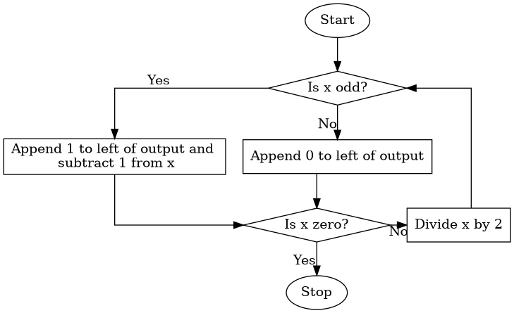

## COMS 261 - Fall 2024


<center>
Jump to: [Syllabus](index.html), [Week 1](#week-1-notes) , [Week 2](#week-2-notes), [Week 3](#week-3-notes), [Week 4](#week-4-notes), [Week 5](#week-5-notes), [Week 6](#week-6-notes), [Week 7](#week-7-notes), [Week 8](#week-8-notes), [Week 9](#week-9-notes), [Week 10](#week-10-notes), [Week 11](#week-11-notes), [Week 12](#week-12-notes), [Week 13](#week-13-notes), [Week 14](#week-14-notes), [Week 15](#week-15-notes)
</center>

### Week 1 Notes

#### Tentative Schedule

Day  | Section  | Topic
:---:|:---:|:-----------------------------------
Mon, Aug 26 | [TP01][TP01], [C2] | Introduction to Python & Thonny
Wed, Aug 28 | [TP02][TP02] | Variables & functions
Thu, Aug 29 | [TP02][TP02] | Statements versus expressions
Fri, Aug 30 | [C2.6][C2.6] | Binary & floating-point numbers

### Mon, Aug 26 

Today we introduced Python and the [Thonny IDE](https://thonny.org/) (Integrated Development Environment). 

We learned how to use the **Python Shell** and how to write Python **scripts**.  We also covered the following:

* **Operators** (like `+`, `-`, `*`, `/`)
* **Types** (like `int`, `float`, and `str`)
* **Variables**
* **Comments** 

We talked about how operators follow an **order of operations**, and if operators have the same level of precedence, then they are computed left to right.  We also talked about how some operators don't work for all types.  For example, the `+` operator concatenates strings, but the `*` operator is not defined for strings. 

We finished by writing a script to calculate the volume of a sphere.

```python
# A script to calculate the volume of a sphere.

PI = 3.14159 

radius = 4

volume = 4 / 3 * PI * radius ** 3

print("The volume of the sphere is:", volume)

```

### Wed, Aug 28 

We talked about which variable names are allowed.  Some words cannot be used as a variable names because they are special Python **keywords**.  There are currently 35 keywords in Python 3.10 (which is the version we are using), and we'll cover most of them in this course.  Other rules for naming variables include:

* Variable names can only contain numbers, letters, and the underscore character `_`.
* A variable name cannot start with a number.

It is recommended to only use lower case letters only in most variable names (except when you want to indicate that the variable is constant and won't ever change, in which case `ALL_CAPS` is recommended). If a variable name has multiple words, then separate the words with an underscore character, like: `surface_area`. 

We also introduced some new functions including `input()`, and the type conversion functions `int()`, `float()`, and `str()`.  <!--Forgot: round() -->


1. Write a script that prompts the user to input a radius.  Then calculate and print both the surface area and volume of a sphere. <!-- Forgot to include: with that radius rounded to 2 decimal places. -->

We finished by talking about how to **import** functions from **modules**.  We imported the `math` module which contains functions familiar math functions like `sin()`, `cos()`, and `sqrt()`.  You can use the command 
`dir(math)` to list all of functions in the `math` module.  

2. How could you tell if the sine and cosine function expect the input in degrees or radians?  Test your idea in the shell and see what the default is. 

3. What happens if you type `math.sin` without an input?

4. What happens if you enter `help(math.sin)`?

5. What does the `degrees()` function do? 

6. Write a program to calculate the roots of a quadratic polynomial $a x^2 + bx + c$ using the quadratic formula
$$x = \frac{-b \pm \sqrt{b^2 - 4ac}}{2a}.$$

### Thu, Aug 29

Today we talked about some of the errors that came up in the quadratic formula programs from yesterday.  There are three categories of errors in Python.

#### Types of Errors

* **Syntax errors** are errors in the structure of the program that the computer can detect before running the code. Examples include mismatched parentheses, or incomplete lines of code. 
* **Runtime errors** are errors that occur while the program is running. This category include **type errors** where the computer tries to use a function or operator with a variable or expression of the wrong type. 
* **Semantic errors** happen when the program runs without an error message, but the output is incorrect.

Keep in mind that syntax refers to the structure and grammar of a program, while semantics refers to its meaning.  Computers are very picky about syntax, but they are completely oblivious to semantics. 

#### Statements versus Expressions

The first error we looked at was this incorrect line of code:

```python
(x1 = (-b + math.sqrt(b ** 2 - 4 * a * c)) / (2 * a))
```

To explain this error, we talked about the difference between statements and expressions in Python.  

* A **statement** is a piece of code that does something.  
* An **expression** is a piece of code that has a value.  

Every expression is a statement, but not vice versa.  In Python, every valid line of code is a statement.

```python
# Example statements
import math
a = 5.0
b = 3 + a
print("Hello")

# Example expressions
1+1
5.0
(-b + math.sqrt(b ** 2 - 4 * a * c)) / (2 * a)
```

Notice that statements can include expressions.  A special kind of statement is an **assignment statement** where you assign a value to a variable.  Every assignment statement has the form:

```python
variable_name = # some expression
``` 

You can always wrap an expression in parentheses, and it will still be an expression with the same value.  But, the reason the line of code `(x1 = (-b + math.sqrt(b ** 2 - 4 * a * c)) / (2 * a))` is not correct is that an assignment statement is not an expression, and cannot be wrapped in parentheses.  


#### Function Return Values

Some functions return values and some functions don't.  For example, `math.sqrt(4)` returns the value `2.0`, so it can be used as an expression.  But the function `print("Hello")` does not return a value.  The `input()` function returns a string with whatever input the user types.  So you can use an assignment statement like 

```python
a = input("Enter a value for the coefficient a. ")
```

to prompt the user to input a number for `a`.  Be careful, the value that you get will be a string.  You have convert it to a number using the `int()` or `float()` functions before you can use it in a formula. 

### Fri, Aug 30

Today we talked about binary numbers and how Python stores integers and floating point numbers under the hood.  We started by talking about how to convert base-2 numbers to base-10.  We did the following examples. 

1. Convert $(110)_2$ to base-10.

1. Convert $(1111)_2$ to base-10.

1. Convert $(10101)_2$ to base-10.

1. Convert $(10.11)_2$ to base-10.

After that we talked about how to convert base-10 integers to base-2.  That is a little bit harder, so we introduced the **algorithm** below which can be described using a **flow chart**:

<center>
</img>
</center>

5. Use the algorithm above to convert 35 to base-2. 

6. Use the algorithm above to convert 13 to base-2. 

After we introduced binary numbers, we talked about **bits** and how many integers can be stored using $n$ bits.  One example is that the maximum number of rupees (money) you could have in the original Zelda game was 255 because the data was stored using 8 bits.  Unlike a lot of progamming languages, Python allows arbitrarily large integers.  This avoids **integer overflow** errors, but it can be slower for large integers.  

We also talked about how computers store [floating point numbers](https://en.wikipedia.org/wiki/Floating_point).  Most modern programming languages (including Python) store floating point numbers using the [IEEE 754 standard](https://en.wikipedia.org/wiki/IEEE_754). 

{ style="width: 700px" }
{style="width: 700px"}

In the IEEE 754 standard, a 64-bit floating point number has the form 
$$x = (-1)^s * (1.a_1 a_2 \ldots a_{52})_2 * 2^{e - 1023}$$
where 

* $s$ is the 1-bit sign,
* $a_1 a_2 \ldots a_{52}$ is the 52-bit mantissa, and
* $e$ is the 11-bit exponent which ranges from 0 to 2047. Only 1 to 2046 are used for regular floating point numbers, $e=0$ is reserved for zero and [subnormal numbers](https://en.wikipedia.org/wiki/Subnormal_number), and $e=2047$ is reserved for infinity and NaN ("not a number"). 

7. Compare the output you get when you type `2**1024` versus `2.0**1024` in the Python shell. 

8. Compare the output for `2.0**(-1024)` versus `2**(-1070)`.  Notice that you lose precision with small floating point numbers, but you don't get an error the way you do with large floats. 

9. Why do you get an incorrect answer when you enter `0.1+0.1+0.1`?

<!-- Soon: Talk about machine code, vs. assembly vs. C++ vs. python  --> 
<!-- Soon: Talk about binary and modular arithmetic --> 


- - -

### Week 2 Notes

#### Tentative Schedule

Day  | Section  | Topic
:---:|:---:|:-----------------------------------
Mon, Sep 2  | | Labor Day, no class
Wed, Sep 4  | [TP03][TP03] | Functions
Thu, Sep 5  |              | 
Fri, Sep 6  | [TP03][TP03] | For-loops

### Wed, Sep 4 

To create your own functions in Python, use the `def` keyword to define them:

```python
def hello():
    print("Hello!")
```

Every function is a **function object**.  So `function` is a type just like `int`, `float`, and `str`.  When you refer to a function object in Python, there is a difference between the **name** of the function (which is `hello` in the previous example) and the way you **call** the function to get it to run by typing `hello()`. Here is another function example. 

```python
def print_twice(string): # The first line is called the **header**
    print(string) # All of the other lines are called the **body of the function**
    print(string) # Notice that all of the lines of the body must be indented
```

This function has a **parameter** which is the variable called `string` in the parentheses. We you call this function, you need to include an **argument** which is a value for the parameter.  

```python
>>> print_twice("Hello")
Hello
Hello
>>> print_twice(5)
5
5
```

In this example, "Hello" and 5 are arguments.  The variable called `string` in the function is a parameter. Weirdly, when we pass the argument 5 to the function, then the parameter called `string` stores the value 5 which is an integer not a string!  But that is okay, because Python knows how to print integers.   

Functions can have as many parameters as needed. Try to make your own functions to do the following. 

1. Define a function called `sum_of_squares` that adds up the squares of two numbers. 

2. Define a function called `sphere_volume` that calculates the volume of a sphere.  

When you create a function, you should *always* include a docstring that briefly explains what the functions does.  A **docstring** is a comment that is written using triple quotes instead of the hash symbol. Here is an example.

```python
def circle_area(radius):
    """Returns the area of a circle."""
    PI = 3.14159
    return PI * radius ** 2
```

The advantage of a docstring over a regular comment is that it can take up multiple lines. Python style guides recommend using docstrings even for one line descriptions of functions, since you might need to add more explanation later. 

This last example includes a local variable called `PI`.  Any variable created in a function body is **local**, which means it can only be used inside the function.  You won't have access to local variables outside the function.  Variables defined in a program that aren't parameters or defined in the body of a function are **global** an can be accessed anywhere in a program.  


- - - 


### Week 3 Notes

#### Tentative Schedule

Day  | Section  | Topic
:---:|:---:|:-----------------------------------
Mon, Sep 9  |  |
Wed, Sep 11 |  |
Thu, Sep 12 |  |
Fri, Sep 13 |  |

- - -

### Week 4 Notes

#### Tentative Schedule

Day  | Section  | Topic
:---:|:---:|:-----------------------------------
Mon, Sep 16  |  |
Wed, Sep 18  |  |
Thu, Sep 19  |  |
Fri, Sep 20  |  |

- - - 

### Week 5 Notes

#### Tentative Schedule

Day  | Section  | Topic
:---:|:---:|:-----------------------------------
Mon, Sep 23  |  |
Wed, Sep 25  |  |
Thu, Sep 26  |  |
Fri, Sep 27  |  |


- - - 

### Week 6 Notes

#### Tentative Schedule

Day  | Section  | Topic
:---:|:---:|:-----------------------------------
Mon, Sep 30 |  |
Wed, Oct 2  |  | Review
Thu, Oct 3  |  | **Midterm 1**
Fri, Oct 4  |  |

- - - 

### Week 7 Notes

#### Tentative Schedule

Day  | Section  | Topic
:---:|:---:|:-----------------------------------
Mon, Oct 7   |  |
Wed, Oct 9   |  | 
Thu, Oct 10  |  | 
Fri, Oct 11  |  | 

- - - 

### Week 8 Notes

#### Tentative Schedule

Day  | Section  | Topic
:---:|:---:|:-----------------------------------
Mon, Oct 14  |            | Fall break, no class
Wed, Oct 16  |  |
Thu, Oct 17  |  |
Fri, Oct 18  |  |


- - - 

### Week 9 Notes

#### Tentative Schedule

Day  | Section  | Topic
:-----:|:---:|:-----------------------
Mon, Oct 21  |  |
Wed, Oct 23  |  |
Thu, Oct 24  |  |
Fri, Oct 25  |  |

- - - 

### Week 10 Notes

#### Tentative Schedule

Day  | Section  | Topic
:-----:|:---:|:-----------------------
Mon, Oct 28  |  | 
Wed, Oct 30  |  | 
Thu, Oct 31  |  | 
Fri, Nov 1   |  |


- - - 

### Week 11 Notes

#### Tentative Schedule

Day  | Section  | Topic
:-----:|:---:|:-----------------------
Mon, Nov 4  |            | 
Wed, Nov 6  |            | 
Thu, Nov 7  |            | 
Fri, Nov 8  |  |

- - - 

### Week 12 Notes

#### Tentative Schedule

Day  | Section  | Topic
:-----:|:---:|:-----------------------
Mon, Nov 11 |  |
Wed, Nov 13 |  |
Thu, Nov 14 |  |
Fri, Nov 15 |  |

- - - 

### Week 13 Notes

#### Tentative Schedule

Day  | Section  | Topic
:-----:|:---:|:-----------------------
Mon, Nov 18  |  |
Wed, Nov 20  |  | Review
Thu, Nov 21  |  | **Midterm 2**
Fri, Nov 22  |  |


- - - 

### Week 14 Notes

#### Tentative Schedule

Day  | Section  | Topic
:---:|:---:|:---------
Mon, Nov 25  |  |
Wed, Nov 27  |  | Thanksgiving break, no class
Fri, Nov 29  |  | Thanksgiving break, no class


- - - 

### Week 15 Notes

#### Tentative Schedule

Day  | Section  | Topic
:---:|:---:|:---------
Mon, Dec 2  |  | 
Wed, Dec 4  |  | 
Thu, Dec 5  |  | 
Fri, Dec 6  |  |
Mon, Dec 9  |  | 


- - - 

[TP01]: <https://allendowney.github.io/ThinkPython/chap01.html>
[TP02]: <https://allendowney.github.io/ThinkPython/chap02.html>
[TP03]: <https://allendowney.github.io/ThinkPython/chap03.html>
[TP04]: <https://allendowney.github.io/ThinkPython/chap04.html>
[TP05]: <https://allendowney.github.io/ThinkPython/chap05.html>
[TP06]: <https://allendowney.github.io/ThinkPython/chap06.html>
[TP07]: <https://allendowney.github.io/ThinkPython/chap07.html>
[TP08]: <https://allendowney.github.io/ThinkPython/chap08.html>
[TP09]: <https://allendowney.github.io/ThinkPython/chap09.html>
[TP10]: <https://allendowney.github.io/ThinkPython/chap10.html>
[TP11]: <https://allendowney.github.io/ThinkPython/chap11.html>
[TP12]: <https://allendowney.github.io/ThinkPython/chap12.html>
[TP13]: <https://allendowney.github.io/ThinkPython/chap13.html>
[TP14]: <https://allendowney.github.io/ThinkPython/chap14.html>
[TP15]: <https://allendowney.github.io/ThinkPython/chap15.html>
[TP16]: <https://allendowney.github.io/ThinkPython/chap16.html>
[TP17]: <https://allendowney.github.io/ThinkPython/chap17.html>
[TP18]: <https://allendowney.github.io/ThinkPython/chap18.html>
[TP19]: <https://allendowney.github.io/ThinkPython/chap19.html>


[C2]: <https://people.hsc.edu/faculty-staff/blins/books/CafieroPython.pdf#chapter.2>
[C3]: <https://people.hsc.edu/faculty-staff/blins/books/CafieroPython.pdf#chapter.3>
[C4]: <https://people.hsc.edu/faculty-staff/blins/books/CafieroPython.pdf#chapter.4>
[C5]: <https://people.hsc.edu/faculty-staff/blins/books/CafieroPython.pdf#chapter.5>
[C6]: <https://people.hsc.edu/faculty-staff/blins/books/CafieroPython.pdf#chapter.6>
[C7]: <https://people.hsc.edu/faculty-staff/blins/books/CafieroPython.pdf#chapter.7>
[C8]: <https://people.hsc.edu/faculty-staff/blins/books/CafieroPython.pdf#chapter.8>
[C9]: <https://people.hsc.edu/faculty-staff/blins/books/CafieroPython.pdf#chapter.9>
[C10]: <https://people.hsc.edu/faculty-staff/blins/books/CafieroPython.pdf#chapter.10>
[C11]: <https://people.hsc.edu/faculty-staff/blins/books/CafieroPython.pdf#chapter.11>
[C12]: <https://people.hsc.edu/faculty-staff/blins/books/CafieroPython.pdf#chapter.12>
[C13]: <https://people.hsc.edu/faculty-staff/blins/books/CafieroPython.pdf#chapter.13>
[C14]: <https://people.hsc.edu/faculty-staff/blins/books/CafieroPython.pdf#chapter.14>
[C15]: <https://people.hsc.edu/faculty-staff/blins/books/CafieroPython.pdf#chapter.15>
[C16]: <https://people.hsc.edu/faculty-staff/blins/books/CafieroPython.pdf#chapter.16>
[C17]: <https://people.hsc.edu/faculty-staff/blins/books/CafieroPython.pdf#chapter.17>

[C2.6]: <https://people.hsc.edu/faculty-staff/blins/books/CafieroPython.pdf#section.2.6>

<br>
<br>
<br>
<br>
<br>
<br>
<br>
<br>
