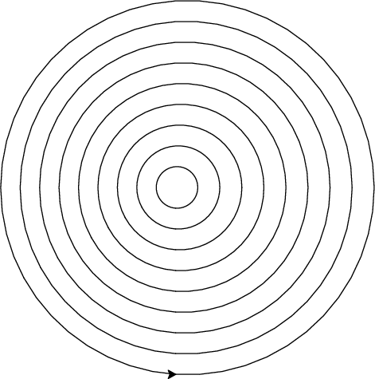

## COMS 261 - Fall 2024


<center>
Jump to: [Syllabus](index.html), [Week 1](#week-1-notes) , [Week 2](#week-2-notes), [Week 3](#week-3-notes), [Week 4](#week-4-notes), [Week 5](#week-5-notes), [Week 6](#week-6-notes), [Week 7](#week-7-notes), [Week 8](#week-8-notes), [Week 9](#week-9-notes), [Week 10](#week-10-notes), [Week 11](#week-11-notes), [Week 12](#week-12-notes), [Week 13](#week-13-notes), [Week 14](#week-14-notes), [Week 15](#week-15-notes)
</center>

### Week 1 Notes

#### Tentative Schedule

Day  | Section  | Topic
:---:|:---:|:-----------------------------------
Mon, Aug 26 | [TP01][TP01], [C2] | Introduction to Python & Thonny
Wed, Aug 28 | [TP02][TP02] | Variables & functions
Thu, Aug 29 | [TP02][TP02] | Statements versus expressions
Fri, Aug 30 | [C2.6][C2.6] | Binary & floating-point numbers

### Mon, Aug 26 

Today we introduced Python and the [Thonny IDE](https://thonny.org/) (Integrated Development Environment). 

We learned how to use the **Python Shell** and how to write Python **scripts**.  We also covered the following:

* **Operators** (like `+`, `-`, `*`, `/`)
* **Types** (like `int`, `float`, and `str`)
* **Variables**
* **Comments** 

We talked about how operators follow an **order of operations**, and if operators have the same level of precedence, then they are computed left to right.  We also talked about how some operators don't work for all types.  For example, the `+` operator concatenates strings, but the `*` operator is not defined for strings. 

We finished by writing a script to calculate the volume of a sphere.

```python
# A script to calculate the volume of a sphere.

PI = 3.14159 

radius = 4

volume = 4 / 3 * PI * radius ** 3

print("The volume of the sphere is:", volume)

```

### Wed, Aug 28 

We talked about which variable names are allowed.  Some words cannot be used as a variable names because they are special Python **keywords**.  There are currently 35 keywords in Python 3.10 (which is the version we are using), and we'll cover most of them in this course.  Other rules for naming variables include:

* Variable names can only contain numbers, letters, and the underscore character `_`.
* A variable name cannot start with a number.

It is recommended to only use lower case letters only in most variable names (except when you want to indicate that the variable is constant and won't ever change, in which case `ALL_CAPS` is recommended). If a variable name has multiple words, then separate the words with an underscore character, like: `surface_area`. 

We also introduced some new functions including `input()`, and the type conversion functions `int()`, `float()`, and `str()`.  <!--Forgot: round() -->


1. Write a script that prompts the user to input a radius.  Then calculate and print both the surface area and volume of a sphere. <!-- Forgot to include: with that radius rounded to 2 decimal places. -->

We finished by talking about how to **import** functions from **modules**.  We imported the `math` module which contains functions familiar math functions like `sin()`, `cos()`, and `sqrt()`.  You can use the command 
`dir(math)` to list all of functions in the `math` module.  

2. How could you tell if the sine and cosine function expect the input in degrees or radians?  Test your idea in the shell and see what the default is. 

3. What happens if you type `math.sin` without an input?

4. What happens if you enter `help(math.sin)`?

5. What does the `degrees()` function do? 

6. Write a program to calculate the roots of a quadratic polynomial $a x^2 + bx + c$ using the quadratic formula
$$x = \frac{-b \pm \sqrt{b^2 - 4ac}}{2a}.$$

### Thu, Aug 29

Today we talked about some of the errors that came up in the quadratic formula programs from yesterday.  There are three categories of errors in Python.

#### Types of Errors

* **Syntax errors** are errors in the structure of the program that the computer can detect before running the code. Examples include mismatched parentheses, or incomplete lines of code. 
* **Runtime errors** are errors that occur while the program is running. This category include **type errors** where the computer tries to use a function or operator with a variable or expression of the wrong type. 
* **Semantic errors** happen when the program runs without an error message, but the output is incorrect.

Keep in mind that syntax refers to the structure and grammar of a program, while semantics refers to its meaning.  Computers are very picky about syntax, but they are completely oblivious to semantics. 

#### Statements versus Expressions

The first error we looked at was this incorrect line of code:

```python
(x1 = (-b + math.sqrt(b ** 2 - 4 * a * c)) / (2 * a))
```

To explain this error, we talked about the difference between statements and expressions in Python.  

* A **statement** is a piece of code that does something.  
* An **expression** is a piece of code that has a value.  

Every expression is a statement, but not vice versa.  In Python, every valid line of code is a statement.

```python
# Example statements
import math
a = 5.0
b = 3 + a
print("Hello")

# Example expressions
1+1
5.0
(-b + math.sqrt(b ** 2 - 4 * a * c)) / (2 * a)
```

Notice that statements can include expressions.  A special kind of statement is an **assignment statement** where you assign a value to a variable.  Every assignment statement has the form:

```python
variable_name = # some expression
``` 

You can always wrap an expression in parentheses, and it will still be an expression with the same value.  But, the reason the line of code `(x1 = (-b + math.sqrt(b ** 2 - 4 * a * c)) / (2 * a))` is not correct is that an assignment statement is not an expression, and cannot be wrapped in parentheses.  


#### Function Return Values

Some functions return values and some functions don't.  For example, `math.sqrt(4)` returns the value `2.0`, so it can be used as an expression.  But the function `print("Hello")` does not return a value.  The `input()` function returns a string with whatever input the user types.  So you can use an assignment statement like 

```python
a = input("Enter a value for the coefficient a. ")
```

to prompt the user to input a number for `a`.  Be careful, the value that you get will be a string.  You have convert it to a number using the `int()` or `float()` functions before you can use it in a formula. 

### Fri, Aug 30

Today we talked about binary numbers and how Python stores integers and floating point numbers under the hood.  We started by talking about how to convert base-2 numbers to base-10.  We did the following examples. 

1. Convert $(110)_2$ to base-10.

1. Convert $(1111)_2$ to base-10.

1. Convert $(10101)_2$ to base-10.

1. Convert $(10.11)_2$ to base-10.

After that we talked about how to convert base-10 integers to base-2.  That is a little bit harder, so we introduced the **algorithm** below which can be described using a **flow chart**:

<center>
</img>
</center>

5. Use the algorithm above to convert 35 to base-2. 

6. Use the algorithm above to convert 13 to base-2. 

After we introduced binary numbers, we talked about **bits** and how many integers can be stored using $n$ bits.  One example is that the maximum number of rupees (money) you could have in the original Zelda game was 255 because the data was stored using 8 bits.  Unlike a lot of progamming languages, Python allows arbitrarily large integers.  This avoids **integer overflow** errors, but it can be slower for large integers.  

We also talked about how computers store [floating point numbers](https://en.wikipedia.org/wiki/Floating_point).  Most modern programming languages (including Python) store floating point numbers using the [IEEE 754 standard](https://en.wikipedia.org/wiki/IEEE_754). 

{ style="width: 700px" }
{style="width: 700px"}

In the IEEE 754 standard, a 64-bit floating point number has the form 
$$x = (-1)^s * (1.a_1 a_2 \ldots a_{52})_2 * 2^{e - 1023}$$
where 

* $s$ is the 1-bit sign,
* $a_1 a_2 \ldots a_{52}$ is the 52-bit mantissa, and
* $e$ is the 11-bit exponent which ranges from 0 to 2047. Only 1 to 2046 are used for regular floating point numbers, $e=0$ is reserved for zero and [subnormal numbers](https://en.wikipedia.org/wiki/Subnormal_number), and $e=2047$ is reserved for infinity and NaN ("not a number"). 

7. Compare the output you get when you type `2**1024` versus `2.0**1024` in the Python shell. 

8. Compare the output for `2.0**(-1024)` versus `2**(-1070)`.  Notice that you lose precision with small floating point numbers, but you don't get an error the way you do with large floats. 

9. Why do you get an incorrect answer when you enter `0.1+0.1+0.1`?

<!-- Soon: Talk about machine code, vs. assembly vs. C++ vs. python  --> 
<!-- Soon: Talk about binary and modular arithmetic --> 


- - -

### Week 2 Notes

#### Tentative Schedule

Day  | Section  | Topic
:---:|:---:|:-----------------------------------
Mon, Sep 2  | | Labor Day, no class
Wed, Sep 4  | [TP03][TP03] | Functions
Thu, Sep 5  | [TP03][TP03] | For-loops
Fri, Sep 6  | [TP04][TP04] | Turtle graphics

### Wed, Sep 4 

To create your own functions in Python, use the `def` keyword to define them:

```python
def hello():
    print("Hello!")
```

Every function is a **function object**.  So `function` is a type just like `int`, `float`, and `str`.  When you refer to a function object in Python, there is a difference between the **name** of the function (which is `hello` in the previous example) and the way you **call** the function to get it to run by typing `hello()`. Here is another function example. 

```python
def print_twice(string): # The first line is called the **header**
    print(string) # All of the other lines are called the **body of the function**
    print(string) # Notice that all of the lines of the body must be indented
```

This function has a **parameter** which is the variable called `string` in the parentheses. We you call this function, you need to include an **argument** which is a value for the parameter.  

```python
>>> print_twice("Hello")
Hello
Hello
>>> print_twice(5)
5
5
```

In this example, "Hello" and 5 are arguments.  The variable called `string` in the function is a parameter. Weirdly, when we pass the argument 5 to the function, then the parameter called `string` stores the value 5 which is an integer not a string!  But that is okay, because Python knows how to print integers.   

Functions can have as many parameters as needed. Try to make your own functions to do the following. 

1. Define a function called `sum_of_squares` that adds up the squares of two numbers. 

2. Define a function called `sphere_volume` that calculates the volume of a sphere.  

When you create a function, you should *always* include a docstring that briefly explains what the functions does.  A **docstring** is a comment that is written using triple quotes instead of the hash symbol. Here is an example.

```python
def circle_area(radius):
    """Returns the area of a circle."""
    PI = 3.14159
    return PI * radius ** 2
```

The advantage of a docstring over a regular comment is that it can take up multiple lines. Python style guides recommend using docstrings even for one line descriptions of functions, since you might need to add more explanation later. 

This last example includes a local variable called `PI`.  Any variable created in a function body is **local**, which means it can only be used inside the function.  You won't have access to local variables outside the function.  Variables defined in a program that aren't parameters or defined in the body of a function are **global** an can be accessed anywhere in a program.  

We finished with a function that calls another function in its body:

```python
def cylinder_volume(radius, height):
    """Returns the volume of a cylinder."""
    return circle_area(radius) * height
```

### Thu, Sep 5

Today we introduced **for-loops**. We started with two example functions to demonstrate how they work. 

```python
def box(n):
    """Prints an n-by-n square made of * symbols."""
    for i in range(n):
        print("*" * i)

def print_numbers(n):
    """Print the first n positive numbers."""
    for i in range(1,n+1):
        print(i)
```

Notice that the `range` function can accept up to three arguments (`start`, `stop`, and `step).  We talked about how Python is **zero-indexed**. For the `range` function, this means that be default it starts counting at zero, so it always stops before the value of the `stop` parameter. We did these exercises. 

1. Write a function to print the first n perfect squares (i.e., 1, 4, 9, 16, etc.)

2. Write a function to print a triangle with n rows like this:

        *
        **
        ***
        ****

3. Write a function to print an upside down triangle with n rows:

        ****
        ***
        **
        *

4. Write a function to print a hollow n-by-n square, like this example when n is 4:

        ****
        *  *
        *  *
        ****

We finished by talking about **accumulator variables** in loops.  I showed this example.

```python
def sum_of_squares(n):
    """Returns the sum of the first n perfect squares."""
    total = 0 # total is an accumulator variable
    for i in range(1,n+1):
        total += i ** 2
    return total
```

5. Write a function that uses a for-loop with an accumulator variable to multiply the numbers 1, 2, ..., n. In other words, write a function to compute the factorial of n. 

### Fri, Sep 6

Today we played with [turtle graphics](https://en.wikipedia.org/wiki/Turtle_graphics) using the `turtle` module in Python.  We started by creating a turtle object we called `fred` and then using `fred` to draw a square. We ended up creating several functions using `fred` to draw different kinds of shapes. 

```python
import turtle

fred = turtle.Turtle()

def polygon(side_length, n):
    """Draw a polygon with n sides."""
    for i in range(n):
        fred.forward(side_length)
        fred.left(360 / n)

def circle(radius):
    """Draw a circle."""
    side_length = 2 * 3.14159 * radius / 50
    polygon(side_length, 50)
```

We finished with some excercises using these funtions. 

1. Draw a picture like this one. 

<center>
</img>
</center>

2. Write a function to draw a bullseye with n rings, like this:

<center>
</img>
</center>

- - - 


### Week 3 Notes

#### Tentative Schedule

Day  | Section  | Topic
:---:|:---:|:-----------------------------------
Mon, Sep 9  | [TP05][TP05] | Conditional statements
Wed, Sep 11 | [TP05][TP05] | Boolean expressions
Thu, Sep 12 |  | 
Fri, Sep 13 |  |

### Mon, Sep 9

Today we talked about how to implement **conditional** statements using the keywords **if**, **then**, and **else** in Python.  We started with some simple examples.  

1. Body mass index is a quantity used to determine if people are a healthy weight or overweight.  The formula for someone's body mass index is

    ```python
    BMI = (weight / height**2) * 703
    ```

Anyone with a BMI of 25 or more is considered overweight.  Write a program to calculate someone's BMI and then use an if-then statement to determine if they are overweight.     

2. If someone's BMI is less than 18.5, they are considered underweight.  Write a function called `weight_category(height, weight)` that returns one of three possible strings: healthy, underweight, or overweight, depending on the corresponding BMI. 

3. Adapt the program to add a fourth category: obese which is anyone with a BMI greater than or equal to 30. 

In order to use an if-statement, we need a special kind of expression that is either true or false.  These are called **boolean expressions**.  Python has a special type called `bool` that has only two possible values, `True` or `False`.  

4. Write a function that checks if someone typed in the correct password (`banana7`).  Your function should return a boolean value. 

So far we have introduced the following boolean operators (`==`, `<`, `>`, `<=`, and `>=`). Another important boolean operator is `!=` which is `True` when two expressions are not equal and `False` if they are equal. 

Another really handy operator is the keyword `in` which can test whether one string is inside another.  

5. Which of the following strings are inside `"The quick brown fox"`?  

    a. `"quick"`
    b. `"Fox"`
    c. `"Tqbf"`
    d. `"brown fox"`
    e. `"he qu"`

### Wed, Sep 11

There was no class since I was out with COVID.  I recommended watching part of one of the Harvard CS50 with Python online lectures for more about conditionals and boolean expressions. 

* **Video**: [Harvard CS50 Python - Lecture 1](https://youtu.be/_b6NgY_pMdw?list=PLhQjrBD2T3817j24-GogXmWqO5Q5vYy0V&t=1110)

### Thu, Sep 12

I sent out some tips and questions to think about when working on project 2:

* [Project 2 Tips](project2tips.pdf)

- - -

### Week 4 Notes

#### Tentative Schedule

Day  | Section  | Topic
:-----:|:---:|:-----------------------
Mon, Sep 16  | [TP05][TP05] | Integer division and modulus
Wed, Sep 18  | [C11][C11] | While-loops
Thu, Sep 19  | [C11][C11] | While-loops con'd
Fri, Sep 20  | [TP05](https://allendowney.github.io/ThinkPython/chap05.html#recursion) | Recursion


### Mon, Sep 16

Today we talked about the **integer division** operator `//` and the **remainder** or **modulo** operator `%` in Python. We used them to do these exercises:

1. Today is Monday, Sep 16.  What day of the week will Oct 16th be (without looking at a calendar)? What about Nov 16?  

2. Write a program to convert any number of minutes into hours and minutes.  For example, 100 minutes is 1 hour and 40 minutes. We used this example to introduce [f-strings](https://peps.python.org/pep-0498/) to help print the answer.  

```python 
def time_conversion(minutes): 
    hours = minutes // 60
    minutes = minutes % 60
    print(f"There are {hours} hours and {minutes} minutes.")
```

3. Improve the program to convert minutes into days, hours, and minutes.  For example, 1590 minutes should be 1 day, 2 hours, and 30 minutes. 

4. Write a program to make change using the fewest coins possible for any amount of money less than \$1.00. For example, 63¢ could be 2 quarters, 1 dime, and 3 pennies.  

<!--
5. Write a program to do [fizz buzz](https://en.wikipedia.org/wiki/Fizz_buzz).
-->

### Wed, Sep 18 

Today we introduced **while-loops**.  A while-loop is an alternative to a for-loop that is often useful when you don't know how many steps you need to repeat.  We did the following examples.  

1. Use a while loop to find and print all [Fibonacci numbers]() less than $n$.  

2. Write a while loop to repeat a string until the total length is more than $n$. 

3. Change the following function so that it uses a while-loop instead of a for-loop:

    ```python
    def countdown(n):
        """Count down from an integer n, printing each number.  When you get to zero, print 'Go!'"""
        for i in range(n, 0, -1):
            print(i)
        print("Go!")
    ```

    <details>
    ```python
    def countdown(n):
        """Count down from an integer n, printing each number.  When you get to zero, print 'Go!'"""
        while n > 0:
            print(n)
            n -= 1
        print("Go!")
    ```
    </details>


4. Write a function called `get_valid_input()` that prompts the user to enter an positive even integer.  If the user doesn't enter a positive even integer, have the program prompt the user again until they enter a valid input. 

<!--
After that, we talked about [Euclid's algorithm](https://en.wikipedia.org/wiki/Euclidean_algorithm) for finding the greatest common divisor (GCD) of two integers.  The algorithm is based on two simple observations. 

1. If `a` and `b` are both even, then `a % b` is also even.  More generally, if `a` and `b` have any common divisor `d`, then `a % b` is also divisible by `d`.   

2. If `a > b > 0`, then `b > a % b`. 

Here is the algorithm:

<pre>
    <b>Euclid's GCD Algorithm</b>
    <b>Input:</b> Positive integers a and b
    <b>Output:</b> Returns the GCD of a and b
    <b>while</b> b is not 0 <b>do</b>
        Find the remainder of a divided by b
        Let a equal b
        Let b equal the remainder 
    <b>end</b>
    The GCD is a
</pre>
-->

### Thu, Sep 19

Today we talked about while-loops again.  We started with this example, which improves on the `get_valid_input()` function from yesterday and also introduces the idea of a `while True` loop.  

```python 
def get_valid_input():
    while True:
        n = int(input("Enter a positive even number: "))
        if n > 0 and n % 2 == 0:
            return n
        else: 
            print("That isn't a positive even number.  Try again.")
            
user_input = get_valid_input()
print("You entered", user_input)
```

After that we implemented the [Babylonian algorithm](https://en.wikipedia.org/wiki/Methods_of_computing_square_roots#Heron's_method) for finding square roots. 

```python
def sqrt(a, accuracy = 10 ** (-12)):
    """Uses the Babylonian algorithm to find the square root of a"""
    x = a
    while abs(x**2 - a) > accuracy:
        x = (x + a/x) / 2
    return x
```

When we wrote this example, we talked about why you should not use `==` or `!=` on floating point numbers.  We also introduced the idea of **default parameters**. 

### Fri, Sep 20 

Today we did some more practice with while-loops.  

1. Write a function that uses a while-loop to print all of the numbers from 1 to 100.  

2. Write a while-loop to play a number guessing game.  Use the `random.randint(1,10)` function by importing the `random` library to generate a random integer from 1 to 10.  Then have the user guess the number until they get it right.  

<!-- 3. Add a prize to the number guessing game, where you get $5 if you get it right the first time, and the $1 less each additional try. When they finish, you should print how much money the won. -->

After that, we talked about **recursive functions** which are functions that call themselves.  You can use recursive functions to repeat code in much the same way as loops.  We did the following examples.  

3. Write a recursive version of the `countdown(n)` function.  

    ```python
    def countdown(n):
        """Prints the numbers from n down to 1, then prints 'Go!'"""
        print(n)
        n -= 1
        if n > 0:
            countdown(n)
        else:
            print("Go!")
    ```

4. Re-write the number guessing game using a recursive function instead of a while-loop.

5. **Challenge.** Write a recursive function to print the Fibonacci numbers less than $n$. <!-- Note to self... it is much easier to write a recursive function to generate the first n Fibonacci numbers... -->

- - - 

### Week 5 Notes

#### Tentative Schedule

Day  | Section  | Topic
:-----:|:---:|:-----------------------
Mon, Sep 23  | [TP06](https://allendowney.github.io/ThinkPython/chap06.html#recursion-with-return-values) | Recursion with return values
Wed, Sep 25  | [docs](https://docs.python.org/3/library/stdtypes.html#sequence-types-list-tuple-range) | Sequence types
Thu, Sep 26  | [C10.1][C10.1] | Lists
Fri, Sep 27  | [TP09][TP09] | Lists

### Mon, Sep 23

We looked at some more examples of recursive functions. 

1. Write a function to recursively find the n-th Fibonacci number. 

2. Write a function to recursively print all Fibonacci numbers less than $m$.  

3. Write a `factorial(n)` function. 

<!--
3. Make a flow chart for the algorithm to find the prime factors of a positive integer. 

4. Implement the algorithm above using a recursive function. The function should print each prime factor as they are found.  
-->

We also talked about **input validation** and we introduced the `isinstance(obj, type)` function. 

```python
# We used this conditional in class
if not isinstance(n, int):
    print("n is not an integer.")

# Here is an alternative that also works
if type(n) != int:
    print("n is not an integer.")
```

### Wed, Sep 25

Today we did more practice with loops and recursion.  We reviewed how to find the prime factorization of any integer greater than 1.  We spent the class on these exercises.

1. What are the prime factors of 836? 

2. Write a program to print the prime factors of any integer greater than 1. 

After that, we talked about **lists** in Python.  Lists are a type the can store more than one value.  We introduced how to define a list using square brackets (including an empty list) and how to create a new list by adding two lists together.  We finished with these exercises.

3. Re-write your prime factors program so that it returns a list of prime factors instead of printing them. 

4. Write a function that prompts a user to enter a list of integers.  After each integer the user enters, ask them if they are done or not.  Have them enter an upper or lowercase letter Y if the answer is yes.  Once the user is done, the function should return the list. 

<!-- Save this for later:
We also talked about how to loop through all of the values in a list.  The same technique also works for strings. 

3. Write a program that generates a list of all prime numbers less than n.  
-->

### Thu, Sep 26

<!--
We started with this exercise from yesterday:

1. Write a function that prompts a user to enter a list of integers.  After each integer the user enters, ask them if they are done or not.  Have them enter an upper or lowercase letter Y if the answer is yes.  Once the user is done, the function should return the list. 
-->

We talked about some of the similarities between lists and strings.  They are both **sequence types**.  So they both have a length which you can find using the `len` function.  You can access individual elements in any sequence type by using their **index** which is their position in the sequence.  The first element has index 0 and the last has index equal to the length minus one.  

1. Write a function that prints every other character in a string. 

2. Write a function called `is_integer_string(s)` that returns true if `s` is a string with only the digits 0 through 9 as characters.  


3. Write a function called `even_elements(numbers)` that (i) counts the number of even integers in a list and (ii) finds the index of the first even integer.  Have the function print a sentence with both results.  

```python
def even_elements(numbers):
    # You'll need two accumulator variables for this function. 
    # One to count the even elements, and
    # another to save the index of the first even element when you find it.
```


### Fri, Sep 27 

If you don't care about the indices, then there is an even easier way to loop through every element of the sequence.  You can use the following syntax:

```python
example_list = [2,4,6,7,11,14,20]
for n in example_list:
    print(n)
```

Use this new style of for-loop to (re)write some of the functions we talked about last time. 

1. Write an `even_elements(numbers)` function like the one from yesterday using this style of loop. It would be a good idea to use $-1$ as the index of the first even number if there aren't any.    

2. Re-write the `is_integer_string(s)` function using this style of list.  To make this one more interesting, we first created a function called `is_digit_char(c)` that returns `True` if and only if `c` is a length 1 string that consists of one of the ten digits 0 though 9. 

3. Write a function `any_divisors(n, divs)` that accepts an integer `n` and a list of nonzero integers `divs`, and returns true if any of the elements of `divs` are a divisor of `n`. 


- - - 

### Week 6 Notes

#### Tentative Schedule

Day  | Section  | Topic
:-----:|:---:|:-----------------------
Mon, Sep 30 |  [TP08][TP08] | Strings
Wed, Oct 2  |  | Review
Thu, Oct 3  |  |
Fri, Oct 4  |  | **Midterm 1**

### Mon, Sep 30

We started talking about **slices** of strings and lists. We also talked about **methods** and in particular the `.index()` method and the `.count()` method. Every sequence type has these two methods.  

1. How would you slice the string `s = "The quick brown fox"` to get the word `"quick"`?

2. Write a function that counts how often each vowel (a, e, i, o, u) occurs in a string and prints the results.  It helps to use the `.lower()` method for strings which returns a new string that is all lower case.  This let us talk about **method chaining** when you call methods like this: `x.method1().method2()`. 

3. Write a function called `split_at(s, char)` that splits a string into a list with two strings.  The part before the first occurrence of `char` and the part after the first occurrence.  Then re-write this function to split the string at every occurrence of `char` and return a list of all sub-strings. 

    ```python
    def split_at(s, char):
        """Returns a list of the substrings of s that are separated by char."""
        output = []
        while char in s:
            location = s.index(char)
            front = s[0:location]
            output += [front]
            s = s[location+1:] 
        return output + [s] # Notice that the last substring in s 
                            # will have to be added at the end.
    ``` 

### Wed, Oct 2

Today we talked about how to **trace** a program with paper and pencil including a **stack diagram** for recursive functions.  We started with the recursive function from [problem 11 on the practice midterm](practicemidterm1.pdf).  Then we did these other examples. 

1. Make a table to trace the values of the variables in this loop. 

    ```python
    n = 1
    for i in range(5):
        a = n * i
        n = n + a
    ```

2. Make a stack diagram to trace this recursive function.

    ```python
    def result(n):
        if n == 1:
            return 2
        else:
            return 2 * result(n - 1)
    ```

3. Make a stack diagram to trace this recursive function.

    ```python
    def f(k, n):
        if k == n:
            return k
        elif k < n:
            return f(k, n - k)
        else:
            return f(k - n, n)
    ```

We also talked about how to work with nested lists, including this example:

```python
students = [
    ["Charlie", 8], 
    ["Lucy", 9], 
    ["Linus", 7], 
    ["Sally": 6]
]

total = 0
count = len(students)
for i in range(count):
    total += students[i][1]
print("The average age of the students is ", total / count)
```

<!--
Today we talked about things that all sequence types have in common and things that are different between lists in strings.  

```python
example_list = [1,'b',True]
example_string = "Hi!"

# You can access elements in a list or a string by using index notation:
print(example_list[1])
print(example_string[1])


-->


- - - 

### Week 7 Notes

#### Tentative Schedule

Day  | Section  | Topic
:-----:|:---:|:-----------------------
Mon, Oct 7   | [C10.3][C10.3] |  Mutability and immutability
Wed, Oct 9   |  | 
Thu, Oct 10  |  | 
Fri, Oct 11  |  | 

### Mon, Oct 7

Today we talked about a major difference between lists and strings.  Lists are mutable but strings are immutable.  A type in Python is **immutable** if you can change anything about the value without completely creating a new instance. A type is **mutable** if you can modify parts of it without completely replacing it. This is one of the trickier things to understand.  

```python
# You can change an element in a list but not in a string:
example_list[1] = 'B' # now example_list is [1,'B',True]
example_string[1] = 'I' # this is an error.  Strings a are immutable.  
```

There are several methods that work for mutable sequence types like lists, but not for immutable sequences like strings.  These include the `.append()` method which adds an element to the end of a list, the `.pop()` method which removes and element from the end of a list (and returns its value), and the `.sort()` method which changes a list by putting its elements in sorted order.  

```python
# Strings are immutable
s = "You can't touch this!"

"""When you create the string "You can't touch this!", it is frozen in computer mememory.  
You can reassign the variable s, but that doesn't change the string, it just makes s
point to a different object in memory. 
"""

# Lists are mutable.  Changes made to a list will be remembered by the computer.  
a = [1,2,3]

"""Because of the way lists are stored in memory, two variables can refer to the same list
object.  If you make changes to one variable, that will affect the other variable too!  
This only happens with mutable types, so watch out for it.  
"""
b = a
b.append(4)
print(a) # Weird!!!
```

Try these experiments to get a feeling for how this works.

1. Let `a = [1,2,3]` and `b = a + [4]`.  Does that change `a`?  

2. What about `a = [1,2,3]` and `b = a` followed by `b += [4]`?  Does that change `a`?

3. Let `x = "test"` and `y = x` followed by `y += "s"`. Does that change `x`?

Note that adding two lists creates a new list, but the `+=` operator does not!
We finished with a cautionary example about the need to avoid unintended side-effects when working with mutable types:

```python
def average(numbers): 
    n = len(numbers)
    total = 0
    for i in range(n):
        total += numbers.pop()
    return total / n

data = [4, 5, 6]

mean = average(data)
print("The average of", data, "is", mean)
```

Observe that the way we got the numbers to add to the total had the side effect of erasing the data which isn't what we wanted at all!  

- - - 

### Week 8 Notes

#### Tentative Schedule

Day  | Section  | Topic
:-----:|:---:|:-----------------------
Mon, Oct 14  |            | Fall break, no class
Wed, Oct 16  |  |
Thu, Oct 17  |  |
Fri, Oct 18  |  |


- - - 

### Week 9 Notes

#### Tentative Schedule

Day  | Section  | Topic
:-----:|:---:|:-----------------------
Mon, Oct 21  |  |
Wed, Oct 23  |  |
Thu, Oct 24  |  |
Fri, Oct 25  |  |

- - - 

### Week 10 Notes

#### Tentative Schedule

Day  | Section  | Topic
:-----:|:---:|:-----------------------
Mon, Oct 28  |  | 
Wed, Oct 30  |  | 
Thu, Oct 31  |  | 
Fri, Nov 1   |  |


- - - 

### Week 11 Notes

#### Tentative Schedule

Day  | Section  | Topic
:-----:|:---:|:-----------------------
Mon, Nov 4  |            | 
Wed, Nov 6  |            | 
Thu, Nov 7  |            | 
Fri, Nov 8  |  |

- - - 

### Week 12 Notes

#### Tentative Schedule

Day  | Section  | Topic
:-----:|:---:|:-----------------------
Mon, Nov 11 |  |
Wed, Nov 13 |  |
Thu, Nov 14 |  |
Fri, Nov 15 |  |

- - - 

### Week 13 Notes

#### Tentative Schedule

Day  | Section  | Topic
:-----:|:---:|:-----------------------
Mon, Nov 18  |  |
Wed, Nov 20  |  | Review
Thu, Nov 21  |  | **Midterm 2**
Fri, Nov 22  |  |


- - - 

### Week 14 Notes

#### Tentative Schedule

Day  | Section  | Topic
:---:|:---:|:---------
Mon, Nov 25  |  |
Wed, Nov 27  |  | Thanksgiving break, no class
Fri, Nov 29  |  | Thanksgiving break, no class


- - - 

### Week 15 Notes

#### Tentative Schedule

Day  | Section  | Topic
:---:|:---:|:---------
Mon, Dec 2  |  | 
Wed, Dec 4  |  | 
Thu, Dec 5  |  | 
Fri, Dec 6  |  |
Mon, Dec 9  |  | 


- - - 

[TP01]: <https://allendowney.github.io/ThinkPython/chap01.html>
[TP02]: <https://allendowney.github.io/ThinkPython/chap02.html>
[TP03]: <https://allendowney.github.io/ThinkPython/chap03.html>
[TP04]: <https://allendowney.github.io/ThinkPython/chap04.html>
[TP05]: <https://allendowney.github.io/ThinkPython/chap05.html>
[TP06]: <https://allendowney.github.io/ThinkPython/chap06.html>
[TP07]: <https://allendowney.github.io/ThinkPython/chap07.html>
[TP08]: <https://allendowney.github.io/ThinkPython/chap08.html>
[TP09]: <https://allendowney.github.io/ThinkPython/chap09.html>
[TP10]: <https://allendowney.github.io/ThinkPython/chap10.html>
[TP11]: <https://allendowney.github.io/ThinkPython/chap11.html>
[TP12]: <https://allendowney.github.io/ThinkPython/chap12.html>
[TP13]: <https://allendowney.github.io/ThinkPython/chap13.html>
[TP14]: <https://allendowney.github.io/ThinkPython/chap14.html>
[TP15]: <https://allendowney.github.io/ThinkPython/chap15.html>
[TP16]: <https://allendowney.github.io/ThinkPython/chap16.html>
[TP17]: <https://allendowney.github.io/ThinkPython/chap17.html>
[TP18]: <https://allendowney.github.io/ThinkPython/chap18.html>
[TP19]: <https://allendowney.github.io/ThinkPython/chap19.html>


[C2]: <https://people.hsc.edu/faculty-staff/blins/books/CafieroPython.pdf#chapter.2>
[C3]: <https://people.hsc.edu/faculty-staff/blins/books/CafieroPython.pdf#chapter.3>
[C4]: <https://people.hsc.edu/faculty-staff/blins/books/CafieroPython.pdf#chapter.4>
[C5]: <https://people.hsc.edu/faculty-staff/blins/books/CafieroPython.pdf#chapter.5>
[C6]: <https://people.hsc.edu/faculty-staff/blins/books/CafieroPython.pdf#chapter.6>
[C7]: <https://people.hsc.edu/faculty-staff/blins/books/CafieroPython.pdf#chapter.7>
[C8]: <https://people.hsc.edu/faculty-staff/blins/books/CafieroPython.pdf#chapter.8>
[C9]: <https://people.hsc.edu/faculty-staff/blins/books/CafieroPython.pdf#chapter.9>
[C10]: <https://people.hsc.edu/faculty-staff/blins/books/CafieroPython.pdf#chapter.10>
[C11]: <https://people.hsc.edu/faculty-staff/blins/books/CafieroPython.pdf#chapter.11>
[C12]: <https://people.hsc.edu/faculty-staff/blins/books/CafieroPython.pdf#chapter.12>
[C13]: <https://people.hsc.edu/faculty-staff/blins/books/CafieroPython.pdf#chapter.13>
[C14]: <https://people.hsc.edu/faculty-staff/blins/books/CafieroPython.pdf#chapter.14>
[C15]: <https://people.hsc.edu/faculty-staff/blins/books/CafieroPython.pdf#chapter.15>
[C16]: <https://people.hsc.edu/faculty-staff/blins/books/CafieroPython.pdf#chapter.16>
[C17]: <https://people.hsc.edu/faculty-staff/blins/books/CafieroPython.pdf#chapter.17>

[C2.6]: <https://people.hsc.edu/faculty-staff/blins/books/CafieroPython.pdf#section.2.6>
[C10.1]: <https://people.hsc.edu/faculty-staff/blins/books/CafieroPython.pdf#section.10.1>
[C10.3]: <https://people.hsc.edu/faculty-staff/blins/books/CafieroPython.pdf#section.10.3>

<br>
<br>
<br>
<br>
<br>
<br>
<br>
<br>
