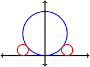
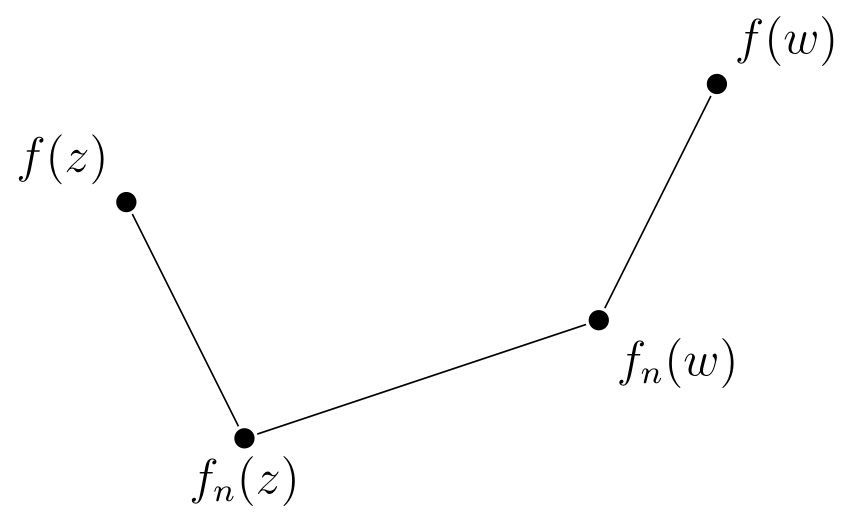

\newcommand{\R}{\mathbb{R}}
\newcommand{\C}{\mathbb{C}}
\newcommand{\N}{\mathbb{N}}
\newcommand{\on}{\operatorname}
\newcommand{\Arg}{\on{Arg}}
\newcommand{\arg}{\on{arg}}
\newcommand{\Log}{\on{Log}}
\newcommand{\re}{\on{Re}}
\newcommand{\im}{\on{Im}}

## Math 444 - Fall 2024


<center>
Jump to: [Syllabus](index.html), [Week 1](#week-1-notes) , [Week 2](#week-2-notes), [Week 3](#week-3-notes), [Week 4](#week-4-notes), [Week 5](#week-5-notes), [Week 6](#week-6-notes), [Week 7](#week-7-notes), [Week 8](#week-8-notes), [Week 9](#week-9-notes), [Week 10](#week-10-notes), [Week 11](#week-11-notes), [Week 12](#week-12-notes), [Week 13](#week-13-notes), [Week 14](#week-14-notes), [Week 15](#week-15-notes)
</center>

### Week 1 Notes

#### Tentative Schedule

Day  | Section  | Topic
:---:|:---:|:-----------------------------------
Mon, Aug 26 | [1.1][1.1] | Definitions and algebraic properties
Wed, Aug 28 | [1.2][1.2] | From algebra to geometry and back
Fri, Aug 30 | [1.3][1.3] | Geometry of complex numbers

### Mon, Aug 26

Today we introduced the complex numbers $\mathbb{C}$ which are a [field](https://en.wikipedia.org/wiki/Field_(mathematics)#Definition).  We defined the **real** and **imaginary** parts of a complex number and also the **absolute value** and **argument** of a complex number.  We did the following examples.

1. Find the real and imaginary parts of $\dfrac{1}{3+4i}$ by rationalizing the denominator. 

2. Factor the polynomial $z^2 + 3iz - 2$.

3. The polynomial $z^2 + 1$ is irreducible over $\R$, but not over $\C$.  Show this by factoring it over $\C$. 

Later in the course we will use complex analysis to prove one of most important theorems in algebra:

<div class="Theorem">
**The Fundamental Theorem of Algebra.** Every polynomial $p(z)$ with coefficients in $\C$ factors into a product of linear expressions of the form $(az + b)$ where $a, b \in \C$. 
</div>

We finished with a discussion of the **polar form** $z = r (\cos \theta + i \sin \theta)$ of a complex number. 

### Wed, Aug 28

Following [Beck et. al.](https://people.hsc.edu/faculty-staff/blins/books/complex.pdf), we will define 
$$e^{i \theta} := \cos \theta + i \sin \theta.$$
Later, when we define the complex exponential function, we will revisit this definition. For now, we will do some calculations that suggest the definition is a good one.

1. Use the [angle addition formulas](https://en.wikipedia.org/wiki/List_of_trigonometric_identities#Angle_sum_and_difference_identities) to show that 
$$(e^{i \alpha}) (e^{i \beta}) = e^{i (\alpha + \beta)}.$$

2. Simplify $\frac{1}{e^{i \theta}}$. 

3. Calculate $\dfrac{d}{d \theta} e^{i \theta}$.  Hint: Use the definition of $e^{i \theta}$ and treat $i$ like any other constant. 

4. What is $(e^{i \theta})^n$?  

5. What is $\sqrt{i}$? 

6. Explain why $\dfrac{d}{d \theta} e^{i \theta} = i e^{i \theta}$ makes sense in the context of the velocity of a point moving counterclockwise along the unit circle. 

After introducing $e^{i\theta}$, we discussed the **n-th roots of unity** which are the complex numbers $z$ such that $z^n = 1$.  They are given by the formula 
$$e^{2 \pi i k/ n} \text{ where } k \in \{0, 1, \ldots, n-1\}.$$
<!--A root of unity $z$ is **primitive** if $z^n = 1$, but $z$ is not an m-th root of unity for any $m \in \N$ less than $n$.  -->

7. Find the 3rd roots of 8.

8. Find the 3rd roots of $\left(\frac{\sqrt{2}}{2} + i \frac{\sqrt{2}}{2} \right)$. 

We finished with a discussion of square and cube roots of complex numbers and how they relate to roots of unity. 
We also defined the **complex conjugate** of $z = a+ib$ to be $\bar{z} = a - ib$. 

<!--6. What is $\bar{e^{i \theta}}$? -->

### Fri, Aug 30

We reviewed some of the useful formulas involving complex conjugates including the following:

* $|z|^2 = z \cdot \bar{z}$

* $\bar{z + w} = \bar{z} + \bar{w}$ and $\bar{ z \cdot w} = \bar{z} \cdot \bar{w}$

* $\re(z) = \frac{z+ \bar{z}}{2}$ and $\im(z) = \frac{z - \bar{z}}{2i}$

We also introduced and proved the **triangle inequality** for complex numbers
$$| z + w | \le |z| + |w|.$$

1. Use the triangle inequality to prove the **reverse triangle inequality** 
$$ | z - w | \ge |z| - |w|$$
by introducing a substitution $u = z - w$.

2. If $|z - w| \le \epsilon$, prove that 
$$\left| \frac{1}{z} - \frac{1}{w} \right| \le \frac{\epsilon}{|z| \, |w|}.$$

A **convex combination** of $z, w \in \C$ is any point 
$$ t z + (1-t) w, ~ 0 \le t \le 1.$$
The set of all convex combinations of $z$ and $w$ is a line segment connecting $z$ to $w$, and the formula for the convex combinations is a parametric formula for the line segment.  If you allow any $t \in \R$, then you get an **affine combination** of $z$ and $w$.  The set of all affine combinations of $z$ and $w$ is line passing through $z$ and $w$.  

- - -

### Week 2 Notes

#### Tentative Schedule

Day  | Section  | Topic
:---:|:---:|:-----------------------------------
Mon, Sep 2  |  | Labor Day, no class
Wed, Sep 4  | [1.4][1.4] | Elementary topology of the plane
Fri, Sep 6  | [1.4][1.4] | Elementary topology of the plane - con'd

### Wed, Sep 4

Let $B_R(z) = \{w \in \C : |z-w| < R\}$ denote the open disk of radius $R$ around $z$.  We used $B_R(z)$ to define **interior** and **boundary** points for a subset of $\C$.  We proved the following trichotomy result

<div class="Theorem"> 
**Theorem.** If $A \subseteq \C$ and $x \in \C$, then exactly one of the following holds.

1. $x$ is an interior point of $A$.
2. $x$ is a boundary point of $A$.
3. $x$ is an interior point of $A^c$ (the complement of $A$). 
</div>

We also defined **open** and **closed** sets, and proved the following theorem. 

<div class="Theorem">
**Theorem.** A set $A \subseteq \C$ is closed if and only if its complement is open. 
</div>

1. If a set is both open and closed, then it can't have any boundary points, since it includes its boundary (because it is closed) but every point is an interior point (because it is open).  Are there any sets with no boundary points? 

<!--
2. Prove the following theorem.

<div class="Theorem">
**Theorem.** The union of any collection of open sets is open and the intersection of a finite collection of open sets is open.  
</div>

3. Find an example to show that the intersection of an infinite collection of open sets isn't always open.
-->

We also defined **bounded** sets.  We finished by talking about **paths** which are continuous functions $\gamma: [a,b] \rightarrow \C$. The range of a path is a subset of $\C$ called a **curve** (note that not all books follow this terminology).  We defined the **derivative of a path**, and discussed how to define a **smooth** path so that it matches our intuition for a curve with no sharp turns.  

2. Why isn't the path $\gamma(t) = t^2 + i t^3$ for $t \in [-1,1]$ smooth?  

A path $\gamma: [a,b] \rightarrow \C$ is **simple** if $\gamma(t_1) \ne \gamma(t_2)$ for all $t_1 \ne t_2$, except possibly at the endpoints $t_1 = a$ and $t_2 = b$. Intuitively, a path is simple if it cannot cross itself, except possibly at the endpoints. A path is **closed** if $\gamma(a) = \gamma(b)$.   

### Fri, Sep 6

A set $A \subseteq \C$ is **path connected** if for any $w, z \in A$, there is a (continuous) path $\gamma: [a,b] \rightarrow A$ such that $\gamma(a) = w$ and $\gamma(b) = z$.  The following theorem seems obvious, but it is actually famously tricky to prove (see <https://en.wikipedia.org/wiki/Jordan_curve_theorem>).   

<div class="Theorem">
**The Jordan Curve Theorem.** The complement of the range of a simple closed curve in $\C$ consists of two disjoint open path connected sets, one of which (the **inside**) is bounded and the other (the **outside**) is not bounded.  
</div>

A **sequence** is a function $s: \N \rightarrow \C$.  We use the notation $s_n$ to mean the same thing as $s(n)$ for sequences.  A sequence $s_n$ **converges** to $L \in \C$ if for every $\epsilon > 0$, there is an $N > 0$ such that $|s_n - L | < \epsilon$ for every $n \ge N$.  Intuitively, this means that for every open disk around $L$, there can only be a finite number of $n$ such that $s_n$ is not in the disk. When a sequence converges, the number it converges to is called its **limit**.  

If we don't know the limit of a sequence, we can still use **Cauchy's criterion** to show that it must converge. A **Cauchy sequence** is a sequence $s_n$ such that for every $\epsilon > 0$, there exists $N > 0$ such that $|s_n - s_m | < \epsilon$ whenever $m, n \ge N$.  

<div class="Theorem">
**Theorem (Cauchy's Criterion).** If $s_n$ is a Cauchy sequence, then it converges to some limit in $\C$.  
</div>

We talked about how the Cauchy criterion applies to sequences of real numbers and the complex numbers, in fact the property that Cauchy sequences converge in a set is known as **completeness** and it is one of the defining properties of the real numbers.  

We used completeness to prove the following theorem about real number sequence:

<div class="Theorem">
**Theorem (Monontone convergence).** If $s_n$ is a sequence of real numbers that is monotone (non-decreasing) and bounded, then it converges.
</div>

We ran out of time, but a related application of completeness is the following result.

<div class="Theorem">
**Theorem.** If $A \subset \C$ and $A^c$ are both nonempty sets, then $A$ has at least one boundary point. 
</div>


- - - 


### Week 3 Notes

#### Tentative Schedule

Day  | Section  | Topic
:---:|:---:|:-----------------------------------
Mon, Sep 9  | [7.1][7.1] | Sequences and completeness
Wed, Sep 11 | [7.2][7.2] | Series
Fri, Sep 13 |  |

### Mon, Sep 9

The complex numbers are a **metric space** because they have a distance function $d(z,w) = |z-w|$ that satisfies the following properties for all $x, y, z \in C$:

1. **Definiteness** $d(x,x) = 0$
2. **Positivity** $d(x,y) > 0$ if $x \ne y$
3. **Symmetry** $d(x,y) = d(y,x)$
4. **Triangle Inequality** $d(x,z) \le d(x,y) + d(y,z)$

It helps when working with absolute values in $\C$ to remember that $|z-w|$ is the distance between $z$ and $w$. We didn't have time for a proof of the last theorem from Friday, so we worked through a proof using the fact that $\C$ is a complete metric space today. Recall that **complete** means that all Cauchy sequences converge. We proved the theorem by proving the following claims:   

1. Any line segment that connects a point in $A$ to a point in $A^c$ contains a line segment that is half as long and also connects a point in $A$ to a point in $A^c$. 

2. The midpoints of the line segments above form a Cauchy sequence.

3. The limit of the midpoints is a boundary point of $A$. 

This proof definitely doesn't work without assuming completeness.  For example, if $A = \{x \in \mathbb{Q} : x < \pi \}$, then $A$ has no boundary points in $\mathbb{Q}$.  After discussing that example, we talked about infinite series. 

A series of complex numbers $\sum_{k = 0}^\infty a_k$ **converges** if its sequence of partial sums $S_n = \sum_{k = 0}^n a_k$ converges.  It helps to know some example infinite series, so we talked about these three:

* **Zeno's series** $\tfrac{1}{2} + \tfrac{1}{4} + \tfrac{1}{8} + \ldots$. 

* **Grandi's series** $1 - 1 + 1 - 1 + 1 - 1 + \ldots$.

* **Harmonic series** $1 + \tfrac{1}{2} + \tfrac{1}{3} + \tfrac{1}{4} + \ldots$. 

Then we reviewed **geometric series** which are series of the form $\sum_{k = 0}^\infty a r^k$ where $a$ is the first term and $r$ is the common ratio.  We proved:

<div class="Theorem">
**Theorem.** A geometric series $\sum_{k = 0}^\infty a r^k$ converges if and only if $|r| < 1$, and in that case
$$\sum_{k = 0}^\infty a r^k = \frac{a}{1-r}.$$
</div>

<!--
It **converges absolutely** if $\sum_{k = 0}^\infty |a_k|$ converges. 

<div class="Theorem">
**Theorem.** If a series converges absolutely, then it converges.  
</div>

1. Prove this theorem by showing that the partial sums of an absolutely converging series are a Cauchy sequence.  

    a. What is the difference of two partial sums $S_n - S_m$? 

    b. Why is $|S_n - S_m|$ small for all $m, n$ large?


-->

### Wed, Sep 11

Class was canceled since I was out with COVID. 

### Fri, Sep 13

* **Workshop**: [Infinite Series](InfiniteSeries.pdf)


- - -

### Week 4 Notes

#### Tentative Schedule

Day  | Section  | Topic
:-----:|:---:|:-----------------------
Mon, Sep 16  | [2.1][2.1] | Limits and continuity
Wed, Sep 18  | [2.2][2.2]	| Differentiability and holomorphicity
Fri, Sep 20  | [2.2][2.3]	| The Cauchy-Riemann equations

### Mon, Sep 16

Today we reviewed the questions from the [infinite series workshop](InfiniteSeries.pdf).  Then we talked about functions $f: \C \rightarrow \C$.  We defined **limits** of functions several ways, and we did the following examples. 

1. $\lim_{z \rightarrow 0} \frac{\bar{z}}{z}$. 

2. [Exercise 2.6](http://people.hsc.edu/faculty-staff/blins/books/complex.pdf#section*.11)

3. Use the $\epsilon-\delta$ definition of limits to prove that if $\lim_{z \rightarrow z_0} f(z) = L \ne 0$ then $\lim_{z \rightarrow z_0} \frac{1}{f(z)} = \frac{1}{L}$.
    <details>Consider 
$$\left| \frac{1}{f(z)} - \frac{1}{L} \right| = \frac{|L - f(z)|} {|L f(z)|}$$
We can use the fact that $f(z) \rightarrow L$ to make the top as small as we want.  We just need to make sure that the bottom doesn't get close to zero at the same time.  The trick is to use the triangle inequality to show that $|f(z)| > |L| - \epsilon$ when $|L - f(z)| < \epsilon$, 
    </details>

4. Use the sequential definition of limits to prove the product rule for limits, i.e., $\lim_{z \rightarrow z_0} f(z) g(z) = (\lim_{z \rightarrow z_0} f(z)) (\lim_{z \rightarrow z_0} g(z) )$. 


### Wed, Sep 18 

We introduced the **complex derivative** for functions $f: D \rightarrow \C$:

$$f'(z) = \lim_{h \rightarrow 0} \frac{f(z+h) - f(z)}{h}.$$

1. Find the derivative of $f(z) = z^2$. 

What does it mean for a function to be differentiable?  For functions $f: \R^n \rightarrow \R^m$, we say that $f$ is differentiable at a vector $x \in \R^n$ if there is a matrix $J$ (called the **Jacobian**) such that 
$$f(x + \Delta x) \approx f(x) + J \Delta x$$
more specifically, 
$$\lim_{\Delta x \rightarrow 0} \frac{f(x + \Delta x) - (f(x) + J \Delta x)}{\|\Delta \|} = 0.$$
The expression $f(x) + J \Delta x$ is an **affine linear approximation** of $f$ near $x$.  


3. Show that multiplication by $a + ib$ is a linear transformation on $\C$ that corresponds to multiplying vectors in $\R^2$ by the matrix 
$$\begin{pmatrix} a & -b \\ b & a \end{pmatrix}.$$
Note that the multiplication by a complex number can rotate and/or scale, but it cannot reflect or skew.  


A complex function $f: \C \rightarrow \C$ can be thought of as a real function $f: \R^2 \rightarrow \R^2$, and $f'(z)$ corresponds to the Jacobian matrix 
$$J = \begin{pmatrix} \partial \re f / \partial x & \partial \re f/ \partial y \\ 
                      \partial \im f / \partial x & \partial \im f/ \partial y \end{pmatrix}$$


4. Observe that if $z = x+iy$, then $z^2 = x^2 - y^2 + 2 x y i$.  Find the Jacobian of the function 
$$f(x,y) = \begin{pmatrix} x^2 - y^2 \\ 2xy \end{pmatrix}$$
and show that it corresponds to the complex number $2z$.

5. Show that the function $f(z) = \bar{z}$ is not complex differentiable.  Explain why that makes sense, even though the corresponding map on $\R^2$, $f(x,y) = \begin{pmatrix} x \\ -y \end{pmatrix}$, does have a Jacobian matrix.  

### Fri, Sep 20 

We introduced the **Cauchy-Riemann equations**.  

<div class="Theorem">
**Theorem.** Suppose $f: D \rightarrow \C$ is complex differentiable at $z_0$, and $f(x+iy) = u(x,y) + i v(x,y)$.  Then 
$f$ satisfies the Cauchy-Riemann equations
$$\frac{\partial u}{\partial x} = \frac{\partial v}{\partial y} \text{ and } \frac{\partial v}{\partial x} = -\frac{\partial u}{\partial y}.$$
Conversely, if $f(x+iy) = u(x,y) + i v(x,y)$ and the partial derivatives of $u$ and $v$ are continuous in a disk around $z_0 = x_0 + i y_0$ and satisfy the Cauchy-Riemann equations, then $f$ is complex differentiable at $z_0$.  
</div>

1. $f(z) = e^z$

2. This is [Exercise 2.19](http://people.hsc.edu/faculty-staff/blins/books/complex.pdf#page=38) in the book: Define $f(z) = 0$ if $z$ is on either purely real or purely imaginary, and $f(z) = 1$ otherwise. Show that $f$ satisfies the Cauchy–Riemann equations at $z = 0$, yet $f$ is not differentiable at $z = 0$. Why doesn't this contradict the theorem about a complex function being complex differentiable if and only if it satisfies the Cauchy-Riemann equations?

We say that a function $f$ that is complex differentiable in an open disk around $z_0 \in \C$ is **holomorphic** at $z_0$.

Then we talked about **smooth paths** which are paths that are differentiable.  If $\gamma$ is a smooth path in $\C$ and $f$ is holomorphic at every point on the curve, then the chain rule holds and says that 
$$\frac{d}{dt} f(\gamma(t)) = f'(\gamma(t)) \cdot \gamma'(t).$$

**Idea.** Notice that the angle of the tangent vector gets rotated by the argument of $f'(\gamma(t))$.  If two different smooth curves both intersect at a point $z_0$, and $f$ is holomorphic at $z_0$, then since their tangent vectors are both rotated by the same angle, the angle between the two tangent vectors stays the same. This implies that holomorphic maps are **conformal**, that is they preserve angles between curves.  

3. $f(z) = z^2 / 5$ (see [Complex Grapher](https://people.hsc.edu/faculty-staff/blins/classes/spring23/math444/ComplexGrapher.html))

We also looked at the function $e^z$ on the complex grapher and saw that it was also conformal.  


<!-- SAVE FOR LATER, IT'S EASIER ANYWAY ONCE YOU'VE DEALT WITH INTEGRALS
Then we proved that if $f$ is holomorphic on a path connected open set $G$ and $f'(z) = 0$ everywhere on $G$, then $f$ must be constant. The trick is the use the Mean Value Theorem (MVT) from calculus to prove that $f$ is constant on horizontal and vertical line segments in $G$.  -->


- - - 

### Week 5 Notes

#### Tentative Schedule

Day  | Section  | Topic
:-----:|:---:|:-----------------------
Mon, Sep 23  | [3.4][3.4] | Exponential and trigonometric functions 
Wed, Sep 25  | [3.5][3.5] | Logarithms and complex exponentials
Fri, Sep 27  | [3.1][3.1] | Möbius transforms 

### Mon, Sep 23

We started by reviewing the properties of the exponential function including its algebraic properties, domain, range and that it is periodic with period $2\pi i$. Then we introduced the complex natural logarithm which is the inverse of $e^z$.  There is one problem with defining the inverse: $e^z$ is an $\infty$-to-1 function, every $w \in \C \backslash \{0\}$ has infinitely many pre-images.  So we have two options:

1. $\log z$ denotes the multivalued inverse of $e^z$.  It has the form
$$\log z = \ln |z| + i \arg z$$
where $\arg z$ is the multivalued argument function.  

2. $\Log z$ is the **principal branch** of $\log z$.  It is a single valued function of the form
$$\Log z = \ln |z| + i \Arg z$$
where $\Arg z$ is the single valued principal branch of the argument function that takes values in $(-\pi, \pi]$. 

We did the following exercises. 

1. Calculate $\log(1+i)$.

2. If $z = x+iy$ where $x > 0$, then $\Arg z = \arctan(y/x)$.  Calculate the Cauchy-Riemann equations for $\Log z$ to verify that $\Log z$ is complex differentiable when $x > 0$ (in fact it is complex differentiable everywhere except at its branch cut $(-\infty, 0]$).  What is the derivative of $\Log z$?   


### Wed, Sep 25

We looked at the Cauchy-Riemann equations for $\Log z = \tfrac{1}{2} \ln(x^2 + y^2) + i \arctan \left( \tfrac{y}{x} \right)$ again. We also did the following.  

1. Give an example where $\Log(z+w) \ne \Log z + \Log w$.  

We introduced **principle values of a complex power** $z^\alpha = e^{\alpha \Log z}$ for any $\alpha, z \in \C$, with $z \ne 0$. We calculated the following examples. 

2. $i^{1/3}$

3. $(1+i)^{2-i}$  

4. Find all other values of $(1+i)^{2-i}$ in addition to the principal value.  

5. Find all solutions of the equation $e^{1/z} = i$.  

We finished by talking about the reciprocal map $f(z) = \tfrac{1}{z}$.  We looked at how it appears to transform lines & circles into lines and circles.  We'll look at why next time. 


<!--
We used the chain rule to show that 
$$\frac{d}{dz} \Log z = \frac{1}{z}$$
at every point where $\Log z$ is continuous.  This is also true for any other branch of $\log z$ with a different **branch cut**. 

Things to watch out for:

1. Give an example where $\Log(z + w) \neq \Log z + \Log w$ and explain why it can happen. 

2. How does the multivalued logarithm handle your example?  What is $\log(z + w) = \log z + \log w$?

3. How should we define $z^w$ when $z, w \in \C$ and $z \ne 0$?  For example, what does $i^{1/3}$ mean?  Two possible solutions:

    a. We could use the polar form of $z = Re^{i \theta}$ and let $z^w = R e^{i\theta w}$ where $\theta = \Arg z (the principal branch).  

    b. We could use the principal branch of $\Log z$ and let $z^w = e^{w \Log z}$.

    These are actually the same... but be careful... if you don't use the principal branch, you'll get a different answer in most cases (except integer powers).  
-->

### Fri, Sep 27

<!--
discussing to special kinds of transformations: affine transformations $z \mapsto \alpha z + \beta$ and the inversion transformation $z \mapsto \tfrac{1}{z}$.  Both are holomorphic on their domains.  Note that an affine transformation is a rotation & scaling followed by a translation.  Inversion is a little harder to understand, but it helps to know the following theorem:
--> 

We started by proving this theorem about the reciprocal map.

<div class="Theorem">
**Theorem.** Let $f(z) = \tfrac{1}{z}$.  Then $f$ transforms lines and circles to lines in circles.  
</div>

The key to the proof is the fact that the solution of the algebraic equation (with real coefficients)
$$a(x^2 + y^2) + b_1 x + b_2 y + c = 0$$
is a circle (possibly degenerate to a point or $\varnothing$) if $a \ne 0$, and it is a line if $a = 0$.  

It helps to think of the reciprocal map $f(z) = \tfrac{1}{z}$ as a bijection (1-to-1 and onto map) from $\C \cup \{ \infty\} \rightarrow \C \cup \{ \infty \}$.  We define 
$$\frac{1}{\infty} = 0 \text{ and } \frac{1}{0} = \infty.$$
We call $\C \cup \{ \infty \}$ the **extended complex plane.**

The reciprocal map is a special case of an important family of bijections on $\C \cup \{\infty\}$ called Möbius transforms.  A **Möbius transform** (also known as a **Linear Fractional Transform**) is a map 
$$f(z) = \frac{a z + b}{c z + d}$$
where $a, b, c, d \in \C$ satisfy $ad - bc \ne 0$. We proved the following facts.  

1. A Möbius transform always has two fixed points in $\C \cup \{ \infty \}$.   

2. For any invertible matrix $A = \begin{pmatrix} a_{11} & a_{12} \\ a_{21} & a_{22} \end{pmatrix}$, we can define an associated Möbius transform
$$T_A(z) = \frac{a_{11} z + a_{12}}{a_{21} z + a_{22}}.$$ 
Then if $A, B \in \C^{2 \times 2}$ are any two intertible matrices, 
$$T_A \circ T_B = T_{AB}.$$

In particular the inverse of a Möbius transform can be found by inverting its matrix:
$$T_A^{-1} = T_{A^{-1}}.$$
Notice also that if you multiply a matrix by a constant, the Möbius transform doesn't change, so 
$$T_{cA} = T_A.$$
That is convenient because the inverse of a 2-by-2 matrix is
$$\begin{pmatrix} a & b \\ c & d \end{pmatrix}^{-1} = \frac{1}{ad - bc} \begin{pmatrix} d & -b \\ -c & a \end{pmatrix}.$$
Therefore you can invert a Möbius transform 
$$f(z) = \frac{a z + b}{c z + d}$$ 
by swapping $a$ and $d$ and making $b$ and $c$ negative:
$$f^{-1}(z) = \frac{d z - b}{-cz + a}.$$


- - - 
 


### Week 6 Notes

#### Tentative Schedule

Day  | Section  | Topic
:---:|:---:|:-----------------------------------
Mon, Sep 30 | [3.2][3.2] | Möbius transforms - con'd
Wed, Oct 2  | | Review
Fri, Oct 4  | | **Midterm 1**

We started by proving that

**Theorem.** Any Möbius transformation maps lines & circles to lines & circles.  

To prove this, we showed that if $c \ne 0$, then 
$$T(z) = \frac{az + b}{cz + d}$$
<!--can be expressed as a composition of four maps 
$$T_4(z) = \tfrac{1}{c} z, ~~~~~ T_3(z) = (bc-da) z + a, ~~~~~ T_2(z) = \frac{1}{z}, \text{ and } T_1(z) = cz + d.$$-->
can be expressed as a composition of three maps 
$$T_3(z) = \left(\frac{bc-da}{c} \right) z + \frac{a}{c}, ~~~~~ T_2(z) = \frac{1}{z}, \text{ and } T_1(z) = cz + d.$$

<!--One way to see this is to factor out $\frac{a}{c}$ and let $\alpha = b/a$ and $\beta = d/c$ (assuming that $a\ne 0$).  Then 
$$T(z) = \frac{a}{c}\left( \frac{z + \alpha}{z + \beta} \right) = \frac{a}{c} \left( 1 + \frac{\alpha - \beta}{z+ \beta} \right).$$
Then $T$ is a composition of the maps 
$$T_3(z) = \frac{a}{c} \left(1 + (\alpha - \beta) z \right), ~~~~~ T_2(z) = \frac{1}{z}, \text{ and } T_1(z) = z + \beta.$$--> 
 
**Theorem 2.** A Möbius transform is uniquely determined by where it maps any three points in $\C \cup \{ \infty \}.$  

*Proof.* If $z_1, z_2, z_3$ are any three distinct points in $\C \cup \{\infty\}$, suppose that there are two Möbius transforms $T$ and $S$ such that $S(z_i) = T(z_i)$ for each $i$. Then $S^{-1} T$ has three distinct fixed points which is impossible unless $S^{-1} = T^{-1}$ which means that $S$ and $T$ are the same. $\square$ 

1. Find a Möbius transform that sends $\infty$ to 2, $i$ to $\infty$, and $1$ to $1$.  

2. Find a general formula for a Möbius transform that sends $z_1, z_2, z_3$ to $w_1$, $w_2$, $w_3$.  Hint: It might help to start with a formula to send $z_1$ to $0$, $z_2$ to $1$ and $z_3$ to $\infty$.  

3. Find a Möbius transform that leaves $+1$ and $-1$ fixed but maps 0 to $\infty$.  Actually, this wasn't a great example because it turned out to be the reciprocal map!

4. How does the Möbius transform from the previous example transform the circles in this figure where the blue circle is centered at $i$? 

<center>
</img>
</center>

**Video:** [Möbius Transformations Revealed](https://youtu.be/JX3VmDgiFnY)

### Wed, Oct 2

We reviewed for the exam by talking about these two problems.

1. How does the Möbius transform $T(z) = \dfrac{z-i}{z-1}$ transform the three shapes shown below?

<center>
<svg width="350" height="240" viewBox="-2.5 -2 5 4">
<!-- x & y axes -->
<g transform="scale(1,-1)">
<circle cx="1" cy="0" r="1" fill="transparent" stroke="blue" stroke-width="0.05"/>
<circle cx="1" cy="0.5" r="0.5" fill="transparent" stroke="green" stroke-width="0.05"/>
<line x1="-2.5" y1="1" x2="2.5" y2="1" stroke="red" stroke-width = "0.05"/>
</g>
<g stroke="black" stroke-width="0.025">
 <line x1="-2.5" y1="0" x2="2.5" y2="0"/>
 <line x1="0" y1="-2" x2="0" y2="2"/>
</g>
<!-- Labels -->
 <g font-size="0.4" font-style="italic">
 <text text-anchor="middle" x="1" y="0.5">1</text>
 <text x="-0.35" y="-1.1">i</text>
 </g>
</svg>
</center>

2. Suppose $s_n$ is a sequence in $\C$ such that $|s_{n+1} - s_{m + 1}| \le 0.9 |s_n - s_m|$ for all $m, n \in \N$. 

    a. Show that $s_n$ is bounded by finding an upper bound for $|s_n|$. 

    b. Show that $s_n$ is a Cauchy sequence by finding an upper bound for $|s_n - s_m|$ when $n > m$. 


- - - 

### Week 7 Notes

#### Tentative Schedule 

Day  | Section  | Topic
:---:|:---:|:-----------------------------------
Mon, Oct 7   | [4.1][4.1] | Complex integrals
Wed, Oct 9   | [4.3][4.3] | Cauchy's theorem
Fri, Oct 11  | [7.3][7.3] & [7.4][7.4] | Power series


### Mon, Oct 7


We introduced complex integrals, which are defined for any piecewise smooth path $\gamma: [a, b] \rightarrow \C$ by 
$$\int_\gamma f(z) \, dz = \int_a^b f(\gamma(t)) \, \gamma'(t) \, dt.$$
We talked about why this definition makes sense and we did these examples. 

1. $\int_\gamma z^2 \, dz$ on the upper half of the unit circle from $1$ to $-1$.  We started by using Python to numerically approximate the integral with a Riemann sum:

  ```python 
  from cmath import *

  n = 1000
  total = 0
  for k in range(1000):
      delta_z = exp(1j * pi * (k + 1) / n) - exp(1j * pi * k / n)
      z = exp(1j * pi * k / n)
      total += z ** 2 * delta_z
      
  print(total)
  ```

2. $\int_\gamma (\overline{z})^2 \, dz$ on the path $\gamma(t) = t(1+i)$ with $t \in [0,1]$.

3. $\int_\delta (\overline{z})^2 \, dz$ on the path $\delta(t) = t+it^2$ with $t \in [0,1]$. ([Link: Sympy code](https://sagecell.sagemath.org/?z=eJxNjc0KwjAQhO-BvMOChyZxKerdg0dvHnyB1vxYaZuSbKTJ05vqRYaFYb5hxwY_QczTkmGYFh8IFGcrQkYocN5I78comhUylEZyRv8pNRhMN57vIZnKOLOVPvz8Sq4jI4pU6sSZqyHtqXp13UpLGGYS9YwLW822MfVRFHRS6cFa4ZAkCsIDHqX8_v1pBxetIfsU4Jbp6ee6pQ10vX-b9gPiwTqa&lang=python&interacts=eJyLjgUAARUAuQ==))

  ```python
  from sympy import *
  x, y, z = symbols('x y z')
  t = symbols('t',real=True)

  f = conjugate(z)**2
  g = t+t**2*I

  print(integrate(f.subs(z,g)*diff(g,t),(t,0,1)))
  ```


4. Use the formula $\operatorname{length}(\gamma) = \int_a^b |\gamma'(t)| \, dt$ to find the length of the unit circle.  

### Wed, Oct 7 

Today we introduced 

<div class="Theorem">
**Cauchy's Theorem.** If $f$ is holomorphic on a simply connected open set $D$ and $C$ is a simple, closed, piecewise, smooth curve in $D$, then 
$$\oint_C f(z) \, dz = 0.$$
</div>

We defined what **simply connected** means (intuitively it means that $D$ has no holes), and we reviewed simple closed curves. We also talked about why the specific parametrization of a curve does not matter for integrals (see [Proposition 4.2](https://people.hsc.edu/faculty-staff/blins/books/complex.pdf#page=62)), but the orientation does, and the symbol $\oint$ indicates that the orientation of a simple closed curve is positive (counterclockwise). We calculated

1. $\oint_{|z| = 1} \frac{1}{z} \, dz$

and saw that Cauchy's theorem does not apply because the reciprocal function is not holomorphic at 0.  

Then we talked about how to prove Cauchy's theorem using

<div class="Theorem">
**Green's Theorem.** If $P(x,y)$ and $Q(x,y)$ are real-valued functions with continuous partial derivatives in a simply connected domain $D$ with a piecewise smooth boundary curve $C$, then 
$$\oint_C P \, dx + Q \, dy = \iint_D \left( \frac{\partial Q}{\partial x} - \frac{\partial P}{\partial y} \right).$$
</div>

Here is a nice video explanation of the [intuition behind Green's theorem](https://youtu.be/JB99RbQAilI). One problem with using Green's theorem to prove Cauchy's theorem is that it requires us to assume that $f'(z)$ is continuous (so that the partial derivatives are all continuous.  It turns out that is true for all holomorphic functions, as we will see later.  The [Complex Variables](https://www.amazon.com/Complex-Variables-Second-Dover-Mathematics/dp/0486406792) book has a different proof of Cauchy's theorem that doesn't require this assumption.  

We finished by starting to talk about how useful Cauchy's theorem is. One application of Cauchy's theorem is that it implies that every holomorphic function has a holomorphic **antiderivative**.  You can define the antidervative $F(z)$ of a holomorphic function $f$ on a simply connected open domain this way:
$$F(z) = \int_\gamma f(z) \, dz$$
where $\gamma$ is any piecewise smooth path from a fixed $z_0 \in D$ to $z$.  We talked about why $F(z)$ is well-defined.  


### Friday, Oct 11

Last time we showed that when a function $f(z)$ is holomorphic on a simply connected open set $D$, then the integral on any two paths $\gamma_1$ and $\gamma_2$ that both start at a point $z_0$ and end at $z_1$ and stay inside $D$ must be the same:

$$\int_{\gamma_1} f(z) \, dz = \int_{\gamma_2} f(z) \, dz.$$

In other words, the value of the integral is **independent of the path**. Today we proved some important theorems to make working with complex integeral easier.  

<div class="Theorem">
**Evaluation Theorem.** If $f$ has a holomorphic antiderivative $F$ in a path connected open domain $D$, then for any piecewise smooth path $\gamma: [a,b] \rightarrow D$,
$$\int_\gamma f(z) \, dz = F(\gamma(b)) - F(\gamma(a)).$$
</div>

This theorem follows immediately from the definition of a complex path integral and the chain rule, combined with the evaluation theorem from real variable calculus. An application of this theorem is the following.

1. Calculate $\int_\gamma z^n \, dz$ for any piecewise smooth path $\gamma$ that begins at $z \in \C$ and ends at $w \in \C$. Note: this solution works as long as $n \ne -1$ with the caveat that the path shouldn't pass through 0 if $n$ is negative. Why won't this work if $n = -1$?  

<div class="Theorem">
**ML-Inequality.** If $f$ is a continuous complex-valued function on a path connected open domain $D$ and $\gamma$ is a piecewise smooth path in $D$, then 
$$\left| \int_\gamma f(z) \, dz \right| \le \max_{z \in \on{range}(\gamma)} |f(z)| \cdot \on{length}(\gamma).$$
</div> 

This is like a triangle inequality for complex integrals.  In fact, you can use the triangle inequality to prove it.  

<div class="Theorem">
**Antiderivative Theorem.** If $f$ is holomorphic in a *simply connected* open domain $D$, then $f$ has a holomorphic antiderivative $F$ in $D$.  
</div>

Last time we used independence of path to define 
$$F(z) = \int_\gamma f(z) \, dz$$
where $\gamma$ is any path in $D$ from $z_0$ to $z$. We just have to show that $F'(w) = f(w)$ for every $w \in D$ to prove that this function $F$ is the antiderivative needed for the antiderivative theorem. Two key ideas in the proof are the following:

1. Let $\delta$ be a parametrization of the line segment from $w$ to $w+h$ in $D$.  Show that $\int_\delta f(w) \, dz = h f(w)$.  

2. Use the ML-inequality to estimate 
$$\left| \frac{\int_\delta f(z) - f(w) \, dz}{h} \right|.$$


<!--
2. Use the formula $\left| \int_\gamma f(z) \, dz \right| \le \max_{z \in \gamma} |f(z)| \cdot \operatorname{length}(\gamma)$ to estimate an upper bound for $\left| \int_\gamma \frac{1}{z^4 + 16} \, dz \right|$ when $\gamma$ is the unit circle. 
-->

- - - 

### Week 8 Notes

#### Tentative Schedule

Day  | Section  | Topic
:-----:|:---:|:-----------------------
Mon, Oct 14  |  | Fall break, no class
Wed, Oct 16  | [4.4][4.4] | Cauchy's integral formula
Fri, Oct 18  | [5.1][5.1] | Holomorphic implies infinitely differentiable

### Wed, Oct 16

<div class="Theorem">
**Cauchy Integral Formula.** Let $f$ be holomorphic in a simply connected open domain $D \subseteq \C$ that contains a simple, closed, piecewise smooth curve $C$ around a point $w$.  Then 
$$f(w) = \frac{1}{2 \pi i} \, \oint_C \frac{f(z)}{z-w} \, dz.$$
</div>

That's kind of weird if you think about it.  This theorem says that the value of $f$ at a point inside a curve is completely determined by the values of $f$ on the curve.  The proof required two key insights:

1. If $f$ is complex differentiable at $w$, then 
$$f(z) = f(w) + f'(w) (z-w) + \epsilon(z),$$ 
where the error term $\epsilon(z)$ satisfies $\lim_{z \rightarrow w} \frac{\epsilon(z)}{z-w} = 0$. 

2. If $C_1$ and $C_2$ are two different simple, closed, piecewise smooth curves in a region where $f$ is holomorphic, then 
$$\oint_{C_1} \frac{f(z)}{z-w} \, dz = \oint_{C_2} \frac{f(z)}{z-w} \, dz.$$ 

Use the Cauchy integral formula to evaluate the following integrals.

1. $\oint_C \frac{e^z}{z-1} \, dz$ where $C$ is the square with vertices at $10, 10i, -10, -10i$. (<https://youtu.be/NJap6Vm5mEk>)

2. $\oint_{|z-i|=1} \frac{1}{z^2+1} \, dz$

3. $\oint_{|z|=3} \frac{e^z}{z^2 - 2z} \, dz$

4. $\oint_{|z| = 1} \frac{z^2+1}{z(2z+1)} \, dz$. (<https://youtu.be/APoh2B5S2ok>)

We finished by looking at the following application of the Cauchy integral formula:

5. $\int_{-\infty}^\infty \frac{1}{x^4 + 1} \, dx$.  

The key is to integrate over the boundary of the upper half of the disk of radius $R$ centered at the origin (where $R$ is very large).  Then use the ML-inequality to show that the integral over the circular part of the boundary goes to zero, leaving just the real integral we want. 

### Friday, Oct 18

Last time we ran into the problem of figuring out how to decompose functions like 

$$g(z) = \frac{1}{z^4 + 1} \text{ into the form } \frac{f(z)}{z - w}.$$

That isn't always easy to do.  Here is a shortcut that you can use.  If $g(z) = \frac{f(z)}{z-w}$ where $f$ is holomorphic in a neighborhood around $w$, then $f(z) = g(z) \cdot (z-w)$ for every $z \ne w$, and since holomorphic functions are continuous:
$$f(w) = \lim_{z \rightarrow w} g(z) \cdot (z - w).$$
The value of this limit is called the **residue** of $g(z)$ at $w$.  You can often use L'Hospital's rule to find the residue.  

1. Find the residues of $\dfrac{1}{z^4+1}$ at $w_1 = e^{\pi i/ 4}$ and $w_2 = e^{3 \pi i /4}$. 

A function $f:D \rightarrow \C$ is **analytic** on an open domain $D \subseteq \C$ if it is infinitely (complex) differentiable and for every $w \in D$, there is a power series $\sum_{k = 0}^\infty a_k (z-w)^k$ that absolutely converges to $f(z)$ for every $z$ in an open disk around $w$.  

<div class="Theorem">
**Theorem (Holomorphic implies Analytic).** If $f$ is holomorphic in an open set containing a closed disk $B_R(w)$, then $f(z)$ has a power series $f(z) = \sum_{k = 0}^\infty a_k (z-w)^k$ which converges absolutely inside the disk $B_R(w)$. The coefficients of the power series are
$$a_k = \frac{1}{2\pi i} \oint_{|z-w|=R} \frac{f(z)}{(z-w)^{k+1}} \, dz.$$
</div>

And immediate corollary is:

<div class="Theorem">
**Cauchy Integral Formula for Derivatives.** Let $f$ be holomorphic in a simply connected open domain $D \subseteq \C$ that contains a simple, closed, piecewise smooth curve $C$ around a point $w$.  Then for any $n \in \N$,
$$f^{(n)}(w) = \frac{n!}{2 \pi i} \, \oint_C \frac{f(z)}{(z-w)^{n+1}} \, dz.$$
</div>

The key to proving the first theorem is to confirm that the following expression converges when $|u - w| < R$. 
$$2\pi i f(u) =  \oint \frac{f(z)}{z - u} \, dz =  \oint  \frac{f(z)}{(z - w) - (u - w)} \, dz =  \oint  \frac{\frac{f(z)}{(z-w)}}{1 - \left( \frac{u - w}{z-w}\right)} \, dz$$
$$= \oint \sum_{k = 0}^\infty \frac{f(z)}{(z-w)^{k+1}} (u-w)^k \, dz =\sum_{k = 0}^\infty  \oint \frac{f(z)}{(z-w)^{k+1}} (u-w)^k \, dz.$$

We ran out of time before we could do this exercise, but we'll start with it on Monday.

2. $\oint_{|z| = 3} \frac{e^{iz}}{(z+i)^2} \, dz$. ([https://youtu.be/WJOf4PfoHow](https://youtu.be/WJOf4PfoHow?t=431))

- - - 

### Week 9 Notes

#### Tentative Schedule

Day  | Section  | Topic
:-----:|:---:|:-----------------------
Mon, Oct 21  | [8.1][8.1] | Power series and holomorphic functions
Wed, Oct 23  | [5.3][5.3] | Winding number and the Fund. Thm. of Algebra
Fri, Oct 25  | [5.3][5.3] | Entire functions & Liouville's theorem


### Mon, Oct 21 

We ran out of time last class before we could do this example. 

1. $\oint_{|z| = 3} \frac{e^{iz}}{(z+i)^2} \, dz$. ([https://youtu.be/WJOf4PfoHow](https://youtu.be/WJOf4PfoHow?t=431))

Kade asked what happens if the function $f(z)$ in Cauchy's integral formula is not holomorphic everywhere in the domain, which was a great questions, so we looked at a variant of the previous problem where we replaced the function $e^{iz}$ with the function $1/z$.  

2. $\oint_{|z| = 3} \frac{1/z}{(z+i)^2} \, dz$. 

Then we talked about the following partial converse to Cauchy's theorem.

<div class="Theorem">
**Morera's Theorem.** Let $f : D \rightarrow \C$ be continuous on a simply connected open domain $D$ and suppose that 
$$\oint_C f(z) \, dz = 0$$
for every piecewise smooth simple closed curve $C$ in $D$. Then $f$ is holomorphic in $D$.
</div>

We outlined the proof by reviewing the proof of the antiderivative theorem.  Since integrals of $f$ are independent of path in $D$, we can define an antiderivative $F(w) = \int_{z_0}^w f(z) \, dz.$  The same proof as before shows that the antiderivative is holomorphic, but Cauchy's integral formula for derivatives implies that $f$ is also complex differentiable in $D$, so it is also holomorphic.

After that, we reviewed several important facts about power series.  

<div class="Theorem">
**Taylor Series Radius of Convergence.** If $f$ is holomorphic in an open domain $D$, and $w \in D$, then the Taylor series for $f$ centered at $w$ 
$$f(z) = \sum_{k = 0}^\infty \frac{f^{(k)}(w)}{k!} (z-w)^k$$
converges absolutely for all $z$ inside an open disk around $w$ with **radius of convergence** equal to the distance from $w$ to the nearest singularity of $f$.  
</div>

Another fact which we stated but did not prove is 

<div class="Theorem">
**Theorem (Analytic implies Holomorphic).** If $f$ is analytic at $w$, then $f$ is holomorphic in an open disk around $w$.
</div>

<!-- NOTE TO SELF: THIS PROOF DID NOT GO WELL

You need to cover uniform convergence or at least review properties of power series in more detail first.  So cover sections 7.4 (and possibly 7.3) before you do this stuff next time.  This year I ended up tossing those in two weeks later, which isn't ideal. 


I don't recommend Fisher's approach argue that any absolutely converging power series is holomorphic inside its radius of convergence by proving that its derivative is also an absolutely converging power series.  One annoying thing about Fisher is that he does not distinguish b/w holomorphic and analytic and uses the term analytic for both. Another annoying thing about Fisher's approach is that it is a little delicate to prove that the derivative of a power series really is the sum of the derivatives of its terms..., but that is an important result. 

-->

You can use Morera's theorem to prove this.  But the proof also requires knowing that analytic functions are continuous in an open disk too.  The easiest way to prove that is to argue that the partial sums of the Taylor series converge uniformly to $f(z)$ in the disk, but we haven't talked about how continuity is preserved under uniform convergence.  

We left the following exercise to try on your own. 

4. Suppose that the power series $\sum_{k = 0}^\infty a_k z^k$ has radius of convergence $R$.  Prove that its derivative $\sum_{k = 0}^\infty k a_k z^{k-1}$ also has radius of convergence $R$.  


### Wed, Oct 23

The **winding number** of a (piecewise smooth) closed path $\gamma$ around a point $w \in \C$ is
$$\frac{1}{2\pi i} \int_\gamma \frac{1}{z-w} \, dz$$
(assuming that $\gamma$ does not intersect $w$). 

<div class="Theorem">
**Theorem (Polynomial Transformations of the Unit Circle).** If $p(z)$ is a polynomial with no roots on the unit circle, then the winding number of $p(e^{it}), 0 \le t \le 2 \pi$, around the origin is equal to the number of roots of $p$ inside the unit circle (counting multiplicity).
</div>

We used the (now updated) [complex grapher](https://people.hsc.edu/faculty-staff/blins/StatsTools/ComplexGrapher2.html) to look at some examples. Then we proved this theorem by doing the following exercises in class:

1. If $\gamma(t) = p(e^{it})$, show that 
$$\int_\gamma \frac{1}{z} \, z = \oint_{|z|=1} \frac{p'(z)}{p(z)} \, dz.$$

<!--2. If $f(z) = (z-w)^m g(z)$ where $g(z)$ is holomorphic and $g(w) \ne 0$ in a disk of radius $R$ around $w$, then $\frac{1}{2\pi i } \oint_{|z-w| = r} \frac{f'(z)}{f(z)} \, dz = m$ for any $0 < r< R$. -->

2. For a polynomial 
$$p(z) = (z-r_1)^{m_1} (z-r_2)^{m_2} \cdots (z-r_k)^{m_k},$$ 
show that 
$$\frac{p'(z)}{p(z)} = \frac{m_1}{z-r_1} + \frac{m_2}{z-r_2} + \ldots + \frac{m_k}{z-r_k}.$$
Hint: Use mathematical induction on $k$ if you want to make this rigorous. 


<!--the winding number of $\gamma(t) = p(e^{it})$, $0 \le t \le 2 \pi$ around the origin will be 
$$\frac{1}{2\pi i} \oint_\gamma \frac{1}{z} \, dz = \frac{1}{2\pi i} \oint_{|z|=1} \frac{p'(z)}{p(z)} \, dz = \sum_{|r_j|<1} m_j.$$-->

We can use this theorem to derive one proof of the Fundamental Theorem of Algebra.

<div class="Theorem">
**Fundamental Theorem of Algebra.** Any non-constant polynomial with complex coefficients has a root in $\C$. 
</div>

Assume without loss of generality that $p$ is a monic (leading coefficient is one) degree $n$ polynomial. Note that $p$ has a root if and only if the polynomial $p(Rz)/R^n$ has a root for any $R > 0$.     

3. Show that there exists $R$ large enough so that $|z^n - \frac{p(Rz)}{R^n}| < 1$ for all $z$ on the unit circle. 

You can get a proof of the Fundamental Theorem of Algebra by combining this inequality with the following intuitive result from topology.

<div class="Theorem">
**Dog on a Leash Theorem.** Suppose that $\gamma$ and $\delta$ are closed, piecewise smooth paths from $[a,b]$ to $\C$ such that 
$$|\gamma(t) - \delta(t)| < |\gamma(t)|$$
for all $t \in [a,b]$, then the winding numbers of $\gamma$ and $\delta$ around 0 are the same.
</div>


### Fri, Oct 25

We started by talking about [Homework 9](HW9.pdf).  We did the following example, which is similar to problem \#4:

1. Find the Maclaurin series for the function
$$\frac{1}{z^3 - 8}.$$

A function $f: \C \rightarrow \C$ is **entire** if it is holomorphic everywhere in $\C$.  

<div class="Theorem">
**Liouville's Theorem.** Any bounded entire function is constant.
</div>

To prove Liouville's theorem, we need a quick observation and an idea.  The observation is that if $f'(z) = 0$ everywhere, then $f$ must be constant.  The idea is that we can use Cauchy's integral formula for derivatives to calculate $f'(z)$ if $f$ is bounded and entire:
$$f'(z) = \frac{1}{2\pi i} \oint_{|\xi - z| = R} \frac{f(\xi)}{(\xi - z)^2} \, d\xi.$$
What happens if the radius $R$ gets really really big? Use the max-times-length inequality to estimate $|f'(z)|$.  

We finished by applying Liouville's theorem to re-prove the Fundamental Theorem of Algebra. Unlike the proof we gave last time, using Liouville's theorem to prove the FToA only guarantees one root. But that is enough if you use this result from algebra. 

<!--
IMPORTANT FOR NEXT TIME: In order to use Liouville's theorem to prove the FTofA, you do HTS that a non-constant polynomial is that is never zero grows to infinite as $|z| \rightarrow \infty$.  Here is a really easy way to see this: prove that 
$$\frac{p(z)}{z^n} \rightarrow a_n \text{ as } |z| \rightarrow \infty.$$

Then you can assert without proof $p(z)$ stays away from 0 on any compact disk and outside of a big enough compact disk it must be close to its leading coefficient $a_n$ which is not zero. 

-->

<div class="Theorem">
**Division Algorithm for Polynomials**. If $p(z)$ and $d(z)$ are polynomials with complex coefficients and $\operatorname{degree}(d) > 0$, then there are unique polynomials $q(z)$ and $r(z)$ with $\operatorname{degree}(r) < \operatorname{degree}(d)$ such that 
$$p(z) = q(z) d(z) + r(z).$$
</div>

A corollary of the division algorithm and the Fundamental Theorem of Algebra is:

<div class="Theorem"> 
**Theorem.** An n-th degree polynomial $p(z) = a_n z^n + \ldots + a_0$ with complex coefficients always factors into the form
$$a_n(z-r_1) (z-r_2) \cdots (z-r_n)$$
where reach $r_k$ is a root of $p(z)$ (repeats are allowed).  
</div>

We used these ideas to completely factor the polynomial:

2. $p(z) = z^3 - 3z^2 + z - 3$.

Another good example to factor completely would be:

2. $p(z) = z^3 - 8$.


- - - 

### Week 10 Notes

#### Tentative Schedule

Day  | Section  | Topic
:-----:|:---:|:-----------------------
Mon, Oct 28  | [7.4][7.4] | Radius of convergence
Wed, Oct 30  | [7.3][7.3] | Uniform convergence
Fri, Nov 1   | [8.2][8.2] | Zeroes of analytic functions 

### Mon, Oct 28 

1. Consider the following power series for 
$$\Log(z) = (z-1) - \frac{(z-1)^2}{2} + \frac{(z-1)^3}{3} - \frac{(z-1)^4}{4} + \ldots.$$
    a. Re-write this series in $\Sigma$-notation.
    b. What are the coefficients $a_n$ of this power series?
    c. What is the center and radius of convergence?  
    d. How would you find a Taylor series for $\Log(z)$ centered at $w = -1 + i$? What is the radius of convergence for that Taylor series?

2. Find power series for the following functions by using the Maclaurin series for $e^z$, $\sin z$, and $\cos z$:
    a. $e^{-z^2/2}$
    b. $\dfrac{\sin z}{z}$

Why do power series have a radius of convergence?  

<div class="Theorem">
**Lemma**. Let $\sum_{n = 0}^\infty a_n (z-w)^n$ be a power series that converges for one $z_0 \in \C$.  Then it converges absolutely for all $z \in \C$ such that $|z - w| < |z_0 - w|$.  
</div>

We proved this in class, and then we talked about why the least upper bound of the set

$$\left\{ r \ge 0 ~:~ \sum_{n = 0}^\infty a_n r^n \text{ converges} \right\}$$

must be the radius of convergence.  

<div class="Theorem">
**Theorem.** Every power series $\sum_{k = 0}^\infty a_k (z- w)^k$ has a radius convergence $R \in [0, \infty]$.  If $|z-w| < R$, then the power series converges absolutely and if $|z-w| > R$, then the series diverges.  
</div>

Another result that you can derive from the above is:

<div class="Theorem">
**Ratio Test.** If $\lim_{n \rightarrow \infty} \frac{|a_n|}{|a_{n+1}|} = R$ exists, then $R$ is the radius of convergence of the power series $\sum_{n = 0}^\infty a_n (z - w)^n$. 
</div>

We talked about the intuition of why this is true: because there is an $N$ after which, our power series will be sandwiched between two geometric series, one with radius of convergence $R+\epsilon$ and the other with radius of convergence $R-\epsilon$.  

<!--
The key is to observe that for any $\epsilon > 0$, there is an $N$ such that
$$ R - \epsilon < \frac{|a_{n+1}|}{|a_n|} < R + \epsilon $$
Therefore, after the $N$-th term in the series, we can compare our series with geometric series:
$$\sum_{n = N}^\infty (R-\epsilon)^{n - N} |a_N|  |z-w|^n < \sum_{n = N}^\infty |a_n| |z-w|^n < \sum_{n = N}^\infty (R+\epsilon)^{n-N} |a_N|  |z-w|^n.$$
-->

Here are some exercises we didn't have time for in class. 

1. Use the ratio test to find the radius of convergence of the power series
$$1 + z  + \frac{3}{4} z^2 + \frac{4}{8} z^3 + \frac{5}{16} z^4 + \ldots.$$

<!-- 2. Use the ratio test to find the radius of convergence of the Maclaurin series for $e^z$. -->

2. Why can't you use the ratio test as written to find the radius of convergence for the Maclaurin series for $\sin z$? 


### Wed, Oct 30

A sequence of functions $f_n: D \rightarrow \C$ **converges uniformly** to a function $f: D \rightarrow \C$ if for every $\epsilon > 0$, there exists $N >0$ such that $|f_n(z) - f(z)| < \epsilon$ for all $n \ge N$ and $z \in D$. 

1. Show that if $f$ is a holomorphic function with a  power series $\sum_{n = 0}^\infty a_n (z-w)^n$ that has radius of convergence $R > 0$, then the partial sums converge uniformly to $f$ inside any closed disk around $w$ with a radius $r < R$.  

2. Show that if $f_n$ is a sequence of continuous functions that converge uniformly to $f$ on an open set $D$, then $f$ is continuous on $D$. You have to show that for any $w \in D$ and any $\epsilon > 0$, there is a $\delta > 0$ such that 
$$|z - w | < \delta \text{ implies } |f(z) - f(w)| < \epsilon.$$
Hint: Fix $\epsilon$. Choose $N$ big enough so that $|f_n - f| < \tfrac{\epsilon}{3}$ for all $n \ge N$. Then use the continuity of $f_n$ and the triangle inequality (see the image below).  

<center>
</img>
</center>

After that we talked about the idea that if a function is defined by a power series in a open disk, then you can often **analytically continue** the function by constructing a new power centered at a different point inside the open disk.  In this way you can extend the function past its original disk of convergence.  This has one immediate consequence.  If a holomorphic function $f:D \rightarrow \C$ on an open connected domain $D$ has $f^{n}(w) = 0$ for all $n \ge 0$ at one point $w \in D$, then $f = 0$ everywhere in $D$. 

<div class="Theorem">
**Theorem (Classification of Zeros)** If $f$ is a holomorphic function in an open connected domain $D \subseteq \C$ and $f(w) = 0$ for some $w \in D$, then either 

1. $f = 0$ everywhere on $D$ or 

2. The Taylor series for $f$ centered at $w$ has a first nonzero term $a_m (z-w)^m$.  In that case 
$$f(z) = (z-w)^m g(z)$$
where $g$ is holomorphic in an open disk around $w$ and $g(w) \ne 0$. Then we say that $w$ is a **zero of order** $m$. 
</div>

Find the orders for the following zeros:

3. $w = 0$ for $f(z) = z-\sin z$. 

4. $w = \pi i$ for $g(z) = e^z + 1$. 

### Fri, Nov 1

<div class="Theorem">
**Theorem (Zeros are Isolated)** If $f$ is a non-constant analytic function in an open connected domain $D \subseteq \C$, then the zeros of $f$ are **isolated** which means that for every zero $w \in D$, there is an open disk around $w$ that does not contains any other zeros of $f$.
</div>

*Proof.* By the classification of zeros theorem, $f(z) = (z-w)^m g(z)$ for some $m > 0$ where $g$ is holomorphic and $g(w) \ne 0$.  Then by continuity $f \ne 0$ in an open disk around $w$, except at $w$. $\square$

<div class="Theorem">
**Identity Principle.** If $f: D \rightarrow \C$ is holomorphic on an open connected domain $D$ and $f$ has a sequence of distinct zeros $w_n$ that converge to a point $w \in D$, then $f = 0$ everywhere on $D$.  
</div>

1. Why doesn't the identity principle apply to the function $\sin(1/z)$ which has infinitely many zeros in the open disk of radius one around 1?  

2. This theorem is called the identity principle because it implies that if two holomorphic functions are the same on a compact (closed and bounded) infinite set inside $D$, then they must the same on all of $D$.  

If $D$ is an open set, $w \in D$, and $f: D \backslash \{ w \} \rightarrow \C$ is holomorphic, then we say that $w$ is an **isolated singularity** of $f$.  There are three types of isolated singularities.  

* If $|f(z)|$ is bounded for all $z$ near $w$, then $w$ is a **removable singularity**. 
* If $\lim_{z \rightarrow w} |f(z)| = \infty$, then $w$ is a **pole**. 
* Otherwise we say that $w$ is an **essential singularity**.

Here are examples of the three types of singularity.  

1. $\frac{\sin z}{z- \pi}$ at $w = \pi$. 

1. $\frac{z}{(z - 5)^2}$ at $w = 5$. 

1. $e^{1/z}$ at $w = 0$. 


- - - 

### Week 11 Notes

#### Tentative Schedule

Day  | Section  | Topic
:-----:|:---:|:-----------------------
Mon, Nov 4  | [9.1][9.1] | Classification of singularities
Wed, Nov 6  | [9.3][9.3] | The argument principle and Rouche's theorem
Fri, Nov 8  | [8.3][8.3] | Laurent series

### Mon, Nov 4


<!-- NOTE TO SELF: In class today, I presented this version, but it really isn't the right version. A better version is what I'm including in my online notes.
<div class="Theorem"> 
**Classification of Singularities.** If $f$ has an isolated singularity at $w$, then 

1. $w$ is a removable singularity if and only if 
$$\lim_{z \rightarrow w} (z-w) f(z) = 0.$$  
In that case, there is a holomorphic function on an open disk around $w$ that is equal to $f$ everywhere except (technically) $w$ on the disk. 
 
2. $w$ is a pole if and only if there exists a positive integer $m$ such that
$$\lim_{z \rightarrow w} (z-w)^{m+1} f(z) = 0.$$  
We call $m$ the **order of the pole** at $w.$ 
</div>
-->

<div class="Theorem"> 
**Classification of Singularities.** If $f$ has an isolated singularity at $w$, then 

1. $w$ is a removable singularity if and only if there is a holomorphic function $g$ on an open disk around $w$ such that $f(z) = g(z)$ everywhere, except (technically) $w$ on the disk. 
 
2. $w$ is a pole if and only if there is a holomorphic $g$ and positive integer $m$ such that
$$f(z) = \frac{ g(z) }{(z-w)^m}$$  
for all $z \ne w$ in an open disk around $w$ and $g(w) \ne 0$.  We call $m$ the **order of the pole** at $w.$ 
</div>

1. Prove that if $\lim_{z \rightarrow w} (z-w) f(z) = 0$, then 
$$g(z) = \begin{cases} 
(z-w)^2 f(z) & \text{ if } z \ne w, \\
0 & \text{ if } z = w  
\end{cases}$$
is holomorphic at $z = w$.  

2. What can you say about the power series for $g$ centered at $w$? 

3. If $\lim_{z \rightarrow w} |f(z)| = \infty$, then the function $g(z) = 1/f(z)$ has a removable singularity at $w$.  What can you say about the power series for $g$ centered at $w$?  

With this classification, we can prove a really cool theorem:

<div class="Theorem">
**Argument Principle.** Suppose that $f$ is holomorphic on an open simply connected domain $D$, except for isolated poles.  If $\gamma$ is a piecewise smooth, positively oriented, simple closed path in $D$ and $\gamma$ does not pass through any zeros or poles of $f$, then the winding number of the path $f \circ \gamma$ around the origin is
$$\frac{1}{2 \pi i} \int_\gamma \frac{f'(z)}{f(z)} \, dz = \left\{ \begin{array}{l} \text{number of zeros} \\ \text{of }f\text{ inside } \gamma \end{array} \right\} - \left\{ \begin{array}{l} \text{number of poles} \\ \text{of }f\text{ inside } \gamma \end{array} \right\}.$$
</div>

<center>
</img>
</center>

<!--
Today we reviewed the concept of zeros and winding numbers.  We updated an old proof to show that if $\gamma:[0,2\pi) \rightarrow \C$ is a piecewise smooth simple closed curve in a simply connected open set where $f$ is holomorphic, then the winding number of $f(\gamma(t))$ around $w \in \C$ is equal to the sum of the orders of the zeros of $f-w$ that are enclosed by $\gamma$.   

This is because the winding number must be equal to 
$$\frac{1}{2\pi i} \int_{f(\gamma)} \frac{1}{z-w} \, dz$$
by Cauchy's integral formula. Then by the definition of complex contour integrals, this is the same as:
$$\frac{1}{2\pi i} \int_\gamma \frac{f'(z)}{f(z)-w} \, dz.$$
-->

4. If $f$ has a zero at $w$ of order $m$, then $f(z) = (z-w)^m g(z)$ where $g$ is holomorphic, $g(w) \ne 0,$ and 
$$\frac{f'(z)}{f(z)} = \frac{g'(z)}{g(z)} + \frac{m}{(z-w)}.$$
Similarly, if $f$ has a pole at $w$ of order $m$, then $f(z) = (z-z_0)^{-m} g(z)$ where $g$ is holomorphic, $g(w) \ne 0$, and 
$$\frac{f'(z)}{f(z)} = \frac{g'(z)}{g(z)} - \frac{m}{(z-w)}.$$


5. If $w$ is the only zero or pole of $f$ inside $\gamma$, explain why this proves that the winding number of $f(\gamma)$ around $w$ is either $m$ or $-m$ (depending on whether $w$ is a zero or a pole).

6. What if $f$ has several zeros and/or poles inside $\gamma$?


### Wed, Nov 6

The main application of the argument principle is not to find the winding number.  It is actually to use the winding number to confirm the existence of zeros or poles.  

<div class="Theorem"> 
**Rouche's Theorem.** Suppose that $f, g$ are holomorphic on an open, simply connected domain $D$, and $\gamma$ is a positively oriented, simple, closed, piecewise smooth path in $D$.  If 
$$|f(z) - g(z)| < |f(z)|$$ 
for all $z$ in the range of $\gamma$, then $f$ and $g$ have the same number of zeros inside $\gamma$ (counting multiplicity).  
</div>

*Proof.* The inequality condition is the same as the one for the [dog on a leash theorem](#:~:text=Dog on a Leash). Therefore $f \circ \gamma$ and $g \circ \gamma$ have the same winding numbers around the origin and then by the argument principle they must have the same number of zeros (they can't have poles because they are holomorphic on $D$). $\square$ 

1. Use Rouche's theorem to do [Exercise 9.21](https://people.hsc.edu/faculty-staff/blins/books/complex.pdf#exercise.9.21) from the book. 

<div class="Theorem">
**Open Mapping Principle.** If $f$ is a non-constant holomorphic function on an open set $U$, then $f(U)$ is an open set. 
</div>

*Proof.* We have to show that for every $w_0 \in f(U)$ is an interior point of $f(U)$.  In other words, there is an open disk around $w_0$ that is completely contained inside $f(U)$.  By definition, there is a $z_0$ such that $f(z_0) = w_0$, and $w_0$ is a zero of the function $f-w_0$.  We just have to show that $g = f-w$ has a zero for all $w$ sufficiently close to $w_0$. 

Since zeros are isolated, we can choose a circle around $z_0$ in $U$ that doesn't have any zeros on its boundary.  Let $\gamma$ be a positively oriented parametrization of that circle.  Let $\delta$ be the distance from the closest point on $f \circ \gamma$ to $w_0$. If $|w - w_0| < \delta$, then Rouche's theorem guarantees that $f- w$ has a zero inside $\gamma$ and therefore $w \in f(U)$. $\square$

### Fri, Nov 8

We ran out of time last class before we could write down this next corollary of the open mapping principle. 

<div class="Theorem">
**Maximum Modulus Principle.** If $f$ is a non-constant holomorphic function on an open set $U$, then $|f|$ cannot have a local maximum in $U$. If in addition, $U$ is bounded and $f$ is continuous on the closure of $U$, then the maximum of $|f|$ occurs on the boundary of $U$.  
</div>

*Proof.* Suppose that $z_0$ is a local maximum, that is, $|f(z_0)| \ge |f(z)|$ for all $z$ in a small disk around $z_0$.  This is a contradiction because $f(B_r(z_0))$ is an open set, so it contains an open disk around $f(z_0)$.  $\square$

A **Laurent series** centered at $w \in \C$ is a series of the form
$$\sum_{k = -\infty}^\infty a_k (z-w)^k$$
where the coefficients $a_k$ are complex numbers and $z$ is a complex variable.  We say that a function $f(z)$ has a Laurent series in a domain $D$ if there is a Laurent series that converges absolutely to $f$ for all $z \in D$.  The sum of the terms of a Laurent series with negative powers is called the **principal part** and the sum of terms with nonnegative powers is the **analytic part** of a Laurent series. 

We calculated Laurent series for the following functions in class.  

1. $\dfrac{\cos z}{z^5}$.  

2. $e^{1/z}$.

We talked about how you can tell from the Laurent series above that 0 is an order 5 pole for the first example and an essential singularity in the second.  

3. Find the Laurent series for $f(z) = \dfrac{z^3}{(z-1)^2}$ centered at $w=1$.  Hint: Use the substitution $u = z - 1$ to simplify $f$. 

A function might have different Laurent series with the same center (unlike power series which are unique). Each Laurent series will converge in a different region.  It is not hard to show that the region of convergence for a Laurent series is always an [annulus](https://en.wikipedia.org/wiki/Annulus_(mathematics)), but we didn't prove that in class. 

4. Find the Laurent series for $g(z) = \dfrac{2}{z-4} - \dfrac{1}{z-1}$ on the annulus with $1 < |z| < 4$.  Then find a Laurent series on the annulus $4 < |z| < \infty$. 

<div class="Theorem">
**Theorem.** If $f(z)$ has a Laurent series $\sum_{k = -\infty}^{\infty} a_k (z-w)^k$ in an open annulus, then 
$$\oint_C f(z) \, dz = 2 \pi i a_{-1}$$
for any simple, closed, piecewise sooth curve $C$ in the annulus that winds around $w$.  
</div>

We proved this by using Cauchy's theorem and Cauchy's integral formulas to evaluate 
$$\oint_C a_k (z-w)^k \, dz$$
for every $k$, and we saw that the only integral that wasn't zero was when $k = -1$.  The coefficient $a_{-1}$ is called the **residue** of $f$ at $w$.  

- - - 

### Week 12 Notes

#### Tentative Schedule

Day  | Section  | Topic
:-----:|:---:|:-----------------------
Mon, Nov 11 |  [9.2][9.2] | Residues       
Wed, Nov 13 |  | Review
Fri, Nov 15 |  | **Midterm 2**

- - - 

### Week 13 Notes

#### Tentative Schedule

Day  | Section  | Topic
:-----:|:---:|:-----------------------
Mon, Nov 18  | [10.1][10.1] | Applications of the residue theorem
Wed, Nov 20  | [10.2][10.2] | Binomial coefficients
Fri, Nov 22  | [6.1][6.1] | Harmonic functions

- - - 

### Week 14 Notes

#### Tentative Schedule

Day  | Section  | Topic
:---:|:---:|:---------
Mon, Nov 25  |  | Conformal mappings & heat flows
Wed, Nov 27  |  | Thanksgiving break, no class
Fri, Nov 29  |  | Thanksgiving break, no class


- - - 

### Week 15 Notes

#### Tentative Schedule

Day  | Section  | Topic
:---:|:---:|:---------
Mon, Dec 2  | | Fourier transform
Wed, Dec 4  | | The heat equation     
Fri, Dec 6  | | The Dirichlet problem 
Mon, Dec 9  | | Recap & review


- - - 


[1.1]: <http://people.hsc.edu/faculty-staff/blins/books/complex.pdf#section.1.1>
[1.2]: <http://people.hsc.edu/faculty-staff/blins/books/complex.pdf#section.1.2>
[1.3]: <http://people.hsc.edu/faculty-staff/blins/books/complex.pdf#section.1.3>
[1.4]: <http://people.hsc.edu/faculty-staff/blins/books/complex.pdf#section.1.4>
[1.5]: <http://people.hsc.edu/faculty-staff/blins/books/complex.pdf#section.1.5>
[2.1]: <http://people.hsc.edu/faculty-staff/blins/books/complex.pdf#section.2.1>
[2.2]: <http://people.hsc.edu/faculty-staff/blins/books/complex.pdf#section.2.2>
[2.3]: <http://people.hsc.edu/faculty-staff/blins/books/complex.pdf#section.2.3>
[2.4]: <http://people.hsc.edu/faculty-staff/blins/books/complex.pdf#section.2.4>
[3.1]: <http://people.hsc.edu/faculty-staff/blins/books/complex.pdf#section.3.1>
[3.2]: <http://people.hsc.edu/faculty-staff/blins/books/complex.pdf#section.3.2>
[3.3]: <http://people.hsc.edu/faculty-staff/blins/books/complex.pdf#section.3.3>
[3.4]: <http://people.hsc.edu/faculty-staff/blins/books/complex.pdf#section.3.4>
[3.5]: <http://people.hsc.edu/faculty-staff/blins/books/complex.pdf#section.3.5>
[4.1]: <http://people.hsc.edu/faculty-staff/blins/books/complex.pdf#section.4.1>
[4.2]: <http://people.hsc.edu/faculty-staff/blins/books/complex.pdf#section.4.2>
[4.3]: <http://people.hsc.edu/faculty-staff/blins/books/complex.pdf#section.4.3>
[4.4]: <http://people.hsc.edu/faculty-staff/blins/books/complex.pdf#section.4.4>
[5.1]: <http://people.hsc.edu/faculty-staff/blins/books/complex.pdf#section.5.1>
[5.2]: <http://people.hsc.edu/faculty-staff/blins/books/complex.pdf#section.5.2>
[5.3]: <http://people.hsc.edu/faculty-staff/blins/books/complex.pdf#section.5.3>
[5.4]: <http://people.hsc.edu/faculty-staff/blins/books/complex.pdf#section.5.4>
[6.1]: <http://people.hsc.edu/faculty-staff/blins/books/complex.pdf#section.6.1>
[6.2]: <http://people.hsc.edu/faculty-staff/blins/books/complex.pdf#section.6.2>
[7.1]: <http://people.hsc.edu/faculty-staff/blins/books/complex.pdf#section.7.1>
[7.2]: <http://people.hsc.edu/faculty-staff/blins/books/complex.pdf#section.7.2>
[7.3]: <http://people.hsc.edu/faculty-staff/blins/books/complex.pdf#section.7.3>
[7.4]: <http://people.hsc.edu/faculty-staff/blins/books/complex.pdf#section.7.4>
[8.1]: <http://people.hsc.edu/faculty-staff/blins/books/complex.pdf#section.8.1>
[8.2]: <http://people.hsc.edu/faculty-staff/blins/books/complex.pdf#section.8.2>
[8.3]: <http://people.hsc.edu/faculty-staff/blins/books/complex.pdf#section.8.3>
[9.1]: <http://people.hsc.edu/faculty-staff/blins/books/complex.pdf#section.9.1>
[9.2]: <http://people.hsc.edu/faculty-staff/blins/books/complex.pdf#section.9.2>
[9.3]: <http://people.hsc.edu/faculty-staff/blins/books/complex.pdf#section.9.3>
[10.1]: <http://people.hsc.edu/faculty-staff/blins/books/complex.pdf#section.10.1>
[10.2]: <http://people.hsc.edu/faculty-staff/blins/books/complex.pdf#section.10.2>

[1e]: <http://people.hsc.edu/faculty-staff/blins/books/complex.pdf#section*.7>
[2e]: <http://people.hsc.edu/faculty-staff/blins/books/complex.pdf#section*.11>
[3e]: <http://people.hsc.edu/faculty-staff/blins/books/complex.pdf#section*.16>
[4e]: <http://people.hsc.edu/faculty-staff/blins/books/complex.pdf#section*.26>
[5e]: <http://people.hsc.edu/faculty-staff/blins/books/complex.pdf#section*.32>
[6e]: <http://people.hsc.edu/faculty-staff/blins/books/complex.pdf#section*.35>
[7e]: <http://people.hsc.edu/faculty-staff/blins/books/complex.pdf#section*.38>
[8e]: <http://people.hsc.edu/faculty-staff/blins/books/complex.pdf#section*.40>

<br>
<br>
<br>
<br>
<br>
<br>
<br>
<br>
