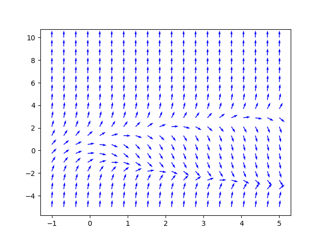
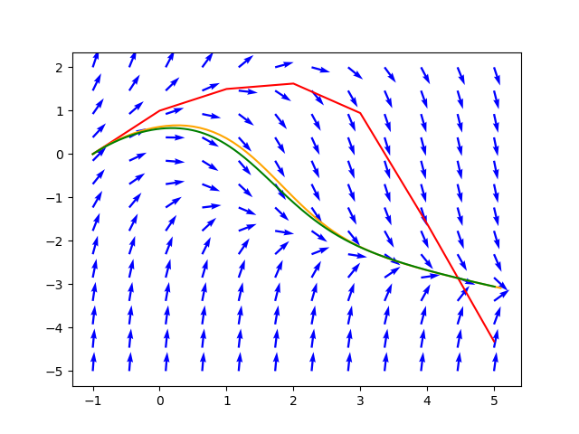
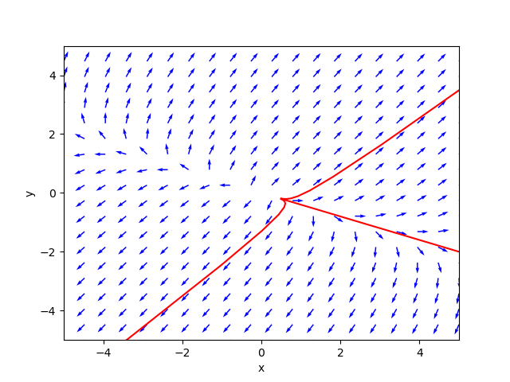

\newcommand{\R}{\mathbb{R}}
\newcommand{\C}{\mathbb{C}}
\newcommand{\on}{\operatorname}

## Math 243 - Fall 2025


<ul class="nav">
  <li>[Examples](examples.html)</li>
  <li>[Notes](notes.html)</li>
  <li>[Schedule & Syllabus](index.html)</li>
</ul>

### Graphics

1. Slope fields (<a href="https://sagecell.sagemath.org/?z=eJxtj0tuhDAQRPeWfIfSZGOI5wPSbEaaXW6QExgwwZJ_Y5okvn0MQZlNdl1dqtfVYwoOfnExw7gYEqHmbJ-comgDWdOdYl4nqBnREmecveBNj8Zr0KQxLr4nEzxnI-6wynWDAknkG3JdtzijxRF77t2GWCJG24EzcsZLkFPfJXhsJK6c5W2X991VorlwJkjmqmin5-kjmUFY4-eoei2eCIn2Ukn8OU_Q5lSclfKnx2I-dRJrvYI-z49EonkdtwOlbAE09a_6z-uDDel-6OyiD9X60Iqcp_Alqh_4SWLG&lang=python&interacts=eJyLjgUAARUAuQ==">Python</a>, <a href="https://sagecell.sagemath.org/?z=eJxFjsEKgzAQRO-C_7BIIAlEWi0e8yWllVjXKiyNmG0xf9-VHjqnN485DDvI4OETNqNZWNuymMxBVnS-t6cWauCyWClynyiu2E8L0mgmB8eubhx0VjgLdw6as5QZwxj2JRG-njz7y8_8W1mAJOyYegoDUvJXrVhpp1U2bJW-OXhEipt8qAZ6Y2W_bmUvVA==&lang=sage&interacts=eJyLjgUAARUAuQ==">Sage</a>, <a href="https://sagecell.sagemath.org/?z=eJxNUk2L2zAQvQv0H94lRKbebBLIKRQWttDL0hZ6LF3Q2uNEIEtZabIb9dd3ZLtLDZY0X2_mPWmFnz5eCIMj32OICWWNz7hj3KPABXzv2L6RVlqt8IUGFwh8lvxr6NjFoNUg6Q-G29JIweYZe6nc4w58nIu-JjcDTzla8Sio0mF3BI_2JseDZJbFeziizN7dVty_uEX5LdZI-XwSJONdyBfbkak47QTRYr9tWnxEyhQp_yLNMshjHC9XJuRKOGvVF8EdTO1QU_raNAbKJrs_ZPoihZi_FXqGy7D-3ZaMnVCJSHRJlCkwepdoEmNWsZnbfYtptF6gJr1sSvE9Tzp0MWSXuVZ6Cic-a_UkrfNrYtPfNs97fEJfZP-YSpbNPZ6Oy8yyLGbt88NHnjktl3jNLpzwenVvlLSa94llK0Dyy77dHJqJlxyQO-spzxOictfq5u0LebPmtZApi1GqwY49mfV_j6Z67U3UYXc6s1b1lkTHvxhpsOQ=&lang=octave&interacts=eJyLjgUAARUAuQ==">Octave</a>)
2. Direction fields for planar systems (phase planes) (<a href="https://sagecell.sagemath.org/?z=eJxtjUFuwyAQRfdI3GHkFRDq2pbSRaVsc4DeABLsIA2BAE7h9rVbt4ra7p7e_zN_jN7BdXahgnXBxwyCko2cygF9RqvbUFcClSBgpoSSEQ6AyumzgiKhvsIgCjxBEZWS6Xe22CXbrxklrMjKl4Yz6TJFe2Zorymok2Gd7Ds5dFw-mBfZD5xTssy2t9neTVzv5fj55TndYmZfLMQAO5geuGt7Lqf_irs_tZNHHw-Nxtk021pBpQ2y5k1pbXP61nXTR1_Mj0wX_874ByNQYjg=&lang=python&interacts=eJyLjgUAARUAuQ==">Python</a>, <a href="https://sagecell.sagemath.org/?z=eJxNkMFqwzAMhu-BvMN_KU26NEsD3WXsulPZyq5jAzdWE4Nrp7abOX36KU0HM0iyPiTrlxfYd8ITei0MgaI49ZqgDN6bIAZKkzT5jAXGL7zgRL5rnZKZVsb3oqGsKrBhq6u8wH_4xLzO8-epXUZurctVxBqxXI0M5choveUEDzPDfKb6Bd6sOwmtroTQEYRz9sfjaB0aa7zygUyAJtOGDpmQkiSqstogWIjBKgmpBuWVNTiMuJKzeZrseKA_u5DJWH7XPFWOc5w6J503lezKR-z-FLK7p5OqvbYBXtuecFSkJS5emRbnixrIpckcs-mvCn6IjWNVbnNeazFd4Buhyc_7wPN6aRK1OJDOlh_icFDBL1npeEevNtINiKg8gmq78Au5zHxa&lang=octave&interacts=eJyLjgUAARUAuQ==">Octave</a>)
3. Direction field for $\mathbf{x}' = A\mathbf{x}$. (<a href="https://sagecell.sagemath.org/?z=eJxtjkFuwyAQRfdI3GGUFThT17jNplIWOYfFAie2gwSBAG7N7UtSS63k7p5mnv7_Y3AWbrP1GbT1LiSoKFnJquSNS0b3tc8PAhXBm0QJJSc4ggpBZdZ1AqGV2L3hu5SckrG8jLL9RcGCkD_g1DXYyGqB_ROFrDIl09YSv5ZYLUrYgpkX1w7xOgV9YUbfolfngb0c8IBtw3FzKSPKzPo-688hPAJwfMa8xntI7Ierqi1N0x9uasFx-k_cb7SzMy4cd72Zh93aFq_ui_FvFwZf9A==&lang=python&interacts=eJyLjgUAARUAuQ==">Python</a>)
4. Direction field with a solution curve. (<a href="https://sagecell.sagemath.org/?z=eJxtUctugzAQvCPxDxYn4zjUkKiKKuWQ70A-mGcsGezYpsV_3yUJohKVfJidnZ3dkTurBzROgwlIDkZbj0gcvdEgvFHaK1llJiwICYeM8nEURzd0RcJaEXBZMoqOBadlQRnnaRxVW--TQgeoDiglhqoRaKYofKEbTDFOZnR4wpyTALAqGY-jfi_ON3G-iXO-nIJnGlIYGVp3761ssJKjM6Ju8fFCL7Q4p3THwEkQJHtM8ru1iwHtnjYf7mE9fmFCCtjS_8Esy1Pa_yc87GS1Vtpek0pNbQLb_JJpvQLyLo8BPztI6KB5IrV2uCA-BYecQu3kuNan17nLH2CYCG61t22TvLO4u_7B6S9a-YIS&lang=python&interacts=eJyLjgUAARUAuQ==">Python</a>)
5. Contour plots and direction fields. (<a href="https://sagecell.sagemath.org/?z=eJyFUMtuwyAQvCPxD6ucgGDXD-USKR-DHdtBAoMBtyZfX4gjtZIrVXtgtDvMzuzojIZ51TaC1Na4AAyjN9IiWGWCkl1pY0YgPFgVMMJohBsoobu7gI1DvELRsA0KaFlkrMFoOsxbtqUJnKFhMSuQjUeaWHrwj8nJO1Fy9lb0Aylanqqi_KfT8FQVpRil_eWyys_BZQE-vmQ-_OIC2fG-ZPqFq7KmfPqLeD7QeqOMu506tQ4n-q_J-nJwWVcvm8_0KeVt00ni_qT75ODZf2_mYNY9wPOdyT_MF6HfuKZxSA==&lang=python&interacts=eJyLjgUAARUAuQ==">Python</a>)
6. Stream plots. (<a href="https://sagecell.sagemath.org/?z=eJxljs0KwyAQhO-C77BHtZsQzK3QhzHNn6BR1FB9-2po6aHMYYed4dtdg7NwnNYX0Na7kEBQ8nFWJW9cMnrqfWkOVARvEiWUrPAAo-w0K8gI5Q6dFBk6GEURQlKy_eWjyDWBG0hRGoFlLLy27BL3LeiZGX1Er54L60asGjj-NhKrBs4pqff7mMKibPuoQXC9ULhd41vZ3YvxN21UQd0=&lang=python&interacts=eJyLjgUAARUAuQ==">Python</a>)

### Numerical Methods

1. Euler's method (<a href="https://sagecell.sagemath.org/?z=eJyNkrFu3DAMhncDfgciHWw5Osc-9JagGTp07NKOQQZdTJ8EyJIiybmoT1_KdpJDUbQxYJn-SX0kRY3eTmDmySVQk7M-QlMWmzWJ6LSNWh1bl7IFIoDTsSzKYsARvs0affiOUdqhHrngRy556thtWQA9VVXBan11ztsXRTwMECVCsHqOyhqwI6QK7mCsI4fEgKTsVyaifxYaBHyBSO8RzipK0lVUJK_YR2sGtWBSLRhRUgfCDBAiOgjqF4Jst9AfGGdvKPnZglYhBk6pMKePO8ozU115Z85tafFLYZvnlUH9rEYulbIJ-nSbQrwUSLsXDxzuU_ew6mepNK4NbIeSn7w5wfXSdGKNfPdE8kTyXEqhFc6hGerILhBvatpUv3S4VZInNBJLi-k4CCo43UJqmj3cwB52sEzwE0iK6Mvirfg_5gm7nsOBA60dJaHBt_kS1Gs8p-PX1t9VHoeKveK69gNACvo30nphTnhJ7T6E7f7DPXlEs2J_ausQRoV6KIv6heZA4AmDPHk11FqZ4MQj1oQ-8H7P-Lty4Hvef2ZbmqdZPaPPAN61h5vw5GPdX48LkQ6cZbVZf__iXOu6OtI1u2J5KBkZpD3X7Dc-iAH1&lang=python&interacts=eJyLjgUAARUAuQ==">Python</a>)
2. Euler's method for systems (<a href="https://sagecell.sagemath.org/?z=eJxtUj2PnDAQ7VfiP4y2WcM5nJdom5O2y6VLk_Z0hVkbsGRszjYXnF-fMR8bdFoaHm_em_Hz0Djbgxn7IYLqB-sCFNlhRT0Pg7ZBq7ocYkLAPQw6ZIfsIGQDr6OWzv-SobOi-kEaCi2FjoKhMDEKkeUv2QHwOZ1OC5gdJw_97IHGOhDTswhwhYZMaMmBGwEiLly7cOVi7kB5CJ0EH-QAXv2VC282HmPU0oFtZoVfqhObW0Z8OTnLlFFBcQ03awQia_yXU6ahOH3JsFIesUfybWLvFN4ie18KKYLCluC4aSUxW-R9H3iCrljzJSp9rtF2Yl_yYZBGkGnHxju7aZ0MozPrgf4L004aHKZ5Xws-j36BqmTFBN9gKmJ2aL9WkcXaBTUxue8RH66VlYydKVwYw1upKJzz5MEQuLIr7tN3rVOCaGX8wG-SMHq-0O8sp3uG0YrlaMR_qPwY1ad0qQFt5jbP_sMFsuCiqPCW2h1O89k5p-0j7dMj5c1q667HWo_yuM6cNK-lJsffvK5V8BsdV_qnneSdTP87wTuJfuvkpNiKvrN_SP4PriPkJw==&lang=python&interacts=eJyLjgUAARUAuQ==">Python</a>)
<!-- Graphing solutions of linear systems with matrix exponential function (<a href="https://sagecell.sagemath.org/?z=eJxtUEFuwyAQvCP5D6ucsINdcJVLpUjNOxAHktgOEsQESGp-X3DcNkoqcZidGbEz27vRwPlqbARl7OgCVAXqM-kPysZGq7PUw4_WTdYUaBmMDFaPQat9Y2NGID1YHQpUoB1sQTonI-a8bsm7ILxmpG6FKAt0ow8qSxKb6T6xWpr9UcJEIH7AjlNCRTXBeoZMVLFAw6uL_bnY4ioQnkgsk9d0_jQ4dcSpibfy0OF6QzakpSV5YVKIlL-5XNWtc_kD0s_fvPmLC_iOq6pNm4YHTBtWkuE_4_rFdhj16Larvb52q7Qt-NzmNwZLJfOjNCfJGs8Xx7sqlPAJ6W796CCAOkPw4h42Hx5zy6mYRZtF6wWBxLEnbtnuuuNqqTppZeb6yxyfZn8av3D5DTBGoCM=&lang=python&interacts=eJyLjgUAARUAuQ==">Python</a>)-->


### Linear Algebra 

1. Finding (exact) eigenvalues and eigenvectors (<a href="https://sagecell.sagemath.org/?z=eJxdzbEKwjAUheE9kHc44NKCOCi6iEOhjyBdSodrco3BNFeSVPDtjR0dzwc_5_V0CEIW-TPfJHijVYfLbzXjAccz9jhNrVZabXB9MIyEZY4ZcscASoxSkb3j-GZTJGVQtCtaT04iBXAsyfOa9H8JhYXzTqtx2KKf6m_lpmu_tD0vSg==&lang=octave&interacts=eJyLjgUAARUAuQ==">Octave</a>, <a href="https://sagecell.sagemath.org/?z=eJxVj7FqwzAURXeB_uFutosQNKEdChnyAd26GVOErcQPLD0hPSfV31elpbTrHc4595I5oNSQKigkzoIHrbQ644RXJ5k--nE8mqfJjAfzPE2DVl3XafW2elhPVx9vfpbSDwheVl6Qvew5FjhsVAR8gexp8wUzR3EUKV5foNWjhYv4Brht96ZtBwuSgrBvQmmjmaSiX_mO4GKFUGgUEtAXPDPLYBpj0epo_9hmztmXxHFpJvwWci4WP-2pNUp9T5mi9Od_L4ZPzwNYMg==&lang=python&interacts=eJyLjgUAARUAuQ==">Python</a>)
2. Symbolic matrix exponentials (<a href="https://sagecell.sagemath.org/?z=eJwdyb0KgCAQAOBd8B1uS8MG3Rt6gLY2kSgwEDKP64J8-37W79uoZDhrxgopYyGGVgqG_rO17KdquDFAcdn7ia6opZBieHtcmNKtvLfGBeM7Z2wI_yJF5jojpYNVvFENLWv9AKr_H44=&lang=python&interacts=eJyLjgUAARUAuQ==">Python</a>, <a href ="https://sagecell.sagemath.org/?z=eJwryE5XyMlPTFEorsxNys_JTOblArKKFUp4uRKLi0tzUzVKdBTUi1ITc9Q1ebkcFWxBCjWiDRWMrBV0jRQMY4GivFypFQW5Go5aJZoA4V4WgQ==&lang=octave&interacts=eJyLjgUAARUAuQ==">Octave</a>)
3. Numerical matrix exponentials ([Octave](https://sagecell.sagemath.org/?z=eJxzVLBViDZUMLJW0DVSMIy15uXi5UqtKMjVcNQEAEsxBbo=&lang=octave&interacts=eJyLjgUAARUAuQ==), [Python](https://sagecell.sagemath.org/?z=eJxLK8rPVcgrzS2oVMjMLcgvKlHQ4uVKAwkWJ2cWVOrlZOYl5qTD5FIrCnJ5uXi5HBVsFRKLihIrNaKjDXWMYnWidY10DGNjNUGSBUWZeSUaIKUajpqaADjgHlM=&lang=python&interacts=eJyLjgUAARUAuQ==))
4. Solving $A \mathbf{x} = \mathbf{b}$ numerically ([Octave](https://sagecell.sagemath.org/?z=eJwljLEOgjAURXcS_uEmLmp0EJ0kDh3d3dThPVJCY-URXov27y043ptzjsEF9wOqGkecnnVZ8HLU-2oeZbHCrbNoSQM-lBAEKn6yMN_MMZzOV1SLkDGm5qWetIMMdqQg47ksDB7gf-rawsyK6yc7Bsfe7pAkoqEe5FXwjj64wSdwWoILmOOSxZzKc2022IJ_bgo2Wg==&lang=octave&interacts=eJyLjgUAARUAuQ==), [Python](https://sagecell.sagemath.org/?z=eJxLK8rPVcgrzS2oVMjMLcgvKlHQ4uXi5XJUsFVILCpKrNSIjjbUMYrViTbWMYmN1eTlSkKWidVRiNY1AosXFGXmlWjkZOYl5qTrFefnlKVqOOokaWoCAIrDHNI=&lang=python&interacts=eJyLjgUAARUAuQ==))
5. Solving $A \mathbf{x} = \mathbf{b}$ symbolically ([Python](https://sagecell.sagemath.org/?z=eJxLK8rPVSiuzC2oVMjMLcgvKlHQ4uXi5XJUsFXwTSwpyqzQiI421DGK1Yk21jGJjdXk5UpCkQJK6BqBxXm5CopSS0oq4wuKMvNKNBz1ivNzylI1kjQ1AeW9HeI=&lang=python&interacts=eJyLjgUAARUAuQ==), [Octave](https://sagecell.sagemath.org/?z=eJw9TbsOgjAU3Zv0H07iAiYOopPEgc8w6tBbG2m4cElbiPy9BRO38z5j9waLeSEuPQl7q5VWDa4rL-5HVDVOOD_LWiv6q_Wh2hStdrjJBGsGTNEhtQ5kbBfZxBYyumCSBCRBFJ4dmk-eoMt68AD9-tnvJ05-5AW0bBN-mF2ILucyKpoSe9AX5IUw8Q==&lang=octave&interacts=eJyLjgUAARUAuQ==))


<!--
### Slope Fields

<figure>
</img>
<figcaption style="text-align: center">**Figure:** Slope field example (<a href="https://sagecell.sagemath.org/?z=eJxNUk2L2zAQvQv0H94lRKbebBLIKRQWttDL0hZ6LF3Q2uNEIEtZabIb9dd3ZLtLDZY0X2_mPWmFnz5eCIMj32OICWWNz7hj3KPABXzv2L6RVlqt8IUGFwh8lvxr6NjFoNUg6Q-G29JIweYZe6nc4w58nIu-JjcDTzla8Sio0mF3BI_2JseDZJbFeziizN7dVty_uEX5LdZI-XwSJONdyBfbkak47QTRYr9tWnxEyhQp_yLNMshjHC9XJuRKOGvVF8EdTO1QU_raNAbKJrs_ZPoihZi_FXqGy7D-3ZaMnVCJSHRJlCkwepdoEmNWsZnbfYtptF6gJr1sSvE9Tzp0MWSXuVZ6Cic-a_UkrfNrYtPfNs97fEJfZP-YSpbNPZ6Oy8yyLGbt88NHnjktl3jNLpzwenVvlLSa94llK0Dyy77dHJqJlxyQO-spzxOictfq5u0LebPmtZApi1GqwY49mfV_j6Z67U3UYXc6s1b1lkTHvxhpsOQ=&lang=octave&interacts=eJyLjgUAARUAuQ==">Octave</a>, <a href="https://sagecell.sagemath.org/?z=eJxtj0tuhDAQRPeWfIfSZGOI5wPSbEaaXW6QExgwwZJ_Y5okvn0MQZlNdl1dqtfVYwoOfnExw7gYEqHmbJ-comgDWdOdYl4nqBnREmecveBNj8Zr0KQxLr4nEzxnI-6wynWDAknkG3JdtzijxRF77t2GWCJG24EzcsZLkFPfJXhsJK6c5W2X991VorlwJkjmqmin5-kjmUFY4-eoei2eCIn2Ukn8OU_Q5lSclfKnx2I-dRJrvYI-z49EonkdtwOlbAE09a_6z-uDDel-6OyiD9X60Iqcp_Alqh_4SWLG&lang=python&interacts=eJyLjgUAARUAuQ==">Python</a>, <a href="https://sagecell.sagemath.org/?z=eJxFjsEKgzAQRO-C_7BIIAlEWi0e8yWllVjXKiyNmG0xf9-VHjqnN485DDvI4OETNqNZWNuymMxBVnS-t6cWauCyWClynyiu2E8L0mgmB8eubhx0VjgLdw6as5QZwxj2JRG-njz7y8_8W1mAJOyYegoDUvJXrVhpp1U2bJW-OXhEipt8qAZ6Y2W_bmUvVA==&lang=sage&interacts=eJyLjgUAARUAuQ==">Sage</a>)</figcaption>
</figure>

### Euler's Method


<figure>
</img>
<figcaption style="text-align: center">**Figure:** Euler's method (<a href="https://sagecell.sagemath.org/?z=eJyNkrFu3DAMhncDfgciHWw5Osc-9JagGTp07NKOQQZdTJ8EyJIiybmoT1_KdpJDUbQxYJn-SX0kRY3eTmDmySVQk7M-QlMWmzWJ6LSNWh1bl7IFIoDTsSzKYsARvs0affiOUdqhHrngRy556thtWQA9VVXBan11ztsXRTwMECVCsHqOyhqwI6QK7mCsI4fEgKTsVyaifxYaBHyBSO8RzipK0lVUJK_YR2sGtWBSLRhRUgfCDBAiOgjqF4Jst9AfGGdvKPnZglYhBk6pMKePO8ozU115Z85tafFLYZvnlUH9rEYulbIJ-nSbQrwUSLsXDxzuU_ew6mepNK4NbIeSn7w5wfXSdGKNfPdE8kTyXEqhFc6hGerILhBvatpUv3S4VZInNBJLi-k4CCo43UJqmj3cwB52sEzwE0iK6Mvirfg_5gm7nsOBA60dJaHBt_kS1Gs8p-PX1t9VHoeKveK69gNACvo30nphTnhJ7T6E7f7DPXlEs2J_ausQRoV6KIv6heZA4AmDPHk11FqZ4MQj1oQ-8H7P-Lty4Hvef2ZbmqdZPaPPAN61h5vw5GPdX48LkQ6cZbVZf__iXOu6OtI1u2J5KBkZpD3X7Dc-iAH1&lang=python&interacts=eJyLjgUAARUAuQ==">Python</a>)</figcaption>
</figure>


### Phase Planes

<figure>
</img>
<figcaption style="text-align: center">**Figure:** Example phase plane (<a href="https://sagecell.sagemath.org/?z=eJxtjUFuwyAQRfdI3GHkFRDq2pbSRaVsc4DeABLsIA2BAE7h9rVbt4ra7p7e_zN_jN7BdXahgnXBxwyCko2cygF9RqvbUFcClSBgpoSSEQ6AyumzgiKhvsIgCjxBEZWS6Xe22CXbrxklrMjKl4Yz6TJFe2Zorymok2Gd7Ds5dFw-mBfZD5xTssy2t9neTVzv5fj55TndYmZfLMQAO5geuGt7Lqf_irs_tZNHHw-Nxtk021pBpQ2y5k1pbXP61nXTR1_Mj0wX_874ByNQYjg=&lang=python&interacts=eJyLjgUAARUAuQ==">Python</a>, <a href="https://sagecell.sagemath.org/?z=eJxNkMFqwzAMhu-BvMN_KU26NEsD3WXsulPZyq5jAzdWE4Nrp7abOX36KU0HM0iyPiTrlxfYd8ITei0MgaI49ZqgDN6bIAZKkzT5jAXGL7zgRL5rnZKZVsb3oqGsKrBhq6u8wH_4xLzO8-epXUZurctVxBqxXI0M5choveUEDzPDfKb6Bd6sOwmtroTQEYRz9sfjaB0aa7zygUyAJtOGDpmQkiSqstogWIjBKgmpBuWVNTiMuJKzeZrseKA_u5DJWH7XPFWOc5w6J503lezKR-z-FLK7p5OqvbYBXtuecFSkJS5emRbnixrIpckcs-mvCn6IjWNVbnNeazFd4Buhyc_7wPN6aRK1OJDOlh_icFDBL1npeEevNtINiKg8gmq78Au5zHxa&lang=octave&interacts=eJyLjgUAARUAuQ==">Octave</a>)</figcaption>
</figure>

### Euler's Method for Systems 

<figure>
</img>
<figcaption style="text-align: center">**Figure:** Two-dimensional Euler's method example (<a href="https://sagecell.sagemath.org/?z=eJxtUj2PnDAQ7VfiP4y2WcM5nJdom5O2y6VLk_Z0hVkbsGRszjYXnF-fMR8bdFoaHm_em_Hz0Djbgxn7IYLqB-sCFNlhRT0Pg7ZBq7ocYkLAPQw6ZIfsIGQDr6OWzv-SobOi-kEaCi2FjoKhMDEKkeUv2QHwOZ1OC5gdJw_97IHGOhDTswhwhYZMaMmBGwEiLly7cOVi7kB5CJ0EH-QAXv2VC282HmPU0oFtZoVfqhObW0Z8OTnLlFFBcQ03awQia_yXU6ahOH3JsFIesUfybWLvFN4ie18KKYLCluC4aSUxW-R9H3iCrljzJSp9rtF2Yl_yYZBGkGnHxju7aZ0MozPrgf4L004aHKZ5Xws-j36BqmTFBN9gKmJ2aL9WkcXaBTUxue8RH66VlYydKVwYw1upKJzz5MEQuLIr7tN3rVOCaGX8wG-SMHq-0O8sp3uG0YrlaMR_qPwY1ad0qQFt5jbP_sMFsuCiqPCW2h1O89k5p-0j7dMj5c1q667HWo_yuM6cNK-lJsffvK5V8BsdV_qnneSdTP87wTuJfuvkpNiKvrN_SP4PriPkJw==&lang=python&interacts=eJyLjgUAARUAuQ==">Python</a>)</figcaption>
</figure>

### Finding Exact Eigenvectors and Eigenvalues

<figure>
```python
from sympy import *

A = Matrix([[3,5],[2,6]])
'''
The .eigenvects() method returns a list of tuples containing: 
1. an eigenvalue, 
2. its multiplicity (how many times it is a root), and
3. a list of corresponding eigenvectors. 
'''
pretty_print(A.eigenvects())
```
<figcaption style="text-align:center">**Figure:** Finding exact eigenpairs. (<a href="https://sagecell.sagemath.org/?z=eJxdzbEKwjAUheE9kHc44NKCOCi6iEOhjyBdSodrco3BNFeSVPDtjR0dzwc_5_V0CEIW-TPfJHijVYfLbzXjAccz9jhNrVZabXB9MIyEZY4ZcscASoxSkb3j-GZTJGVQtCtaT04iBXAsyfOa9H8JhYXzTqtx2KKf6m_lpmu_tD0vSg==&lang=octave&interacts=eJyLjgUAARUAuQ==">Octave</a>, <a href="https://sagecell.sagemath.org/?z=eJxVj7FqwzAURXeB_uFutosQNKEdChnyAd26GVOErcQPLD0hPSfV31elpbTrHc4595I5oNSQKigkzoIHrbQ644RXJ5k--nE8mqfJjAfzPE2DVl3XafW2elhPVx9vfpbSDwheVl6Qvew5FjhsVAR8gexp8wUzR3EUKV5foNWjhYv4Brht96ZtBwuSgrBvQmmjmaSiX_mO4GKFUGgUEtAXPDPLYBpj0epo_9hmztmXxHFpJvwWci4WP-2pNUp9T5mi9Od_L4ZPzwNYMg==&lang=sage&interacts=eJyLjgUAARUAuQ==">Python</a>)</figcaption>
</figure>

### Finding Solutions of Linear Homogeneous Systems

<figure>

</img>

<figcaption style="text-align: center">**Figure:** Solution curves for linear systems (<a href="https://sagecell.sagemath.org/?z=eJxtUsFuozAQvSPxD6P0AolLDStW20q9dXcve-sRoZUDhlgymNoOC3-_Y-xUaZsIxeN5njdPb6bTaoDxPEwriGFS2sI-jkI0MDtJZaU4ZtPqImAGJmnjCMIvju7gdTWWD3HUwTNINhxbBguB9Qm-ZXS_wAFKPNc46j_jRcC_e9xxvQjNGyvUCL8El20cJQtZUywcuDn1WrSJFKOZWMOT-5KUpKAp-ZJJ4whFZm9nMXPtCEi30TyYN20TH-_3BXbur2KaUUrzlPS33h5uvWyUVPp5d5Rnvgs9F8mOXCa75ZJYQ2J1ic0tbuG3ZtMJ_ohBWHN5JganH8p3Ip8oQ9lP0fNxZtjKPPgYfVLaQKc02BN_n4J3OCfB6gK9w8uPOJrxmN21cn2KmkCFmbz2_JskMfY4ga7jmo8WXpU8u1GgRNdEjMIKJv82amzFNiIxQoUcuaOiWUnuaVZcx9dA_ljXT35v7nC2SIG9Nt2hi8calNQ4kThUJvvMKDnzpHKSka0q8L8mX5RsHnlqb60jNh-Iref0i0JJ7j6aesz57bY7aXLYw5xXtMaTL1MSzMSbTQ-oC9HiM1psKMoOxfmtYtyaS3l-szzskuatXxSnyZzUvyT9DwdUByk=&lang=python&interacts=eJyLjgUAARUAuQ==">Python</a>)</figcaption>
</figure>


-->

<br>
<br>
<br>
<br>
<br>
<br>
<br>
<br>
