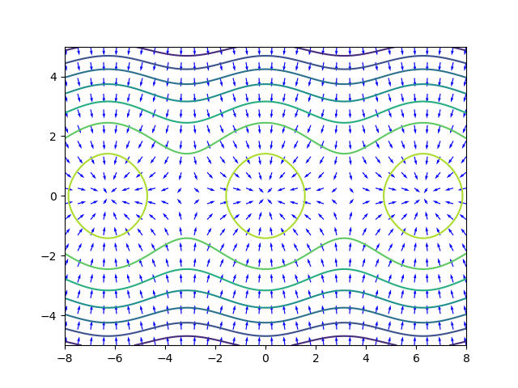
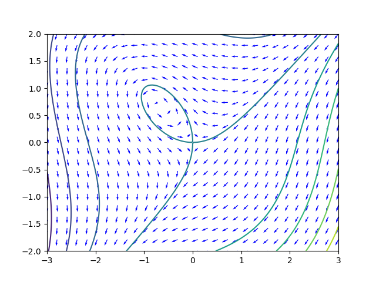
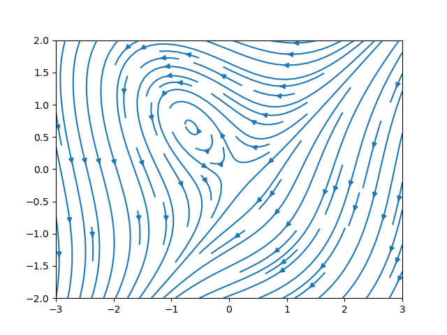

\newcommand{\R}{\mathbb{R}}
\newcommand{\C}{\mathbb{C}}
\newcommand{\on}{\operatorname}
\newcommand{\tr}{\on{tr}}

## Math 243 - Fall 2025


<ul class="nav">
  <li>[Examples](examples.html)</li>
  <li>[Notes](notes.html)</li>
  <li>[Schedule & Syllabus](index.html)</li>
</ul>

<center>
Jump to: [Math 243 homepage](index.html), [Week 1](#week-1-notes), [Week 2](#week-2-notes), [Week 3](#week-3-notes), [Week 4](#week-4-notes), [Week 5](#week-5-notes), [Week 6](#week-6-notes), [Week 7](#week-7-notes), [Week 8](#week-8-notes), [Week 9](#week-9-notes), [Week 10](#week-10-notes), [Week 11](#week-11-notes), [Week 12](#week-12-notes), [Week 13](#week-13-notes), [Week 14](#week-14-notes)
</center>
 
### Week 1 Notes

Day  | Section  | Topic
:---:|:---:|:-----------------------------------
Mon, Aug 25 |  [1.1][1.1] | Modeling with Differential Equations
Wed, Aug 27 |  [1.2][1.2] | Separable Differential Equations
Fri, Aug 29 |  [1.3][1.3] | Geometric and Quantitative Analysis

### Mon, Aug 25

We talked about some examples of differential equations. 

1. **Exponential Growth/Decay.** The rate of change in a variable $y$ with respect to time $t$ is proportional to $y$ itself. 
$$\dfrac{dy}{dt} = k y.$$
    a. Check that $y(t) = Ce^{kt}$ is a solution. 
    b. Find the constant $C$ which satisfies the **initial value problem** with **initial condition** $y(0) = 1000$. 


We talked about **dependent** and **independent** variables, the **order** of a differential equation and how to tell if a function is a **solution** of a differential equation.  We also talked about **initial conditions**.

2. **Spring-Mass Model.** The force $F$ of a mass $m$ at the end of a spring can be modeled by **Hooke's Law** which says $F = -k x$ where $x$ is the displacement of the spring from its rest position. 
$$m\dfrac{d^2 x}{dt^2} = -kx.$$

    a. Show that $x = \sin t$ and $x = \cos t$ are two different solutions of the spring equation when $m = k = 1$. 
    b. How would the solutions change if $m$ and $k$ were not both equal to 1?  How would the oscillation of the spring change if the mass was twice as heavy?  
    c. How would the spring equation change if there was also a linear drag force $F = -b \frac{dx}{dt}$?  What if there is a non-linear drag force $F = -b \left(\frac{dx}{dt}\right)^2$?

The last question led to a discussion of **linear** versus **non-linear** differential equations.  It's usually much harder to solve non-linear equations!  We will also study **systems** of differential equations, like the following.  

3. **Rabbits and Foxes.** Suppose there are $R$ rabbits and $F$ foxes in an ecosystem.  The rabbit population would grow exponentially, except for the foxes which prey on the rabbits.  The fox population would decay exponentially if there wasn't food to eat, but as long as they can catch enough rabbits, it will grow.  The number of rabbits that are eaten by foxes is proportional to the product $RF$.  
\begin{align*} 
\dfrac{dR}{dt} &= a R - b RF \\
\dfrac{dF}{dt} &= -c R + d RF 
\end{align*}
    
Here is a graph showing these equations as a vector field (with constants $a = 3, b = 4, c = 1, d= 2$).  

<center>
</img>
</center>

4. **Logistic Growth.** $\dfrac{dP}{dt} = kP \left( 1 - \dfrac{P}{N} \right)$ where $k$ is a proportionality constant and $N$ is the carrying capacity.  
    
    a. Under what circumstances does the population $P$ stop changing in this model?
    b. What are the units for the constants $k$ and $N$? 
    c. Suppose that we use the logistic growth equation to model a population of rabbits in a region.  What if we introduce a predator that always consumes $b$ rabbits per year.  How would that change the differential equation above?  

### Wed, Aug 27

Today we talked about **separable equations**.  We solved the following examples. 

<!--1. Solve $\dfrac{dy}{dx} = - \dfrac{x}{y}$. (<https://youtu.be/8Amgakx5aII>)-->

1. Solve $\dfrac{dy}{dx} = - x^2 y$. 

2. Solve $xy^2 y' = x+1$. (<https://youtu.be/1_Q4kndQrtk>)

Not every differential equation is separable.  For example:
$$\frac{dy}{dx} = x-y$$
is not separable.

3. Which of the following differential equations are separable? (<https://youtu.be/6vUjGgI8Dso>)

    a. $xy' + y = 3$    
    b. $2x + 2y + 2y' - 1 = 0$
    c. $y' = (x^2+x)(y^2+y)$ 
    d. $x \dfrac{dy}{dx} + y \dfrac{dy}{dx} = x$

We finished with this example:

4. **Newton's Law of Cooling.** The temperature of a small object changes at a rate proportional to the difference between the object's temperature and its surroundings.  

    a. Express Newton's Law of Cooling as a differential equation.  
    b. Is that differential equation separable? 

<!--4. Show that $y = C e^{-x} + x - 1$ is a solution to $y' = x-y$ for any $C$. 

5. Show that $y = C e^{-x} + x - 1$ is a solution to $y' = x-y$ for any $C$. Then solve the initial value problem with initial condition $y(0) = 2$.
-->

5. **Mixing Problem.** Salty water containing 0.02 kg of salt per liter is flowing into a mixing tank at a rate of 10 L/min.  At the same time, water is draining from the tank at 10 L/min.  

    a. Write a differential equation to model how the amount of salt in the tank changes with respect to time.  
    b. Solve the differential equation if the amound of salt in the tank is initially 15 kg. (<https://youtu.be/aFfAz9wnoyY>)

We didn't get to this last example in class, but it is a good practice problem. 

6. $\dfrac{dy}{dx} = \dfrac{4 \sin x}{3 y^2}$ with initial condition $y(0) = 2$. (<https://youtu.be/cc3qtMBdQlE>)

### Fri, Aug 29

Today we talked about **slope fields**.  

1. Sketch the slope field for $\dfrac{dy}{dx} = x - y$. (<https://youtu.be/24pxJ1DuWR8>) 

Here is a [slope field grapher tool](https://people.hsc.edu/faculty-staff/blins/classes/fall23/math142/SlopeFields.html) that I made a few years ago. You can also use Sage to plot slope fields. Here is an example from the book, with color added. 

<figure>
```python
t, y = var('t, y')
f(t, y) = y^2/2 - t
plot_slope_field(f, (t, -1, 5), (y, -5, 10), headaxislength=3, headlength=3, 
    axes_labels=['$t$','$y(t)$'], color = "blue")
```
<figcaption>[Open example in SageCell](https://sagecell.sagemath.org/?z=eJxFjsEKgzAQRO-C_7BIIAlEWi0e8yWllVjXKiyNmG0xf9-VHjqnN485DDvI4OETNqNZWNuymMxBVnS-t6cWauCyWClynyiu2E8L0mgmB8eubhx0VjgLdw6as5QZwxj2JRG-njz7y8_8W1mAJOyYegoDUvJXrVhpp1U2bJW-OXhEipt8qAZ6Y2W_bmUvVA==&lang=sage&interacts=eJyLjgUAARUAuQ==)</figcaption>
</figure>


2. Consider the logistic equation with harvesting. 
$$\dfrac{dP}{dt} = k P \left(1 - \dfrac{P}{N} \right) - h$$
where $h$ is a number of rabbits that are harvested each year. 

    a. If $k = 1$, $N = 8$, and $h = 1.5$, then what are the values of $P$ where $\dfrac{dP}{dt} = 0$? [Slope field](https://sagecell.sagemath.org/?z=eJxFjt2KwjAQhe8DeYeDFJLI-FN3F7zpK_gCIiW1qSnNNtJEsW_vqBfO1Xe-mQOTCTMq3O2kVWZWRoqBcCB41iVhTyjXf1JI0enXgWE9YMmtJXSJFcMGB8PgpbiGmOsU4tXVXe9CqzvCq7Ul7H4N8_zmcsvsnW3to0_BjZfsq5-P-SYpwGMfLtXBNi6k6qiKXED_xzH7ZBSpYuaYfbwlO7YJscNkm6bPvDwRzjHEib9dNOHmFuYJHnNAEA==&lang=sage&interacts=eJyLjgUAARUAuQ==) 
    b. Graph the function 
$$y =k x \left(1 - \dfrac{x}{N} \right) - h.$$
    Where does the graph cross the x-axis?  Is the slope positive or negative at those crossing points?
     
The logistic equation (with or without harvesting) is **autonomous** which means that the rate of change $\dfrac{dP}{dt}$ does not depend on time, just on $P$.  An **equilibrium solution** for an autonomous differential equation is a solution where $y'(t) = 0$ for all $t$.  

3. In the logistic equation above, what happens to the equilibrium solutions when the rate of harvesting is increased to $h = 2$ and then to $h = 2.5$?  What happens to the slope field? What does that mean about the population of rabbits?  

<!--An equilibrium solution $y_0$ for $y' = f(y)$ is **stable** if $f'(y_0) < 0$ and it is **unstable** if $f'(y_0) > 0$.  

3. How could you modify the logistic equation equation so that you get a realistic non-autonomous model for rabbits in a field?  Why might the rate of change in the population of rabbits change with respect to time?  
-->


- - - 

### Week 2 Notes

Day  | Section  | Topic
:---:|:---:|:-----------------------------------
Mon, Sep 1  |             | Labor day - no class
Wed, Sep 3  |  [1.7][1.7] | Bifurcations
Fri, Sep 5  |  [1.6][1.6] | Existence and Uniqueness of Solutions

### Wed, Sep 3

Last time we talked about equilibrium solutions of autonomous equations.  An equilibrium $y_0$ for $y' = f(y)$ is **stable** (also known as a **sink** or **attactor**) if any solution with initial value close to $y_0$ converges to $y_0$ as $t \rightarrow \infty$. An equilibrium is **unstable** (also known as a **source** or **repeller**) if all solutions move away from $y_0$ as $t \rightarrow \infty$. 


1. Consider the ODE $y' = y(y-2)(y+3)$.  What are the equilibria for this ODE?  Which are stable and which are unstable?

One way to quickly analyze whether equilibria are stable or unstable is to graph $f(y)$.  If $y_0$ is an equilibrium solution and $f'(y_0) < 0$, then $y_0$ is stable, and if $f'(y_0) > 0$, then $y_0$ is unstable.  
<center>
<iframe src="https://www.desmos.com/calculator/7xmuwyicde?embed" width="400" height="300" style="border: 1px solid #ccc" frameborder=0></iframe>
</center>

2. What would happen to the number of equilibrium solutions if we replaced $y(y-2)(y+3)$ by $y(y-2)(y+3) + 5$?


We talked about the **phase line** for an autonomous ODE.  

2. Draw different phase lines for the logistic equation with harvesting parameters $h = 0, 1.5, 2, 2.5$
$$y' = y \left( 1 - \frac{y}{8} \right) - h$$ 


Suppose that $y' = f_\lambda(y)$ is a family of differential equations that depends on a parameter $\lambda$.  A **bifurcation point** is a value of the parameter where the number of equilibrium solutions changes.  A **bifurcation diagram** is a graph that shows how the phase lines change as the value of a parameter changes. 

3. Draw a bifurcation diagram for the differential equation $y' = \lambda y - y^2$ showing the phase lines when $\lambda = -1, 0,$ and $1$. 

You can use Desmos to help with the previous problem.  Using $x$ to represent $\lambda$, you can graph the region where $dy/dt$ is positive in blue and the region where $dy/dt$ is negative in red.  Then it is easier to draw the phase lines in the bifurcation diagram. 

<center>
<iframe src="https://www.desmos.com/calculator/m8ez8hc9is?embed" width="400" height="300" style="border: 1px solid #ccc" frameborder=0></iframe>
</center>

<!--
6. Describe the phase line portraits for $y' = y - \lambda \sin y$.  How do they change as $\lambda$ changes?  How many values of $\lambda$ are bifurcation points? 
-->

### Fri, Sep 5

Today we talked about two important theorems in differential equations. 

<div class="Theorem">
**Existence Theorem.** Suppose that $y' = f(t,y)$ where $f$ is a continuous function in an open rectangle $\{(t,y) :  a < t < b, c < y < d \}$.  For any $(t_0, y_0)$ inside the rectangle, there exists a solution $y(t)$ defined on an open interval around $t_0$ such that $y(t_0) = y_0$.
</div> 

This theorem guarantees that in most circumstances, we are guarantee to have solutions to differential equations.  But there are things to watch out for.  Solutions might blow up in finite time, so they might not be defined on the whole interval $(a,b)$.  

1. Solve the IVP $y' = y^2$ with initial condition $y(0) = 1$.  Notice that the function $f(t,y) = y^2$ is continuous everywhere.  But the solution is not. 


<div class="Theorem">
**Uniqueness Theorem.** Suppose that $y' = f(t,y)$ where both $f$ and its partial derivative $f_y$ are continuous in an open rectangle $\{(t,y) : a < t < b, c < y < d \}$. Then for any $(t_0,y_0)$, there exists a unique solution $y(t)$ defined on an open interval around $t_0$ such that $y(t_0) = y_0$.
</div>

If the partial derivative $f_y$ is not continuous, then we might not get unique solutions.  Here is an example. 

2. Solve the IVP $y' = y^{1/3}$, with $y(0) = 0$ using separation of variables.  Then show that $y(t) = -(\tfrac{2}{3} t)^{3/2}$ and $y(t) = 0$ are also valid solutions of this IVP. 

One very nice consequence of the uniqueness theorem is this important concept:

<div class="Theorem">
**No Crossing Rule.** If $f$ and $f_y$ are both continuous, then solution curves for the differential equation $y' = f(t,y)$ cannot cross. 
</div>

3. In our first homework we solved the IVP $xy' = \sqrt{1-y^2}$, with $y(1) = 0$.  The solution was $y = \sin(\ln(t))$. But if you graph the solution with the slope field, there is something wrong! [SageCell Plot](https://sagecell.sagemath.org/?z=eJxFjssKwyAQRfeB_IOIoFKTJunaLyltMI15wBBTtSX-fcd20VndezkwJyqSiCZv4wWPmLksi0nkJHEOTx9FW6V7J8-xLHZwsQ_gdttPq4VRTIpktlGkbSTmpEjV1h3WusO-WDOaYw1gtzku-vJb_q0sCJ45bOjBDBaCvnIWGVecJREl4zdFHg6cRxU6wMtSecoOIqybADcjIxUKNCq__5KaejtS-QGNMD12&lang=sage&interacts=eJyLjgUAARUAuQ==) 

This illustrates that a formula for a solution to $y' = f(t,y)$ might not apply after we reach a point where $f_y$ is no longer continuous. 

- - - 

### Week 3 Notes

Day  | Section  | Topic
:---:|:---:|:-----------------------------------
Mon, Sep 8  |  [1.4][1.4] | Analyzing Equations Numerically
Wed, Sep 10 |  [1.4][1.4] | Analyzing Equations Numerically - con'd
Fri, Sep 12 |  [1.5][1.5] | First-Order Linear Equations

### Mon, Sep 8

Many ODEs cannot be solved analytically.  That means there is no formula you can write down using standard functions for the solution.  This is true even when the existence and uniqueness theorems apply.  So there might be a solution that doesn't have a solution you can write down.  But you can still approximate the solution using numerical techniques.  

Today we introduced **Euler's method** which is the simplest method to numerically approximate the solution of a first order differential equation. We used it to approximate the solution to 
$$\dfrac{dy}{dt} = \dfrac{y^2}{2} - t \text{ with initial condition } y(-1) = 0.$$ 

```python
from numpy import *
import matplotlib.pyplot as plt

def EulersMethod(f,a,b,h,y0):
    ''' 
    Approximates the solution of y' = f(t, y) on the interval a < t < b with initial 
    condition y(a) = y0 and step size h. 
    Returns two lists, one of t-values and the other of y-values. 
    '''
    t, y = a, y0
    ts, ys = [a], [y0]
    while t < b:
        y = y + f(t,y)*h
        t = t + h
        ts.append(t)
        ys.append(y)
    return ts, ys

f = lambda t,y: y**2 / 2 - t

# h = 1
ts, ys = EulersMethod(f, -1, 5, 1, 0)
plt.plot(ts,ys)
# h = 0.1
ts, ys = EulersMethod(f, -1, 5, 0.1, 0)
plt.plot(ts,ys)
# h = 0.01
ts, ys = EulersMethod(f, -1, 5, 0.01, 0)
plt.plot(ts,ys)
plt.show()
```

Here's the [output for this code](https://sagecell.sagemath.org/?z=eJyNUrFOwzAQ3SPlH57E0CS4Ia3EUsHAwMjCWnVwiSNbcmMrvlLM13NO0lIhIbBk5_Tu_N47X7rBHXCQpGEO3g2EKs_miFFvHVmzr31MEWSAt5RnedaqDs9Hq4bwoki7tuiEFHuhRWzKTZ6B12KxwBQ9eT-4D8N8KoC0QnD2SMb1cB3iAo_oChKIJRhKedOTGt6lhcQDiPceJ5Ms9oYMwxPtm-tbM9LEQpbMEhvIvkUg5RHMp4Ku59JXRcehZ_GTgzWBgmApleRpyTpH9pVuJm3HxzAamzNnDu5nCpJVVpP8aWaE-WJgbCt3AtvY7Cb8pI1VUwPzo6SVLkfcjk3HstLfGeIMceYaCrX0XvVtQeUVxQWNMzqMHc5O0oQ65rLysG8lG44bxKpa4w5rLDFO8AaaK1Z5djH_Y55YrgTuBfhsWIQHX6efoOD6GMozQVP_g4KL_iBp_sXS_EaTgKDdqSi_ANEKxnU=&lang=python&interacts=eJyLjgUAARUAuQ==) and here is a [version with the slope field added](https://sagecell.sagemath.org/?z=eJyNkrFu3DAMhncDfgciHSw7Osc-9JagGTp07NI1yKCL5ZMAWVIkOhf16UvZTnIogjYGLNM_qY-kqDG4Cew8-QR68i4gNGWxWZNAbxwafWx9yhaICN5gWZTFIEf4MRsZ4k-Jyg1s5IIfueKpq2_LAuipqgpW67v3wb1o4skIqCREZ2bUzoIbIVVwByNDDqkGkrJfW5ThWRgQ8A2Q3iOcNSrSNWqSV-yjs4NeMImJmiipA2EHiCg9RP1bgmq30F8S52Ap-dmB0REjp1Qyp8cd5Zmprrwz53a0hKWwzfPKoH5WI5dK2QR9uk0hXoqk3YsHDvepe1j1s9JGrg1sh5KfvDnB9dJ0qhv17kHyIHkupdgK76UdGNYXiDc1bWpYOtwqyRMaiWXEdBwEFZxuITXNHm5gDztYJvgFFEX0ZfFW_F_zhF3P4cCB1o6S0ODbfAnYGs_p-I0Ld1WQQ1W_4rr2E0AK-jfSBWFP8pLafQrb_Yd7ClLajC0L9kJHT6xJRnUKemBG2-jFo2REO_B-X_N35cD3vP9ab-SnWT_LkAG8aw838Skg66_HhUhnXGe1WX8_cK6lXB3pZl1twKjcmdV_AOZb_WU=&lang=python&interacts=eJyLjgUAARUAuQ==). 


<!--

We wrote a program to implement Euler's method in Python to help solve this differential equation which you might recognize as one potential solution to Problem 8 from Homework #2: 

$$\dfrac{dy}{dt} = y \left( 1 - \dfrac{y}{N(t)} \right) \text{ where } N(t) = 8 - 4 \cos (\tfrac{2\pi}{12} t)$$

Here is the [slope field for this differential equation](https://sagecell.sagemath.org/?z=eJxFjk0KgzAQhfeCdxgkkB8iGttFN16hFyhFosZWGBoxaTG374QuOqv3vvctJmpI0MPH7oJHylyWxVVESewCNZzV5IPo1LY2plORxkVkLe9JCVOnJtvEN_RxCOg3Nyyrw1ksGrLaajCdpJw01EZD11J5OjvbYw3oXo_47E8_8m9lAXT2cGFAOzoM_Y2zyLjmLDF-1zB59Dv9UI34dpX8AjMhNfM=&lang=sage&interacts=eJyLjgUAARUAuQ==).


```python
from math import *
import matplotlib.pyplot as plt

def EulersMethod(f,a,b,h,y0):
    # Returns two lists, one of t-values and the other of y-values. 
    t, y = a, y0
    ts, ys = [a], [y0]
    while t < b:
      y = y + f(t,y)*h
      t = t + h
      ts.append(t)
      ys.append(y)
    return ts, ys

N = lambda t: 8 - 4 * cos(2*pi/12 * t)
f = lambda t,y: y * (1 - y / N(t))

# h = 1
ts, ys = EulersMethod(f,0,12,1,4)
plt.plot(ts,ys)
# h = 0.1
ts, ys = EulersMethod(f,0,12,0.1,4)
plt.plot(ts,ys)
# h = 0.01
ts, ys = EulersMethod(f,0,12,0.01,4)
plt.plot(ts,ys)
plt.show()
```

Here's the [output for this code](https://sagecell.sagemath.org/?z=eJyFkTFvwyAQhXdL_g9PymK7xMFRhihqxo7N0DXKgGssLGFjmUsj_n2PxkmrSm0Y4Ph49-6AdnI9ekUGXT-6iVCkyRwxHa0j29XlGGIE5TFaSpM0aXSLl7PVk3_VZFyTtUKJWhgRZL5LE_BY4E3TeRo86OJgO09ewA0argUtP5Q9aw81NCDDjKcpnoT5pMTVhQQC9lC8yJmwTfDMjuokcAzydOUX01kNwjPquQNw6tMebUYi5IW5QYrwe-dLNY56aDLK72l3FmY2fV1lrh0f4MANWNXXjQLtsMUSGxR4dz5bF2O3qta8i4btD50IO-6oQFaxPGCFA9fMo9sChnVVmtwv9-txpajWohIbVvMPlPE3MtYGn9-SZfkonRX_G8jHDvIPiwi8cZcs_wQKxKL_&lang=python&interacts=eJyLjgUAARUAuQ==) and here is a [version with the slope field added](https://sagecell.sagemath.org/?z=eJyFkkFvozAQhe9I_Ien9mKoSwCl1SraHPfYHnqtejDBBCSDXds063_fcULTqqpSDuB5M_PNs01n9YhpHk3AMBptPfI0WVaj8EZpr4amMCGuIByM8mmSJq3s8G9W0roH6Xvdso4L3vCehzLbpAnoucaT9LOdHPxBQw3OOw49SegO_vZNqFk6iKmF70mjl42ZsGQKnCieI2ALQZ9yUQgTHGnP4oXjOZQvJ_3QD0rC4y-axQGo9WaLjnkesrz_EH0UPyNXCGPk1DKfndvOWlg0e9zKMjsewCMZUGJsWgG_wR_cYo0cO-1YnZthVdUURWD3pY6HDTnKwSoqD1jhkWZmkcb-k0OqHKXr93ZomRomZ8ROspJXNa_XGT8r66hU97GRLqN4nYc3aSOAl8Xdyr1az6qb7kjM8zqLan4Kf0jutNJ2e9XQkV8R8Bo9uajS5HzI3y75aKfi62V4_CsY1Qb3QdpbKadPVFn8BqOKCzgr26-w8ndaeQmnrZj2x53GvOv1gWXv0bTZAg==&lang=python&interacts=eJyLjgUAARUAuQ==). 
-->

After demonstrating how to implement Euler's method in code, we talked about some simpler questions that we can answer with pencil & paper. 
 
1. Suppose that we want to solve $\dfrac{dy}{dx} = x - y$ with initial condition $y(0) = 2$.  Make a table showing the first three steps using Euler's method with step size $h = 1$.  

Euler's method is only an approximation, so there is a gap between the actual y-value at $t = b$ and the Euler's method approximation.  That gap is the error in Euler's method. There are two sources of error. 

* **Discretization Error** - caused by using a discrete approximation to a continuously changing quantity. 
* **Rounding Error** - caused by using a computer that can't represent small decimal places accurately.  

As $h$ gets smaller, the discretization error gets smaller, but the rounding error gets worse.  
A worst case upper bound for the error is: 
$$\text{Error} \le \dfrac{e^{L(b-a)} - 1}{L} \left( \dfrac{Mh}{2} + \dfrac{\delta}{h} \right)$$
where $L = \max \left| \frac{\partial f(t,y)}{\partial y} \right|$, $M = \max |y''(t)|$, and $\delta$ is the smallest floating point number our computer can accurately represent. 
Using the standard base-64 floating point numbers, $\delta \approx 10^{-16}$. In practice, Euler's method tends to get more accurate as $h$ gets smaller until around $h \approx 10^{-7}$.  After that point the rounding error gets worse and there is no advantage to shrinking $h$ further. 

<!--
<div class="Theorem">
**Euler's Method Error.** If we use Euler's method with a step size $h$ to approximate the solution of $y' = f(t,y)$ on an interval $[a,b]$, then there are constants $C_1$ and $C_2$ depending on the length of the interval $(b-a)$, the partial derivative $f_y$ and the second derivative $y''$  such that 
$$\text{Error} \le C_1 h + \dfrac{C_2 \delta}{h}$$
where $\delta$ is the smallest floating point number our computer can accurately represent. ($\delta \approx 10^{-16}$ using standard base-64 floating point numbers).

At first, the error decreases as $h$ gets smaller, but eventually the $\frac{\delta}{h}$ term (which comes from computer rounding errors) gets very large, so there are limits to how accurate you can get.
</div>

<div class="Theorem">
**Euler's Method Error.** If we use Euler's method with a step size $h$ to approximate the solution of $y' = f(t,y)$ on an interval $[a,b]$, then
$$\text{Error} \le \dfrac{e^{L(b-a)} - 1}{L} \left( \dfrac{Mh}{2} + \dfrac{\delta}{h} \right)$$
where $L = \max \left| \frac{\partial f(t,y)}{\partial y} \right|$, $M = \max |y''(t)|$, and $\delta$ is the smallest floating point number our computer can accurately represent. 

At first, the error decreases as $h$ gets smaller, but eventually the $\frac{\delta}{h}$ term (which comes from computer rounding errors) gets very large, so there are limits to how accurate you can get.
</div>

-->

### Wed, Sep 10

Today I announced [Project 1](Project1.pdf) which is due next Wednesday.  I've been posting Python & Sage code examples, but if you would rather use Octave/Matlab, here are some [Octave code examples](octave.html).

**Runge-Kutta methods** are a family of methods to solve ODEs numerically.  Euler's method is a first order Runge-Kutta method, which means that the discretization error for Euler's method is $O(h^1)$ which means that the error is less than a constant times $h$ to the first power. 

Better Runge-Kutta methods have higher order error bounds.  For example, RK4 is a popular method with fourth order error $O(h^4)$.  Another Runge-Kutta method is the **midpoint method** also known as RK2 which has second order error. 

<div class="Theorem">
**Midpoint Method (RK2).** Algorithm to approximate the solution of the initial value problem $y'(t) = f(t, y)$ on the interval $[a, b]$ with initial condition $y(a) = y_0$.

1. Choose a step size $h$ and initialize variables $t = a$ and $y = y_0$. 
2. Repeat the following two steps while $t < b$:
    a. Update $y = y + f(t + \tfrac{1}{2}h, y + \tfrac{1}{2} h f(t,y))$,
    b. Update $t = t + h$.
</div>

<center>
</img>
</center>

In RK2 the slope used to calculate the next point from a point $P_1$ is the slope at the midpoint between $P_1$ and the Euler's method next step. In RK4, the slope used is a weighted average of the slopes at $P_1$, $P_2$, $P_3$, and $P_4$ shown in the diagram above. Specifically, it is 1/6 of the slopes at $P_1$ and $P_4$ plus 1/3 of the slopes at $P_2$ and $P_3$.  

There are even higher order Runge-Kutta methods, but there is a trade-off between increasing the order and increasing complexity. 

After we talked about Runge-Kutta methods, we introduced the **integrating factors method** for solving first order linear ODEs
$$y'(t) + f(t) y = g(t).$$
The key idea is that if $F(t)$ is an antiderivative of $f(t)$, then $e^{F(t)}$ is an **integrating factor** for the ODE.  Since 
$$\dfrac{d}{dt} \left( e^{F(t)} y(t) \right) = e^{F(t)} y'(t) + e^{F(t)} f(t) y(t)$$
by the product rule, we can re-write the ODE as:
$$\dfrac{d}{dt} \left( e^{F(t)} y(t) \right) = e^{F(t)} g(t).$$
Then just integrate both sides to find the solution.  

1. $\dfrac{dy}{dt} + \dfrac{y}{t} = 3t$

2. $\dfrac{dy}{dx} + 2y = 3$


<!--
Today, we'll derive the RK2 method, also known as the **midpoint method** which is a second order Runge-Kutta method.  

The idea of 2nd order Runge-Kutta is to look for constants $\alpha, \beta$ such that the solution $y(t)$ for a differential equation $y' = f(t, y)$ satisfies

$$y(t+h) = y(t) + f(t + \alpha h, y(t) + \beta h) h + O(h^3).$$

It's not obvious that you'll be able to find these constants, but it turns out that you can by using Taylor's theorem which says that:  

$$y(t+h) = y(t) + y'(t) h + y''(t) \dfrac{h^2}{2} + O(h^3).$$

The actual formula for the last term is $y'''(\xi) \dfrac{h^3}{6}$ where $t \le \xi \le t+h$, but as long as we assume that the 3rd derivative of the solution is bounded in the interval of interest, it is safe to say that the remainder term is $O(h^3)$.  

You need $f(t + \alpha h, y(t) + \beta h) \approx y'(t) + \tfrac{1}{2} y''(t) h$.  

Here are the ingredients we need:

1. Use the chain rule for multivariable functions to compute the derivative 
$$y''(t) = \dfrac{d}{dt} f(t, y(t)).$$ 

2. Use Taylor's theorem for multivariable functions to show that 
$$f(t + \alpha h, y + \beta h) = f(t, y) + \alpha h f_t(t,y) + \beta h f_y(t,y) + O(h^2).$$

Then match the like terms to show that $\alpha = \tfrac{1}{2}$ and $\beta = \tfrac{1}{2}f(t,y)$ works. This gives us the **Midpoint Method** also known as **RK2**.

<div class="Theorem">
**Midpoint Method (RK2).** Algorithm to approximate the solution of the initial value problem $y'(t) = f(t, y)$ on the interval $[a, b]$ with initial condition $y(a) = y_0$.

1. Choose a step size $h$ and initialize variables $t = a$ and $y = y_0$. 
2. Repeat the following two steps while $t < b$:
    a. Update $y = y + f(t + \tfrac{1}{2}h, y + \tfrac{1}{2} h f(t,y))$,
    b. Update $t = t + h$.
</div>
-->

### Fri, Sep 12

Today we looked at more examples of linear first order ODEs. 

1. Suppose that a 200 gallon tank initially contains a 100 gallons of a saltwater solution at a concentration of 1 gram of salt per gallon. We start adding 5 gallons of saltwater per minute with a concentration of 2 grams per gallon. Meanwhile we let out 3 gallons per minute of well-mixed water from the tank.  

a. Write down an IVP to model this situation using $y$ to represent the amount of salt in the tank. 

b. Use integrating factors to solve the IVP. (<https://youtu.be/b5QWC2DA5l4>) <!-- There is a small error in the video where they say C = -10,000, but actually C = -100,000. -->

Sometimes it can be faster to use a guess-and-check method instead of integrating factors to solve linear ODEs.  Here is an example.  Consider the first order linear ODE:
$$\dfrac{dy}{dx} + 4y = e^{-x}.$$
You might guess that there is a constant $A$ such that $y(t) = Ae^{-x}$ is a solution of this differential equation.  This is true!  

2. Find the constant $A$ by substituting $y = Ae^{-x}$ into the differential equation $y' + 4y = e^{-x}$. 

So $y(t) = \tfrac{1}{3} e^{-x}$ is one particular solution for this ODE.  To get all of the solutions, we need some theory:


<div class="Theorem">
A first order linear differential equation is **homogeneous** if it can be put into the form
$$\dfrac{dy}{dt} + f(t) y = 0.$$
Any **inhomogeneous** equation 
$$\dfrac{dy}{dt} + f(t) y = g(t)$$
has a general solution $y(t) = y_p(t) + C y_h(t)$ where

* $y_p$ is any **particular solution** of the inhomogeneous equation, and
* $C y_h$ is the general solution of the homogeneous equation.
</div>


3. Solve the homogeneous ODE $y' + 4y = 0$, then find the general solution of $y' + 4y = e^{-x}$ by combining the homogeneous solutions with the particular solution we found above. 


<!--

We didn't have time for this next example, so we'll do it next week: 
$$\dfrac{dy}{dt} + 2y = \cos t.$$
If you know that waves can be modeled by equations of the form $A \sin t + B \cos t$, then you might guess that the solution $y(t)$ might have this form.  Then 
$$y'(t) = A \cos t - B \sin t$$  
and
$$y' + 2y = (2A - B) \sin t + (2B + A) \cos t.$$
So we can find a solution to the ODE by solving the system of equations
\begin{align*}
2A - B &= 0 \\
A + 2B &= 1 
\end{align*}
The solution is $A = \tfrac{1}{5}$, $B = \tfrac{2}{5}$ which means that $y(t) = \tfrac{1}{5} \sin t + \tfrac{2}{5} \cos t$ is one solution to the ODE. 
-->

- -  -


### Week 4 Notes

Day  | Section  | Topic
:---:|:---:|:-----------------------------------
Mon, Sep 15 |  [2.1][2.1] | Modeling with Systems            
Wed, Sep 17 |  [2.2][2.2] | The Geometry of Systems 
Fri, Sep 19 |  [2.4][2.4] | Solving Systems Analytically

### Mon, Sep 15

Consider the inhomogeneous linear ODE: 
$$\dfrac{dy}{dt} + 2y = \cos t.$$
If you know that waves can be modeled by equations of the form $A \sin t + B \cos t$, then you might guess that the solution $y(t)$ might have this form.  Then substituting into the equation, we get
$$\underbrace{A \cos t - B \sin t}_{y'} + \underbrace{2A \sin t + 2B \cos t}_{2y} = \cos t.$$  
By combining like terms, we get a system of equations
\begin{align*}
A + 2B &= 1 \\
2A - B &= 0. 
\end{align*}
The solution is $A = \tfrac{1}{5}$, $B = \tfrac{2}{5}$ which means that $y(t) = \tfrac{1}{5} \sin t + \tfrac{2}{5} \cos t$ is one solution to the ODE. 

1. What is the corresponding homogeneous equation, and what is its solution?

2. What is the general solution to $y' + 2y = \cos t$?

3. Why is the method of integrating factors harder here?

After that, we introduced **systems of differential equations.**  We started with this simple model of a predator-prey system with rabbits $R$ and foxes $F$:

\begin{align*}
\dfrac{dR}{dt} &= 2R - RF \\
\dfrac{dF}{dt} &= -5F + RF 
\end{align*}

4. Find an equilibrium solution where both $dR/dt$ and $dF/dt$ are zero.

A graph of the vector field defined by a system of two differential equations is called a **phase plane**.  Solution curves are parametric functions $R(t)$ and $F(t)$ that follow the vector field in the phase plane.  

<figure>
</img>
<figcaption style="text-align: center">**Figure:** Example phase plane (<a href="https://sagecell.sagemath.org/?z=eJxtjUFuwyAQRfdI3GHkFRDq2pbSRaVsc4DeABLsIA2BAE7h9rVbt4ra7p7e_zN_jN7BdXahgnXBxwyCko2cygF9RqvbUFcClSBgpoSSEQ6AyumzgiKhvsIgCjxBEZWS6Xe22CXbrxklrMjKl4Yz6TJFe2Zorymok2Gd7Ds5dFw-mBfZD5xTssy2t9neTVzv5fj55TndYmZfLMQAO5geuGt7Lqf_irs_tZNHHw-Nxtk021pBpQ2y5k1pbXP61nXTR1_Mj0wX_874ByNQYjg=&lang=python&interacts=eJyLjgUAARUAuQ==">Python</a>, <a href="https://sagecell.sagemath.org/?z=eJxNkMFqwzAMhu-BvMN_KU26NEsD3WXsulPZyq5jAzdWE4Nrp7abOX36KU0HM0iyPiTrlxfYd8ITei0MgaI49ZqgDN6bIAZKkzT5jAXGL7zgRL5rnZKZVsb3oqGsKrBhq6u8wH_4xLzO8-epXUZurctVxBqxXI0M5choveUEDzPDfKb6Bd6sOwmtroTQEYRz9sfjaB0aa7zygUyAJtOGDpmQkiSqstogWIjBKgmpBuWVNTiMuJKzeZrseKA_u5DJWH7XPFWOc5w6J503lezKR-z-FLK7p5OqvbYBXtuecFSkJS5emRbnixrIpckcs-mvCn6IjWNVbnNeazFd4Buhyc_7wPN6aRK1OJDOlh_icFDBL1npeEevNtINiKg8gmq78Au5zHxa&lang=octave&interacts=eJyLjgUAARUAuQ==">Octave</a>)</figcaption>
</figure>

#### Converting a 2nd order equation to a system of equations

According to Hooke's law the force of a spring is 
$$m \dfrac{d^2 x}{dt^2} = - k x$$
or equivalently
$$\dfrac{d^2 x}{dt^2} + \dfrac{k}{m} x = 0.$$
This is a homogeneous 2nd order linear differential equation.  

We can convert a second order ODE to a first order system of equations by using an extra variable equal to the first derivative $v = x'$.  Then $x'' = v'$, so we get the system:

\begin{align*}
\dfrac{dv}{dt} + \dfrac{k}{m} x &= 0 \\
\dfrac{dx}{dt} - v &= 0.
\end{align*}

5. Convert the 2nd order equation $y'' + y' + 4y = \sin t$ into a 1st order system of equations.

### Wed, Sep 17

<!--
A system of differential equations can be written in vector form. If $\mathbf{x} = (x_1, \ldots, x_n)$ is a vector in $\R^n$ and $F = (f_1, \ldots, f_n)$ is a vector-valued function where each component is a function $f_i(t,x_1, \ldots, x_n)$, then the system

\begin{align*} 
\dfrac{dx_1}{dt} &= f_1(t, x_1, \ldots, x_n) \\
\dfrac{dx_2}{dt} &= f_2(t, x_1, \ldots, x_n) \\
 & \vdots \\
\dfrac{dx_n}{dt} &= f_n(t, x_1, \ldots, x_n) 
\end{align*}

can be written more concisely as:

$$\dfrac{d\mathbf{x}}{dt} = F(t, \mathbf{x}).$$
-->

Today we looked at more examples of systems of ODEs.  

Suppose that we have two species that compete for resources and their populations $x$ and $y$ satisfy 

\begin{align*}
\dfrac{dx}{dt} = x(1-x) - \alpha xy \\
\dfrac{dy}{dt} = y(1-y) - \alpha xy \\
\end{align*}

1. Plot the phase plane for this system when $\alpha = 2$ and when $\alpha = \tfrac{1}{2}$ ([Python](https://sagecell.sagemath.org/?z=eJxtjsGKwyAQQO-C_zDkpNZmTY6FfIxpTSqM1arZ1b9v0k2h7PY0j8djZqboHdwWFypYF3zMICjZyekc0Ge0YxvqRqATBMyUUKJhgJ6SaR2o3XjRUCTUExTBumPhcAQtiqiUzH-LuhX1raCEFbmKAZxJ1znaC0N7S0GfDVOya5XsFZf_Fadkfaa9L_bbxG2FnJ6LvtI9ZvbLQvRwgPmNVauU6ricP7WHT-XZo49DM-Jimv1mQT0aZE15ibqL-hLp6n8YfwBQ-2Qo&lang=python&interacts=eJyLjgUAARUAuQ==)). Describe the difference between the equilibrium solutions of the two systems.  

Later in chapter 3 we will learn how to classify different types of equilibrium solutions on the phase plane using linear algebra.  For now, here is a preview of some of the types of equilibria.  

<figure>
</img>
<figcaption style="text-align:center">**Figure:** Types of equilibria for 2D-systems. (Source: [Wikipedia](https://en.wikipedia.org/wiki/Stability_theory))</figcaption>
</figure>

A simple model used to understand epidemics is the SIR-model, which stands for Susceptible-Infected-Recovered. The idea is that a disease will spread from people who are infected to people who are still susceptible.  After infected people recover, they are usually immune to the disease, at least for a little while.  In the system below, $S(t)$ is the percent of the population that is still susceptible, $I(t)$ is the percent that are currently infected, and $R(t)$ is the percent of the population that are recovered.  The constants $\alpha$ and $\beta$ are the transmission rate and recovery rate, respectively. 

\begin{align*}
\dfrac{dS}{dt} &= -\alpha SI \\ 
\dfrac{dI}{dt} &= \alpha SI - \beta I \\ 
\dfrac{dR}{dt} &= \beta I
\end{align*}

2. Under what circumstances is the number of infected people increasing?  

3. If we introduce a vaccine, what effect might that have on the model?  

4. What if the disease is fatal for some people?  How would you change the model to account for that? Hint: You could have a constant $\gamma$ that represents the fatality rate, i.e., the proportion of the infected population that die each day.  

5. If you divide $dI/dt$ by $dS/dt$, you get the differential equation 
$$\dfrac{dI}{dS} = -1 + \dfrac{\beta}{\alpha} \dfrac{1}{S}.$$
Solve this differential equation with initial condition $S = 1$ and $I = 0$.   

Here is a [plot showing the solution](https://sagecell.sagemath.org/?z=eJxtUEtuwyAU3CNxhydvAoQ42NlVygG67gkgxh8JAsF2C7cvJG4VtVm9Yd5oZnh9cBauq_UJJutdWIBhtCErF2_cYiZV-1QQyBm8WTDCSMIZWoxUHg1GfR5GWtVJiBzSGxwkiyxhNPxd3Hk4gCpbjEjkiWaN1fM4hKkjZrrOXl40EbypBW8F5f8pilGuUd_W6VOHYsH7u9FxvoWFPDBjLexheMKiFkI0lA-vtPtXyoszLpwrZVZdbZnRSKUNqT5-iLQR74XAKJYP_xau24Y3_CTyany6RL5PzDHqKIGBcTma5mfzMCyHzl1gzOzWYBd0t9vy5tF9EfoNpZl7qA==&lang=python&interacts=eJyLjgUAARUAuQ==) superimposed on the direction field (for $S$ and $I$ only).

### Fri, Sep 19

Today we talked about **decoupled systems** and **partially coupled systems.**

A system of equations 
\begin{align*} 
\dfrac{dx}{dt} &= f(x) \\
\dfrac{dy}{dt} &= g(y) \\
\end{align*}
is called **decoupled** since the $x$-variable doesn't depend on $y$, and the $y$-variable doesn't depend on $x$.  You can solve the differential equations in a decouple system separately.  


A system of equations 
\begin{align*} 
\dfrac{dx}{dt} &= f(x, y) \\
\dfrac{dy}{dt} &= g(y) \\
\end{align*}
is **partially coupled**.  You can solve for $y(t)$ first, and then substitute into the first equation to create a single variable differential equation for $x(t)$.  

1. Solve the system 
\begin{align*}
x' &= -x - y \\
y' &= -3y \\
\end{align*}

2. Solve the system 
\begin{align*}
x' &= 2x + y^2 \\
y' &= -y \\
\end{align*}
with initial conditions $x(0) = 3$ and $y(0) = 2$. (<https://youtu.be/sJ3CuM-QmOk>)

Here is a [Desmos graph](https://www.desmos.com/calculator/j9usdeagpv) showing the solutions to the last problem as different parametric curves.


<!-- Another partially couple example we didn't have time for is: x'' + 2x' = 0. -->

- - - 

### Week 5 Notes

Day  | Section  | Topic
:-----:|:---:|:-----------------------
Mon, Sep 22 |  [2.3][2.3] | Numerical Techniques for Systems                     
Wed, Sep 24 |  [C1][C1] | Complex Numbers and Differential Equations
Fri, Sep 26 |  [C2][C2] | Solving System Analytically - con'd

### Mon, Sep 22

Today we introduced Euler's method for systems of differential equations equations.  

1. We started by implementing Euler's method for the system of rabbits and foxes: 
\begin{align*}
\dfrac{dR}{dt} &= 2R - RF \\
\dfrac{dF}{dt} &= -5F + RF 
\end{align*}

We started with an initial condition $(R_0, F_0) = (2,1)$.  
<figure>
</img>
<figcaption style="text-align: center">**Figure:** Two-dimensional Euler's method example (<a href="https://sagecell.sagemath.org/?z=eJxtUj2PnDAQ7VfiP4y2WcM5nJdom5O2y6VLk_Z0hVkbsGRszjYXnF-fMR8bdFoaHm_em_Hz0Djbgxn7IYLqB-sCFNlhRT0Pg7ZBq7ocYkLAPQw6ZIfsIGQDr6OWzv-SobOi-kEaCi2FjoKhMDEKkeUv2QHwOZ1OC5gdJw_97IHGOhDTswhwhYZMaMmBGwEiLly7cOVi7kB5CJ0EH-QAXv2VC282HmPU0oFtZoVfqhObW0Z8OTnLlFFBcQ03awQia_yXU6ahOH3JsFIesUfybWLvFN4ie18KKYLCluC4aSUxW-R9H3iCrljzJSp9rtF2Yl_yYZBGkGnHxju7aZ0MozPrgf4L004aHKZ5Xws-j36BqmTFBN9gKmJ2aL9WkcXaBTUxue8RH66VlYydKVwYw1upKJzz5MEQuLIr7tN3rVOCaGX8wG-SMHq-0O8sp3uG0YrlaMR_qPwY1ad0qQFt5jbP_sMFsuCiqPCW2h1O89k5p-0j7dMj5c1q667HWo_yuM6cNK-lJsffvK5V8BsdV_qnneSdTP87wTuJfuvkpNiKvrN_SP4PriPkJw==&lang=python&interacts=eJyLjgUAARUAuQ==">Python</a>)</figcaption>
</figure>

2. A more realistic model for the rabbits & foxes might be if the rabbits growth was constrained by a carrying capacity of 10 thousand rabbits (logistic growth), in the absence of foxes.  How would this change the differential equation above?  

3. Now use Euler's method to investigate the long-run behavior of the rabbits & foxes with this new model. What changes?  

Now talk about the equation for a pendulum:
$$\dfrac{d^2 \theta}{d t^2}  = - \dfrac{g}{L} \sin \theta.$$

4. Re-write this 2nd order ODE as a system of 1st order equations.  

Typically in introductory physics, you find an approximate solution of this equation by assuming that the angle $\theta$ stays small and so $\sin \theta \approx \theta$.  But we can use Euler's method instead to generate solutions numerically ([Python](https://sagecell.sagemath.org/?z=eJyVU8Fu3CAUvFvyPzztZbFDvOyqySHSHiq1x35BlANrsI2EgQBOTb--gO1kle4htQ8eD_Nm3jO4s3oENY0mgBiNth7qsljRSL2R2ktxaUxICKgDI31ZlAXjHfycJLfuF_eDZqcfqMPQYxgwKAwzwRBI9VQWEK_9fr-AXLF3MOYa6LQFNh-YhzN0aI4lFVDFgIWF6xeuWYoHEA78wMF5bsCJP3zh1cbHMS7cgu6ywi2rM8mWIT4szzKhhBdUQqsVi0gr96nLFBrTlxlWykXsIvk8kxcMz4G8LAtpBBEtwVLVc6S2ka994A6Gep0vUel1He1K7BpqDFcMzVdseGc3reV-smpt6EOY9qSLYZKOF0Zz9BOEsug_c_dOqByR7thE_OTnuB9u6K1gSArlDG05un_AD_hEKvwPE0vjGWheJ_HGbTLAXbY5uFfr0YLr-hSn7K8waQghxwr3t7R3t5Stltqedxc58d2aOUt64RLtvqteckD5qzNBlas2RfhQTJJaeONSt8IHQKvy4Hib1WXxvqc3z3Fq44jhMTaDwYjDY6TWkPQroFgd3Nak5ew_PI8km36rv2ibFt2gf6PqLxvdByU=&lang=python&interacts=eJyLjgUAARUAuQ==)).

### Wed, Sep 24

Today we introduced **complex numbers** and talked about how they can arise in differential equations.  

<div class="Theorem">
A **complex number** is an expression $z = a + b i$ where $a, b$ are real numbers and $i$ has the property that $i^2 = -1$.  

* The **real-part** of $z$ is $\on{Re}(z) = a$ and the **imaginary part** is $\on{Im}(z) = b$.  

* The **absolute value** $|z| = \sqrt{a^2 + b^2 }$. 

* The **complex conjugate** of $z$ is $\overline{z} = a - ib$. 
</div>

1. Calculate $(-2 + 2i)(3+2i)$. 

2. Show that for any complex number $z \cdot \overline{z} = |z|^2$. 

<div class="Theorem">
**Euler's Formula.** 
$$e^{i t } = \cos t + i \sin t$$
</div>

A **complex-valued function** is a function $z(t) = x(t) + i y(t)$ where both $x(t)$ and $y(t)$ are real-valued functions.  You can integrate and differentiate complex-valued functions by integrating/differentiating the real and imaginary parts.  

3. Show that $z(t) = \cos t + i \sin t$ is a solution of the differential equation $\dfrac{dz}{dt} = i z$.  

<div class="Theorem"> 
**Polar Form.** Any complex number $z$ can be expressed as $z = re^{i \theta}$, where 
$r = |z|$ and $\theta$ is an angle called the **argument** of $z$. 
</div>

<center>
</img>
<figcaption style="text-align: center">**Figure:** Polar form. (Source: <a href="https://en.wikipedia.org/wiki/Complex_number">Wikipedia</a>)
</center> 

4. Convert  $\sqrt{2} + \sqrt{2}i$ and $1 + \sqrt{3} i$ to polar form, then multiply them by applying the formula 
$$e^{i \alpha} e^{i \beta} = e^{i (\alpha + \beta)}.$$

5. Solve the differential equation $z' + z = i$. 

6. Show that $e^{it}$ is a solution for the differential equation $y'' + y = 0$. Hint: The chain rule applies to complex-valued functions, so $\frac{d}{dt} e^{it} = i e^{it}$. 

### Fri, Sep 26

Today we talked about homogeneous second order linear differential equations with constant coefficients.  

$$ ay'' + b y' + c = 0.$$

These equations are used to model simple harmonic oscillators such as a spring where the total force depends on a spring force $-k x$ and a friction or damping force $-b x'$:  

$$m \dfrac{d^2 x}{dt^2} = - b \dfrac{dx}{dt} - k x.$$


1. Show that $e^{\lambda t}$ is a solution of $ay'' + by' + cy$ if and only if $\lambda$ is a root of the **characteristic polynomial** $ax^2 + bx + c$.  


<div class="Theorem"> 
**General Solution of a 2nd Order Homogeneous Linear Differential Equation**.

**Theorem.** If $f(t)$ and $g(t)$ are linearly independent solutions of 
$$a y'' + by' + c = 0,$$
then the general solution is 
$$y(t) = C_1 f(t) + C_2 g(t).$$
</div>

Using the language of linear algebra, we can describe the result above several ways:

* $f$ and $g$ are a **basis** for the set of general solutions.
* $f$ and $g$ **span** the set of all general solutions.
* Every solution is a **linear combination** of $f$ and $g$. 


<!-- 
<div class="Theorem"> 
**General Solution of a 2nd Order Homogeneous Linear Differential Equation**.

If the polynomial $ax^2 + bx + c$ has two roots $\lambda_1 \ne \lambda_2$, then the general solution of 
$$a y'' + by' + c = 0$$
is the set of all linear combinations (i.e., the span) of the functions $e^{\lambda_1 t}$ and $e^{\lambda_2 t}$.  That is, all functions of the form
$$y(t) = C_1 e^{\lambda_1 t} + C_2 e^{\lambda_2 t}.$$
</div>
-->

We applied the theorem above to the following two examples:

2. Find the general solution to $y'' + 3y' + 2y = 0$.  (<https://youtu.be/Pxc7VIgr5kc?t=241>)


3. Find the general solution of $y'' + 2 y' + 2 y = 0$. Hint: Use the quadratic formula. 

<!--
4. Suppose that $y'(0) = 2$ and $y(0) = 2$.  Find the particular solution of $y'' + 2y' + 2y = 0$ that satisfies these initial conditions.  

We did the last problem two ways:

**Hard Way** (Using complex numbers): The general solution is 
$$y(t) = C_1 e^{(-1 + 2i)t} + C_2 e^{(-1+2i)t}$$
so 
$$y'(t) = C_1 (-1 + 2i) e^{(-1 + 2i)t} + C_2 (-1 - 2i)e^{(-1+2i)t}$$
by the chain rule.  When you plug in $t = 0$, you get a system of equations:
$$C_1 + C_2 = 2$$
$$C_1(-1 + 2i) + C_2(-1-2i) = 2$$
You solve this just like any other system of equations, and you get $C_1 = 1 - i$ and $C_2 = 1 + i$.  

So the particular solution is 
$$y(t) = (1-i) e^{(-1 +2i) t} + (1+i) e^{(-1 - 2i)t}.$$
That's not very nice.  

There is an easier way, which is based on the following idea:

A more general version of the previous result is the following.

<div class="Theorem">
**Theorem.** If $f(t)$ and $g(t)$ are linearly independent solutions of $ay'' + by' + cy = 0$, then $f$ and $g$ are a basis for the set of all solutions of the differential equation.  In other words, all other solutions have the form
$$C_1 f(t) + C_2 g(t).$$
</div>

**Easier Way** (Find a different basis): If the roots are complex numbers $\alpha \pm i \beta$.  Then both $e^{\alpha t} \cos(\beta t)$ and $e^{\alpha t} \sin(\beta t)$ are real-valued solutions.  All other solutions are linear combinations of these two.  So there must be constants $C_1, C_2$ such that 
$$y(t) = C_1 e^{\alpha t} \cos(\beta t) + e^{\alpha t} \sin(\beta t).$$

5. Find the constants $C_1$ and $C_2$ that satisfy $y(0) = 2$ and $y'(0) = 2$ in the example above. 

-->

- - - 
 
### Week 6 Notes

Day  | Section  | Topic
:-----:|:---:|:-----------------------
Mon, Sep 29 |             | Review 
Wed, Oct 1  |             | **Midterm 1**
Fri, Oct 3  |  [3.1][3.1] | Linear Algebra in a Nutshell                        

### Mon, Sep 29

We talked about the [midterm 1 review problems](midterm1review.pdf).  We also looked at this example:

1. Find the general solution of the differential equation $y' + 3y = t + 1$ using the guess & check method. Hint: A good guess for the particular solution is that $y$ is a linear function, so $y(t) = A t + B$ for some constants $A$ and $B$. 

### Fri, Oct 3

Today we talked about **homogeneous linear systems** of differential equations.  These can be expressed using a matrix.  For example, if $\mathbf{x} = \begin{bmatrix} x_1 \\ x_2 \end{bmatrix}$, then the system of differential equations
$$\dfrac{dx_1}{dt} = a x_1 + b x_2 $$
$$\dfrac{dx_2}{dt} = c x_1 + d x_2 $$
can be re-written as 
$$\dfrac{d \mathbf{x}}{dt} = A \mathbf{x} \text{ where } A = \begin{bmatrix} a & b \\ c & d \end{bmatrix}.$$
It turns out that the eigenvectors and eigenvalues of $A$ tell you a lot about the solutions of the system.  We did these exercises in class.

1. Find the characteristic polynomial and eigenvalues of the matrix $A = \begin{bmatrix} 3 & 5 \\ 2 & 6 \end{bmatrix}.$

2. Show that $\begin{bmatrix} 1 \\ 1 \end{bmatrix}$ is an eigenvector for $A$.  What is its eigenvalue?

3. Find an eigenvector for $A$ corresponding to the eigenvalue $\lambda = 1$ by finding the null space of $A - \lambda I$. 

After those examples, we did a workshop.

* **Workshop**: [Linear Algebra Review](LinearAlgebraReview.pdf)

We also talked about how to calculate the eigenvectors of a matrix using a computer.  In Python, the `sympy` library lets you calculate the eigenvectors of a matrix exactly when possible. You can also do this in Octave if you load the `symbolic` package. 

<figure>
```python
from sympy import *

A = Matrix([[3,5],[2,6]])
'''
The .eigenvects() method returns a list of tuples containing: 
1. an eigenvalue, 
2. its multiplicity (how many times it is a root), and
3. a list of corresponding eigenvectors. 
'''
pretty_print(A.eigenvects())
```
<figcaption style="text-align:center">**Figure:** Finding exact eigenpairs. (<a href="https://sagecell.sagemath.org/?z=eJxdzbEKwjAUheE9kHc44NKCOCi6iEOhjyBdSodrco3BNFeSVPDtjR0dzwc_5_V0CEIW-TPfJHijVYfLbzXjAccz9jhNrVZabXB9MIyEZY4ZcscASoxSkb3j-GZTJGVQtCtaT04iBXAsyfOa9H8JhYXzTqtx2KKf6m_lpmu_tD0vSg==&lang=octave&interacts=eJyLjgUAARUAuQ==">Octave</a>, <a href="https://sagecell.sagemath.org/?z=eJxVj7FqwzAURXeB_uFutosQNKEdChnyAd26GVOErcQPLD0hPSfV31elpbTrHc4595I5oNSQKigkzoIHrbQ644RXJ5k--nE8mqfJjAfzPE2DVl3XafW2elhPVx9vfpbSDwheVl6Qvew5FjhsVAR8gexp8wUzR3EUKV5foNWjhYv4Brht96ZtBwuSgrBvQmmjmaSiX_mO4GKFUGgUEtAXPDPLYBpj0epo_9hmztmXxHFpJvwWci4WP-2pNUp9T5mi9Od_L4ZPzwNYMg==&lang=sage&interacts=eJyLjgUAARUAuQ==">Python</a>)</figcaption>
</figure>


- - - 

### Week 7 Notes

Day  | Section  | Topic
:-----:|:---:|:-----------------------
Mon, Oct 6  |  [3.2][3.2] | Planar Systems
Wed, Oct 8  |  [3.2][3.2] | Planar Systems - con'd
Fri, Oct 10 |  [3.3][3.3] | Phase Plane Analysis of Linear Systems             

### Mon, Oct 6

Today we talked about how to solve a homogeneous linear system $\dfrac{dx}{dt} = Ax$ using the eigenvectors and eigenvalues of $A$ when the eigenvalues are all real with no repeats.  We did the following examples:

1. Show that $x(t) = e^{8t} \begin{bmatrix} 1 \\ 1 \end{bmatrix}$ is a solution to the linear system $\dfrac{dx}{dt} = \begin{bmatrix} 3 & 5 \\ 2 & 6 \end{bmatrix} x$. 

<div class="Theorem"> 
**Solutions of Homogeneous Linear Systems.**

**Fact.** If $\mathbf{v}$ is an eigenvector of $A$ with eigenvalue $\lambda$, then $\mathbf{x}(t) = e^{\lambda t} \mathbf{v}$ is a **straight-line solution** for the linear system $\mathbf{x}' = A\mathbf{x}$. 

**Fact 2.** The general solution of a planar system $\mathbf{x}' = A \mathbf{x}$ with distinct real eigenvalues $\lambda_1, \lambda_2$ and corresponding eigenvectors $\mathbf{v}_1, \mathbf{v}_2$ is
$$C_1 e^{\lambda_1 t} \mathbf{v}_1 + C_2 e^{\lambda_2 t} \mathbf{v}_2.$$
</div>

We used these facts to find the general solutions for the following systems. 

2. $\dfrac{dx}{dt} = \begin{bmatrix} 3 & 5 \\ 2 & 6 \end{bmatrix} x$. 

3. $\dfrac{dx}{dt} = \begin{bmatrix} 1 & 2 \\ 4 & 3 \end{bmatrix} x$. (<https://youtu.be/DWzq_jMPRgc>)

We also talked about how to graph the solutions.  

<figure>
</img>
<figcaption style="text-align:center">**Figure:** Straight-line solutions for $\dfrac{dx}{dt} = \begin{bmatrix} 3 & 5 \\ 2 & 6 \end{bmatrix} x$. (<a href="https://sagecell.sagemath.org/?z=eJx1UstugzAQvCPxDyt6gcRJgIqqqpRbH5fceoxycIIDlmzs2Ibiv68dnLRqUoTk2dnd2dXYRyU4dD2XFiiXQhmYxVFAHBvJhGF0v5TWI8AaJDNxBOGLowf4tNoQHkdHWAPDfF9jGBHYF3hc5rMR5lC508ZR8zdfhvzTlPdar1SRg6Gig3dKWB1H6Yhs5ho50W2jaJ0y2mmJDyRdVKhCZZ6hGyaLI7fk8tTTgSgvgI5nmZU-KZNOeDYr3eTmF86XeZ4XGWru1c7vVR4EE2qd7FlPkjBzZHhPWJqMF8IGwnri7BYx8KGwbGFDOTX6Uka53x-qq9BEVKHtjTakG7AbpVcTdj4JpeEoFJiWXG9hcrhAwerSeeeC5zga3DH4cOvnlDsEW8cUu0l_WuksZBSmTWsWG9q5SLDe34fb0_j7u3pd5Mj9ZVjXP47UPR0Yim3upAMsdheTFKkT5NuJNpaRdVJj3Trupr_86S9_9cteSUb-k5hEdCu-0uwbOTbRdQ==&lang=python&interacts=eJyLjgUAARUAuQ==">Python</a>)
</figcaption>
</figure>

We finished with the following question:

4. The zero vector is always an equilibrium solution of $x' = Ax$.  Under what conditions will there be other equilibrium solutions?  


### Wed, Oct 8

Last time we talked about how to find general solutions for linear systems.  Today we talked about how to find specific solutions that satisfy an initial condition. Before that, we answered this question:

1. Under what circumstances does $x' = A x$ have more than one equilibrium solution? 

    <details>
    Any time that zero is an eigenvalue of $A$ (i.e., the null space of $A$ is non-trivial), all of the eigenvectors corresponding to zero (i.e., the vectors in the null space) will be equilibrium points. It helps to know following theorem:
    <div class="Theorem">
    **Invertible Matrix Theorem.** For an n-by-n matrix $A$, the following are equivalent.
    1. $A$ is invertible.
    2. $\det A \ne 0$. 
    3. The columns of $A$ are linearly independent. 
    4. The rows of $A$ are linearly independent.
    5. The null space of $A$ is $\{0\}$.
    6. Zero is not an eigenvalue of $A$.
    </div>
    </details>

After that, we talked about the classification of equilibria for linear systems.  

<div class="Theorem"> 
**Types of Equilibria for Planar Systems with Real Eigenvalues.**

1. If both eigenvalues are positive, then the origin is a **source** (unstable). 
2. If both eigenvalues are negative, then the origin is a **sink** (stable). 
3. If one eigenvalue is positive and the other is negative, the origin is a **saddle** equilibrium.
</div>

Then we solved the following initial value problems. 

2. Find the solution to $\dfrac{dx}{dt} = \begin{bmatrix} 3 & 5 \\ 2 & 6 \end{bmatrix} x$ that satisfies $x(0) = \begin{bmatrix} 7 \\ 0 \end{bmatrix}.$


2. Find the solution to $\dfrac{dx}{dt} = \begin{bmatrix} 1 & 2 \\ 4 & 3 \end{bmatrix} x$ that satisfies $x(0) = \begin{bmatrix} 5 \\ 4 \end{bmatrix}.$ 

We used row reduction to solve these initial value problems. Here's a video with a similar exercise (<https://youtu.be/Mnz-S-RvpDw>) if you want a different take. Octave makes this kind of matrix computation very easy.  

```octave
pkg load symbolic
A = sym([3 5; 2 6])

# The columns of V are the eigenvectors and the diagonal entries of D are the eigenvalues.
[V, D] = eig(A)

# The backslash operator A \ b solves the matrix equation Ax = b. 
V \ [7;0]
```


<!-- 
4. Find the solution to $\dfrac{dx}{dt} = \begin{bmatrix} 2 & -3 \\ -3 & 2 \end{bmatrix} x$ that satisfies $x(0) = \begin{bmatrix} 4 \\ 2 \end{bmatrix}.$ 

-->

### Fri, Oct 10

Today we talked about systems with complex eigenvalues.  We started by looking at three different [direction fields](https://sagecell.sagemath.org/?z=eJx1UjtvgzAQ3pH4Dye6GGIokGaJlIG26tZM3aIoMsEQSwYc46T439c8klpK6-n8vXy6cynbGppLLTSwWrRSQeA65QB22gI_iZKsxyAkVUofhGSNcp2ZrIkSvFWc5ZHQQwWkA8GNwHUKWkLBJD0q1jaHklFeoMxfuw6YU8IGOKnzgoDJ1msoeUsUynYxhnjvQwA9LGwwGUE9uav_3Mlf7sRyT_4neL81Bh9DYxM8ZJnkmnanSrICcdZ0ghwpCld4hdPYxw-IPzm3xtadpUIl6rH2gyA171e3ehaZuUTnC7tSORB4kj6j7SKO4jhOfDw7bOjY8lZuvJxfqGfF9JzklCOvt0E9g9oGu1P7jea762Smz2mhaDdMNd1j2IXLodgb0atNhymG5cibAYaT4M0WGH418i933mz9YeOuM_4Z5H2dKFBW0UYQJjsgkq69OzsWvz8MZdEovZqwDvn-D9EEwb8=&lang=python&interacts=eJyLjgUAARUAuQ==){target="_blank"} for the following three matrices:

$$A= \begin{bmatrix} 0 & 2 \\ -3 & 2 \end{bmatrix} ~~~~~~ B = \begin{bmatrix} -2 & 3 \\ -1 & -2 \end{bmatrix} ~~~~~~ C = \begin{bmatrix} 2 & 5 \\ -4 & -2 \end{bmatrix}$$

<figure>
</img>
<figcaption style="text-align: center">**Figure:** Spiral sources, spiral sinks, and centers.</figcaption>
</figure>


<div class="Theorem"> 
**Types of Equilibria for Planar Systems with Complex Eigenvalues.**

Suppose $x' = Ax$ is a planar system with complex eigenvalues $\alpha \pm \beta i$.

1. If $\alpha$ is positive, then the origin is a **spiral source** (unstable). 
1. If $\alpha$ is negative, then the origin is a **spiral sink** (stable). 
1. If $\alpha$ is zero, then the origin is a **center** equilibrium and the solutions are periodic.
</div>

We talked about why this is true using Euler's formula
$$e^{\alpha t \pm i \beta t} = e^{\alpha t} ( \cos (\beta t) \pm i \sin (\beta t) ).$$

It is still true that the general solution is 
$$x(t) = C_1 e^{\lambda_1 t} v_1 + C_2 e^{\lambda_2 t} v_2$$
but the coefficients are typically complex numbers and we only want real solutions. Next time we'll discuss a better way to find the real-valued solutions.

- - - 

### Week 8 Notes

Day  | Section  | Topic
:-----:|:---:|:-----------------------
Mon, Oct 13 |             | Fall break - no class
Wed, Oct 15 |  [3.4][3.4] | Complex Eigenvalues                              
Fri, Oct 17 |  [3.7][3.7] | The Trace-Determinant Plane      

### Wed, Oct 15

Last time we talked about planar systems with complex eigenvalues.  We haven't seen how to find nice solutions for those systems yet.  Here is the key idea we need:

<div class="Theorem">
**Solutions for Systems with Complex Eigenvalues.**

**Fact.** If $x(t)$ is a complex solution to a real linear system $x' = Ax$, then both the real and imaginary parts of $x(t)$ are real solutions for the system.  

**Fact 2.** If $x(t)$ is a complex solution of a planar system $x' = Ax$ where the real-part $x_{\text{real}}(t)$ and the imaginary-part $x_\text{imag}(t)$ are linearly independent when $t=0$, then the general solution is 
$$C_1 x_\text{real}(t) + C_2 x_\text{imag}(t).$$
</div>

Here's how to use these facts to find the general real-valued solution:

* **Step 1.** Find an eigenvector $v$ and its corresponding eigenvalue $\lambda = \alpha + i \beta$. 
Then 
$$x(t) = e^{\lambda t} v$$
is one complex solution for the system.  

* **Step 2.** Use Euler's formula to convert 
$$e^{\lambda t} =  e^{\alpha t} (\cos (\beta t) + i \sin (\beta t)).$$ 

* **Step 3.** Expand $x(t)$ to find the real and imaginary parts. 

We used this approach to find the general (real) solutions for the following planar systems. 

1. $\dfrac{dx}{dt} = \begin{bmatrix} -2 & 3 \\ -1 & -2 \end{bmatrix} x$

2. Suppose a planar system $x' = Ax$ has an eigenvector $\begin{bmatrix} 1 \\ 4 - 3i \end{bmatrix}$ with corresponding eigenvalue $1 - 4i$.  What is the general solution for the system?  

3. Find a solution for the previous example with initial condition $x(0) = \begin{bmatrix} 2 \\ -6 \end{bmatrix}$. 

4. $\dfrac{dx}{dt} = \begin{bmatrix} 1 & -1 \\ 4 & 1 \end{bmatrix} x$ (<https://youtu.be/j-qvdT8nSnw>)

### Fri, Oct 17

<!--
There is one special case of planar linear systems that we haven't dealt with: when the eigenvalue is repeated. In this case there is typically only one linear solution. We'll save that case until after we talk about the matrix exponential function.      
-->

In [homework 6](HW/HW6.pdf) we showed that the characteristic polynomial of a 2-by-2 matrix $A$ is:
$$\lambda^2 - \tr A \lambda + \det A.$$
This implies that 
$$\tr A = \lambda_1 + \lambda_2 \text{ and } \det A = \lambda_1 \lambda_2$$
where $\lambda_1, \lambda_2$ are the eigenvalues of $A$.  You can also turn this around to say that 
$$\lambda = \frac{\tr A \pm \sqrt{(\tr A)^2 - 4 \det A}}{2}.$$
This explains this picture:
<figure>
</img>
<figcaption style="text-align:center">**Figure:** Types of equilibria for 2D-systems. (Source: [Wikipedia](https://en.wikipedia.org/wiki/Stability_theory))</figcaption>
</figure>

If you change the parameters of a system of differential equations, a bifurcation happens when the type or number of equilibria changes.  For planar systems, that happens when $\det A = 0$, $\tr A = 0$, or when $(\tr A)^2 = 4 \det A$.  

1. Consider the 1-parameter family $\dfrac{d\mathbf{x}}{dt} = \begin{bmatrix} a & a^2 - a \\ 1 & a \end{bmatrix} \mathbf{x}$. For what values of $a$ do you get bifurcations?  


2. Consider the harmonic oscillator $m \dfrac{d^2 x}{dt^2} + b \dfrac{dx}{dt} + k x = 0$. 
    a. Re-write this as a linear system.
    b. Express the trace and determinant of the system as functions of $m, b,$ and $k$. 
    c. Describe how the type of the equilibrium in phase space changes depending on $m, b, k$.  

Here are two more examples that we didn't have time for in class.  

3. Consider the 1-parameter family $\dfrac{d\mathbf{Y}}{dt} = \begin{bmatrix} a & a \\ 1 & a \end{bmatrix} \mathbf{Y}$. For what values of $a$ do you get bifurcations?  (<https://youtu.be/F2ew7_dD5Zg>)

4. Consider the 2-parameter family $\dfrac{d\mathbf{y}}{dt} = \begin{bmatrix} 0 & a \\ b & 0 \end{bmatrix} \mathbf{y}$.  Describe how the type of equilibrium depends on the parameters $a$ and $b$.  

- - - 

### Week 9 Notes

Day  | Section  | Topic
:-----:|:---:|:-----------------------
Mon, Oct 20 |  [3.9][3.9] | The Matrix Exponential 
Wed, Oct 22 |  [3.8][3.8] | Linear Systems in Higher Dimensions  
Fri, Oct 24 |  [3.5][3.5] | Repeated Eigenvalues

### Mon, Oct 20

Today we talked about the **matrix exponential** and how it solves any homogeneous linear system!  

<div class="Theorem">
**The Matrix Exponential.** 

**Definition.** For any $n$-by-$n$ matrix $A$,
$$e^A = I + A + \frac{A^2}{2!} + \frac{A^3}{3!} + \ldots.$$

**Fact.** $\mathbf{x}(t) = e^{tA} \mathbf{x}_0$ is the solution of the system $\dfrac{d\mathbf{x}}{dt} = A \mathbf{x}$ with initial condition $\mathbf{x}(0) = \mathbf{x}_0$.
</div>

To calculate a matrix exponential, start by **diagonalizing** the matrix, if possible.  

<div class="Theorem">
**Diagonalization Theorem.** 

If an $n$-by-$n$ matrix $A$ has linearly independent eigenvectors $\mathbf{v}_1, \mathbf{v}_2, \ldots, \mathbf{v}_n$ with corresponding eigenvalues $\lambda_1, \lambda_2, \ldots, \lambda_n$, then 
$$A = V D V^{-1}$$
where 
$$V = \begin{bmatrix} | & | & & | \\ \mathbf{v}_1 & \mathbf{v}_2 & \cdots & \mathbf{v}_n \\  | & | & & | \end{bmatrix} \text{ and } D = \begin{bmatrix} \lambda_1 & & 0 \\ & \ddots  & \\ 0 &  & \lambda_n \end{bmatrix}.$$

Furthermore, the matrix exponential $e^{tA}$ for a diagonalizable matrix is: 
$$e^{tA} = V e^{tD} V^{-1} = V \begin{bmatrix} e^{t\lambda_1} & & 0 \\ & \ddots  & \\ 0 &  & e^{t\lambda_n} \end{bmatrix}V^{-1}.$$
</div>

1. Diagonalize the matrix $A = \begin{bmatrix} 1 & -1 \\ 2 & 4 \end{bmatrix}$ and then use the diagonalization to compute $A^{100}$. (<https://www.youtube.com/watch?v=uHW2zThZDEw>)  

To solve the last problem, it helps to know the following formula. 

<div class="Theorem">
**Inverse of a 2-by-2 Matrix.**
$$\begin{bmatrix} a & b \\ c & d \end{bmatrix}^{-1} = \dfrac{1}{ad - bc} \begin{bmatrix} d & -b \\ -c & a \end{bmatrix}.$$
</div>

2. Use the diagonalization of $A = \begin{bmatrix} 1 & -1 \\ 2 & 4 \end{bmatrix}$ to solve the initial value problem
$$\frac{d \mathbf{x}}{dt} =  \begin{bmatrix} 1 & -1 \\ 2 & 4 \end{bmatrix} \mathbf{x}, ~ \mathbf{x}(0) = \begin{bmatrix} 1 \\ 2 \end{bmatrix}.$$

3. Calculate $e^{tA}$ for $A = \begin{bmatrix} 3 & 4 \\ -4 & 3 \end{bmatrix}$ and use it to find the general solution to $\mathbf{x}' = A \mathbf{x}$. Hint: the eigenvalues of $A$ are $3 \pm 4i$ with corresponding eigenvectors $\begin{bmatrix} 1 \\ \pm i \end{bmatrix}$. 

Since calculating a matrix exponential by hand is so tedious, we'll usually use a computer.  

* Symbolic matrix exponentials ([Python](https://sagecell.sagemath.org/?z=eJwdyb0KgCAQAOBd8B1uS8MG3Rt6gLY2kSgwEDKP64J8-37W79uoZDhrxgopYyGGVgqG_rO17KdquDFAcdn7ia6opZBieHtcmNKtvLfGBeM7Z2wI_yJF5jojpYNVvFENLWv9AKr_H44=&lang=python&interacts=eJyLjgUAARUAuQ==), [Octave](https://sagecell.sagemath.org/?z=eJwryE5XyMlPTFEorsxNys_JTOblArKKFUp4uRKLi0tzUzVKdBTUi1ITc9Q1ebkcFWxBCjWiDRWMrBV0jRQMY4GivFypFQW5Go5aJZoA4V4WgQ==&lang=octave&interacts=eJyLjgUAARUAuQ==))
* Numerical matrix exponentials ([Python](https://sagecell.sagemath.org/?z=eJxLK8rPVcgrzS2oVMjMLcgvKlHQ4uVKAwkWJ2cWVOrlZOYl5qTD5FIrCnJ5uXi5HBVsFRKLihIrNaKjDXWMYnWidY10DGNjNUGSBUWZeSUaIKUajpqaADjgHlM=&lang=python&interacts=eJyLjgUAARUAuQ==), [Octave](https://sagecell.sagemath.org/?z=eJxzVLBViDZUMLJW0DVSMIy15uXi5UqtKMjVcNQEAEsxBbo=&lang=octave&interacts=eJyLjgUAARUAuQ==))

Be careful computing symbolic matrix exponentials.  It only works for very simple matrices.  

### Wed, Oct 22

Today we talked about homogeneous linear systems in 3-dimensions. We started with these examples. 

1. Use the matrix exponential function to find the solution to the initial value problem 
$$\dfrac{dX}{dt} = \begin{bmatrix} 1 & 10 & 0 \\ -10 & 1 & 0 \\ -4 & 6 & -1 \end{bmatrix}X, \text{ with } X(0) = \begin{bmatrix} 1 \\ 0 \\ 100 \end{bmatrix}.$$
<!--  https://sagecell.sagemath.org/?z=eJxNUD1PwzAQ3SPlPzxlid26UQKIAalDfwBbt6qDSd32kOOL7As0_x6XQmE53T3p3tcx8oA0D-MMGkaOgkVZyDojb-yTqqU2iM769TZOTpfFBmu8Wol0UbtdZ4CuRZ7t3uxWXZs3XMHb_WSezarb7_NbXddlsT07NI5OLny4XpLSGJyc-ZAFZIohwcJTEvARMo3eJfQcxFKgcHpBWXQNbMCNwPrJmYw9NCBJGCYvNHrqSWaoM39isGGG0JBZSEBX8sgs2mSOQ1k8Nv_Ueo7RpZHDISvh7pBjavDjPbGfhDjk-O4yqs1C9OKvh5z2mrhr2--0Y6QgqlLVsjJV884UlLfiLqrn3HFwQTSOHHE_QQG_CnpZ6Up_AWsYf0g=&lang=sage&interacts=eJyLjgUAARUAuQ==
-->

2. Use [Desmos 3D](https://www.desmos.com/3d) to graph the solution above. 

3. Find the straight-line solutions and the general solution for the system
$$\dfrac{dY}{dt} = \begin{bmatrix} -3 & 1 & 2 \\ 4 & 0 & -4 \\ -4 & 1 & 3 \end{bmatrix} Y.$$
Hint: The matrix for this system has eigenpairs 
$$\lambda_1 = -1, \mathbf{v}_1 = \begin{bmatrix}1 \\ 0 \\ 1 \end{bmatrix}, \lambda_2 = 0, \mathbf{v}_2 = \begin{bmatrix} 1 \\ 1\\ 1\end{bmatrix}, \lambda_3 = 1, \mathbf{v}_3 = \begin{bmatrix} 1 \\ 4 \\ 0 \end{bmatrix}.$$

4. Consider the system $\dfrac{dZ}{dt} =  \begin{bmatrix} 0 & 2 & 0 \\ -2 & 0 & 0 \\ 0 & 0 & -1 \end{bmatrix} Z$. 
    a. The vector $\begin{bmatrix} 1 \\ i \\ 0 \end{bmatrix}$ is an eigenvector with eigenvalue $2i$.  Find the real and imaginary parts of the corresponding solution.  
    b. The system above decouples since $Z_3$ does not depend on $Z_1$ or $Z_2$.  Find a solution for the third component of $Z$. Express that solution as a straight line solution in vector form assuming that $Z_1 = Z_2 = 0$.  

### Fri, Oct 24 

There is one other case of linear systems that we haven't considered yet.  What happens when there are repeated eigenvalues?   

1. The matrix $A = \begin{bmatrix} 2 & 1 \\ 0 & 2 \end{bmatrix}$ has the eigenvalue $\lambda = 2$ repeated twice, but it only has one eigenvector (up to scaling).  

<div class="Theorem">
**Linear Systems with Repeated Eigenvalues.**

If $A$ is a 2-by-2 matrix with repeated eigenvalue $\lambda$, then 
$$e^{At} = e^{\lambda t} (I + t(A-\lambda I)).$$

Therefore the solution to $\mathbf{x}' = A\mathbf{x}$ with initial condition $\mathbf{x}_0$ is 
$$e^{\lambda t} (I + t(A-\lambda I))\mathbf{x}_0.$$
</div>

We applied this theorem to the following examples:

2. Consider the system $\dfrac{d\mathbf{x}}{dt} = \begin{bmatrix} 2 & 1 \\ 0 & 2 \end{bmatrix} \mathbf{x}$.
    a. Find the straight-line solutions. 
    b. Find the solution with initial condition $\mathbf{x}_0 = \begin{bmatrix} 0 \\ 1 \end{bmatrix}.$

This is an example of what is called a **degenerate source** equilibrium at the origin.   You can also have a **degenerate sink** if the repeated eigenvalue is negative. 

3. We also talked about [Homework 8, exercise 9](HW/HW8.pdf).  

We finished by talking about what happens when both eigenvalues are zero.  In that case you get uniform motion in a straight line parallel to the eigenvector, with a velocity proportional to the distance from the eigenvector.  
 

- - - 

### Week 10 Notes

Day  | Section  | Topic
:-----:|:---:|:-----------------------
Mon, Oct 27 |             | Review        
Wed, Oct 29 |             | **Midterm 2**
Fri, Oct 31 |             | Inhomogeneous Linear Systems                         

### Mon, Oct 27

Today we talked about the [midterm 2 review problems](midterm2review.pdf).  We also went over the problems on the quiz about the trace-determinant plane.  

### Fri, Oct 31

Today we talked about systems of linear equations that are not homogeneous, so the can be expressed in the form 
$$\dfrac{d\mathbf{x}}{dt} - A \mathbf{x} = \mathbf{f}(t)$$
where $\mathbf{f}(t)$ is a vector-valued **forcing function**. As with any linear differential equations, the general solution is a combination of any one particular solution plus the general homogeneous solution.   

<div class="Theorem"> 
**Solutions of Non-Homogeneous Linear Systems.**

If $\mathbf{x}_p(t)$ is a particular solution to the inhomogeneous system 
$$\dfrac{d\mathbf{x}}{dt} - A \mathbf{x} = \mathbf{f}(t),$$
and $\mathbf{x}_h(t)$ is the general solution of the homogeneous linear system $\dfrac{d\mathbf{x}}{dt} = A \mathbf{x}$, then the general solution to the inhomogeneous system is:
$$\mathbf{x}_p(t) + \mathbf{x}_h(t).$$
</div>

We solved the following examples. 

1. $\mathbf{x}' = \begin{bmatrix} 1 & 1 \\ 2 & 1 \end{bmatrix} \mathbf{x} + \begin{bmatrix} 2 \\ 3 \end{bmatrix}$ (<https://youtu.be/1VU8lIe6ftQ>)

Here's another similar example that we did not do in class. 

2. $\dfrac{d\mathbf{x}}{dt} = \begin{bmatrix} 2 & 1 \\ 4 & 2 \end{bmatrix} \mathbf{x} + \begin{bmatrix} 3 \\ 6 \end{bmatrix}$ (<https://youtu.be/pW1IaFkRXUg>) 

Here's an example where the forcing term depends on time.  You need to use the guess-and-check method (also known as the **method of undetermined coefficients**) to find a particular solution.

3. $\dfrac{d\mathbf{x}}{dt} = \begin{bmatrix} 2 & 1 \\ 0 & 3 \end{bmatrix} \mathbf{x} + \begin{bmatrix} -9 e^{-t} \\ 12e^{-t} \end{bmatrix}$ 

    <details>
    In this case, the matrix $A = \begin{bmatrix} 2 & 1 \\ 0 & 3 \end{bmatrix}$ has eigenvectors $\begin{bmatrix} 1 \\ 0 \end{bmatrix}$, $\begin{bmatrix} 1 \\ 1 \end{bmatrix}$ with eigenvalues $\lambda = 2, 3$ respectively.  So the general solution to the homogeneous equation is 
$$\mathbf{x}_h(t) = C_1 e^{2t} \begin{bmatrix} 1 \\ 0 \end{bmatrix} + C_2 e^{3t} \begin{bmatrix} 1 \\ 1 \end{bmatrix}.$$
    To find a particular solution, we will guess that it has the form $e^{-t} \mathbf{v}$ for some vector $\mathbf{v}$.  Then, substituting into the equation, we need 
$$-e^{-t} \mathbf{v} =  A e^{-t} \mathbf{v} + \begin{bmatrix} -9e^{-t} \\ 12 e^{-t} \end{bmatrix}.$$
    Since every term has a factor of $e^{-t}$, you can cancel that out, and solve the matrix equation:
$$(-I - A) \mathbf{v} = \begin{bmatrix} -9 \\ 12 \end{bmatrix}.$$
Using a computer, we find that $\mathbf{v} = \begin{bmatrix} 4 \\ -3 \end{bmatrix}$. So the particular solution is 
$$\mathbf{x}_p(t) = e^{-t} \begin{bmatrix} 4 \\ -3 \end{bmatrix}.$$
    </details>

Here's is another example that uses the guess-and-check method.

4. Solve the following non-homogeneous system. (<https://youtu.be/zFwwYxJSlR0>)
$$x' = 4x + 2y + t$$
$$y' = 3x - y - 4$$


- - - 

### Week 11 Notes

Day  | Section  | Topic
:-----:|:---:|:-----------------------
Mon, Nov 3  |  [4.2][4.2] | Forcing                                        
Wed, Nov 5  |  [4.3][4.3] | Sinusoidal Forcing                                  
Fri, Nov 7  |  [4.4][4.4] | Forcing and Resonance                                     

### Mon, Nov 3

Today we switched from systems back to second order differential equations, like the equation for a spring.  The idea is the same: combine one particular solution to the non-homogeneous equation with the general solution of the homogeneous equation.  We started with this example. 

1. $y'' - 5y' + 6y = 2x + 3$. (<https://youtu.be/tOtpqZLgxP0>)

After that, we talked about what happens if the characteristic polynomial has complex roots. 

<div class="Theorem">
**Linear Differential Equations with Complex Solutions**

If we have a homogeneous linear differential equation with real coefficients
$$a_n \dfrac{d^n y}{dt^n} + \ldots + a_1 \dfrac{dy}{dt} + a_0 y = 0$$
and $y(t)$ is a complex-valued solution, then both the real and imaginary parts of $y(t)$ are also solutions. 

In particular, if $\lambda = \alpha + i \beta$ is a complex root of the characteristic polynomial $a_n \lambda^n + \ldots + a_1 \lambda + a_0$, then $e^{\alpha t} \cos (\beta t)$ and $e^{\alpha t} \sin (\beta t)$ are both solutions to the differential equation.  
</div>


The next few examples all have a characteristic polynomial with complex roots $\lambda = -1 \pm i$.  

2. $z'' + 2z' + 2z = 0$.  

3. $z'' + 2z' + 2z = e^{-t}$.  

4. $z'' + 2z' + 2z = \sin t$.  


### Wed, Nov 5

Last time, we used the method of undetermined coefficients to find a particular solution $y_p(t) = A \cos t + B \sin t$ for the differential equation 
$$z'' + 2z' + 2z = \sin t.$$

If you are comfortable with complex numbers, then you can use a different technique called **complexifying** to find a particular solutions. Observe that $\sin t$ is the imaginary part of $e^{it}$, so if you can find a complex-valued particular solution $z_p(t) = A e^{it}$ to
$$z'' + 2z' + 2z = e^{it},$$
then the imaginary part of that solution will be what we want. 

In order to find the constant $A$, you need to divide by a complex number.  Here is how you do that:

<div class = "Theorem"> 
**Dividing by a Complex Number**
If $z, w$ are complex numbers, then you can simplify $\dfrac{z}{w}$ by multiplying both the numerator and denominator by the **complex conjugate** $\overline{w}$. 
</div>

<!-- 1. Simplify $\dfrac{6 + 3i}{7 - 5i}$. (<https://youtu.be/Z8j5RDOibV4>) -->

We did the following examples in class

1. Find the particular solution by complexifying $z'' + 2z' + 2z = \sin t$.

<!--2. $4x'' -5x' - 6x = \sin t$. -->

2. Find the general solution to $x'' + 2x' + 6x = \cos 2t$. 

We spent a long time working out the general solution to the last problem because it does take a lot of steps.  First we found one particular solution by complexifying and then we still needed to solve the homogeneous equation.  We finished by graphing the solution on Desmos.  

Here is a cool video from a differential equations class at MIT where they use the exact same trick to integrate 

3. $\int e^x \cos x \, dx$. (<https://youtu.be/CpM1jJ0lob8>)


### Fri, Nov 7 

We started with this example, which you can solve using complexification like we did on Wednesday.  

1. $z'' + 8z = \cos (\omega t)$. (<https://youtu.be/xJz3NZap1lw>)

The last example illustrates a phenomena known as **resonance**.  When the frequency $\omega$ is close to the **natural frequency** of the harmonic oscillator, the amplitude of the particular solution gets very large.  

2. What is the natural frequency of an undamped spring with mass $m$ and spring constant $k$?  Solve the homogeneous equation $my'' + k y = 0$ to find out.  

3. Find the solution to $z'' + 8z = \cos (\omega t)$ that satisfies the initial conditions $z(0) = 1$ and $z'(0) = 0$ when $\omega = 3$.  

We graphed the solution on Desmos, and talked about the concept of **beats**. 

* **Example:** [Beats in Sound Waves](soundBeats.html)

Here is a nice video about beats:
<https://youtu.be/IQ1q8XvOW6g>.

- - - 

### Week 12 Notes

Day  | Section  | Topic
:-----:|:---:|:-----------------------
Mon, Nov 10 |  [4.4][4.4] | Forcing and Resonance           
Wed, Nov 12 |  [5.1][5.1] | Linearization 
Fri, Nov 14 |             | Gradient Systems

### Mon, Nov 10

We started with this example where the forcing term $e^{-t}$ is a solution of the homogeneous equation.  

1. $y'' - 3y' - 4y = e^{-t}$ (<https://youtu.be/RNHzfeP7HQQ>)


In order to get a good guess for the particular solution, you need to multiply $e^{-t}$ by $t$, because $y_p(t) = Ae^{-t}$ doesn't work, but $y_p(t) = Ate^{-t}$ does. This trick always works if the forcing term is an exponential function (although you might need to multiply by $t$ more than once).  

Here is a summary of the different options we've discussed for finding a particular solution to a non-homogeneous linear differential equation.

<center>
<table class="bordered">
<thead>
<tr><th>Forcing Term</th><th>Good Guess</th><th>Next Option</th></tr>
</thead>
<tbody>
<tr><td>$at + b$</td><td>$y_p = At + B$</td><td></td></tr> 
<tr><td>$e^{kt}$</td><td>$y_p = Ae^{kt}$</td><td>Multiply your last guess by $t$</td></tr>
<tr><td>$\sin \omega t$ or $\cos \omega t$</td><td>$y_p = A \cos \omega t + B \sin \omega t$</td><td>
Complexify</td></tr>
</tbody>
</table>
</center>


2. What is the natural frequency of an undamped spring with mass m and spring constant k?

What happens when you force a spring at exactly its natural frequency?  We used complexification to find a particular solution to this equation:

3. $y'' + 16 y = \sin 4t$

We have been working with differential equations, which involve the linear operator $\dfrac{d}{dt}$.   A differential equation like
$$y'' - 3y' - 4y = e^{-t}$$
can be expressed as 
$$\left(\dfrac{d^2}{dt^2} - 3 \dfrac{d}{dt} - 4 \right) y = e^{-t}.$$
The left-hand side is a linear transformation of the function $y(t)$. The expression 
$$\left(\dfrac{d^2}{dt^2} - 3 \dfrac{d}{dt} - 4 \right)$$
is called an **operator**.  An operator is a function that transforms one function into another.  

<div class="Theorem">
**Definition.** An operator $L$ is **linear** if it satisfies these two properties:

1. **Additivity.** $L(x + y) = L(x) + L(y)$ for all functions $x(t)$ and $y(t)$. 
2. **Homogeneity.** $L(cx) = cL(x)$ for all functions $x(t)$ and constants $c$.
</div>

An immediate consequence of linearity is the **Principle of Superposition** which says that a linear combination of solutions to a homogeneous linear differential equation is also a solution and you can add any homogeneous solution to the solution of a non-homogeneous equation.  That's why the general solution of a non-homogeneous linear differential equation is 
$$y(t) = y_p(t) + y_h(t)$$
where $y_p(t)$ is any one particular solution and $y_h(t)$ is the general solution of the corresponding homogeneous equation. 

<!--
<div class="Theorem">
**Principle of Superposition**

If $T$ is a linear transformation of functions, and $\mathbf{y}_1(t)$ and $\mathbf{y}_2(t)$ are both solutions to the homogeneous equation  
$$T \mathbf{y} = 0,$$
then $C_1 \mathbf{y}_1(t) + C_2 \mathbf{y}_2(t)$ also satisfy that equation for all constants $C_1$ and $C_2$.  

If $\mathbf{y}_p(t)$ is a function that satisfies the non-homogeneous equation 
$$T \mathbf{y} = \mathbf{b}(t),$$
and $\mathbf{y}_h(t)$ is any solution to the homogeneous equation, then $\mathbf{y}_p(t) + \mathbf{y}_h(t)$ is also a solution of the particular equation. 
</div>
-->


<!--
4. $y'' + 5y' + 6y = e^{-3t}$ 

4. $y' - 2 y = e^{2t}$
-->

### Wed, Nov 12

Today we talked about how to classify the equilibrium points for nonlinear systems.  

<div class="Theorem">
**Jacobian Matrix.**

The **Jacobian matrix** of a function $F:\R^n \rightarrow \R^n$ is  
$$J = \begin{bmatrix} \frac{\partial F_1}{\partial x_1} & \cdots & \frac{\partial F_1}{\partial x_n} \\ 
\vdots & \ddots & \vdots \\ 
\frac{\partial F_n}{\partial x_1} & \cdots & \frac{\partial F_n}{\partial x_n} \end{bmatrix}$$
</div>

You can use the Jacobian matrix at an equilibrium point to classify the type of equilibrium.  We did the following examples. 

1. Consider two species in competition with populations $x$ and $y$ that satisfy
$$\dfrac{dx}{dt} = 2x \left( 1 - \dfrac{x}{2} \right) - xy$$
$$\dfrac{dy}{dt} = 3y \left( 1 - \dfrac{x}{3} \right) - 2xy$$
This system has four different equilibrium points: $(0,0), (2,0), (0,3)$ and $(1,1)$.  Calculate the Jacobian matrix at $(1,1)$ and use it to classify the type of equilibrium there.

2. Find the Jacobian matrix for the system 
$$\dfrac{dR}{dt} = 2R - RF$$
$$\dfrac{dF}{dt} = -5F + RF.$$
Can you tell if the equilibrium $(5,2)$ is stable or unstable?  Why not?

3. Find all equilibrium solutions for system below (which models a damped pendulum). 
$$\dfrac{dx}{dt} = y$$
$$\dfrac{dy}{dt} = -y -\sin x$$
Classify each equilibrium by type. 

### Fri, Nov 14

<!--
We started by looking at the Van der Pol system

$$\dfrac{dx}{dt} = y,$$
$$\dfrac{dy}{dt} = -x + (1-x^2) y.$$

1. Determine the type of equilibrium at the origin.  

We looked at a graph of the direction field for the Van der Pol system.  One interesting feature is that solutions that start far from the origin spiral inwards, but solutions starting near the origin spiral outwards. 
-->

Today we introduced **gradient systems** which are special planar systems where there is a real valued function $G(x,y)$ such that

$$\dfrac{dx}{dt} = \dfrac{\partial G}{\partial x}$$
$$\dfrac{dy}{dt} = \dfrac{\partial G}{\partial y}$$

Recall from multivariable calulus that the **gradient** of a function $G(x,y)$ is 
$$\nabla G = \begin{bmatrix} \frac{\partial G}{\partial x} \\ \frac{\partial G}{\partial y} \end{bmatrix}.$$
So in vector form, a gradient system can be expressed as:
$$\dfrac{d \mathbf{x}}{dt} = \nabla G.$$
In a gradient system, the solution curves always try to take the path of steepest ascent up to higher values of $G$. 

1. Calculate the gradient of $G(x,y) = 9 - x^2 - y^2$. Describe the behavior and equilibrium solutions of the gradient system $\mathbf{x}' = \nabla G$.

2. Calculate the gradient of the function $G(x,y) = \cos x - \tfrac{1}{2} y^2$.   

3. Sketch some level curves for $G(x,y)$ and then sketch some of the gradient vectors.  Use those to describe how different solution curves for the system $\mathbf{x}' = \nabla G$ will behave.  

<center>
</img>
<figcaption>Countours and gradient vectors for $G(x,y) = \cos x - \tfrac{1}{2}y^2$. Source: [Python](https://sagecell.sagemath.org/?z=eJyNkNGugjAMhu9JeIfGqw0LcjAmxsSHGQi4ZKNzG8p8eoeYeBLOxbn70_79-7WdJQ3DqE0AqQ1ZD1mafJQW3ijyStaFCbMC4cAonyZp0sEZlND1RcCEEE6QOzmwiadJv-qEeYBNGHhs6dZdeysvTMnBGdG0LD_iEfcVx2_lgAesSh7T4rriNsp7a-cA7N4xO3ezni06yyrYQv9Ll8UPx_4v43Zla0iRPW9qNbYb_g_Ick35xnzGoYZcfADkEOKCXbWwNzR4Ghf45-ced6UH4y8rkG5J&lang=python&interacts=eJyLjgUAARUAuQ==)</figcaption>
</center>

The matrices
$$L = \begin{bmatrix} 0 & -1 \\ 1 & 0 \end{bmatrix} \text{ and } R = \begin{bmatrix} 0 & 1 \\ -1 & 0 \end{bmatrix}$$
rotate vectors in $\R^2$ to the left and right (respectively) by 90-degrees.  

4. For $G(x,y) = \cos x - \tfrac{1}{2} y^2$, what will the solutions of the system $\mathbf{x}' = R \nabla G$ look like?  How will the solutions behave if you graph them on a contour-plot for $G$? 

- - - 

### Week 13 Notes

Day  | Section  | Topic
:-----:|:---:|:-----------------------
Mon, Nov 17 |  [5.2][5.2] | Hamiltonian Systems
Wed, Nov 19 |             | Review              
Fri, Nov 21 |             | **Midterm 3** 
Mon, Nov 23 |  [6.1][6.1] | The Laplace Transform                   

### Mon, Nov 17

Last time, we ended with a question: *what happens if you rotate the direction vectors in a gradient system by 90-degrees to the right?*  You get a Hamiltonian system.  A **Hamiltonian system** in 2-dimensions is a system of differential equations of the form
$$\dfrac{dx}{dt} = \dfrac{\partial H}{\partial y}$$
$$\dfrac{dy}{dt} = -\dfrac{\partial H}{\partial x}$$
The function $H$ is called the **Hamiltonian function** for the system.
Unlike gradient systems, the solution of a Hamiltonian system move along the level curves of $H$.  Therefore the value of $H$ is constant on any solution curve.  We say that $H$ is a **conserved quantity** for the system.  

1. Show that $H = \tfrac{1}{2} y^2 - \cos(x)$ is a Hamiltonian for the nonlinear pendulum equation 
$$\dfrac{dx}{dt} = y$$
$$\dfrac{dy}{dt} = -\sin(x)$$
We talked about how the terms of the Hamiltonian function for the nonlinear pendulum represent the kinetic energy plus the potential energy of the pendulum.   

2. Consider the system
$$\dfrac{dx}{dt} = -2x - 3y^2$$
$$\dfrac{dy}{dt} = -3x^2 + 2y$$
If this is a Hamiltonian system, then there is a function $H$ such that $\frac{\partial H}{\partial y} = -2x - 3y^2$ and $-\frac{\partial H}{\partial x} = -3x^2 + 2y$.  Try to integrate these two formulas to find a function $H$ that works.  
<details>
The integral of $\frac{\partial H}{\partial y} = -2x - 3y^2$ with respect to $y$ is $-2xy - y^3 + C(x)$ where $C(x)$ can be any function of $x$.  The integral of $\frac{\partial H}{\partial x} = 3x^2 - 2y$ with respect to $x$ is $-2xy + x^3 + C(y)$.  So a combined solution that works is $H = x^3 - y^3 - 2xy$.  
</details>

<center>
<figure>
</img>
<figcaption>Hamiltonian system: solution curves and direction field. Source: [Python](https://sagecell.sagemath.org/?z=eJyFUMtuwyAQvCPxD6ucgGDXD-USKR-DHdtBAoMBtyZfX4gjtZIrVXtgtDvMzuzojIZ51TaC1Na4AAyjN9IiWGWCkl1pY0YgPFgVMMJohBsoobu7gI1DvELRsA0KaFlkrMFoOsxbtqUJnKFhMSuQjUeaWHrwj8nJO1Fy9lb0Aylanqqi_KfT8FQVpRil_eWyys_BZQE-vmQ-_OIC2fG-ZPqFq7KmfPqLeD7QeqOMu506tQ4n-q_J-nJwWVcvm8_0KeVt00ni_qT75ODZf2_mYNY9wPOdyT_MF6HfuKZxSA==&lang=python&interacts=eJyLjgUAARUAuQ==)
</figure>

<figure>
</img>
<figcaption>Stream plot. Source: [Python](https://sagecell.sagemath.org/?z=eJxljs0KwyAQhO-C77BHtZsQzK3QhzHNn6BR1FB9-2po6aHMYYed4dtdg7NwnNYX0Na7kEBQ8nFWJW9cMnrqfWkOVARvEiWUrPAAo-w0K8gI5Q6dFBk6GEURQlKy_eWjyDWBG0hRGoFlLLy27BL3LeiZGX1Er54L60asGjj-NhKrBs4pqff7mMKibPuoQXC9ULhd41vZ3YvxN21UQd0=&lang=python&interacts=eJyLjgUAARUAuQ==)
</figure>
</center>

3. If $H$ is the Hamiltonian function of a Hamilton system, then what is the formula for the Jacobian matrix for the system?  What can you say about the trace and determinant of the Jacobian matrix? 

4. What types of equilibria are not possible for Hamiltonian systems?  

5. Show that the system 
\begin{align*}
\dfrac{dR}{dt} &= 2R - RF \\
\dfrac{dF}{dt} &= -5F + RF
\end{align*}
is not Hamiltonian by using the fact that $f_x = -g_y$ in a Hamiltonian system. 

Even though this last example is not a Hamiltonian system, it does have a conserved quantity: $R + F - 5\ln R - 2 \ln F$.   

### Wed, Nov 19

We went over the [review problems for midterm 3](midterm3review.pdf).

### Mon, Nov 24

Today we introduced the **Laplace transform**.  

<div class="Theorem">
The **Laplace transform** of a function $f(t)$ is 
$$F(s) = \mathcal{L}(f) = \int_0^\infty f(t) e^{-st} \, dt.$$
</div>

1. We computed $\mathcal{L}(e^t)$ and talked about its domain. 

1. Show that the Laplace transform is linear, i.e.,
    * It is **additive**: $\mathcal{L}(f+g) = \mathcal{L}(f) + \mathcal{L}(g)$ and
    * It is **homogeneous**: $\mathcal{L}(cf) = c \mathcal{L}(f)$.

After that, we did the following activity about Laplace transforms.

* **Workshop**: [The Laplace transform](LaplaceTransform.pdf).

<!--
Here is a table of common Laplace transforms.
<center>
<table class="bordered">
<thead>
<tr><th>$f(t) = \mathcal{L}^{-1}(F(s))$</th><th>$F(s) = \mathcal{L}(f(t))$</th></tr>
</thead>
<tbody>
<tr><td>1</td><td>$\dfrac{1}{s}$</td></tr>
<tr><td>$e^{at}$</td><td>$\dfrac{1}{s-a}$, $s > a$</td></tr>
<tr><td>$t^n$, $n \in \mathbb{N}$</td><td>$\dfrac{n!}{s^{n+1}}$</td></tr>

</tbody>
</table>
</center>
-->

- - - 

### Week 14 Notes

Day  | Section  | Topic
:---:|:---:|:---------
Mon, Dec 1  |  [6.1][6.1] | The Laplace Transform - con'd                  
Wed, Dec 3  |  [6.2][6.2] | Solving Initial Value Problems        
Fri, Dec 5  |  [6.2][6.2] | Solving Initial Value Problems - con'd
Mon, Dec 8  |             | Recap & review                        

- - - 

[1.1]:  <https://runestone.academy/ns/books/published/odeproject/firstlook01.html>
[1.2]:  <https://runestone.academy/ns/books/published/odeproject/firstlook02.html>
[1.3]:  <https://runestone.academy/ns/books/published/odeproject/firstlook03.html>
[1.4]:  <https://runestone.academy/ns/books/published/odeproject/firstlook04.html>
[1.5]:  <https://runestone.academy/ns/books/published/odeproject/firstlook05.html>
[1.6]:  <https://runestone.academy/ns/books/published/odeproject/firstlook06.html>
[1.7]:  <https://runestone.academy/ns/books/published/odeproject/firstlook07.html>
[1.8]:  <https://runestone.academy/ns/books/published/odeproject/firstlook08.html>
[2.1]:  <https://runestone.academy/ns/books/published/odeproject/systems01.html>
[2.2]:  <https://runestone.academy/ns/books/published/odeproject/systems02.html>
[2.3]:  <https://runestone.academy/ns/books/published/odeproject/systems03.html>
[2.4]:  <https://runestone.academy/ns/books/published/odeproject/systems04.html>
[2.5]:  <https://runestone.academy/ns/books/published/odeproject/systems05.html>
[3.1]:  <https://runestone.academy/ns/books/published/odeproject/linear01.html>
[3.2]:  <https://runestone.academy/ns/books/published/odeproject/linear02.html>
[3.3]:  <https://runestone.academy/ns/books/published/odeproject/linear03.html>
[3.4]:  <https://runestone.academy/ns/books/published/odeproject/linear04.html>
[3.5]:  <https://runestone.academy/ns/books/published/odeproject/linear05.html>
[3.6]:  <https://runestone.academy/ns/books/published/odeproject/linear06.html>
[3.7]:  <https://runestone.academy/ns/books/published/odeproject/linear07.html>
[3.8]:  <https://runestone.academy/ns/books/published/odeproject/linear08.html>
[3.9]:  <https://runestone.academy/ns/books/published/odeproject/linear09.html>
[3.10]: <https://runestone.academy/ns/books/published/odeproject/linear10.html>
[4.1]:  <https://runestone.academy/ns/books/published/odeproject/secondorder01.html>
[4.2]:  <https://runestone.academy/ns/books/published/odeproject/secondorder02.html>
[4.3]:  <https://runestone.academy/ns/books/published/odeproject/secondorder03.html>
[4.4]:  <https://runestone.academy/ns/books/published/odeproject/secondorder04.html>
[4.5]:  <https://runestone.academy/ns/books/published/odeproject/secondorder05.html>
[5.1]:  <https://runestone.academy/ns/books/published/odeproject/nonlinear01.html>
[5.2]:  <https://runestone.academy/ns/books/published/odeproject/nonlinear02.html>
[5.3]:  <https://runestone.academy/ns/books/published/odeproject/nonlinear03.html>
[5.4]:  <https://runestone.academy/ns/books/published/odeproject/nonlinear04.html>
[5.5]:  <https://runestone.academy/ns/books/published/odeproject/nonlinear05.html>
[6.1]:  <https://runestone.academy/ns/books/published/odeproject/laplace01.html>
[6.2]:  <https://runestone.academy/ns/books/published/odeproject/laplace02.html>
[6.3]:  <https://runestone.academy/ns/books/published/odeproject/laplace03.html>
[6.4]:  <https://runestone.academy/ns/books/published/odeproject/laplace04.html>
[6.5]:  <https://runestone.academy/ns/books/published/odeproject/laplace05.html>
[C1]: <https://mathbooks.unl.edu/DifferentialEquations/firstlook08.html>
[C2]: <https://mathbooks.unl.edu/DifferentialEquations/secondorder01.html>


<br>
<br>
<br>
<br>
<br>
<br>
<br>
<br>


<footer>
<a href="#">Back to top ▲</a>
</footer>
