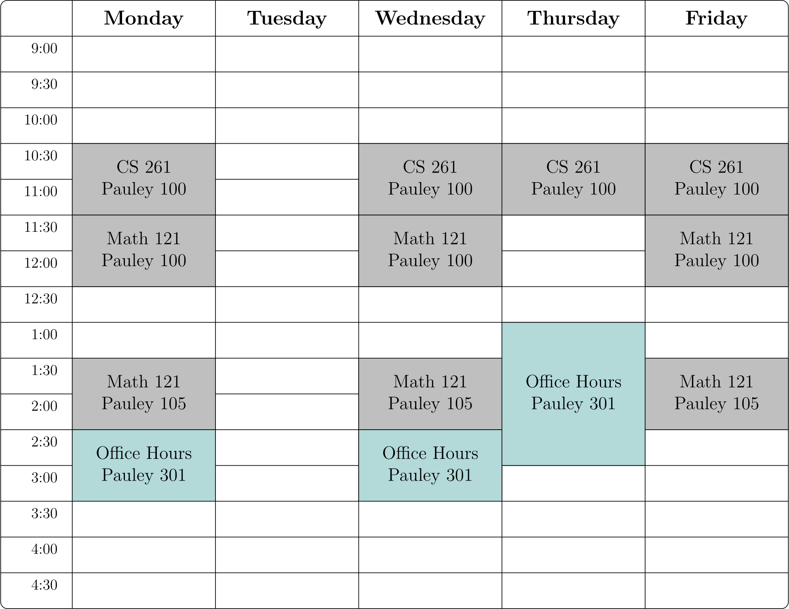

<!--- - --->

<table>
<tr>
<td>
</img>
</td>
<td>

Professor of Mathematics \
[Math & CS Department](http://www.hsc.edu/academics/mathematics-and-computer-science) \
[Hampden-Sydney College](https://www.hsc.edu)

Office: Pauley 301 \
E-mail: <a href="mailto:%62lins%40hsc%2Eedu">&#98;lins&#64;hsc&#46;edu</a> <!---->

[About](about.html) | [Research](research.html) | [Teaching](index.html) 

</td>
</tr>
</table>

<!--- - --->

### Fall 2026 Classes

* CS 261 - [Computer Science I](fall26/coms261/index.html)
* Math 121 - [Statistics](fall26/math121/index.html) 

### Weekly Schedule

### Teaching Materials

* [Old Course Materials](old.html)

 
 
 
 
 
 
 
 
 
 
