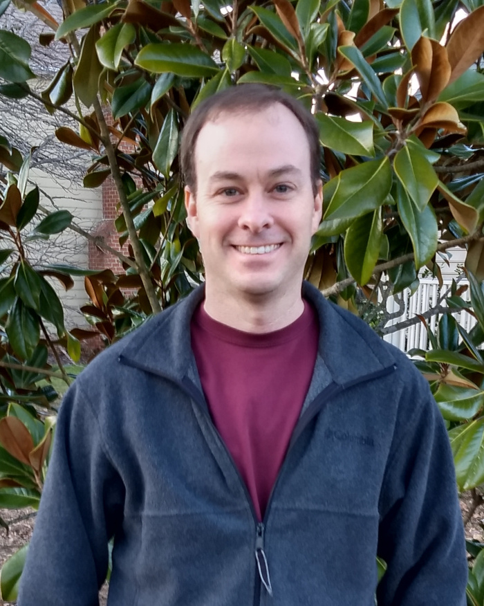

<table>
<tr>
<td>
</img>
</td>
<td>
Professor of Mathematics \
[Math & CS Department](http://www.hsc.edu/academics/mathematics-and-computer-science) \
[Hampden-Sydney College](www.hsc.edu)

Office: Pauley 301 \
E-mail: 

[About](about.html) | [Research](research.html) | [Teaching](index.html) 

</td>
</tr>
</table>

### Publications and CV

All of my recent papers are on the ArXiv. My CV includes a complete list of publications. 

* [ArXiv preprints](https://arxiv.org/search/math?searchtype=author&query=Lins%2C+Brian)
* [Curriculum vitae](LinsCV_Fall23.pdf)

### Research Interests

I have two main research interests. One is nonlinear functional analysis with a particular focus on nonlinear Perron-Frobenius theory and nonexpansive maps. There are many applications of nonlinear functions that are order-preserving and homogeneous on the interior of a cone such as the positive orthant in ℝn or the positive definite matrices. Such functions are nonexpansive with respect to Hilbert's projective metric on the interior of the cone. I'm interested in conditions for establishing the existence and uniqueness of eigenvectors of such functions. These conditions generalize the classical Perron-Frobenius theorem for nonnegative matrices. I'm also interested in the dynamical behavior of these functions under iteration. The tools for studying these problems come from many different parts of mathematics, including topology, metric geometry, linear algebra, and graph theory.   

 

My other interest is matrix analysis and operator theory, especially the theory of numerical ranges. The numerical range of a matrix is a convex set which contains the eigenvalues of the matrix.  I'm interested in continuity properties of the inverse numerical range map and also in generalizations of the numerical range. I'm also interested in connections between numerical ranges and quantum information theory.  

I have been fortunate to work with many exceptional collaborators and to meet and discuss mathematics with interesting people from around the world.

### Student Research

If you are a student and are interested in research opportunities in mathematics, I am always looking for student collaborators. I have several ideas for undergraduate research projects in areas related to linear algebra, complex analysis, quantum information theory, and machine learning.

### Other Links

* [Google scholar](https://scholar.google.com/citations?user=Hg5BZBoAAAAJ)
* [ResearchGate](https://www.researchgate.net/profile/Brian-Lins)

 
 
 
 
 
 
 
 
 
 
