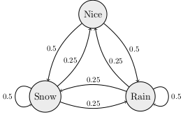

\newcommand{\ds}{\displaystyle}
\newcommand{\on}{\operatorname}
\newcommand{\argmax}{\on{argmax}}
\newcommand{\R}{\mathbb{R}}

## Computer Science 480 - Spring 2024

<center>
Jump to: [Syllabus](index.html), [Week 1](#week-1-notes), [Week 2](#week-2-notes), [Week 3](#week-3-notes), [Week 4](#week-4-notes), [Week 5](#week-5-notes), [Week 6](#week-6-notes), [Week 7](#week-7-notes), [Week 8](#week-8-notes), [Week 9](#week-9-notes), [Week 10](#week-10-notes), [Week 11](#week-11-notes), [Week 12](#week-12-notes), [Week 13](#week-13-notes), [Week 14](#week-14-notes)
</center>

### Week 1 Notes

Day    | Topic
:---:|:---------
Wed, Jan 17 | Vectors and matrices
Fri, Jan 19 | Markov chains

### Wed, Jan 17

<!--
Today we introduced some simple examples of Markov chains.  We also reviewed matrix multiplication.  We also defined **probability vectors** and the **dot product** (which is also known as the **inner product**).  We talked about the geometric meaning of the dot product of two vectors. We did the following examples in class. 
-->

Today we reviewed vectors and matrices.  Recall that a **vector** is all three of the following things:

1. A list of $n$ numbers.
2. A point in $n$-dimensional space.
3. An arrow indicating a length and a direction. 

We denote the set of all real number vectors with $n$ entries by $\R^n$. Recall that the **length** of a vector (also known as the **norm**) is:
$$\|v\| = \sqrt{v_1^2 + v_2^2 + \ldots + v_n^2 }.$$

We also talked about how to multiply vectors by constants (**scalar multiplication**) and how to calculate the **dot product** (see this [Kahn academy video](https://youtu.be/WNuIhXo39_k) for example).   We stated (without proof) the fact that for any two vectors $v, w \in \R^n$, 
$$ v \cdot w = \|v\| \, \|w\| \, \cos \theta$$
where $\theta$ is the angle between the vectors $v$ and $w$.  We finished our review of vectors by saying that two vectors $v, w$ are **orthogonal** when $v \cdot w = 0$.  Then the **orthogonal complement** of a single vector $v \in \R^n$ is the set
$$v^\perp = \{w \in \R^n \, : \, v \cdot w = 0 \}.$$
If $v$ is a nonzero vector, then $v^\perp$ is an $(n-1)$-dimensional hyperspace inside of $\R^n$.  

After reviewing vectors we reviewed matrices and how to [multiply matrices](https://youtu.be/OMA2Mwo0aZg).  We did the following example in class:

1. Multiply $\begin{pmatrix} 1 & 2 & 3 \\ 1 & 0 & -1 \end{pmatrix} \begin{pmatrix} 1 & 0 \\ 1 & 0 \\ 1 & -1 \end{pmatrix}$.

We finished by talking briefly about this problem from [Introduction to Probability by Grinstead & Snell](https://math.dartmouth.edu/~prob/prob/prob.pdf):

2. The Land of Oz is blessed by many things, but not by good weather. They never have two nice days
in a row. If they have a nice day, they are just as likely to have snow as rain the
next day. If they have snow or rain, they have an even chance of having the same
the next day. If there is change from snow or rain, only half of the time is this a
change to a nice day.

<center>
</img> 
</center>

### Fri, Jan 19

Today we looked in more detail at the Land of Oz Markov chain from last time. We started by defining the following terminology.

A **Markov chain** is a model with stages where the next state is randomly determined based only on the current state. A Markov with $n$ states can be described by a **transition matrix** $Q$ which has entries $Q_{ij}$ equal to the probability that the next state will be $j$ if the current state is $i$.  In the Land of Oz example, if the states Nice, Rain, Snow correspond to the row/column numbers 0, 1, 2, respectively, then the transition matrix is 
$$Q = \begin{pmatrix} 0 & 0.5 & 0.5 \\ 0.25 & 0.5 & 0.25 \\ 0.25 & 0.25 & 0.5 \end{pmatrix}$$


A **probability vector** is a vector with nonnegative entries that add up to 1.  You can use probability vectors to model your knowledge about the current state in a Markov chain.  For example, if it were raining today in the Land of Oz, then you could use the probability vector $v = (0, 1, 0)$ to indicated that we are 100\% sure that we are in the middle state (raining). If you multiply $vQ$, then you get the probability row vector representing the probabilities for the states the next day. Here is how to use matrices in the Python using the `numpy` library. 

```python
import numpy as np

Q = np.matrix("0 0.5 0.5; 0.25 0.5 0.25; 0.25 0.25 0.5")
v = np.matrix("0 1 0")
print(v * Q)
```

1. Suppose that today is a nice day.  What is the probability vector that describes how the weather might be the day after tomorrow? 

2. What will the weather be like after 1 week if today is nice?  What about if today is rainy or snowy?  How much difference does the weather today make after 1 week? You can answer this last problem by computing $Q^7$.  

We finished with this additional example which is [problem 5.7.12 in Introduction to Finite Mathematics](https://math.dartmouth.edu/~doyle/docs/finite/fm2/scan/5.pdf#page=64) by Kemeny, Snell, Thompson.  

3. A professor tries not to be late too often.  On days when he is late, he is 90% sure to arrive on time the next day.  When he is on time, there is a 30% chance he will be late the next day.  How often is this professor late in the long run?

<!-- To calculate repeated matrix multiplications, it helps to use the [numpy matrix power function](https://numpy.org/doc/stable/reference/generated/numpy.linalg.matrix_power.html). For example, continuing the code above, we can compute 
```python 
print(np.linalg.matrix_power(Q,7))
```
-->


- - -

### Week 2 Notes
 
Day    | Topic
:---:|:---------
Mon, Jan 22 | Examples of Markov chains
Wed, Jan 24 | Stationary distributions
Fri, Jan 26 | Random text generation

### Mon, Jan 22

Today we did the following workshop about Markov chains. 

* Workshop: [Markov chains](Workshops/MarkovChains.pdf) 

### Wed, Jan 24

Today we talked about some of the features we've seen in Markov chains. Recall that you can think of a Markov chain as a weighted directed graph where the total weight of all the edges leaving a vertex must add up to 1 (the weights correspond to probabilities).  

In all of the examples we've considered so far, we have looked for the final long run probabilities for the states after many transitions.  

**Definition.** A probability vector $w$ is a **stationary distribution** for a Markov chain with transition matrix $Q$ if 
$$wQ = w.$$

In all of the examples we've looked at, 
$$\lim_{k \rightarrow \infty} v Q^k$$ 
exists and is a stationary distribution for any initial probability vector $v$. But this doesn't always happen for Markov chains. 

1. Find a simple Markov chain and an initial probability vector $v$ such that $\lim_{k \rightarrow \infty} v Q^k$ does not converge.  

To better understand the long-run behavior of Markov chains, we need to review strongly connected components of a directed graph (digraph for short).  

**Definition.** A digraph is **strongly connected** if you can find a path from any start vertex $i$ to any other end vertex $j$. A **strongly connected component** of a graph is a set of vertices such that (i) you can travel from any one vertex in the set to any other, and (ii) you cannot returns to the set if you leave it. Strongly connected components are also known as **classes** and they partition the vertices of a directed graph. A class is **final** if there are no edges that leave the class. 

<center>
</img>
</center>
In the digraph above, there is one final class $\{f,g\}$ and two other non-final classes.

<div class="Theorem">
**Theorem (Perron-Frobenius).** A Markov chain always has a stationary distribution. The stationary distribution is unique if and only if the Markov chain has only one final class. 
</div>

We did not prove this theorem, but we did apply it to the following question.

2. Which of the Markov chains that we've considered (the Land of Oz, the Tardy Professor, the Gambler's Ruin problem, and the Coupon Collector's problem) has a unique stationary distribution?  For the one(s) that don't have a unique stationary distribution, describe two different stationary distributions. 

3. Does the Markov chain that doesn't converge from Q1 today have a unique stationary distribution?  How can you tell?  Can you find it? 

Another important is question is to have criteria for when $\lim_{k \rightarrow \infty} vQ^k$ converges. 

**Definition.** A Markov chain with transition matrix $Q$ is **regular** if there is a power $k$ such that $Q^k$ has all positive entries.  

<div class="Theorem">
**Theorem.** A regular Markov chain with transition matrix $Q$ always has a unique stationary distribution $w$ and for any initial probability vector $v$, 
$$\lim_{k \rightarrow \infty} v Q^k = w.$$
</div>

We finished class by talking about how the Google PageRank algorithm uses the stationary distribution of a simple regular Markov chain to rank websites.  The algorithm starts by imagining a random web surfer who clicks on links completely randomly to visit new website.  You can imagine the internet as a giant directed graph and this websurfer can be modeled with an $N$ state Markov chain where $N$ is the number of websites on the internet.  Unfortunately the $N$-by-$N$ transition matrix might not be regular, so the PageRank algorithm creates a new regular Markov chain by using the following algorithm:

* 85% of the time, the random websurfer picks a new website by randomly clicking a link. 
* 15% of the time, the random websurfer picks any one of the $N$ websites on the internet (all equally likely). 

The 85/15 percent split was chosen because the resulting regular Markov chain converges relatively quickly (it still takes days for the computation to update), but it still settles on a stationary distribution where more popular websites are visited more than less popular websites.  


### Fri, Jan 26

Today we wrote a program to randomly generate text based on a source text using a Markov chain.  

* **Workshop**: [Random text generator](Workshops/RandomTextGenerator.pdf)

Here are some [example source texts](sourceTexts.html) you can use.  You can also search online for other good examples if you want. When you are finished, you should have a program that can generate random nonsense like this:

> In the beginning when God created the great sea monsters and every winged bird of every kind on earth that bear fruit with the seed in it." And it was good. And there was morning, the second day. And God saw that it was good. Then God said, "Let there be lights in the dome and separated the waters that were gathered together he called Night. And there was evening and there was morning, the fourth day. And God saw that the light Day, and the waters bring forth living creatures of every kind, and everything that has the breath of life, I have given you every plant yielding seed of every kind, and trees of every kind bearing fruit with the seed in it. 


- - -

### Week 3 Notes
 
Day    | Topic
:---:|:---------
Mon, Jan 29 | Least squares regression 
Wed, Jan 31 | Least squares regression - con'd
Fri, Feb 2 | Logistic regression

### Mon, Jan 29

Today we started talking about linear regression.  We started with the simplest case where you want to predict a response variable ($y$) using a single explanatory variable ($x$).  Based on the observed $x$ and $y$ values, you want to find the best fit trend-line.  We judge how good a trend-line fits the data by calculating the sum of squared deviations between the predicted $y$-values (denoted $\hat{y}_i$) and the actual $y$-values ($y_i$) at each $x_i$.  
$$\text{Sum of squared error} = \sum_{i = 1}^n (\hat{y}_i - y_i)^2.$$
We'll see later that minimizing the sum of squared error has some nice properties.  We looked at the following example. <!--_-->  

```python
import numpy as np
import pandas as pd
import matplotlib.pyplot as plt
df = pd.read_csv("http://people.hsc.edu/faculty-staff/blins/classes/spring18/math222/data/bac.csv")
print(df)
x = np.array(df.Beers)
y = np.array(df.BAC)
plt.xlabel("Beers")
plt.ylabel("BAC")
plt.plot(x,y,"o")
```

<center>
</img>
</center>

The least squares regression line will have a formula 
$$\hat{y} = b_0 + b_1 x$$
where $b_0$ is the $y$-intercept and $b_1$ is the slope.  You can find these two numbers by using the **normal equation**

<!--
1. [Beers and BAC](http://people.hsc.edu/faculty-staff/blins/classes/spring18/math222/data/bac.csv)
2. [Marriage ages](http://people.hsc.edu/faculty-staff/blins/StatsExamples/marriageAges.xls) 
3. [Midterm exam grades](http://people.hsc.edu/faculty-staff/blins/StatsExamples/MidtermRegression.xlsx)
-->

$$X^T X \beta = X^T y$$
where $\beta = \begin{pmatrix} b_0 \\ b_1 \end{pmatrix}$ is a column vector with the intercept and slope that we want to find, $y = \begin{pmatrix} y_1 \\ y_2 \\ \vdots \\y_n\end{pmatrix}$ is the column vector with the $y$-values from the data, and 
$$X = \begin{pmatrix} 
1 & x_1 \\ 1 & x_2 \\ \vdots & \vdots \\ 1 & x_n 
\end{pmatrix}$$
is an $n$-by-2 matrix will all 1's in its first column and the $x$-values from the data in its second column. The notation $X^T$ means that **transpose** of the matrix $X$, which is the matrix you get if you switch all columns of $X$ to rows:
$$X^T = \begin{pmatrix} 
1 & 1 & \ldots & 1 \\
x_1 & x_2 & \ldots & x_n  
\end{pmatrix}.$$
One way to solve the normal equations is to multiply both sides by the inverse of the matrix $(X^T X)$:  
$$\beta = (X^T X)^{-1} X^T y.$$
The **inverse** of a matrix $M$ is denoted $M^{-1}$.  You can only find the inverse of square matrices (same number of rows & columns). Even then, not every square matrix has an inverse, but this formula almost always works for least squares regression.  I only gave a vague explanation in class of why the normal equations work.  But we did use Python to compute the normal equations for the example above: 

```python
X = np.matrix([[1.0 for i in range(len(x))],list(x)]).T
beta = (X.T*X).I*X.T * np.matrix(y).T
print(beta) # [[-0.0127006 ], [ 0.01796376]]
```

Notice that if `A` is a numpy matrix, then `A.T` is its transpose, and `A.I` is its inverse (if one exists). 
The entries of $\beta$ are the intercept followed by the slope, so the least squares regression line for predicting blood alcohol content from the number of beers someone drinks is:
$$\hat{y} = -0.01270 + 0.01796 x.$$

In addition, we can tell from the slope that each extra beer someone drinks tends to increase their BAC by 0.018 points.

### Wed, Jan 31

Today we continued looking at least squares regression.  We covered these additional facts about the least squares regression line 
$$\hat{y} = b_0 + b_1 x$$
when there is only one explanatory variable ($x$). 

* The slope is $b_1 = R \dfrac{s_y}{s_x}$ and
* The line always passes through the point $(\bar{x}, \bar{y})$, which lets you find the $y$-intercept.

Here $\bar{x}$ and $\bar{y}$ denote the average $x$ and $y$-values respectively, $s_x$ and $s_y$ are the standard deviations of the $x$ and $y$-values, and $R$ is the correlation coefficient.  We defined these quantities using the norm (length) and dot products.

$$s_x = \frac{\|x - \bar{x}\mathbf{1} \| }{\sqrt{n-1}},  ~~~~~ s_y = \frac{ \|y - \bar{y}\mathbf{1} \| }{\sqrt{n-1}}, ~~~~~ R = \frac{x - \bar{x}\mathbf{1}}{\|x - \bar{x}\mathbf{1} \|} \cdot \frac{y - \bar{y}\mathbf{1}}{\|y - \bar{y}\mathbf{1} \|}$$

We used a spreadsheet to investigate these examples. 

1. [Marriage ages](http://people.hsc.edu/faculty-staff/blins/StatsExamples/marriageAges.xls) 
2. [Midterm exam grades](http://people.hsc.edu/faculty-staff/blins/StatsExamples/MidtermRegression.xlsx)
3. [Lightning fatalities](http://people.hsc.edu/faculty-staff/blins/statsexamples/Lightning.xlsx)

In the USA, there has been a striking decline in the number of people killed by lightning every year. The trend is strong, but it isn't really a linear trend.  So we used the normal equations to find a best fit quadratic polynomial
$$\hat{y} = b_0 + b_1 x + b_2 x^2.$$
Here is how to do this with numpy. 

```python
import numpy as np
import pandas as pd
import matplotlib.pyplot as plt

df = pd.read_excel("http://people.hsc.edu/faculty-staff/blins/StatsExamples/Lightning.xlsx")
x = np.array(df.year)
y = np.array(df.deaths)

# You can use a list comprehension to enter the matrix X.
X = np.matrix([[xi**k for k in range(3)] for xi in list(x)])
beta = (X.T*X).I*X.T * np.matrix(y).T
print(beta) # [[5.61778330e+04], [-5.42074197e+01], [ 1.30717749e-02]]

years = np.array(range(1960,2021))
plt.xlabel("Year")
plt.ylabel("Fatalities")
plt.plot(x,y,"o") + plt.plot(years,56177.8 - 54.207*years + 0.01307*years**2,linestyle="-")
```

<center>
</img>
</center>

<!--
An even better approximation might look for a power law relationship $\hat{y} = C x^\alpha$.  We'll consider that next time. 
-->

### Fri, Feb 2

Today we did this workshop. 

* **Workshop:** [Least squares regression](Workshops/Regression.pdf)

Here is the Python code to download the two datasets:


```python
import numpy as np
import pandas as pd

df = pd.read_excel("https://people.hsc.edu/faculty-staff/blins/classes/spring23/math121/halfmarathon.xlsx")
genders = list(df.Gender)
ages = list(df.Age)
minutes = list(df.Minutes)

df2 = pd.read_excel("http://people.hsc.edu/faculty-staff/blins/StatsExamples/Lightning.xlsx")
years = np.array(df2.year)
deaths = np.array(df2.deaths)
logDeaths = np.log(deaths) # notice that functions work elementwise on np.arrays.

```


- - -

### Week 4 Notes
 
Day    | Topic
:---:|:---------
Mon, Feb 5 | Linear classifiers
Wed, Feb 7 | Loss functions & gradient descent
Fri, Feb 9 | Stochastic gradient descent

### Mon, Feb 5

Last time we saw came up with a model to predict a runner's race time based on their age and gender.  Our model had the form
$$\hat{y} = b_0 + b_1 x_1 + b_2 x_2$$
where $\hat{y}$ is the predicted race time in minutes, $x_1$ is the runner's age, and $x_2$ is an indicator variable which is 0 for men and 1 for women.  An **indicator variable** is a numerical variable that is 1 if a Boolean condition is true and 0 otherwise.  We can re-write our model using a dot product as:
$$\hat{y} = [b_0, b_1, b_2] \cdot [1, x_1, x_2].$$ <!-- The weight vector was [84.24795527  0.97029783 21.00086375] -->
In this formula, the vector $[b_0, b_1, b_2]$ is called the **weight vector** and $[1, x_1, x_2]$ is called the **feature vector**. Each runner has a different feature vector, but you use the same weight vector for every runner to make a prediction about their race time.   

If we use age and race time to predict gender using least squares, then we get this formula:
$$\text{predicted gender} = 0.0694 - 0.0112 \, \text{age} + 0.00705 \, \text{race_time}.$$
We could use the number $\tfrac{1}{2}$ as a dividing line to separate runners who we would predict are female vs. runners we would predict are male.  This is a simple example of a linear classifier.  A **linear classifier** is a rule that uses a weight vector $w$ and a feature vector $x$ and a threshold $\theta$ to decide how to classify data.  You make a prediction based on whether the dot product $w \cdot x$ is greater than or less than the decision threshold $\theta$.  If we treated men as $-1$ instead of $0$, then we could use the threshold $\theta = 0$, which is a more common choice for linear classification. 

<center>
</img>
</center>

We were able to draw a picture of the line the separates individuals we would predict are women from individuals we would predict are men in the scatter plot for runners.  If we had more than two variables, then we wouldn't be able to draw a picture. And instead of a dividing line, we would get a dividing hyperplane to separate our predictions. But we could still use the same idea. 

Using least squares regression to find our weight vector probably isn't the best choice since the goal of least squared error isn't really what we want.  What we really want is the smallest zero-one error.  **Zero-one error** is the error you get if you add a one for every prediction that is incorrect and a zero for every correct prediction.  Both least squares error and zero-one error are examples of **loss functions** which measure how accurate our predictions are.  

We finished by outlining where we are going in the next few classes.  We are going to look at how to minimize different loss functions over the space of all possible weight vectors (called the **weight space**).  We talked about how precise formulas for the optimal weight vector don't always exist, but we can use a general technique called **gradient descent** that works for many different loss functions. 


### Wed, Feb 7

We talked about gradient descent today.  For a multivariable function $f: \R^n \rightarrow \R$, the **gradient** of $f$ at a point $\mathbf{x} = (x_1, \ldots, x_n)$ is the vector 
$$\nabla f = \left( \frac{\partial f}{\partial x_1}, \frac{\partial f}{\partial x_2}, \ldots, \frac{\partial f}{\partial x_n} \right).$$
We calculated the gradient for these examples. Here is a video that [explains partial derivatives](https://youtu.be/AXqhWeUEtQU). 

1. $f(x,y) = x^2 + y^2$ (<https://youtu.be/_-02ze7tf08>)

2. $f(x,y) = x^4 + y^4 + (x-1)^2 + y$ 

The important thing to understand about $\nabla f$ is that it always points in the direction of steepest increase. This idea leads inspires **gradient descent** which is a simple algorithm to find the minimum of a multivariable function.  

<div class="Theorem">
**Gradient Descent Algorithm.** To find the minimum of $f:\R^n \rightarrow \R$,

1. Start with an initial guess for the minimum $\mathbf{x}$ and a fixed (small) step size $\eta$. 
2. Find the gradient of $f$ at $\mathbf{x}$, $\nabla f(\mathbf{x})$.
3. Replace $\mathbf{x}$ by $\mathbf{x}- \eta \, \nabla f(\mathbf{x})$. 
4. Repeat steps 2 & 3 until your gradient vector is very close to 0. 
</div>

Here is the code I wrote in class to implement this algorithm for example 2 above. 

```python
import numpy as np

# Step 1 initialize initial guess x and step size eta.
x = np.array([0,0])
eta = 0.1
for i in range(20):
    # step 2 calculate gradient
    gradient = np.array([4*x[0]**3+2*x[0]-2, 4*x[1]**3+1])
    # step 3 use the gradient to update x
    x = x - eta*gradient
    print(x, gradient)
```

You have to be careful when you pick the step size $\eta$ (eta).  If it is too big, the algorithm will not converge. If it is too small, the algorithm will be very slow.  

3. Try the code above with different values of $\eta$. What happens if $\eta = 0.5$?  What about $\eta = 0.01$?

4. What will happen if you use gradient descent on a function like this one which has more than one local min?
$$f(x) = x^4 + y^4 - 3xy$$

5. Find the gradient of the following sum of squared error loss function. Then use gradient descent to find the vector $\mathbf{w}$ with the minimum loss. 
$$L(\mathbf{w}) = (\mathbf{w} \cdot [1, 0] - 1)^2 + (\mathbf{w} \cdot [1,1] - 1)^2 + (\mathbf{w} \cdot [1,2] -4)^2$$

### Fri, Feb 9

Today we did this workshop in class:

* **Workshop:** [Gradient descent](Workshops/GradientDescent.pdf)

As part of the workshop, we introduced the stochastic gradient descent algorithm which tends to be an effective way to get gradient descent to converge more quickly. 


<div class="Theorem">
**Stochastic Gradient Descent Algorithm.** Let $L(\mathbf{w}) = \sum_{i = 1}^n L_i(\mathbf{w})$ be a sum of simpler loss functions $L_i(\mathbf{w})$. To minimize the total loss $L(\mathbf{w})$,

1. Start with an initial guess for the minimum $\mathbf{w}$ and a fixed (small) step size $\eta$. 
2. Randomly choose $i \in \{1, \ldots, n\}$.
3. Find the gradient of $L_i$ at $\mathbf{w}$, $\nabla L_i(\mathbf{w})$.
4. Replace $\mathbf{w}$ by $\mathbf{w}- \eta \, \nabla L_i(\mathbf{w})$. 
5. Repeat steps 2 - 4 until your gradient vectors are very close to 0. 
</div>


- - -

### Week 5 Notes
 
Day    | Topic
:---:|:---------
Mon, Feb 12 | Hinge Loss
Wed, Feb 14 | Logistic regression 
Fri, Feb 16 | Nonlinear classification

### Mon, Feb 12

In the workshop last time, we had to calculate the gradient of a function of the form $\mathbf{w} \mapsto (\mathbf{w} \cdot \mathbf{x} - y)^2$.  This is a composition of the one variable function $f(u) = (u - y)^2$ with the dot product $\mathbf{x} \cdot \mathbf{w}$.  In general, we have the following nice lemma which is one special case of the chain rule.

<div class="Theorem"> 
**Lemma.** If $f: \R \rightarrow \R$ is differentiable, and $L(\mathbf{w}) = f(\mathbf{x} \cdot \mathbf{w})$, then 
$$\nabla L(\mathbf{w}) = f'(\mathbf{x} \cdot \mathbf{w}) \mathbf{x}.$$
</div>

Today we looked at linear classification and talked about some of the different loss functions that we could use.  We used the lemma above to help find the gradients for gradient descent. First we introduced the following terminology. 

Suppose that we want to train a linear classifier.  For each individual observed we have a feature vector $X_i$ and a category $y_i$ which is either $+1$ or $-1$.  Our goal is to find the best weight vector $\mathbf{w}$ so for any observed feature vector $X_i$, the sign of $X_i \cdot \mathbf{w}$ does the best possible job of predicting the corresponding value of $y_i$.  We call the number $X_i \cdot \mathbf{w}$ the **score** of the prediction.  If we multiply the score times the correct value of $y_i$, then we will get a positive number if the prediction is correct and a negative number if our prediction is wrong.  We call this number the **margin** and 
$$\text{margin}_i =  y_i \, (X_i \cdot \mathbf{w}).$$ 

The hinge loss function is a function of the margin that is
$$L_\text{hinge} (\mathbf{w}) = \begin{cases}
1 - \text{margin} & \text{ if } \text{margin } < 1 \\
0 & \text{ if } \text{margin } \ge 1 
\end{cases}$$

1. Show that for each pair $X_i$ and $y_i$, the gradient of the hinge loss is 
$$\nabla L_\text{hinge} (\mathbf{w}) = \begin{cases} -y_i X_i & \text{ if } \text{ margin} < 1\\ 0 & \text{ otherwise}. \end{cases}$$

2. Express the zero-one loss function as a function of the margin.  Why won't gradient descent work with zero-one loss?

3. We also looked at the absolute error loss function:
$$L(w) = |\text{margin} - 1|$$ 
and we calculated the gradient of that when $y$ is $+1$ and $-1$.  

With both hinge loss and absolute error loss, the gradient vectors don't get small when we get close to the minimum, so we have to adjust the gradient descent algorithm slightly to use a step size that gets smaller after each step.  


<div class="Theorem">
**Gradient Descent Algorithm (with Variable Step Size).** To find the minimum of $f:\R^n \rightarrow \R$,

1. Start with an initial guess for the minimum $\mathbf{x}$, a (small) step size $\eta$, and $k = 1$. 
2. Find the gradient of $f$ at $\mathbf{x}$, $\nabla f(\mathbf{x})$.
3. Replace $\mathbf{x}$ by $\mathbf{x}- \tfrac{\eta}{\sqrt{k}} \, \nabla f(\mathbf{x})$. 
4. Increment $k$.
5. Repeat steps 2 - 4 until your function $f$ stops getting smaller. 
</div>


<!--
Today we talked about using sum of absolute error instead of sum of squared error to do regression.  Although sum of squares regression is more common, there are some advantages to using sum of absolute error instead. 

1. Absolute error regression isn't affected as much by outliers. 
2. In problems where the data is sparse with lots of variables, absolute error regression is more likely come up with simpler models where some unimportant variables have coefficients equal to zero.  

We can use gradient descent to minimize the total absolute error in our predictions.  

1. What is the gradient of $L_{\mathbf{x},y}(\mathbf{w}) = |\mathbf{x} \cdot \mathbf{w} - y|$ when $\mathbf{x}$ is a feature vector, $\mathbf{w}$ is the weight vector, and $y$ is the correct output? 

-->


### Wed, Feb 14

Today we talked about logistic regression which is one of the most common ways to find a linear classifier.  In a logistic regression model the score $\mathbf{w} \cdot \mathbf{x}$ is interpreted as the log-odds of a success.  

Recall that the probability of any event is a number $p$ between 0 and 1.  Sometimes in probability we talk about the odds of an event happening instead of the probability.  The **odds** of an event is given by the formula 
$$\text{odds} = \frac{p}{1-p}.$$
For example, if an event has probability $p = 2/3$, then the odds are $2$ (we usually say 2 to 1 odds).  You can also easily convert from odds back to probability by computing 
$$p = \frac{\text{odds}}{\text{odds} + 1}.$$
Unlike probabilities, odds can be bigger than 1.  In logistic regression, we are looking for a model of the form
$$\log (\text{odds}) = w_0  + w_1 x_1 + \ldots + w_n x_n = \mathbf{w} \cdot \mathbf{x}.$$
For example, we came up with a very simple logistic regression model to predict whether someone is male or female based on their height:
$$\log(\text{odds}_\text{male}) = 0.5 (\text{height}) - 33,$$
where height is measured in inches.
We based this model on guessing the odds that someone is male or female at a couple different heights, and then guessing a simple linear trend for the log-odd. 

1. Find the log-odds, the odds, and the probability that this model would give for someone who is 67 inches tall to be male. 

2. If we randomly selected 3 people, with heights 64, 69, and 72 inches respectively, what is the probability (according to the model) that the 64 inch tall person is female and the other two are male?  We call this number the **likelihood** of that event. 

We guessed the slope $0.5$ and y-intercept $-33$ in our model.  Those probably aren't the best possible coefficients.  In logistic regression, we want the model that results in the highest likelihood of the actual data happening.  We showed in class that the best coefficients $\mathbf{w}$ happen when we minimize the **logistic loss function** which is the same as the negative logarithm of the likelihood function.

$$L(w) = \sum_{i : y_i \text{ is a success} } -\log (p_i) + \sum_{i : y_i \text{ is a failure}} - \log(1-p_i)$$

where $p_i = \dfrac{e^{\mathbf{w} X_i}}{e^{\mathbf{w} X_i} + 1}$ is the probability of a "success" predicted by the model. 
<!--
We evaluate the model based on the probability that the observed results would happen if the model was true.  For each $y_i$, the predicted probability of $y_i$ being 1 is
$$p_i = \frac{e^{\mathbf{w} \cdot X_i} }{e^{\mathbf{w} \cdot X_i} + 1}$$
and if $y_i$ is $-1$, then the predicted probability for that event is 
$$ 1- p_i = \frac{1 }{e^{\mathbf{w} \cdot X_i} + 1}$$
Instead of multiplying these probabilities together, we add the logarithms to get the log-likelihood function:
$$\operatorname{LLF} = \sum_{i:\, y_i =1} \log( p_i) + \sum_{i: \, y_i = -1} \log (1 - p_i)$$
We can convert this into a loss function by making it negative. Each individual term in the loss function can be expressed as:
$$L_i(\mathbf{w}) = -(1+y_i) \log (p_i) - (1 - y_{i}) \log (1-p_i)$$
The simplest case turns out to be when $y_i = -1$, because then the loss function is 
$$L_i(\mathbf{w}) = \log(1+e^{\mathbf{w} \cdot X_i})$$
which has gradient
$$\nabla L_i(\mathbf{w}) = \frac{e^{\mathbf{w} \cdot X_i}}{1+e^{\mathbf{w} \cdot X_i}} X_i = p_i X_i$$
-->
We also noted that the gradient of the terms in the logistic loss function are
$$\nabla L_i (\mathbf{w}) = \begin{cases} -(1-p_i) X_i & \text{ if } y_i \text{ is a success} \\ p_i X_i & \text{ if } y_i \text{ is a failure}. \end{cases}$$
So you can use (stochastic) gradient descent to find the best coefficients in a logistic regression model.

We looked at this example:

* **Example:** [Predictors of success in calculus](https://people.hsc.edu/faculty-staff/blins/predictors.html)


### Fri, Feb 16

Today we talked about using linear classifiers to do nonlinear classification.  The idea is that you can classify points $\mathbf{x} \in \R^n$ based on a **feature extractor function** $\phi(\mathbf{x})$ instead of on the raw values of $\mathbf{x}$.  We used the example of finding the best circle to separate points inside from points outside.  You can do this by using the feature extractor function 
$$\phi(\mathbf{x}) = (1, x_1, x_2, x_1^2 + x_2^2)$$
and then finding the best parameters $\mathbf{w}$ for the linear classifier
$$\on{sign}(\mathbf{w} \cdot \phi(\mathbf{x})).$$
Even though the classifier is a nonlinear function of the data $\mathbf{x}$ it is still a linear function of the parameters $\mathbf{w}$, so you can still use the same gradient descent techniques we've already discussed. 

We also talked about the dangers of complex models with lots of parameters and complicated feature extractors.  These models tend to **overfit** the data, which means they predict the test data very well, but then fail on real world data.  

We finished by starting this workshop. 

* **Workshop:** [Linear classifiers](Workshops/LinearClassifiers.pdf)


- - - 

### Week 6 Notes
 
Day    | Topic
:---:|:---------
Mon, Feb 19 | Review
Wed, Feb 21 | **Midterm 1**
Fri, Feb 23 | Regularization

### Mon, Feb 19

Went over what you should know going in to the midterm on Wednesday.  Make sure you know all of the terms in **bold** and how to do any of the indicated calculations by hand. 

#### Markov chains
  
* How to represent **Markov chains** with graphs and **transition matrices**.
* How to multiply transition matrices, find powers of matrices. How to interpret **probability vectors** and update them using the transition matrix.
* Know what a **stationary distribution** is for a Markov chain. 
* Know how to find the **classes** of a Markov chain graph. 
* Know the **Perron-Frobenius theorem** and the definition of a **final class**.
* Know the difference between **absorbing** and **transient** states.
* Know what a **regular** Markov chain is. 

#### Regression 

* Be able to use a regression model 
$$\hat{y} = b_0 + b_1 x_1 + \ldots + b_n x_n$$
to make predictions $\hat{y}$ about a variable $y$ based on the values of $\mathbf{x}$.  
* Understand different **loss functions**.  
* Know how to find the **least squares error** $\|\hat{y} - y\|^2$. 
* Be aware of the **normal equations** for finding the least squares error solution of $X \beta = y$. 

#### Linear Classification 

* Understand linear classification models of the form $\hat{y} = \on{sign}(\mathbf{w} \cdot \mathbf{x})$. 
* Be comfortable using a **feature extractor function** $\phi$ to do simple nonlinear classification tasks using a model of the form 
$$\hat{y} = \on{sign}(\mathbf{w} \cdot \phi(\mathbf{x})).$$

#### Gradient Descent

* Know the definition of the **gradient** $\nabla f$ of a function $f$. 
* Be able to calculate gradients of simple (polynomial) functions.
* Be able to calculate the gradient of functions of the form $L(\mathbf{w}) = f(\mathbf{w} \cdot \mathbf{x})$. 
* Understand the **gradient descent algorithm.**
* Understand the hyperparameters $\eta$ (step size) and $n$ (number of iterations) in the gradient descent algorithm. 
* Know the following loss functions: **squared error**, **absolute error**, **hinge loss**, and **zero-one loss**.

#### Logistic Regression

* Be able to interpret models of the form 
$$\log(\text{odds}) = \mathbf{w} \cdot \mathbf{x}.$$
* Be able to convert from log-odds to odds and from odds to probability and vice versa. 


### Fri, Feb 23

Today we looked at data from a large set of e-mails to determine which features indicate that the e-mail might be spam.  We also implemented a technique called **regularization** where our goal is not just to minimize a loss function, but to minimize
$$\text{Loss} + \text{Complexity}$$
where the second term is a **complexity function** that gets larger as the weight vector $\mathbf{w}$ gets more complicated.  A simple, but commonly used, complexity function is the 1-norm (AKA $L_1$-norm) of the weight vector
$$\|\mathbf{w}\|_1 = |\mathbf{w}_1| + |\mathbf{w}_2| + \ldots + |\mathbf{w}_n|.$$
In class we used gradient descent to minimize 
$$L(\mathbf{w}) + \lambda \|\mathbf{w}\|$$
where $L(\mathbf{w})$ is a loss function and $\lambda$ is a **regularization constant** which is another hyperparameter we can adjust to tune our model.  Larger values of $\lambda$ tend to penalize large coefficients in the weight vector and also frequently lead to many less important variables getting a coefficient of zero.  So regularization helps use find simpler models that are less likely to overfit the data. 

We did the following two examples in class:

* **Example:** [Linear classifier for spam emails](https://colab.research.google.com/drive/1mYcrmibkeViIwbr_XMJxqvGEdnmoB7rb?usp=sharing)

* **Example 2:** [Linear regression to predict baby birthweight](https://colab.research.google.com/drive/18QF84AOyVu09Tc8nfWv4V-y0zd1GIHv0?usp=sharing)

<!--_-->


- - -

### Week 7 Notes
 
Day    | Topic
:---:|:---------
Mon, Feb 26 | Neural networks
Wed, Feb 28 | Backpropagation
Fri, Mar 1 | Backpropagation - con'd

### Mon, Feb 26

Today we introduced **neural networks**. These are often depicted using graphs like this. 

<center>
</img>
</center> 

The image above shows a very simple neural network with just one hidden layer.  It reads an input vector $\mathbf{x}$ with three entries, and then find values for 4 nodes in the hidden layer, which are then used to find the values of the 2 nodes in the output layer.  

The simplest types of neural networks are **feed forward networks** which are used to convert input vectors to output vectors using weights that are determined by training.  More complicated neural networks (**recurrent neural networks**) can recycle their outputs back to input. We won't worry about those for now.  

All neural networks used in machine learning focus on a very simple type of function to go from one layer to the next.  Each step from layer $k-1$ to layer $k$ is a function $F_k$ which combines an **affine linear transformation** $W^{(k)} \mathbf{v}^{(k-1)} + \mathbf{b}^{(k)}$ where $W^{(k)}$ is a matrix and $\mathbf{b}^{(k)}$ is a vector with a nonlinear **activation function** $\sigma$: 
$$\mathbf{v}^{(k)} = F_k(\mathbf{v}^{(k-1)}) = \sigma(W^{(k)} \mathbf{v}^{(k-1)} + \mathbf{b}^{(k)}).$$  
Common choices for the activation function $\sigma$ are 

* **Rectified linear unit.** $\on{ReLU}(x) = \max(0, x)$
* **Hyperbolic tangent.** $\tanh(x) = \dfrac{e^x - e^{-x}}{e^x + e^{-x}} = \dfrac{e^{2x}-1}{e^{2x} + 1}$ 
* **Sigmoid function.** $\sigma(x) = \dfrac{1}{1+e^{-x}} = \dfrac{e^x}{e^x + 1}.$

*Note: In class I wrote the formula for $\tanh(x/2)$ instead of $\tanh x$ when I defined the hyperbolic tangent on the board, which was a mistake.  I also said that the hyperbolic tangent function is a sigmoid function, which is true, but there are other sigmoid functions.  The one I've added above is the one many textbooks refer to as "the" sigmoid function.*

<center>
<figure>
</img>
<figcaption style="text-align:left">**Figure.** An example showing how a simple neural network with two hidden layers might be structured.</figcaption>
</figure>
</center>

Notice that row $i$ of the matrix $W^{(k)}$ is a weight vector corresponding to all of the arrows that enter node $i$ in the $k$-th layer of the neural network.  The vector $\mathbf{b}^{(k)}$ is called a **bias vector** and it contains the constant terms in the computation.  

It is important to have a nonlinear activation function as part of each step between layers, otherwise we would just be composing (affine) linear maps, which would just result in a single (affine) linear map at the end.  

We can still use (stochastic) gradient descent, but there are some caveats. 

1. A neural network tends to have many more parameters than a simple linear classifier.  Each entry of the matrices $W^{(k)}$ and the vectors $\mathbf{b}^{(k)}$ is a parameter that needs to be considered as we minimize the loss function.  

2. Because the loss functions tend to be very complicated, they might have more than one local minimum. A single run of gradient descent might get stuck in the wrong local minimum.  

3. It's very hard to know which settings (steps size, etc.) to choose to get gradient descent to work well. 

Once we got these definitions out of the way, we took a look at this really cool website to get a feeling for how neural networks work and what they can do. 

* **Example.** <https://playground.tensorflow.org/>

We played with creating some simple neural networks for different classification problems, and saw that more complicated problems required multiple layers.  We also talked briefly about epochs, but we'll talk about that in more detail later. 

### Wed, Feb 28

Today we introduced **backpropagation** which is an algorithm for finding the gradients of functions efficiently. It is one of the main ideas that makes working with neural networks feasible.  

We started by describing how any formula built from simple building blocks like addition, multiplication, max, powers, etc. can be re-written using a computation graph. 

<div class="Theorem">
**Definition.** A **computation graph** is a directed acyclic graph whose root node represents the final mathematical expression and every other node represents intermediate subexpressions.
</div>

We can label each node in a computation graph with the subexpression in the computation and possibly a variable name to represent that subexpression. A directed edge from a node $u$ to a node $v$ can be labeled with the partial derivative $\dfrac{\partial v}{\partial u}$. Once we have a computation graph, the backpropagation algorithm works as follows. 

<div class="Theorem">
#### Backpropagation algorithm.

1. Forward pass: Starting from the values of the nodes in the graph with node inbound edges, compute each subexpression in the graph. 

2. Backward pass: Once you finish computing the final expression (the root), work backwards from the root to find the partial derivatives $\dfrac{\partial \, \text{root}}{\partial \, \text{subexpression}}$ for every subexpression in the graph.  
</div>

We did these examples in class:

1. Draw the computation graph for this function $f(x,y,z) = 2z (x+y)$. 
<details>
<summary>Solution</summary>
<center>
</img>
</center>
<p>There is more than one way to create a computation graph for an expression, but you want to break the computation into many steps small so that it is easier to find the partial derivatives for each edge. 
</details>

2. Use the computation graph and the backpropagation algorithm to find $\nabla f$ at the point $(x,y,z) = (1,2,3)$. 
<details>
<summary>Solution</summary>
Below we added the forward pass computations in blue and the backward pass computations in green.  Notice that each partial derivative in green is the product of the (red) partial derivative on the edge above it with the (green) partial derivative for the node above it in the graph (because of the chain rule).
<center>
</img>
</center>
<p>Therefore the gradient is $\nabla f = (6,6,6)$.
</details>

3. Use backpropagation to find the gradient $\nabla L(\mathbf{w})$ for the function $L(\mathbf{w}) = (\mathbf{w} \cdot [1,3] - 1)^2$ at the point $\mathbf{w} = [0,4]$.  
<details>
<summary>Solution</summary>
As in the previous solution we added the forward pass computations in blue and the backward pass computations in green.  
<center>
</img>
</center>
<p>The gradient is $\frac{\partial L}{\partial \mathbf{w}} = [22,66]$. 
</details>

One of the things we talked about in the last example is that $\frac{\partial L}{\partial \mathbf{w}}$ is another notation for the gradient $\nabla L(\mathbf{w})$. They both represent the same thing.  

If you want more examples (along with more explanation of the process) these slides from the Stanford CS221 course are worth looking over:

* **Example** [Stanford AI Lecture Notes on Backpropagation](https://stanford-cs221.github.io/spring2023/modules/module.html#include=machine-learning%2Flearning3.js&slideId=lecture-machine-learning&level=0)

### Fri, Mar 1

Today we did this workshop in class.  

* **Workshop:** [Backpropagation](Workshops/Backpropagation.pdf)

- - -

### Week 8 Notes
 
Day    | Topic
:---:|:---------
Mon, Mar 4 | Tensorflow introduction
Wed, Mar 6 | Classifying traffic signs
Fri, Mar 8 | Image convolution

### Mon, March 4 

Today we introduced Tensorflow to create a neural network that can identify handwritten digits. The example we created in class is based on this [TensorFlow 2 quickstart for beginners](https://www.tensorflow.org/tutorials/quickstart/beginner).   

We started by downloading an example dataset (the [MNIST dataset](https://en.wikipedia.org/wiki/MNIST_database)) that is included with TensorFlow.  Then we trained a simple neural network with one hidden layer to classify numbers.  We played around with it and found that it works pretty well on the training and test data, but doesn't always work well on other handwritten examples.  

* **Example:** [Drawing tool](drawingTool.html)

In order to explain the model, we also introduced the [softmax function](https://en.wikipedia.org/wiki/Softmax_function).  The code for two neural networks we trained is here:

* **Example:** [TensorFlow basic example](https://colab.research.google.com/drive/1eaUCB1VikT1IHVayYrtbai7Cl9RaGJe8?usp=sharing)

### Wed, March 6

Today I gave everyone time in class to create their own neural network to classify images of German street signs into one of three categories:

* Category 0 - Stop signs
* Category 1 - Left turn signs
* Category 2 - Speed limit signs

The images are stored as 32-by-32 numpy arrays of integers between 0 (black) and 255 (white).  You can download the images using the following commands in Python:

```python
import pickle
import urllib.request
import tensorflow as tf
import matplotlib.pyplot as plt
from sklearn.model_selection import train_test_split

images, labels = pickle.load(urllib.request.urlopen("https://bclins.github.io/spring24/cs480/trafficSigns.pkl"))
categories = ["stop sign","turn sign","speed limit sign"]
train_images, test_images, train_labels, test_labels = train_test_split(images,labels)
```

Here pickle is a library that lets you store Python data in a file that other people can access.  The URLlib lets you get the pickle data from my website.  The last function `train_test_split()` from the Scikit-learn library lets us randomly separate some of the data to use for training and some to keep for testing our neural network after it is trained.  

To see what the images look like, use a command like this:

```python
i=0
print(images[i])
plt.imshow(images[i])
plt.gray()
plt.show()
```

<center>
</img>
</center>

Notice that this is a (German) speed limit sign, and has label `labels[i]` equal to 2, which is the correct label for a speed limit sign. 

1. Use the code above to load the data. Then use TensorFlow to create and train a neural network model that classifies images of traffic signs. You can crib off the [TensorFlow neural network I created in class on Monday](https://colab.research.google.com/drive/1eaUCB1VikT1IHVayYrtbai7Cl9RaGJe8?usp=sharing) to get started (see the notes below). How accurate is your neural network on the training data?  What about the test data?

Here are a couple of issues that will come up as you do this.  

* You need to divide each image array by 255 (just like what we did on Monday) so that each entry is between 0 and 1. But because the data is a list of numpy arrays, you can't just divide the whole list by 255 (unlike on Monday where the data was a single giant numpy array).  So you'll have to convert the variables `train_images` and `test_images` to numpy arrays: 
  ```python
  import numpy as np
  train_images = np.array(train_images)
  test_images = np.array(test_images)
  ```
  Then it will be easy to scale everything by dividing by 255. 

* When you get to the command to train the TensorFlow model, it expects both the image data and the labels data to be numpy arrays not regular python lists.  So you'll have to convert `train_labels` and `test_labels` as well. 

* When you define the model, make sure to use the correct image size (32-by-32) for the inputs (not the 28-by-28 image size from Monday).  Also, since we are only classifying three categories of signs, your final output layer only needs 3 nodes. 

* There are only 840 images in the data set, so each epoch should run pretty fast.  You might want to do more than 5 epochs, but don't do too many.  Once the accuracy levels off, there is no point in running more epochs. Too many epochs increases the risk of overfitting the data. 

In class, a lot of people got neural networks that were 100% accurate. That raises the following question:

2. Which image does the neural network have the most trouble classifying? In other words, which image has the lowest maximum probability in its probability model? 


### Fri, Mar 8 

Today we talked briefly about the idea of a **convolutional neural network** and **image convolution** without going into too many details.  The idea is to add convolution layers to the model before the regular neural network layers.  

Here is a nice video explanation of how image convolution works with a kernel matrix. 

* **Video:** [3Blue1Brown - But what is a convolution?](https://youtu.be/KuXjwB4LzSA?t=514)

Here is the wikipedia entry about image convolution kernels with several examples.

* **Examples:** [Wikipedia - Kernel (image processing)](https://en.wikipedia.org/wiki/Kernel_(image_processing))

After talking briefly about image convolution, we did this workshop in class:

* **Workshop:** [Image convolution](Workshops/ImageConvolution.pdf)


- - -

### Week 9 Notes
 
Day    | Topic
:---:|:---------
Mon, Mar 18 | Unsupervised learning: k-means 
Wed, Mar 20 | k-means clustering - con'd 
Fri, Mar 22 |

### Mon, Mar 18

Today we introduced the **$k$-means clustering algorithm** which is a popular form of **unsupervised learning**.  Unlike linear classifiers, regression, and neural networks which all need training data to learn from, unsupervised learning algorithms do not require any training information.  

The goal of the $k$-means clustering algorithm is to take a large collection of vectors $x_1, \ldots, x_n$ and partition them into $k$ different sets (called **clusters**) $C_1, C_2, \ldots, C_k$ so that the sum of the squared distances from each vector to the average of its cluster is minimized.  We can summarize this goal by saying that we want to minimize the following **objective function**:

$$\sum_{i = 1}^k \sum_{x_j \in C_i} \|x_j - z_i\|^2$$

where 
$$z_i = \dfrac{1}{|C_i|} \sum_{x_j \in C_i} x_j$$ 
is the average of the vectors in the cluster $C_i$ (sometimes called the **centroid**).  Notice that the objective function is a function of the clusters $C_1, \ldots, C_k$, not the vectors. If we choose good clusters, then points in the clusters will be close together and the objective function will be small.  If we choose bad clusters, then the points in a cluster will be spread out far from their average.  Because clusters are discrete rather than continuous variables, we can't use gradient descent to find the minimum, so we need an alternative.  The $k$-mean algorithm is a way to find clusters that minimize the objective function.  It is not guaranteed to find the absolute minimum, but it tends to work well in practice.  

<div class="Theorem">
#### $k$-Means Algorithm
Given a list of $n$ vectors $x_1, x_2, \ldots, x_n$, and an initial list of $k$ representative vectors $z_1, \ldots, z_k$ repeat the following steps several times:

1. **Update the partitition.** Loop through the vectors $x_j$. For each $x_j$ find the $z_i$ that is closest to $x_j$ and put $x_j$ into cluster $C_i$.

2. **Update the averages.** Replace each $z_i$ with the average of cluster $C_i$. 
</div>

There are a couple of edge cases and other issues in the algorithm to consider. 

1. To pick the initial representative vectors $z_1, \ldots, z_k$, one simple option is to just pick a random sample of size $k$ from the vectors $x_1, \ldots, x_n$.  Other more complicated methods are available, but this simple option often works well. 

1. If at any step a cluster is empty, then you can remove that cluster and its corresponding $z_i$ in the next round of the algorithm. It is okay to end up with fewer than $k$ clusters at the end. 

1. If you get a tie when you calculate the minimum distances from $x_j$ to different $z_i$, just use the lower $i$ as a tie breaker.  

1. If there is a step in the algorithm where the cluster assignments don't change, then you are done because from that point on you will always get the same clusters $C_i$ and averages $z_i$.  

1. The $k$-means algorithm might only converge to a local minimum, so you might want to try different randomly chosen starting vectors $z_i$ to run the algorithm multiple times and get closer to the absolute minimum.

1. How do you know how many clusters $k$ to look for?  The answer is that people usually try several different $k$ and look to see what works best. 

We finished by looking at some examples of $k$-means clustering.  

1. We used it to group points in the 2-dimensional plane into clusters. 

2. We also used it to cluster images of handwritten numerals.  

### Wed, Mar 20

Today we did a workshop in class to program the k-means algorithm and apply it to some data.  

* **Workshop**: [k-Means Clustering](Workshops/Clustering.pdf)

We looked at the following example data sets. 

```python
# Example 1
A=np.array([[3.39298264,1.94834851],[1.41747742,-1.06609251],[3.01888289,0.46840267],[2.59476459,1.13654766],[3.17962937,1.53188254],[4.82441491,1.1639604],[2.28793317,1.42545649],[3.92271615,-0.43760635],[1.3398049,0.69655122],[2.08559661,1.54877526],[0.62474841,1.83644512],[3.30539001,1.58518931],[2.60604184,1.54313128],[3.79532225,1.93029646],[3.18970132,1.37181024],[3.05993575,0.65569489],[2.72167775,1.14615515],[3.1319596,1.44343859],[2.04141107,1.16246335],[1.50404055,-0.72858893],[3.71654022,1.01262813],[2.15896926,-0.38455158],[3.68823967,0.83976529],[3.74768895,2.51485743],[2.60539076,1.59746209],[2.7209025,1.15981584],[2.74492997,0.49898255],[2.05625716,1.35438043],[3.35753586,0.72353369],[3.83737683,1.49555398],[4.16856373,-0.0796789],[2.72119861,0.48606978],[1.11115148,1.78233831],[2.28710689,0.52219863],[4.43789009,0.77498025],[2.63243216,0.20844207],[2.45771129,0.63496389],[4.58781488,0.84390828],[4.49266737,1.51652135],[2.19225968,-0.20082593],[-3.33108966,1.84044684],[-2.87952061,0.26483827],[-1.91099489,1.69754136],[-0.38340388,-0.77760197],[-3.27463826,2.28404138],[-2.82674904,1.10755789],[-3.58454208,2.46692198],[-2.7890395,3.35552427],[-2.13916854,2.91111573],[-1.75712374,2.91114338],[-0.19020027,3.05790698],[-1.03813622,1.68133303],[-2.45250168,2.00668745],[-3.32914595,2.98236229],[-2.7359661,0.74214967],[-2.14185246,1.5616797],[-1.14146589,2.77219574],[-1.17915129,2.97068053],[-3.91823034,2.36180472],[-2.77497322,2.75405217],[-1.74017177,-0.0112908],[-2.54457885,-0.08030844],[-2.24386365,1.68118681],[-2.13929886,1.80696979],[-3.38453642,1.91595502],[-2.74969769,2.98272972],[-2.02762516,2.28374355],[-1.57081931,0.95091447],[-2.25055478,2.97364212],[-2.05333346,2.21319462],[-0.30966156,1.68360366],[-2.663673,2.40502817],[-2.39529563,1.10011018],[-2.1959445,1.71060711],[-2.97219654,2.11575234],[-2.84580477,0.20557117],[-2.6173328,0.74921416],[-1.52159101,2.65001544],[-2.4433551,1.02685595],[-2.12929786,0.72600607],[0.19492455,-1.67703055],[-0.76991854,-3.11650723],[1.82199478,-2.65757475],[1.77235937,-4.37291202],[1.62185379,-2.73819575],[0.53052864,-2.87300213],[2.211509,-1.5945835],[0.75629947,-2.34063626],[0.48747361,-4.712812],[0.98946836,-1.6469933],[0.14140644,-2.45932312],[1.59394818,-3.54982431],[0.82900382,-1.49088422],[1.91330565,-3.10304953],[1.55071551,-1.3019889],[2.07262932,-2.83695848],[0.6309725,-2.43503632],[0.40672592,-3.17878599],[0.63487873,-1.64755885],[0.14652861,-2.56779286],[2.89050861,-4.12863705],[0.65470396,-3.0693579],[-0.89294102,-2.13657012],[1.93693144,-3.23388432],[1.79613072,-3.77096511],[1.81757032,-4.82310411],[2.04578013,-3.37053541],[1.16715492,-2.41535253],[-0.45211248,-2.70447155],[1.12654038,-2.70539792],[1.77919211,-3.27680203],[0.71004689,-3.606527],[2.45568189,-3.32399397],[2.70726689,-5.08994183],[1.46983163,-4.02313571],[1.20150021,-5.0482586],[1.43997273,-3.06096932],[0.52519365,-2.15182127],[1.7338365,-4.58949412],[2.20227891,-2.41147888]])

# Example 2
X = np.array([[62606,7.96],[48265,9.15],[42330,8.52],[47603,8.68],[42878,8.12],[40247,7.99],[10098,3.32],[2104,7.23],[8943,6.86],[11290,5.62],[55060,9.09],[6374,7.02],[33440,8],[9898,6.45],[34260,7.99],[30645,8.3],[56530,8.89],[83832,9.03],[54708,9.25],[75504,9.87],[58118,9.22],[49678,9.25],[51557,8.29],[50195,8.99],[65233,6.02],[42823,7.89],[81347,9.24],[42084,9.26],[22670,8.11],[23203,8.75],[16593,7.88],[17876,7.88],[22850,8],[9126,4.56],[7594,5.98],[11387,6.88],[4048,6.39],[3109,6.94],[2715,3.08],[9421,7.02],[6178,6.78],[15560,8],[6051,7.15],[2028,4.2],[3035,3.9],[23219,2.89],[70474,2.75],[1541,4],[1887,4.61],[5314,2.14],[4867,3.21],[507,1.55]])

# Example 3
Z = np.array([[1.38416797780957,0.484344328440116],[0.799874365341908,1.02175202153451],[0.558065384796926,0.73724206636689],[0.772902580148853,0.809498562917397],[0.580392481905376,0.556600824990623],[0.473197970058055,0.497892421543337],[-0.755159056808105,-1.61109407152458],[-1.08085762302151,0.154674062928429],[-0.802217080823178,-0.0124190853446179],[-0.706593546309433,-0.572406933611046],[1.0767222209111,0.994655835328071],[-0.90688553423852,0.0598374112058886],[0.195861199953642,0.502408452577743],[-0.763307632395131,-0.197576357755292],[0.229270359860446,0.497892421543337],[0.0819848561249604,0.637889383609944],[1.13661425147574,0.904335214639938],[2.24897630486059,0.967559649121631],[1.06238072787793,1.06691233187858],[1.90966961741685,1.34690625601179],[1.20131394163672,1.05336423877536],[0.857444051864243,1.06691233187858],[0.933999919504348,0.633373352575536],[0.878508119756704,0.949495524984004],[1.49119951814515,-0.391765692234779],[0.578151623618944,0.45273211119927],[2.1477302531918,1.06239630084417],[0.548042636824884,1.07142836291298],[-0.242939595407682,0.552084793956216],[-0.221223641468259,0.841110780158244],[-0.490534064619452,0.448216080164863],[-0.438260952228683,0.448216080164863],[-0.235605877379359,0.502408452577743],[-0.794761134161049,-1.05110622325815],[-0.857179223157665,-0.409829816372405],[-0.702641487149726,-0.00338702327580474],[-1.00165346831563,-0.224672543961732],[-1.03991103069671,0.0237091629306356],[-1.05596372460315,-1.71947881635034],[-0.782741985170187,0.0598374112058886],[-0.914871138313805,-0.0485473336198714],[-0.532621457526439,0.502408452577743],[-0.920045483811567,0.118545814653176],[-1.08395408174458,-1.21368334049679],[-1.04292600366391,-1.34916427152899],[-0.220571755421297,-1.80528340600407],[1.70473294140316,-1.86850784048576],[-1.10379586329899,-1.30400396118493],[-1.08969882753344,-1.02852606808612],[-0.950072984849755,-2.14398573358457],[-0.968285051286758,-1.66077041290306],[-1.14592399908391,-2.41043156461456]])
```

Since each of these data sets contains 2-dimensional data, you can plot the clusters when you are done with this code. 

```python
import matplotlib.pyplot as plt
for cluster in clusters:
    clusterArray = np.array(cluster)
    plt.plot(clusterArray[:,0], clusterArray[:,1],'o')
plt.show()
```

### Fri, Mar 22

Today we talked about some disadvantages of k-means clustering.  We looked at the last two examples from Wednesday's workshop and we observed that they look the same when you graph them.  The only difference is the scale.  The x-values in the first example are much more spread out than than the x-values in the second.  Because of that, your clusters end up very different.  When the x-values are much larger than the y-values, differences in the y-values get drowned out by the differences in the x-values, so you end up basing your clusters only on the x-values (see the left image below).  

<center>
<figure>
<table>
<tr><td></img></td><td></img></td></tr>
</table>
<!--<figcaption>When the x-values are much more spread out than the y-values (left), the clusters ignore the y-values.  Standardizing the data so they have similar measures of spread fixes the problem (right).</figcaption>-->
</figure>
</center>

Standardizing the x-values and the y-values so they have similar spreads fixes the problem (right image above). 

We talked about how to standardize data by computing z-values.  
$$z = \frac{x - \bar{x}}{s}$$
where $\bar{x}$ is the average of the data and $s$ is the **standard deviation**. I briefly described how to find the standard deviation in Excel and numpy.  

Another problem that arises in k-means clustering is the curse of dimensionality.  The **curse of dimensionality** refers to several problems that arise when dealing with high dimensional data including:

* Some problems get exponentially more complicated as the dimension increases.
* You need a lot more data to explore high dimensional spaces.
* Randomly points in a bounded set in high dimension tend to all be similar distances apart. For example, random points in the unit hypercube tend to all be in the corners and not in the middle!   

We looked at this Google Colab example. 

* **Example**: [The Curse of Dimensionality](https://colab.research.google.com/drive/1uibgpwo_0NcA91FK4n2ndCsRYoEBYtSE?usp=sharing)

One way to deal with the curse of dimensionality is to use dimension reduction techniques, which we will talk about next week. 

We finished by briefly mentioning some applications of k-means clustering including 

* [Color quantization](https://en.wikipedia.org/wiki/Color_quantization)

* [Document clustering](https://en.wikipedia.org/wiki/Document_clustering)


- - -

### Week 10 Notes
 
Day    | Topic
:---:|:---------
Mon, Mar 25 | Principal component analysis
Wed, Mar 27 | k-Nearest neighbors algorithm
Fri, Mar 29 | Dimension reduction

### Mon, Mar 25

Today we talked about dimension reduction using **principal component analysis**.  Principal component analysis is an idea from linear algebra that allows us to take data vectors $x_1, \ldots, x_n \in \R^d$ where the dimension $d$ is very large and replaced them with vectors in a much lower dimensional space that still capture most of the information that was contained in the original vectors.  Principal component analysis is one of the most commonly used methods for **dimension reduction**.  

Let $X$ be an $n$-by-$d$ data matrix with rows $x_1, \ldots, x_n$ that are each $d$-dimensional.  Let $\bar{x}$ be the row vector with entries equal to the average of each column of $X$. Then the **covariance matrix** for $X$ is
$$Q = \frac{1}{n-1} (X-\bar{x})^T (X-\bar{x})$$
You can use the command `np.cov(X.T)` to compute the covariance matrix for $X$.  (Note: you need to compute the transpose of $X$ because numpy defines the covariance matrix in terms of $d$-by-$n$ data matrices, which is the opposite of how we defined them).

By the [spectral theorem](https://en.wikipedia.org/wiki/Spectral_theorem) from linear algebra, there is a diagonal matrix $D$ (with decreasing diagonal entries) and a matrix with orthogonal columns $W$ (both $d$-by-$d$) such that 
$$Q = W D W^T.$$
The columns of $W$ are the **principle components** of $X$. You can transform the data matrix $X$ into a new data matrix $T$ with uncorrelated variables (orthogonal columns) by calculating $T = X W$.  You can also create a reduced data matrix by computing 
$$T_k = X W_k$$
where $W_k$ is the submatrix of $W$ containing only the first $k$ columns (the first $k$ principal components).  You can also reduce the dimension of a single row vector $x \in \R^d$ by computing $x W_k$ which will be in $\R^k$.  

Here is numpy code to find the matrices $W$ and $D$. Note that numpy puts the diagonal entries (which are called the **eigenvalues** of $Q$) in increasing rather than decreasing order.  Therefore we need to choose the *last* k columns of $W$ if we want $W_k$. 

```python
import numpy as np

Q = np.cov(X.T)
d, W = np.linalg.eigh(Q)
k = 2 # choose how many dimensions you want
Wk = W[:,-k:] # use the last k columns of W
Tk = X @ Wk
```

In order to recover (approximately) the original data matrix, you can compute 
$$X \approx T_k W_k^T = X W_k W_k^T.$$  
If $k = d$, then this will completely recover the data matrix $X$, otherwise you'll get a matrix that is the same shape as $X$, but the data in it will be compressed.  

We finished class by doing a principal component analysis of 28 images of faces from the [Yale face database B](http://cvc.cs.yale.edu/cvc/projects/yalefacesB/yalefacesB.html).

<center>
</img>
</center>

* **Example:** [Principal component analysis of faces](https://colab.research.google.com/drive/1_CKDdLQY7egvofW1RPWTLHQygEhSgjRX?usp=sharing)

### Wed, Mar 27

Today we talked some more about principal component analysis.  We started with a simple data matrix with 2 dimensional rows.  

```python
X = np.array([[-1.176,-0.381],[4.299,5.560],[-1.270,-0.504],[1.110,0.872],[0.993,-2.293],[1.072,-2.637],[-0.706,0.130],[-0.769,0.933],[1.994,1.891],[-0.519,-0.583],[-2.484,-3.332],[0.242,0.079],[2.637,6.201],[-2.355,-3.816],[2.235,5.870],[0.835,2.000],[0.102,-1.634],[-0.404,-1.923],[0.751,4.235],[-1.180,-2.588],[-0.527,2.032],[2.563,2.954],[-1.812,0.269],[-1.063,-2.531],[-0.452,3.400],[1.005,0.904],[1.989,1.574],[-1.513,-1.100],[-1.587,-0.461],[0.019,-0.514],[1.394,2.163],[-1.424,0.307],[0.665,-0.568],[1.026,3.185],[-1.818,-0.114],[-3.490,-3.137],[-2.007,-0.326],[-0.130,0.283],[-0.010,-0.191],[-1.199,-1.026],[-1.886,-3.086],[-0.607,-0.866],[-1.525,-2.866],[-1.128,-1.697],[0.240,-2.340],[-2.117,-2.566],[-2.671,-3.556],[3.018,3.430],[-0.965,-1.628],[0.943,-0.191],[0.451,1.524],[2.159,1.307],[-1.651,-2.146],[0.476,-1.478],[1.849,3.421],[2.680,2.693],[2.079,3.357],[0.545,2.885],[-0.111,-2.637],[-0.938,-1.413],[-2.806,-5.201],[-1.805,-5.043],[-2.149,-1.782],[0.486,1.523],[2.796,3.460],[0.814,0.354],[-1.004,-3.153],[2.803,3.223],[1.253,1.898],[0.512,0.986],[-1.541,1.040],[-1.611,0.366],[-0.376,-0.378],[2.057,0.716],[-1.308,-2.566],[0.774,2.805],[-0.154,0.801],[0.932,0.937],[0.447,2.937],[1.623,3.251],[-0.522,-0.423],[-0.022,0.747],[-0.419,-2.039],[0.978,1.541],[1.116,1.625],[-0.135,2.210],[-0.111,-2.899],[-1.254,-0.457],[0.078,-0.065],[-0.214,-1.166],[-2.644,-2.199],[1.780,3.323],[1.521,2.152],[-0.276,-0.841],[-2.044,-3.149],[1.273,3.503],[-0.702,-1.164],[0.575,1.964],[0.465,1.100],[1.454,1.448]])
```

We computed the covariance matrix for $X$ and found its eigenvectors.  You can see the data and the two eigenvectors here:

* **Example:** <https://www.desmos.com/calculator/8eatvepc4i>

The red eigenvector points in the direction of maximum variability.  The other eigenvector is perpendicular to the red one.  The eigenvectors in principal component analysis are always mutually orthogonal (perpendicular to each other).  

Here is another example in 3-dimensions:

```python
np.array([[0.539,-2.63,0.306],[0.248,-4.35,-0.841],[-1.89,3.34,-1.08],[1.28,-3.35,2.06],[0.52,-2.26,0.0225],[-1.59,-1.36,-1.37],[-0.476,1.98,0.624],[0.36,-1.04,-0.451],[-0.803,-1.79,-1.14],[0.152,-0.489,1.27],[-0.781,2.79,0.648],[-0.436,-0.203,-0.211],[-0.988,-0.888,-1.64],[0.363,-1.42,0.238],[-1.02,6.26,0.07],[1.47,-1.02,0.501],[0.608,-5.83,0.195],[1.07,1.51,1.54],[0.684,-0.659,0.831],[-1.31,0.964,-1.09],[0.127,0.855,-0.568],[1.94,-3.46,0.942],[0.319,-6.04,0.489],[-0.624,-1.19,-1.68],[0.317,0.415,2.18],[0.901,-2.64,0.241],[-0.816,-0.55,-1.13],[-0.372,1.24,0.143],[-0.409,6.93,1.3],[1.64,-7.51,0.545],[-0.833,3.05,0.776],[-0.451,0.0903,-0.00596],[-0.29,-0.529,-2.08],[-1.19,-0.957,-0.451],[-0.573,0.468,-0.416],[-1.32,1.0,-1.17],[0.213,-1.3,0.184],[1.9,-0.14,1.73],[-0.917,2.94,0.343],[1.44,-4.42,1.08],[0.315,2.86,0.894],[-0.0783,-0.0105,-0.857],[1.01,-1.97,1.24],[0.213,-0.708,0.198],[-1.84,2.11,-1.52],[-0.334,0.247,-0.595],[0.251,0.332,0.219],[-0.00107,0.589,-0.0736],[-0.825,-3.06,-1.29],[-1.46,2.57,0.355],[0.513,-1.9,-1.27],[0.977,-1.1,-0.0922],[-0.303,-3.36,-1.0],[0.233,2.39,1.45],[-2.11,-0.0848,-1.83],[-0.524,2.54,0.0703],[-0.457,-1.7,0.445],[0.295,-0.419,0.544],[-2.22,2.88,-2.25],[0.288,-0.0653,0.415],[-0.766,4.33,0.612],[-0.92,1.23,-0.399],[-0.0367,2.67,1.83],[-1.12,-1.58,-2.9],[0.78,0.755,0.408],[-1.68,7.15,-1.11],[-1.85,4.37,-0.954],[0.659,-1.21,-0.563],[0.378,-3.37,-0.126],[0.507,-0.321,-0.00401],[-0.226,-0.644,-0.629],[-0.712,2.01,-1.34],[-1.15,-2.24,-1.62],[0.778,1.95,0.365],[-0.227,-0.0463,-0.116],[0.155,0.0193,0.222],[0.317,0.685,-0.648],[-1.14,0.106,-1.49],[-0.582,-0.625,-1.36],[-1.3,1.36,0.0372],[-1.03,-0.818,-0.353],[-0.375,1.96,0.0616],[-0.408,3.1,0.983],[0.655,0.214,1.26],[-0.2,-0.418,-1.22],[0.137,0.836,0.523],[-2.18,8.95,0.156],[-0.449,-2.32,-2.0],[-0.398,-1.78,-0.755],[0.886,-0.523,2.47],[0.56,-4.45,0.234],[1.26,0.946,2.63],[0.807,-1.8,-0.74],[-0.341,3.25,-0.207],[1.96,-3.78,0.472],[-0.386,-0.14,-0.602],[-0.767,4.67,-1.14],[0.685,0.0478,1.29],[-1.14,-0.0269,-2.7],[0.494,-1.73,-0.111]])
```

* **Example:** <https://www.desmos.com/3d/4e6e49f03d>

You should understand the following key ideas about principal component analysis.

1. The dominant principal component (the one with the largest eigenvalue) points in the direction of greatest variability in the data. 

2. The principal components are all perpendicular (orthogonal) to each other. 

3. You can use the principal components as an alternative coordinate system where it is easier to see which coordinates are the most important. 

We finished today by introducing the **k-nearest neighbors algorithm**.  This is a supervised learning algorithm used to predict how to label a new data point based on the labels for a collection of training data.  

<div class="Theorem">
**k-Nearest Neighbors Algorithm.** Given $k$ and an set of labeled vectors $x_1, \ldots, x_n$, apply the following steps to predict how to classify a new point $x$

1. Find the nearest $k$ elements of $\{x_1, \ldots, x_n\}$ to $x$.

2. If the majority of those $k$ elements have the same label, the that is the predicted label for $x$. 
</div>

There are lots of variants of this algorithm to decide what to do if there is not a clear majority.  One option is to do a weighted k-nearest neighbors algorithm where the vote to decided the majority of the $k$ neighbors is weighted so that the votes of points that a closer to $x$ count for more.  

The main disadvantage of the k-nearest neighbors algorithm is that it does not work well in higher dimensions because of the curse of dimensionality.  

### Fri, Mar 29

Today we did a workshop combining dimension reduction (with principal component analysis) and the k-nearest neighbors algorithm. 

* **Workshop:** [Dimension reduction](Workshops/DimensionReduction.pdf)

To get started, we used this code to load the data and do the principal component analysis. 

```python
import tensorflow as tf
import matplotlib.pyplot as plt
import numpy as np

# Load the data
mnist = tf.keras.datasets.mnist
(x_train, y_train), (x_test, y_test) = mnist.load_data()
x_train, x_test = x_train / 255.0, x_test / 255.0

# Find the principal components
X = np.array([image.flatten() for image in x_train])
Q = np.cov(X.T)
d, W = np.linalg.eigh(Q)
```


- - -

### Week 11 Notes
 
Day    | Topic
:---:|:---------
Mon, Apr 1 | *no class*
Wed, Apr 3 | Introduction to Markov decision processes
Fri, Apr 5 | Markov chains with rewards

### Wed, Apr 3

Today we introduced **Markov decision processes** (MDPs).  MDPs are the theoretical foundation of a third type of machine learning called **reinforcement learning** which is different from the other two types we've studied before (supervised and unsupervised learning).  

A Markov descision process has four parts:

1. **States.** A finite number of states.
2. **Rewards.** Each state has a bonus (or penalty) $R$ that you earn at the start of the round if you are in that state. 
3. **Actions.** In each state, there is a set of actions you can choose.
4. **Transition probabilities.** Depending on the state you are currently in and the action you choose, there is a probability distribution that determines what your next state will be. 

We looked at the following very simple example of an MDP where there are three states (which you can think of as safe, risky, and dead). The safe state has a reward of 1 point per round, while the risky state earns 2 points per round. The dead state is absorbing, once you get there, you don't get any more actions and your reward is zero from that point on. In the other two states, you can choose either the red or the blue action.  The blue action corresponds to trying to play it safe, while the red action corresponds to preferring the risky state.  The transition probabilities corresponding to the red and blue actions are shown in the graph below.  

<center>
</img>
</center>

We started with this question:

1. What if you start in the risky state and always pick the red action?  

If you always pick the same action, then the MDP is just a Markov chain with rewards.  And always picking the red action results in a very simple Markov chain, so we were able to calculate the theoretical average reward.  Depending on how long we are able to stay in the risky state before falling into the dead state, we have the following table of possible outcomes with their corresponding probabilities.

<center>
<table class="bordered">
<tr><td>Outcome (Total Reward) </td><td>$~~~~2~~~~$</td><td>$4$</td><td>$6$</td><td>$8$</td><td>$~~~~\ldots~~~~$</td></tr>
<tr><td>Probability</td><td>$~~~~0.1~~~~$</td><td>$(0.1)(0.9)$</td><td>$(0.1)(0.9^2)$</td><td>$(0.1)(0.9^3)$</td><td>$~~~~\ldots~~~~$</td></tr>
</table>
</center>

When an outcome like the total reward is determined randomly by a probability distribution, the **expected value** (also known as the **theoretical average**) is the weighted average of the possible outcomes with the probabilities as the weights.  The possible outcomes are $2n + 2$ where $n$ is the number of times you return to the risky state (before falling in the hole and ending up dead).  The probabilities of those outcomes are $(0.1)(0.9^n)$. So the expected reward is an infinite sum which we denoted with the letter $S$: 

$$\text{Expected value} = S = \sum_{n = 0}^\infty (2n+2) (0.1) (0.9^n).$$

You could use a computer and add up the first few thousand terms of this series to approximate the sum, but we used algebra to work out the following recursive formula for the sum:
$$S = 2 + 0.9 S.$$
This recursive formula makes intuitive sense if you think about it, since the expected reward after the current round is the 2 points we earn for the current round plus a 10% chance of getting nothing (if we die) or a 90% chance of starting over again at the risky state with an average future reward of $S$.  

2. Solve the equation $S = 2 + 0.9 S$ for $S$.  
<details>
<summary>Solution.</summary>
$$S = 20.$$
</details>

Next time we will tackle the more complicated question of what happens if you always pick the blue action.  It turns out we will be able to find a similar recursive formula to get the answer.  

### Fri, Apr 5

Today we continued the example we started on Wednesday.  This time we asked what is your theoretical average total reward if you start in any state and always choose the blue action.  Notice that if you always choose the blue action, then the transition matrix is 
$$Q = \begin{pmatrix} 0.9 & 0.1 & 0 \\ 0.9 & 0 & 0.1 \\ 0 & 0 & 1 \end{pmatrix}.$$

* Let $v_1$ be the expect value of the total reward if we start in the safe state.  
* Let $v_2$ be the expected total reward starting in the risky state. 
* Let $v_3$ be the expected total reward for the dead state (obviously $v_3 = 0$). 

These three numbers are the entries the expected value vector, which we'll just denote by $v$.  We can set up a recursive formula for the value vector $v$ much like we did for the expected value $S$ last time.  It is a little more complicated, since it is a system of equations:

\begin{align*}
v_1 &= 1 + 0.9 v_1 + 0.1 v_2 \\
v_2 &= 2 + 0.9 v_1 + 0.1 v_3 \\
v_3 &= 0.                    \\
\end{align*}

This makes sense because the expected value for state 1 (the safe state) is 1 (for the reward you earn this round) plus a 90% chance that you will end back in state 1 and get $v_1$ again plus a 10% chance that you will start the next round in state 2 (the risky state) where you have an expected value of $v_2$.  

We can re-write this system of equations using the transition matrix $Q$ and a reward vector $R = \begin{pmatrix} 1 \\ 2 \\ 0 \end{pmatrix}$. Then the recursive formula is:

$$ v = R + Qv.$$

You can solve this equation for $v$ using linear algebra (row reduction), but there is a better way.  The key idea is that $R + Qv$ is a function of $v$ which we can call $F(v)$. We are looking for a fixed point of $F$.  We can use a technique called **fixed point iteration** or **value iteration.** 

<div class="Theorem">
**Value Iteration Algorithm.** Input a transition matrix $Q$, a reward vector $R$, and an accuracy level $a$.

1. Let $v$ be the all zero vector. 
2. Compute $F(v)$.  
3. If the distance from $v$ to $F(v)$ is less than $a$, then return $F(v)$.
4. Otherwise replace $v$ by $F(v)$ and repeat steps 2 through 4. 
</div>

The following theorem tells us when this algorithm will converge for a Markov chain with rewards.

<div class="Theorem">
**Theorem.** If we have a Markov chain with transition matrix $Q$ and reward vector $R$ such that $R_i = 0$ in every state $i$ that is in a final class of the Markov chain, then the value iteration algorithm will converge to the value vector $v$.  
</div>

We implemented the value iteration algorithm in Python and used it to find the value vector for the blue action in the MDP from last time.  Then we also did the following example.  

2. For the Markov chain below, how long on average does it take to get from state 1 to state 6?  

<center>
</img>
</center>

- - -

### Week 12 Notes
 
Day    | Topic
:---:|:--------------
Mon, Apr 8 | Markov chains with rewards - con'd 
Wed, Apr 10 | Review
Fri, Apr 12 | **Midterm 2**

### Mon, Apr 8

Today we did this workshop in class:

* **Workshop:** [Markov chains with rewards](Workshops/MarkovChainsRewards.pdf)

Be sure to also look at the [study guide](midterm2review.html) for the midterm on Friday. 

### Wed, Apr 10

Today we did an in class review for Friday's midterm.  We looked at some of the questions from the study guide.  We also talked about neural networks and did the following examples. 

1. Draw a computation graph for the function $f(x,y,z) = 5xy + 4xz + 3yz$. 

2. Use the backpropagation algorithm to find the gradient of $f(x,y,z)$ at $(-1,1,2)$.  

3. Suppose a neural network inputs 40-by-40 pixel grayscale images, has two hidden layers with 100 nodes each, and has an output layer with 10 nodes.  How many real number parameters does this neural network have?  

4. Why does each layer of a neural network combine an affine linear map $v \mapsto Wv + b$ with a nonlinear activation function?  


- - -

### Week 13 Notes
 
Day    | Topic
:---:|:---------
Mon, Apr 15 | Markov decision processes
Wed, Apr 17 | Optimal policies
Fri, Apr 19 | Policy iteration algorithm

### Mon, Apr 15

Today we looked at this example of a Markov decision process. 

<center> 
<table class="bordered">
<tr><td width = 72 height = 72> &nbsp; </td><td width=72> &nbsp; </td><td width=72> &nbsp; </td><td width=72 style="background-color: darkgreen"> &nbsp; </td></tr>
<tr><td height=72> &nbsp; </td><td style="background-color: gray"> &nbsp; </td><td> &nbsp; </td><td style="background-color:red"> &nbsp; </td></tr>
<tr><td height=72> &nbsp; </td><td> &nbsp; </td><td> &nbsp; </td><td> &nbsp; </td></tr>
</table>
</center>

The states are the squares in the grid (except the gray square which cannot be entered).  Each square has a reward of zero, except the green square which has a +1 reward and the red square which has a -1 reward. The green and red squares are also absorbing... once you reach them, the game ends (and you are stuck there forever).  

The agent can move up, down, left, or right from any square, but must stay on the grid. If they try to move into an invalid square, then the stay at their current position. Furthermore, the agent isn't in complete control of how they move.  When they try to move in one direction, there is a 80% chance they will move one step in that direction, but also a 20% chance of moving perpendicular to the desired direction (equally likely to go left or right). 

Let's label the states with the numbers 0 through 10:

<center> 
<table class="bordered">
<tr><td width = 72 height = 72> 0 </td><td width=72> 1 </td><td width=72> 2 </td><td width=72 style="background-color: darkgreen"> 3 </td></tr>
<tr><td height=72> 4 </td><td style="background-color: gray"> &nbsp; </td><td> 5 </td><td style="background-color:red"> 6 </td></tr>
<tr><td height=72> 7 </td><td> 8 </td><td> 9 </td><td> 10 </td></tr>
</table>
</center>

Before calculating the value for each state, we need to deal with one problem.  Since the only states where we get any nonzero reward are absorbing states that you get stuck in forever, the value in the green state would be $+\infty$ and the value in the red state would be $-\infty$. The way we deal with nonzero rewards when they are in states that are in final classes of a Markov chain or Markov decision process is to use **discounting**.  The idea is to discount the value of future rewards in the value iteration equation by multiplying them by a **discount factor** $0 < \gamma < 1$.  The smaller $\gamma$ is, the more we will focus on immediate rewards, and the less we will care about the future.  For Markov chains with rewards, the value iteration formula with discounting is 
$$v = R + \gamma Qv.$$

For Markov decision processes, where the agent can choose different actions at each state, the value iteration formula is a little more complicated.  In general, if the set of actions available to the agent is $\mathcal{A}$, and for every $i \in \mathcal{A}$, there is a transition matrix $Q_i$ corresponding to that action, then the value iteration formula (which is known as the **Bellman equation** in this context) is 
$$v = R + \gamma \max_{i \in \mathcal{A}} (Q_i v),$$ 
where the maximum is taken entrywise over the different vectors $Q_1 v$, $Q_2 v$, etc.. Note that this is not the standard way to write the Bellman equations, but it is equivalent to those other notations, and it is particularly convenient if you can construct the full transition matrix for each action (which isn't always easy or efficient!).  

We wrote a Python program to find the value for each state of the MDP above with a discount factor of $\gamma = 0.9$.  We got these results.  

<center> 
<table class="bordered">
<tr><td width = 72 height = 72> $6.45$ </td><td width=72> $7.44$ </td><td width=72> $8.48$ </td><td width=72 style="background-color: darkgreen"> $10$ </td></tr>
<tr><td height=72> $5.66$ </td><td style="background-color: gray"> &nbsp; </td><td> $5.72$ </td><td style="background-color:red"> $-10$ </td></tr>
<tr><td height=72> $4.91$ </td><td> $4.31$ </td><td> $4.75$ </td><td> $2.77$ </td></tr>
</table>
</center>

* **Example:** [Markov Decision Processes 2](https://colab.research.google.com/drive/1r2nTzHykpe0LwegaddwfXazj53kAW5jb?usp=sharing)


### Wed, Apr 17 

Today we talked about finding optimal policies for an MDP. A **policy** $\pi$ for a Markov decision process is a function that inputs states $i$ and outputs actions:
$$\pi: S \rightarrow \mathcal{A}$$
where $S$ is the set of states and $\mathcal{A}$ is the set of actions.  

Before we described how to find the optimal policy, we took a look at the Bellman equation again.

<div class="Theorem">
#### Bellman Equation
 
The entries of the value vector are given by the following recursive formula

$$v_i = R_i + \gamma \max_{a \in \mathcal{A}} \left( q_i(a) \cdot v \right)$$

where $i$ is the state, $v$ is the value vector, $\gamma$ is the discount factor, $\mathcal{A}$ is the set of possible actions, and $q_i(a)$ is row $i$ of the transition matrix if you choose action $a$.  
</div>

Once you know all of the entries $v_i$ of the value vector $v$, you can use them to choose the best action in each state.  We looked at the example from Monday and figured out the best action in state 9 based on the values of the neighboring states.  From that example, we derived the following formula for the optimal policy.

<div class="Theorem">
#### Optimal Policy Formula

Given the value vector $v$, the optimal action at each state $i$ is given by the function
$$\pi(i) = \argmax_{a \in \mathcal{A}} \left( q_i(a) \cdot v \right).$$
</div>

We programmed this function in Python for the example from last time.  We also observed how the value vector $v$ and the optimal policy $\pi$ can chance if you increase or decrease the discount factor.  For example, when you increase the discount factor, it makes the agent more concerned with future rewards and less concerned about the present.  So the agent tends to pick actions that are more cautious. 


### Fri, Apr 19

Today we started by talking about an alternative to the value iteration algorithm called policy iteration.  With policy iteration, you can (in theory) get both the exact value vector and the optimal policy for a Markov decision process in a finite number of steps.  Here is the algorithm:

<div class="Theorem">
#### Policy Iteration Algorithm

1. Choose a random policy $\pi$.
2. Using $\pi$, find the transition matrix $Q_\pi$ if the agent follows policy $\pi$.
3. Calculate the solution to $v = R + \gamma Q_\pi v$. 
4. Use the solution $v$ to find a new policy $\pi$ that is optimal for $v$.  
5. Repeat steps 2-4 until the policy stops changing.  
</div>

Since there are at most $|\mathcal{A}|^{|S|}$ possible policies, this algorithm is guarantee to find the correct solution after a finite number of steps.  Unfortunately, step 3 is usually solved using value iteration, so the policy iteration algorithm usually isn't any faster than value iteration.  


After we talked about policy iteration, we talked about some of the practical issues with implementing MDPs in Python.  One recommendation is to implement an MDP using a Python class:

```python 
class MDP:
    def __init__(self, states, actions, rewards, transitionFunction, discount):
        self.states = states 
        self.actions = actions 
        self.rewards = rewards 
        self.transitionFunction = transitionFunction 
        self.discount = discount 
```

We didn't go into details, but we did talk about one issue with large MDPs.  If there are a lot of states, then the transition probability function $P(i,j,a)$ which is the probability of moving from state $i$ to state $j$ if you take action $a$ is zero for most combinations of the input.  Therefore, when you calculate the Bellman equation, most of the entries of the vector $q_i(a)$ are zeros.  This is an example of a **sparse** vector (i.e., it has a lot of zero entries).  It would save computer time if we didn't keep track of all of those zeros. 

Therefore, when we create a MDP object, we might want to express our transition function differently.  We could create a function $T(i,a)$ which computes for any state $i$ and action $a$ a list that contains tuples `(j, p)` where $j$ is a possible future state and $p$ is the probability to reach that state.  For example in the grid world we could use code like this: 
```python
# Example
T(9,"up") # should output [(5, 0.8), (8, 0.1), (10, 0.1)]

# Bellman equation
new_v[i] = R[i] + discount * max(np.dot([t[1] for t in T(i,a)], [v[t[0]] for t in T(i,a)]) for a in actions)

```


- - -

### Week 14 Notes
 
Day    | Topic
:---:|:---------
Mon, Apr 22 | Markov decision process examples
Wed, Apr 24 | Q-learning algorithm
Fri, Apr 26 | Q-learning continued
Mon, Apr 29 | Review

### Mon, Apr 22

Today we did the following workshop.

* **Workshop:** [Markov decision processes workshop](Workshops/MDPs.pdf)

I recommend using the following MDP class to solve each of the problems. Notice that the last problem requires you to add discount factors to the MDP class, since I did not include that in the original code. 

```python
import numpy as np

class MDP:
    def __init__(self,states,actions,rewardFunction,transitionFunction):
        self.states = states
        self.actions = actions
        self.reward = rewardFunction
        self.transitionFunction = transitionFunction
        self.value = self.findValue() 
        self.optimalPolicy = self.findOptimalPolicy()

    def transition(self, s, a):
        return self.transitionFunction(self.states, s,a)

    def qvalue(self, s, a, v):
        outcomes = self.transition(s, a)
        probabilities = [pair[1] for pair in outcomes]
        nextStates = [pair[0] for pair in outcomes]
        nextValues = [v[s] for s in nextStates]
        return np.dot(probabilities,nextValues)

    def bellman(self, v):
        return {s:max(self.reward(s) + self.qvalue(s, a, v) for a in self.actions) for s in self.states}

    def findValue(self):
        # Uses the value iteration algorithm
        v = {s: 0 for s in self.states} 
        new_v = self.bellman(v)
        while sum((new_v[s]-v[s])**2 for s in self.states) > 10**(-6):
            v = new_v
            new_v = self.bellman(v)
        return new_v

    def findOptimalPolicy(self):
        return {s:np.argmax([self.qvalue(s, a, self.value) for a in self.actions]) for s in self.states}

```

When you are doing the workshop, make sure to pay close attention to the types of the inputs and outputs for each function:

* `states` is a Python list of states (in most examples, each individual state will by a Python tuple).  
* `actions` is a Python list of actions (the individual actions could be strings like "up" or numbers or anything).
* `rewardFunction` is a function that inputs states and outputs the number for the reward. 
* `transitionFunction` needs three arguments: 
    1. the list of states (`states`), 
    2. a state `s`, and 
    3. an action `a`. 

    It returns a list of tuples of the form: `[(s1, p1), (s2, p2), ...]` where the first entry of each tuple is a possible next state and the second entry is the probability of getting to that state. 

Another thing to notice in the class is the `qvalue` method.  A **q-value** is the expected future value if we are in state $s$ and select action $a$.  Previously we didn't use a name for this quantity, but it is
$$Q(s,a) = q_s(a) \cdot v$$
where $v$ is the value vector, and $q_s(a)$ is the probability vector for the possible transitions if we are in state $s$ and choose action $a$.  It is convenient in the class to make this a separate function.  

### Wed, Apr 24

Today we introduced **Q-learning** which is one of the main algorithms used for reinforcement learning.  The idea is similar to a Markov decision process, but there are two important differences:

1. The AI does not know what the rewards are for each state.
2. The AI does not know what the transition function is.  

Instead, our AI will have to learn the environment as it goes.  At first it will choose actions at random and just see what happens.  As it goes, it will store information about the expected values of state-action pairs in a table called a **Q-table** 

<center>
<table class="bordered">
<tr><td>&nbsp;</td><td>action0</td><td>action1</td><td>action2</td><td>$~~~~\ldots~~~~$</td></tr>
<tr><td>state0</td><td>&nbsp;</td><td>&nbsp;</td><td>&nbsp;</td><td>&nbsp;</td></tr>
<tr><td>state1</td><td>&nbsp;</td><td>&nbsp;</td><td>&nbsp;</td><td>&nbsp;</td></tr>
<tr><td>state2</td><td>&nbsp;</td><td>&nbsp;</td><td>&nbsp;</td><td>&nbsp;</td></tr>
<tr><td>$\vdots$</td><td>&nbsp;</td><td>&nbsp;</td><td>&nbsp;</td><td>&nbsp;</td></tr>
</table>
</center>

Initially, we set all of the entries of the Q-table to zero.  Then, any time our agent starts in state $s$, chooses action $a$, and ends up in state $s'$, we will update entry $Q(s,a)$ in the Q-table using the **q-learning update formula:**

$$Q(s,a) = Q(s,a) + \alpha \left(R(s) + \gamma \max_{a' \in \mathcal{A}} (Q(s',a')) - Q(s,a)\right)$$
where $\alpha$ is a **learning rate** between 0 and 1, and $\gamma$ is the discount factor (same as for an MDP).  Note, if $s$ is one of the final absorbing states, then there is no state $s'$ that comes next, so you can leave off the $\gamma \max_{a' \in \mathcal{A}} (Q(s',a'))$ term in the formula. 

The Q-learning algorithm combines this formula for updating the Q-table with a second rule about how our agent moves around the environment.  We could just let our agent choose actions at random.  Or we could ask it to try to find the best policy given its current Q-table. Instead we do a mix of both options.  This is called an **epsilon-greedy algorithm** where we choose a constant $\epsilon$ between 0 and 1, then in each state,

1. With probability $\epsilon$, the agent chooses an action at random, 
2. Otherwise the agent chooses an action which has the highest current value on the Q-table for the given state. 

By mixing random actions with optimal actions, the AI can still perform reasonably well even as it learns the environment.  When our agent reaches an end state, instead of staying there forever, we will reset the agent back to the start state.  This is called an episode.  Typically in Q-learning we simulate many episodes, to let the AI develop an accurate Q-table. 

Notice that the agent never really learns what the transition function or the rewards are.  It just learns the values in the Q-table.  So it never really has a complete model of the game (Q-learning is called a **model-free** algorithm for this reason).  But that is okay because our AI can figure out what to do from the Q-table, and the Q-table will converge to the correct table of values in the long run. 

We finished by playing with the following code in class to see how a simple Q-learning example works. 

* **Example:** [Q-learning](https://colab.research.google.com/drive/1klnugeoducR6eBKabieOmSt7XuIZwqmK?usp=sharing)

- - - 

<br>
<br>
<br>
<br>
<br>
<br>
<br>
<br>
