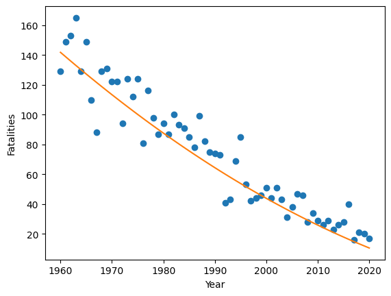

\newcommand{\ds}{\displaystyle}
\newcommand{\R}{\mathbb{R}}

## Computer Science 480 - Spring 2024

<center>
Jump to: [Syllabus](index.html), [Week 1](#week-1-notes), [Week 2](#week-2-notes), [Week 3](#week-3-notes), [Week 4](#week-4-notes), [Week 5](#week-5-notes), [Week 6](#week-6-notes), [Week 7](#week-7-notes), [Week 8](#week-8-notes), [Week 9](#week-9-notes), [Week 10](#week-10-notes), [Week 11](#week-11-notes), [Week 12](#week-12-notes), [Week 13](#week-13-notes), [Week 14](#week-14-notes)
</center>

### Week 1 Notes

Day    | Topic
:---:|:---------
Wed, Jan 17 | Vectors and matrices
Fri, Jan 19 | Markov chains

#### Wed, Jan 17

<!--
Today we introduced some simple examples of Markov chains.  We also reviewed matrix multiplication.  We also defined **probability vectors** and the **dot product** (which is also known as the **inner product**).  We talked about the geometric meaning of the dot product of two vectors. We did the following examples in class. 
-->

Today we reviewed vectors and matrices.  Recall that a **vector** is all three of the following things:

1. A list of $n$ numbers.
2. A point in $n$-dimensional space.
3. An arrow indicating a length and a direction. 

We denote the set of all real number vectors with $n$ entries by $\R^n$. Recall that the **length** of a vector (also known as the **norm**) is:
$$\|v\| = \sqrt{v_1^2 + v_2^2 + \ldots + v_n^2 }.$$

We also talked about how to multiply vectors by constants (**scalar multiplication**) and how to calculate the **dot product** (see this [Kahn academy video](https://youtu.be/WNuIhXo39_k) for example).   We stated (without proof) the fact that for any two vectors $v, w \in \R^n$, 
$$ v \cdot w = \|v\| \, \|w\| \, \cos \theta$$
where $\theta$ is the angle between the vectors $v$ and $w$.  We finished our review of vectors by saying that two vectors $v, w$ are **orthogonal** when $v \cdot w = 0$.  Then the **orthogonal complement** of a single vector $v \in \R^n$ is the set
$$v^\perp = \{w \in \R^n \, : \, v \cdot w = 0 \}.$$
If $v$ is a nonzero vector, then $v^\perp$ is an $(n-1)$-dimensional hyperspace inside of $\R^n$.  

After reviewing vectors we reviewed matrices and how to [multiply matrices](https://youtu.be/OMA2Mwo0aZg).  We did the following example in class:

1. Multiply $\begin{pmatrix} 1 & 2 & 3 \\ 1 & 0 & -1 \end{pmatrix} \begin{pmatrix} 1 & 0 \\ 1 & 0 \\ 1 & -1 \end{pmatrix}$.

We finished by talking briefly about this problem from [Introduction to Probability by Grinstead & Snell](https://math.dartmouth.edu/~prob/prob/prob.pdf):

2. The Land of Oz is blessed by many things, but not by good weather. They never have two nice days
in a row. If they have a nice day, they are just as likely to have snow as rain the
next day. If they have snow or rain, they have an even chance of having the same
the next day. If there is change from snow or rain, only half of the time is this a
change to a nice day.

<center>
</img> 
</center>

#### Fri, Jan 19

Today we looked in more detail at the Land of Oz Markov chain from last time. We started by defining the following terminology.

A **Markov chain** is a model with stages where the next state is randomly determined based only on the current state. A Markov with $n$ states can be described by a **transition matrix** $Q$ which has entries $Q_{ij}$ equal to the probability that the next state will be $j$ if the current state is $i$.  In the Land of Oz example, if the states Nice, Rain, Snow correspond to the row/column numbers 0, 1, 2, respectively, then the transition matrix is 
$$Q = \begin{pmatrix} 0 & 0.5 & 0.5 \\ 0.25 & 0.5 & 0.25 \\ 0.25 & 0.25 & 0.5 \end{pmatrix}$$


A **probability vector** is a vector with nonnegative entries that add up to 1.  You can use probability vectors to model your knowledge about the current state in a Markov chain.  For example, if it were raining today in the Land of Oz, then you could use the probability vector $v = (0, 1, 0)$ to indicated that we are 100\% sure that we are in the middle state (raining). If you multiply $vQ$, then you get the probability row vector representing the probabilities for the states the next day. Here is how to use matrices in the Python using the `numpy` library. 

```python
import numpy as np

Q = np.matrix("0 0.5 0.5; 0.25 0.5 0.25; 0.25 0.25 0.5")
v = np.matrix("0 1 0")
print(v * Q)
```

1. Suppose that today is a nice day.  What is the probability vector that describes how the weather might be the day after tomorrow? 

2. What will the weather be like after 1 week if today is nice?  What about if today is rainy or snowy?  How much difference does the weather today make after 1 week? You can answer this last problem by computing $Q^7$.  

We finished with this additional example which is [problem 5.7.12 in Introduction to Finite Mathematics](https://math.dartmouth.edu/~doyle/docs/finite/fm2/scan/5.pdf#page=64) by Kemeny, Snell, Thompson.  

3. A professor tries not to be late too often.  On days when he is late, he is 90% sure to arrive on time the next day.  When he is on time, there is a 30% chance he will be late the next day.  How often is this professor late in the long run?

<!-- To calculate repeated matrix multiplications, it helps to use the [numpy matrix power function](https://numpy.org/doc/stable/reference/generated/numpy.linalg.matrix_power.html). For example, continuing the code above, we can compute 
```python 
print(np.linalg.matrix_power(Q,7))
```
-->


- - -

### Week 2 Notes
 
Day    | Topic
:---:|:---------
Mon, Jan 22 | Examples of Markov chains
Wed, Jan 24 | Stationary distributions
Fri, Jan 26 | Random text generation

#### Mon, Jan 22

Today we did the following workshop about Markov chains. 

* Workshop: [Markov chains](Workshops/MarkovChains.pdf) 

#### Wed, Jan 24

Today we talked about some of the features we've seen in Markov chains. Recall that you can think of a Markov chain as a weighted directed graph where the total weight of all the edges leaving a vertex must add up to 1 (the weights correspond to probabilities).  

In all of the examples we've considered so far, we have looked for the final long run probabilities for the states after many transitions.  

**Definition.** A probability vector $w$ is a **stationary distribution** for a Markov chain with transition matrix $Q$ if 
$$wQ = w.$$

In all of the examples we've looked at, 
$$\lim_{k \rightarrow \infty} v Q^k$$ 
exists and is a stationary distribution for any initial probability vector $v$. But this doesn't always happen for Markov chains. 

1. Find a simple Markov chain and an initial probability vector $v$ such that $\lim_{k \rightarrow \infty} v Q^k$ does not converge.  

To better understand the long-run behavior of Markov chains, we need to review strongly connected components of a directed graph (digraph for short).  

**Definition.** A digraph is **strongly connected** if you can find a path from any start vertex $i$ to any other end vertex $j$. A **strongly connected component** of a graph is a set of vertices such that (i) you can travel from any one vertex in the set to any other, and (ii) you cannot returns to the set if you leave it. Strongly connected components are also known as **classes** and they partition the vertices of a directed graph. A class is **final** if there are no edges that leave the class. 

<center>
</img>
</center>
In the digraph above, there is one final class $\{f,g\}$ and two other non-final classes.

<div class="Theorem">
**Theorem (Perron-Frobenius).** A Markov chain always has a stationary distribution. The stationary distribution is unique if and only if the Markov chain has only one final class. 
</div>

We did not prove this theorem, but we did apply it to the following question.

2. Which of the Markov chains that we've considered (the Land of Oz, the Tardy Professor, the Gambler's Ruin problem, and the Coupon Collector's problem) has a unique stationary distribution?  For the one(s) that don't have a unique stationary distribution, describe two different stationary distributions. 

3. Does the Markov chain that doesn't converge from Q1 today have a unique stationary distribution?  How can you tell?  Can you find it? 

Another important is question is to have criteria for when $\lim_{k \rightarrow \infty} vQ^k$ converges. 

**Definition.** A Markov chain with transition matrix $Q$ is **regular** if there is a power $k$ such that $Q^k$ has all positive entries.  

<div class="Theorem">
**Theorem.** A regular Markov chain with transition matrix $Q$ always has a unique stationary distribution $w$ and for any initial probability vector $v$, 
$$\lim_{k \rightarrow \infty} v Q^k = w.$$
</div>

We finished class by talking about how the Google PageRank algorithm uses the stationary distribution of a simple regular Markov chain to rank websites.  The algorithm starts by imagining a random web surfer who clicks on links completely randomly to visit new website.  You can imagine the internet as a giant directed graph and this websurfer can be modeled with an $N$ state Markov chain where $N$ is the number of websites on the internet.  Unfortunately the $N$-by-$N$ transition matrix might not be regular, so the PageRank algorithm creates a new regular Markov chain by using the following algorithm:

* 85% of the time, the random websurfer picks a new website by randomly clicking a link. 
* 15% of the time, the random websurfer picks any one of the $N$ websites on the internet (all equally likely). 

The 85/15 percent split was chosen because the resulting regular Markov chain converges relatively quickly (it still takes days for the computation to update), but it still settles on a stationary distribution where more popular websites are visited more than less popular websites.  


#### Fri, Jan 26

Today we wrote a program to randomly generate text based on a source text using a Markov chain.  

* **Workshop**: [Random text generator](Workshops/RandomTextGenerator.pdf)

Here are some [example source texts](sourceTexts.html) you can use.  You can also search online for other good examples if you want. When you are finished, you should have a program that can generate random nonsense like this:

> In the beginning when God created the great sea monsters and every winged bird of every kind on earth that bear fruit with the seed in it." And it was good. And there was morning, the second day. And God saw that it was good. Then God said, "Let there be lights in the dome and separated the waters that were gathered together he called Night. And there was evening and there was morning, the fourth day. And God saw that the light Day, and the waters bring forth living creatures of every kind, and everything that has the breath of life, I have given you every plant yielding seed of every kind, and trees of every kind bearing fruit with the seed in it. 


- - -

### Week 3 Notes
 
Day    | Topic
:---:|:---------
Mon, Jan 29 | Least squares regression 
Wed, Jan 31 | Least squares regression - con'd
Fri, Feb 2 | Logistic regression

#### Mon, Jan 29

Today we started talking about linear regression.  We started with the simplest case where you want to predict a response variable ($y$) using a single explanatory variable ($x$).  Based on the observed $x$ and $y$ values, you want to find the best fit trend-line.  We judge how good a trend-line fits the data by calculating the sum of squared deviations between the predicted $y$-values (denoted $\hat{y}_i$) and the actual $y$-values ($y_i$) at each $x_i$.  
$$\text{Sum of squared error} = \sum_{i = 1}^n (\hat{y}_i - y_i)^2.$$
We'll see later that minimizing the sum of squared error has some nice properties.  We looked at the following example. <!--_-->  

```python
import numpy as np
import pandas as pd
import matplotlib.pyplot as plt
df = pd.read_csv("http://people.hsc.edu/faculty-staff/blins/classes/spring18/math222/data/bac.csv")
print(df)
x = np.array(df.Beers)
y = np.array(df.BAC)
plt.xlabel("Beers")
plt.ylabel("BAC")
plt.plot(x,y,"o")
```

<center>
</img>
</center>

The least squares regression line will have a formula 
$$\hat{y} = b_0 + b_1 x$$
where $b_0$ is the $y$-intercept and $b_1$ is the slope.  You can find these two numbers by using the **normal equation**

<!--
1. [Beers and BAC](http://people.hsc.edu/faculty-staff/blins/classes/spring18/math222/data/bac.csv)
2. [Marriage ages](http://people.hsc.edu/faculty-staff/blins/StatsExamples/marriageAges.xls) 
3. [Midterm exam grades](http://people.hsc.edu/faculty-staff/blins/StatsExamples/MidtermRegression.xlsx)
-->

$$X^T X \beta = X^T y$$
where $\beta = \begin{pmatrix} b_0 \\ b_1 \end{pmatrix}$ is a column vector with the intercept and slope that we want to find, $y = \begin{pmatrix} y_1 \\ y_2 \\ \vdots \\y_n\end{pmatrix}$ is the column vector with the $y$-values from the data, and 
$$X = \begin{pmatrix} 
1 & x_1 \\ 1 & x_2 \\ \vdots & \vdots \\ 1 & x_n 
\end{pmatrix}$$
is an $n$-by-2 matrix will all 1's in its first column and the $x$-values from the data in its second column. The notation $X^T$ means that **transpose** of the matrix $X$, which is the matrix you get if you switch all columns of $X$ to rows:
$$X^T = \begin{pmatrix} 
1 & 1 & \ldots & 1 \\
x_1 & x_2 & \ldots & x_n  
\end{pmatrix}.$$
One way to solve the normal equations is to multiply both sides by the inverse of the matrix $(X^T X)$:  
$$\beta = (X^T X)^{-1} X^T y.$$
The **inverse** of a matrix $M$ is denoted $M^{-1}$.  You can only find the inverse of square matrices (same number of rows & columns). Even then, not every square matrix has an inverse, but this formula almost always works for least squares regression.  I only gave a vague explanation in class of why the normal equations work.  But we did use Python to compute the normal equations for the example above: 

```python
X = np.matrix([[1.0 for i in range(len(x))],list(x)]).T
beta = (X.T*X).I*X.T * np.matrix(y).T
print(beta) # [[-0.0127006 ], [ 0.01796376]]
```

Notice that if `A` is a numpy matrix, then `A.T` is its transpose, and `A.I` is its inverse (if one exists). 
The entries of $\beta$ are the intercept followed by the slope, so the least squares regression line for predicting blood alcohol content from the number of beers someone drinks is:
$$\hat{y} = -0.01270 + 0.01796 x.$$

In addition, we can tell from the slope that each extra beer someone drinks tends to increase their BAC by 0.018 points.

#### Wed, Jan 31

Today we continued looking at least squares regression.  We covered these additional facts about the least squares regression line 
$$\hat{y} = b_0 + b_1 x$$
when there is only one explanatory variable ($x$). 

* The slope is $b_1 = R \dfrac{s_y}{s_x}$ and
* The line always passes through the point $(\bar{x}, \bar{y})$, which lets you find the $y$-intercept.

Here $\bar{x}$ and $\bar{y}$ denote the average $x$ and $y$-values respectively, $s_x$ and $s_y$ are the standard deviations of the $x$ and $y$-values, and $R$ is the correlation coefficient.  We defined these quantities using the norm (length) and dot products.

$$s_x = \frac{\|x - \bar{x}\mathbf{1} \| }{\sqrt{n-1}},  ~~~~~ s_y = \frac{ \|y - \bar{y}\mathbf{1} \| }{\sqrt{n-1}}, ~~~~~ R = \frac{x - \bar{x}\mathbf{1}}{\|x - \bar{x}\mathbf{1} \|} \cdot \frac{y - \bar{y}\mathbf{1}}{\|y - \bar{y}\mathbf{1} \|}$$

We used a spreadsheet to investigate these examples. 

1. [Marriage ages](http://people.hsc.edu/faculty-staff/blins/StatsExamples/marriageAges.xls) 
2. [Midterm exam grades](http://people.hsc.edu/faculty-staff/blins/StatsExamples/MidtermRegression.xlsx)
3. [Lightning fatalities](http://people.hsc.edu/faculty-staff/blins/statsexamples/Lightning.xlsx)

In the USA, there has been a striking decline in the number of people killed by lightning every year. The trend is strong, but it isn't really a linear trend.  So we used the normal equations to find a best fit quadratic polynomial
$$\hat{y} = b_0 + b_1 x + b_2 x^2.$$
Here is how to do this with numpy. 

```python
import numpy as np
import pandas as pd
import matplotlib.pyplot as plt

df = pd.read_excel("http://people.hsc.edu/faculty-staff/blins/StatsExamples/Lightning.xlsx")
x = np.array(df.year)
y = np.array(df.deaths)

# You can use a list comprehension to enter the matrix X.
X = np.matrix([[xi**k for k in range(3)] for xi in list(x)])
beta = (X.T*X).I*X.T * np.matrix(y).T
print(beta) # [[5.61778330e+04], [-5.42074197e+01], [ 1.30717749e-02]]

years = np.array(range(1960,2021))
plt.xlabel("Year")
plt.ylabel("Fatalities")
plt.plot(x,y,"o") + plt.plot(years,56177.8 - 54.207*years + 0.01307*years**2,linestyle="-")
```

<center>
</img>
</center>

<!--
An even better approximation might look for a power law relationship $\hat{y} = C x^\alpha$.  We'll consider that next time. 
-->

#### Fri, Feb 2

Today we did this workshop. 

* **Workshop:** [Least squares regression](Workshops/Regression.pdf)

Here is the Python code to download the two datasets:


```python
import numpy as np
import pandas as pd

df = pd.read_excel("https://people.hsc.edu/faculty-staff/blins/classes/spring23/math121/halfmarathon.xlsx")
genders = list(df.Gender)
ages = list(df.Age)
minutes = list(df.Minutes)

df2 = pd.read_excel("http://people.hsc.edu/faculty-staff/blins/StatsExamples/Lightning.xlsx")
years = np.array(df2.year)
deaths = np.array(df2.deaths)
logDeaths = np.log(deaths) # notice that functions work elementwise on np.arrays.

```


- - -

### Week 4 Notes
 
Day    | Topic
:---:|:---------
Mon, Feb 5 | Linear classifiers
Wed, Feb 7 | Loss functions & gradient descent
Fri, Feb 9 | Logistic regression

#### Mon, Feb 5

Last time we saw came up with a model to predict a runner's race time based on their age and gender.  Our model had the form
$$\hat{y} = b_0 + b_1 x_1 + b_2 x_2$$
where $\hat{y}$ is the predicted race time in minutes, $x_1$ is the runner's age, and $x_2$ is an indicator variable which is 0 for men and 1 for women.  An **indicator variable** is a numerical variable that is 1 if a Boolean condition is true and 0 otherwise.  We can re-write our model using a dot product as:
$$\hat{y} = [b_0, b_1, b_2] \cdot [1, x_1, x_2].$$ <!-- The weight vector was [84.24795527  0.97029783 21.00086375] -->
In this formula, the vector $[b_0, b_1, b_2]$ is called the **weight vector** and $[1, x_1, x_2]$ is called the **feature vector**. Each runner has a different feature vector, but you use the same weight vector for every runner to make a prediction about their race time.   

If we use age and race time to predict gender using least squares, then we get this formula:
$$\text{predicted gender} = 0.0694 - 0.0112 \, \text{age} + 0.00705 \, \text{race_time}.$$
We could use the number $\tfrac{1}{2}$ as a dividing line to separate runners who we would predict are female vs. runners we would predict are male.  This is a simple example of a linear classifier.  A **linear classifier** is a rule that uses a weight vector $w$ and a feature vector $x$ and a threshold $\theta$ to decide how to classify data.  You make a prediction based on whether the dot product $w \cdot x$ is greater than or less than the decision threshold $\theta$.  If we treated men as $-1$ instead of $0$, then we could use the threshold $\theta = 0$, which is a more common choice for linear classification. 

<center>
</img>
</center>

We were able to draw a picture of the line the separates individuals we would predict are women from individuals we would predict are men in the scatter plot for runners.  If we had more than two variables, then we wouldn't be able to draw a picture. And instead of a dividing line, we would get a dividing hyperplane to separate our predictions. But we could still use the same idea. 

- - -

### Week 5 Notes
 
Day    | Topic
:---:|:---------
Mon, Feb 12 |
Wed, Feb 14 |
Fri, Feb 16 |

- - -

### Week 6 Notes
 
Day    | Topic
:---:|:---------
Mon, Feb 19 | Review
Wed, Feb 21 | **Midterm 1**
Fri, Feb 23 | 

- - -

### Week 7 Notes
 
Day    | Topic
:---:|:---------
Mon, Feb 26 |
Wed, Feb 28 |
Fri, Mar 1 | 

- - -

### Week 8 Notes
 
Day    | Topic
:---:|:---------
Mon, Mar 4 |
Wed, Mar 6 |
Fri, Mar 8 |

- - -

### Week 9 Notes
 
Day    | Topic
:---:|:---------
Mon, Mar 18 |
Wed, Mar 20 |
Fri, Mar 22 |

- - -

### Week 10 Notes
 
Day    | Topic
:---:|:---------
Mon, Mar 25 |
Wed, Mar 27 |
Fri, Mar 29 |

- - -

### Week 11 Notes
 
Day    | Topic
:---:|:---------
Mon, Apr 1 |
Wed, Apr 3 |
Fri, Apr 5 |

- - -

### Week 12 Notes
 
Day    | Topic
:---:|:--------------
Mon, Apr 8 | 
Wed, Apr 10 |
Fri, Apr 12 |

- - -

### Week 13 Notes
 
Day    | Topic
:---:|:---------
Mon, Apr 15 |
Wed, Apr 17 |
Fri, Apr 19 |

- - -

### Week 14 Notes
 
Day    | Topic
:---:|:---------
Mon, Apr 22 | 
Wed, Apr 24 | 
Fri, Apr 26 | 
Mon, Apr 29 | 


- - - 

[1.2]: <https://www.brianheinold.net/numerical/numerical_book.html#section:introductory_material:floatingpoint_arithmetic>
[2.1]: <https://www.brianheinold.net/numerical/numerical_book.html#section:solving_equations_numerically:the_bisection_method>
[2.2]: <https://www.brianheinold.net/numerical/numerical_book.html#section:solving_equations_numerically:fixed_point_iteration>
[2.3]: <https://www.brianheinold.net/numerical/numerical_book.html#section:solving_equations_numerically:newtons_method>
[2.4]: <https://www.brianheinold.net/numerical/numerical_book.html#section:solving_equations_numerically:rates_of_convergence>
[2.5]: <https://www.brianheinold.net/numerical/numerical_book.html#section:solving_equations_numerically:the_secant_method>
[3.1]: <https://www.brianheinold.net/numerical/numerical_book.html#section:interpolation:the_lagrange_form> 
[3.2]: <https://www.brianheinold.net/numerical/numerical_book.html#section:interpolation:newtons_divided_differences>
[3.3]: <https://www.brianheinold.net/numerical/numerical_book.html#section:interpolation:problems_with_interpolation>
[3.4]: <https://www.brianheinold.net/numerical/numerical_book.html#section:interpolation:chebyshev_polynomials>
[4.1]: <https://www.brianheinold.net/numerical/numerical_book.html#section:numerical_differentiation:basics_of_numerical_differentiation>
[5.1]: <https://www.brianheinold.net/numerical/numerical_book.html#section:numerical_integration:newtoncotes_formulas>
[5.2]: <https://www.brianheinold.net/numerical/numerical_book.html#section:numerical_integration:the_iterative_trapezoid_rule>
[5.4]: <https://www.brianheinold.net/numerical/numerical_book.html#section:numerical_integration:gaussian_quadrature>
[5.6]: <https://www.brianheinold.net/numerical/numerical_book.html#section:numerical_integration:improper_and_multidimensional_integrals>
[6.1]: <https://www.brianheinold.net/numerical/numerical_book.html#section:numerical_methods_for_differential_equations:eulers_method>
[6.4]: <https://www.brianheinold.net/numerical/numerical_book.html#section:numerical_methods_for_differential_equations:rungekutta_methods>
[6.5]: <https://www.brianheinold.net/numerical/numerical_book.html#section:numerical_methods_for_differential_equations:systems_of_odes>


<br>
<br>
<br>
<br>
<br>
<br>
<br>
<br>
