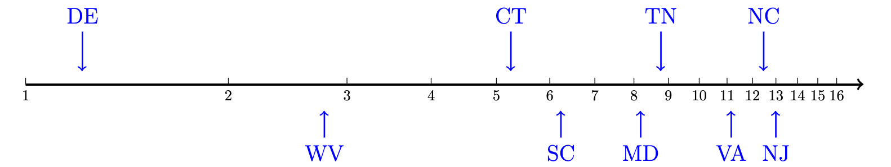

\newcommand{\ds}{\displaystyle}
\newcommand{\on}{\operatorname}

<!--
NOTE: USE THE FOLLOWING COMMAND TO COMPILE THESE SLIDES:
pandoc -s -t slidy day1slides.md -o day1slides.html
-->

# From Last Time

We introduced the apportionment problem, which is about how to give states representatives in Congress proportion to their populations. 

* **Hamilton's Method** give every state their standard quota, rounded down.  Then give out extra seats to the states with the highest decimal part until all seats are apportioned.  

### Pros

* No state ever gets more than its standard quota rounded up. 
* No state ever gets less than its standard quota rounded down. (No **quota violations**)

### Cons

* Paradoxes! (Alabama, New States, & Population Paradoxes)
 
# Divisor Method

The main alternative to Hamilton's method are **divisor methods** where you adjust the divisor used to calculate the quotas until they assign the right number of seats. 

* **Jefferson's method** round all quotas down.
* **Adam's method** round all quotas down.
* **Webster's method** round all quotas to nearest whole number.

# Quota Violations

Divisor methods have different problems than Hamilton's method.  

* The **upper quota** is the standard quota rounded up.
* The **lower quota** is the standard quota rounded down.

A **quota violation** is when a state gets more than their upper quota or less than their lower quota.  

# Jefferson's Method  

With Jefferson's method, states will always get at least their lower quota, but upper quota violations are possible, especially for big states.  That's because changing the divisor always affects big states more. 

Jefferson's method is **biased in favor of big states**.

# Adam's Method 

In Adam's method, states will never get more than their upper quota, but lower quota violations are possible.  

Adam's method is **biased in favor of small states**.

# Webster's Method

Webster's method is not biased in favor of big or small states, but it can have quota violations in both directions!  

# An Impossibility Theorem

In 1983, two mathematicians, Michel Balinski and Peyton Young, proved that every apportionment method will either have paradoxes (like Hamilton's method), or will have quota violations (like Adam's/Jefferson's/Webster's methods). 

# What Method Do We Use Now?

Ever since 1941 the United States has used the **Huntington-Hill Method** to apportion the seats in the House of Representatives. Joseph Hill was a statistician who worked for the US Census Bureau. In 1911 he argued that the best method would minimize the relative errors in the seats awards relative to each states' standard quota. 

Hill's idea is to initially apportion the seats of Congress using any method, but then check to see how close each state is to its ideal apportionment by calculating the ratio 
$$\frac{\text{Seats Received}}{\text{Seats Deserved}} = \frac{R_i}{Q_i}$$
where $R_i$ is the number of seats each state receives in the initial apportionment and $Q_i$ is the standard quota for each state.  If you can switch seats from state $i$ to state $j$ and in doing so, decrease 
$$\left| \log \left(\frac{R_i}{Q_i}\right)\right| + \left| \log \left(\frac{R_j}{Q_j}\right)\right|,$$
then you should do so.  

# Huntington-Hill Method

Edward Vermilye Huntington was a statistician who worked at Harvard.  He improved on Hill's idea and simplified the implementation of the method. 

He observed that Hill's approach is a divisor method, but with a different way to round numbers.  If a quota is between two consecutive integers $n$ and $n+1$, then you round up if the quota is bigger than the geometric mean $\sqrt{n(n+1)}$, otherwise you round down.   

Because the geometric mean is exactly half-way between two numbers on a log-scale, you can think of Huntington-Hill as the method that rounds to the nearest whole number on a log-scale.  

</img>

# United States Department of Commerce v. Montana

After the 1990 census, Montana dropped from 2 to 1 Congressional district.  They sued the Federal Government saying this was unconstitutional, since at that time the 1 district would be the largest Congressional district representing 804,000 people even though the standard divisor (ideal district size) was only 572,000.

Montana argued that what matters is the absolute difference between the district size and the ideal size:

$$\text{Absolute Difference} = 804{,}000 - 572{,}000 = 232{,}000$$

Huntington-Hill method tries to minimize relative differences which is what you get when you divide. 

$$\text{Relative Difference} = \frac{804{,}000}{572{,}000} = 1.406$$

which is 40.6\% larger than it should be. The Supreme Court ruled unanimously against Montana, saying that there was nothing in the Constitution that prevents apportionment using the Huntington-Hill method.  

# What if Montana Got its Way? 

If Montana's suit had been successful, then Washington state would have lost one of its 9 seats in the House of Representatives.  That would have caused Washington's state to be further away from having the right number of seats, and Montana would also still be far away from having the right number of seats, because its two districts would both be small than the standard divisor by a factor of:

$$\frac{572{,}000}{402{,}000} = 1.423$$ 

which is even farther away (as a relative difference) than the actual result. 

 
 
 
 
 
 
 
 
