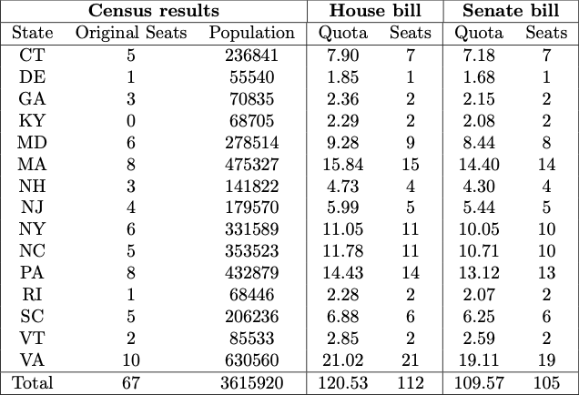
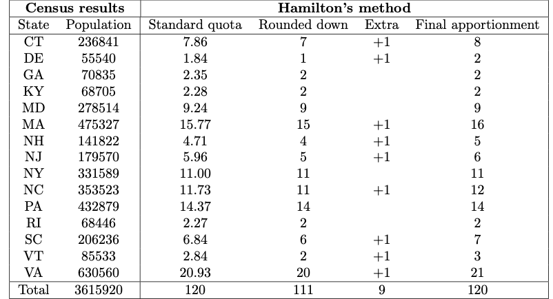

\newcommand{\ds}{\displaystyle}
\newcommand{\on}{\operatorname}

<!--
NOTE: USE THE FOLLOWING COMMAND TO COMPILE THESE SLIDES:
pandoc -s -t slidy day1slides.md -o day1slides.html
-->

# From Last Time

We introduced the apportionment problem, which is about how to give states representatives in Congress proportion to their populations. 

* **Hamilton's Method** give every state their standard quota, rounded down.  Then give out extra seats to the states with the highest decimal part until all seats are apportioned.  

### Pros

* No state ever gets more than its standard quota rounded up. 
* No state ever gets less than its standard quota rounded down. (No **quota violations**)

### Cons

* Alabama Paradox 
* New States Paradox 
* Population Paradox
 
# Divisor Method

The main alternative to Hamilton's method are the divisor method where you adjust the divisor used to calculate the quotas until they assign the right number of seats. 

* **Jefferson's method** round all quotas down.
* **Adam's method** round all quotas down.
* **Webster's method** round all quotas to nearest whole number.

# Implementing Divisor Methods

The easiest way to implement divisor methods is to use a spreadsheet.  

# Proportional Representation is Tricky

The problem is, there are only 435 seats in the House of Representatives.  Those cannot be divided perfectly proportional to the populations of every state.  

# The First Apportionment 

The 1st Census of the United States took place in 1790.  The results were as follows:

</img>

The House was aiming for 30,000 people per representative with 112 total representatives.  The Senate was aiming for 33,000 people per representative with only 105 total representatives.  

# The Math 

* The number of seats a state should get in the House of Representatives is called its **quota**.  

* The (ideal) number of people in each congressional district is called the **divisor**.  

The formula to calculate the quota for each state is very simple.  

$$\text{Quota} = \text{Population}/\text{Divisor}$$

# Jefferson's Method

The method advocated by Thomas Jefferson involved these steps:

1. Calculate the quotas for each state. 

2. Round all the quotas down. If that is the right total number of seats, you are done, otherwise do step 3.

3. Adjust the divisor and repeat steps 1 & 2 until you get the right total number of seats in the House of Representatives.

# The Debate 

There was a lot of debate about whether the House or Senate apportionment bill was better.  

Several states argued that in the House bill, Virginia got too many seats.  Here's why. In the House bill, there were supposed to be 112 seats in Congress.  Since the population of the US was 3,615,920, the size of a congressional district should be 

$$d = 3{,}615{,}920 \text{ people} / 112 \text{ representatives} = 32{,}285 \text{ people per representative}.$$

This is called the **standard divisor** which you always get by dividing the who population by the number of seats.  

# Virginia's Quota Violation

Using the standard divisor, Virginia has a **standard quota** of 
$$\text{Quota} = \text{Population} / \text{Divisor} = 630{,}560 / 32{,}285 = 19.531.$$

But since the method used to calculate the quota did not use the standard quota, Virginia ended up with 21 seats.   

Virginia would get more seats than its standard quota rounded up.  When a state gets more seats than its standard quota rounded up or less than its standard quota rounded down, that is called a **quota violation**.  

# Hamilton's Method

Alexander Hamilton thought it was unfair for Virginia to get more seats than it deserved.  He persuaded Congress to pass a bill using a different method which is now called **Hamilton's method**.  

1. Calculate the standard quotas using the standard divisor.  

2. Every state gets at least their standard quota rounded down.  

3. If there are seats left over, give one to each of the states with the highest decimal part in their quotas until they are used up.

# The Apportionment Act of 1792

Using Hamilton's method, Congress agreed on 120 representatives so the standard divisor would be
$$3{,}615{,}920 / 120 = 30{,}132.67 \text{ people per representative}.$$

</img>

# The First Veto

Thomas Jefferson argued that it would be more fair to adjust the divisor (typically by making it a little smaller) so that the quotas can all be rounded down. He was worried that states would argue about who would get the extra seats. George Washington agreed with Thomas Jefferson and so he vetoed the Apportionment Act. 

Instead, the original Senate bill for a House of Representatives with 105 seats apportioned using Jefferson's method was settled on.  

Jefferson's method was used from 1790 through 1832. 

# Washington's Explanation 

> Gentlemen of the House of Representatives:

> I have maturely considered the act passed by the two Houses entitled "An act for an apportionment of Representatives among the several States according to the first enumeration, " and I return it to your House, wherein it originated, with the following objections:

> First. The Constitution has prescribed that Representatives shall be apportioned among the several States according to their respective numbers, and there is no one proportion or divisor which, applied to the respective numbers of the States, will yield the number and allotment of Representatives proposed by the bill.

> Second. The Constitution has also provided that the number of Representatives shall not exceed I for every 30,000, which restriction is by the context and by fair and obvious construction to be applied to the separate and respective numbers of the States; and the bill has allotted to eight of the States more than I for every 30,000.

> GO WASHINGTON. 

# Webster's Method

In 1842, Congress used **Webster's method** to apportion the seats of Congress.  Webster's method and a competing method proposed by John Quincy Adams (called **Adam's Method**) are very similar to Jefferson's method.  The only difference is in how you round the quotas:

* In Jefferson's method, you always round quotas down (but never less than one).  

* In Adam's method, you always round quotas up. 

* In Webster's method, you round the normal way. 

# Hamilton's Method Returns

In 1852 Congress passed a law making Hamilton's method the "Official" method for apportionment.  But weird things can happen with Hamilton's method.  This was first discovered in 1882.  

Congress was trying to pick how big the House of Representative should be.  

* With 299 seats, Alabama got 8 seats. 

* With 300 seats, Alabama only got 7 seats.  

Adding a seat would cause Alabama to lose a seat.  

Congress decided to avoid the issue in 1882 by choosing 325 seats (where both Hamilton's method and Webster's methods gave the same apportionments).  

# Alabama Paradox 

It is really weird that adding more seats to Congress can cause a state to lose a seat! This is called the **Alabama paradox.**

The same paradox happened again in 1901. That year the Census Bureau presented Congress with tables showing what the apportionment would be if the size of the House of Representatives was any number between 350 and 400.  For most options Maine got 4 seats, but if the House had 357, 382, 386, or 389 seats, then Maine would only get 3 seats.  Something similar happened where Colorado would get either 3 seats or 2 depending on the size of Congress.  Coincidentally, the proposed size of the House of Representatives was going to be 357 which would have negatively affected both Maine and Colorado.  

After a huge debate, Congress chose to use Webster's method.    

<!--
# The Fourteenth Amendment

After the civil war, the Fourteenth Amendment got rid of the three fifths compromise.  Then here is what it said about apportionment:

> 14th Amendment, Section 2. Representatives shall be apportioned among the several States according to their respective numbers, counting the whole number of persons in each State, excluding Indians not taxed. But when the right to vote at any election for the choice of electors for President and Vice President of the United States, Representatives in Congress, the Executive and Judicial officers of a State, or the members of the Legislature thereof, is denied to any of the male inhabitants of such State, being twenty-one years of age, and citizens of the United States, or in any way abridged, except for participation in rebellion, or other crime, the basis of representation therein shall be reduced in the proportion which the number of such male citizens shall bear to the whole number of male citizens twenty-one years of age in such State. 
-->

# Other Paradoxes 

There are other weird things that can happen with Hamilton's method.  

* **Population Paradox.** If the populations of the states change, then a state that grows might lose a seat to a state that doesn't grow (or even shrinks)!  

* **New States Paradox.** When new states get added to the country, even if you increase the number of representatives by enough to cover the new states, the apportionment of representatives to the old states might change.  

 
 
 
 
 
 
 
 
