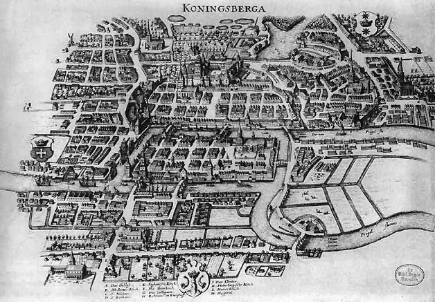

\newcommand{\ds}{\displaystyle}
\newcommand{\on}{\operatorname}

## Math 111 - Summer 2024

Quick Links: [Syllabus](index.html)

<table class='bordered'>
<thead> 
<tr><th>Week</th><th>Mon</th><th>Tue</th><th>Wed</th><th>Thu</th><th>Fri</th></tr>
</thead>
<tbody>
<tr><td>1</td><td></td><td> [Day 1](#day-1-notes) </td><td> [Day 2](#day-2-notes) </td><td> [Day 3](#day-3-notes) </td><td> [Day 4](#day-4-notes) </td></tr> 
<tr><td>2</td><td></td><td>[Day 5](#day-5-notes)</td><td> [Day 6](#day-6-notes) </td><td>[Day 7](#day-7-notes)</td><td> [Day 8](#day-8-notes)</td></tr>
<tr><td>3</td><td>[Day 9](#day-9-notes)<td>[Day 10](#day-10-notes)</td><td> [Day 11](#day-11-notes) </td><td>[Day 12](#day-12-notes)</td><td> [Day 13](#day-13-notes)</td></tr>
<tr><td>4</td><td>[Day 14](#day-14-notes)<td>[Day 15](#day-15-notes)</td><td> [Day 16](#day-16-notes) </td><td>[Day 17](#day-17-notes)</td><td> [Day 18](#day-18-notes)</td></tr>
<tr><td>2</td><td>[Day 19](#day-19-notes)</td><td> [Day 20](#day-20-notes) </td><td></td><td></td><td></td></tr>
</tbody>
</table>

### Day 1 Notes

#### Tue, May 21

Today we introduced voting methods.  See these slides for details. 

* **Slides:** [Introduction to Voting Theory](day1slides.html)

We also did these two workshops in class. 

* **Workshop:** [Plurality & Instant Run-Off Voting](Workshops/InstantRunoff.pdf)

* **Workshop:** [Borda Count](Workshops/BordaCount.pdf)

### Day 2 Notes

Today we talked about fairness criteria that voting methods should have.  

* **Slides:** [Fairness Criteria](day2slides.html)

We also did this workshop in class.

* **Workshop:** [Fairness Criteria](Workshops/FairnessCriteria.pdf)

In addition to the slides & workshop, we also talked about (and proved) the [Median Voter Theorem](https://en.wikipedia.org/wiki/Median_voter_theorem).  We finished by talking about recent advocacy to promote ranked choice voting (another name for IRV) and STAR voting (which will not be on the test).  

* **Video:** [STAR Voting](https://youtu.be/3-mOeUXAkV0)

It is something to pay attention to in the future, because there will always be a push for better voting methods than plurality voting.  

### Day 3 Notes

Today we talked about **weighted voting systems**.  We did this workshop:

* **Workshop:** [Banzhaf power](Workshops/BanzhafPower.pdf)

Before the workshop, we started with this example. Suppose a school is run by a committee with the principal who has 3 votes, the vice principal who has 2 votes, and three teachers who each have 1 votes.  A motion requires 5 votes to pass.  

We can use the shorthand notation [5: 3, 2, 1, 1, 1] to represent this weighted voting system.  The first number is the vote **threshold** needed to pass a motion, and the other numbers are the **weights** which are the number of votes controlled by each voter.  Often the voters in a weighted voting system are called **players**.  

A **winning coalition** is a subset of the players who have enough votes to pass a motion.  A player is **critical** in a winning coalition if the coalition would not have enough votes without that player. 

1. List the winning coalitions in the weighted voting system above.  

2. Circle the critical players in each winning coalition.

The **Banzhaf power index** is a way to measure how much power each player in a weighted voting system has.  

#### Banzhaf Power Index 

To find the Banzhaf power for each player,

1. List the winning coalitions and circle the critical players in each coalition.
2. The power for each player is the fraction:
$$\frac{\text{Number of times the player is circled}}{\text{Total number of circles}}.$$

3. Calculate the Banzhaf power indices for the principal, vice principal, and each teacher in the example above. 

[John Banzhaf]() was a lawyer in the 1960s who discovered the power index when he was investigating a case involving Nassua County, NY.  The districts in Nassau county had a weighted voting system where the weights were:

* Hempstead 1 had 9 votes
* Hempstead 2 had 9 votes
* North Hempstead had 7 votes
* Oyster Bay had 3 votes
* Glen Cove had 1 vote
* Long Beach had 1 vote

To reach the threshold of 16 votes to pass a motion, it required at least two of the bigger districts.  But it never mattered what the three smaller districts did.  So the three smaller districts had no power in the elections.  

A player with no power is called a **dummy**.  A player with enough power to pass a motion all by themselves is called a **dictator**.  Sometimes a player can block any motion by themselves.  Then we say they have **veto power.**

4. Can you come up with a weighted voting system $[t : p_1, p_2, p_3, p_4]$ where all four players have veto power?

Banzhaf power can illustrate some surprising things about weighted voting systems.  For example, the weights might be very different from the real amount of power each player has.

5. Suppose a country has a parliament with 200 seats.  The seats are divided between three parties that always vote together as blocs.  The red party has 99 seats, the blue party has 98 seats, and the green party has 3 seats.  Surprisingly when you calculate the Banzhaf power, the green party has the same amount of power as the red and blue parties even though it has much fewer seats. 

Sometimes you can calculate the Banzhaf power indices without having any numbers for the weights and threshold.  We did the following example. 

6. At one college, promotion decisions are made by a committee of four faculty and the dean.  The four faculty each vote, and if there is a tie, then the dean is the tie breaker.  Calculate the Banzhaf power for each faculty member and for the dean.  

If you want to play with more weighted voting examples, Professor Koether made a [Banzhaf power calculator](https://people.hsc.edu/faculty-staff/robbk/Math111/Power/) which you can try.   

### Day 4 Notes

Today we talked about **the spherical Earth theory**.  Actually, we talked about solving **proportion equations**, but most of the examples we did were related to the fact that the Earth is a sphere.  We also talked about the evidence the ancient Greeks used to deduce that the Earth is a sphere.

* **Workshop:** [Eratosthenes measures the Earth](Workshops/EratosthenesEarth.pdf)

After that, we talked about using the same ideas to find Latitude & Longitude.

* **Slides:** [Longitude presentation](https://people.hsc.edu/faculty-staff/blins/classes/fall10/math111/LongitudePresentation.pdf)

We finished by talking about a useful technique to solve word problems involving unit conversions called **factor-label method**, also known as **dimensional analysis**. Here is a [video explaining the technique](https://youtu.be/d_WfCwJW0Og) (I didn't make the video, but it is a pretty good explanation.

We did this example in class:

1. The international space station ISS orbits the Earth every 90 minutes.  The orbit of the space station is 250 miles above the Earth's surface.  How fast does the ISS move in miles per hour?  

Then we finished with this workshop:

* **Workshops:** [Factors & Units](Workshops/FactorsUnits.pdf)

### Day 5 Notes

Today we talked about orders of magnitude. For any number, its **order of magnitude** is the exponent of the nearest power of 10.  For example, 783 is closest to 1,000 which is $10^3$, so the order of magnitude of 783 is 3.  We also briefly reviewed **scientific notation** and the **metric system**.  We did this workshop.

* **Workshop:** [Orders of Magnitude](Workshops/OrdersOfMagnitude.pdf)

After that, we talked about **logarithmic scales** which are number lines where the numbers are spaced so that each step represents multiplication/division instead of addition/subtraction.  We did this workshop

* **Workshop:** [Logarithmic Scales](Workshops/LogScale.pdf)

We also looked at examples where log-scales are used to present data. Sometimes these examples can be misleading. But sometimes a log-scale is the best way to represent the data. 

* **Example:** 

</img>

 

* **Example:** 

</img>

Using log-scales to present data has advantages:

1. It spreads out small numbers so you can see them.

2. It lets you use one graph to represent numbers that are spread over many orders of magnitude.  

The disadvantages are:

1. It bunches up the big numbers, so it can make big differences seem small.

2. They are more confusing because not everyone is familiar with log-scales.  

### Day 6 Notes

We started by talking briefly about how the halfway point between two numbers on a logarithmic scale is not what you would expect.  For example, the halfway point between 1 and 100 is 10, not 50.  On a logarithmic scale, the halfway point between any two numbers $x$ and $y$ is the **geometric mean** which is:
$$\sqrt{xy}.$$  
The regular average where you add two numbers and then divide by 2 is called the **arithmetic mean**.  

1. Find the geometric mean of 3 and 12.  Compare it with the arithmetic mean.  Which is bigger?

**Fact.** The arithmetic mean of two different positive numbers is always bigger than the geometric mean. 

After we talked about arithmetic & geometric means, we introduced growth factors.  When any quantity increases (or decreases), the **growth factor** is defined to be
$$\text{Growth factor} = \frac{\text{ new amount }}{\text{ old amount }}.$$

2. Find the growth factor for the US population which increased from 282 million in 2000 to 330 million in 2020.

Growth factors will be smaller than one if the quantity is decreasing.

3. In the aughts (2000-2009) there were 3962 murders in Virginia.  In the teens (2010-2019) there were 3859 murders.  Find the growth factor.  

When we work with growth factors that are close to one, we usually talk about percent change. 
$$\text{Growth factor} = 100\% + \text{Percent Change}.$$

4. Find the percent change for the last two growth factors.  

Percent changes are confusing because you can't add and subtract percent changes.   But you can multiply growth factors.   

5. Suppose the population of a town grows by 10% one year, 20% the next year, and 30% the third year.  How much has the population grown?  

We did these two workshops.

* **Workshop:** [Relative growth](Workshops/RelativeGrowth.pdf)

After the break we talked about arithmetic and geometric sequences.  An **arithmetic sequence** is a list of numbers that change by adding or subtracting a constant step size. A **geometric sequence** is a list of numbers that change by multiplying or dividing a constant factor, called the **common ratio**.  **Linear growth (or decrease)** is when an arithmetic sequence is growing (or decreasing).  **Exponential growth (or decay)** is when a geometric sequence is growing or decreasing.  

* **Workshop:** [Exponential growth](Workshops/ExponentialGrowth.pdf)

We finished by watching this video about exponential growth and the rule of 70.

* **Video:** [The Most IMPORTANT Video You'll Ever See](https://youtu.be/F-QA2rkpBSY)

### Day 7 Notes

We started with a workshop.

* **Workshop:** [Compound interest](Workshops/CompoundInterest.pdf)

Then we talked about **logarithms**.  We talked about how (base-10) logarithms are pretty much the same thing as orders of magnitude.  They tell you the exact location of a number on a logarithmic scale where each order of magnitude is one step.  

Logarithms were discovered/invented by John Napier in the early 1600's to help make arithmetic easier. Here is some of the history. 

* 1614 John Napier published the book *A Description of the Wonderful Rule of Logarithms*.  

* 1617 Henry Briggs published the first base-10 logarithm tables.  

* 1624 Edmund Wingate published *The Use of Rules of Proportion*.  A **rule of proportion** is a wooden ruler with numbers marked on a logarithmic scale.  Wingate got the idea from Edmund Gunter and these rulers were sometimes called [Gunter sticks](https://www.nzeldes.com/HOC/images/Gunter02.jpg).

* Early 1630's William Oughtred put two wooden rules of proportion together the make the first [slide rule](https://www.npr.org/sections/ed/2014/10/22/356937347/the-slide-rule-a-computing-device-that-put-a-man-on-the-moon).

The reason that logarithms caught on so quickly is that they really did make people's lives a lot easier.  

1. Suppose you had to calculate the area of a circle using the formula $\pi r^2$.  If you measure the radius to be 12.3 centimeters, then you would have to calculate
$$(3.14)(12.3)(12.3)$$
That's pretty hard without a calculator.  With a table of logarithms, you can look up the logarithms of each number and then add them together which is much easier! 

### Day 9 Notes

Today we talked about the **apportionment problem**. 

* **Slides:** [The Apportionment Problem](day9slides.html)

We also did this workshop

* **Workshop:** [Hamilton's method](Workshops/Hamilton.pdf)

We also did an example where a Mom has 50 pieces of candy to give out to her 5 kids based on the number of minutes they spent doing chores.  

<table class="bordered">
<tr><td>Alvin</td><td>Betty</td><td>Calvin</td><td>Daisy</td><td>Edwin</td><td>Total</td></tr>
<tr><td>150</td><td>78</td><td>173</td><td>204</td><td>295</td><td>900</td></tr>
</table>

1. What is the standard divisor? What are its units?

2. What is the standard quota for each kid?

3. What is the apportionment using Hamilton's method. 

We finished by using a spreadsheet to find the apportionment of candy above using Jefferson's method. We also used Jefferson's method to find the final apportionment of Congress after George Washington vetoed the Apportionment Act of 1792.   

### Day 10 Notes

Today we talked about advantages and disadvantages of the various apportionment methods.  We also introduce the **Huntington-Hill Method** which is the one that the United States has used since 1941.  

* **Slides:** [The Apportionment Problem 2](day10slides.html)

We did two workshops, the first involved using spreadsheets to implement divisor methods. You need to download the data file to do problem 2. 

* **Workshop:** [Jefferson & Adams Methods](Workshops/JeffersonAdams.pdf)
* **Data:** [2020census.xlsx](2020census.xlsx)

The other was a quick example of using a logarithmic scale to implement the Huntington-Hill method. 

* **Workshop:** [Divisor Methods & Logarithmic Scales](Workshops/HuntingtonHill.pdf)

### Day 11 Notes

Today we introduced **graph theory**.  We started by verifying **Euler's formula** which says that any graph on a piece of paper with $V$ vertices, $E$ edges, and $F$ faces or regions (including the one exterior face which is not enclosed by edges), the following formula is *always* true:
$$ V + F - E = 2.$$

A **graph** is a set of points called **vertices** and a set of lines connecting two vertices called **edges** (the edges don't have to be straight).  A graph that you can draw on a piece of paper so that no edges cross (except at vertices) is called a **planar graph**.  

According to legend, the subject of graph theory was discovered/invented in 1735 when Leonhard Euler heard about the Seven Bridges of Königsberg puzzle.  At the time, Königsberg was a city in Prussia with seven bridges.  The puzzle asks whether it is possible to walk around the city crossing every bridge exactly once.  Assume that you can only cross the river by walking across on of the bridges.

</img>

Euler solved the problem by abstracting away the irrelevant details and focusing on the underlying graph structure. A graph has an **Euler path** if there is a path that starts and ends at different vertices and crossed every edge exactly once. A graph has an **Euler circuit** if there is a path that starts and ends in the same place and crosses every edge exactly once. 

</img>

Euler figured out that the only thing that matters (as long as the graph is connected) is the degrees of the vertices in the graph.  The **degree** of a vertex is the number of edges that touch it. 

**Theorem.** A connected graph has an Euler path if and only if it has exactly two vertices with an odd degree.  A connected graph has an Euler circuit if and only if all of the degrees are even.

We didn't prove this theorem, but we did give an intuitive explanation for why it is true.  Cole also had an interesting idea that maybe you have to have an even number of edges to have an Euler path, but we ended up finding some counter examples for that conjecture.  

We also proved this handy theorem:

**The Handshake Theorem.** In any graph, the sum of the degrees of all the vertices is twice the number of edges.

Then we did this workshop. 

* **Workshop:** [Euler paths](Workshops/EulerPaths.pdf)

We also talked about Fluery's algorithm, which is a way to find an Euler path (or circuit) in a graph.  

**Fluery's algorithm.** For a graph that has an Euler circuit (or path):

1. Pick a start vertex (must have odd degree if you are looking for a path).

2. Move along the graph from vertex to vertex, removing the edges you cross as you go.  When you have a choice, never pick an edge that would make it impossible to reach some un-visited edges.  

3. Continue until you are done.

It is not obvious, but this algorithm always works as long as a graph is connected and has only even degree vertices (or just two odd degree vertices). 

### Day 12 Notes

Today we talked about trees.  A **tree** is a graph that is connected and has no cycles. A **path** is a sequence of adjacent edges with no repeats. A **cycle** is a path of length more than 1 that never repeats an edges and starts and ends at the same vertex.  We proved these theorems about trees, the most important of which is this first one (which includes several of the other theorems). 

**Tree Classification Theorem.** For connected graphs, the following properties are equivalent. If a connected graph has one of these properties, then it has all of them.

1. The graph is a tree. 
2. For any two points, there is only one (simple) path connecting them.  
3. $V = E+1$.

 

The first part of the proof is to show that properties 1 and 2 are equivalent. We called this Tree Theorem 1. Here is why it is true. If there were two paths, then eventually they would split and then rejoin.  The edges between where the paths split and rejoin would form a cycle, which is impossible.  Conversely if there were a cycle, then there would be more than one path connecting any two vertices in the cycle (one going clockwise, the other counterclockwise). 

To prove that property 3 is equivalent to the other two properties in the Tree Classification Theorem takes a little more work.  We needed some helper theorems.  The first theorem is about **leaves** which are vertices with degree one in a tree. 

 
**Theorem.** Every tree with more than 1 vertex must have some leaves.  

To prove this theorem, start from any vertex and make a path.  Keep extending the path as long as you can, until you can't go any farther.  There are only two reasons you can't go farther. Either you are at a dead end (which means you have found a degree one vertex), or you have already visited all the edges that touch the current vertex.  But then the path has hit the vertex at least twice, and contains a cycle, which is impossible in a tree.  

**Theorem.** For any tree, the number of vertices $V$ is always one more than the number of edges $E$.  In other words, 
$$V = E + 1.$$

The key to proving this theorem is to use a technique called **pruning**.  Since every tree must have some leaves (i.e., degree 1 vertices), you can remove a degree 1 vertex and the edge that touches it from the tree.  After you do this, you will still have no cycles, and your graph will still be connected because any other two vertices will have a path connecting them.  Therefore the pruned graph is still a tree, and so it still has more leaves you can prune.  Each time you prune a vertex, you reduce the number of edges and vertices both by one, until you get down to a single vertex and no edges.  At each step $V-E$ is the same, and at the end, $V-E= 1$, so $V-E = 1$ in the original tree. 

The last helper theorem we needed was about spanning trees.  A **spanning tree** is a subgraph of a graph that is a tree and includes all of the vertices and some of the edges from the original graph.  

**Theorem.** Every connected graph has a spanning tree. 

This is true because if you start with a connected graph that has one or more cycles and remove one of the edges from a cycle, the new graph you get is still connected.  So you can repeat the process until there are no more cycles left.  When you are done, you have a connected subgraph with no cycles, i.e., a spanning tree. 

With this last result, we were able to prove the final part of the Tree Classification Theorem: If a connected graph has exactly $V = E+1$ vertices, then it must be a tree.  This is because a connected graph must have a spanning tree.  The spanning tree has $V = E+1$ vertices.  If the original graph also has $V = E+1$ vertices.  Since both the original graph and the spanning tree have the same number of vertices, we conclude that they have the same number of edges, which means that the spanning tree is the original graph.  So the original graph is a tree. 

After developing all of this theory about trees, we introduced minimal spanning trees.  In a connected graph where some edges are more expensive to include than others, the **minimal spanning tree** is the spanning tree that would be the least expensive to build.  There is a simple algorithm to find the minimum spanning tree. 

**Kruskal's Algorithm.** To find the minimal spanning tree in a connected graph, follow these steps. 

1. Add the cheapest edge.

2. Add the second cheapest edge (it doesn't have to be next to the first edge).

3. Keep adding the cheapest edge available, as long as it doesn't make a cycle.  Stop when you have a tree.  

We finished with this workshop.

* **Workshop:** [Trees](Workshops/Trees.pdf)

 
 
 
 
 
 
 
 
