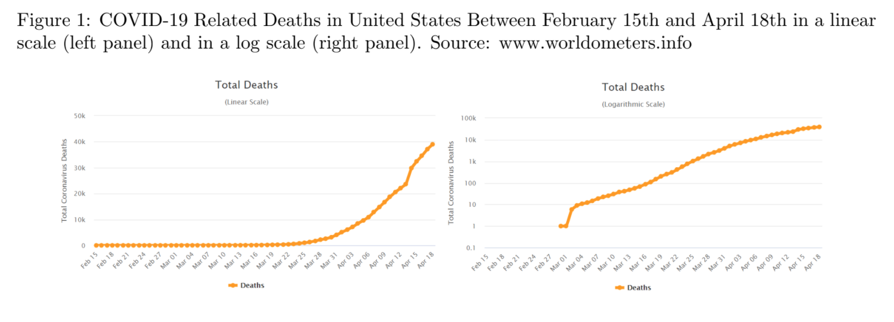

\newcommand{\ds}{\displaystyle}
\newcommand{\on}{\operatorname}

## Math 111 - Summer 2024

Quick Links: [Syllabus](index.html)

<table class='bordered'>
<thead> 
<tr><th>Week</th><th>Mon</th><th>Tue</th><th>Wed</th><th>Thu</th><th>Fri</th></tr>
</thead>
<tbody>
<tr><td>1</td><td></td><td> [Day 1](#day-1-notes) </td><td> [Day 2](#day-2-notes) </td><td> [Day 3](#day-3-notes) </td><td> [Day 4](#day-4-notes) </td></tr> 
<tr><td>2</td><td></td><td>[Day 5](#day-5-notes)</td><td> [Day 6](#day-6-notes) </td><td>[Day 7](#day-7-notes)</td><td> [Day 8](#day-8-notes)</td></tr>
<tr><td>3</td><td>[Day 9](#day-9-notes)<td>[Day 10](#day-10-notes)</td><td> [Day 11](#day-11-notes) </td><td>[Day 12](#day-12-notes)</td><td> [Day 13](#day-13-notes)</td></tr>
<tr><td>4</td><td>[Day 14](#day-14-notes)<td>[Day 15](#day-15-notes)</td><td> [Day 16](#day-16-notes) </td><td>[Day 17](#day-17-notes)</td><td> [Day 18](#day-18-notes)</td></tr>
<tr><td>2</td><td>[Day 19](#day-19-notes)</td><td> [Day 20](#day-20-notes) </td><td></td><td></td><td></td></tr>
</tbody>
</table>

### Day 1 Notes

#### Tue, May 21

Today we introduced voting methods.  See these slides for details. 

* **Slides:** [Introduction to Voting Theory](day1slides.html)

We also did these two workshops in class. 

* **Workshop:** [Plurality & Instant Run-Off Voting](Workshops/InstantRunoff.pdf)

* **Workshop:** [Borda Count](Workshops/BordaCount.pdf)

### Day 2 Notes

Today we talked about fairness criteria that voting methods should have.  

* **Slides:** [Fairness Criteria](day2slides.html)

We also did this workshop in class.

* **Workshop:** [Fairness Criteria](Workshops/FairnessCriteria.pdf)

In addition to the slides & workshop, we also talked about (and proved) the [Median Voter Theorem](https://en.wikipedia.org/wiki/Median_voter_theorem).  We finished by talking about recent advocacy to promote ranked choice voting (another name for IRV) and STAR voting (which will not be on the test).  

* **Video:** [STAR Voting](https://youtu.be/3-mOeUXAkV0)

It is something to pay attention to in the future, because there will always be a push for better voting methods than plurality voting.  

### Day 3 Notes

Today we talked about **weighted voting systems**.  We did this workshop:

* **Workshop:** [Banzhaf power](Workshops/BanzhafPower.pdf)

Before the workshop, we started with this example. Suppose a school is run by a committee with the principal who has 3 votes, the vice principal who has 2 votes, and three teachers who each have 1 votes.  A motion requires 5 votes to pass.  

We can use the shorthand notation [5: 3, 2, 1, 1, 1] to represent this weighted voting system.  The first number is the vote **threshold** needed to pass a motion, and the other numbers are the **weights** which are the number of votes controlled by each voter.  Often the voters in a weighted voting system are called **players**.  

A **winning coalition** is a subset of the players who have enough votes to pass a motion.  A player is **critical** in a winning coalition if the coalition would not have enough votes without that player. 

1. List the winning coalitions in the weighted voting system above.  

2. Circle the critical players in each winning coalition.

The **Banzhaf power index** is a way to measure how much power each player in a weighted voting system has.  

#### Banzhaf Power Index 

To find the Banzhaf power for each player,

1. List the winning coalitions and circle the critical players in each coalition.
2. The power for each player is the fraction:
$$\frac{\text{Number of times the player is circled}}{\text{Total number of circles}}.$$

3. Calculate the Banzhaf power indices for the principal, vice principal, and each teacher in the example above. 

[John Banzhaf]() was a lawyer in the 1960s who discovered the power index when he was investigating a case involving Nassua County, NY.  The districts in Nassau county had a weighted voting system where the weights were:

* Hempstead 1 had 9 votes
* Hempstead 2 had 9 votes
* North Hempstead had 7 votes
* Oyster Bay had 3 votes
* Glen Cove had 1 vote
* Long Beach had 1 vote

To reach the threshold of 16 votes to pass a motion, it required at least two of the bigger districts.  But it never mattered what the three smaller districts did.  So the three smaller districts had no power in the elections.  

A player with no power is called a **dummy**.  A player with enough power to pass a motion all by themselves is called a **dictator**.  Sometimes a player can block any motion by themselves.  Then we say they have **veto power.**

4. Can you come up with a weighted voting system $[t : p_1, p_2, p_3, p_4]$ where all four players have veto power?

Banzhaf power can illustrate some surprising things about weighted voting systems.  For example, the weights might be very different from the real amount of power each player has.

5. Suppose a country has a parliament with 200 seats.  The seats are divided between three parties that always vote together as blocs.  The red party has 99 seats, the blue party has 98 seats, and the green party has 3 seats.  Surprisingly when you calculate the Banzhaf power, the green party has the same amount of power as the red and blue parties even though it has much fewer seats. 

Sometimes you can calculate the Banzhaf power indices without having any numbers for the weights and threshold.  We did the following example. 

6. At one college, promotion decisions are made by a committee of four faculty and the dean.  The four faculty each vote, and if there is a tie, then the dean is the tie breaker.  Calculate the Banzhaf power for each faculty member and for the dean.  

If you want to play with more weighted voting examples, Professor Koether made a [Banzhaf power calculator](https://people.hsc.edu/faculty-staff/robbk/Math111/Power/) which you can try.   

### Day 4 Notes

Today we talked about **the spherical Earth theory**.  Actually, we talked about solving **proportion equations**, but most of the examples we did were related to the fact that the Earth is a sphere.  We also talked about the evidence the ancient Greeks used to deduce that the Earth is a sphere.

* **Workshop:** [Eratosthenes measures the Earth](Workshops/EratosthenesEarth.pdf)

After that, we talked about using the same ideas to find Latitude & Longitude.

* **Slides:** [Longitude presentation](https://people.hsc.edu/faculty-staff/blins/classes/fall10/math111/LongitudePresentation.pdf)

We finished by talking about a useful technique to solve word problems involving unit conversions called **factor-label method**, also known as **dimensional analysis**. Here is a [video explaining the technique](https://youtu.be/d_WfCwJW0Og) (I didn't make the video, but it is a pretty good explanation.

We did this example in class:

1. The international space station ISS orbits the Earth every 90 minutes.  The orbit of the space station is 250 miles above the Earth's surface.  How fast does the ISS move in miles per hour?  

Then we finished with this workshop:

* **Workshops:** [Factors & Units](Workshops/FactorsUnits.pdf)

### Day 5 Notes

Today we talked about orders of magnitude. For any number, its **order of magnitude** is the exponent of the nearest power of 10.  For example, 783 is closest to 1,000 which is $10^3$, so the order of magnitude of 783 is 3.  We also briefly reviewed **scientific notation** and the **metric system**.  We did this workshop.

* **Workshop:** [Orders of Magnitude](Workshops/OrdersOfMagnitude.pdf)

After that, we talked about **logarithmic scales** which are number lines where the numbers are spaced so that each step represents multiplication/division instead of addition/subtraction.  We did this workshop

* **Workshop:** [Logarithmic Scales](Workshops/LogScale.pdf)

We also looked at examples where log-scales are used to present data. Sometimes these examples can be misleading. But sometimes a log-scale is the best way to represent the data. 

* **Example:** 

</img>

 

* **Example:** 

</img>

Using log-scales to present data has advantages:

1. It spreads out small numbers so you can see them.

2. It lets you use one graph to represent numbers that are spread over many orders of magnitude.  

The disadvantages are:

1. It bunches up the big numbers, so it can make big differences seem small.

2. They are more confusing because not everyone is familiar with log-scales.  

### Day 6 Notes

We started by talking briefly about how the halfway point between two numbers on a logarithmic scale is not what you would expect.  For example, the halfway point between 1 and 100 is 10, not 50.  On a logarithmic scale, the halfway point between any two numbers $x$ and $y$ is the **geometric mean** which is:
$$\sqrt{xy}.$$  
The regular average where you add two numbers and then divide by 2 is called the **arithmetic mean**.  

1. Find the geometric mean of 3 and 12.  Compare it with the arithmetic mean.  Which is bigger?

**Fact.** The arithmetic mean of two different positive numbers is always bigger than the geometric mean. 

After we talked about arithmetic & geometric means, we introduced growth factors.  When any quantity increases (or decreases), the **growth factor** is defined to be
$$\text{Growth factor} = \frac{\text{ new amount }}{\text{ old amount }}.$$

2. Find the growth factor for the US population which increased from 282 million in 2000 to 330 million in 2020.

Growth factors will be smaller than one if the quantity is decreasing.

3. In the aughts (2000-2009) there were 3962 murders in Virginia.  In the teens (2010-2019) there were 3859 murders.  Find the growth factor.  

When we work with growth factors that are close to one, we usually talk about percent change. 
$$\text{Growth factor} = 100\% + \text{Percent Change}.$$

4. Find the percent change for the last two growth factors.  

Percent changes are confusing because you can't add and subtract percent changes.   But you can multiply growth factors.   

5. Suppose the population of a town grows by 10% one year, 20% the next year, and 30% the third year.  How much has the population grown?  

We did these two workshops.

* **Workshop:** [Relative growth](Workshops/RelativeGrowth.pdf)

After the break we talked about arithmetic and geometric sequences.  An **arithmetic sequence** is a list of numbers that change by adding or subtracting a constant step size. A **geometric sequence** is a list of numbers that change by multiplying or dividing a constant factor, called the **common ratio**.  **Linear growth (or decrease)** is when an arithmetic sequence is growing (or decreasing).  **Exponential growth (or decay)** is when a geometric sequence is growing or decreasing.  

* **Workshop:** [Exponential growth](Workshops/ExponentialGrowth.pdf)

We finished by watching this video about exponential growth and the rule of 70.

* **Video:** [The Most IMPORTANT Video You'll Ever See](https://youtu.be/F-QA2rkpBSY)

### Day 7 Notes

We started with a workshop.

* **Workshop:** [Compound interest](Workshops/CompoundInterest.pdf)

Then we talked about **logarithms**.  We talked about how (base-10) logarithms are pretty much the same thing as orders of magnitude.  They tell you the exact location of a number on a logarithmic scale where each order of magnitude is one step.  

Logarithms were discovered/invented by John Napier in the early 1600's to help make arithmetic easier. Here is some of the history. 

* 1614 John Napier published the book *A Description of the Wonderful Rule of Logarithms*.  

* 1617 Henry Briggs published the first base-10 logarithm tables.  

* 1624 Edmund Wingate published *The Use of Rules of Proportion*.  A **rule of proportion** is a wooden ruler with numbers marked on a logarithmic scale.  Wingate got the idea from Edmund Gunter and these rulers were sometimes called [Gunter sticks](https://www.nzeldes.com/HOC/images/Gunter02.jpg).

* Early 1630's William Oughtred put two wooden rules of proportion together the make the first [slide rule](https://www.npr.org/sections/ed/2014/10/22/356937347/the-slide-rule-a-computing-device-that-put-a-man-on-the-moon).

The reason that logarithms caught on so quickly is that they really did make people's lives a lot easier.  

1. Suppose you had to calculate the area of a circle using the formula $\pi r^2$.  If you measure the radius to be 12.3 centimeters, then you would have to calculate
$$(3.14)(12.3)(12.3)$$
That's pretty hard without a calculator.  With a table of logarithms, you can look up the logarithms of each number and then add them together which is much easier! 

### Day 9 Notes

Today we talked about the **apportionment problem**. 

* **Slides:** [The Apportionment Problem](day9slides.html)

We also did this workshop

* **Workshop:** [Hamilton's method](Workshops/Hamilton.pdf)

We also did an example where a Mom has 50 pieces of candy to give out to her 5 kids based on the number of minutes they spent doing chores.  

<table class="bordered">
<tr><td>Alvin</td><td>Betty</td><td>Calvin</td><td>Daisy</td><td>Edwin</td><td>Total</td></tr>
<tr><td>150</td><td>78</td><td>173</td><td>204</td><td>295</td><td>900</td></tr>
</table>

1. What is the standard divisor? What are its units?

2. What is the standard quota for each kid?

3. What is the apportionment using Hamilton's method. 

We finished by using a spreadsheet to find the apportionment of candy above using Jefferson's method. We also used Jefferson's method to find the final apportionment of Congress after George Washington vetoed the Apportionment Act of 1792.   

### Day 10 Notes

Today we talked about advantages and disadvantages of the various apportionment methods.  We also introduce the **Huntington-Hill Method** which is the one that the United States has used since 1941.  

* **Slides:** [The Apportionment Problem 2](day10slides.html)

We did two workshops, the first involved using spreadsheets to implement divisor methods. You need to download the data file to do problem 2. 

* **Workshop:** [Jefferson & Adams Methods](Workshops/JeffersonAdams.pdf)
* **Data:** [2020census.xlsx](2020census.xlsx)

The other was a quick example of using a logarithmic scale to implement the Huntington-Hill method. 

* **Workshop:** [Divisor Methods & Logarithmic Scales](Workshops/HuntingtonHill.pdf)

### Day 11 Notes

Today we introduced **graph theory**.  We started by verifying **Euler's formula** which says that any graph on a piece of paper with $V$ vertices, $E$ edges, and $F$ faces or regions (including the one exterior face which is not enclosed by edges), the following formula is *always* true:
$$ V + F - E = 2.$$

A **graph** is a set of points called **vertices** and a set of lines connecting two vertices called **edges** (the edges don't have to be straight).  A graph that you can draw on a piece of paper so that no edges cross (except at vertices) is called a **planar graph**.  

According to legend, the subject of graph theory was discovered/invented in 1735 when Leonhard Euler heard about the Seven Bridges of Königsberg puzzle.  At the time, Königsberg was a city in Prussia with seven bridges.  The puzzle asks whether it is possible to walk around the city crossing every bridge exactly once.  Assume that you can only cross the river by walking across on of the bridges.

</img>

Euler solved the problem by abstracting away the irrelevant details and focusing on the underlying graph structure. A graph has an **Euler path** if there is a path that starts and ends at different vertices and crossed every edge exactly once. A graph has an **Euler circuit** if there is a path that starts and ends in the same place and crosses every edge exactly once. 

</img>

Euler figured out that the only thing that matters (as long as the graph is connected) is the degrees of the vertices in the graph.  The **degree** of a vertex is the number of edges that touch it. 

**Theorem.** A connected graph has an Euler path if and only if it has exactly two vertices with an odd degree.  A connected graph has an Euler circuit if and only if all of the degrees are even.

We didn't prove this theorem, but we did give an intuitive explanation for why it is true.  Cole also had an interesting idea that maybe you have to have an even number of edges to have an Euler path, but we ended up finding some counter examples for that conjecture.  

We also proved this handy theorem:

**The Handshake Theorem.** In any graph, the sum of the degrees of all the vertices is twice the number of edges.

Then we did this workshop. 

* **Workshop:** [Euler paths](Workshops/EulerPaths.pdf)

We also talked about Fluery's algorithm, which is a way to find an Euler path (or circuit) in a graph.  

**Fluery's algorithm.** For a graph that has an Euler circuit (or path):

1. Pick a start vertex (must have odd degree if you are looking for a path).

2. Move along the graph from vertex to vertex, removing the edges you cross as you go.  When you have a choice, never pick an edge that would make it impossible to reach some un-visited edges.  

3. Continue until you are done.

It is not obvious, but this algorithm always works as long as a graph is connected and has only even degree vertices (or just two odd degree vertices). 

### Day 12 Notes

Today we talked about trees.  A **tree** is a graph that is connected and has no cycles. A **path** is a sequence of adjacent edges with no repeats. A **cycle** is a path of length more than 1 that never repeats an edges and starts and ends at the same vertex.  We proved these theorems about trees, the most important of which is this first one (which includes several of the other theorems). 

**Tree Classification Theorem.** For connected graphs, the following properties are equivalent. If a connected graph has one of these properties, then it has all of them.

1. The graph is a tree. 
2. For any two points, there is only one (simple) path connecting them.  
3. $V = E+1$.

 

The first part of the proof is to show that properties 1 and 2 are equivalent. We called this Tree Theorem 1. Here is why it is true. If there were two paths, then eventually they would split and then rejoin.  The edges between where the paths split and rejoin would form a cycle, which is impossible.  Conversely if there were a cycle, then there would be more than one path connecting any two vertices in the cycle (one going clockwise, the other counterclockwise). 

To prove that property 3 is equivalent to the other two properties in the Tree Classification Theorem takes a little more work.  We needed some helper theorems.  The first theorem is about **leaves** which are vertices with degree one in a tree. 

 
**Theorem.** Every tree with more than 1 vertex must have some leaves.  

To prove this theorem, start from any vertex and make a path.  Keep extending the path as long as you can, until you can't go any farther.  There are only two reasons you can't go farther. Either you are at a dead end (which means you have found a degree one vertex), or you have already visited all the edges that touch the current vertex.  But then the path has hit the vertex at least twice, and contains a cycle, which is impossible in a tree.  

**Theorem.** For any tree, the number of vertices $V$ is always one more than the number of edges $E$.  In other words, 
$$V = E + 1.$$

The key to proving this theorem is to use a technique called **pruning**.  Since every tree must have some leaves (i.e., degree 1 vertices), you can remove a degree 1 vertex and the edge that touches it from the tree.  After you do this, you will still have no cycles, and your graph will still be connected because any other two vertices will have a path connecting them.  Therefore the pruned graph is still a tree, and so it still has more leaves you can prune.  Each time you prune a vertex, you reduce the number of edges and vertices both by one, until you get down to a single vertex and no edges.  At each step $V-E$ is the same, and at the end, $V-E= 1$, so $V-E = 1$ in the original tree. 

The last helper theorem we needed was about spanning trees.  A **spanning tree** is a subgraph of a graph that is a tree and includes all of the vertices and some of the edges from the original graph.  

**Theorem.** Every connected graph has a spanning tree. 

This is true because if you start with a connected graph that has one or more cycles and remove one of the edges from a cycle, the new graph you get is still connected.  So you can repeat the process until there are no more cycles left.  When you are done, you have a connected subgraph with no cycles, i.e., a spanning tree. 

With this last result, we were able to prove the final part of the Tree Classification Theorem: If a connected graph has exactly $V = E+1$ vertices, then it must be a tree.  This is because a connected graph must have a spanning tree.  The spanning tree has $V = E+1$ vertices.  If the original graph also has $V = E+1$ vertices.  Since both the original graph and the spanning tree have the same number of vertices, we conclude that they have the same number of edges, which means that the spanning tree is the original graph.  So the original graph is a tree. 

After developing all of this theory about trees, we introduced minimal spanning trees.  In a connected graph where some edges are more expensive to include than others, the **minimal spanning tree** is the spanning tree that would be the least expensive to build.  There is a simple algorithm to find the minimum spanning tree. 

**Kruskal's Algorithm.** To find the minimal spanning tree in a connected graph, follow these steps. 

1. Add the cheapest edge.

2. Add the second cheapest edge (it doesn't have to be next to the first edge).

3. Keep adding the cheapest edge available, as long as it doesn't make a cycle.  Stop when you have a tree.  

We finished with this workshop.

* **Workshop:** [Trees](Workshops/Trees.pdf)

### Day 13 Notes

Today we introduced Markov chains.  We started with this example, which is from the book *Introduction to Finite Mathematics* by Kemeny, Snell, & Thompson.  

> The Land of Oz is blessed by many things, but not by good weather. They never have two nice days in a row. If they have a nice day, they are just as likely to have snow as rain the next day. If they have snow or rain, they have an even chance of having the same the next day. If there is change from snow or rain, only half of the time is this a change to a nice day.

A **Markov chain** is a mathematical model with states and transition probabilities which only depend on the state you are currently in.   The example above has three states: nice weather, rain, and snow.  A Markov chain can be represented using a weighted directed graph. A **directed graph** is a graph where the edges have a direction (indicated by an arrow).  A **weighted graph** is one where each edge has a number.  In a Markov chain graph, the weights on the edges are the probabilities that you take that edge. Here is the graph for the weather in the Land of Oz. 

</img> 

Here is another example of a Markov chain.  

> A professor tries not to be late too often.  On days when he is late, he is 90% sure to arrive on time the next day.  When he is on time, there is a 30% chance he will be late the next day.  How often is this professor late in the long run?

1. Draw and label a graph to represent this Markov chain.  

2. If the professor is on time today, what is the probability that he will be on time the day after tomorrow?  

There is another approach to Markov chains that makes it much easier to answer questions like the last one.  For a Markov chain, the **transition matrix** is a rectangular array of numbers where the rows represent the possible current state, the columns represent the possible states in the next round.  The number in row $i$ column $j$ of the matrix is the probability that you will end up in state $j$ if you started in state $i$.  For example, the transition matrix for the professor is:

<table class="bordered">
<tr><td></td><td>Late</td><td>On-Time</td></tr>
<tr><td>Late</td><td>0.1</td><td>0.9</td></tr>
<tr><td>On-Time</td><td>0.3</td><td>0.7</td></tr>
</table>

We usually don't bother writing the names of the states (as long as we can remember the order).  Then we just write the transition matrix this way:
$$\begin{pmatrix} 0.1 & 0.9 \\
0.3 & 0.7 \end{pmatrix}$$

3. Find the transition matrix for the weather in the Land of Oz. 
 
You can model what we know about the current state using a **probability vector** which is a matrix with only one row and a probability for each possible state.  The entries in a probability vector must add up to one.  For example, here are two different probability vectors:
$$\begin{pmatrix} 0 & 1 \end{pmatrix}  ~~~~~~~~ \begin{pmatrix} 0.4 & 0.6 \end{pmatrix}$$
The first would represent being 100% sure that the professor is on-time.  The second shows a 40% chance that the professor is late and a 60% chance that he is on-time.

**Fact.** If $Q$ is the transition matrix for a Markov chain and $v$ is a probability vector indicated what we know about the current state, then $vQ$ is the probability vector for the next state.  

In order to calculate $v$ times $Q$, you need to know how to **multiply matrices**.  Here are some videos that explain how to multiply matrices: (<https://youtu.be/kT4Mp9EdVqs> and <https://youtu.be/OMA2Mwo0aZg>). 

You can also raise a matrix to a power.  For example, $Q^2$, just means $Q$ times $Q$, and $Q^3$ is $Q \cdot Q \cdot Q$.  For transition matrices, $Q^2$ represents how the Markov chain will change in 2 rounds and $Q^3$ represents how the Markov chain will change in 3 rounds.  Higher powers just represent more transitions.  

We used the [Desmos Matrix Calculator](https://www.desmos.com/matrix) to calculate $Q^{10}$ for the late professor Markov chain, and we found that no matter whether the professor was late or on-time the first day, there is a roughly 25% chance he will be late 10 days later. We finished with this workshop. 

* **Workshop:** [Markov chains](Workshops/MarkovChains.pdf)

### Day 14 Notes

Today we continued talking about Markov chains.  We started by looking at the transitions matrices for both the tardy professor example and the weather in the Land of Oz example from last time.  In both cases, when you raise the matrices to larger and larger powers, the results get closer and closer to a single matrix.  When that happens, we say that the matrices $Q^k$ **converge**.  

<!--**Fact.** If a Markov chain has transition matrix $Q$, and $Q^k$ converges to a matrix as $k$ gets large, then the rows -->

What often tends to happen is that after a large number of transitions, we get a probability vector that doesn't change.  A probability vector $v$ such that 
$$vQ = v$$
is called a **stationary distribution**.  It turns out that all Markov chains have a stationary distribution.  If the powers of the transition matrix $Q^k$ converge, then each row of the matrix that they converge to is a stationary distribution for the Markov chain.  

You can tell a lot about a Markov chain by looking at the strongly connected components of its graph.  

**Definition.** A directed graph is **strongly connected** if you can find a path from any start vertex $i$ to any other end vertex $j$. A **strongly connected component** of a graph is a set of vertices such that (i) you can travel from any one vertex in the set to any other, and (ii) you cannot returns to the set if you leave it. Strongly connected components are also known as **classes**. Every vertex of the graph will always be contained in exactly one class. A class is **final** if there are no edges that leave the class. 

</img>

In the directed graph above, there is one final class $\{f,g\}$ and two other non-final classes.  States in a Markov chain that are not in a final class are called **transitory**.  A state that you can enter but never leave is called **absorbing**.  We looked at this example of a Markov chain with an absorbing state.  

1. Suppose McDonald's is having a Teenage Mutant Ninja Turtles special where each happy meal comes with a toy figure of one of the four ninja turtles (each equally likely).  Suppose that a kid buys a happy meal every day to try to collect all four turtles.  

    a. Draw the graph for this Markov chain.  Hint: The states can just be the number of different turtles the kid has collected so far.

    b. What is the transition matrix for this Markov chain?

    c. What is the probability of getting all four turtles if you buy 7 happy meals?

    d. How many happy meals would it take for there to be at least a 90% probability of having all four turtles?  

We finished with a second workshop about Markov chains.

* **Workshop:** [Markov chains 2](Workshops/MarkovChains2.pdf)

### Day 15 Notes

Today we talked about probability theory.  We started by defining probability models.

A **probability model** has two parts:

1. A set of possible outcomes called the **sample space**, and 

2. A **probability function** which assigns a probability to each outcome in the sample space. 

We talked about how everyone has a mental model of how flipping a coin works and how rolling a six-sided die works.  Those are both examples of probability models.  A probability model is **equiprobable** if every outcome is equally likely.  Both the fair coin and six-sided dice models are equiprobable.  A simple probability model that is not equiprobable would be if you flipped two fair coins and counted the number of heads. 

We drew a **probability histogram** for this model, which is just a bar chart that shows the probability for each outcome.  This is also called a **probability distribution**.  

* **Workshop:** [Probability distributions](Workshops/ProbabilityDistributions.pdf)

After the first distribution we talked about the basic rules of probability.  First, we defined an **event** which is any subset of the sample space.  We often use capital letters like A or E to represent events. We use the shorthand $P(E)$ to mean: *the probability that event E happens.*  In an equiprobable space there is a simple formula for the probability of an event:
$$P(E) = \frac{\text{ Number of elements in }E}{\text{ Number of elements in the sample space }}.

The other rules we talked about are these:

1. **Complementary Events** For any event $E$, 
$$P(E \text{ does not happen}) = 1 - P(E).$$

2. **Addition Rule** For any two events $A$ and $B$, 
$$P(A \text{ or } B) = P(A) + P(B) - P(A \text{ and } B).$$

3. **Multiplication Rule for Independent Events** If $A$ and $B$ are independent events, then 
$$P(A \text{ and } B) = P(A) \cdot P(B).$$

Two events are **independent** if the probability that $A$ happens does not change if $B$ happens.  Here is an example:

1. If you shuffle a deck of 52 playing cards and draw the first one off the top, the probability that it is an ace is $\tfrac{4}{52}$.  If you don't put it back, then the probability that the second card is an ace depends on whether the first one was.  If the first was an ace, then there are only 3 aces left, so the probability would be $\tfrac{3}{51}$. But if the first was not an ace, then there are still 4 aces left, so the probability would be $\tfrac{4}{51}$.  

We also did this example:

2. 35% of voters in the US identify as independents and 23% of voters call themselves swing voters.  11% of voters are both.  

    a. What is the probability that a voter is independent or a swing voter?

    b. What is the probability that a voter is neither indpendent nor a swing voter?

    c. How can you tell that being an indpendent voter is not indepdent of being a swing voter? 

We finished with this workshop:

* **Workshop:** [Basic probability rules](Workshops/BasicProbabilityRules.pdf)

### Day 16 Notes

Today we talked about weighted averages and expected value.  We started by reviewing how to calculate a weighted average.  A **weighted average** is the dot-product of a list of numbers with a list of weights.  The weights should be fractions or decimals that add up to one.  

1. Suppose that the final grade in one class is based on the following components:  

<table class="bordered">
<tr><td>Project</td><td>Midterms</td><td>Quizzes</td><td>Final</td></tr>
<tr><td>5%</td><td>45%</td><td>20%</td><td>30%</td></tr>
</table>

Calculate the final average for a student who got 100 on the project, 73 on the midterms, 89 on the quizzes, and 81 on the final.  

2. 11 nursing students just graduated.  Four of the students graduated in 3 years, four took 4 years, two finished in 5 years, and one student took 6 years to graduate.  Express the average number of years it took the students as a weighted average.  

After we reviewed weighted averages, we talked about how there are two different kinds of averages that are important in probability theory. 

* **Sample mean** - This is the regular average when you look at the outcomes of a repeated random experiment.  

* **Theoretical mean** (also known as the **expected value**) this is the weighted average of the possible outcomes, using the probabilities as the weights.  

3. What is the expected value when I roll a fair six-sided die?  What would the sample mean be if I roll the die ten times and get the following results:

1, 4, 5, 3, 4, 3, 6, 2, 1, 3?

One confusing thing is that you don't expect to get the "expected value" if you only roll a die once.  To understand what we mean when we call the theoretical mean the expected value, you need to know the Law of Large Numbers:

**The Law of Large Numbers.** If you repeat a random experiment, the sample means tends to get closer to the theoretical mean as the number of trials increases.  

4. A roulette wheel has 36 numbers slots, half red & half black.  It also have two green slots 0 & 00.  If you bet $1 on black, you have an 18/38 chance of winning $2.  The rest of the time, you lose and get $0 back.  Find the expected value of money you will win.  Is it worth $1 to play a game of roulette?  What will tend to happen in the long run?  

* **Workshop:** [Weighted averages & expected value](Workshops/ExpectedValue.pdf)

After the workshop, we introduced weighted tree diagrams, which are a tool to help keep the addition and multiplication rules in probability straight.  We started with this example:

5. Suppose you draw two cards from a deck of 52 playing cards.  What is the probability that exactly one is an ace?  

</img>

**Weighted Tree Diagrams.**

1. Draw edges leading to outcomes. 
2. Label each edge with its probability. 
3. Multiply probabilities along a path.
4. Add probabilities from separate branches. 

Notice that the multiplication rule we talked about last time requires events to be independent.  A more general multiplication rule that does not assume events are indpendent is the following:

* **General Multiplication Rule** For any two events A and B, 
$$P(A \text{ and } B) = P(A) \cdot P(B \, | \, A),$$
where $P(B \, | \, A)$ is shorthand that means "the probability of B given that A happened".  

We finished with this exercise:

6. A group of deep sea divers come to you with an investment opportunity.  The think they have found a ship wreck with a valuable treasure.  They tell you that:
    * There is a 60% chance they know where the wreck is.
    * There is a 70% chance that the wreck contains treasure.
    * There is a 70% that they can recover the treasure if it is there. 

    a. Draw and label a tree diagram for this situation.  
    b. Is it worth investing $200,000 if you will get $1,000,000 if the divers recover the treasure?  What is the expected value of your investment?  

### Day 17 Notes

Today we talked about conditional probabilities $P(A \, | \, B)$.  

**Conditional Probability Formula.** For any two events A and B, the **conditional probability** of A given B is 
$$P(A \, | \, B) = \frac{P( A \text{ and } B)}{P(B)}.$$

This comes directly from the multiplication rule we talked about last time.  We started with the following example.  

1. In 1721 there was a smallpox outbreak in Boston.  We have records of people who caught smallpox during the outbreak.  At the time, some people had been inoculated (see <https://en.wikipedia.org/wiki/Inoculation#Introduction_in_Europe_and_North_America>).  

<table class="bordered">
<tr><td></td><td>Inoculated</td><td>Not Inoculated</td><td>Total</td></tr>
<tr><td>Lived</td><td>238</td><td>5136</td><td> 5374</td></tr>
<tr><td>Died</td><td>6</td><td>844</td><td>850</td></tr>
<tr><td>Total</td><td>244</td><td>5980</td><td>6224</td></tr>
</table>

 

The probability that someone died if they were inoculated was only $\tfrac{6}{244} = 2.5\%$.  The probability of dying for un-inoculated people was much higher, $\tfrac{844}{5980}=14.1\%$. Both of these are conditional probabilities of the form $P(A \, | \, B)$.  What is the A and B for each?

Conditional probabilities can be surprisingly counter-intuitive.  

2. A study found that 0.8% of women in their 40s have breast cancer.  For women with breast cancer, mammograms are 90% accurate, and for women without mammograms are 93% accurate.  We can express this with a tree diagram. 

</img>

    a. What percent of women test positive for breast cancer?

    b. What is the probability that a woman actually has breast cancer given that they test positive?

* **Workshop:** [Conditional probability](Workshops/ConditionalProbability.pdf)

After the workshop we briefly went over some questions about the [midterm 2 review problems](midterm2review.pdf).

### Day 19 Notes

Today we introduced the normal distribution.  Lots of things in nature have a probability distribution that is shaped like a bell.  Here are some examples. 

* [Men's heights in the USA](http://people.hsc.edu/faculty-staff/blins/StatsExamples/cdcHeights.html)
* [Farmville annual rainfall totals](http://people.hsc.edu/faculty-staff/blins/StatsExamples/rainfall.html)

Another important example is when you flip a coin (fair or unfair) many times and count the number of heads.  The total number of heads has a distribution called the **binomial distribution** that has a shape that looks more and more like a bell curve as the number of flips gets larger and larger.  

* [Binomial distribution](https://people.hsc.edu/faculty-staff/blins/StatsTools/binomialPlotter2.html)

In fact, one of the most important mathematical facts is that any time you add independent random numerical outcomes that come from a fixed probability distribution, the results tend to have a normal distribution as the number of observations increases. The **normal distribution** is a probability model that has a complicated formula, but it also has the following simple features. 

1. **Shape.** - A normal distribution is shaped like a bell. It is mirror image symmetric around its middle. 
2. **Center.** - The middle is the theoretical average $\mu$.
2. **Spread.** - Every normal distribution has two **inflection points** which are the steepest parts of the graph. They are located exactly one **standard deviation** $\sigma$ above and below the mean $\mu$.  

**Fact.** A normal distribution is completely described by the two numbers $\mu$ and $\sigma$.  The reason that normal distributions are so common in math & nature is the following theorem. 

**The Central Limit Theorem.** The sum of a large number $N$ of independent observations from a probability distribution tends to have a normal distribution.  The distribution of the sum gets more normal as $N$ increases.  

We also talked about the **68-95-99.7 Rule**:

</img>

When working with normal distributions, it is common to refer to data in terms of how many standard deviations it is above or below the mean.  This is called **standardized data** or **z-values**.  The formula to calculate a z-value is:
$$z = \frac{\text{data} - \text{mean}}{\text{standard deviation}}.$$

We used z-values to answer the following question.  

1. The average high temperature in Anchorage, AK in January is 21 degrees Fahrenheit, with standard deviation 10.  The average high temperature in Honolulu, HI in January is 80°F with $\sigma =$ 8°F.  In which city would it be more unusual to have a high temperature of 57°F in January?  

* **Workshop:** [Normal distribution](https://people.hsc.edu/faculty-staff/blins/StatsExamples/NormalDist.pdf)

After we did the workshop, we talked about roulette again.  If you bet on black, then you win with probability 18/38, but if you bet on a number like 7, then you only win 1/38 times.  But since the payoff is bigger if you bet on a number, you still get the same theoretical average payoff ($0.947 for every dollar bet).  But even though both bets have the same $\mu$, they actually have very different probability distributions if you play 100 games.  

2. How many games would you expect to win if you play 100 games and bet on black every time? 

3. Is the probability histogram for the total number of wins approximately normal in this case? 

4. How many games would you expect to win if you play 100 games and bet on 7 every time? 

5. Is the probability histogram for the total number of wins approximately normal in this case? 

It turns out that you are much more likely to beat the house if you bet 100 times on 7 than if you bet 100 times on black. We finished by talking about risk (which is measured by the standard deviation) can be weighed against the expected value of the reward to judge whether investments are worthwhile. 

<!--
Today we talked about **Markov chains with rewards**.  These are Markov chain where you get a reward (or a penalty) when you are in some states.  We can use a vector R to represent the rewards for each states.  

A state in a Markov chain is **transient** if it is not in one of the final classes.  If a state is in a final class, then we say it is **recurrent**.  

Here is an example:

1. John is on a game show where he must try to stay on a wobbling platform and not fall into the water below for as long as possible.  Each second he stays out of the water, he earns a point.  Each second he is on the platform, there is a 10% chance he falls off.  If he falls, there is a 50% chance he will be able to grab the edge of the platform and hang on, otherwise he falls into the water.  If he is hanging onto the edge, then there is a 20% chance each second that he will fall into the water. Draw a graph for this Markov chain. 

John gets a reward of 1 for every second he is not in the water.  We'd like to know how long John can stay out of the water on average. The transition matrix for this Markov chain is 
$$\begin{pmatrix} 0.90 & 0.05 & 0.05 \\ 0 & 0.80 & 0.20 \\ 0 & 0 & 1 \end{pmatrix}.$$

* Let $v_1$ be the expect value of the total future reward if we start on the platform.  
* Let $v_2$ be the expected total future reward if John is hanging onto the edge. 
* Let $v_3$ be zero, which represents the future reward when you are in the water.  

We can use an idea called recurrence to figure out what the numbers $v_1$ and $v_2$ are.  The expected reward starting in state 1 (on the platform) is 1 for this round, plus the expected value of the reward the next round which is a weighted average of $v_1$, $v_2$, and $v_3$. Likewise, the expected reward starting in state 2 is 1 plus the expected reward the next round which is 80% of $v_2$ plus 20% of $v_3$.  

\begin{align*}
v_1 &= 1 + 0.9 v_1 + 0.05 v_2 + 0.05 v_3\\
v_2 &= 1 + 0.8v_2 + 0.2 v_3 \\
v_3 &= v_3                    \\
\end{align*}

This can be rewritten as 

$$v \mapsto R + Q v$$

As long as the reward vector $R$ is zero in every entry corresponding to a recurrent state, there is only one vector $v$ that satisfies this equation with zero entries for all of the recurrent states.  This vector is called the **value vector** and its entries are the expected total future reward if you start in any of the states of the Markov chain. To find $v$, there is an algorithm:

**Value Iteration Algorithm.** For a Markov chain with transition matrix $Q$ and reward vector $R$:

1. Let $v$ be the all zero vector. 
2. Replace $v$ by $R+Qv$.  
3. Repeat step 2 several times until the entries in $v$ stop changing.

As long as the reward vector $R$ is zero in every entry corresponding to a recurrent state, this algorithm will eventually converge to the value vector $v$. 

-->     

 
 
 
 
 
 
 
 
