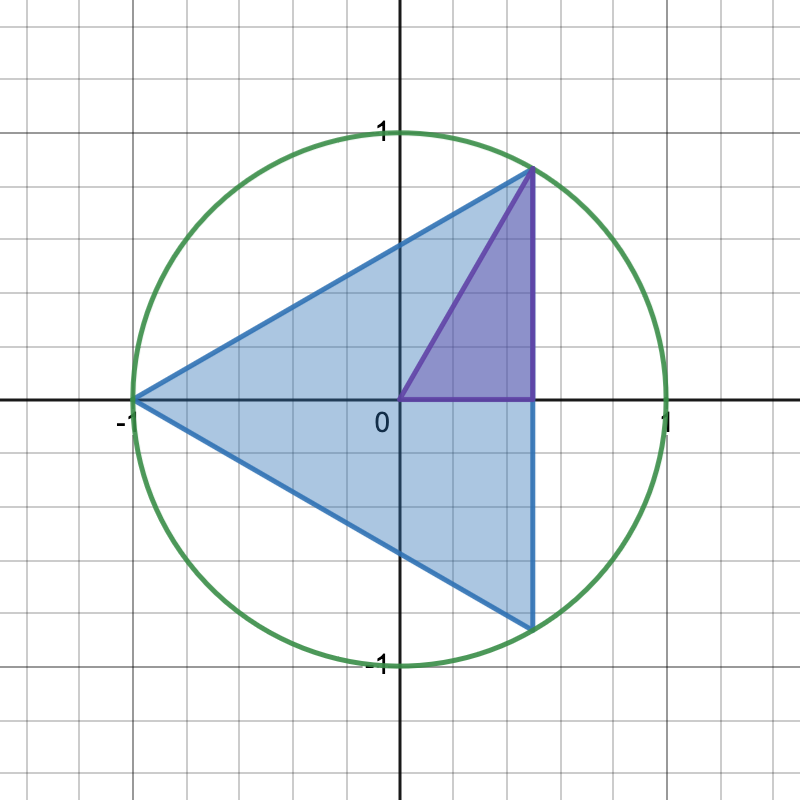

\newcommand{\ds}{\displaystyle}
\newcommand{\on}{\operatorname}

## Math 141 - Spring 2024

Jump to: [Syllabus](index.html), [Week 1](#week-1-notes) , [Week 2](#week-2-notes), [Week 3](#week-3-notes), [Week 4](#week-4-notes), [Week 5](#week-5-notes), [Week 6](#week-6-notes), [Week 7](#week-7-notes), [Week 8](#week-8-notes), [Week 9](#week-9-notes), [Week 10](#week-10-notes), [Week 11](#week-11-notes), [Week 12](#week-12-notes), [Week 13](#week-13-notes), [Week 14](#week-14-notes)

### Week 1 Notes

Day  | Section  | Topic
:---:|:---:|:---------
Wed, Jan 17 | [1.1][1.1] | Review of functions
Thu, Jan 18 | [1.2][1.2] | Basic classes of functions 
Fri, Jan 19 | [1.2][1.2] | Basic classes of functions - con'd

### Wed, Jan 17

Today we reviewed functions and function notation.  We talked about how $f(x)$ looks like $f$ multiplied by $x$, but it really means something completely different! We also talked about the following important functions (and their graphs) that you should have memorized:

1. **Linear functions** $f(x) = mx+b$.

2. **The square function** $f(x) = x^2$. 

3. **The positive square-root function** $f(x) = \sqrt{x} = x^{1/2}$. 

4. **The reciprocal function** $f(x) = \dfrac{1}{x}$.

5. **The 1-dimensional distance function** $f(x) = |x-a|$. 

We reviewed the definitions of **domain**, **range**, and **function composition**. We did the following examples in class. 

1. Let $f(x) = \dfrac{4}{x+2}$ and $g(x) = \dfrac{1}{x}$. Find the domain of $f(g(x))$. (<https://youtu.be/PNzHrPebKOw>)

2. Two poles are connected by a wire that also connects to the ground between the poles. Find a formula for the length of the wire as a function of $x$ and determine the domain. 

</img>

We didn't have time for this exercise, but it is also a good example of how to construct a function. 

3. A rectangular piece of cardboard is 10 inches by 8 inches.  If we cut squares of length $x$ out of the four corners, then we can fold the sides up to make a box.  Find a formula for the volume of the box as a function of $x$ and determine the domain. (<https://youtu.be/UvTYc5Wqu8w>)

<!--
4. The function $f(x) = \sqrt{R^2 - x^2}$ has a graph that is a semicircle.  What is the domain & range of this function?
-->

<!--
### Thu, Jan 18

Review linear functions and introduce piecewise function w/ the income tax example.

### Fri, Jan 19

Review polynomial functions.

-->

### Thu, Jan 18

Today we started with the wire between two poles example from yesterday.  Then we focused on linear functions. We reviewed **slope-intercept form** and did the following examples in class.

1. Find the formula to convert Celsius temperatures to Fahrenheit.

2. Find a formula for the line through $(4,9)$ and $(6,1)$. (<https://youtu.be/LtpXvUCrgrM>)

As of 2023-24, the US Income Tax brackets for individuals earning up to \$95,375 are:

| Taxable Income | Rate |
| :---: | :---: |
| \$0 to \$11,000 | 10% |
| \$11,000 to \$44,725 | 12% |
| \$44,725 to \$99,375 | 22% |

3. Express income tax owed as a function of income for individuals earning up to \$44,725.  

Here is another good example that we didn't do in class:

4. Find the slope and intercepts of $3x+5y = 15$. (<https://youtu.be/SOwh-Wk7Cq0>)

### Fri, Jan 19

Today we talked about **polynomial functions and equations**.  We briefly reviewed how to factor polynomials and we solved the following problems. 

1. Suppose $f(x) = x^2$ and $g(x) = 5x-6$.  Find the $x$-values where these two functions intersect. <!-- Also what does the function $f(x)-g(x)$ represent?-->

<!--2. Where does the line $y = 3x+2$ intersect the parabola $y = -4x^2 + 6$? (<https://youtu.be/JkMTthGWHUs>)-->

2. Solve $x + \dfrac{8}{x} = 6$. (<https://youtu.be/1fR_9ke5-n8?t=112>)

<!--4. Solve $\dfrac{x}{x+5} - \dfrac{5}{x-5} = \dfrac{14}{(x+5)(x-5)}$. (<https://youtu.be/1fR_9ke5-n8?t=519>)-->

3. Solve $\dfrac{x^2}{4} = \dfrac{2x}{x-6}$.  

In the last example, you should get to $x(x^2 - 6x - 8) = 0$.  Unfortunately there aren't integer factors of $-8$ that add up to $-6$.  So you need to use the **quadratic formula** 
$$x = \frac{-b \pm \sqrt{b^2 - 4ac}}{2a}$$
to find all of the solutions.  You do not need to memorize the quadratic formula (it will be on the formula sheet on exams and you can look it up when you are doing your homework if needed). 

- - -

### Week 2 Notes
 
Day  | Section  | Topic
:---:|:---:|:---------
Mon, Jan 22 | [1.3][1.3] | Trigonometric functions
Wed, Jan 24 | [1.3][1.3] | Trigonometric functions
Thu, Jan 25 | | Review
Fri, Jan 26 | [2.1][2.1] | A preview of calculus

### Mon, Jan 22

Today we did a review of some basic trigonometry. We talked about the things you should memorize which include:

* $\pi$ radians is 180 degrees.
* The definitions of sine, cosine, and tangent ([SOH-CAH-TOA](https://mathworld.wolfram.com/SOHCAHTOA.html)).  
* The graphs of $\sin(x)$ and $\cos(x)$. 

We did the following exercises. 

1. Convert $\tfrac{-\pi}{3}$ radians to degrees. (<https://youtu.be/z0-1gBy1ykE>)

2. Convert $150^\circ$ to radians. (<https://youtu.be/O3jvUZ8wvZs>)

3. Find the values of $\cos \theta, \sin \theta, \tan \theta, \sec \theta, \csc \theta,$ and $\cot \theta$ for the angle $\theta$ shown below.  

<svg width=250 height=200>
<path d="M 25 175 H 225 V 25 Z" stroke="black" fill="transparent" stroke-width="2"/>
<path d="M 210 175 V 160 H 225" stroke="black" fill="transparent" stroke-width="1"/>
<g font-size="24">
<text x="60" y="170">θ</text>
<text x="233" y="110">3</text>
<text x="125" y="200">4</text>
</g>
</svg>

3. Find $\sin(\tfrac{4\pi}{3})$. Hint: use the [formula sheet](formulaSheet.pdf).

4. Find $\cot(-\tfrac{2\pi}{3})$ (<https://youtu.be/KaS3P1a7GE8>)

5. Find $\sec(3 \pi)$

6. Find all solutions to $\cos x = 0$. 

7. Solve $2 \cos x + 1 = 0$. (<https://youtu.be/j7c2I_fwamc>)

8. A 1000 meter long driveway in the mountains has a $10^\circ$ grade.  How much elevation do you gain when you drive up the driveway?  

### Wed, Jan 24

Today we looked at some more trigonometry examples.  We did the following:

1. The radius of the Earth is about 4000 miles.  Farmville has a Latitude of 37.3$^\circ$.  How far is Farmville from the the equator?  

2. A lighthouse is 25 meters above sea level.  A boat measures the angle of elevation of the light to be $\theta$.  How far is the boat away from the base of the lighthouse as a function of $\theta$? 

3. Prove the **Law of Sines** (for any triangle, the following formula is true): (<https://youtu.be/APNkWrD-U1k>)

$$ \frac{\sin A}{a} = \frac{\sin B}{b} = \frac{\sin C}{c}$$

4. Simplify $\sec \theta \sin \theta \cos \theta$. (<https://youtu.be/-s44LcIPaPU>)

5. Simplify $\tan^2 x - \sec^2 x$ as much as possible. (<https://youtu.be/0QuB4HOI3J8>)

6. Find all solutions of $\dfrac{\sin^2 x}{1-\cos x} - 1 = 0$ in the interval $[0,2\pi)$. 

7. Find all solutions of $2\sin \theta = \tan \theta$ on $[0,2\pi)$. (<https://youtu.be/vVR91JqJEMQ>)

### Thu, Jan 25

Today we went over [homework 2](HW2.pdf).  We also did the following additional exercise in class.

1. Solve $\sin^2 \theta = \frac{3}{4}$.  

### Fri, Jan 26

Today we started talking about limits.  We began with this example:

<a href="https://www.desmos.com/calculator/wmiwqa3ibb"></img></a>

1. What is the area of a regular $n$-gon inscribed in the unit circle?  

2. What happens to the area as the number of sides gets bigger and bigger?  

A **sequence** is a special kind of function which has domain equal to the natural numbers $\mathbb{N} = \{1,2,3,\ldots\}$. We say that an interval $(a,b)$ **eventually contains** a sequence $s(n)$ if there is a number $N$ such that $a < s(n) < b$ for all $n \ge N$. If every interval $(a,b)$ that contains $L$ eventually contains $s(n)$, then we say that $s(n)$ **converges** to the **limit** $L$. This can be written as:
$$\lim_{n \rightarrow \infty} s(n) = L.$$

We finished by looking at another example of a limit.  Galileo was the first person to observe that the distance traveled by an object that is dropped from a great height is roughly $d = 4.9t^2$ meters (when $t$ is the time in seconds after the object was dropped).  The average velocity of a falling object is 
$$v_{\text{average}} = \frac{d(t_2) - d(t_1)}{t_2 - t_1}.$$

3. Use Desmos to find the average velocity over the following time intervals: 
    a. $[2,3]$ 
    b. $[2,2.1]$
    c. $[2,2.01]$
    d. $[2,2.001]$

4. Use the previous answers to estimate the velocity at the instant when the object has been falling for 2 seconds. 

These two examples, the area of a circle and the instantaneous velocity of a falling object, are both limits. Next week, we'll look at how to work systematically with limits. 

- - -

### Week 3 Notes
 
Day  | Section  | Topic
:---:|:---:|:---------
Mon, Jan 29 | [2.2][2.2] | Limit of a function
Wed, Jan 31 | [2.3][2.3] | Limit laws
Thu, Feb 1 | | Review
Fri, Feb 2 | [2.4][2.4] | Continuity

### Mon, Jan 29

Today we defined limits for functions.  We say that the **limit** of $f(x)$ as $x$ approaches $a$ is $L$ and write
$$\lim_{x \rightarrow a} f(x) = L$$ 
if every sequence $x(n)$ that converges to $a$ (but never equals $a$) has $\lim_{n \rightarrow \infty} f(x(n)) = L$.

We looked at two examples on Desmos where a function is not defined but its limit is:

1. $\lim_{x \rightarrow 1} \dfrac{x^3 - 1}{x-1}$.

2. $\lim_{x \rightarrow 0} \dfrac{\sqrt{x^2 + 9} - 3}{x^2}$.

Both of these are examples of hole discontinuities.  We also saw three other common types of discontinuities:

3. (Pole discontinuity) $f(x) = \dfrac{1}{x}$ at $x = 0$. 

4. (Jump discontinuity) $\operatorname{sign}(x) = \begin{cases} \dfrac{|x|}{x} & \text{ if } x \ne 0 \\ 0 & \text{ if } x = 0 \end{cases}$. 

5. (Oscillation discontinuity) $f(x) = \sin(1/x)$ at $x=0$. 

In all three of these cases, the limit at the point of interest does not exist.  But there are also one-sided limits which do exist. For example, the one sided limit as $x$ approaches $0$ from above is in example 3 is:
$$\lim_{x \rightarrow 0^+} \dfrac{1}{x} = +\infty$$
and the one-sided limit as $x$ approaches $0$ from below in number 4 is:
$$\lim_{x \rightarrow 0^-} \operatorname{sign}(x) = -1.$$
You mostly just need an intuitive understanding that a limit is the $y$-value that the graph is heading towards, not the actual $y$-value at the point. 

We did the following two examples of finding limits graphically:

6. [Two limit examples from Kahn Academy.](https://youtu.be/mols6pMKrto)

We finished by talking about another example of a limit:

$$\lim_{n \rightarrow \infty} (1+r)^n = e^r.$$

### Wed, Jan 31

Today we talked about using algebra to find limits. We did the following examples. 

1. $\lim_{x \rightarrow -3} \dfrac{x^2 + 3x}{x^2 - x - 12}$. (<https://youtu.be/xSlfO2xZDAQ>)

2. $\lim_{x \rightarrow 2} \dfrac{2x^2 - 3x + 1}{x^3 + 4}$. 

3. $\lim_{x \rightarrow -4} \dfrac{\frac{1}{4} + \frac{1}{x}}{4+x}$. (<https://youtu.be/AVOietFdB0c>)

4. Find $\lim_{x \rightarrow 5^-} \dfrac{3}{x-5} ~~ \text{ and } ~~ \lim_{x \rightarrow 5^+} \dfrac{3}{x-5}$. (<https://youtu.be/bV0RTtywt4g>)

At this point, defined continuous functions.  A function $f(x)$ is **continuous** at $x = a$ if $\lim_{x \rightarrow a} f(x) = f(a)$.  Intuitively, a function is continuous if you can draw it without lifting your pencil. Most simple functions (including all linear functions and $\sin(x)$ and $\cos(x)$) are continuous at every real number. It turns out that every function constructed from other continuous functions using the operations of addition, subtraction, multiplication, division, powers, and function composition are always continuous at every point in their domains.  The only functions you need to worry about are piecewise functions. 

5. $\lim_{x \rightarrow 4} f(x)$ where $f(x) = \begin{cases} \frac{x+2}{x-1} & \text{ for } x \le 4 \\ \sqrt{x} & \text{ for } x > 4.\end{cases}$ (<https://youtu.be/2xdh0yKopB8>)

### Fri, Feb 2

Today we went over homework 3.   

- - -

### Week 4 Notes
 
Day  | Section  | Topic
:---:|:---:|:---------
Mon, Feb 5 | [3.1][3.1] | Defining derivatives
Wed, Feb 7 | [3.2][3.2] | The derivative function
Thu, Feb 8 | | Review
Fri, Feb 9 | [3.3][3.3] | Differentiation rules

### Mon, Feb 5

We started by talking about continuity. 

1. One year I had a job that reimbursed me 50 cents per mile driven, as long as I drove less than 100 miles.  For trips of 100 miles or longer, it switched to only reimbursing 30 cents per mile.  So the reimbursement $R$ was a piecewise function of the mileage $x$:
$$R(x) = \begin{cases} 0.50 x & \text{ if } x < 100 \\ 0.30 x & \text{ otherwise.} \end{cases}$$
What is wrong with this reimbursement function?  Hint, what is $R(99)$ vs. $R(100)$? 

We also talked about the **intermediate value property** of continuous functions. If $f(x)$ is continuous on an interval $[a,b]$, and $y$ is between $f(a)$ and $f(b)$, then there is a point $c$ between $a$ and $b$ such that $f(c) = y$. 

2. Give an example of an interval $[a,b]$ and a function $f(x)$ that does not have the intermediate value property. 

Then we introduced the **derivative** $f'(a)$ for a function $f(x)$ at a point $x = a$.  The derivative is the slope of the tangent line of the function $f(x)$ at the point $(a,f(a))$.  The actual **definition of the derivative** is
$$f'(a) = \lim_{x \rightarrow a} \frac{f(x) - f(a)}{x-a}.$$

We calculated some examples.  

3. Find the derivative of $f(x) = x$ at any point $a$. 

4. Find the derivative of $f(x) = x^2$ at $a = 3$. 

5. What is the derivative of $f(x) = |x-2|$ at $a = 2$? Why doesn't it exist?  

6. Find the derivative of $f(x) = \sqrt{x}$ at $a = 4$. To do this last problem, you need to find
$\lim_{x \rightarrow 4} \dfrac{\sqrt{x} - 2}{x- 4}$. (<https://youtu.be/8LJC56j9gHA>)

### Wed, Feb 7

Today we observed that the derivative of $f(x)$ is a function $f'(a)$ that depends on the point $a$ where you found the slope of the tangent line.  Another way to write the definition of derivative is:
$$f'(x) = \lim_{h \rightarrow 0} \frac{f(x+h) - f(x)}{h}.$$
We also have two different notations for the derivative function.  We've already seen $f'(x)$.  We also use the symbol $\dfrac{d}{dx}$ as a command that literally means "take the derivative of" whatever function comes next. So $f'(x)$ means the same thing as $\dfrac{d}{dx} \, f(x).$ Another notation that we use frequently is to write $\dfrac{dy}{dx}$ to represent the derivative of a function $y = f(x)$.  So if we have a function $y = f(x)$, then all of these are the same:
$$f'(x) = \dfrac{d}{dx} \, f(x) = \dfrac{dy}{dx}.$$ 

We used the definition formula above to find

1. $\dfrac{d}{dx} \, x^2$. 

2. $\dfrac{d}{dx} \, \dfrac{1}{x}$.

We also looked at how the graph of a derivative $f'(x)$ is related to, but different from, the graph of the original function $f(x)$. 

3. Try to graph the derivative of the function shown in this gif:

</img>

4. Sketch a rough graph of the derivative of the function below.

<svg width="300" height="210" viewBox="-5 -5 10 7">
<g transform="scale(1,-1)">
<!-- x & y axes -->
  <g stroke="black" stroke-width="0.025">
   <line x1="-5" y1="0" x2="5" y2="0"/>
   <line x1="0" y1="-2" x2="0" y2="5"/>
  </g>
  <!-- Axes labels -->
   <g font-size="0.5" font-style="italic">
   <text x="4.4" y="-0.6" transform="scale(1,-1)">x</text>
   <text x="-0.6" y="-4.4" transform="scale(1,-1)">y</text>
   </g>
  <!-- Axes arrow tips -->
   <polygon points="5,0 4.5,0.15 4.5,-0.15"/>
   <polygon points="0,5 0.15,4.5 -0.15,4.5"/>
  <!-- Function label -->
   <g font-size="0.5" font-style="italic" fill="blue">
   <text x="2.5" y="-3.5" transform="scale(1,-1)">y = g(x)</text>
   </g>
  <!-- Graph of function -->
  <!-- Python one-liner: xs = [i/10 for i in range(-24,25) ]; "  ".join([f"{x:.3f}, {4-x**2:.3f}" for x in xs]) --> 
    <polyline points="-2.400, -1.760  -2.300, -1.290  -2.200, -0.840  -2.100, -0.410  -2.000, 0.000  -1.900, 0.390  -1.800, 0.760  -1.700, 1.110  -1.600, 1.440  -1.500, 1.750  -1.400, 2.040  -1.300, 2.310  -1.200, 2.560  -1.100, 2.790  -1.000, 3.000  -0.900, 3.190  -0.800, 3.360  -0.700, 3.510  -0.600, 3.640  -0.500, 3.750  -0.400, 3.840  -0.300, 3.910  -0.200, 3.960  -0.100, 3.990  0.000, 4.000  0.100, 3.990  0.200, 3.960  0.300, 3.910  0.400, 3.840  0.500, 3.750  0.600, 3.640  0.700, 3.510  0.800, 3.360  0.900, 3.190  1.000, 3.000  1.100, 2.790  1.200, 2.560  1.300, 2.310  1.400, 2.040  1.500, 1.750  1.600, 1.440  1.700, 1.110  1.800, 0.760  1.900, 0.390  2.000, 0.000  2.100, -0.410  2.200, -0.840  2.300, -1.290  2.400, -1.760" fill="none" stroke="blue" stroke-width="0.05" /></svg>
  </g>
</svg>

We finished by talking about the two meanings of the derivative.

1. The derivative is the slope of the tangent line.
2. The derivative is the instantaneous rate of change. 

We looked at this example. 

5. A rock falls from a 100 foot cliff with height $h(t) = 100 - 16t^2$ where $t$ is measured in seconds.  What is the meaning of the derivative $h'(t)$ in this context, and what are its units? 

### Fri, Feb 9

Today we introduced the following derivative rules. 

1. **Linear Function Rule.** $\dfrac{d}{dx} [m x + b] = m$.
2. **Addition Rule.** $\ds  \dfrac{d}{dx} \left[f(x) + g(x) \right] = f'(x) + g'(x)$.
3. **Constant Multiple Rule.** $\dfrac{d}{dx} \left[ c f(x) \right] = c f'(x)$.
4. **Power Rule.** $\dfrac{d}{dx} x^n = n x^{n-1}$.

We used these rules to solve the following problems. 

1. Find $f'(x)$ when $f(x) = x^3 - 5x^2 + 7x - 4$. (<https://youtu.be/8Sv6CNuNwqo>)

2. Find points on the curve $y = 2x^3 + 3x^2 - 12 x + 1$ where the tangent is horizontal. (<https://youtu.be/KxqKelxk3FA>)

3. Find the derivatives of $\dfrac{1}{x^2}$, $\sqrt[3]{x^2}$, and $x \sqrt{x}$. Use the [exponent rules](https://people.hsc.edu/faculty-staff/blins/classes/fall22/math105/AlgebraAxioms.pdf#page=3) before you use the power rule.

We also talked about higher derivatives. The second derivative of a function $y = f(x)$ is:
$$y'' = \dfrac{d}{dx} \left( \dfrac{d}{dx} \, y \right) = \dfrac{d^2}{dx^2} \, y = \dfrac{d^2 y}{dx^2} = f''(x).$$

We can also take 3rd, 4th, etc. derivatives and they have similar notation.

4. Find the second derivative $y''$ when $y = \dfrac{6}{x^2}$.  (<https://youtu.be/WC5VYKI807Q>)

- - -

### Week 5 Notes 
 
Day  | Section  | Topic
:---:|:---:|:---------
Mon, Feb 12 | [3.3][3.3] | The product and quotient rules
Wed, Feb 14 | [3.4][3.4] | Derivatives as rates of change
Thu, Feb 15 | | Review
Fri, Feb 16 | | **Midterm 1**

### Mon, Feb 12

In class today, we covered these four derivative rules:

* **Derivatives of Sine & Cosine.** 
$$\dfrac{d}{dx} \, \sin x = \cos x ~~~\text{ and }~~~ \dfrac{d}{dx} \, \cos x = -\sin x$$
* **Product Rule.** 
$$\dfrac{d}{dx} \, f(x) g(x) = f'(x) g(x) + g'(x) f(x)$$ 
* **Quotient Rule.** 
$$\dfrac{d}{dx} \, \frac{f(x)}{g(x)} = \dfrac{g(x) f'(x)  - f(x) g'(x)}{[g(x)]^2} = \frac{\text{Lo}\, \text{DHi} - \text{Hi}\, \text{DLo}}{\text{LoLo}}$$  

We did the following examples. 

1. $\dfrac{d}{dx} \, x^2 \sin x$ (<https://youtu.be/79ngr0Bur38>)

2. Let $f(x)$ and $h(x)$ have values in the following table. Find the derivative of $f(x) h(x)$ at $x=3$. (<https://youtu.be/SQUSh1LNjIo>)

<table class="bordered">
<tr><td>$x$</td><td>$f(x)$</td><td>$h(x)$</td><td>$f'(x)$</td><td>$h'(x)$</td></tr>
<tr><td>$3$</td><td>$6$</td><td>$0$</td><td>$6$</td><td>$4$</td></tr>
</table>

3. $\dfrac{d}{dx} \, x^2 ( x^3 + 4)$ (<https://youtu.be/uPCjqfT0Ixg>)

4. $\dfrac{d}{dx} \, \dfrac{5x - 3}{x^2+1}$

5. $\dfrac{d}{dx} \, \dfrac{\cos x}{x^2}$ (<https://youtu.be/7TXDubwGOSk>)

We also gave a proof of the product rule similar to the one in [this video](https://youtu.be/L5ErlC0COxI). 

### Wed, Feb 14

Today we focused on examples of derivatives and what they mean. 

1. A rock falls from a 100 foot cliff with height $h(t) = 100 - 16t^2$ where $t$ is measured in seconds.  What is the velocity of the rock when it hits the ground (i.e., when $h(t) = 0$)? (<https://youtu.be/OIo5lfyc8A0>)

2. What is the acceleration of the rock?

3. ([Exercise 3.4.164][3.4]) A small town in Ohio commissioned an actuarial firm to conduct a study that modeled the rate of change of the town’s population. The study found that the town’s population (measured in thousands of people) can be modeled by the function $P(t) = -\tfrac{1}{3}t^3 + 64t + 3000$ where $t$ is measured in years. 

    a. What is $P'(t)$ and what are its units?

    b. What is $P''(t)$ and what are its units?  What does the second derivative tell us about the population.

4. A company sells widgets.  The amount of widgets they can sell depends on the price $p$ in dollars. Suppose that quantity sold is $Q(p) = 100 - 4p$. 

    a. What is the total revenue $R(p)$? 

    b. What does the derivative $R'(p)$ mean?  

5. Let $y = \dfrac{x^2 - 1}{x^2 + x + 1}$.  Find the tangent line at the point $(1,0)$. (<https://youtu.be/8p7QGLzOynI>)

6. Let $f(x) = 5-x^2$.  Find the tangent line to $f(x)$ when $x= 2$.  Where does that tangent line intersect they $x$-axis?

- - -

### Week 6 Notes
 
Day  | Section  | Topic
:---:|:---:|:---------
Mon, Feb 19 | [3.5][3.5] | Derivatives of trigonometric functions
Wed, Feb 21 | [3.6][3.6] | The chain rule
Thu, Feb 22 | | Review
Fri, Feb 23 | [3.6][3.6] | The chain rule - con'd

### Mon, Feb 19

Today we covered the derivatives of trigonometric functions in more detail.  We started with this limit problem.

1. Find the limit $\lim_{h \rightarrow 0} \dfrac{1 - \cos h}{\sin h}$. Hint: First multiply the top & bottom by $1 + \cos h$. 

Then we applied that limit to prove the two **fundamental limits of trigonometry**

$$\lim_{h \rightarrow 0} \frac{\sin h}{h} = 1 \text{ and } \lim_{h \rightarrow 0} \frac{\cos h - 1}{h} = 0.$$

Then we used the angle addition formula for $\sin(x+h)$ to prove that $\dfrac{d}{dx} \sin x = \cos x$.  Then we solved the following problems. 

2. Find the derivatives of $\tan x$ and $\sec x$. 

3. Find the derivative of $y = 2x \cos x - 2 \sin x$. (<https://youtu.be/tXc8A3VpNOI>)

4. Find the derivative of $y = x \sin x$. 

We finished by looking at the graph of $y = \sin (2 x)$.  This is a wave that oscillates twice as fast as the regular $\sin x$. So intuitively, its tangent lines should be twice as steep.  It turns out that they are because of the **chain rule** which is a rule for taking the derivative of functions when they are composed together.   

### Wed, Feb 21

Today covered the **chain rule** in more detail.  

1. $\dfrac{d}{dx} \sqrt{1-x^2}$. 

2. Compare these two derivatives $\dfrac{d}{dx} \sin^2 x$ versus $\dfrac{d}{dx} \sin(x^2)$.

3. *We didn't do this one in class, but it is a good exercise:* Use Leibniz notation to find the derivative of $y = \sqrt{5x+1}$. (<https://youtu.be/Ur_kdKXnZPo>)

4. Find the derivative of $f(x) = \cos^2 8x$. (<https://youtu.be/TlE8bXB53Zw>)

5. Find $\dfrac{d}{dx} \sqrt{\tan 5x}$. (<https://youtu.be/S62sK5XoRQo>)

6. Find the equation for the tangent line to the function $y = \sqrt{25-x^2}$ at the point $(3,4)$. 

### Fri, Feb 23

Today we talked about the chain rule some more.  We did the following examples. 

1. Find the derivative of $y = \left( \dfrac{x-1}{2x+1} \right)^7$. (<https://youtu.be/ed5pQoqHXeU>)

2. Suppose that the crime rate $C(p)$ in a city is a function of the population $p$. The population $p=p(t)$ is a function of time $t$ in years.  Suppose that the city's population is currently 300,000 at $t=0$. If $p'(0) = 5,000$ people per year and $C'(300,000) = 0.4$ crimes per person, then estimate the rate of change in crime this year. 

3. Let $\on{sind}$ be the sine function for angles measured in degrees.  So for example, $\on{sind}(90^\circ) = 1$.  What is the derivative of $\on{sind} x$? Hint: $\on{sind} x = \sin( \tfrac{\pi}{180} x)$. 

4. Find $\dfrac{d^2}{dx^2} \tan (x^2)$. 

<!-- For next time, a better example than #4 would be this:

4. Find $\dfrac{d^2}{dx^2} \sec^2(\pi x)$. (<https://youtu.be/8ZKLD78paIU>)

Another good problem we didn't have time for would be to show how to use the product rule + chain rule to avoid quotient rule. For example:

5. $\dfrac{d}{dx} \dfrac{x}{\sqrt{x+2}}$

-->

- - -

### Week 7 Notes
 
Day  | Section  | Topic
:---:|:---:|:---------
Mon, Feb 26 | [3.8][3.8] | Implicit differentiation
Wed, Feb 28 | [3.8][3.8] | Implicit differentiation - con'd
Thu, Feb 29 | | Review
Fri, Mar 1 | [4.1] | Related rates

### Mon, Feb 26

To we introduced **implicit equations** and **implicit differentiation**. Implicit equations involving $x$ and $y$ are sometimes called implicit functions, but they aren't really functions because one $x$ value can correspond to multiple $y$ values.  But if we act like $y$ is a function of $x$ and use the chain rule each time we see a $y$ in the equation, we can still find the derivative $y'$ which is still the slope of the tangent line. We started with this example.

1. Find the slope of the tangent line at the point $(3,4)$ on the circle defined by $x^2 + y^2 = 25$.  

2. Find $y'$ for any point on the parabola $y^2 = x$. 

3. Find $\dfrac{dy}{dx}$ when $\sin(x+y) = -y^3$. 

4. Consider the closed curve defined by the equation 
$$x^2 + 2x +y^4 + 4y = 5.$$
Find the coordinates of the two points on the curve where the tangent line is vertical. (<https://youtu.be/-jcVn0yCJ6E>)

We didn't get to this last example, except to mention its name, but I'll mentioned it now, and hopefully get to it next time. 

1. The folium of Descartes is a curve defined by the implicit formula 
$$x^3 + y^3 = 6xy.$$
    a. Find the slope of the tangent line to the folium of Descartes at $(3,3)$. 
    b. Where is the slope of the tangent line horizontal? (<https://youtu.be/mtYbKR2DMuI>)

### Wed, Feb 28

We started with some more examples of implicit differentiation. 

1. The folium of Descartes is a curve defined by the implicit formula 
$$x^3 + y^3 = 6xy.$$
    a. Find the slope of the tangent line to the folium of Descartes at $(3,3)$. 
    b. Where is the slope of the tangent line horizontal? (<https://youtu.be/mtYbKR2DMuI>)

2. Find the second derivative $\dfrac{d^2 y}{dx^2}$ when $y^2 - x^2 = 4$. (<https://youtu.be/oPijG5Bfemg>)

Then we introduced an application of implicit differentiation called **related rates** with the following example. First note that an object moving on the xy-plane has two components of velocity:

* **Horizontal velocity** $\dfrac{dx}{dt}$,
* **Verical velocity** $\dfrac{dy}{dt}$. 

If we know one of these velocities, we can use implicit differentiation to find the other. 

3. Suppose that a car is driving around a circular race track with a 1 kilometer radius.  The equation of the race track is
$$x^2 + y^2  = 1.$$
If the car has horizontal velocity $\dfrac{dx}{dt} = -50 \text{ km/hr}$, when its position is $\left( \tfrac{\sqrt{3}}{2}, \tfrac{1}{2} \right)$, then what is its vertical velocity at that instant? 

### Fri, Mar 1

Today we talked about related rates. We did these examples. 

1. A pebble dropped into a pond makes circular ripples.  The radius of the ripples increases at a rate of 1 cm/sec.  Find how fast the area is increasing when the radius is 3 cm.  (<https://youtu.be/kQF9pOqmS0U>)

2. A 10 foot long ladder leans against a wall.  Suppose the bottom of the ladder is sliding away from the wall at a rate of 2 ft/sec when the base of the ladder is 6 ft. away from the wall.  How fast is the top of the ladder sliding down at that instant? (<https://youtu.be/p_QyOi2MbFQ>)

3. A camera is rotating to track a rocket launched vertically from a platform that is 3,000 ft from the camera.   If the rocket's velocity is 1,000 ft/sec, how fast is the camera angle changing (in radians/sec) when the rocket is 4,000 feet up?  

Here is one more example that we didn't have time for in class:

4. A 6 foot tall man is walking away from a 15 foot tall streetlight at 5 feet/sec.  How fast is the man's shadow growing when he is 40 feet from the base of the light? (<https://youtu.be/xe6MAJB7CPI>)

- - -

### Week 8 Notes
 
Day  | Section  | Topic
:---:|:---:|:---------
Mon, Mar 4 | [4.2][4.2] | Linear approximations
Wed, Mar 6 | [4.2][4.2] | Differentials
Thu, Mar 7 | | Review
Fri, Mar 8 | [4.3][4.3] | Maxima & minima

### Mon, Mar 4

We've already talked about tangent lines, but a tangent line at a point $(a, f(a))$ on the graph of a function $y = f(x)$ is the best **linear approximation** function for $f(x)$ near $x = a$ (also known as the **linearization**. It is important enough that I have included this formula 
$$f(x) \approx f(a) + f'(a) (x - a)$$
on the [formula sheet](formulaSheet.pdf). Sometimes we use $L(x) = f(a) + f'(a) (x-a)$ to denote this linear approximation function. 

1. Find a linear approximation for the function $f(x) = \sqrt{x}$ near $a = 4$, then use it to estimate $\sqrt{4.36}$. (<https://youtu.be/u7dhn-hBHzQ>)

2. Find the linearization of $f(x) = \sqrt[4]{x}$ at $x = 625$. Use this to estimate $\sqrt[4]{610}$. (<https://youtu.be/oYSyaM9wB9U>)

3. Find the linearization of $f(x) = \cos x$ at $a = \tfrac{\pi}{2}$. (<https://youtu.be/l8PFsYI3bzw>)

4. Suppose I drive 360 miles, and then need to fill up my car with gas.  If it takes 10.5 gallons, I'd like to estimate how many miles per gallon my car got on that last tank of gas.  So I have to calculate $\dfrac{360}{10.5}$, but that is too hard to do without a calculator.  Instead, I can use a linearization of the function $f(x) = \dfrac{360}{x}$ at the point $a = 10$ to try to get a good estimate.  
<!--
L(x) = 36 - 3.6 (x - 10). So L(10.5) = 36 - 1.8 = 34.2 mpg (actual answer is about 34.2857)
-->

### Wed, Mar 6

Today we introduced **differential notation**.  For a function $y = f(x)$ and two $x$-values $x_0$ and $x_1$, we can talk about the change in x and the change in y:

$$\Delta x = x_1 - x_0 \text{    and    } \Delta y = f(x_1) - f(x_0).$$

If we use the tangent line $L(x)$ at $x= x_0$ instead of the function $f(x)$ to find the change in $y$, then we get what are called **differentials**:

$$d x = x_1 - x_0 \text{    and    } dy = f'(x_0) dx.$$

Intuitively, $dx$ and $\Delta x$ are two different notations for the exact same thing. But $dy$ and $\Delta y$ are not the same.  The differential $dy$ is the change in $y$ using the tangent line while $\Delta y$ is the change in $y$ using the function $f(x)$.  

1. Find the differential of $y = x^4 + 6$ at $x=-1$ when $dx = 0.1$ (<https://youtu.be/4qqNe_hfoz8>)

2. Find the differential of $y = \sin(5x^2)$. (<https://youtu.be/CGDeNaR0LYk>)

3. Ignoring air resistance, then range of a canonball launched with angle of elevation $\theta$ in a large flat field is $R = \dfrac{v_0^2}{g} \sin(2\theta)$.  

    a. How far will the canonball go if $v_0 = 147$ m/s and $\theta = \pi/12$? 
    b. How much farther would it go if we increase $\theta$ by $0.1$ radians?  

4. The (average) radius of the Earth is approximately $r= 3959$ miles.  The radius is actually a little bit lower than that.  There is error in the number $r$ which can be represented by saying that $dr = 0.2$. If we use the radius to compute the surface area using the formula $S = 4\pi r^2$, how much error $dA$ might there be in our calculated answer?  (<https://youtu.be/CGDeNaR0LYk?t=185>)

The answer to the last exercise seems big ($dS = 8\pi (3959) (0.2) = 19,900$ square miles). But relative to the surface area of the Earth, it actually isn't that big.  So when working with differentials to estimate measurement error, we often calculate the **relative error** which is 
$$\text{Relative error} = \frac{\Delta y}{y} \approx \frac{dy}{y}.$$

5. Find the approximate relative error in our calculation of the Earth's surface area. 

<!--
THIS NEXT ONE IS REALLY TOO HARD FOR MOST STUDENTS... 
5. The period of a pendulum is $T = \dfrac{2\pi}{\sqrt{g}} \sqrt{L}$ when the angle is small. If the length $L$ is increases by 2\%, estimate how much what would affect the period. 
-->

- - -

### Week 9 Notes
 
Day  | Section  | Topic
:---:|:---:|:---------
Mon, Mar 18 | [4.3][4.3] | Maxima & minima - con'd
Wed, Mar 20 | | Review
Thu, Mar 21 | | **Midterm 2**
Fri, Mar 22 | [4.4][4.4] | The mean value theorem

- - -

### Week 10 Notes
 
Day  | Section  | Topic
:---:|:---:|:---------
Mon, Mar 25 | [4.5][4.5] | Derivatives and the shape of a graph
Wed, Mar 27 | [4.5][4.5] | Concavity
Thu, Mar 28 | | Review
Fri, Mar 29 | [4.6][4.6] | Applied optimization

- - -

### Week 11 Notes
 
Day  | Section  | Topic
:---:|:---:|:---------
Mon, Apr 1 | [4.7][4.7] | Limits at infinity and asymptotes
Wed, Apr 3 | [4.8][4.8] | L'Hospital's rule
Thu, Apr 4 | | Review
Fri, Apr 5 | [4.9][4.9] | Newton's method

- - -

### Week 12 Notes
 
Day  | Section  | Topic
:---:|:---:|:---------
Mon, Apr 8 | [4.10][4.10] | Antiderivatives - con'd
Wed, Apr 10 | [4.10][4.10] | Antiderivatives - con'd
Thu, Apr 11 | | Review
Fri, Apr 12 | [5.1][5.1] | Approximating area

- - -

### Week 13 Notes
 
Day  | Section  | Topic
:---:|:---:|:---------
Mon, Apr 15 | [5.2][5.2] | The definite integral
Wed, Apr 17 | [5.3][5.3] | Evaluating definite integrals
Thu, Apr 18 | | Review
Fri, Apr 19 | | **Midterm 3**

- - -

### Week 14 Notes
 
Day  | Section  | Topic
:---:|:---:|:---------
Mon, Apr 22 | [5.4][5.4] | Integration formulas
Wed, Apr 24 | [5.5][5.5] | Substitution
Thu, Apr 25 | | Review
Fri, Apr 26 | [5.5][5.5] | Substitution - con'd 
Mon, Apr 29 | | Recap & review

- - - 

[1.1]: <https://openstax.org/books/calculus-volume-1/pages/1-1-review-of-functions>
[1.2]: <https://openstax.org/books/calculus-volume-1/pages/1-2-basic-classes-of-functions>
[1.3]: <https://openstax.org/books/calculus-volume-1/pages/1-3-trigonometric-functions>
[1.4]: <https://openstax.org/books/calculus-volume-1/pages/1-4-inverse-functions>
[2.1]: <https://openstax.org/books/calculus-volume-1/pages/2-1-a-preview-of-calculus>
[2.2]: <https://openstax.org/books/calculus-volume-1/pages/2-2-the-limit-of-a-function>
[2.3]: <https://openstax.org/books/calculus-volume-1/pages/2-3-the-limit-laws>
[2.4]: <https://openstax.org/books/calculus-volume-1/pages/2-4-continuity>
[2.5]: <https://openstax.org/books/calculus-volume-1/pages/2-5-the-precise-definition-of-a-limit>
[3.1]: <https://openstax.org/books/calculus-volume-1/pages/3-1-defining-the-derivative>
[3.2]: <https://openstax.org/books/calculus-volume-1/pages/3-2-the-derivative-as-a-function>
[3.3]: <https://openstax.org/books/calculus-volume-1/pages/3-3-differentiation-rules>
[3.4]: <https://openstax.org/books/calculus-volume-1/pages/3-4-derivatives-as-rates-of-change>
[3.5]: <https://openstax.org/books/calculus-volume-1/pages/3-5-derivatives-of-trigonometric-functions>
[3.6]: <https://openstax.org/books/calculus-volume-1/pages/3-6-the-chain-rule>
[3.7]: <https://openstax.org/books/calculus-volume-1/pages/3-7-derivatives-of-inverse-functions>
[3.8]: <https://openstax.org/books/calculus-volume-1/pages/3-8-implicit-differentiation>
[4.1]: <https://openstax.org/books/calculus-volume-1/pages/4-1-related-rates>
[4.2]: <https://openstax.org/books/calculus-volume-1/pages/4-2-linear-approximations-and-differentials>
[4.3]: <https://openstax.org/books/calculus-volume-1/pages/4-3-maxima-and-minima>
[4.4]: <https://openstax.org/books/calculus-volume-1/pages/4-4-the-mean-value-theorem>
[4.5]: <https://openstax.org/books/calculus-volume-1/pages/4-5-derivatives-and-the-shape-of-a-graph>
[4.6]: <https://openstax.org/books/calculus-volume-1/pages/4-6-limits-at-infinity-and-asymptotes>
[4.7]: <https://openstax.org/books/calculus-volume-1/pages/4-7-applied-optimization-problems>
[4.8]: <https://openstax.org/books/calculus-volume-1/pages/4-8-lhopitals-rule>
[4.9]: <https://openstax.org/books/calculus-volume-1/pages/4-9-newtons-method>
[4.10]: <https://openstax.org/books/calculus-volume-1/pages/4-10-antiderivatives>
[5.1]: <https://openstax.org/books/calculus-volume-1/pages/5-1-approximating-areas>
[5.2]: <https://openstax.org/books/calculus-volume-1/pages/5-2-the-definite-integral>
[5.3]: <https://openstax.org/books/calculus-volume-1/pages/5-3-the-fundamental-theorem-of-calculus>
[5.4]: <https://openstax.org/books/calculus-volume-1/pages/5-4-integration-formulas-and-the-net-change-theorem>
[5.5]: <https://openstax.org/books/calculus-volume-1/pages/5-5-substitution>

<!--
OLD PDF LINKS:
[1.1]: <http://people.hsc.edu/faculty-staff/blins/books/Calculus1.pdf#page=16>
[1.2]: <http://people.hsc.edu/faculty-staff/blins/books/Calculus1.pdf#page=42>
[1.3]: <http://people.hsc.edu/faculty-staff/blins/books/Calculus1.pdf#page=70>
[2.1]: <http://people.hsc.edu/faculty-staff/blins/books/Calculus1.pdf#page=132>
[2.2]: <http://people.hsc.edu/faculty-staff/blins/books/Calculus1.pdf#page=143>
[2.3]: <http://people.hsc.edu/faculty-staff/blins/books/Calculus1.pdf#page=168>
[2.4]: <http://people.hsc.edu/faculty-staff/blins/books/Calculus1.pdf#page=187>
[3.1]: <http://people.hsc.edu/faculty-staff/blins/books/Calculus1.pdf#page=222>
[3.2]: <http://people.hsc.edu/faculty-staff/blins/books/Calculus1.pdf#page=240>
[3.3]: <http://people.hsc.edu/faculty-staff/blins/books/Calculus1.pdf#page=255>
[3.4]: <http://people.hsc.edu/faculty-staff/blins/books/Calculus1.pdf#page=274>
[3.5]: <http://people.hsc.edu/faculty-staff/blins/books/Calculus1.pdf#page=285>
[3.6]: <http://people.hsc.edu/faculty-staff/blins/books/Calculus1.pdf#page=295>
[3.7]: <http://people.hsc.edu/faculty-staff/blins/books/Calculus1.pdf#page=307>
[3.8]: <http://people.hsc.edu/faculty-staff/blins/books/Calculus1.pdf#page=317>
[3.9]: <http://people.hsc.edu/faculty-staff/blins/books/Calculus1.pdf#page=327>
[4.1]: <http://people.hsc.edu/faculty-staff/blins/books/Calculus1.pdf#page=350>
[4.2]: <http://people.hsc.edu/faculty-staff/blins/books/Calculus1.pdf#page=362>
[4.3]: <http://people.hsc.edu/faculty-staff/blins/books/Calculus1.pdf#page=374>
[4.4]: <http://people.hsc.edu/faculty-staff/blins/books/Calculus1.pdf#page=387>
[4.5]: <http://people.hsc.edu/faculty-staff/blins/books/Calculus1.pdf#page=398>
[4.6]: <http://people.hsc.edu/faculty-staff/blins/books/Calculus1.pdf#page=415>
[4.7]: <http://people.hsc.edu/faculty-staff/blins/books/Calculus1.pdf#page=447>
[4.8]: <http://people.hsc.edu/faculty-staff/blins/books/Calculus1.pdf#page=462>
[4.9]: <http://people.hsc.edu/faculty-staff/blins/books/Calculus1.pdf#page=480>
[4.10]:<http://people.hsc.edu/faculty-staff/blins/books/Calculus1.pdf#page=493>
[5.1]: <http://people.hsc.edu/faculty-staff/blins/books/Calculus1.pdf#page=516>
[5.2]: <http://people.hsc.edu/faculty-staff/blins/books/Calculus1.pdf#page=537>
[5.3]: <http://people.hsc.edu/faculty-staff/blins/books/Calculus1.pdf#page=557>
[5.4]: <http://people.hsc.edu/faculty-staff/blins/books/Calculus1.pdf#page=574>
[5.5]: <http://people.hsc.edu/faculty-staff/blins/books/Calculus1.pdf#page=592>
-->

 
 
 
 
 
 
 
 
