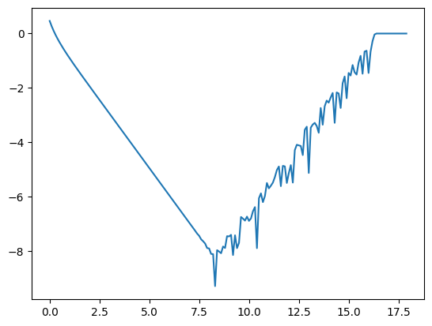

\newcommand{\ds}{\displaystyle}
\newcommand{\on}{\operatorname}
\newcommand{\R}{\mathbb{R}}
\newcommand{\inner}[1]{\langle {#1} \rangle}

## Math 342 - Spring 2024

<center>
Jump to: [Syllabus](index.html), [Week 1](#week-1-notes), [Week 2](#week-2-notes), [Week 3](#week-3-notes), [Week 4](#week-4-notes), [Week 5](#week-5-notes), [Week 6](#week-6-notes), [Week 7](#week-7-notes), [Week 8](#week-8-notes), [Week 9](#week-9-notes), [Week 10](#week-10-notes), [Week 11](#week-11-notes), [Week 12](#week-12-notes), [Week 13](#week-13-notes), [Week 14](#week-14-notes)
</center>

### Week 1 Notes

Day  | Section  | Topic
:---:|:---:|:---------
Wed, Jan 17 | [1.2][1.2] | Floating point arithmetic
Fri, Jan 19 | [1.2][1.2] | Significant digits, relative error

### Wed, Jan 17

We talked about how computers store [floating point numbers](https://en.wikipedia.org/wiki/Floating_point).  Most modern programming languages store floating point numbers using the [IEEE 754 standard](https://en.wikipedia.org/wiki/IEEE_754). 

{ style="width: 700px" }
{style="width: 700px"}

In the IEEE 754 standard, a 64-bit floating point number has the form 
$$x = (-1)^s * (1.a_1 a_2 \ldots a_{52})_2 * 2^{e - 1023}$$
where 

* $s$ is the 1-bit sign,
* $a_1 a_2 \ldots a_{52}$ is the 52-bit mantissa, and
* $e$ is the 11-bit exponent which ranges from 0 to 2047. Only 1 to 2046 are used for regular floating point numbers, $e=0$ is reserved for zero and [subnormal numbers](https://en.wikipedia.org/wiki/Subnormal_number), and $e=2047$ is reserved for infinity and NaN ("not a number"). 

To understand floating point numbers, we also reviewed [binary numbers](https://en.wikipedia.org/wiki/Binary_numeral_system), [scientific notation](https://en.wikipedia.org/wiki/Scientific_notation), and [logarithmic scales](https://en.wikipedia.org/wiki/Logarithmic_scale ).

We did the following exercises in class:

1. Convert (10110)<sub>2</sub> to decimal. (<https://youtu.be/a2FpnU9Mm3E>)

2. Convert 35 to binary. (<https://youtu.be/gGiEu7QTi68>)

3. What are the largest and smallest 64-bit floating point numbers that can be stored?  

4. In Python, compute `2.0**1024` and `2**1024`.  Why do you get different results?

5. In Python, compare `2.0**1024` with `2.0**(-1024)` and `2.0**(-1070)`. What do you notice? 

<!--
6. What number has mantissa (1011)<sub>2</sub> and exponent (110)<sub>2</sub>? 
-->

### Fri, Jan 19

Today we talked about significant digits.  Here is a [quick video on how these work](https://youtu.be/l2yuDvwYq5g). Then we defined absolute and relative error:

<div class="Theorem">
Let $x^*$ be an approximation of $x \in \R$.  <!-- ^* -->

* The **absolute error** is $|x^* - x|$. 
* The **relative error** is $\dfrac{|x^*-x|}{|x|}$. 
</div>

The base-10 logarithm of the relative error is approximately the number of significant digits, so you can think of significant digits as a measure of relative error.  Keep in mind these rules:

1. When you add/subtract numbers, the last common digit that is significant for both numbers is the last significant digit of the answer. 
2. When you multiply/divide two numbers, the result has significant digits equal to the minimum number of significant digits of the two inputs. 

Intuitively, addition & subtraction "play nice" with absolute error while multiplication and division "play nice" with relative error.  This can lead to problems:

1. **Catastrophic cancellation.** When you subtract two numbers of roughly the same size, the relative error can get much worse.  For example, both 53.76 and 53.74 have 4 significant digits, but 
$$53.76 - 53.74 = 0.02$$ 
only has 1 significant digit.  

2. **Useless precision.** If you add two numbers with very different magnitudes, then having a very low relative error in the smaller one will not be useful.  

We finished by looking at how you can sometimes re-write algorithms on a computer to avoid overflow/underflow issues.  Stirling's formula is an approximation for $n!$ which has a relative error that gets smaller as $n$ increases.  

We used the `math` library in Python to test **Stirling's formula**, which is the following approximation 
$$n! \approx \sqrt{2 \pi n} \frac{n^n}{e^n}.$$

```python
import math
n = 100
print(float(math.factorial(n)))
f = lambda n: math.sqrt(2*math.pi*n)*n**n/math.exp(n)
print(f(n))
```

Our formula worked well until $n=143$, then we got an overflow error.  The problem was that $n^n$ got too big to convert to a floating point number.  But you can prevent the overflow error by adjusting the formula slightly to. 

```python
n = 143
f = lambda n: math.sqrt(2*math.pi*n)*(n/math.exp(1))**n
print(f(n))
```

- - -

### Week 2 Notes
 
Day  | Section  | Topic
:---:|:---:|:---------
Mon, Jan 22 |            | Taylor's theorem
Wed, Jan 24 |            | Taylor's theorem - con'd
Fri, Jan 26 |            | The Babylonian algorithm

### Mon, Jan 22

Today we reviewed Taylor series.  We recalled the following important Maclaurin series (which are Taylor series with center $c = 0$):

* $\ds e^x = \sum_{n=0}^\infty \dfrac{x^n}{n!}$
* $\ds \sin(x) = \sum_{n=0}^\infty \dfrac{(-1)^n \, x^{2n+1}}{(2n+1)!}$
* $\ds \cos(x) = \sum_{n=0}^\infty \dfrac{(-1)^n \, x^{2n}}{(2n)!}$
* $\ds \dfrac{1}{1-x} = \sum_{n = 0}^\infty x^n$
* $\ds \ln(1+x) = \sum_{n = 0}^\infty \dfrac{(-1)^n \, x^{n+1}}{n+1}$

The we did the following workshop in class. 

* Workshop: [Taylor series](Workshops/TaylorSeries.pdf)

### Wed, Jan 24

Today we reviewed some theorems that we will need throughout the course.  The first is probably the most important theorem in numerical analysis since it lets us estimate error when using Taylor series approximations.  

<div class="Theorem">
**Taylor's Theorem.** Let $f$ be a function that has $(n+1)$ derivatives in the interval between $x$ and $c$.  Then there exists a $z$ strictly inside the interval from $x$ to $c$ such that 
$$f(x) - P_n(x) = \frac{f^{(n+1)}(z)}{(n+1)!} (x-c)^{n+1}$$
where $P_n$ is the $n$th degree Taylor polynomial for $f$ centered at $c$. 
</div>

A special case of Taylor's theorem is when $n = 0$. Then you get the Mean Value Theorem (MVT):

<div class="Theorem">
**Mean Value Theorem.** Let $f$ be a function that is differentiable in the interval between $a$ and $b$.  Then there exists a $c$ strictly inside the interval from $a$ to $b$ such that 
$$f'(c) = \frac{f(b) - f(a)}{b-a}.$$
</div>

The proof of both the Mean Value Theorem and Taylor's Theorem comes from looking at an even simpler theorem called Rolle's theorem. 

<div class="Theorem">
**Rolle's Theorem.** Let $f$ be a function that is differentiable in the interval between $a$ and $b$ and suppose that $f(a) = f(b)$.  Then there exists a $c$ strictly inside the interval from $a$ to $b$ such that $f'(c) = 0.$
</div>

<center>
</img>
</center>

We briefly sketched an intuitive proof of Rolle's theorem using the [Extreme Value Theorem](https://en.wikipedia.org/wiki/Extreme_value_theorem) from calculus, but the details of that proof are not really that important.  

We did the following exercises in class. 

1. Use Taylor's theorem to estimate the error in using the 20th degree Maclaurin series to estimate $\sin(4\pi)$. 

2. Use Taylor's theorem to estimate the error in using the 20th degree Maclaurin series to estimate $e^6$.  

We finished with a proof that the number $e$ is irrational. First we temporarily assumed that $e$ is a reduced fraction $\tfrac{m}{n}$.  Then we calculated the worst remainder for the $n$th degree Maclaurin polynomial for $e^x$ at $x = 1$. We did the following exercises that lead to a contradiction:

3. Show that $n!(e - P_n(1))$ must be an integer. 

4. Use Taylor's theorem to show that $n! R_n(1)$ must be strictly between 0 and 1. 


### Fri, Jan 26

Today we did a workshop about the Babylonian algorithm which is an ancient method for finding square roots.  

* **Workshop**: [The Babylonian algorithm](Workshops/Babylonian.pdf) 

As part of this workshop we also covered how to define variables and functions in Python and also how to use for-loops and while-loops.  

- - -

### Week 3 Notes
 
Day  | Section  | Topic
:---:|:---:|:---------
Mon, Jan 29 | [2.1][2.1] | Bisection method
Wed, Jan 31 | [2.3][2.3] | Newton's method
Fri, Feb 2 | [2.4][2.4] | Rates of convergence

### Mon, Jan 29

We talked about how to find the roots of a function.  Recall that a **root** (AKA a **zero**) of a function $f(x)$ is an $x$-value where the function hits the $x$-axis.  We introduced an algorithm called the **Bisection method** for finding roots of a continuous function. We did the following workshop.

* **Workshop**: [Bisection method](Workshops/Bisection.pdf)

One feature of the Bisection method is that we can easily find the worst case absolute error in our approximation of a root. That is because every time we repeat the algorithm and cut the interval in half, the error reduces by a factor of 2, so that
$$\text{Absolute error} \le \frac{(b-a)}{2^n}.$$
We saw that it takes about 10 iterations to increase the accuracy by 3 decimal places (because $2^{10} \approx 10^3$). 

We finished by comparing the bisection method for finding roots with the Babylonian algorithm for finding square roots.  Why are square roots called roots?  Because every square root is a root of a square function.  For example, $\sqrt{5}$ is a root of $x^2 - 5 = 0$. 

### Wed, Jan 31

Today we covered Newton's method.  This is probably the most important method for finding roots of differentiable functions.  The formula is 
$$ x_{n+1} = x_n - \dfrac{f(x_n)}{f'(x_n)}.$$
This formula comes from the idea which is to start with a guess $x_0$ for a root and then repeatedly improve your guess by following the tangent line at $x_n$ until it hits the $x$-axis.  

1. Use Newton's method to find roots of $\tan x - 1$. 

2. How can you use Newton's method to find $e$? Hint: use $f(x) = \ln x -1$.  

<div class="Theorem">
**Theorem.** Let $f \in C^2[a,b]$ and suppose that $f$ has a root $r \in (a,b)$. Suppose that there are constants $L,M >0$ such that $|f'(x)| \ge L$ and $|f''(x)| \le M$ for all $x \in [a,b]$. Then 
$$|x_{n+1} - r| \le \frac{M}{2L} |x_n-r|^2$$
when $x_n \in [a,b]$.
</div>

*Proof.* Start with the first degree Taylor polynomial (centered at $x_n$) for $f(r)$ including the remainder term and the Newton's method iteration formula:

$$f(r) = f(x_n) + f'(x_n)(r-x_n) + \frac{1}{2} f''(z)(r-x_n)^2 = 0,$$
and
$$x_{n+1} = x_n - \frac{f(x_n)}{f'(x_n)} \Rightarrow f'(x_n)(x_{n+1} - x_n) + f(x_n)=0.$$

Subtract these two formulas to get a formula that relates $(r-x_{n+1})$ with $(r-x_n)$.

$$f'(x_n)(r-x_{n+1}) + \frac{1}{2} f''(z)(r-x_n)^2 = 0.$$

Use this to get an upper bound on $|r-x_{n+1}|$. □


<div class="Theorem">
**Corollary.** The error in the $n$-th iterate of Newton's method satisfies
$$|x_n-r| \le \left(\frac{M}{2L}\right)^{2^n-1} |x_0 - r|^{2^n}.$$
</div>

This corollary explains why, if you start with a good guess in Newton's method, the number of correct decimal places tends to double with each iteration!

### Fri, Feb 2

Today we looked at some examples of what can go wrong with Newton's method. We did these examples:

1. What happens if you use Newton's method with $x_0 = 0$ on $f(x) = x^3 - 2x + 2$?

2. Why doesn't Newton's method work for $f(x) = x^{1/3}$?

We also did this workshop.

* **Workshop:** [Newton's method](Workshops/NewtonsMethod.pdf)


- - -

### Week 4 Notes
 
Day  | Section  | Topic
:---:|:---:|:---------
Mon, Feb 5 | [2.5][2.5] | Secant method
Wed, Feb 7 | [2.2][2.2] | Fixed point iteration
Fri, Feb 9 | [2.4][2.4] | More about rates of convergence


### Mon, Feb 5

We talked about the secant method which is a variation of Newton's method that uses secant lines instead of tangent lines.  The advantage of the secant method is that it doesn't require calculating a derivative.  The disadvantage is that it is a little slower to converge than Newton's method, but it is still much faster than the bisection method.  Here is the formula:

$$x_{n+1} = x_n - \frac{f(x_n) \, (x_n - x_{n-1})}{f(x_n) - f(x_{n-1})}.$$

We wrote the following program in class. 

```python
def Secant(f, a, b, precision = 10**(-8)):
    while abs(b-a) > precision:
        a, b = b, b - f(b)*(b-a)/(f(b)-f(a))
    return b
```

Sometimes a function $f$ might be very time consuming for a computer to compute, so you could improve this function by reducing the number of times you have to call $f$. If speed is a concern, then this would be a better version of the function. 

```python
def Secant(f, a, b, precision = 10**(-8)):
    fa = f(a)
    fb = f(b)
    while abs(b-a) > precision:
        a, b = b, b - fb*(b-a)/(fb-fa) # update x-values
        fa, fb = fb, f(b) # update y-values using the new x-value
    return b
```

Notice how we call the function $f$ three times in each iteration of the while-loop in the first program, but by storing the result in the variables `fa` and `fb`, we only have to call $f$ once per iteration in the second version of the program.  

1. Solve the equation $2^x = 10$ using the secant method.  What would make good initial guesses $x_0$ and $x_1$? 

We finished by talking about the convergence rate of the secant method. 

<div class="Theorem">
**Theorem.** Let $f \in C^2[a,b]$ and suppose that $f$ has a root $r \in (a,b)$. There is a constant $C > 0$ such that for $x_n$, $x_{n-1}$ sufficiently close to $r$ (say $|x_0 - r| < 1/C$ and $|x_1 - r| < 1/C$), the next iterate of the secant method has
$$|x_{n+1} - r| \le C |x_n-r| \, |x_{n-1} - r|.$$
In particular, $|x_n - r|$ will converge to $r$. 
</div>

Note, the constant $C$ might be larger than the constant $\dfrac{M}{2L}$ from Newton's method, but it is usually not much larger.<!-- when $x_n$ and $x_{n-1}$ are not close to $r$, but sufficiently close to $r$ it does converge to $\dfrac{f''r)}{2f'(r)}$. -->

2. Use this formula to estimate $|x_3-r|$ in terms of $|x_1-r|$ and $|x_0 - r|$. Assume that the same constant $C$ applies for all $x_{n+1}$. 
3. Do the same for $|x_4 - r|$. 
4. Keep going until you find a pattern. 

We saw that the pattern is that the exponents of each factor is a Fibonacci number.  We talked briefly about [Binet's formula](https://en.wikipedia.org/wiki/Fibonacci_sequence#Relation_to_the_golden_ratio) for Fibonacci numbers and the golden ratio $\varphi = \frac{1 + \sqrt{5}}{2} \approx 1.618$. The lead to the following nice rule of thumb: The number of correct decimal places in the secant method increases by a factor of about 1.6 (the golden ratio) every step. 

### Wed, Feb 7

Newton's method is a special case of a method known as fixed point iteration.  A \textbf{fixed point} of a function $f(x)$ is a number $p$ such that $f(p) = p$.  Not every function has a fixed point, but we do have the following existence result:

<div class="Theorem">
**Theorem.** Let $f \in C^0[a,b]$.  If $f(x) \in [a,b]$ for every $x \in [a,b]$, then $f$ must have a fixed point in $[a,b]$.  
</div>

1. Show that $\cos x$ has a fixed point in $[0,\tfrac{\pi}{2}]$. 

2. Explain why $f(x) = e^x$ has no fixed points. 

A fixed point $p$ is **attracting** if for all $x_0$ sufficiently close to $p$, the recursive sequence defined by 
$$x_{n+1} = f(x_n)$$
converges to $p$. It is **repelling** if no (sub)sequence of $x_n$ ever converges to $p$. You can draw a picture of these fixed point iterates by drawing a [cobweb diagram](https://en.wikipedia.org/wiki/Cobweb_plot). 

<center>
</img>
</center>

3. Show that the fixed point of $\cos x$ is attracting by repeatedly iterating. 

4. Show that $g(x) = 1 - 2x -x^5$ has a fixed point, but it is not attracting. 

<div class="Theorem">
**Theorem** If $f$ has a fixed point $p$ and 

1. $|f'(p)| < 1$, then $p$ is attracting, 
2. $|f'(p)| > 1$, then $p$ is repelling,
3. $|f'(p)| = 1$, then no info. 
</div>

You can sometimes use fixed point iteration to solve equations.  For example, here are two different ways to solve the equation $x^3 + 3x + 6 = 0$ using fixed point iteration. 

1. Re-write the equation as $\dfrac{-6}{x^2+3} = x$.

2. Replace $f(x) = 0$ with the equation $x + cf(x) = x$ where $c$ is a small constant. The constant $c = -\tfrac{1}{10}$ works well for the function above. 

When a sequence $x_n$ converges to a root $r$, we say that it has **a linear order of convergence** if there is a constant $0 < C < 1$ such that 
$$|x_{n+1} - r| \le C |x_n - r| \text{ for all } n.$$
We say that the sequence has a **quadratic order of convergence** if there is a constant $C > 0$ such that 
$$|x_{n+1} - r| \le C |x_n - r|^2 \text{ for all } n.$$
More generally, a sequence **converges with order $\alpha$** if there is are constants $C > 0$ and $\alpha > 1$ such that 
$$|x_{n+1} - r| \le C |x_n - r|^\alpha \text{ for all } n.$$

In general, a sequence that converges with order $\alpha > 1$ will have the number of correct decimal places grow by a factor of about $\alpha$ each step.  Newton's method is order 2, Secant method is order $\varphi \approx 1.618$, and the Bisection method is only linear order. 

<div class="Theorem">
**Theorem.** If $f$ is differentiable at a fixed point $p$ and $0 < |f'(p)| < 1$, then for any point $x_0$ sufficiently close to $p$, the fixed point iterates $x_n$ defined by $x_{n+1} = f(x_n)$ converge to $p$ with linear order.  If $f'(p) = 0$, then the iterates converge to $p$ with order $\alpha$ where $f^{(\alpha)}(p)$ is the first nonzero derivative of $f$ at $p$. 
</div>

### Fri, Feb 9

We started with this question:

1. Why is Newton's method a special case of fixed point iteration?  When we apply Newton's method to find a root of $f(x)$, what function $N(x)$ are we iterating?  What is the derivative of $N$ at the root $r$? 

Then we did this workshop in class. 

* **Workshop:** [Fixed point iteration](Workshops/FixedPoints.pdf)

In one step of the workshop, we used the **triangle inequality** which says that for any two numbers $a$ and $b$, 
$$|a+b| \le |a| + |b|.$$

<!--
We've already seen that Newton's method has quadratic order of convergence.  Newton's method is the first in a family of root finding techniques called **Householder methods.** If $f \in C^{k+1}[a,b]$ has a root $r \in (a,b)$, then for $x_0$ close to $r$, we define a sequence
$$x_{n+1} = x_n + k \dfrac{(1/f)^{(k-1)} (x_n)}{(1/f)^{(k)} (x_n)}$$
When $x_0$ is close enough to $r$, the Householder iterates $x_n$ converge to $r$ with order $k+1$.

2. Show that Householder iteration with $k = 1$ is Newton's method.  

We finished with a cool fact about Newton's method.  It also works for to find complex number roots if you use complex numbers.  We talked about the polynomial $x^3 - 1 = (x-1)(x^2+x+1)$ which has three roots: $x = 1$ and $x = \dfrac{-1 \pm i \sqrt{3}}{2}$. We talked about which complex numbers end up converging to which root as you iterate Newton's method.  You get a beautiful fractal pattern:

<center>
<figure>
</img>
<figcaption>Basins of attraction for the roots of $x^3-1$.</figcaption>
</figure>
</center>
-->


- - -

### Week 5 Notes
 
Day  | Section  | Topic
:---:|:---:|:---------
Mon, Feb 12 | | Systems of linear equations
Wed, Feb 14 | | LU decomposition
Fri, Feb 16 | | Matrix norms

### Mon, Feb 12

Today we talked about systems of linear equations and linear algebra. Before we got to that, we looked at one more cool thing about Newton's method.  It also works for to find complex number roots if you use complex numbers.  We talked about the polynomial $x^3 - 1 = (x-1)(x^2+x+1)$ which has three roots: $x = 1$ and $x = \dfrac{-1 \pm i \sqrt{3}}{2}$. We talked about which complex numbers end up converging to which root as you iterate Newton's method.  You get a beautiful fractal pattern:

<center>
<figure>
</img>
<figcaption>Basins of attraction for the roots of $x^3-1$.</figcaption>
</figure>
</center>

After that we started a review of row reduction from linear algebra.

1. Suppose you have a jar full of pennies, nickles, dimes, and quarters.  There are 80 coins in the jar, and the total value of the coins is $10.00.  If there are twice as many dimes as quarters, then how many of each type of coin are in the jar?  

We can represent this question as a system of linear equations. 
$$p+n+d+q = 80$$
$$p+5n+10d+25q = 1000$$
$$d = 2q$$
where $p,n,d,q$ are the numbers of pennies, nickles, dimes, and quarters respectively. It is convenient to use matrices to simplify these equations:
$$\begin{pmatrix} 1 & 1 & 1 & 1  \\ 1 & 5 & 10 & 25  \\ 0 & 0 & 1 & -2 \end{pmatrix} \, \begin{pmatrix} p \\ n \\ d \\ q \end{pmatrix} = \begin{pmatrix} 80 \\ 1000 \\ 0 \end{pmatrix}.$$
Here we have a matrix equation of the form $Ax = b$ where $A \in \R^{3 \times 4}$, $x \in \R^4$ is the unknown vector, and $b \in \R^3$. Then you can solve the problem by row-reducing the augmented matrix

$$\left( \begin{array}{cccc|c} 1 & 1 & 1 & 1 & 80 \\ 1 & 5 & 10 & 25 & 1000 \\ 0 & 0 & 1 & -2 & 0\end{array}\right)$$

which can be put into **echelon form**

$$\left( \begin{array}{cccc|c} 1 & 1 & 1 & 1 & 80 \\ 0 & 4 & 9 & 24 & 920 \\ 0 & 0 & 1 & -2 & 0\end{array}\right)$$

Then the variables $p, n$, and $d$ are **pivot variables**, and the last variable $q$ is a **free variable**. Each pivot variable depends on the value(s) of the free variables.  A solution of a system of equations is a formula for the pivot variables as functions of the free variables.   

Recall the following terminology from linear algebra. For any matrix $A \in \R^{m \times n}$ (i.e., that has real number entries with $m$ rows and $n$ columns):

* The **rank** of $A$ is the number of pivots.  It is also the dimension of the column space since the columns of $A$ with pivots are linearly independent and form a basis for the column space. 

* The **null space** of $A$ is the set $\{x \in \R^n \, : \, Ax = 0\}$.

* The **nullity** of $A$ is the number of free variables which is the same as the dimension of the null space of $A$. 

<!--Recall that the number of pivots in a matrix is called the **rank** of the matrix, and does not change when you row reduce. The rank is also the dimension of the **column space** $\on{Col}(A)$ which is the span of the columns of $A$.  The number of free variables of a matrix $A \in \R^{m \times n}$ is the dimension of the **null space** $\on{Null} (A) = \{x \in \R^n : Ax = 0 \}$. The dimension of the null space is sometimes called the **nullity** of the matrix.  Since every column of a matrix contains a pivot or corresponds to a free variable, we have the following important (but simple) theorem.-->


<div class="Theorem"> 
**Rank + Nullity Theorem.** Let $A \in \R^{m \times n}$.  Then the rank of $A$ plus the nullity of $A$ must equal $n$. 
</div>

A matrix equation $Ax = b$ has a solution if and only if $b$ is in the column space of $A$.  If $b$ is in the column space, then there will be either one unique solution if there are no free variables (i.e., the nullity of $A$ is zero) or there will be infinitely many solutions if there are free variables. 

If $A \in \R^{n \times n}$ (i.e., $A$ is a square matrix) and the rank of $A$ is $n$, then $A$ is **invertible** which means that there is a matrix $A^{-1}$ such that $A A^{-1} = A^{-1} A = I$ where $I$ is the **identity matrix**
$$I = \begin{pmatrix} 1 & 0 & \ldots & 0 \\ 0 & 1 & \ldots & 0 \\ \vdots & \vdots & \ddots & \vdots \\ 0 & 0 & \ldots & 1 \end{pmatrix}.$$  
You can use row-reduction to find the inverse of an invertible matrix by row reducing the augmented matrix $\left( \begin{array}{c|c} A & I \end{array} \right)$ until you get $\left( \begin{array}{c|c} I & A^{-1} \end{array} \right)$. 

2. Use row-reduction to find the inverse of $A = \begin{pmatrix} 1 & 3 \\ 2 & 5 \end{pmatrix}$. (<https://youtu.be/cJg2AuSFdjw>)

3. Use the inverse to solve $\begin{pmatrix} 1 & 3 \\ 2 & 5 \end{pmatrix} x = \begin{pmatrix} 2 \\ 1 \end{pmatrix}$. 

In practice, inverse matrices are rarely used to solve systems of linear equations for a couple of reasons. 

1. Most matrices aren't invertible.
2. Finding the inverse is at least as hard computationally as row reduction, so you might as well just use row reduction.  

### Wed, Feb 14

Today we talked about LU decomposition.  We defined the LU decomposition as follows.  The **LU decomposition** of a matrix $A \in \R^{m \times n}$ is a pair of matrices $L \in \R^{m \times m}$ and $U \in \R^{m \times n}$ such that $A = LU$ and $U$ is in echelon form and $L$ is a lower triangular matrix with 1's on the main diagonal, 0's above the main diagonal, and entries $L_{ij}$ in row $i$, column $j$ that are equal to the multiple of row $i$ that you *subtracted* from row $j$ as you row reduced $A$ to $U$. 

1. Compute the LU decomposition of $A = \begin{pmatrix} 1 & 1 & 1 & 1 \\ 2 & 2 & 5 & 3 \\ -1 & -1 & 14 & 4 \end{pmatrix}$. 

2. Use the LU decomposition to solve $Ax = \begin{pmatrix} 2 \\ 6 \\ 8 \end{pmatrix}$. 

We also did this workshop. 

* **Workshop:** [LU decomposition](Workshops/LUdecomposition.pdf)

We finished with one more example. 

3. For what real numbers $a$ and $b$ does the matrix $\begin{pmatrix} 1 & 0 & 1 \\ a & a & a \\ b & b & a \end{pmatrix}$ have an LU decomposition? (<https://youtu.be/-eA2D_rIcNA>)

### Fri, Feb 16


Today we talked about what it means for a linear system to be **ill-conditioned**.  This is when a small change in the vector $b$ can produce a large change in the solution vector $x$ for a linear system $Ax=b$.  

Consider the following matrix:

$$A = \begin{pmatrix} 1 & 1 \\ 1 & 1.001 \end{pmatrix}$$

Let $y = \begin{pmatrix} 2 \\ 2 \end{pmatrix}$ and $z =  \begin{pmatrix} 2 \\ 2.001 \end{pmatrix}$.

1. Solve $Ax = y$ and $Ax = z$. Hint: $A^{-1} = \begin{pmatrix} 1001 & -1000 \\ -1000 & 1000 \end{pmatrix}$. Notice that even though $y$ and $z$ are very close, the two solutions are not close at all.  A matrix $A$ with the property that solutions of $Ax = b$ are very sensitive to small changes in $b$ is called **ill-conditioned**.

Consider the matrix $B = \begin{pmatrix} 0.001 & 1 \\ 1 & 1 \end{pmatrix}$ which has $LU$ decomposition 
$$B = LU = \begin{pmatrix} 1 & 0 \\ 1000 & 1 \end{pmatrix} \,  \begin{pmatrix} 0.001 & 1 \\ 0 & -999 \end{pmatrix}.$$  
Although $B$ is not ill-conditioned, you have to be careful using row reduction to solve equations with this matrix because both $L$ and $U$ in the LU-decomposition for $B$ are ill-conditioned.

2. Use the LU-decomposition to solve $Bx = \begin{pmatrix} 1 \\ 2 \end{pmatrix}.$

<!--To solve the system, 

1. First, solve $Ly = \begin{pmatrix} 1 \\ 2 \end{pmatrix}$ to get $y = \begin{pmatrix} 1 \\ -998 \end{pmatrix}$. 

2. Then, solve $Ux = y$.  You should get $x = \begin{pmatrix} 1.001001 \\ 0.998999 \end{pmatrix}$ by solving the system 
$$0.001x_1 + x_2 = 1,$$
$$-999 x_2 = -998.$$
If you solve this system, it is easy to make a rounding mistake and get $x_2 = 1$ instead of $\frac{998}{999}$. If that happens, then you'll get $x_1 = 0$ instead of its actual value.-->

3. The inverse of the matrix $L$ in the LU decomposition above is 
$$L^{-1} = \begin{pmatrix} 1 & 0 \\ -1000 & 1 \end{pmatrix}.$$
Show that $L$ is ill-conditioned by finding a vector $y'$ close the $y = \begin{pmatrix} 1 \\ 2\end{pmatrix}$, but such that the corresponding solutions $x$ and $x'$ to the matrix equations $Lx = y$ and $Lx' = y'$ are not close. 


<!--
3. When you row-reduce $\ds \left( \begin{array}{cc|c} 0.001 & 1 & 1 \\ 1 & 1 & 2 \end{array} \right)$ without swapping rows, you get $\ds \left( \begin{array}{cc|c} 0.001 & 1 & 1 \\ 0 & -999 & -998 \end{array} \right)$.  Let $R = \begin{pmatrix} 0.001 & 1 \\ 0 & -999 \end{pmatrix}$. Show that $R$ is ill-conditioned by comparing the solutions of these two systems: 
$$Rx = \begin{pmatrix} 1 \\ 1 \end{pmatrix} \text{ and } Rx = \begin{pmatrix} 1.1 \\ 1 \end{pmatrix}.$$

This can be a problem if there is any rounding error in the extra column after row reduction.  
-->

<!--It is possible to avoid this problem using the **method of partial pivoting**.  The idea is simple: when more than one entry could be the pivot for a column, always choose the one with the largest absolute value.  

In the example above, since both entries in the first column of $B = \begin{pmatrix} 0.001 & 1 \\ 1 & 1 \end{pmatrix}$ are positive, either could be the pivot.  To use **partial pivoting**, swap rows so that the pivot is the entry in column one with the larger absolute value, and the do the usual row reduction.  

4. Show that when you row reduce $\begin{pmatrix} 1 & 1 \\ 0.001 & 1 \end{pmatrix}$ to echelon form using partial pivoting, the resulting matrix is not ill-posed.  <span style="background-color:yellow">Hmmm... this is tricky because you haven't introduced the condition number yet...</span>
-->

### Norms of Vectors

A **norm** is a function $\|\cdot\|$ from a vector space $V$ to $[0,\infty)$ with the following properties:

1. $\|x\| = 0$ if and only if $x=0$.
2. $\|c x \| = |c| \|x\|$ for all $x \in V$ and $c \in \R$.  
3. $\|x+y\| \le \|x\| + \|y\|$ for all $x, y \in V$.  

Intuitively a norm measures the length of a vector.  But there are different norms and they measure length in different ways.  The three most important norms on the vector space $\R^n$ are:

1. **The $2$-norm** (also known as the **Euclidean norm**) is the most commonly used, and it is exactly the formula for the length of a vector using the Pythagorean theorem. 
$$\|x\|_2 = \sqrt{x_1^2 + x_2^2 + \ldots + x_n^2}.$$

2. **The $1$-norm** (also known as the **Manhattan norm**) is
$$\|x\|_1 = |x_1|+|x_2|+\ldots+|x_n|.$$
This is the distance you would get if you had to navigate a city where the streets are arranged in a rectangular grid and you can't take diagonal paths.  

3. **The $\infty$-norm** (also known as the **Maximum norm**) is 
$$\|x\|_\infty = \max \{ |x_1|, |x_2|, \ldots, |x_n| \}.$$

These are all special cases of **$p$-norms** which have the form
$$\|x\|_p = \sqrt[p]{|x_1|^p + |x_2|^p + \ldots + |x_n|^p}.$$

We used Desmos to graph the set of vectors in $\R^2$ with $p$-norm equal to one, then we could see how those norms change as $p$ varies between 1 and $\infty$. 

<center>
<iframe src="https://www.desmos.com/calculator/ridobsezmp?embed" width="500" height="500" style="border: 1px solid #ccc" frameborder=0></iframe>
</center>

### Norms of Matrices

The set of all matrices in $\R^{m \times n}$ is a vector space. So it makes sense to talk about the norm of a matrix.  There are many ways to define norms for matrices, but the most important for us are **operator norms** (also known as **induced norms**).  For a matrix $A \in \R^{m \times n}$, the **induced $p$-norm** is 
$$\|A\|_p = \max \{\|Ax\|_p : x \in \R^n, \|x\|=1\}.$$  
Two important special cases are 

1. When $p=2$, the induced norm $\|A\|_2$ is the square root of the largest eigenvalue of $A^T A$.  
2. When $p=\infty$, the induced norm $\|A\|_\infty$ is the largest 1-norm of the rows of $A$.

### Condition Number

For an invertible matrix $A \in \R^{n \times n}$, the **condition number** of $A$ is $\kappa(A) = \|A\| \, \|A^{-1}\|$ (using any induced norm).  


**Rule of thumb.** If the entries of $A$ and $b$ are both accurate to $n$-significant digits and the condition number of $A$ is $\kappa(A) = 10^k$, then the solution of the linear system $Ax = b$ will be accurate to $n-k$ significant digits. 


- - -

### Week 6 Notes
 
Day  | Section  | Topic
:---:|:---:|:---------
Mon, Feb 19 | | Condition numbers
Wed, Feb 21 | | Review
Fri, Feb 23 | | **Midterm 1** 

### Mon, Feb 19

<div class="Theorem">
**Theorem.** If $A \in \R^{n \times n}$ is invertible, then the relative error in the solution of the system $A x = b$ is bounded by
$$\frac{\|x-x'\|}{\|x\|} \le \kappa(A) \frac{\|b-b'\|}{\|b\|}.$$
</div>

*Proof.* Using the properties of the induced norm, 
$$\|b\| = \|A x \| \le \|A\| \, \|x\| \text{ and } \|x-x'\| = \|A^{-1}(b-b')\| \le \|A^{-1}\| \, \|b-b'\|,$$
so putting both together gives 
$$\|b\| \|x-x'\| \le \|A\| \, \|A^{-1}\| \, \|x\| \, \|b-b'\|.$$  
This leads directly to the inequality above when you separate the factors with $x$ from those with $b$. □

This explains why the number of significant digits in the solution to $A x = b$ may have up to $k$ fewer significant digits than the entries of $A$ and $b$ when the condition number $\kappa(A) = 10^k$. 

1. Let $A = \begin{pmatrix} 1.000 & 1.001 \\ 1.000 & 1.000 \end{pmatrix}$ and $b = \begin{pmatrix} 2.000 \\ 2.001 \end{pmatrix}$.  How many significant digits does the solution to $Ax = b$ have? 

Last time we saw an example of a matrix $B = \begin{pmatrix} 0.001 & 1 \\ 1 & 1 \end{pmatrix}$ which is not ill-conditioned by itself.  However, both $L$ and $U$ in its LU-decomposition were ill-conditioned. It is possible to avoid this problem using the **method of partial pivoting**.  The idea is simple: when more than one entry could be the pivot for a column, always choose the one with the largest absolute value.  

You keep track of the row swaps as you use the method of partial pivoting, always apply the same row swaps to a copy of the identity matrix. At the end, you will have a **permutation matrix** $P$ and the **LU-decomposition with partial pivoting** is
$$PA = LU.$$
The fixes two problems:

* When there are zero entries where pivots should be, you can't do a regular LU-decomposition.
* When you do an LU-decomposition, the matrices L and U might be ill-conditioned, even if $A$ isn't. The method of partial pivots avoids that problem. 

One nice thing to know about permutation matrices is that they are always invertible and $P^{-1} = P^T$ where $P^T$ is the **transpose** of $P$ obtained by converting every row of $P$ to a column of $P^T$.  

Find the LU-decomposition with partial pivoting for these matrices

2. $A = \begin{pmatrix} 0 & 1 & 2 \\ 1 & 1 & 1 \end{pmatrix}$

3. $A = \begin{pmatrix} 1 & 2 & 3 \\ 4 & 5 & 6 \\ 7 & 8 & 9 \end{pmatrix}$ <!--$B= \begin{pmatrix} -2 & 8 & 2 \\ 2 & 1 & 4 \\ 4 & 2 & 0 \end{pmatrix}$-->

<!--
Didn't have time for this one:
4. Show that when you row reduce $\begin{pmatrix} 0.001 & 1 \\ 1 & 1 \end{pmatrix}$ to echelon form using partial pivoting, the resulting LU matrices are not ill-posed.  
-->

### Wed, Feb 21

Today we reviewed for the midterm exam. We reviewed the things you need to memorize. We also talked about the following problems. 

1. Find the LU decomposition of $\begin{pmatrix} 1 & 0 & 3 \\ 4 & 2 & 9 \\ & -2 & -6 & 0 \end{pmatrix}$.

2. Find and classify the fixed points of $f(x) = \dfrac{x^3}{8} + 1$. This was a little hard to solve, because it isn't easy to factor the polynomial $x^3 - 8x + 8$.  But it does have computable roots $2$ and $1 \pm \sqrt{5}$.  

3. How would you use secant method to find the one negative root of $x^3 - 8x + 8$?  What would make good choices for $x_0$ and $x_1$?  What is $x_2$ for those choices? 

4. If $a = 7.911 \times 10^{-17}$ and $b = 5.032 \times 10^{-15}$, then how many significant digits do the following have?
    a. $a - b$.
    b. $a/b$. 


- - -

### Week 7 Notes
 
Day  | Section  | Topic
:---:|:---:|:----------------
Mon, Feb 26 | [3.1][3.1] | Polynomial interpolation, Vandermonde matrices
Wed, Feb 28 | [3.1][3.1] | Polynomial bases, Lagrange & Newton polynomials
Fri, Mar 1 | [3.2][3.2] | Newton's divided differences

### Mon, Feb 26

Today we started talking about **polynomial interpolation**. An **interpolating polynomial** is a polynomial that passes through a set of points in the coordinate plane.  We started with an example using these four points: $(-1,-4)$, $(0,3)$, $(1,0)$, and $(5,8)$. 

<center>
<figure style="display:table">
<iframe src="https://www.desmos.com/calculator/jad4nrxwt1?embed" width="300" height="300" style="border: 1px solid #ccc" frameborder=0></iframe>
<figcaption style="text-align:left"><a href="https://www.desmos.com/calculator/jad4nrxwt1">Desmos link</a></figcaption>
</figure>
</center>

In order to find the interpolating polynomial, we introduced *[Vandermonde matrices](https://en.wikipedia.org/wiki/Vandermonde_matrix)*.
For any set of fixed $x$-values, $x_0, x_1, \ldots, x_n$, the **Vandermonde matrix** for those values is the matrix $V \in \R^{(n+1) \times (n+1)}$ such that the entry $V_{ij}$ in row $i$ and column $j$ is $x_i^j.$
In other words, $V$ looks like 
$$V = \begin{pmatrix} 1 &  x_0 & x_0^2 & \ldots & x_0^n \\ 1 & x_1 & x_1^2 & \ldots & x_1^n \\  1 & x_2 & x_2^2 & \ldots & x_2^n \\  \vdots & \vdots & \vdots & \ddots & \vdots \\ 1 & x_n & x_n^2 & \ldots & x_n^n 
\end{pmatrix}$$
Notice that when working with Vandermonde matrices, we always start counting the rows and columns with $i,j = 0$. 

Using the Vandermonde matrix $V$, we can find an $n$-th degree polynomial 
$$p(x) = a_0 + a_1 x + a_2 x^2 + \ldots + a_n x^n$$
that passes through the points $(x_0,y_0), (x_1,y_1), \ldots (x_n,y_n)$ by solving the system $Va = y$ where $a = (a_0, a_1, \ldots, a_n)$ is the vector of coefficients and $y = (y_0, y_1, \ldots y_n)$ is the vector with $y$-values corresponding to each $x_i$. That is, we want to solve the following system of linear equations:
$$\begin{pmatrix} 1 &  x_0 & x_0^2 & \ldots & x_0^n \\ 1 & x_1 & x_1^2 & \ldots & x_1^n \\  1 & x_2 & x_2^2 & \ldots & x_2^n \\  \vdots & \vdots & \vdots & \ddots & \vdots \\ 1 & x_n & x_n^2 & \ldots & x_n^n 
\end{pmatrix} \begin{pmatrix} a_0 \\ a_1 \\ \vdots \\ a_n \end{pmatrix} = \begin{pmatrix} y_0 \\ y_1 \\ \vdots \\ y_n \end{pmatrix}.$$


In Python with the Numpy library, you can enter a Vandermonde matrix using a list comprehension inside another list comprehension. For example, the Vandermonde matrix for $x$-values $-1, 0, 1, 5$ can be entered as follows. 

```python
import numpy as np
V = np.array([[x**k for k in range(4)] for x in [-1,0,1,5]])
```

Then the function `np.linalg.solve(V,y)` will solve the system $V a = y$. For example, after entering $V$, we would solve the first example as follows. 

```python
y = np.array([-4, 3, 0 8])
a = np.linalg.solve(V,y)
print(a) # prints [ 3.  1. -5.  1.]
```

Therefore the solution is 
$$p(x) = 3 + x - 5x^2 + x^3$$

After that example, we did the following examples in class. 

1. Find an interpolating polynomial for these points: $(0,0)$, $(1,4)$, $(-1,0)$, and $(2,15).$ 

2. Find a 4th degree polynomial that passes through $(0,1)$, $(1,5)$, $(2, 31)$, $(3, 121)$, $(4, 341).$

### Wed, Feb 28

Last time, when we talked about polynomial interpolation, we wrote our interpolating polynomials as linear combinations of the **standard monomial basis** $\{1, x, x^2, \ldots, x^n\}$ for the space of all $n$-th degree polynomials.  There are other bases we could choose.  Today we introduce two alternative bases: the Lagrange polynomials and the Newton polynomials.  Both require a set of $n+1$ distinct $x$-values called nodes, $x_0, \ldots, x_n$. For any given set of nodes, the **Lagrange polynomials** are
$$L_k(x) = \frac{\prod_{i = 0, i \ne k}^n (x - x_i)}{\prod_{i = 0, i \ne k}^n (x_k - x_i)}, k = 0, \ldots, n.$$
The defining feature of the Lagrange polynomials is that 
$$L_k(x_i) = \begin{cases} 1 & \text{ if } i = k \\ 0 & \text{ otherwise.} \end{cases}$$
From this we saw that the interpolating polynomial passing through $(x_0,y_0), (x_1, y_1), \ldots, (x_n, y_n)$ is
$$y_0 L_0(x) + y_1 L_1(x) + \ldots + y_n L_n(x).$$

1. Find the Lagrange polynomials for the nodes $x_0 = -1, x_1 = 0, x_2 = 1, x_3 = 5$.

2. Use those Lagrange polynomials to find the interpolating polynomial that passes through $(-1,-4), (0,3), (1,0), (5,8)$. 

3. Express the interpolating polynomial that passes through $(-1,-6), (1,0), (2,6)$ as a linear combination of Lagrange polynomials.

We finished by describing the **Newton polynomials** which are 

$$N_k(x) = \begin{cases} 1 & \text{ if } k = 0 \\ \prod_{i = 0}^{k-1} (x- x_i) & \text{ if } k = 1, \ldots, n. \end{cases}$$

You can express an interpolating polynomial as a linear combination of Newton polynomials by solving the linear system 

$$\begin{pmatrix} 
N_0(x_0) & N_1(x_0) & N_2(x_0) & \ldots & N_n(x_0) \\
N_0(x_1) & N_1(x_1) & N_2(x_1) & \ldots & N_n(x_1) \\
N_0(x_2) & N_1(x_2) & N_2(x_2) & \ldots & N_n(x_2) \\
\vdots & \vdots & \vdots & \ddots & \vdots \\ 
N_0(x_n) & N_1(x_n) & N_2(x_n) & \ldots & N_n(x_n) \\
\end{pmatrix} \begin{pmatrix} c_0 \\ c_1 \\ \vdots \\ c_n \end{pmatrix} = \begin{pmatrix} y_0 \\ y_1 \\ \vdots \\ y_n \end{pmatrix}$$
to find coefficients such that the interpolating polynomial 
$$c_0 N_0(x) + c_1 N_1(x) + \ldots + c_n N_n(x)$$
passes through each point $(x_i, y_i)$. 

4. Solve the linear system above to find the interpolating polynomial through $(-1,-4), (0,3), (1,0), (5,8)$ expressed in terms of the Newton basis.

### Fri, Mar 1

Today we talked about the [method of divided differences](https://en.wikipedia.org/wiki/Divided_differences), which lets us find the coefficients of an interpolating polynomial expressed using the Newton basis.  

For a function $f$ and a set of $n+1$ distinct $x$-values, $x_0, \ldots, x_n$, the **divided differences** are defined recursively by the following formula 

$$f[x_j, \ldots, x_k] = \begin{cases}
\dfrac{f[x_{j+1}, \ldots, x_k] - f[x_j,\ldots, x_{k-1}]}{x_k - x_j} & \text{ if } k > j, \\ 
f(x_j) & \text{ if }k = j.\end{cases}$$

We did these examples. 

1. Make a divided differences table for the points $(-1,-4), (0,3), (1,0), (5,8)$, and use it to find the interpolating polynomial (in Newton form). 

2. Use the $x$-values $-\pi$, $-\pi/2$, $0$, $\pi/2$, $\pi$ to make an interpolating polynomial for $f(x) = \cos x.$
<details>
<summary>Solution</summary>
The table of divided differences is:
<table class="bordered">
<tr><td>$x$</td><td>$f(x)$</td><td> DD1</td><td> DD2</td><td> DD3</td><td> DD4</td></tr>
<tr><td>$-\pi$</td><td style="color:blue">$-1$</td><td></td><td></td><td></td><td></td></tr>
<tr><td></td><td></td><td style="color:blue">$\frac{2}{\pi}$</td><td></td><td></td><td></td></tr>
<tr><td>$-\frac{\pi}{2}$</td><td>$0$</td><td></td><td style="color:blue">$0$</td><td></td><td></td></tr>
<tr><td></td><td></td><td>$\frac{2}{\pi}$</td><td></td><td style="color:blue">$-\frac{8}{3\pi^3}$</td><td></td></tr>
<tr><td>$0$</td><td>$1$</td><td></td><td>$-\frac{4}{\pi^2}$</td><td></td><td style="color:blue">$\frac{8}{3\pi^4}$</td></tr>
<tr><td></td><td></td><td>$-\frac{2}{\pi}$</td><td></td><td>$\frac{8}{3\pi^3}$</td><td></td></tr>
<tr><td>$\frac{\pi}{2}$</td><td>$0$</td><td></td><td>$0$</td><td></td><td></td></tr>
<tr><td></td><td></td><td>$-\frac{2}{\pi}$</td><td></td><td></td><td></td></tr>
<tr><td>$\pi$</td><td>$-1$</td><td></td><td></td><td></td><td></td></tr>
</table>
So the Newton form of the interpolating polynomial is 
$$-1 + \frac{2}{\pi} (x + \pi) - \frac{8}{3\pi^3} x (x + \pi) (x+ \tfrac{\pi}{2}) + \frac{8}{3\pi^4} x (x+\pi) (x + \tfrac{\pi}{2}) (x - \tfrac{\pi}{2}).$$
Notice that the coefficients are just the numbers (in blue) at the top of each column in the divided differences table. 
</details>

Here are some videos with additional examples:

* <https://youtu.be/hcsBjizQ9X8>
* <https://youtu.be/gBEW7cfPvgQ>

After those examples, we did this workshop in class:

* **Workshop:** [Divided differences](Workshops/DividedDifferences.pdf)


- - -

### Week 8 Notes
 
Day  | Section  | Topic
:---:|:---:|:---------
Mon, Mar 4 | [3.3][3.3] | Interpolation error
Wed, Mar 6 | [3.3][3.3] | Interpolation error - con'd
Fri, Mar 8 | [3.4][3.4] | Chebyshev polynomials

### Mon, Mar 4

Often the interpolating polynomial $P_n$ is constructed for a function $f$ so that $P_n(x_k) = f(x_k)$ for each node $x_0, \ldots, x_n$.  Then we call $P_n$ an **interpolating polynomial** for the function $f$. Using interpolating polynomials is one way to approximate a function.  For example, we did this last time with the function $f(x) = \cos x$. 

1. Find the 2nd degree interpolating polynomial for $f(x)=10^x$ with nodes $x_0=0, x_1=1, x_2 = 2.$ [Desmos graph](https://www.desmos.com/calculator/lkogr6jfin)

Here are some important results about these approximations.

<div class="Theorem">
**Mean Value Theorem for Divided Differences.** Let $x_0, \ldots, x_n$ be distinct nodes in $[a,b]$ and let $f \in C^{n}[a,b]$. Then there exists a number $\xi$ between the values of $x_0, \ldots, x_n$ such that 
$$f[x_0, \ldots, x_n] = \frac{ f^{(n)}(\xi) }{n!}.$$
</div>

*Proof.* Let $P_n(x)$ be the $n$-th degree interpolating polyomial for $f$ at $x_0,\ldots, x_n$. The function $f-P_n$ has $n+1$ roots, so its derivative must have $n$ roots, and so on, until the n-th derivative has at least one root. Call that root $\xi$.  Then $f^{(n)}(\xi) = P_n^{(n)}(\xi)$.  However, $P_n$ is a linear combination of Newton basis polynomials and only the last Newton basis polynomial is $n$-th degree.  Its coefficient in the interpolating polynomial is $f[x_0, \ldots, x_n]$ so when you take $n$ derivatives of $P_n$, you get $n! f[x_0, \ldots, x_n]$ which completes the proof. □

<div class="Theorem">
**Interpolation Error Theorem.** Let $x_0, \ldots, x_n$ be distinct nodes in $[a,b]$ and let $f \in C^{n+1}[a,b]$. If $P_n(x)$ is the $n$-th degree interpolating polynomial for those nodes, then for each $x \in [a,b]$, there exists a number $\xi$ between $x_0, \ldots, x_n$, and $x$ such that 
$$f(x)-P_n(x) = \frac{f^{(n+1)}(\xi)}{(n+1)!} (x-x_0) \cdots (x-x_n).$$
</div>

*Proof.* Add $x$ to the list of nodes and construct the $(n+1)$-th degree interpolating polynomial $P_{n+1}$.  Then using the Newton form for both interpolating polynomials,
$$P_{n+1}(x) - P_n(x) = f[x_0,\ldots,x_n,x](x-x_0)\cdots (x-x_n).$$
So by the MVT for Divided Differences, there exists $\xi$ between $x$ and $x_0, \ldots, x_n$ such that 
$$f(x)-P_n(x) = P_{n+1}(x)-P_n(x) = \frac{f^{(n+1)}(\xi)}{(n+1)!} (x-x_0) \cdots (x-x_n). ~ □$$

We finished with the following example. 

2. Estimate the error in using $P_2(x) = 1 + 9 x + \tfrac{81}{2}x(x-1)$ to approximate $f(x) = 10^x$ at $x = 0.5.$  

### Wed, Mar 6 


Today we looked at some interpolation examples in more detail.  We used Python to implement the Vandermonde matrix and the divided difference methods for finding interpolating polynomials. Then we use the following Python notebook to look at some of the issues that arise with interpolation.  

* **Example:** [Interpolation with Python](https://colab.research.google.com/drive/1tGxmhlDhoyFOrNH25qaMHRlO052wIAb4?usp=sharing)

In the notebook, we looked at the following two examples which both raise important issues. 

1. $\sin x$ on $[0, 10\pi]$.  This example illustrates what goes wrong when you use the Vandermonde matrix approach.  As the number of nodes grows past 20, the Vandermonde matrix is ill-conditioned, so it gives an incorrect interpolating polynomial. Because large Vandermonde matrices tend to be ill-conditioned, using the method of divided differences with the Newton basis for interpolation is usually preferred.  

2. $f(x) = \dfrac{1}{1+25x^2}$ on $[-1,1]$. This function is a version of Runge's function (also known as the Witch of Agnesi).  

When you use equally spaced nodes interpolate the function $f(x) = \dfrac{1}{1+25x^2}$ on $[-1,1]$, the error gets worse as the number of nodes increases, particularly near the endpoints of the interval.  This problem is called **Runge's phenomenon**.  

It is possible to avoid the error from Runge's phenomenon.  The key is to use a carefully chosen set of nodes that are not equally spaced.  The best nodes to use are the roots of the **Chebyshev polynomials** which (surprisingly!) are equal to the following trigonometric functions on the interval $[-1,1]$:
$$T_{n+1}(x) = \cos ((n+1) \arccos x).$$ 
The roots of the $(n+1)$th degree Chebyshev polynomials are:
$$x_k = \cos\left( \frac{(2k+1) \pi}{2(n+1)} \right), ~ k = 0, \ldots, n.$$

### Fri, Mar 8

Today we wrapped up our discussion of polynomial interpolation with this workshop.

* **Workshop:** [Polynomial interpolation](Workshops/interpolation.pdf)

- - -

### Week 9 Notes
 
Day  | Section  | Topic
:---:|:---:|:---------
Mon, Mar 18 | [5.1][5.1] | Newton-Cotes formulas
Wed, Mar 20 | [5.1][5.1] | Newton-Cotes formulas - con'd
Fri, Mar 22 |            | Error in Newton-Cotes formulas

### Mon, Mar 18

Today we introduced numerical integration.  We reviewed the **Riemann sum definition** of the definite integral
$$\int_a^b f(x) \, dx = \lim_{n \rightarrow \infty} \sum_{k = 1}^\infty f(x_k) \Delta x$$
where $n$ is the number of rectangles, $\Delta x = (b-a)/n$, and $x_k = a + k \Delta x$ is the right endpoint of each rectangle. Then we talked about the following methods for approximating integrals:

* Riemann sums - Approximate using rectangles
* Trapezoid rule - Approximate using trapezoids
* Simpson's method - Approximate using parabolas

We derived the formulas for the **composite trapezoid rule** 

$$ \int_a^b f(x) \, dx = \frac{h}{2} (f(x_0) + 2 f(x_1) + 2 f(x_2) + \ldots + 2 f(x_{n-1}) + f(x_n)),$$

and the **composite Simpson's rule** 

$$\int_a^b f(x)\,dx \approx \frac{h}{6}(f(x_0) + 4f(x_{0.5}) + 2f(x_1) + 4 f(x_{1.5}) + 2 f(x_2) + \ldots + 4f(x_{n-0.5}) + f(x_n)),$$

where $h = \frac{b-a}{n}$ and $x_k = a + k h$ in both formulas.  Here is an example of a Python function that computes the composite Simpson's rule:

```python
def simpson(f, a, b, n):
  h = (b-a)/n
  total = f(a)+f(b)
  total += sum([4*f(a+(k+0.5)*h) for k in range(n)])
  total += sum([2*f(a+k*h) for k in range(1,n)])
  return total*h/6
```

We looked at this example in class:

1. Estimate the area under $y = \sin x$ from $x=0$ to $\pi$ using a Riemann sum and Simpson's method. How much more accurate is Simpson's method when $n=100?$

<!--
We did the following exercises in class. 

1. Write a Python function to apply the trapezoid rule to a function. 

2. Approximate the area under $f(x) = \sin x$ from $x = 0$ to $x = \pi$ using both Simpson's method and the trapezoid rule with $n = 100$ rectangles.  Compare the results with the exact answer obtained by integrating. 

3. Same for $f(x) = \dfrac{1}{1+x^2}$ on $[-1,1]$. 

4. Now consider $\int_{-\pi/2}^{\pi/2} \dfrac{\sin x}{x} \, dx$.  This function does not have an antiderivative that can be computed directly.  But you can still get very accurate approximations for the area under the curve. 
-->

### Wed, Mar 20

Today we did the following workshop about numerical integration.

* **Workshop:** [Numerical integration](Workshops/Integration.pdf)

Here are some tips for the workshop. 

1. You might want to review the [Taylor series workshop](Workshops/TaylorSeries.pdf) we did all the way back on January 22. 

2. Because the function $f(x) = \dfrac{\sin x}{x}$ is undefined at $x=0$, you will get an error if you ask Python to evaluate the function there (for example, in problem 4).  To avoid that problem, you can use this code to define $f(x)$:

```python
from math import *

f = lambda x: sin(x)/x if x != 0 else 1
```

3. You'll have to write your own code to compute the trapezoid rule.  But you can look at the code from class Monday to see how I coded Simpson's method which is similar.  

### Fri, Mar 22

Today we talked about the error in Newton-Cotes integration methods.  An integration method has **degree of precision** $n$ if it is perfectly accurate for all polynomials up to degree $n$. It is easy to see that the trapezoid method has degree of precision 1.  Surprisingly, Simpson's method has degree of precision 3.  

<div class="Theorem">
**Theorem.** Simpson's method has degree of precision 3.
</div>

We proved this theorem in class by observing that if $f(x)$ is a third degree polynomial and $P_2(x)$ is a second degree interpolating polynomial for $f$ at the nodes $a$, $b$, and $m = \frac{a+b}{2},$ then 
$$f(x) = P_2(x) + c_3 (x-a)(x-m)(x-b)$$
where $c_3$ is the third divided difference $f[a,m,b]$. Then we used u-substitution to show that
$$\int_a^b (x-a)(x-m)(x-b) \, dx = 0.$$  
Since Simpson's method is just the integral of $P_2(x)$ and the extra term integrates to zero, it follows that Simpson's method is exact for 3rd degree polynomials. 

For most other functions, Simpson's method will not be perfect. Instead, we can use the error formulas for polynomial interpolation to estimate the error when using the composite trapezoid and Simpson's methods.  Here are the error formulas:

* **Composite Trapezoid Rule Error.** 
$$|\text{Error}| \le \max_{a\le \xi \le b} |f^{(2)}(\xi)| \frac{(b-a)^3}{12n^2}.$$

* **Composite Simpson's Rule Error.** 
$$|\text{Error}| \le \max_{a\le \xi \le b} |f^{(4)}(\xi)| \frac{(b-a)^5}{2880 n^4}.$$

We didn't prove the Simpson's rule error formula in class, but we did prove the error formula for the trapezoid rule and the proof for Simpson's rule is similar.  We finished by applying these rules to the following questions:

1. How big does $n$ need to be in the composite trapezoid rule to estimate $\int_1^2 \dfrac{1}{x} \, dx$ with an error of less than $10^{-12}$? 

2. How big does $n$ need to be in the composite trapezoid rule to estimate $\int_1^2 \dfrac{1}{x} \, dx$ with an error of less than $10^{-12}$? 

3. If you double $n$, how much does the error tend to decrease in the trapezoid rule?  What about in the Simpon's rule?


- - -

### Week 10 Notes
 
Day  | Section  | Topic
:---:|:---:|:---------
Mon, Mar 25 | [5.4][5.4] | Gaussian quadrature 
Wed, Mar 27 | [5.6][5.6] | Monte carlo integration
Fri, Mar 29 | [4.1][4.1] | Numerical differentiation

### Mon, Mar 25

Today we introduced a different numerical integration technique called **Gaussian quadrature**.  This technique is a little more complicated than Simpson's method, but it can potentially be much more accurate and faster to compute.  The idea is that instead of using equally spaced nodes like in the composite Newton-Cotes formulas, you can use a specially chosen set of nodes that allows you to get a degree of precision of $2n - 1$ with only $n$ nodes.   

The simplest version of Gaussian quadrature only works on the interval $[-1,1]$.  To apply it to any other interval, you would have to use a change of variables.  The formula for Gaussian quadrature is 

$$\int_{-1}^1 f(x) \, dx \approx w_1 f(x_1) + w_2 f(x_2) + \ldots + w_n f(x_n)$$

where $x_1, \ldots, x_n$ are the roots of the nth-degree [Legendre polynomial](https://en.wikipedia.org/wiki/Legendre_polynomials) and $w_1, \ldots, w_n$ are special weights that are usually pre-computed.  

Here is a table with the values of $x_i$ and $w_i$ for $n$ up to 5 from [Wikipedia](https://en.wikipedia.org/wiki/Gaussian_quadrature): 

<center>
<table class="bordered">
<tbody>
<tr>
<th>$n$</th><th colspan="2">Nodes $x_i$</th>
<th colspan="2">Weights $w_i$</th></tr>
<tr>
<td>1
</td>
<td colspan="2">0
</td>
<td colspan="2">2
</td></tr>
<tr>
<td>2
</td>
<td><span class="mwe-math-element"><span class="mwe-math-mathml-inline mwe-math-mathml-a11y" style="display: none;"><math xmlns="http://www.w3.org/1998/Math/MathML" alttext="{\displaystyle \pm {\frac {1}{\sqrt {3}}}}">
  <semantics>
    <mrow class="MJX-TeXAtom-ORD">
      <mstyle displaystyle="true" scriptlevel="0">
        <mo>±<!-- ± --></mo>
        <mrow class="MJX-TeXAtom-ORD">
          <mfrac>
            <mn>1</mn>
            <msqrt>
              <mn>3</mn>
            </msqrt>
          </mfrac>
        </mrow>
      </mstyle>
    </mrow>
    <annotation encoding="application/x-tex">{\displaystyle \pm {\frac {1}{\sqrt {3}}}}</annotation>
  </semantics>
</math></span></span></td>
<td>±0.57735...
</td>
<td colspan="2">1
</td></tr>
<tr>
<td rowspan="2">3
</td>
<td colspan="2">0
</td>
<td><span class="mwe-math-element"><span class="mwe-math-mathml-inline mwe-math-mathml-a11y" style="display: none;"><math xmlns="http://www.w3.org/1998/Math/MathML" alttext="{\displaystyle {\frac {8}{9}}}">
  <semantics>
    <mrow class="MJX-TeXAtom-ORD">
      <mstyle displaystyle="true" scriptlevel="0">
        <mrow class="MJX-TeXAtom-ORD">
          <mfrac>
            <mn>8</mn>
            <mn>9</mn>
          </mfrac>
        </mrow>
      </mstyle>
    </mrow>
    <annotation encoding="application/x-tex">{\displaystyle {\frac {8}{9}}}</annotation>
  </semantics>
</math></span></span></td>
<td>0.888889...
</td></tr>
<tr>
<td><span class="mwe-math-element"><span class="mwe-math-mathml-inline mwe-math-mathml-a11y" style="display: none;"><math xmlns="http://www.w3.org/1998/Math/MathML" alttext="{\displaystyle \pm {\sqrt {\frac {3}{5}}}}">
  <semantics>
    <mrow class="MJX-TeXAtom-ORD">
      <mstyle displaystyle="true" scriptlevel="0">
        <mo>±<!-- ± --></mo>
        <mrow class="MJX-TeXAtom-ORD">
          <msqrt>
            <mfrac>
              <mn>3</mn>
              <mn>5</mn>
            </mfrac>
          </msqrt>
        </mrow>
      </mstyle>
    </mrow>
    <annotation encoding="application/x-tex">{\displaystyle \pm {\sqrt {\frac {3}{5}}}}</annotation>
  </semantics>
</math></span></span></td>
<td>±0.774597...
</td>
<td><span class="mwe-math-element"><span class="mwe-math-mathml-inline mwe-math-mathml-a11y" style="display: none;"><math xmlns="http://www.w3.org/1998/Math/MathML" alttext="{\displaystyle {\frac {5}{9}}}">
  <semantics>
    <mrow class="MJX-TeXAtom-ORD">
      <mstyle displaystyle="true" scriptlevel="0">
        <mrow class="MJX-TeXAtom-ORD">
          <mfrac>
            <mn>5</mn>
            <mn>9</mn>
          </mfrac>
        </mrow>
      </mstyle>
    </mrow>
    <annotation encoding="application/x-tex">{\displaystyle {\frac {5}{9}}}</annotation>
  </semantics>
</math></span></span></td>
<td>0.555556...
</td></tr>
<tr>
<td rowspan="2">4
</td>
<td><span class="mwe-math-element"><span class="mwe-math-mathml-inline mwe-math-mathml-a11y" style="display: none;"><math xmlns="http://www.w3.org/1998/Math/MathML" alttext="{\displaystyle \pm {\sqrt {{\frac {3}{7}}-{\frac {2}{7}}{\sqrt {\frac {6}{5}}}}}}">
  <semantics>
    <mrow class="MJX-TeXAtom-ORD">
      <mstyle displaystyle="true" scriptlevel="0">
        <mo>±<!-- ± --></mo>
        <mrow class="MJX-TeXAtom-ORD">
          <msqrt>
            <mrow class="MJX-TeXAtom-ORD">
              <mfrac>
                <mn>3</mn>
                <mn>7</mn>
              </mfrac>
            </mrow>
            <mo>−<!-- − --></mo>
            <mrow class="MJX-TeXAtom-ORD">
              <mfrac>
                <mn>2</mn>
                <mn>7</mn>
              </mfrac>
            </mrow>
            <mrow class="MJX-TeXAtom-ORD">
              <msqrt>
                <mfrac>
                  <mn>6</mn>
                  <mn>5</mn>
                </mfrac>
              </msqrt>
            </mrow>
          </msqrt>
        </mrow>
      </mstyle>
    </mrow>
    <annotation encoding="application/x-tex">{\displaystyle \pm {\sqrt {{\frac {3}{7}}-{\frac {2}{7}}{\sqrt {\frac {6}{5}}}}}}</annotation>
  </semantics>
</math></span></span></td>
<td>±0.339981...
</td>
<td><span class="mwe-math-element"><span class="mwe-math-mathml-inline mwe-math-mathml-a11y" style="display: none;"><math xmlns="http://www.w3.org/1998/Math/MathML" alttext="{\displaystyle {\frac {18+{\sqrt {30}}}{36}}}">
  <semantics>
    <mrow class="MJX-TeXAtom-ORD">
      <mstyle displaystyle="true" scriptlevel="0">
        <mrow class="MJX-TeXAtom-ORD">
          <mfrac>
            <mrow>
              <mn>18</mn>
              <mo>+</mo>
              <mrow class="MJX-TeXAtom-ORD">
                <msqrt>
                  <mn>30</mn>
                </msqrt>
              </mrow>
            </mrow>
            <mn>36</mn>
          </mfrac>
        </mrow>
      </mstyle>
    </mrow>
    <annotation encoding="application/x-tex">{\displaystyle {\frac {18+{\sqrt {30}}}{36}}}</annotation>
  </semantics>
</math></span></span></td>
<td>0.652145...
</td></tr>
<tr>
<td><span class="mwe-math-element"><span class="mwe-math-mathml-inline mwe-math-mathml-a11y" style="display: none;"><math xmlns="http://www.w3.org/1998/Math/MathML" alttext="{\displaystyle \pm {\sqrt {{\frac {3}{7}}+{\frac {2}{7}}{\sqrt {\frac {6}{5}}}}}}">
  <semantics>
    <mrow class="MJX-TeXAtom-ORD">
      <mstyle displaystyle="true" scriptlevel="0">
        <mo>±<!-- ± --></mo>
        <mrow class="MJX-TeXAtom-ORD">
          <msqrt>
            <mrow class="MJX-TeXAtom-ORD">
              <mfrac>
                <mn>3</mn>
                <mn>7</mn>
              </mfrac>
            </mrow>
            <mo>+</mo>
            <mrow class="MJX-TeXAtom-ORD">
              <mfrac>
                <mn>2</mn>
                <mn>7</mn>
              </mfrac>
            </mrow>
            <mrow class="MJX-TeXAtom-ORD">
              <msqrt>
                <mfrac>
                  <mn>6</mn>
                  <mn>5</mn>
                </mfrac>
              </msqrt>
            </mrow>
          </msqrt>
        </mrow>
      </mstyle>
    </mrow>
    <annotation encoding="application/x-tex">{\displaystyle \pm {\sqrt {{\frac {3}{7}}+{\frac {2}{7}}{\sqrt {\frac {6}{5}}}}}}</annotation>
  </semantics>
</math></span></span></td>
<td>±0.861136...
</td>
<td><span class="mwe-math-element"><span class="mwe-math-mathml-inline mwe-math-mathml-a11y" style="display: none;"><math xmlns="http://www.w3.org/1998/Math/MathML" alttext="{\displaystyle {\frac {18-{\sqrt {30}}}{36}}}">
  <semantics>
    <mrow class="MJX-TeXAtom-ORD">
      <mstyle displaystyle="true" scriptlevel="0">
        <mrow class="MJX-TeXAtom-ORD">
          <mfrac>
            <mrow>
              <mn>18</mn>
              <mo>−<!-- − --></mo>
              <mrow class="MJX-TeXAtom-ORD">
                <msqrt>
                  <mn>30</mn>
                </msqrt>
              </mrow>
            </mrow>
            <mn>36</mn>
          </mfrac>
        </mrow>
      </mstyle>
    </mrow>
    <annotation encoding="application/x-tex">{\displaystyle {\frac {18-{\sqrt {30}}}{36}}}</annotation>
  </semantics>
</math></span></span></td>
<td>0.347855...
</td></tr>
<tr>
<td rowspan="3">5
</td>
<td colspan="2">0
</td>
<td><span class="mwe-math-element"><span class="mwe-math-mathml-inline mwe-math-mathml-a11y" style="display: none;"><math xmlns="http://www.w3.org/1998/Math/MathML" alttext="{\displaystyle {\frac {128}{225}}}">
  <semantics>
    <mrow class="MJX-TeXAtom-ORD">
      <mstyle displaystyle="true" scriptlevel="0">
        <mrow class="MJX-TeXAtom-ORD">
          <mfrac>
            <mn>128</mn>
            <mn>225</mn>
          </mfrac>
        </mrow>
      </mstyle>
    </mrow>
    <annotation encoding="application/x-tex">{\displaystyle {\frac {128}{225}}}</annotation>
  </semantics>
</math></span></span></td>
<td>0.568889...
</td></tr>
<tr>
<td><span class="mwe-math-element"><span class="mwe-math-mathml-inline mwe-math-mathml-a11y" style="display: none;"><math xmlns="http://www.w3.org/1998/Math/MathML" alttext="{\displaystyle \pm {\frac {1}{3}}{\sqrt {5-2{\sqrt {\frac {10}{7}}}}}}">
  <semantics>
    <mrow class="MJX-TeXAtom-ORD">
      <mstyle displaystyle="true" scriptlevel="0">
        <mo>±<!-- ± --></mo>
        <mrow class="MJX-TeXAtom-ORD">
          <mfrac>
            <mn>1</mn>
            <mn>3</mn>
          </mfrac>
        </mrow>
        <mrow class="MJX-TeXAtom-ORD">
          <msqrt>
            <mn>5</mn>
            <mo>−<!-- − --></mo>
            <mn>2</mn>
            <mrow class="MJX-TeXAtom-ORD">
              <msqrt>
                <mfrac>
                  <mn>10</mn>
                  <mn>7</mn>
                </mfrac>
              </msqrt>
            </mrow>
          </msqrt>
        </mrow>
      </mstyle>
    </mrow>
    <annotation encoding="application/x-tex">{\displaystyle \pm {\frac {1}{3}}{\sqrt {5-2{\sqrt {\frac {10}{7}}}}}}</annotation>
  </semantics>
</math></span></span></td>
<td>±0.538469...
</td>
<td><span class="mwe-math-element"><span class="mwe-math-mathml-inline mwe-math-mathml-a11y" style="display: none;"><math xmlns="http://www.w3.org/1998/Math/MathML" alttext="{\displaystyle {\frac {322+13{\sqrt {70}}}{900}}}">
  <semantics>
    <mrow class="MJX-TeXAtom-ORD">
      <mstyle displaystyle="true" scriptlevel="0">
        <mrow class="MJX-TeXAtom-ORD">
          <mfrac>
            <mrow>
              <mn>322</mn>
              <mo>+</mo>
              <mn>13</mn>
              <mrow class="MJX-TeXAtom-ORD">
                <msqrt>
                  <mn>70</mn>
                </msqrt>
              </mrow>
            </mrow>
            <mn>900</mn>
          </mfrac>
        </mrow>
      </mstyle>
    </mrow>
    <annotation encoding="application/x-tex">{\displaystyle {\frac {322+13{\sqrt {70}}}{900}}}</annotation>
  </semantics>
</math></span></span></td>
<td>0.478629...
</td></tr>
<tr>
<td><span class="mwe-math-element"><span class="mwe-math-mathml-inline mwe-math-mathml-a11y" style="display: none;"><math xmlns="http://www.w3.org/1998/Math/MathML" alttext="{\displaystyle \pm {\frac {1}{3}}{\sqrt {5+2{\sqrt {\frac {10}{7}}}}}}">
  <semantics>
    <mrow class="MJX-TeXAtom-ORD">
      <mstyle displaystyle="true" scriptlevel="0">
        <mo>±<!-- ± --></mo>
        <mrow class="MJX-TeXAtom-ORD">
          <mfrac>
            <mn>1</mn>
            <mn>3</mn>
          </mfrac>
        </mrow>
        <mrow class="MJX-TeXAtom-ORD">
          <msqrt>
            <mn>5</mn>
            <mo>+</mo>
            <mn>2</mn>
            <mrow class="MJX-TeXAtom-ORD">
              <msqrt>
                <mfrac>
                  <mn>10</mn>
                  <mn>7</mn>
                </mfrac>
              </msqrt>
            </mrow>
          </msqrt>
        </mrow>
      </mstyle>
    </mrow>
    <annotation encoding="application/x-tex">{\displaystyle \pm {\frac {1}{3}}{\sqrt {5+2{\sqrt {\frac {10}{7}}}}}}</annotation>
  </semantics>
</math></span></span></td>
<td>±0.90618...
</td>
<td><span class="mwe-math-element"><span class="mwe-math-mathml-inline mwe-math-mathml-a11y" style="display: none;"><math xmlns="http://www.w3.org/1998/Math/MathML" alttext="{\displaystyle {\frac {322-13{\sqrt {70}}}{900}}}">
  <semantics>
    <mrow class="MJX-TeXAtom-ORD">
      <mstyle displaystyle="true" scriptlevel="0">
        <mrow class="MJX-TeXAtom-ORD">
          <mfrac>
            <mrow>
              <mn>322</mn>
              <mo>−<!-- − --></mo>
              <mn>13</mn>
              <mrow class="MJX-TeXAtom-ORD">
                <msqrt>
                  <mn>70</mn>
                </msqrt>
              </mrow>
            </mrow>
            <mn>900</mn>
          </mfrac>
        </mrow>
      </mstyle>
    </mrow>
    <annotation encoding="application/x-tex">{\displaystyle {\frac {322-13{\sqrt {70}}}{900}}}</annotation>
  </semantics>
</math></span></span></td>
<td>0.236927...
</td></tr></tbody></table>
</center>

<!--
We can find the weights by observing that Gaussian quadrature should be exact for $k$ up to $2n-1$. Therefore 
$$\int_{-1}^1 x^k \, dx = w_1 x_1^k + \ldots w_n x_n^k$$
for every $k = 0, \ldots, 2n-1$. 

Therefore, if $V$ is the $n$-by-$2n-1$ Vandermonde matrix
$$V = \begin{pmatrix}
1 & x_1 & x_1^2 & \ldots & x_1^{2n-1} \\
1 & x_2 & x_2^2 & \ldots & x_2^{2n-1} \\
\vdots & \vdots & \vdots & \ddots & \vdots \\
1 & x_n & x_n^2 & \ldots & x_n^{2n-1} \end{pmatrix},$$
then $$V^T w = y$$ where the entries $y_k = \int_{-1}^1 x^k \,dx$. 
-->

We did the following exercises in class. 

1. Use Gaussian quadrature with $n = 3$ to estimate $\int_{-1}^1 e^x \, dx$. 

1. Use Gaussian quadrature with $n = 3$ to estimate 
$$\int_{-1}^1 \frac{1}{\sqrt{2\pi}}e^{-x^2/2} \, dx.$$

1. Use the u-substitution $u = x/2$ to convert the integral 
$$\int_{-2}^2 \frac{1}{\sqrt{2\pi}}e^{-x^2/2} \, dx$$
into one where you can apply Gaussian quadrature. 

1. What u-substitution could you apply to $\int_0^\pi \sin x \, dx$ so that you could apply Gaussian quadrature?

1. Show that if $u = \dfrac{x-m}{r}$ where $r = \dfrac{b-a}{2}$ and $m = \dfrac{a+b}{2}$, then 
$$\int_a^b f(x) \,dx = \int_{-1}^1 rf( m + u r ) \, du.$$

### Wed, Mar 27 

Today we talked about **Monte Carlo integration**, which is when you randomly generate inputs to try to find the value of an integral.  Monte Carlo integration is slow to converge and it can give very bad results if you use a poorly chosen [pseudo-random number generator](https://en.wikipedia.org/wiki/Pseudorandom_number_generator).  But it is one of the most effective methods for calculating multivariable integrals. 

For a function $f:\R^d \rightarrow \R$, the basic idea is to calculate the average value of a function in a region $\Omega$ by randomly generating points $x_1, \ldots, x_n$ in $\Omega$.  
$$\text{Average value} \approx \frac{1}{n} \sum_{i = 1}^n f(x_i).$$
If the dimension $d = 2$, then the double integral over the region $\Omega$ is approximately
$$\iint_\Omega f(x) \, dA  \approx \on{Area}(\Omega) \cdot \left( \frac{1}{n} \sum_{i = 1}^n f(x_i) \right),$$
and if $d = 3$, then the triple integral over $\Omega$ would be
$$\iiint_\Omega f(x) \, dV  \approx \on{Volume}(\Omega) \cdot \left( \frac{1}{n} \sum_{i = 1}^n f(x_i) \right).$$
Integrals in higher dimensions are similar, just using higher dimensional analogues of volume (called the **measure** of $\Omega$).  

We did this example:

1. Use Monte Carlo integration to estimate the double integral
$$\int_0^1 \int_0^2 \sin(x y^2) \, dx dy.$$

1. Use Monte Carlo integration to estimate the double integral
$$\iint_\Omega \sin(xy) + 1 \, dx dy$$
where $\Omega = \{ (x,y) : x^2 + y^2 \le 1 \}$. 

The method above assumes that we choose our points uniformly in $\Omega$.  But we can actually use any probability distribution with support equal to $\Omega$ to approximate an integral. This is called **importance sampling**. If we have a method to compute random vectors in $\Omega$ with a probability distribution that has density function $p(x)$, then the importance sample formula is:
$$\iint_\Omega f(x) \, dA \approx \frac{1}{n} \sum_{i = 1}^n \frac{ f(x_i) }{ p(x_i) }.$$
If we randomly generate the coordinates of $x$ using a probability distribution like the normal distribution that has unbounded support, then we can calculate improper integrals like this example:

2. Use importance sample where the entries of each sample input vector are chosen with a normal distribution to estimate:
$$\int_{-\infty}^\infty \dfrac{\sin^2 x}{x^2} \, dx.$$

The actual value of this integral should be $\pi$.  In theory, Monte Carlo integration will give the correct answer on average.  But in practice using the normal distribution doesn't work well for this integral because it under-samples the tails.  A better probability distribution would be something like the Cauchy distribution or the Pareto distribution which we used in class.  It can be tricky to pick a good distribution to use.  

### Fri, Mar 29

Today we talked about **numerical differentiation** and why it is **numerically unstable** which means that we can't use a single numerical technique to get better and better approximations. 

Recall that computers represent floating point numbers in binary in the following form:
$$\pm 1.\underbrace{b_1 \, b_2 \, b_3 \,  \cdots  \, b_{52}}_{\text{Binary mantissa}} \times 2^{\text{Exponent}}.$$ <!--_-->
When a computer computes a function, it will almost always have to round the result since there is no where to put the information after the last binary decimal point. So it will have a relative error of about $2^{-53} \approx 1.11 \times 10^{-16}$. This number is called the **machine epsilon** (and denoted $\epsilon$).  It is the reason that numerical differentiation techniques are numerically unstable.  

When you compute the difference quotient 
$$\frac{f(x+h) - f(x)}{h}$$
to approximate $f'(x)$, the error should be 
$$ \left| \frac{f(x+h) - f(x)}{h} - f'(x)\right| = \left| \frac{f''(\xi)}{2} h \right|,$$
for some $\xi$ between $x$ and $x+h$ by the Taylor remainder theorem.  But that error formula assumes that $f(x+h)$ and $f(x)$ are being calculated precisely.  In fact, they are going to have rounding errors and so will only be accurate to approximately $\epsilon f(x)$ where $\epsilon$ is machine epsilon.  Adding that factor, you get a combined error of roughly
$$ \left| \frac{\epsilon  f(x)}{h} \right| + \left| \frac{f''(\xi) h}{2} \right|.$$
That explains why the error initially decreases, but then starts to increase as $h$ get's smaller.  We graphed the logarithm of the relative error in using the difference quotient to approximate the derivative of $f(x) = 10^x$ as a function of $k$ when $h = 10^{-k}$.  To graph it, we introduced the pyplot library in Python:

```python
import matplotlib.pyplot as plt
from math import *

f = lambda x: 10**x
rel_error = lambda h: abs((f(0+h)-f(0))/h - log(10))/log(10)

xs = [k/10 for k in range(180)]
ys = [log(rel_error(10**(-x)))/log(10) for x in xs]

plt.plot(xs,log_rel_errors)
```

<center>
</img>
<figcaption>Shows the base-10 logarithm of the relative error on y-axis and the exponent $k$ for $h = 10^{-k}$ on the x-axis.</figcaption>
</center>

We finished by getting started on this workshop:

* **Workshop:** [Numerical differentiation](Workshops/NumericalDifferentiation.pdf)


- - -

### Week 11 Notes
 
Day  | Section  | Topic
:---:|:---:|:---------
Mon, Apr 1 | | *class canceled*
Wed, Apr 3 | | Discrete least squares regression
Fri, Apr 5 | | Discrete least squares - con'd

### Wed, Apr 3

Today we introduced **least squares regression**.  We took a linear algebra approach to understanding least squares regression.  Given an $n$-by-$k$ matrix $X$ and a vector $y \in \R^n$, we can try to find solutions to the system of equations
$$ X b = y.$$ 
But a solution only exists if $y$ is in the **column space** of $X$ (also known as the **range** of $X$).  If $y$ is not in the column space, then there is no solution, but you can always find a point $b \in \R^k$ such that $\hat{y} = X b$ is as close as possible to $y$.  In other words, you can find $\hat{y}$ that minimizes
$$\|\hat{y} - y\|$$
where the norm is the $\ell_2$-norm:
$$\|v\| = \sqrt{v_1^2 + v_2^2 + \ldots + v_k^2}.$$
That's why we say we are finding the smallest **sum of squared error**.  
It is a geometry fact that $\|\hat{y} - y\|$ is minimized exactly when $\hat{y} - y$ is orthogonal to the column space of $X$.  And that happens exactly when 
$$X^T (\hat{y}-y) = 0.$$
This is because of the fundamental theorem of linear algebra:

<div class="Theorem">
**The Fundamental Theorem of Linear Algebra.** Let $A$ be any $m$-by-$n$ matrix.  Then

1. The column space of $A$ is the orthogonal complement of the null space of $A^T$ in $\R^m$.
1. The row space of $A$ is the orthogonal complement of the null space of $A$ in $\R^n$.
</div>

Substituting $\hat{y} = Xb$ and rearranging terms, we get the **normal equations**.
$$X^T X b = X^T y.$$
You can solve the normal equations using row reduction to find the coefficients of the vector $b$ that generate the $\hat{y}$ closest to $y$.  

We applied this technique to the examples in this workshop.

* **Workshop:** [Least squared regression introduction](Workshops/RegressionIntro.pdf)

### Fri, Apr 5

Today we talked some more about least squares regression.  We started with this warm-up problem. 

1. Let $A = \begin{pmatrix} 1 & 1 \\ 1 & 2 \\ 1 & 3 \end{pmatrix}$.  Find the null space $\on{null}(A^T)$.  

Then we defined the **orthogonal complement** of a subspace $V \subset \R^n$ to be the set of vectors in $\R^n$ that are orthogonal to every element in $V$, i.e.,
$$V^\perp = \{w \in \R^n : w^T v = 0 \text{ for all } v \in \R^n\}.$$ 

2. Use [Desmos-3d](https://www.desmos.com/3d) to graph $\on{null}(A^T)$ and $\on{null}(A^T)^{\perp}$ for the matrix $A$ above. 

3. Find the least squares solution to $Ax = \begin{pmatrix} 4 \\ -2 \\ 4 \end{pmatrix}$. 

Then we talked about how you can use least squares regression to find the best coefficients for any model, even nonlinear models, as long as the model is a linear function of the coefficients.  For example, if you wanted to model daily high temperatures in Farmville, VA as a function of the day of the year (from 1 to 365), you could use a function like this:

$$\hat{y} = b_0 + b_1 x + b_2 \cos\left( \dfrac{2\pi x}{365} \right) + b_3 \sin \left( \dfrac{2\pi x}{365} \right).$$

Here is the code we used to analyze this example. 

```python
import numpy as np
import pandas as pd
import matplotlib.pyplot as plt
from math import *
df = pd.read_excel("http://people.hsc.edu/faculty-staff/blins/StatsExamples/FarmvilleHighTemps2019.xlsx")
xs = np.array(df.day)
ys = np.array(df.high)
plt.plot(xs,ys,"o")
plt.show()

X = np.array([[1, x, cos(2*pi*x/365), sin(2*pi*x/365) ] for x in xs])
bs = np.linalg.solve(X.T @ X, X.T @ ys)
print(bs)

model = lambda t: bs[0]+bs[1]*t + bs[2]*cos(2*pi*t/365) + bs[3]*sin(2*pi*t/365)
plt.plot(xs,ys,"o")
plt.plot(xs, [model(x) for x in xs])
plt.show()
```

We didn't have time to do an example of this in class, but here is another nice idea. 
For models that aren't linear functions of the parameters, you can often change them into a linear model by applying a log-transform.  For example, an exponential model 
$$\hat{y} = C e^{r x}$$
can be turned into a linear model after we take the (natural) logarithm of both sides:
$$\log(\hat{y}) = \log C + r x.$$

- - -

### Week 12 Notes
 
Day  | Section  | Topic
:---:|:---:|:--------------
Mon, Apr 8 | &nbsp; | Continuous least squares
Wed, Apr 10 | | [Orthogonal functions](https://en.wikipedia.org/wiki/Orthogonal_functions), [Gram-Schmidt](https://en.wikipedia.org/wiki/Gram%E2%80%93Schmidt_process) 
Fri, Apr 12 | | Fourier series

### Mon, Apr 8

Today we introduced the idea of **continuous least squares regression**. Unlike the discrete case where we only want the smallest sum of squared residuals at a finite number of points, here the goal is to find a polynomial $p(x)$ that minimizes the integral of the squared differences:
$$\int_a^b (p(x)-f(x))^2 \, dx$$

Before we derived the normal equations for continuous least squares regression, we started with a brief introduction to functional analysis (which is like linear algebra when the vectors are functions). 

<div class="Theorem">
**Definition.** An **inner-product space** is a vector space $V$ with an **inner-product** $\langle x,y \rangle$ which is a real-valued function such that for all $x,y, z \in V$ and $c \in \R$

1. $\inner{x,y} = \inner{y,x}$,
2. $\inner{x,x} \ge 0$ and $\inner{x,x} = 0$ if and only if $x = 0$,
3. $\inner{cx,y} = c \inner{x,y}$,
4. $\inner{x+y,z} = \inner{x,z} + \inner{y,z}$.

The norm of a vector in an inner-product space is $\|x\| = \inner{x,x}^{1/2}$.
</div>

Examples of inner-product spaces include

* $\R^n$ with the dot product. 
* $L^2[a,b]$ which is the space of all functions $f:[a,b] \rightarrow \R$ such that $\int_a^b (f(x))^2 \, dx$ exists (and is finite). The inner-product on $L^2[a,b]$ is
$$\inner{f,g} = \int_a^b f(x) g(x) \, dx.$$


<div class="Theorem">
**Definition.** Let $V, W$ be inner-product spaces. If $T:V \rightarrow W$ is a linear transformation, then the **adjoint** of $T$ is a linear transformation $T^*: W \rightarrow V$ defined by $\inner{y,Tx} = \inner{T^*y,x}$ for every $x \in V$ and $y \in W$.
</div>


<div class="Theorem">
**Definition.** Let $V$ be an inner-product space. Two vectors $v, w \in V$ are **orthogonal** if $\inner{v,w} = 0$. If $W$ is a subspace of $V$, then **orthogonal complement** $W^\perp$ is the subspace containing all vectors in $V$ that are orthogonal to every element of $W$. That is,
$$W^{\perp} = \{ v \in V : \inner{v,w} = 0 \text{ for all } w \in W \}.$$
</div>

The following theorem says that the orthogonal complement of the range of a linear transformation is always the null space of the adjoint. 

<div class="Theorem">
**Theorem.** Let $V, W$ be inner-product spaces. If $T:V \rightarrow W$ is a linear transformation, then 
$$\on{range}(T)^\perp = \on{null}(T^*).$$  <!--*-->
</div>

We want to find the best fit polynomial of degree n. 
$$p(x) = b_0 + b_1 x + \ldots + b_n x^n.$$  
This polynomial will be in $L^2[a,b]$ and it is a linear function of the coefficients $b \in \R^{n+1}$.  So there is a linear transformation $X: \R^{n+1} \rightarrow L^2[a,b]$ such that $p(x) = Xb$. We want to find the $p(x)$ closest to $f(x)$ in $L^2[a,b]$.  In other words, we want to minimize
$$\|p(x)-f(x)\|.$$ 
That happens when $p(x) - f(x)$ is orthogonal to the range of $X$ which happens when
$$X^*(p(x) - f(x)) = 0.$$
By replacing $p(x)$ with $Xb$, we get the **normal equation** for continuous least squares regression:
$$X^*X b = X^* f.$$


Since $X: \R^{n+1} \rightarrow L^2[a,b]$ and $X^*: L^2[a,b] \rightarrow \R^{n+1}$, the composition $X^*X$ is a linear transformation from $\R^{n+1}$ to $\R^{n+1}$. So it is an $(n+1)$-by-$(n+1)$ matrix and its $(i,j)$-entry is 
$$\inner{e_i,X^*Xe_j} = \inner{Xe_i, X e_j} = \int_a^b x^{i+j} \, dx$$
where $e_0, \ldots, e_n$ are the standard basis vectors for $\R^{n+1}$. The entries of $X^*f$ are
$$\inner{e_i, X^*f} = \inner{Xe_i, f} = \int_a^b x^i f(x) \, dx.$$

To summarize, the normal equation to find the coefficients $b$ of the continuous least squares polynomial is

<div class="Theorem">
**Theorem (Continuous Least Squares).** For $f \in L^2[a,b]$, the coefficients of the continuous least squares polynomial approximation $p(x) = b_0 + b_1 x + \ldots + b_n x^n$can be found by solving the normal equation
$$X^*X b = X^* f$$
where $X^*X$ is an $(n+1)$-by-$(n+1)$ matrix with entries
$$(X^*X)_{ij} = \int_a^b x^{i+j} \, dx,$$
and $X^*f$ is a vector in $\R^{n+1}$ with entries
$$(X^*f)_i = \int_a^b x^i f(x) \, dx.$$
</div>

1. Use continuous least squares regression to find the best fit 2nd degree polynomial approximation of $f(x) = e^x$ on $[0,2]$.  

We used this Python code to solve the problem and graph the solution:

```python
import numpy as np
from scipy.integrate import quad
import matplotlib.pyplot as plt

n=2
f = np.exp
left, right = 0, 2
XstarX = np.array([[quad(lambda x: x**(i+j),left,right)[0] for j in range(n+1)] for i in range(n+1)])
Xstarf = np.array([quad(lambda x: x**i*f(x),left,right)[0] for i in range(n+1)])

b = np.linalg.solve(XstarX,Xstarf)
p = lambda x: sum([b[i]*x**i for i in range(n+1)])
print(b)

xvals = np.linspace(left,right,1000)
plt.plot(xvals,f(xvals))
plt.plot(xvals,p(xvals))
plt.show()
```

* **Example:** [SageCell output for the code above](https://sagecell.sagemath.org/?z=eJx1kMGOwiAQhu9N-g5zhEqausdNfA-TxsNUoY4BygK67dsvFLPG1T0BM_98H0DGTT6CvRq3AAawrq6UnwyEI7mlJRvl6DFKoBL8uuKpru4Hg9HpKWoaWrfkXSY4HeuqruzuI5Fgl4itnBNVSxUFeBrPMVU7Aam_DxH9voTQe1xY32cD02iGE8L8CXPTMNpcuFjn13HedwdQk4cLkAWPdpTMbra8FOlPkd816knzaqFGsfmt5g2xroaC02RRj22Y9E2y8hxRdCnlUubhCFfD-qGnQ5Nt_5GdT3_OhtUx31CHX09weJTscT-x7bouT-jY5s9na1yosvLXjnvuhPP0zfgP5bKlXg==&lang=python&interacts=eJyLjgUAARUAuQ==){target=_blank}


- - -

### Week 13 Notes
 
Day  | Section  | Topic
:---:|:---:|:---------
Mon, Apr 15 | | Review
Wed, Apr 17 | | **Midterm 2**
Fri, Apr 19 | [6.1][6.1] | Euler's method

- - -

### Week 14 Notes
 
Day  | Section  | Topic
:---:|:---:|:---------
Mon, Apr 22 | [6.1][6.1] | Euler's method error
Wed, Apr 24 |            | Existence & uniqueness of solutions
Fri, Apr 26 | [6.4][6.4] | Runge-Kutta methods
Mon, Apr 29 | | Review


- - - 

[1.2]: <https://www.brianheinold.net/numerical/numerical_book.html#section:introductory_material:floatingpoint_arithmetic>
[2.1]: <https://www.brianheinold.net/numerical/numerical_book.html#section:solving_equations_numerically:the_bisection_method>
[2.2]: <https://www.brianheinold.net/numerical/numerical_book.html#section:solving_equations_numerically:fixed_point_iteration>
[2.3]: <https://www.brianheinold.net/numerical/numerical_book.html#section:solving_equations_numerically:newtons_method>
[2.4]: <https://www.brianheinold.net/numerical/numerical_book.html#section:solving_equations_numerically:rates_of_convergence>
[2.5]: <https://www.brianheinold.net/numerical/numerical_book.html#section:solving_equations_numerically:the_secant_method>
[3.1]: <https://www.brianheinold.net/numerical/numerical_book.html#section:interpolation:the_lagrange_form> 
[3.2]: <https://www.brianheinold.net/numerical/numerical_book.html#section:interpolation:newtons_divided_differences>
[3.3]: <https://www.brianheinold.net/numerical/numerical_book.html#section:interpolation:problems_with_interpolation>
[3.4]: <https://www.brianheinold.net/numerical/numerical_book.html#section:interpolation:chebyshev_polynomials>
[4.1]: <https://www.brianheinold.net/numerical/numerical_book.html#section:numerical_differentiation:basics_of_numerical_differentiation>
[5.1]: <https://www.brianheinold.net/numerical/numerical_book.html#section:numerical_integration:newtoncotes_formulas>
[5.2]: <https://www.brianheinold.net/numerical/numerical_book.html#section:numerical_integration:the_iterative_trapezoid_rule>
[5.4]: <https://www.brianheinold.net/numerical/numerical_book.html#section:numerical_integration:gaussian_quadrature>
[5.6]: <https://www.brianheinold.net/numerical/numerical_book.html#section:numerical_integration:improper_and_multidimensional_integrals>
[6.1]: <https://www.brianheinold.net/numerical/numerical_book.html#section:numerical_methods_for_differential_equations:eulers_method>
[6.4]: <https://www.brianheinold.net/numerical/numerical_book.html#section:numerical_methods_for_differential_equations:rungekutta_methods>
[6.5]: <https://www.brianheinold.net/numerical/numerical_book.html#section:numerical_methods_for_differential_equations:systems_of_odes>


<br>
<br>
<br>
<br>
<br>
<br>
<br>
<br>
