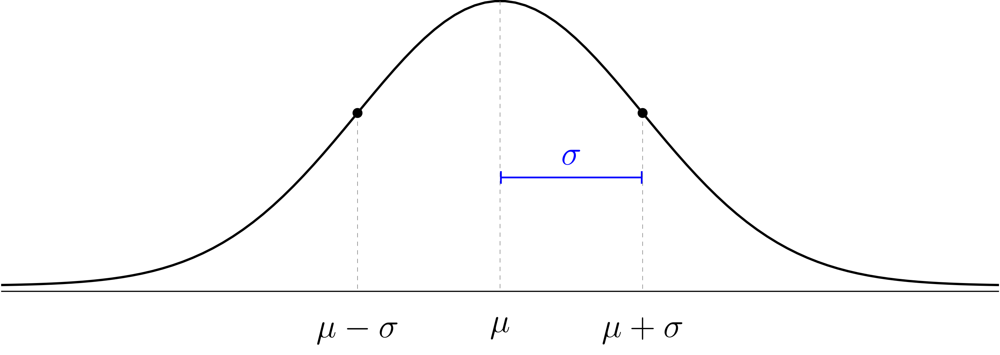

## Math 121 - Spring 2025

<ul class="nav">
  <li>[Class Notes](notes.html)</li>
  <li>[Schedule & Syllabus](index.html)</li>
  <li>[Software & Tables](http://people.hsc.edu/faculty-staff/blins/StatsTools/)</li>
</ul>

Jump to: [Syllabus](index.html), [Week 1](#week-1-notes) , [Week 2](#week-2-notes), [Week 3](#week-3-notes), [Week 4](#week-4-notes), [Week 5](#week-5-notes), [Week 6](#week-6-notes), [Week 7](#week-7-notes), [Week 8](#week-8-notes), [Week 9](#week-9-notes), [Week 10](#week-10-notes), [Week 11](#week-11-notes), [Week 12](#week-12-notes), [Week 13](#week-13-notes), [Week 14](#week-14-notes)

### Week 1 Notes

Day  | Section  | Topic
:---:|:---:|:-----------------------------------
Mon, Jan 13 | [1.2][1.2]     | Data tables, variables, and individuals
Wed, Jan 15 | [2.1.3][2.1.3] | Histograms & skew
Fri, Jan 17 | [2.1.5][2.1.5] | Boxplots

### Mon, Jan 13

Today we covered **data tables**, **individuals**, and **variables**. We also talked about the difference between **categorical** and **quantitative** variables.  

* **Example:** [Class Data](http://people.hsc.edu/faculty-staff/blins/StatsExamples/ClassDataSpring25.xlsx)

1. We looked at a case of a nurse who was accused of killing patients at the hospital where she worked for 18 months.  One piece of evidence against her was that 40 patients died during the shifts when she worked, but only 34 died during shifts when she wasn't working.  If this evidence came from a date table, what would be the most natural individuals (rows) & variables (columns) for that table?

* **Example:** [Accident Fatalities by State](http://people.hsc.edu/faculty-staff/blins/StatsExamples/accident_fatalities_states.xlsx) ([source: CDC](https://www.cdc.gov/nchs/pressroom/sosmap/accident_mortality/accident.htm))

2. In the data table in the example above, who or what are the individuals? What are the variables and which are quantitative and which are categorical?

3. If we want to compare states to see which are safer, why is it better to compare the rates instead of the total fatalities?  

4. What is wrong with this student's answer to the previous question?

> Rates are better because they are more precise and easier to understand.

I like this incorrect answer because it is a perfect example of [bullshit](https://en.wikipedia.org/wiki/Bullshit#Harry_Frankfurt's_concept).  This student doesn't know the answer so they are trying to write something that sounds good and earns partial credit.  Try to avoid writing bullshit.  If you catch yourself writing B.S. on one of my quizzes or tests, then you can be sure that you a missing a really simple idea and you should see if you can figure out what it is.  

### Wed, Jan 15

Today we did our first in-class workshop:

* **Workshop:** [Histograms & stemplots](http://people.hsc.edu/faculty-staff/blins/StatsExamples/Histograms.pdf)

Before that, we talked about how to summarize quantitative data. We started by reviewing the **mean** and **median**. We saw how to find the average in Excel, and we talked about how to find the position of the median in a long list of numbers (assuming they are sorted). 

Then we used the class data we collected last time to introduce **histograms** and **stem-and-leaf plots** (also known as **stemplots**). We also talked about how to tell if data is **skewed left** or **skewed right**. One important concept is that the median is not affected by skew, but the average is pulled in the direction of the skew, so the average will be bigger than the median when the data is skewed right. 

Until recently, Excel did not have an easy way to make histograms, but Google Sheets does.  If you need to make a histogram, I recommend using Google Sheets or this [histogram plotter tool](https://people.hsc.edu/faculty-staff/blins/StatsTools/boxplotsHistograms.html). 

* **Example:** [US Household Income (2010)](https://upload.wikimedia.org/wikipedia/commons/0/0d/Distribution_of_Annual_Household_Income_in_the_United_States_2010.png)

1. Which is greater, the mean or the median household income?

2. Can you think of a distribution that is skewed left?  

3. Why isn't [this bar graph](https://people.hsc.edu/faculty-staff/blins/books/OpenIntroStats4e.pdf#subsection.2.2.5) from the book a histogram?

### Fri, Jan 17

We introduced the **five number summary** and **box-and-whisker plots (boxplots)**.  We also talked about the **interquartile range (IQR)** and how to use the $1.5 \times \text{IQR}$ rule to determine if data is an **outlier**. 

* **Workshop:** [Boxplots](http://people.hsc.edu/faculty-staff/blins/StatsExamples/Spread2.pdf)

We started with this simple example:

1. An 8 man crew team actually includes 9 men, the 8 rowers and one coxswain. Suppose the weights (in pounds) of the 9 men on a team are as follows:

        120  180  185  200  210  210  215  215  215

    Find the 5-number summary and draw a box-and-whisker plot for this data.  Is the coxswain who weighs 120 lbs. an outlier?  

- - -

### Week 2 Notes

Day  | Section  | Topic
:---:|:---:|:-----------------------------------
Mon, Jan 20  |                | Martin Luther King day, no class
Wed, Jan 22  | [2.1.4][2.1.4] | Standard deviation
Fri, Jan 24  | [4.1][4.1]     | Normal distribution

### Wed, Jan 22

Today we talked about **robust** statistics such as the median and IQR that are not affected by outliers and skew. We also introduced the **standard deviation**.  We did this one example of a standard deviation calculation by hand, but you won't ever have to do that again in this class.  

1. 11 students just completed a nursing program.  Here is the number of years it took each student to complete the program.  Find the standard deviation of these numbers.

        3  3  3  3  4  4  4  4  5  5  6

From now on we will just use software to find standard deviation. In a spreadsheet (Excel or Google Sheets) you can use the `=STDEV()` function. 

2. Which of the following data sets has the largest standard deviation?

    a. 1000, 998, 1005
    b. 8, 10, 15, 20, 22, 27
    c. 30, 60, 90

We finished by looking at some examples of histograms that have a shape that looks roughly like a bell.  This is a very common pattern in nature that is called the normal distribution.

* **Example:** [Heights of men in the USA](http://people.hsc.edu/faculty-staff/blins/StatsExamples/cdcHeights.html)
* **Example:** [Annual rainfall in Farmville, VA](http://people.hsc.edu/faculty-staff/blins/StatsExamples/rainfall.html)

The **normal distribution** is a mathematical model for data with a histogram that is shaped like a bell.  The model has the following features:

</img>

1. It is symmetric (left & right tails are same size)
2. The mean ($\mu$) is the same as the median. 
3. It has two inflection points (the two steepest points on the curve)
4. The distance from the mean to either inflection point is the standard deviation ($\sigma$).  
5. The two numbers $\mu$ and $\sigma$ completely describe the model.

The normal distribution is a theoretical model that doesn't have to perfectly match the data to be useful. We use Greek letters $\mu$ and $\sigma$ for the theoretical mean and standard deviation of the normal distribution to distinguish them from the sample mean $\bar{x}$ and standard deviation $s$ of our data which probably won't follow the theoretical model perfectly. 

### Fri, Jan 24

We talked about **z-values** and the [68-95-99.7 rule](http://people.hsc.edu/faculty-staff/blins/StatsExamples/NormalDistributionEmpiricalRule.pdf). 

* **Workshop:** [Normal distributions](http://people.hsc.edu/faculty-staff/blins/StatsExamples/NormalDist.pdf)

We also did these exercises before the workshop.

1. In 2020, Farmville got 61 inches of rain total (making 2020 the second wettest year on record). How many standard deviations is this above average? 

2. The average high temperature in Anchorage, AK in January is 21 degrees Fahrenheit, with standard deviation 10. The average high temperature in Honolulu, HI in January is 80°F with σ = 8°F. In which city would it be more unusual to have a high temperature of 57°F in January?

- - - 

### Week 3 Notes

Day  | Section  | Topic
:---:|:---:|:-----------------------------------
Mon, Jan 27 | [4.1.5][4.1.5] | 68-95-99.7 rule
Wed, Jan 29 | [4.1.4][4.1.4] | Normal distribution computations
Fri, Jan 31 | [2.1][2.1], [8.1][8.1] | Scatterplots and correlation

### Mon, Jan 27

We introduced how to find percentages on a normal distribution for locations that aren't exactly 1, 2, or 3 standard deviations away from the mean. I strongly recommend downloading the [Probability Distributions app](https://homepage.divms.uiowa.edu/~mbognar/applets/normal.html) ([android version](https://play.google.com/store/apps/details?id=com.mbognar.probdist), [iOS version](https://itunes.apple.com/us/app/probability-distributions/id889106396))  for your phone.  We did the following examples. 

1. **Finding the percentile from a location on a bell curve.** SAT verbal scores are roughly normally distributed with mean μ = 500, and σ = 100.  Estimate the percentile of a student with a 560 verbal score. 

2. **Finding the percent between two locations.** What percent of years will Farmville get between 40 and 50 inches of rain?

3. **Converting a percentile to a location.** How much rain would Farmville get in year that was in the 90th percentile? 

We also talked about the shorthand notation
$$P(40 < X < 50)$$
while literally means *"the probability that the outcome X is between 40 and 50"*.  

4. What is the percentile of a man who is 6 feet tall (72 inches)? 

4. Estimate the percent of men who are between 6 feet and 6'5" tall.  

5. How tall are men in the 80-th percentile? 

<!-- We didn't have time for this example:

6. Men have an foot print length that is approximately $N(25 \text{cm}, 4 \text{cm})$.  Women's footprints are approximately $N(19, 3)$. Find 
    a. $P(\text{Man} > 22 \text{cm})$
    b. $P(\text{Woman} > 22 \text{cm})$

-->

### Wed, Jan 29

We continued practicing calculations with the normal distribution.

**Workshop:** [Normal distributions 2](https://people.hsc.edu/faculty-staff/blins/StatsExamples/NormalDist2.pdf)

We also did these examples.

1. Footprints of men are approximately $N(25 \text{cm}, 4 \text{cm})$.  Women's footprints are approximately $N(19, 3)$. Find 
    a. $P(\text{Man} > 22 \text{cm})$
    b. $P(\text{Woman} > 22 \text{cm})$

### Fri, Jan 31

We introduced **scatterplots** and **correlation coefficients** with these examples:

* Height vs. Weight <!-- Note to self, height vs. weight is only weakly correlated... it probably should not be the first example.
* [Blood Alcohol Content vs. Number of Beers](http://people.hsc.edu/faculty-staff/blins/StatsExamples/bac.xlsx) Beers vs. BAC would be a better first example!  -->
* [Marriage ages](http://people.hsc.edu/faculty-staff/blins/StatsExamples/marriageAges.xls)
* [Example R values](http://people.hsc.edu/faculty-staff/blins/StatsExamples/correlationExamples.pdf)
* [Guess the correlation](https://www.geogebra.org/m/KE6JfuF9)

1. What would the correlation between husband and wife ages be in a country where every man married a woman exactly 10 years older? What if every man married a woman exactly half his age?  

Important concept: correlation does not change if you change the units or apply a simple linear transformation to the axes.  Correlation just measures the strength of the linear trend in the scatterplot.  

Another thing to know about the correlation coefficient is that only measures the strength of a linear trend.  The correlation coefficient is not as useful when a scatterplot has a clearly visible nonlinear trend. 

<!--

Even with the quiz, this was not enough material, but I chose not to cover explanatory vs. response variables, b/c I don't think that scatterplots is the best place to cover this... maybe next time, start regression immediately, then use the extra time to squeeze in a day about two-way tables & explanatory vs. response variables. 

We finished by talking about **explanatory** and **response** variables and how *correlation doesn't mean causation*!-->

- - -

### Week 4 Notes

Day  | Section  | Topic
:---:|:---:|:-----------------------------------
Mon, Feb 3  | [8.2][8.2] | Least squares regression introduction
Wed, Feb 5  | [8.2][8.2] | Least squares regression practice
Fri, Feb 7  | [1.3][1.3] | Sampling: populations and samples

### Mon, Feb 3

We talked about **least squares regression**.  The least squares regression line has these features:

1. **Slope** $m = R \frac{s_y}{s_x}$
2. **Point** $(\bar{x}, \bar{y})$
3. **y-Intercept** $b = \bar{y} - m \bar{x}$

You won't have to calculate the correlation $R$ or the standard deviations $s_y$ and $s_x$, but you might have to use them to find the formula for a regression line. 

We looked at these examples:

* [Blood Alcohol Content vs. Number of Beers](http://people.hsc.edu/faculty-staff/blins/StatsExamples/bac.xlsx)
* [Marriage ages](http://people.hsc.edu/faculty-staff/blins/StatsExamples/marriageAges.xls)
* [Midterm exam grades](http://people.hsc.edu/faculty-staff/blins/StatsExamples/MidtermRegression.xlsx)

Keep in mind that regression lines have two important applications. 

* **Make predictions** about average y-values at different x-values.
* The slope is the **rate of change**.  

It is important to be able to describe the units of the slope.  

1. What are the units of the slope of the regression line for predicting BAC from the number of beers someone drinks?

2. What are the units of the slope for predicting someone's weight from their height? 

We also introduced the following concepts. 

**The coefficient of determination** $R^2$ represents the proportion of the variability of the $y$-values that follows the trend line.  The remaining $1-R^2$ represents the proportion of the variability that is above and below the trend line. 

**Regression to the mean.** Extreme $x$-values tend to have less extreme predicted $y$-values in a least squares regression model. 

### Wed, Fab 5

* **Workshop**: [Lightning fatalities](http://people.hsc.edu/faculty-staff/blins/StatsExamples/LightningRegression.pdf)

Before the workshop, we started with these two exercises:

1. Suppose that the correlation between the heights of fathers and adult sons is $R = 0.5$.  Given that both fathers and sons have normally distributed heights with mean $70$ inches and standard deviation 3 inches, find an equation for the least squares regression line. 

2. A sample of 20 college students looked at the relationship between foot print length (cm) and height (in).  The sample had the following statistics:
$$\bar{x} = 28.5 \text{ cm}, ~\bar{y} = 67.75 \text{ in}, ~ s_x = 3.45 \text{ cm}, ~ s_y = 5.0 \text{ in}, ~ R = 0.71$$

    a. Find the slope of the regression line to predict height ($y$) based on footprint length ($x$). Include the units and briefly explain what it means.  
    b. If a footprint was 30 cm long, how tall would you predict the subject was? 

### Fri, Feb 7

We talked about the difference between **samples** and **populations**.  The central problem of statistics is to use sample **statistics** to answer questions about population **parameters**. 

We looked at an example of sampling from the Gettysburg address, and we talked about the **central problem of statistics**: How can you answer questions about the population using samples?  

The reason this is hard is because sample statistics usually don't match the true population parameter.  There are two reasons why:

* **Bias**: systematic error (each source has error in a particular direction) 
* **Random error**: non-systematic error

We looked at this case study:

* [Gallup polling & sample bias](https://people.hsc.edu/faculty-staff/blins/StatsExamples/samplingPresentation.pdf)

**Important Concepts**

1. Bigger samples have *less* random error.

2. Bigger samples *don't reduce* bias.

3. The only sure way to avoid bias is a **simple random sample**.

- - - 

### Week 5 Notes

Day  | Section  | Topic
:-----:|:---:|:-----------------------
Mon, Feb 10  | [1.3][1.3] | Bias versus random error
Wed, Feb 12  |            | Review
Fri, Feb 14  |            | **Midterm 1**

### Mon, Feb 10

We did this workshop. 

* **Workshop**: [Random error versus bias](http://people.hsc.edu/faculty-staff/blins/StatsExamples/BiasRandomError.pdf)

### Wed, Feb 12

We talked about the [midterm 1 review problems](midterm1review.html).

- - - 
 

### Week 6 Notes

Day  | Section  | Topic
:-----:|:---:|:-----------------------
Mon, Feb 17 | [1.4][1.4] | Randomized controlled experiments
Wed, Feb 19 | [3.1][3.1] | Defining probability
Fri, Feb 21 | [3.1][3.1] | Multiplication and addition rules

### Mon, Feb 17

One of the hardest problems in statistics is to prove causation. Here is a diagram that illustrates the problem.

</img>

One variable (called the **explanatory variable**) might be the cause of a change in another variable (called the **response variable**). But we have to watch out for other variables that aren't part of the study called **lurking variables**.  

<!--A lurking variable that might be associated with both the explanatory and response variable is called a **confounding variable**.-->  

We say that **correlation is not causation** because you can't assume that there is a cause and effect relationship between two variables just because they are strongly associated.  The association might be caused by lurking variables or the causal relationship might go in the opposite direction of what you expect.  

**Experiments versus Observational Studies**

An **experiment** is a study where the individuals are placed into different **treatment groups** by the researchers. An **observational study** is one where the researchers do not place the individuals into different treatment groups.  

A **randomized controlled experiment** is one where the individuals are randomly assigned to treatment groups.  

**Important concept:** Random assignment automatically controls all lurking variables, which let's you establish cause and effect.  

We looked at these examples. 

1. A study tried determine whether cellphones cause brain cancer.  The researchers interviewed 469 brain cancer patients about their cellphone use between 1994 and 1998.  They also interviewed 469 other hospital patients (without brain cancer) who had the same ages, genders, and races as the brain cancer patients.  

    a. What was the explanatory variable?
    b. What was the response variable?
    c. Which variables were controlled?
    d. Was this an experiment or an observational study?
    e. Are there any possible lurking variables?

2. In 1954, the polio vaccine trials were one of the largest randomized controlled experiments ever conducted.  [Here were the results](https://people.hsc.edu/faculty-staff/blins/StatsExamples/polioTrials.html). 

    a. What was the explanatory variable?
    b. What was the response variable?
    c. This was an experiment because it had a treatment variable.  What was that?
    c. Which variables were controlled?
    d. Why don't we have to worry about lurking variables?  

We talked about why the polio vaccine trials were **double blind** and what that means.      

Here is one more example we didn't have time for:

3. Do [magnetic bracelets](https://www.amazon.com/Bracelets-Adjustable-3000Gauss-Arthritis-Migraines/dp/B07QX2WYNS/ref=sr_1_2_sspa?dib=eyJ2IjoiMSJ9.S8qvWGHSHwQxRHG2yFf2gzEQVauNBaVky2_BHvgF4meM3f1vAL530i8oTdhNSTUc7Mk9pmXKIb6gSUWeQyil2KfiSsmqNf5SQ0zMkWv7o0oZU3uT21FKwIksTTCfs88gp8BLdzg6cY0V7bQ8SlHDqhi-SQ_1-uglO24g-WsO58e4ZqKvUFMJ3j0K2uRtmhTzd4MUWnwQyDq_wU8xDx789RUzuuU8yXZIh1WGygjZzbf7BDnEfdzRHkBnM5wzhbOm7gqhM3v8uY2JXvNRTP5E27YfvxroISSg6Alk4xM9jUY.5faFTIRYYwhnDzFp856CUR1u82Z7yQOvFbweRcKk9tg&dib_tag=se&hvadid=409961555257&hvdev=c&hvlocphy=1027155&hvnetw=g&hvqmt=e&hvrand=12006179576662034532&hvtargid=kwd-20439822&hydadcr=24657_11410751&keywords=magnetic+bracelets&qid=1727463369&sr=8-2-spons&sp_csd=d2lkZ2V0TmFtZT1zcF9hdGY&psc=1) work to help with arthritis pain?

    a. What is the explanatory variable?
    b. What is the response variable?
    c. How hard would it be to design a randomized controlled experiment to answer the question above? 
    
<!--We finished by talking about **anecdotal evidence**. -->

### Fri, Feb 21

Today we introduced **probability models** which always have two parts:

1. A list of possible outcomes called a **sample space**.
2. A **probability function** $P(E)$ that gives the probability for any subset $E$ of the sample space.  

A subset of the sample space is called an **event**.  We already intuitively know lots of probability models, for example we described the following probability models:

1. Flip a coin.

2. Roll a six-sided die.

3. If you roll a six-sided die, what is $P(\text{result at least 5})?$

4. The proportion of people in the US with each of the four blood types is shown in the table below.

    Type | O | A | B | AB
    :---|:---:|:---:|:---:|:---:
    Proportion | 0.45 | 0.40 | 0.11 | ?

    What is $P(\text{Type AB})?$

* **Workshop**: [Probability distributions](https://people.hsc.edu/faculty-staff/blins/StatsExamples/ProbabilityDistributions.pdf)

- - - 

### Week 7 Notes

Day  | Section  | Topic
:-----:|:---:|:-----------------------
Mon, Feb 24 | [3.4][3.4] | Weighted averages & expected value
Wed, Feb 26 | [3.4][3.4] | Random variables
Fri, Feb 28 | [7.1][7.1] | Sampling distributions

### Mon, Feb 24

Today we talked about **weighted averages**. To find a weighted average:

1. Multiply each number by its weight.
2. Add the results.

We did an two examples. 

1. Calculate the final grade of a student who gets an 80 quiz average, 72 midterm average, 95 project average, and an 89 on the final exam. 

2. Eleven nursing students graduated from a nursing program.  Four students completed the program in 3 years, four took 4 years, two took 5 years, and one student took 6 years to graduate.  Express the average time to complete the program as a weighted average. 

We also talked about **expected value** (also known as the **theoretical average**) which is the weighted average of the outcomes in a probability model, using the probabilities as the weights. 

* **Workshop:** [Expected value & weighted averages](http://people.hsc.edu/faculty-staff/blins/StatsExamples/ExpectedValue.pdf)

We finished by talking about the **Law of Large Numbers** which says: when you repeat a random experiment many times, the sample mean tends to get closer to the theoretical average.

### Wed, Feb 26

A **random variable** is a probability model where the outcome are numbers. We often use a capital letter like $X$ or $Y$ to represent a random variable.  We use the shorthand $E(X)$ to represent the expected value of a random variable.  Recall that the expected value (also known as the theoretical average) is the weighted average of the possible outcomes weighted by their probabilities.  

A probability histogram shows the **probability distribution** of a random variable. Every probability distribution can be described in terms of the following three things:

1. **Shape** - is it shaped like a bell, or skewed, or something even more complicated?
2. **Center** - the theoretical average $\mu$ (i.e., the expected value)
3. **Spread** - the theoretical standard deviation $\sigma$

In the game roulette there is a wheel with 38 slots.  The slots numbered 1 through 36 are split equally between black and red slots.  The other two slots are 0 and 00 which are green.  When you spin the wheel, you can bet that the ball will land in a specific slot or a specific color.  If you bet $1, and the ball lands on the specific number you picked, then you win $36.  

1. Find the expected value of your bet.  

2. Draw a probability histogram for this situation. 

3. Describe the shape of the distribution. 

4. What does the law of large numbers predict will happen if you play many games of roulette?

We also looked at what happens if you bet \$1 on a color like black.  Then you win \$2 if it lands on black.  It turns out that the expected value is the same, but the distribution has a different shape (more skewed) and much larger spread ($\sigma = \$0.9986$ for betting on a number versus $\sigma = \$5.763$ if you bet on black). 

<!-- 
Another good exercise we didn't do is this:

5. [Exercise 3.34](https://people.hsc.edu/faculty-staff/blins/books/OpenIntroStats4e.pdf#eoce.3.34).

We finished by talking about the trade-off between risk ($\sigma$) versus expected returns ($\mu$) when investing. 
-->

We finished by talking briefly about the **binomial distribution** which is the distribution of the total number of successes when you have a two outcome situation where the probability $p$ of a success in each trial is always the same and you repeat the trials $n$ times.  We looked at what happens if you play a lot of games of roulette using [this app](https://people.hsc.edu/faculty-staff/blins/StatsTools/binomialPlotter2.html).

### Fri, Feb 28

Suppose we are trying to study a large population with mean $\mu$ and standard deviation $\sigma$. If we take a random sample, the sample mean $\bar{x}$ is a random variable and its probability distribution is called the **sampling distribution** of $\bar{x}$.  Assuming that the population is large and our sample is a simple random sample, the sampling distribution always has the following features:

**Sampling Distribution of $\bar{x}$.**

1. **Shape**: gets more normal as the sample size $N$ gets larger.
2. **Center**: the theoretical average of $\bar{x}$ is the true population mean $\mu$. 
3. **Spread**: the theoretical standard deviation of $\bar{x}$ gets smaller as $N$ gets bigger. In fact: 
$$\sigma_{\bar{x}} = \frac{\sigma}{\sqrt{N}}.$$

Examples of sampling distributions.

* [Gettysburg Address words](https://people.hsc.edu/faculty-staff/blins/StatsExamples/GettysburgSamplingDistribution.html)
* [Weights of adults](http://people.hsc.edu/faculty-staff/blins/StatsExamples/InteractiveSamplingDistribution.html)
* [NFL kickoffs](http://people.hsc.edu/faculty-staff/blins/StatsExamples/InteractiveSamplingDistribution2.html)

1. Every week in the Fall there are about 15 NFL games.  In each game, there are about 13 kickoffs, on average.  So we can estimate that there might be about 200 kickoffs in one week of NFL games.  Those 200 kickoffs would be a reasonably random sample of all NFL kickoffs.  Describe the sampling distribution of the average kickoff distance.  

1. The average American weighs $\mu = 170$ lbs. with a standard deviation of $\sigma = 40$ lbs.  If a commuter plan is designed to seat 22 passengers, what is the probability that the combined weight of the passengers would be greater than $4{,}000$ lbs?  (This is the same as finding $P(\bar{x} > 181.8)$)

- - - 

### Week 8 Notes

Day  | Section  | Topic
:-----:|:---:|:-----------------------
Mon, Mar 3 | [5.1][5.1] | Sampling distributions for proportions
Wed, Mar 5 | [5.2][5.2] | Confidence intervals for a proportion 
Fri, Mar 7 | [5.2][5.2] | Confidence intervals for a proportion - con'd

### Mon, Mar 3

We started with this warm-up problem which is a review of the things we talked about last week. 

1. Annual rainfall totals in Farmville are approximately normal with mean 44 inches and standard deviation 7 inches.  

    a. How likely is a year with more than 50 inches of rain? 

    b. How likely is a whole decade with average annual rainfall over 50 inches?

<!--
1. Before state lotteries, mobsters used to run illegal lotteries called the numbers game in many cities.  It cost 1 dollar to buy a numbers game lottery ticket and players could pick any three digit number from 000 to 999.  If their number was picked, they would win \$600.  
    a. What is the expected value of a numbers ticket?  
    b. The standard deviation for a numbers ticket was $\sigma = \$18.96$.  If someone played the numbers game every day (350 days per year) for 40 years, that would be 14,000 games.  Describe the sampling distribution for this person's average winnings per game. Is it possible they win more than \$1 per game?   
    c. The mobster Casper Holstein took as many as 150,000 bets per week.  How likely would it be for the mob to have a bad week where they lost money?  
-->

Then we talked about **sample proportions** which are denoted $\hat{p}$ and can be found using the formula
$$\hat{p} = \frac{\text{ number of "successes" }}{\text{ sample size }}.$$ 
In a SRS from a large population, $\hat{p}$ is random with a **sampling distribution** that has the following features. 

**Sampling Distribution of $\hat{p}$.**

1. **Shape**: gets more normal as the sample size $N$ gets larger.
2. **Center**: the theoretical average of $\hat{p}$ is the true population proportion $p$.
3. **Spread**: the theoretical standard deviation of $\hat{p}$ gets smaller as $N$ gets bigger. 
$$\sigma_{\hat{p}} = \sqrt{\frac{p(1-p)}{N}}.$$

We did the following exercises in class. 

1. In our class, 13 out of 24 students were born in VA.  Is $\frac{13}{24}$ a statistic or a parameter?  Should you denote it as $p$ or $\hat{p}$?  

1. In the United States about 7.2% of people have type O-negative blood, so they are universal donors.  Is 7.2% a parameter ($p$) or a statistic ($\hat{p}$)? 

1. If a hospital has $N = 900$ patients, describe the sampling distribution for the proportion of patients who are universal donors. 

1. Find the probability that $P(\hat{p}_{\text{universal donor}} > 8\%)$. 

<!--
2. Assuming that the true proportion of all HSC students that were born in VA is 50%, describe the sampling distribution for $\hat{p}_\text{VA}$ in a random sample of $N = 25$ students. 

3. About one third of American households have a pet cat.  If you randomly select $N = 50$ households, describe the sampling distribution for the proportion that have a pet cat.  

4. According to a 2006 study of 80,000 households, 31.6% have a pet cat.  Is 31.6% a statistic or a parameter?  Would it be better to use the symbol $\hat{p}$ or $p$ to represent it?  
-->

<!--
### Fri, Oct 18 

Last time we saw that $\hat{p}$ is a random variable with a sampling distribution.  We started today with this exercise from the book:

* [Exercise 5.4](http://people.hsc.edu/faculty-staff/blins/books/OpenIntroStats4e.pdf#eoce.5.4)

Then we talked about the following simple idea: there is a 95% chance that $\hat{p}$ is within 2 standard deviations of the true population proportion $p$. So if we want to estimate what the true $p$ is, we can use a **95% confidence interval**:
$$\hat{p} \pm 2 \sqrt{\frac{\hat{p}(1- \hat{p}}{N}}.$$

The confidence interval formula has two parts: a **best guess estimate** (or **point estimate**) before the plus/minus symbol, and a **margin of error** after the $\pm$ symbol.  The formula for the margin of error is 2 times the **standard error** which is an approximation of $\sigma_{\hat{p}}$ using $\hat{p}$ instead of $p$.  

1. In our class 13 out of 28 students were born in VA. Use the 95% confidence interval formula to estimate the percent of all HSC students that were born in VA.

### Mon, Oct 21

Today we talked about **confidence intervals** for a population proportion again.  We talked about how you can change the **confidence level** by adjusting the **critical z-value** $z^*$.  
$$\hat{p} \pm z^* \sqrt{ \frac{\hat{p}(1-\hat{p})}{N}}.$$

Confidence Level | 90% | 95% | 99% | 99.9%
:---|:---:|:---:|:---:|:---:
Critical z-value | 1.645 | 1.96 | 2.576 | 3.291

Examples.

1. In 2004 the General Social Survey found 304 out 977 Americans always felt rushed.  Find the margin of error for a 90% confidence interval with this data. 

2. What are we 90% sure is true about the confidence interval we found? Only one of the following is the correct answer. Which is it?
    a. 90% of Americans are in the interval.
    b. 90% of future samples will have results in the interval.
    c. 90% sure that the population proportion is in the interval.
    d. 90% sure that the sample proportion is in the interval. 

Confidence intervals for proportions are based on some big assumptions.  

1. **No Bias.** The data must be a simple random sample from the population to avoid bias.

2. **Normality.** The sample size must be large enough for $\hat{p}$ to be normally distributed.  A rule of thumb (**the success-failure condition**) is that you should have at least 15 "successes" and 15 "failures" in your data in order to use this kind of confidence interval.

We finished with one more exercise.  

3. A 2017 Gallop survey of 1,011 American adults found that 38% believe that God created man in his present form.  Find the margin of error for a 95% confidence interval to estimate the percent of all Americans who share this belief. 

We didn't have time for these last problems because we were reviewing probability models, probabilities vs. expected value, and sample proportions from last quiz. 

2. [Case Study 5.2.4](https://people.hsc.edu/faculty-staff/blins/books/OpenIntroStats4e.pdf#eoce.5.2)

We finished by talking about how to choose a sample size large enough to get a desired margin of error. 

3. A university newspaper is conducting a survey to determine what fraction of students support a \$200 a year increase in fees to pay for a new football stadium.  How big of a sample is required to ensure the margin of error is smaller than 0.04 using a 95% confidence level? 
-->

- - - 

### Week 9 Notes

Day  | Section  | Topic
:-----:|:---:|:-----------------------
Mon, Mar 17  |            | Review
Wed, Mar 19  |            | **Midterm 2**
Fri, Mar 21  | [5.3][5.3] | Hypothesis testing for a proportion

<!--

### Wed, Oct 23

We talked about the [midterm 2 review](midterm2review.pdf) in class today.  The [solutions](midterm2reviewSolutions.pdf) are online too. 

-->

- - - 

### Week 10 Notes

Day  | Section  | Topic
:-----:|:---:|:-----------------------
Mon, Mar 24 | [6.1][6.1] | Inference for a single proportion
Wed, Mar 26 | [5.3.3][5.3.3] | Decision errors
Fri, Mar 28 | [6.2][6.2]     | Difference of two proportions (hypothesis tests)

<!--
### Mon, Oct 28

Today we introduced **hypothesis testing**. This is a tool for answering yes/no questions about a population parameter.  You start by considering two possible hypotheses about the parameter of interest. 

* **Null Hypothesis ($H_0$)** - is a specific claim about the parameter. 
* **Alternative Hypothesis ($H_A$)** - is what must be true if the null hypothesis is false. 

Here are the steps to do a hypothesis test for a single proportion:

1. **State the hypotheses.** These will pretty much always look like 
    - $H_0 ~:~ p = p_0$
    - $H_A ~:~ p \ne p_0$ \
where $p_0$ is a specific proportion that makes sense in the context of the situation.

2. **Calculate the test statistic.** Using the formula 
$$z = \frac{\hat{p} - p_0}{\sqrt{\frac{p_0(1-p_0)}{N}}}.$$

3. **Find the p-value.** The p-value is *the probability of getting a result at least as extreme as the sample statistic if the null hypothesis is true.*

4. **Explain what it means.** A low p-value is evidence that we should reject the null hypotheses.  Usually this means that the results are too surprising to be caused by random chance along.  A p-value over 5% means we definitely should not reject $H_0$.

p-value | Meaning
:---:|:---:
Over 5% | Weak evidence
1% to 5% | Moderate evidence
0.1% to 1% | Strong evidence
Under 0.1% | Very strong evidence

We did two full examples in class. For each example, you should be able to do each of the four steps above to test the hypotheses. 

1. When I was a kid, I took a test to see if I had psychic powers.  In the test, I had 25 chances to guess which one of five symbols was on 25 different cards that I couldn't see.  If I were just guessing, I would only have a 20\% (1 out of 5) of guessing right.  But I actually got 10 out of 25 guesses correct.  How strong is this evidence that I am psychic?  

<figure>
</img>
</figure>

2. 13 out of 28 students (46.4%) in our class were born in VA.  Is this strong evidence that less than half of all HSC students were born in VA. 

One other example we didn't have time to finish was this one. 

### Wed, Oct 30

We reviewed the steps for doing a hypothesis test about a population proportion. The we did this example that we ran out of time for last time:

1. In 2013, a random sample of 1028 U.S. adults found that 56\% support nuclear arms reduction.  Does this provide strong evidence that a majority of Americans support nuclear arms reduction?

We talked about how the null hypotheses must give a *specific* value for the parameter of interest so that we can create a **null model** that we can test.  If the sample statistic is far from what we expect, then we can reject the null hypothesis and say that the results are **statistically significant**. Unlike in English, the word significant does not mean "important" in statistics.  It actually means the following. 

**Logic of Hypothesis Testing.** The following are all equivalent:

1. Results are statistically significant.
2. We should reject the null hypothesis. 
3. Low p-value (at least under 5%).
4. Extreme z-value.
5. Results are probably not a random fluke.

Notice that all of the items on the list above are statistics jargon except item 5. 

We finished with two exercises from the book.

2. [Exercise 5.16](https://people.hsc.edu/faculty-staff/blins/books/OpenIntroStats4e.pdf#page=202)

Notice that in 5.16(b), you could make the case that we have prior knowledge based on the reputation of the state of Wisconsin to guess that that percent of people who have drank alcohol in the last year in Wisconsin (which we denoted $p_{WI}$) satisfies a **one-sided alternative hypothesis**:
$$H_A ~:~ p_\text{WI} > 70\%.$$ 
If you don't know about Wisconsin, then you should definitely use the **two-sided alternative hypothesis**:
$$H_A ~:~ p_\text{WI} \ne 70\%$$ 
The only difference is when you calculate the p-value, you use two tails of the bell curve if you are doing a two-sided p-value.  If you aren't sure, it is always safe to use a two-sided alternative. 

3. [Exercise 5.17](https://people.hsc.edu/faculty-staff/blins/books/OpenIntroStats4e.pdf#page=202)

### Fri, Nov 1

When we do a hypothesis test, we need to make sure that the **assumptions of a hypothesis test** are satisfied.  There are two that we need to check:

1. **No Bias**. Data should come from a simple random sample (SRS) from the population.
2. **Normality**. Sample size should be large enough to trust that $\hat{p}$ will be normally distributed.  Based on the $p_0$ from the null hypothesis, you should expect at least 10 success and 10 failures. So you need both
$$n p_0 \ge 10 \text{ and } n (1-p_0) \ge 10.$$
In practice, the normality assumption is usually satisfied as long as there are at least 15 successes and 15 failures in the sample. 

We looked at whether these two assumptions are satisfied for this example:

1. In our first example of a hypothesis test we looked at an example where I got 10 out of 25 guesses correct with Zenner cards.  Does that example satisfy the assumptions above? 

Another thing you have to decide when you do a hypothesis test is how strong the evidence needs to be in order to convince you to reject the null hypothesis.  Historically people aimed for a **significance level** of $\alpha = 5\%$.  A p-value smaller than that was usually considered strong enough evidence to reject $H_0$.  Now people often want stronger evidence than that, so you might want to aim for a significance level of $\alpha = 1\%$.  I'm some subjects like physics where things need to be super rigorous they use even lower values for $\alpha$.  Unlike the p-value, you pick the significance level $\alpha$ before you look at the data.  

In the back of your mind, remember there are four possible things that might happen in a null hypothesis. 

<table class="bordered">
<tr><th></th><th>$H_0$ is true</th><th>$H_A$ is true</th></tr>
<tr><th>p-value above $\alpha$</th><td>Don't reject $H_0$</td><td>Type II error (false negative)</td></tr>
<tr><th>p-value below $\alpha$</th><td>Type I error (false positive)</td><td>Reject $H_0$</td></tr>
</table>

If $H_0$ is true, then the significance level $\alpha$ that you choose is the probability that you will make a **type I error** which is when you reject $H_0$ when you shouldn't.  The disadvantage of making $\alpha$ really small is that it does increase the chance of a **type II error** which is when you don't reject $H_0$ even though you should.

In a criminal trial the prosecution tries to prove that the defendant is "guilty beyond a reasonable doubt".  Think of a type I error as when the jury convicts an innocent defendant.  A type II error would be if the jury does not convict someone who is actually guilty. 

-->

- - - 

### Week 11 Notes

Day  | Section  | Topic
:-----:|:---:|:-----------------------
Mon, Mar 31 | [6.2.3][6.2.3] | Difference of two proportions (confidence intervals)
Wed, Apr 2 |  [7.1][7.1]     | Introducing the t-distribution
Fri, Apr 4 |  [7.1.4][7.1.4] | One sample t-confidence intervals

<!--
### Mon, Nov 4

Today we talked about **two-sample hypothesis tests for proportions.** We did two examples in class:

1. In the 2008 General Social Survey, people were asked to rate their lives as exciting, routine, or dull. 300 out of 610 men in the study said their lives were exciting versus 347 out of 739. Is that strong evidence that there is a difference between the proportions of men and women who find their lives exciting?

2. In 2012, the Atheist Shoe Company noticed that packages they sent to customers in the USA were never arriving. So they did an experiment. They mailed 89 packages that were clearly labeled with the Atheist brand logo, and they also sent 89 unmarked packages in plain boxes. 9 out of the 89 labeled packages did not arrive on time compared with only 1 out of 89 unlabeled packages. Is that a statistically significant difference? (See this website for more details: [Atheist shoes experiment](https://atheist.shoes/pages/usps-study))

In both examples we used the following theory.  In a *large enough* random sample from two populations A and B, the gap between the sample proportions $\hat{p}_A - \hat{p}_B$ has a sampling distribution with:

* **Shape:** Approximately normal.
* **Center:** Equal to the true population gap $p_A - p_B$.
* **Spread:** The standard deviation is 
$$\sqrt{\frac{p_A(1-p_A)}{N_A} + \frac{p_B(1-p_B)}{N_B}}.$$

From this theory we talked about how to test the following hypotheses:

* $H_0 ~:~ p_A = p_B$
* $H_A ~:~ p_A \ne p_B$ 

using the test statistic:
$$z = \frac{\hat{p}_A - \hat{p}_B}{\sqrt{\hat{p}(1- \hat{p})\left(\frac{1}{N_A} + \frac{1}{N_B}\right)}}$$
where $\hat{p}$ is the **pooled proportion**:
$$\hat{p} = \frac{\text{ Total number of successes in both groups }}{\text{ Combined sample size }}.$$

You do need a big enough sample for the normality assumption to hold, and you need the samples to not be biased.  A rule of thumb for the sample size is that you should have at least 5 successes and failures for each group.  

If we want to estimate how big the gap between the population proportions $p_A$ and $p_B$ is, then you can use a **two-sample confidence interval for proportions:**
$$(\hat{p}_A - \hat{p}_B) \pm z^* \sqrt{\frac{\hat{p}_A (1-\hat{p}_A)}{N_A} + \frac{\hat{p}_B (1- \hat{p}_B)}{N_B}}.$$

Because the formulas for two-sample confidence intervals and hypothesis tests are so convoluted, I posted an [interactive formula sheet](https://people.hsc.edu/faculty-staff/blins/StatsTools/statsFormulas.html) under the software tab of the website.  Feel free to use it on the projects when you need to calculate these formulas.  

Two sample confidence intervals for proportions are a little less robust than hypothesis tests.  It is recommended that you should have at least 10 successes & 10 failures in each group before you put much trust in the interval.   

### Wed, Nov 6

We started with this example:

1. A study in the early 1990s looked at whether the anti-retroviral drug AZT is effective at preventing HIV-positive pregnant women from passing the HIV virus on to their children.  In the study, 13 out of 180 babies whose mothers were given AZT while pregnant tested postive for HIV, compared with 40 out of 183 babies whose mothers got a placebo.  Is this strong evidence that AZT is effective?  How much of a difference does it make?   

Then we did a workshop. 

* **Workshop:** [High school drug testing](https://people.hsc.edu/faculty-staff/blins/StatsExamples/DrugTesting.pdf)

### Fri, Nov 8

We reviewed **statistical inference** which is the process of using sample statistics to say something about population parameters.  There are two main techniques:

* Hypothesis testing - Answers a yes/no question about a parameter
* Confidence interval - Estimates the value of a parameter

We have been focused on inference about proportions of a categorical variable.  Today we started talked about how to do inference about a quantitative variable like height.  We looked at our class data and saw that the sample mean height is $\bar{x}_{HS} = 71.8$ inches.  That suggests that maybe Hampden-Sydney students are taller than average for men in the United States.  So we made these hypotheses:

* $H_0: \mu_{HS} = 70$
* $H_A: \mu_{HS} > 70$

To test these, we reviewed what we know about the sampling distribution for $\bar{x}$, and we tried to find the z-value using the formula
$$z = \frac{\bar{x} - \mu_0}{\sigma / \sqrt{n}}.$$
Unfortunately, we don't know the population standard deviation $\sigma$ for all HSC students.  We only know the sample standard deviation which was $s = 2.7$ inches.  If we use that instead of $\sigma$, then we get a **t-value**:
$$t =  \frac{\bar{x} - \mu_0}{s / \sqrt{n}}.$$
which follows a **t-distribution**. We talked about how to use the [t-distribution app](https://homepage.divms.uiowa.edu/~mbognar/applets/t.html) to calculate probabilities on a t-distribution.  One weird thing about t-distributions is that they have **degrees of freedom** (denoted by either *df* or $\nu$). When you do a hypothesis test for one mean or a confidence interval for one mean, 
$$\text{degrees of freedom} = n - 1.$$
We briefly talked about why this is.  Then we used the app to find a p-value for our class data and see whether or not we have strong evidence that HSC students are taller on average than other men in the USA. The logic of p-values is exactly the same for a t-test as it is for a hypothesis test with the normal distribution.

-->

- - - 

### Week 12 Notes

Day  | Section  | Topic
:-----:|:---:|:-----------------------
Mon, Apr 7 | [7.2][7.2] | Paired data 
Wed, Apr 9 | [7.3][7.3] | Difference of two means  
Fri, Apr 11 | [7.3][7.3] | Difference of two means 

<!--
### Mon, Nov 11

A **t-distribution confidence interval** is a tool to estimate the value of a population mean ($\mu$):
$$\bar{x} \pm t^* \frac{s}{\sqrt{n}}.$$

In order to use this formula, you need to find the **critical t-value** $t^*$ for the confidence level you want.  The easiest way is to look up the $t^*$ value on a table. 

* **Table:** [t-distribution table](https://people.hsc.edu/faculty-staff/blins/StatsExamples/Tables/TableC.pdf)

We talked about how to use the table to find $t$-values.  Then we did the following examples. 

1. Use the [class data](http://people.hsc.edu/faculty-staff/blins/StatsExamples/ClassDataFall24.xlsx) to make a 95\% confidence interval for the average height of all HSC students. 

2. Use the [class data](http://people.hsc.edu/faculty-staff/blins/StatsExamples/ClassDataFall24.xlsx) to make a 90\% confidence interval for the average weight of all HSC students. 

We also did this workshop.

* **Workshop:** [Quarters](http://people.hsc.edu/faculty-staff/blins/StatsExamples/Quarters.pdf)

t-distribution methods require the following assumptions:

1. **No Bias.** Data should be a simple random sample from the population.

2. **Normality.** The sampling distribution for $\bar{x}$ should be normal. This tends to be true if the sample size is big.  Here is a quick rule of thumb:

    * **Large samples** If $N \ge 30$, then the normality assumption is probably reasonable as long as the data isn't extremely skewed or has large outliers.  
    * **Small samples** If $N < 30$, then even a little skew or outliers could mess up the p-values or confidence levels you get from the t-distribution formulas.  

### Wed, Nov 13

One interesting mistake came up in a couple of the Project 1 write-ups.  The confidence interval for the difference in survival rates for the two groups of monkeys ranges from 3% lower with calorie restriction to 35% higher.  Several people said that because most of the interval is positive, that means we can conclude that calorie restriction *probably* increases survival rates.  That is actually not true!  The mathematics that lets us make a confidence interval don't tell us anything about where the true parameter falls within the interval. So we have to be very careful about using a confidence interval or hypothesis test to say more than what it actually says.  

After that, we talked about comparing the averages of two correlated variables.  You can use one sample t-distribution methods to do this as long as you focus on the **matched pairs differences**.  The key is to focus on the difference or gap between the variables.  For a **matched pairs t-test**, we always use the following:

<table class="bordered">
<tr><th>Hypotheses</th><th>Test Statistic</th></tr>
<tr><td>$\begin{array}{l} H_0: \mu_\text{gap} = 0 \\ H_A: \mu_\text{gap} \ne 0 \end{array}$</td><td>$t = \dfrac{~ \bar{x}_\text{gap} - 0 ~}{s/\sqrt{N}}$ </td></tr>
</table>

1. Does the data in this [sample of couples getting married](http://people.hsc.edu/faculty-staff/blins/StatsExamples/marriageAges.xls) provide significant evidence that husbands are older than their wives on average?  What is the average age gap?  Use a one-sample hypothesis test and confidence interval for the average difference. 

2. Are the necessary assumptions for a t-test and a t-confidence interval satisfied in the previous example? 

3. Do helium filled footballs go farther when you kick them?  An article in the *Columbus Dispatch* from 1993 described the following experiment.  One football was filled with helium and another identical football with regular air.  Each football was kicked 39 times and the two footballs alternated with each kick. The distances traveled by the balls on each kick is recorded in this spreadsheet: [Helium filled footballs](http://people.hsc.edu/faculty-staff/blins/StatsExamples/football.xlsx).

    Does this data provide statistically significant evidence that helium filled footballs go farther when kicked? 

### Fri, Nov 15

Today we introduced the last two inference formulas from the [interactive formula sheet](http://people.hsc.edu/faculty-staff/blins/StatsTools/statsFormulas.html): **two sample inference for means**. We looked at this example which is from a study where college student volunteers wore a voice recorder that let the researchers estimate how many words each student spoke per day.  

* [Men vs. women words per day](http://people.hsc.edu/faculty-staff/blins/StatsExamples/Talking.xlsx)

We made side-by-side box and whisker plots for the data:

</img>

This picture suggests that there might be a difference between men & women, but is it really significant? Or could this just be a random fluke?  To find out, we can do a **two sample t-test**.  

<table class="bordered">
<tr><th>Hypotheses</th><th>Test Statistic</th></tr>
<tr><td>$\begin{array}{l} H_0: \mu_1 = \mu_2 \\ H_A: \mu_1 \ne \mu_2 \end{array}$</td><td>$t = \dfrac{~ \bar{x}_1 - \bar{x}_2 ~}{\sqrt{\frac{s_1^2}{n_1} + \frac{s_2^2}{n_2}}}$ </td></tr>
</table>

When you do a two sample t-test (or a 2-sample t-confidence interval), there is a complicated formula for the right degrees of freedom.  But an easy safe approximation is this:
$$dF = \min(n_1, n_2) - 1$$
in other words, *use the smaller sample size minus 1 as the degrees of freedom*. 

Here is a quick summary of the numbers we need to calculate the t-value for the example with men & women talking.

<table class="bordered">
<tr><td>&nbsp;</td><td>$n$</td><td>$\bar{x}$</td><td>$s$</td></tr>
<tr><td>Women</td><td>27</td><td>16,496.1</td><td>7,914.3</td></tr>
<tr><td>Men</td><td>20</td><td>12,866.7</td><td>8,342.5</td></tr>
</table>

1. Is this statistically significant evidence that women talk more than men?  Carry out all 4-steps of the hypothesis test including (i) making hypotheses, (ii) finding the t-value, (iii) finding the p-value, and (iv) explaining what it means. 

**Cloud Seeding**. An experiment done in the 1970's looked at whether it is possible to spray clouds with a silver iodide solution to increase the amount of rain that falls in an area. On 26 days with promising clouds a plane sprayed the clouds with silver iodide solution and on 26 similar days they didn't spray. The amount of rainfall (measured in acre-feet) was tracked by radar. Here were the results:

<table class="bordered">
<tr><td>&nbsp;</td><td>$n$</td><td>$\bar{x}$</td><td>$s$</td></tr>
<tr><td>Seeded</td><td>26</td><td>16,496.1</td><td>7,914.3</td></tr>
<tr><td>Control</td><td>26</td><td>12,866.7</td><td>8,342.5</td></tr>
</table>

2. Is there statistically significant evidence that cloud seeding works to produce more rain?  

3. Use the **two sample t-confidence interval** to estimate how much more rain cloud seeding would produce on average.  

$$(\bar{x}_1 - \bar{x}_2) \pm t^* \sqrt{\frac{s_1^2}{n_1} + \frac{s_2^2}{n_2}}.$$

-->

- - - 

### Week 13 Notes

Day  | Section  | Topic
:-----:|:---:|:-----------------------
Mon, Apr 14  |            | Review
Wed, Apr 16  |            | **Midterm 3**
Fri, Apr 18  | [7.4][7.4] | Statistical power

<!--
### Mon, Nov 18

Today we started by talking about the **assumptions of the two-sample t-methods** (both hypothesis tests and confidence intervals).  

1. **No Bias**. As always, we need good simple random samples to avoid bias.  

2. **Normality**.  The t-distribution methods are based on the normal distribution.  If the sample sizes are big enough, then you don't need to worry to much about normality.  Two-sample t-distribution methods are very robust, which means they tend to work well even with data that isn't quite normal.  

    * **Large samples**. As long as $n_1 + n_2 \ge 30$, then you are probably safe unless your data is extremely skewed or has huge outliers. 
    * **Small samples**. If $n_1 + n_2 < 30$, then be careful relying on the results unless the data has no outliers and very little skew. 

We did this example:

1. In a random sample of students who took the SATs twice found 427 had paid for coaching before their second try and 2733 had not. The table below shows the average improvements of both groups on their Verbal SAT scores:   \
  

  <table class="bordered">
  <tr><td></td><td>$\bar{x}_\text{gain}$</td><td>$s$</td><td>$n$</td></tr>
  <tr><td>Coached</td><td>29</td><td>59</td><td>427</td></tr>
  <tr><td>Not</td><td>21</td><td>52</td><td>2,733</td></tr>
  </table>
  
 \
  A 2-sample t-test has a t-value of $t = 2.646$ which has a corresponding p-value of $0.4\%$.  Explain what that means about coaching and the SATs?

2. Use a 2-sample confidence interval to estimate how much more students would gain with coaching than without. 

3. How are the results of the 2-sample confidence interval different than the 1-sample confidence intervals we could construct for each group?  

* **Workshop**: [Garcinia cambogia](http://people.hsc.edu/faculty-staff/blins/StatsExamples/GCambogia.pdf)

### Wed, Nov 20

Today we reviewed for the midterm.  We talked about three questions you should ask to decide which inference formula(s) to use:

**Choosing the right inference method**

1. Are you estimating a number (confidence interval) or answering a yes/no question about significance (hypothesis test)? 

2. Do you have one sample or two?

3. Are you interested in percents of a categorical variable (proportions) or averages of a numerical variable (means)?  

We also did some of the [midterm 3 review problems](midterm3review.html) in class.  We did this additional exercise that was not on the review:

* [Exercise 7.18](https://people.hsc.edu/faculty-staff/blins/books/OpenIntroStats4e.pdf#eoce.7.18)

We also reviewed the [logic of hypothesis testing](#:~:text=Logic of Hypothesis Testing)
Finally, don't forget to *memorize the definition of a p-value*!

**Definition.** A **p-value** is the probability of getting a result at least as extreme as what happened, if the null hypothesis is true.

-->

- - - 

### Week 14 Notes

Day  | Section  | Topic
:---:|:---:|:---------
Mon, Apr 21 | [6.3][6.3] | Chi-squared statistic               
Wed, Apr 23 | [6.4][6.4] | Testing association with chi-squared
Fri, Apr 25 |            | Choosing the right technique
Mon, Apr 28  |  | Last day, recap & review

<!--
### Mon, Nov 25

Recall the difference between type I and II errors. 

<table class="bordered">
<tr><th>Type I error (false positive)</th><th>Type II error (false negative)</th></tr>
<tr><td>Evidence looks statistically significant, but in reality there is no effect.</td><td>Evidence does not look significant, but in reality there is an effect.</td></tr>
</table>

The best way to avoid Type II errors is to use big sample sizes.  But how big is big enough?  One way to tell is to estimate the margin of error based on plausible guesses about the data you might see.  

**Definition.** A hypothesis test is **statistically powerful** if the sample size is large enough so that random error probably won't cause a Type II error.  You can tell if test is powerful by estimating the margin of error of a confidence interval with plausible data and making sure it is smaller than the **effect size** you hope to find.  

We did this workshop in class:

* **Workshop.** [Effect size & power](https://people.hsc.edu/faculty-staff/blins/StatsExamples/EffectSize.pdf)

### Mon, Dec 2

We started by reviewing a two really important concepts: **association is not causation** and **only randomized controlled experiments can prove cause-and-effect**. In [Project 3](project3.pdf) we saw that there is a strong (statistically significant) association between whether states increased speed limits and the percent change in traffic fatalities.  The difference was probably not a random fluke, but we can't conclude that it was definitely the speed limit change that *caused* the increase in fatalities.  That's because there might be other lurking variables that we haven't ruled out (maybe some of those states also changed their alcohol laws, or the rules about teenage drivers).  

Being able to say that an association is statistically significant is useful, but it is not the same as proving cause-and-effect.  

This week we are going to introduce one more inference technique known as the **chi-squared test for association**.  The $\chi^2$ statistic let's you measure if an association between two categorical variables is statistically significant.  Before we talked about the statistic, we looked at **two-way tables**.  We talked about how to find row and column percentages in a two-way table.  

The 2003-04 National Health & Nutrition Exam Survey asked participants how they felt about their weight (options were "underweight", "about right", or "overweight").  The results are shown in the two-way table below, broken down by gender.  

<table class="bordered">
<tr><th></th><th>Female</th><th>Male</th><th>Total</th></tr>
<tr><th>Underweight</th><td>116</td><td>274</td><td>390</td></tr>
<tr><th>About right</th><td>1175</td><td>1469</td><td>2644</td></tr>
<tr><th>Overweight</th><td>1730</td><td>1112</td><td>2842</td></tr>
<tr><th>Total</th><td>3021</td><td>2855</td><td>5876</td></tr>
</table>

1. What percent of women said that they felt overweight?

2. What percent of overweight people were women?

#### χ² Test for Association

An association between two categorical variables is statistically significant if there is strong evidence that the association holds in the population, not just in the sample.  In a χ² test, you always test the following hypotheses:

* $H_0$: There is no association (in the population)
* $H_A$: There is an association (in the population)

To determine whether or not to reject $H_0$, [use a computer](https://people.hsc.edu/faculty-staff/blins/StatsTools/chiSquared.html) to find the $\chi^2$ statistic for the two-way table.  If $H_0$ is true, then the $\chi^2$ statistic should follow a **χ² distribution** with **degrees of freedom** equal to:
$$dF = (\# \text{rows} - 1) \cdot (\# \text{columns} - 1).$$
You can use the [χ² distribution app](https://homepage.divms.uiowa.edu/~mbognar/applets/chisq.html) to find the corresponding p-value. 

3. The two-way table above has a chi-squared statistic of $\chi^2 = 226.6$.  How many degrees of freedom does the table have and what is the corresponding p-value? 

4. Is the association between gender and perceived body weight statistically significant?  

5. A study from the 1990s looked at whether the anti-retroviral drug AZT can help prevent pregnant women with HIV from passing the virus on to their children.  The mom's were randomly assigned to receive either AZT or a placebo, and the results are shown in the two-way table below.  

    

    <table class="bordered">
    <tr><th></th><th>HIV-positive baby</th><th>HIV-negative baby</th></tr>
    <tr><th>AZT</th><td>13</td><td>167</td></tr>
    <tr><th>Placebo</th><td>40</td><td>143</td></tr>
    </table>
    

    This table has $\chi^2 = 15.6$.  Is this strong evidence that AZT works better than a placebo? 

### Wed, Dec 4

Today we talked some more about the $\chi^2$-test for association.  We mentioned that the $\chi^2$-distribution has these features:

* **Shape**: Skewed right
* **Center**: The mean $\mu$ is the degrees of freedom.

The assumptions for the $\chi^2$-test are:

1. **No Bias**: Data should come from a simple random sample. 
2. **Normality**: Sample should have at least 5 individuals in each cell of the two-way table.  

We did the following example where the $\chi^2$-test is inconclusive:

1. The 2008 General Social Survey asked people if they were "very happy", "pretty happy", or "not too happy" with their lives.  Here are the results broken down by gender. 

    

    <table class="bordered">
    <tr><th></th><th>Female</th><th>Male</th></tr>
    <tr><th>Very Happy</th><td>271</td><td>328</td></tr>
    <tr><th>Pretty Happy</th><td>513</td><td>587</td></tr>
    <tr><th>Not Too Happy</th><td>142</td><td>174</td></tr>
    </table>
    

    This table has $\chi^2 = 0.46$.  Is there a statistically significant association between the two variables in this two way table?  What are the two variables?  

* **Workshop:** [Chi-squared test](http://people.hsc.edu/faculty-staff/blins/StatsExamples/ChiSqWorkshop.pdf)

### Fri, Dec 6

Today we talked some more about choosing the right inference techniques in statistics. 

* **Workshop:** [Choosing the right technique](http://people.hsc.edu/faculty-staff/blins/StatsExamples/ChoosingRightTechnique2.pdf)

### Mon, Dec 9

Today we went over answers to the [review questions for the final exam](https://people.hsc.edu/faculty-staff/blins/classes/spring23/math121/finalreview.pdf).

-->

- - - 

[1.2]: <http://people.hsc.edu/faculty-staff/blins/books/OpenIntroStats4e.pdf#section.1.2>
[1.3]: <http://people.hsc.edu/faculty-staff/blins/books/OpenIntroStats4e.pdf#section.1.3>
[1.4]: <http://people.hsc.edu/faculty-staff/blins/books/OpenIntroStats4e.pdf#section.1.4>
[2.1]: <http://people.hsc.edu/faculty-staff/blins/books/OpenIntroStats4e.pdf#section.2.1>
[2.1.1]: <http://people.hsc.edu/faculty-staff/blins/books/OpenIntroStats4e.pdf#subsection.2.1.1>
[2.1.3]: <http://people.hsc.edu/faculty-staff/blins/books/OpenIntroStats4e.pdf#subsection.2.1.3>
[2.1.4]: <http://people.hsc.edu/faculty-staff/blins/books/OpenIntroStats4e.pdf#subsection.2.1.4>
[2.1.5]: <http://people.hsc.edu/faculty-staff/blins/books/OpenIntroStats4e.pdf#subsection.2.1.5>
[2.2]: <http://people.hsc.edu/faculty-staff/blins/books/OpenIntroStats4e.pdf#section.2.2>
[2.3]: <http://people.hsc.edu/faculty-staff/blins/books/OpenIntroStats4e.pdf#section.2.3>
[3.1]: <http://people.hsc.edu/faculty-staff/blins/books/OpenIntroStats4e.pdf#section.3.1>
[3.2]: <http://people.hsc.edu/faculty-staff/blins/books/OpenIntroStats4e.pdf#section.3.2>
[3.4]: <http://people.hsc.edu/faculty-staff/blins/books/OpenIntroStats4e.pdf#section.3.4>
[3.5]: <http://people.hsc.edu/faculty-staff/blins/books/OpenIntroStats4e.pdf#section.3.5>
[4.1]: <http://people.hsc.edu/faculty-staff/blins/books/OpenIntroStats4e.pdf#section.4.1>
[4.1.4]: <http://people.hsc.edu/faculty-staff/blins/books/OpenIntroStats4e.pdf#subsection.4.1.4>
[4.1.5]: <http://people.hsc.edu/faculty-staff/blins/books/OpenIntroStats4e.pdf#subsection.4.1.5>
[4.3]: <http://people.hsc.edu/faculty-staff/blins/books/OpenIntroStats4e.pdf#section.4.3>
[5.1]: <http://people.hsc.edu/faculty-staff/blins/books/OpenIntroStats4e.pdf#section.5.1>
[5.1.3]: <http://people.hsc.edu/faculty-staff/blins/books/OpenIntroStats4e.pdf#subsection.5.1.3>
[5.2]: <http://people.hsc.edu/faculty-staff/blins/books/OpenIntroStats4e.pdf#section.5.2>
[5.3]: <http://people.hsc.edu/faculty-staff/blins/books/OpenIntroStats4e.pdf#section.5.3>
[5.3.3]: <http://people.hsc.edu/faculty-staff/blins/books/OpenIntroStats4e.pdf#subsection.5.3.3>
[6.1]: <http://people.hsc.edu/faculty-staff/blins/books/OpenIntroStats4e.pdf#section.6.1>
[6.2]: <http://people.hsc.edu/faculty-staff/blins/books/OpenIntroStats4e.pdf#section.6.2>
[6.2.3]: <http://people.hsc.edu/faculty-staff/blins/books/OpenIntroStats4e.pdf#subsection.6.2.3>
[6.3]: <http://people.hsc.edu/faculty-staff/blins/books/OpenIntroStats4e.pdf#section.6.3>
[6.4]: <http://people.hsc.edu/faculty-staff/blins/books/OpenIntroStats4e.pdf#section.6.4>
[7.1]: <http://people.hsc.edu/faculty-staff/blins/books/OpenIntroStats4e.pdf#section.7.1>
[7.1.4]: <http://people.hsc.edu/faculty-staff/blins/books/OpenIntroStats4e.pdf#subsection.7.1.4>
[7.1.5]: <http://people.hsc.edu/faculty-staff/blins/books/OpenIntroStats4e.pdf#subsection.7.1.5>
[7.2]: <http://people.hsc.edu/faculty-staff/blins/books/OpenIntroStats4e.pdf#section.7.2>
[7.3]: <http://people.hsc.edu/faculty-staff/blins/books/OpenIntroStats4e.pdf#section.7.3>
[7.4]: <http://people.hsc.edu/faculty-staff/blins/books/OpenIntroStats4e.pdf#section.7.4>
[8.1]: <http://people.hsc.edu/faculty-staff/blins/books/OpenIntroStats4e.pdf#section.8.1>
[8.1.4]: <http://people.hsc.edu/faculty-staff/blins/books/OpenIntroStats4e.pdf#subsection.8.1.4>
[8.2]: <http://people.hsc.edu/faculty-staff/blins/books/OpenIntroStats4e.pdf#section.8.2>
[8.4]: <http://people.hsc.edu/faculty-staff/blins/books/OpenIntroStats4e.pdf#section.8.4>
[Wk01]: <>

 
 
 
 
 
 
 
 
