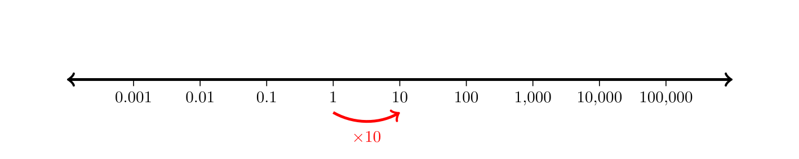

## Math 140 - Spring 2025

Jump to: [Math 140 Homepage](index.html), [Week 1](#week-1-notes), [Week 2](#week-2-notes), [Week 3](#week-3-notes), [Week 4](#week-4-notes), [Week 5](#week-5-notes), [Week 6](#week-6-notes), [Week 7](#week-7-notes), [Week 8](#week-8-notes), [Week 9](#week-9-notes), [Week 10](#week-10-notes), [Week 11](#week-11-notes), [Week 12](#week-12-notes), [Week 13](#week-13-notes), [Week 14](#week-14-notes)

### Week 1 Notes

Day  | Section  | Topic
:-----:|:---:|:-----------------------
Mon, Jan 13  |  | Expressions and equations
Wed, Jan 15  | [1.1][1.1]  | Functions & graphs
Fri, Jan 17  | [1.2][1.2]  | Combining functions

### Mon, Jan 13

Today we introduced the course syllabus. Then we looked at how to solve the following equations algebraically. 

1. Solve $5-2x = -5$. ([video](https://youtu.be/7GShZYevLGU))

1. Solve $\sqrt{3x + 1} = 4$. ([video](https://youtu.be/0gicD4STzpg))

1. Solve $\dfrac{x}{x-1} = 3$. 

After we solved these equations, we also talked about the geometric interpretation of the solutions as places on a graph where a function has a certain y-value. 

4. Graph the line $y = 5 - 2x$ and check where it crosses the line $y = -5$. 

5. Graph the function $y = \sqrt{3x + 1}$. 

### Wed, Jan 15

To make it easier to graph functions, it helps to know some basic graphs.  Here are six you should memorize.

<table cellpadding="20px">
<tr><td>
<svg width="240" height="240" viewBox="-5 -5 10 10">
<!-- x & y axes -->
<g stroke="black" stroke-width="0.025">
 <line x1="-5" y1="0" x2="5" y2="0"/>
 <line x1="0" y1="-5" x2="0" y2="5"/>
</g>
<!-- Axes labels -->
 <g font-size="0.5" font-style="italic">
 <text x="4.4" y="0.6">x</text>
 <text x="-0.6" y="-4.4">y</text>
 </g>
<!-- Axes arrow tips -->
 <polygon points="5,0 4.5,0.15 4.5,-0.15"/>
 <polygon points="0,-5 0.15,-4.5 -0.15,-4.5"/>
<!-- Graph of function -->
<g transform="scale(1,-1)">
  <line x1="-5" y1="-3" x2="5" y2="2" stroke="blue" stroke-width="0.05"/>
</g>
<!-- Function label -->
 <g font-size="0.5" font-style="italic" fill="blue">
 <text x="1.5" y="-3.5">y = mx+b</text>
 </g>
</svg>
</td>

<td>
<svg width="240" height="240" viewBox="-5 -5 10 10">
<!-- x & y axes -->
<g stroke="black" stroke-width="0.025">
 <line x1="-5" y1="0" x2="5" y2="0"/>
 <line x1="0" y1="-5" x2="0" y2="5"/>
</g>
<!-- Axes labels -->
 <g font-size="0.5" font-style="italic">
 <text x="4.4" y="0.6">x</text>
 <text x="-0.6" y="-4.4">y</text>
 </g>
<!-- Axes arrow tips -->
 <polygon points="5,0 4.5,0.15 4.5,-0.15"/>
 <polygon points="0,-5 0.15,-4.5 -0.15,-4.5"/>
<!-- Graph of function -->
<g transform="scale(1,-1)">
<line x1="-5" y1="2" x2="5" y2="2" stroke="blue" stroke-width="0.05"/>
</g>
<!-- Function label -->
 <g font-size="0.5" font-style="italic" fill="blue">
 <text x="1.5" y="-3.5">y = c</text>
 </g>
</svg>
</td>

<td>
<svg width="240" height="240" viewBox="-5 -5 10 10">
<!-- x & y axes -->
<g stroke="black" stroke-width="0.025">
 <line x1="-5" y1="0" x2="5" y2="0"/>
 <line x1="0" y1="-5" x2="0" y2="5"/>
</g>
<!-- Axes labels -->
 <g font-size="0.5" font-style="italic">
 <text x="4.4" y="0.6">x</text>
 <text x="-0.6" y="-4.4">y</text>
 </g>
<!-- Axes arrow tips -->
 <polygon points="5,0 4.5,0.15 4.5,-0.15"/>
 <polygon points="0,-5 0.15,-4.5 -0.15,-4.5"/>
<!-- Function label -->
 <g font-size="0.5" font-style="italic" fill="blue">
 <text x="2.5" y="-3.5">y = x²</text>
 </g>
<!-- Graph of function -->
<g transform="scale(1,-1)">
  <polyline points="-2.00,4.0000 -1.96,3.8416 -1.92,3.6864 -1.88,3.5344 -1.84,3.3856 -1.80,3.2400 -1.76,3.0976 -1.72,2.9584 -1.68,2.8224 -1.64,2.6896 -1.60,2.5600 -1.56,2.4336 -1.52,2.3104 -1.48,2.1904 -1.44,2.0736 -1.40,1.9600 -1.36,1.8496 -1.32,1.7424 -1.28,1.6384 -1.24,1.5376 -1.20,1.4400 -1.16,1.3456 -1.12,1.2544 -1.08,1.1664 -1.04,1.0816 -1.00,1.0000 -0.96,0.9216 -0.92,0.8464 -0.88,0.7744 -0.84,0.7056 -0.80,0.6400 -0.76,0.5776 -0.72,0.5184 -0.68,0.4624 -0.64,0.4096 -0.60,0.3600 -0.56,0.3136 -0.52,0.2704 -0.48,0.2304 -0.44,0.1936 -0.40,0.1600 -0.36,0.1296 -0.32,0.1024 -0.28,0.0784 -0.24,0.0576 -0.20,0.0400 -0.16,0.0256 -0.12,0.0144 -0.08,0.0064 -0.04,0.0016 0.00,0.0000 0.04,0.0016 0.08,0.0064 0.12,0.0144 0.16,0.0256 0.20,0.0400 0.24,0.0576 0.28,0.0784 0.32,0.1024 0.36,0.1296 0.40,0.1600 0.44,0.1936 0.48,0.2304 0.52,0.2704 0.56,0.3136 0.60,0.3600 0.64,0.4096 0.68,0.4624 0.72,0.5184 0.76,0.5776 0.80,0.6400 0.84,0.7056 0.88,0.7744 0.92,0.8464 0.96,0.9216 1.00,1.0000 1.04,1.0816 1.08,1.1664 1.12,1.2544 1.16,1.3456 1.20,1.4400 1.24,1.5376 1.28,1.6384 1.32,1.7424 1.36,1.8496 1.40,1.9600 1.44,2.0736 1.48,2.1904 1.52,2.3104 1.56,2.4336 1.60,2.5600 1.64,2.6896 1.68,2.8224 1.72,2.9584 1.76,3.0976 1.80,3.2400 1.84,3.3856 1.88,3.5344 1.92,3.6864 1.96,3.8416 2.00,4.0000" fill="none" stroke="blue" stroke-width="0.05" /></svg>
</g>
</svg>
</td></tr>

<tr><td>
<svg width="240" height="240" viewBox="-5 -5 10 10">
<!-- x & y axes -->
<g stroke="black" stroke-width="0.025">
 <line x1="-5" y1="0" x2="5" y2="0"/>
 <line x1="0" y1="-5" x2="0" y2="5"/>
</g>
<!-- Axes labels -->
 <g font-size="0.5" font-style="italic">
 <text x="4.4" y="0.6">x</text>
 <text x="-0.6" y="-4.4">y</text>
 </g>
<!-- Axes arrow tips -->
 <polygon points="5,0 4.5,0.15 4.5,-0.15"/>
 <polygon points="0,-5 0.15,-4.5 -0.15,-4.5"/>
<!-- Function label -->
 <g font-size="0.5" font-style="italic" fill="blue">
 <text x="1.5" y="-3.5">y = |x|</text>
 </g>
<!-- Graph of function -->
<g transform="scale(1,-1)">
  <polyline points="-4,4 0,0 4,4" fill="none" stroke="blue" stroke-width="0.05"/>
</g>
</svg>
</td>

<td>
<svg width="240" height="240" viewBox="-5 -5 10 10">
<!-- x & y axes -->
<g stroke="black" stroke-width="0.025">
 <line x1="-5" y1="0" x2="5" y2="0"/>
 <line x1="0" y1="-5" x2="0" y2="5"/>
</g>
<!-- Axes labels -->
 <g font-size="0.5" font-style="italic">
 <text x="4.4" y="0.6">x</text>
 <text x="-0.6" y="-4.4">y</text>
 </g>
<!-- Axes arrow tips -->
 <polygon points="5,0 4.5,0.15 4.5,-0.15"/>
 <polygon points="0,-5 0.15,-4.5 -0.15,-4.5"/>
<!-- Function label -->
 <g font-size="0.5" font-style="italic" fill="blue">
 <text x="2.5" y="-3.5">y = 1/x</text>
 </g>
<!-- Graph of function -->
<g transform="scale(1,-1)">
<polyline points=" 0.25,4.000 0.30,3.333 0.35,2.857 0.40,2.500 0.45,2.222 0.50,2.000 0.55,1.818 0.60,1.667 0.65,1.538 0.70,1.429 0.75,1.333 0.80,1.250 0.85,1.176 0.90,1.111 0.95,1.053 1.00,1.000 1.05,0.952 1.10,0.909 1.15,0.870 1.20,0.833 1.25,0.800 1.30,0.769 1.35,0.741 1.40,0.714 1.45,0.690 1.50,0.667 1.55,0.645 1.60,0.625 1.65,0.606 1.70,0.588 1.75,0.571 1.80,0.556 1.85,0.541 1.90,0.526 1.95,0.513 2.00,0.500 2.05,0.488 2.10,0.476 2.15,0.465 2.20,0.455 2.25,0.444 2.30,0.435 2.35,0.426 2.40,0.417 2.45,0.408 2.50,0.400 2.55,0.392 2.60,0.385 2.65,0.377 2.70,0.370 2.75,0.364 2.80,0.357 2.85,0.351 2.90,0.345 2.95,0.339 3.00,0.333 3.05,0.328 3.10,0.323 3.15,0.317 3.20,0.313 3.25,0.308 3.30,0.303 3.35,0.299 3.40,0.294 3.45,0.290 3.50,0.286 3.55,0.282 3.60,0.278 3.65,0.274 3.70,0.270 3.75,0.267 3.80,0.263 3.85,0.260 3.90,0.256 3.95,0.253 4.00,0.250 4.05,0.247 4.10,0.244 4.15,0.241 4.20,0.238 4.25,0.235 4.30,0.233 4.35,0.230 4.40,0.227 4.45,0.225 4.50,0.222 4.55,0.220 4.60,0.217 4.65,0.215 4.70,0.213 4.75,0.211 4.80,0.208 4.85,0.206 4.90,0.204 4.95,0.202" fill="none" stroke="blue" stroke-width="0.05"/>
<polyline points="-5.00,-0.200 -4.95,-0.202 -4.90,-0.204 -4.85,-0.206 -4.80,-0.208 -4.75,-0.211 -4.70,-0.213 -4.65,-0.215 -4.60,-0.217 -4.55,-0.220 -4.50,-0.222 -4.45,-0.225 -4.40,-0.227 -4.35,-0.230 -4.30,-0.233 -4.25,-0.235 -4.20,-0.238 -4.15,-0.241 -4.10,-0.244 -4.05,-0.247 -4.00,-0.250 -3.95,-0.253 -3.90,-0.256 -3.85,-0.260 -3.80,-0.263 -3.75,-0.267 -3.70,-0.270 -3.65,-0.274 -3.60,-0.278 -3.55,-0.282 -3.50,-0.286 -3.45,-0.290 -3.40,-0.294 -3.35,-0.299 -3.30,-0.303 -3.25,-0.308 -3.20,-0.313 -3.15,-0.317 -3.10,-0.323 -3.05,-0.328 -3.00,-0.333 -2.95,-0.339 -2.90,-0.345 -2.85,-0.351 -2.80,-0.357 -2.75,-0.364 -2.70,-0.370 -2.65,-0.377 -2.60,-0.385 -2.55,-0.392 -2.50,-0.400 -2.45,-0.408 -2.40,-0.417 -2.35,-0.426 -2.30,-0.435 -2.25,-0.444 -2.20,-0.455 -2.15,-0.465 -2.10,-0.476 -2.05,-0.488 -2.00,-0.500 -1.95,-0.513 -1.90,-0.526 -1.85,-0.541 -1.80,-0.556 -1.75,-0.571 -1.70,-0.588 -1.65,-0.606 -1.60,-0.625 -1.55,-0.645 -1.50,-0.667 -1.45,-0.690 -1.40,-0.714 -1.35,-0.741 -1.30,-0.769 -1.25,-0.800 -1.20,-0.833 -1.15,-0.870 -1.10,-0.909 -1.05,-0.952 -1.00,-1.000 -0.95,-1.053 -0.90,-1.111 -0.85,-1.176 -0.80,-1.250 -0.75,-1.333 -0.70,-1.429 -0.65,-1.538 -0.60,-1.667 -0.55,-1.818 -0.50,-2.000 -0.45,-2.222 -0.40,-2.500 -0.35,-2.857 -0.30,-3.333 -0.25,-4.000" fill="none" stroke="blue" stroke-width="0.05"/>
</g>
</svg>
</td>

<td>
<svg width="240" height="240" viewBox="-5 -5 10 10">
<!-- x & y axes -->
<g stroke="black" stroke-width="0.025">
 <line x1="-5" y1="0" x2="5" y2="0"/>
 <line x1="0" y1="-5" x2="0" y2="5"/>
</g>
<!-- Axes labels -->
 <g font-size="0.5" font-style="italic">
 <text x="4.4" y="0.6">x</text>
 <text x="-0.6" y="-4.4">y</text>
 </g>
<!-- Axes arrow tips -->
 <polygon points="5,0 4.5,0.15 4.5,-0.15"/>
 <polygon points="0,-5 0.15,-4.5 -0.15,-4.5"/>
<!-- Function label -->
 <g font-size="0.5" font-style="italic" fill="blue">
 <text x="2.5" y="-2.5">y = √x</text>
 </g>
<!-- Graph of function -->
<g transform="scale(1,-1)">
  <polyline points="0.00,0.000 0.05,0.224 0.10,0.316 0.15,0.387 0.20,0.447 0.25,0.500 0.30,0.548 0.35,0.592 0.40,0.632 0.45,0.671 0.50,0.707 0.55,0.742 0.60,0.775 0.65,0.806 0.70,0.837 0.75,0.866 0.80,0.894 0.85,0.922 0.90,0.949 0.95,0.975 1.00,1.000 1.05,1.025 1.10,1.049 1.15,1.072 1.20,1.095 1.25,1.118 1.30,1.140 1.35,1.162 1.40,1.183 1.45,1.204 1.50,1.225 1.55,1.245 1.60,1.265 1.65,1.285 1.70,1.304 1.75,1.323 1.80,1.342 1.85,1.360 1.90,1.378 1.95,1.396 2.00,1.414 2.05,1.432 2.10,1.449 2.15,1.466 2.20,1.483 2.25,1.500 2.30,1.517 2.35,1.533 2.40,1.549 2.45,1.565 2.50,1.581 2.55,1.597 2.60,1.612 2.65,1.628 2.70,1.643 2.75,1.658 2.80,1.673 2.85,1.688 2.90,1.703 2.95,1.718 3.00,1.732 3.05,1.746 3.10,1.761 3.15,1.775 3.20,1.789 3.25,1.803 3.30,1.817 3.35,1.830 3.40,1.844 3.45,1.857 3.50,1.871 3.55,1.884 3.60,1.897 3.65,1.910 3.70,1.924 3.75,1.936 3.80,1.949 3.85,1.962 3.90,1.975 3.95,1.987 4.00,2.000 4.05,2.012 4.10,2.025 4.15,2.037 4.20,2.049 4.25,2.062 4.30,2.074 4.35,2.086 4.40,2.098 4.45,2.110 4.50,2.121 4.55,2.133 4.60,2.145 4.65,2.156 4.70,2.168 4.75,2.179 4.80,2.191 4.85,2.202 4.90,2.214 4.95,2.225" fill="none" stroke="blue" stroke-width="0.05" /></svg>
</g>
</svg>
</td></tr>
</table>

We used these examples to help graph the following in class:

1. $y = 5|x|$

2. $y = x^2 + 3$ ([video](https://youtu.be/tfF_-Db8iSA?t=2658))

3. $y = \dfrac{1}{x-2}$ ([video](https://youtu.be/tfF_-Db8iSA?t=3391))

<!--4. $y = |x-4|$

5. $y = -x^2$-->

4. $y = \sqrt{4 - x}$

After those graphs, we talked about function notation.  Both $y = x^2$ and $f(x) = x^2$ to mean the same thing.  But the notation $f(x) = x^2$ emphasizes that $f$ is a function of the $x$ variable.  Be careful not to confuse function notation $f(5)$ with multiplication $(2)(5) = 10$.  Even though the notation looks the same, they are not the same!  

We did these examples. 

<!--7. Suppose that the cost for a business to manufacture $x$ watering pails is $C(x)$.  Explain in words what the equation $C(5{,}000) = 6{,}000$ means. (Move to homework) -->

5. If $f(x) = x^2$ and $g(x) = x+5$, find $f(g(4))$ and $g(g(4))$.  

6. Find $3 f(2) + 4 g(-1)$.

7. The quantity of gasoline $Q$ sold by a gas station is a function of the price $p$ that the owner sets.  Here is a graph of the function $Q = Q(p)$. 

    

    
    

    a. Use the graph above to find $Q(3)$.
    b. Solve $Q(p) = 3000$ for $p$.   
    c. If $Q(5) = 600$, explain in English what that means. 

8. The function $f(x) = \frac{1}{2}(x + \frac{2}{x})$ can be used to approximate $\sqrt{2}$.  Calculate $f(2)$ and $f(f(2))$.  

<!--
10. The number of large animals that can be supported by a square kilometer of land is a function $N(m)$ that depends on the average mass ($m$) in kilograms of the animals. If $N(50) = 5$, what does that mean in words?  

11. If $C(p)$ is the amount of carbon monoxide in the air, measured in parts per million (ppm), as a function of the number of residents $p$ in a town (measured in thousands of people).  If the population of the town is growing so that $p(t) = 10 + 0.1 t^2$ where $t$ is the number of years from now, then find the formula for a function that will predict the amount of carbon monoxide in the air $t$ years from now. 
-->

### Fri, Jan 17

We started talking about different ways you can combine functions.  We did the following exercises.

1. Use the graph below to compute $g(f(-5))$. ([video](https://youtu.be/oORnGaJp1pk))

</img>

2. ([Exercise 1.2# 29](https://people.hsc.edu/faculty-staff/blins/books/AppliedCalculusCalawayHoffmanLippman.pdf#page=28)) The function $D(p)$ gives the number of items that will be demanded when the price is $p$. The
production cost, $C(x)$ is the cost of producing $x$ items. To determine the cost of production
when the price is $6, you would do which of the following?

    a. Evaluate $D(C(6))$
    b. Evaluate $C(D(6))$
    c. Solve $D(C(x)) = 6$
    d. Solve $C(D(p)) = 6$ 

3. Continuing the previous problem, profit is revenue minus cost, and revenue is price times quantity sold.  Using the functions $C$ and $D$, write down formulas for revenue and for profit. 

After we talked about function composition, we switched to a quick review of linear functions. You need to know these formulas for linear functions:

* **Slope-Intercept Form** $y = mx + b$
* **Point-Slope Form** $y-y_0 = m(x - x_0)$

You also need to understand slope very well:

* **Slope** $m = \dfrac{\text{rise}}{\text{run}} = \dfrac{\Delta y}{\Delta x} = \dfrac{ y_2 - y_1}{x_2 - x_1}$

4. A line passes through $(-1, 6)$ and $(5, -4)$.  Find an equation for the line. ([video](https://youtu.be/XMJ72mtMn4)) 

### Week 2 Notes

Day  | Section  | Topic
:-----:|:---:|:-----------------------
Mon, Jan 20  |  | MLK day - no class
Wed, Jan 22  | [1.3][1.3]  | Linear functions
Fri, Jan 24  | [1.3][1.3]  | Slope

### Wed, Jan 22 

Today we talked about linear equation word problems. 

1. Someone is hiking up a mountain.  They start at an elevation of 1200 meters and climb at a constant rate.  After 4 hours, they are at an elevation of 1700 meters. Find a formula for their elevation $y$ as a function of the time $x$ in hours since they started hiking. ([video](https://youtu.be/hBpI9IfmMKg))

2. Find a formula to convert Celsius to Fahrenheit.

3. Find a formula to convert Fahrenheit to Celsius.

<!--
4. Find an equation for the line passing through $(-1,4)$ and $(3,-4)$.
-->

4. Find the slope and $y$ intercept of the equation $5x-2y = 8$. ([video](https://youtu.be/voN3PBPEy2A))

5. Joe imports coffee.  He can import arabica beans for $6 per pound and he can import robusta beans for $5 per pound.  Suppose he spends $1500 to import $x$ pounds of arabica beans and $y$ pounds of robusta beans.  

    a. Find an equation that relates $x$ and $y$.
    b. What is the $x$-intercept for this equation, and what does it mean?
    c. What is the $y$-intercept for this equation, and what does it mean?
    d. What is the slope of this equation, and what does it mean?

<!--
5. Find a formula for a line with slope 2 passing through $(2,5)$.  

6. $\dfrac{x+3}{4} = 3$

7. $\dfrac{3}{x} - 5 = \dfrac{2}{x}$

8. Pressure underwater (measured in ATMs) is a linear function of the depth $x$ in meters given by $P = \frac{1}{10}x+1$.  What is the slope and what are its units?

9. The Virginia state income tax for people making over $17,000 is $T = 720 + 0.0575 (I - 17000)$.  Graph this linear function.  What is the slope?  What does the input variable $I$ represent?  What about the output variable $T$?
-->

6. The Virginia state income tax for people making over $17,000 is $720 plus 5.75% of all income over $17,000. Find a formula for the tax owed $y$ as a function of income $x$. 

### Fri, Jan 24

1. Solve the system of equations below. ([video](https://youtu.be/FgX3gLDDlzI))

$$ y = 2x$$
$$3x + y = 30$$

2. Solve the system of equations below. ([video](https://youtu.be/cblHUeq3bkE))

$$3x + 6y = 12$$
$$5x - 8y = 2$$

3. Suppose that the quantity of beef supplied ($Q_S$) and demanded ($Q_D$) are given by the following functions of price.  Find the equilibrium price and quantity. ([video](https://youtu.be/9n-xMt-Sj3A))

$$Q_S = -40 + 30P$$
$$Q_D = 180 - 25P$$

4. Leo has 4 more keys than Haley on his keychain.  Together they have 18 keys total.  How many keys does Haley have? ([video](https://youtu.be/2EcUlgR5ksY))

5. Solve the system of equations

$$y = \dfrac{6}{x}$$
$$y = 2 - \dfrac{5}{x}$$

### Week 3 Notes

Day  | Section  | Topic
:-----:|:---:|:-----------------------
Mon, Jan 27  | [1.3][1.3]  | Systems of linear equations
Wed, Jan 29  | [1.4][1.4]  | Exponents
Fri, Jan 31  | [1.4][1.4]  | Exponents - con’d

### Mon, Jan 27

Today we started talking about [exponent rules](AlgebraRules.pdf#page=2). There are a bunch of rules, but they all boil down to three simple ideas:

#### Understanding Exponents

* Powers represent repeated multiplication: $x^m = \underbrace{x \cdot x \cdot \ldots \cdot x}_{m \text{ copies}}$. 

* Negative powers represent reciprocals: $x^{-m} = \dfrac{1}{x^m}$.

* Radicals (square roots, cube roots, etc.) are fractional powers $\sqrt[n]{x} = x^{1/n}$. 

 

1. Simplify $\left( \dfrac{x^7 y^3}{x^2 y} \right)^4$. ([video](https://youtu.be/vQbwjlbJ0Vo))

2. Simplify $(a^3 b)^4 (a b^6)^2$. ([video](https://youtu.be/vQbwjlbJ0Vo?t=333))

3. Simplify $(b^{-3} c^{-7})^{-2} (b^3 c^{-2})^{-3}$. ([video](https://youtu.be/vQbwjlbJ0Vo?t=485))

4. Simplify $16^{1/4} + 16^{-1/4}$. 

5. Simplify $\sqrt{x^2 + x^2 + x^2 + x^2}$. What do you think the most common mistake is here?

6. Simplify $4^{5/2}$.

7. Simplify $\sqrt[3]{64 z^6}$. ([video](https://youtu.be/KBP5EKcG1s4))

<!-- We didn't get to these problems about solving exponential equations:

8. Solve $(x^{-1} + 2^{-1})^{-1} = \frac{1}{3}$. 

9. Solve $\dfrac{2^{57}}{2^x} = 8$. 
-->

### Wed, Feb 29

Today we looked at using the exponent rules to help solve equations. 

1. Solve $(x^{-1} + 2^{-1})^{-1} = \frac{1}{3}$. 

2. Solve $\dfrac{2^{57}}{2^x} = 8$. 

3. Solve $3^{x+2} = 9^{2x - 3}$. ([video](https://youtu.be/9tutJ5xrRwg)) 

4. Solve $x^{-5/3} = \frac{1}{32}$. ([video](https://youtu.be/aA2b1bu0Q2c)) 

5. Solve $2^{\sqrt{x}} = 8^x$. ([video](https://youtu.be/9-sHxZA0dqU))

This last problem opens a can of worms, since it turns into a 2nd degree polynomial. A **polynomial** is any sum of terms that combine a whole number power of $x$ multiplied by a number called a **coefficient**.  <!--The **degree** of a polynomial is the highest power of $x$.  For example, 
$$x^3 + 4x^2 - 6x + 7$$
is a 3rd degree polynomial.  Its coefficients are $1$, $4$, $-6$, and $7$. -->

Solving equations involving polynomials requires a non-intuitive technique: 

#### Solving Polynomial Equations
 
* Move every term to one side so that the other side is zero. 
* Factor the polynomial expression.  

The solutions are the **roots**, i.e., the places where each factor is zero.

Here is another polynomial equation:

6. Solve $10x^2 - 6x = 0$. ([video](https://youtu.be/E3nUOaXMBSk))

<!-- 
We didn't get to this last example: 

7. Solve $\sqrt{3x + 36} + 6 = x$. ([video](https://youtu.be/XPofycvymFk))

-->

### Fri, Jan 31

Here's an example we didn't get to last time. 

1. Solve $\sqrt{3x + 36} + 6 = x$. ([video](https://youtu.be/XPofycvymFk)) <!-- Note to self: This is NOT A GOOD EXAMPLE! Because one of the solutions corresponds to the negative square root, not the positive square root. The video does at least check that one of the solutions is extraneous.  -->

After some algebra, this turns into the equation $x^2 - 15x = 0$.  We can factor that by dividing out the common factor of $x$.  There is a second more complex kind of factoring that involves un-FOIL-ing a polynomial.  Recall that FOIL stands for First-Outside-Inside-Last, which is a mnemonic to remember how to multiply out expressions like:
$$(x+a)(x+b) = x^2 + bx + ax + ab = x^2 + (a+b)x + ab.$$
When you factor a polynomial with leading term $x^2$, you need to find factors of the constant term that add up to the middle coefficient. Here are some examples we did in class. 

2. Factor $x^2 + 15x + 50$. ([video](https://youtu.be/eF6zYNzlZKQ?t=278))

3. Factor $x^2 - 11x + 24$. ([video](https://youtu.be/eF6zYNzlZKQ?t=368))

4. Solve $x^2 = 3x + 10$.  ([video](https://youtu.be/D3a8NnpQ2vU))

We didn't get to these last two examples in class, but they are good extra practice: 

5. Where does the line $y = x+1$ intersect the parabola $y = x^2-1$?  ([video](https://youtu.be/S8NujgvvznQ))

6. Solve $(x+2)(x-5) = 8$

### Week 4 Notes

Day  | Section  | Topic
:-----:|:---:|:-----------------------
Mon, Feb 3  | [1.5][1.5]  | Quadratics
Wed, Feb 5  | [1.6][1.6]  | Polynomial & rational functions
Fri, Feb 7  | [1.7][1.7]  | Exponential functions

### Mon, Feb 3

We did this in-class workshop: 

* **Workshop**: [Parabolas](Parabolas.pdf)

### Wed, Feb 5 

We looked at some more examples of factoring to solve polynomial equations. 

1. $-0.1x^2 +  0.7x + 6 = 0$. (This was from the workshop last time.)

2. $4x^6 + 4 x^5 - 24 x^4 = 0$. ([video](https://youtu.be/PHc8B6MuE8s))

A rational function is a function that can be expressed using polynomials and reciprocals of polynomials.  You can use the same techniques we've already used to solve equations involving rational expressions. 

3. $x + 2 = \dfrac{15}{x}$. 

After that, we talked about how to solve inequalities. We started with simple examples like: 

4. Solve $x + 4 > 3$ and $-2x \ge 4$. 

Then we moved on to harder examples. 

4. Solve $x^3 - 3x^2 < 4x$.  ([video](https://youtu.be/1fCXjn9WoSc))

5. Solve $\dfrac{2}{x-3} \ge 1$. ([video](https://youtu.be/OPZAHBhPclc))

<!-- 6. Solve $\dfrac{(x-3)(x+1)^2}{(x-1)} > 0$.-->

6. Solve $x+3 > \dfrac{4}{x}$. 

**Strategy for Solving Inequalities.**

1. **Find crossings and discontinuities.** Solve for equality to find the crossing points, and also mark the bad points where the functions have vertical asymptotes. 

2. **Check subintervals**. The x-values above divide the number line into subintervals.  For each subinterval, test a point to see if the original inequality is true.  It helps to either have a factored expression to compare with zero or a graph to check. 

### Fri, Feb 7

Today we talked about exponential growth.  We started with exponential functions.  
$$f(x) = C_0 b^x$$
where $C_0$ is the **initial value** and $b > 0$ is a constant called the **base**. The most common bases are base-10, base-2, and the natural exponential base which is $e = 2.71828\ldots$ which is also known as **Euler's number**.  

1. Graph the function $y = 2^x$.  

Exponential growth/decay is what you get when you multiply by the same **growth factor** every step.  This is different than linear growth where you add the same constant rate of change every step.  

2. For each sequence below, determine if it a linear or exponential pattern.  If it is linear, what is the rate of change?  If it is exponential, what is the growth factor?    

    a. $3, 5, 7, 9, 11, \ldots$
    b. $400, 200, 100, 50, 25, \ldots$
    c. $18, 12, 8, \tfrac{16}{3}, \tfrac{32}{9}, \ldots$

3. According to Newton's law of cooling, the temperature difference between a small object and its surroundings changes exponentially.  Suppose a cup of coffee is initially $60^\circ$C above room temperature.  If its temperature has decreased to only $50^\circ$C above room temperature ten minutes later, then what will the temperature be after 20 minutes?  What about after 30 minutes? What is the growth factor?  

4. Suppose that the median house price in a city has been growing exponentially for some time.  If the median price was $\$200{,}000$ in the year 2000 and $\$260{,}000$ in 2010,  then what were prices in 2020?  What are prices now?  Find an equation for the price as a function of time.  

### Week 5 Notes

Day  | Section  | Topic
:-----:|:---:|:-----------------------
Mon, Feb 10  | [1.7][1.7]  | Exponential functions - con'd
Wed, Feb 12  |  | Review
Fri, Feb 14  |  | Midterm 1

### Mon, Feb 10

One of the most common ways to talk about growth is with percentages. This type of growth is called **relative growth** because it is stated relative to the size of the population that is growing with a percentage. For example, 5% growth of the United States population would be a lot, because the US population is large. The best way to understand relative growth is to convert percentage increases and decreases into growth factors.

$$\mathbf{growth~factor} = 100\% + \text{percent change}.$$

A growth factor is also the ratio of the new amount divided by the old amount.

$$\mathbf{growth~factor} = \dfrac{\text{ new amount }}{\text{ old amount }}.$$

1. The US population was 310 million in 2010. It was 330 million in 2020.  What is the growth factor and the percent change in the US population from 2010 to 2020? 

2. What would the growth factor and percent change be if the population were to decline from 330 million in 2020 to 320 million in 2030?

The tricky thing about percent growth is that it is not additive.  If something grows by 30% for two years in a row, that is not 60% total growth.  You have to multiply the growth factors.  

3. If something grows by 30% one year and then 30% again the next year, how much did it grow total as a percentage?  

4. If I have $100 invested and its value grows by 25% in the first year and shrinks 25% in the second year, then how much money is left after two years?  ([video](https://youtu.be/4oeoIOan_h4?t=322))

Since you multiply growth factors instead of adding percent changes, you also have to take roots to break growth factors into equal amounts.  

5. What was the (average) annual percent population change in the United States between 2010 and 2020? 

6. If that rate of population growth continues, what is the equation for the population of the United States as a function of time?  

7. If a savings account earns 2% interest every year, and you put $100 in the bank and leave it there for 10 years, how much money will you have?  What about after $x$ years?

8. Which is better, to invest in a mutual fund that grows by 10% every year, or a fund that grows by 0.8% every month?

Here is one more example that we didn't have time for in class:

9. Last time we talked about a cup of coffee that cools exponentially.  If it cools from $60^\circ$C above room temperature to $50^\circ$C in 10 minutes, then what is the percent change in temperature every minute?  

### Wed, Feb 12

Today we went over the [midterm 1 review problems](midterm1review.pdf) and a few problems from [homework 5](HW/HW5.pdf).

### Week 6 Notes

Day  | Section  | Topic
:-----:|:---:|:-----------------------
Mon, Feb 17  | [1.8][1.8]  | Logarithmic functions
Wed, Feb 19  | [1.8][1.8]  | Logarithmic functions - con'd
Fri, Feb 21  | [2.2][2.2]  | The derivative

### Mon, Feb 17

Today we introduced **logarithms**.  We started by talking about **logarithmic scales**, which are number lines where the numbers are spaced by multiplication instead of addition. 

</img>
<figcaption>A base-2 logarithmic scale</figcaption>

</img>
<figcaption>A base-10 logarithmic scale</figcaption>

Logarithmic scales help understand the logarithm function.  

<!--
We started by talking about base-10 logarithms which tell you the order of magnitude of a number.  

<table class="bordered">
<tr><th>$x$</th><td>0.01</td><td>0.1</td><td>1</td><td>10</td><td>100</td><td>1000</td><td>10,000</td></tr>
<tr><th>$\log(x)$</th><td>$-2$</td><td>$-1$</td><td>0</td><td>1</td><td>2</td><td>3</td><td>4</td></tr>
</table>

Here is the definition of the logarithm for any base.
-->

**What are Logarithms?**

The **logarithm function** $\log_b(x)$ can be understood two ways:

1. $\log_b(x)$ equals the **number of steps** $x$ is away from 1 on a (base-b) log-scale.

2. $\log_b(x)$ equals the **power of b** needed to get $x$.  

1. Find $\log_2 16$. ([video](https://youtu.be/Z5myJ8dg_rM))

1. Find $\log_3 81$. ([video](https://youtu.be/Z5myJ8dg_rM?t=134))

1. Find $\log_{100} 1$. ([video](https://youtu.be/Z5myJ8dg_rM?t=353))

1. Find $\log_2 \left( \frac{1}{64} \right)$.  ([video](https://youtu.be/z9sJ3uusO98))

1. Find $\log_{10} (\sqrt{10}).$

Logarithms are useful because they convert difficult multiplication/division problems into easier addition/subtraction problems.  They also convert exponential patterns into linear patterns.  

**Properties of Logarithms**

1. Logarithms convert multiplication to addition $\log(xy) = \log(x) + \log(y)$. 
1. Logarithms convert division to subtraction $\log(x/y) = \log(x) - \log(y)$. 
1. Logarithms let you pull down powers $\log(x^p) = p \log(x)$. 

The most important base for exponential and logarithmic functions in calculus is the number $e \approx 2.71828$.  This is the **natural base** for the logarithm and exponential function for reasons that we'll see later when we talk about derivatives.  We write $\ln(x)$ to denote the base-e logarithm.  

6. What are $\ln(e^x)$ and $e^{\ln x}$?  

One of the most important applications of logarithms is that they let you solve equations with variables in the exponent. 

7. Solve $e^x = 2$.  

8. Solve $3^x = 2^{x+1}$ ([video](https://youtu.be/tJuTsq2TMm4))

Here is one more good exercise using logarithms that we didn't have time for:

9. A lumber company has 1,200,000 trees. They plan to harvest 7% of the remaining trees each year.  How long until they have harvested half of the trees?  ([video](https://youtu.be/1XQHko0_Y-k?t=588))

### Wed, Feb 19

Class is canceled today because of the snow, but I recommend starting [homework 6](HW/HW6.pdf) if you haven't already.  Here are some video links for problems similar to the ones on the homework. 

1. Which of the following equations would you need a logarithm to solve?  (<https://www.youtube.com/shorts/2MT89tcjnQo))

    a. $3^x = 9$
    b. $3^x = 27$
    c. $3^x = 10$

1. Solve $10^{2t-3} = 7$. ([video](https://youtu.be/R443Db-wJ5o))

1. Solve $3^x = 7^{x+2}$. ([video](https://youtu.be/32GJXjJ6nf0))

<!--1. Health insurance premiums are increasing by 7\% per year.  How long until they double?  -->

4. How long would it take an investment of $4,000 to grow to $20,000 if it grows by 7% each year? ([video](https://youtu.be/lWXMkcCUhkA))

5. A lumber company has 1,200,000 trees. They plan to harvest 7% of the remaining trees each year.  How long until they have harvested half of the trees?  ([video](https://youtu.be/1XQHko0_Y-k?t=588))

### Fri, Feb 21

We started by going over problems #5 and #7 from [Homework 6](HW/HW6.pdf).  We also talked about the shape of the graph of a logarithm function.  You should memorize the graph of the natural exponential and logarithm functions.  

<table cellpadding="20px">
<tr><td>
<svg width="240" height="240" viewBox="-5 -5 10 10">
<!-- x & y axes -->
<g stroke="black" stroke-width="0.05">
 <line x1="-5" y1="0" x2="5" y2="0"/>
 <line x1="0" y1="-5" x2="0" y2="5"/>
</g>
<!-- Axes labels -->
 <g font-size="0.5" font-style="italic">
 <text x="4.4" y="0.6">x</text>
 <text x="-0.6" y="-4.4">y</text>
 </g>
<!-- Axes arrow tips -->
 <polygon points="5,0 4.5,0.15 4.5,-0.15"/>
 <polygon points="0,-5 0.15,-4.5 -0.15,-4.5"/>
<!-- Graph of function -->
<g transform="scale(1,-1)">
  <polyline points="-4.00, 0.02 -3.95, 0.02 -3.90, 0.02 -3.85, 0.02 -3.80, 0.02 -3.75, 0.02 -3.70, 0.02 -3.65, 0.03 -3.60, 0.03 -3.55, 0.03 -3.50, 0.03 -3.45, 0.03 -3.40, 0.03 -3.35, 0.04 -3.30, 0.04 -3.25, 0.04 -3.20, 0.04 -3.15, 0.04 -3.10, 0.05 -3.05, 0.05 -3.00, 0.05 -2.95, 0.05 -2.90, 0.06 -2.85, 0.06 -2.80, 0.06 -2.75, 0.06 -2.70, 0.07 -2.65, 0.07 -2.60, 0.07 -2.55, 0.08 -2.50, 0.08 -2.45, 0.09 -2.40, 0.09 -2.35, 0.10 -2.30, 0.10 -2.25, 0.11 -2.20, 0.11 -2.15, 0.12 -2.10, 0.12 -2.05, 0.13 -2.00, 0.14 -1.95, 0.14 -1.90, 0.15 -1.85, 0.16 -1.80, 0.17 -1.75, 0.17 -1.70, 0.18 -1.65, 0.19 -1.60, 0.20 -1.55, 0.21 -1.50, 0.22 -1.45, 0.23 -1.40, 0.25 -1.35, 0.26 -1.30, 0.27 -1.25, 0.29 -1.20, 0.30 -1.15, 0.32 -1.10, 0.33 -1.05, 0.35 -1.00, 0.37 -0.95, 0.39 -0.90, 0.41 -0.85, 0.43 -0.80, 0.45 -0.75, 0.47 -0.70, 0.50 -0.65, 0.52 -0.60, 0.55 -0.55, 0.58 -0.50, 0.61 -0.45, 0.64 -0.40, 0.67 -0.35, 0.70 -0.30, 0.74 -0.25, 0.78 -0.20, 0.82 -0.15, 0.86 -0.10, 0.90 -0.05, 0.95 -0.00, 1.00 0.05, 1.05 0.10, 1.11 0.15, 1.16 0.20, 1.22 0.25, 1.28 0.30, 1.35 0.35, 1.42 0.40, 1.49 0.45, 1.57 0.50, 1.65 0.55, 1.73 0.60, 1.82 0.65, 1.92 0.70, 2.01 0.75, 2.12 0.80, 2.23 0.85, 2.34 0.90, 2.46 0.95, 2.59 1.00, 2.72 1.05, 2.86 1.10, 3.00 1.15, 3.16 1.20, 3.32 1.25, 3.49 1.30, 3.67 1.35, 3.86 1.40, 4.06 1.45, 4.26 1.50, 4.48 1.55, 4.71 1.60, 4.95 1.65, 5.21 1.70, 5.47 1.75, 5.75 1.80, 6.05 1.85, 6.36 1.90, 6.69 1.95, 7.03 2.00, 7.39 2.05, 7.77 2.10, 8.17 2.15, 8.58 2.20, 9.03 2.25, 9.49 2.30, 9.97 2.35, 10.49 2.40, 11.02 2.45, 11.59 2.50, 12.18 2.55, 12.81 2.60, 13.46 2.65, 14.15 2.70, 14.88 2.75, 15.64 2.80, 16.44 2.85, 17.29 2.90, 18.17 2.95, 19.11 3.00, 20.09 3.05, 21.12 3.10, 22.20 3.15, 23.34 3.20, 24.53 3.25, 25.79 3.30, 27.11 3.35, 28.50 3.40, 29.96 3.45, 31.50 3.50, 33.12 3.55, 34.81 3.60, 36.60 3.65, 38.47 3.70, 40.45 3.75, 42.52 3.80, 44.70 3.85, 46.99 3.90, 49.40 3.95, 51.94 4.00, 54.60" fill="none" stroke="blue" stroke-width="0.10" />
</g>
<!-- Function label -->
 <g font-size="0.5" font-style="italic" fill="blue">
 <text x="2.0" y="-3.5">y = eˣ</text>
 </g>
</svg>
</td>

<td>
<svg width="240" height="240" viewBox="-5 -5 10 10">
<!-- x & y axes -->
<g stroke="black" stroke-width="0.05">
 <line x1="-5" y1="0" x2="5" y2="0"/>
 <line x1="0" y1="-5" x2="0" y2="5"/>
</g>
<!-- Axes labels -->
 <g font-size="0.5" font-style="italic">
 <text x="4.4" y="0.6">x</text>
 <text x="-0.6" y="-4.4">y</text>
 </g>
<!-- Axes arrow tips -->
 <polygon points="5,0 4.5,0.15 4.5,-0.15"/>
 <polygon points="0,-5 0.15,-4.5 -0.15,-4.5"/>
<!-- Graph of function -->
<g transform="scale(1,-1)">
  <polyline points="0.02, -4.00 0.05, -3.00 0.10, -2.30 0.15, -1.90 0.20, -1.61 0.25, -1.39 0.30, -1.20 0.35, -1.05 0.40, -0.92 0.45, -0.80 0.50, -0.69 0.55, -0.60 0.60, -0.51 0.65, -0.43 0.70, -0.36 0.75, -0.29 0.80, -0.22 0.85, -0.16 0.90, -0.11 0.95, -0.05 1.00, 0.00 1.05, 0.05 1.10, 0.10 1.15, 0.14 1.20, 0.18 1.25, 0.22 1.30, 0.26 1.35, 0.30 1.40, 0.34 1.45, 0.37 1.50, 0.41 1.55, 0.44 1.60, 0.47 1.65, 0.50 1.70, 0.53 1.75, 0.56 1.80, 0.59 1.85, 0.62 1.90, 0.64 1.95, 0.67 2.00, 0.69 2.05, 0.72 2.10, 0.74 2.15, 0.77 2.20, 0.79 2.25, 0.81 2.30, 0.83 2.35, 0.85 2.40, 0.88 2.45, 0.90 2.50, 0.92 2.55, 0.94 2.60, 0.96 2.65, 0.97 2.70, 0.99 2.75, 1.01 2.80, 1.03 2.85, 1.05 2.90, 1.06 2.95, 1.08 3.00, 1.10 3.05, 1.12 3.10, 1.13 3.15, 1.15 3.20, 1.16 3.25, 1.18 3.30, 1.19 3.35, 1.21 3.40, 1.22 3.45, 1.24 3.50, 1.25 3.55, 1.27 3.60, 1.28 3.65, 1.29 3.70, 1.31 3.75, 1.32 3.80, 1.34 3.85, 1.35 3.90, 1.36 3.95, 1.37 4.00, 1.39 4.05, 1.40 4.10, 1.41 4.15, 1.42 4.20, 1.44 4.25, 1.45 4.30, 1.46 4.35, 1.47 4.40, 1.48 4.45, 1.49 4.50, 1.50 4.55, 1.52 4.60, 1.53 4.65, 1.54 4.70, 1.55 4.75, 1.56 4.80, 1.57 4.85, 1.58 4.90, 1.59 4.95, 1.60 5.00, 1.61" fill="none" stroke="blue" stroke-width="0.10" />
</g>
<!-- Function label -->
 <g font-size="0.5" font-style="italic" fill="blue">
 <text x="2.5" y="-2.5">y = ln x</text>
 </g>
</svg>
</td>
</tr>
</table>

After that quick review, we introduced derivatives. 

**Derivatives**

A function $f(x)$ is **differentiable** at a point if the graph $y = f(x)$ looks more and more like a straight line as you zoom in.  That straight line is called the **tangent line** and its slope is called the **derivative**.  

If $y = f(x)$, then all three of the following notations are used for the derivative:
$$y' = f'(x) = \dfrac{dy}{dx}.$$

Calculus was discovered independently by both Newton and Leibniz, and they invented different notations for the derivative. Newton used a mark like $y'$ or $f'(x)$ to represent the derivative.  Leibniz used the fraction $dy/dx$. Newton's notation emphasizes that the derivative is a function that depends on which $x$ we input.  Leibniz's notation emphasizes that the derivative is the slope of a tangent line, so it is equal to a rise over a run.  The symbols $dy$ and $dx$ are called **differentials**, and can represent any rise and run of a tangent line, the same way that $\Delta y$ and $\Delta x$ represent rise and run for other lines.  ([video](https://youtu.be/N2PpRnFqnqY))

**Average versus Instantaneous Rate of Change**

The **average rate of change** of a function $f(x)$ on an interval $[x_1, x_2]$ is 
$$\frac{\Delta y}{ \Delta x} = \frac{f(x_2) - f(x_1)}{x_2 - x_1}.$$
This is the slope of a secant line that passes through two points on the graph of $f(x)$. 

The **instantaneous rate of change** of $f(x)$ at a point $x_0$ is the derivative
$$\frac{dy}{dx} = f'(x_0).$$
This is the slope of a tangent line at one point on the graph of $f(x)$. 

1. If you drop a rock from a height of 400 feet in the air, its height after $t$ seconds will be
$$h(t) = -16 t^2 + 400$$
The derivative of height is the velocity:
$$h'(t) = -32 t.$$

<iframe src="https://www.desmos.com/calculator/yccvhzrxxc?embed" width="500" height="500" style="border: 1px solid #ccc" frameborder=0></iframe>

    a. What is the average velocity of the rock as it falls?  

    b. Zoom in on the graph at $t = 5$ seconds.  Use the graph to estimate the instantenous velocity when the rock hits the ground. 

    c. Guess which point on the graph has a tangent line with slope equal to the average velocity over the interval $[0,5]$. 

2. Graph the velocity function $v(t) = -32t$.  Why are the average rate of change and instantaneous rates of change the same for the velocity function?  What is the derivative of the velocity, and what does it represent?   

<!--
4. The function to convert Celsius to Fahrenheit is 
$$F = \frac{9}{5} C + 32.$$
What is the derivative of this function?  What does it mean?  

-->

### Week 7 Notes

Day  | Section  | Topic
:-----:|:---:|:-----------------------
Mon, Feb 24  | [2.2][2.2]  | The derivative as a function
Wed, Feb 26  | [2.3][2.3]  | The power & sum rule for derivatives
Fri, Feb 28  | [2.3][2.3]  | Derivatives of logarithms and exponentials

### Mon, Feb 24

Today we introduced some rules for calculating the derivative. For any function $f(x)$, the notation 
$$\dfrac{d}{dx} f(x)$$
means "take the derivative of the function".  We write either $f'(x)$, $y'$, $\frac{dy}{dx}$, or sometimes $\frac{df}{dx}$ to represent the result. 

**Basic Differentiation Rules**

1. **Power Rule.** $\dfrac{d}{dx} x^n = n x^{n-1}$.

2. **Constant Multiple Rule.** $\dfrac{d}{dx} c f(x) = c f'(x)$.

3. **Addition Rule.** $\dfrac{d}{dx}  f(x) + g(x) = f'(x) + g'(x)$.

 

1. Use the power rule to find each of the following derivatives.

    a. $\frac{d}{dx} x^2$
    a. $\frac{d}{dx} x^3$
    a. $\frac{d}{dx} x^4$
    a. $\frac{d}{dx} x^{-1}$
    a. $\frac{d}{dx} \sqrt{x}$

2. What is the slope of the tangent line to $y = \sqrt{x}$ at the point $(4,2)$? 

3. Find the derivative of $y = 6x^2$. 

4. Find the derivative of $f(x) = 4x - x^3$.

5. In [exercise 4 from the Parabolas workshop](Parabolas.pdf), we looked at an example where a gas station's revenue $R$ is a function of the price they charge $p$ per gallon.  The formula for the revenue was
$$R(p) = 36000p - 9000p^2$$
    a. Find the formula for the derivative $\frac{dR}{dp}$. 
    b. Find the value of $\frac{dR}{dp}$ when $p = \$3$ and explain what it means. 

<!--
6. Suppose the cost (in millions of dollars) of producing $x$ thousand widgets is $C(x) = 5 - 3x^2 + x^3$. 

    a. Find $C(2)$.
    a. Find the average cost of the first 2 thousand widgets. 
    a. The marginal cost is the derivative $C'(x)$. Find the marginal cost function.
    a. What is C'(2)$ and what does it mean?
-->

6. Find the derivative of $y = (x-1)(x-4)$.  

### Wed, Feb 26

Class was canceled today.  

### Fri, Feb 28

We applied the rules from last time to find the derivatives of the following examples. 

<!--
1. Let $f(x) = x^5 + 2x^3 - x^2$.  Find $f'(x)$ and $f'(2)$.  ([video](https://youtu.be/-CTaxKTzbEI))
-->

1. Let $f(x) = x^3 - 6x^2 + x - 5$.  Find the slope of the tangent line when $x = 1$. ([video](https://youtu.be/j9FDoYNxZlw))

1. Differentiate $y = 7x ( 2x - x^3)$. ([video](https://youtu.be/8Sv6CNuNwqo?t=132))

1. Find $\dfrac{d}{dx} \dfrac{4x^5 - 5x^4 + 2x^3}{x^2}$. ([video](https://youtu.be/8Sv6CNuNwqo?t=266))

1. Find $\dfrac{d}{dx} \sqrt[3]{x^2}$. ([video](https://youtu.be/OjVHcgBhYUE))

1. Find the derivative of $y = \dfrac{\sqrt{x}}{x^2}$. 

In addition to these exercises, we also talked about derivative notation.  

**Derivative Notation**

Don't confuse $\dfrac{d}{dx}$ and $\dfrac{dy}{dx}$.

* $\dfrac{d}{dx}$ is a **command** that means "find the derivative" of what comes next. 

* $\dfrac{dy}{dx}$ is the **derivative** value or function.  It means the same thing as $y'$ or $f'(x)$.

The derivative can be a formula or a number. So it might make sense to say that $\dfrac{dy}{dx} = 3x^2$, but it would never make sense to say that $\dfrac{d}{dx} = 3x^2$. 

### Week 8 Notes

Day  | Section  | Topic
:-----:|:---:|:-----------------------
Mon, Mar 3  | [2.3][2.3]  | Applications of derivatives
Wed, Mar 5  | [2.4][2.4]  | Product rule
Fri, Mar 7  | [2.4][2.4]  | Product rule - con'd

### Mon, Mar 3

Today we talked about applications of derivatives.  One application is to find the points on a graph where the slope is zero:

1. Let $p(x) = \frac{1}{3}x^3 - x^2 - 8x + 24$.  Find $p'(x)$ and find the points where $p'(x) = 0$.

1. Let $y = \dfrac{1}{2x^2} - \dfrac{6}{x}$.  Find $y'$ and the point where $y' = 0$. 

Another important application in economics is the notion of marginal functions including marginal cost and marginal revenue.  If a company produces $x$ goods and the cost to produce those goods is a function $C(x)$, then the marginal cost to produce the next one item after already producing $x$ is called the **marginal cost**.  Technically it is equal to $C(x+1) - C(x)$, but it is often easier to just use the derivative $C'(x)$ to estimate the marginal cost instead.  Likewise, the **marginal revenue** is the extra bit of revenue that comes from selling the next one item after selling the first $x$, and it can be approximated by the derivative $R'(x)$ of the revenue function. 

3. Suppose the cost of producing $x$ machines is $C(x) = 1100 + 140x - 0.2x^2$. Find the marginal cost of producing one more machine beyond $x = 105$. Show that this is roughly the same as the actual cost of the 106th machine.  ([video](https://youtu.be/RN0BTZ46Knk))

<!--
4. Suppose a company has total revenue $R(x) = 30x - 0.025x^2$ and cost $C(x) = 2x + 5$. Find the marginal revenue, marginal cost, and marginal profit.  ([video](https://youtu.be/3x0tnqNWodI))
-->
<!-- Another good example, but messier numbers: https://youtu.be/27ZPoVpBYk8 -->
<!--
5. Suppose that $C(x) = \frac{100}{x} + 0.05x^2$.  Find the marginal cost.  When is the marginal cost zero?  
-->

### Wed, Mar 5

We started with some more marginal analysis examples. 

1. Suppose a company has total revenue $R(x) = 30x - 0.025x^2$ and cost $C(x) = 2x + 5$. Find the marginal revenue, marginal cost, and marginal profit.  ([video](https://youtu.be/3x0tnqNWodI))

2. Suppose that $C(x) = \frac{100}{x} + 0.05x^2$.  Find the marginal cost.  When is the marginal cost zero?  

Although derivatives work term-by-term, they don't play nice with factors.  For example, you can't just take the derivatives the two factors in the expression $x^2 \cdot x^3$. To work with factors, you need to use the product rules.

**More Derivative Rules**

* **Product Rule.** $\dfrac{d}{dx} f(x) g(x) = f'(x) g(x) + f(x) g'(x)$.

<!-- * **Quotient Rule** $\dfrac{d}{dx} \dfrac{f(x)}{g(x)} = \dfrac{g(x) f'(x)  - f(x) g'(x)}{(g(x))^2} = \dfrac{\text{Lo DHi}- \text{Hi DLo}}{\text{Lo Lo}}$.   --> 

* **Exponential Rule.** $\dfrac{d}{dx} e^x = e^x$.

* **Logarithm Rule.** $\dfrac{d}{dx} \ln x = \dfrac{1}{x}$. 

We did the following examples:

3. $\dfrac{d}{dx} x^2 ( x^3 + 4)$ ([video](https://youtu.be/uPCjqfT0Ixg))

4. $\dfrac{d}{dx} (9x^2 - 6x + 2) e^x$ ([video](https://youtu.be/0qmL7gxVFF4?t=81))

5. $\dfrac{d}{dx} x^{-5} e^x$ ([video](https://youtu.be/musrpqfDH4s))

6. $\dfrac{d}{dx} (x-1) \ln x$ ([video](https://youtu.be/sifwajx0VN8))

In many cases, we can also use the rules for exponents and logarithms to simplify functions before we calculate the derivative.  

7. $\dfrac{d}{dx} \ln(5x^2)$.  

8. $\dfrac{d}{dx} \ln(3^{5x})$ ([video](https://youtu.be/WdowXXLXse4))

### Fri, Mar 7

We started with an abstract product rule example.

1. Suppose that $f(x) = g(x) h(x)$ where the values of $g$ and $h$ at $x=5$ are given by the table below. Find the value of $f'(5)$. ([video](https://youtu.be/9LY59pImhZQ))

<table class="bordered">
<tr><td>$x$</td><td>$g(x)$</td><td>$g'(x)$</td><td>$h(x)$</td><td>$h'(x)$</td>
<tr><td>5</td><td>$-3$</td><td>$6$</td><td>$3$</td><td>$-2$</td>
</table>

Then we introduced the quotient rule. 

**Quotient Rule**
$$\dfrac{d}{dx} \dfrac{f(x)}{g(x)} = \dfrac{g(x) f'(x)  - f(x) g'(x)}{(g(x))^2} = \dfrac{\text{Lo DHi}- \text{Hi DLo}}{\text{Lo Lo}}$$

2. Find the derivative of $y = \dfrac{4x^2 - 3}{2x + 1}$. ([video](https://youtu.be/hPTxhqUnRLA))

3. Find $\dfrac{d}{dx} \dfrac{\ln x}{ x }$.

4. Use the quotient rule to find $\dfrac{d}{dx} e^{-x}$. ([video](https://youtu.be/r9AEnL0REAk))

5. Suppose that $f(x) = \dfrac{g(x)}{h(x)}$ where the values of $g$ and $h$ at $x=5$ are given by the table below. Find the value of $f'(5)$.

<table class="bordered">
<tr><td>$x$</td><td>$g(x)$</td><td>$g'(x)$</td><td>$h(x)$</td><td>$h'(x)$</td>
<tr><td>5</td><td>$-3$</td><td>$6$</td><td>$3$</td><td>$-2$</td>
</table>

<!--
3. $\displaystyle \frac{d}{dt} \frac{2t}{3t^2 + 16}$

4. $\displaystyle \frac{d}{dx} \frac{1}{x^2 + 4x + 4}$

5. $\displaystyle \frac{d}{dx} \frac{2x-3}{x^3}$
--> 

### Week 9 Notes

Day  | Section  | Topic
:-----:|:---:|:-----------------------
Mon, Mar 17  | [2.4][2.4]  | Quotient rule
Wed, Mar 19  | [2.5][2.5]  | Chain rule
Fri, Mar 21  | [2.5][2.5]  | Chain rule - con'd

### Mon, Mar 17

We started with some practice examples to review the product and quotient rules. 

1. $f(x) = \dfrac{5x+2}{3x-4}$. Find $f'(x)$.  ([video](https://youtu.be/BF4e2vbmGkk))

2. $\dfrac{d}{dx} 3x^4 (2x^2 - 1)$. ([video](https://youtu.be/jjmTVqbyLug))

3. $\dfrac{d}{dx} \dfrac{1}{x^2 + 4x + 4}$

After those examples, we introduced the chain rule, which is the last and also one of the most important rules for finding the derivative.  

**Chain Rule**

To find the derivative of a composition of two functions (one function inside another):

$$\dfrac{d}{dx} f(g(x)) = f'(g(x)) \cdot g'(x).$$

Think of this as a two step process:

* **Step 1.** Take the derivative of the outside function (leave the inside alone).
* **Step 2.** Multiply by the derivative of the inside.
<!--
or if $z = f(y)$ and $y = g(x)$, then this is another way to write the chain rule:

$$\dfrac{dz}{dx} = \dfrac{dz}{dy} \cdot \dfrac{dy}{dx}.$$-->

 

The chain rule takes practice to get used to, but here is an intuitive example to start to get the hang of it.  

1. If you drive along Interstate-70 across Kansas from milepost 0 in the west to milepost 400 near where the highway crosses into Missouri, then your elevation decreases from 1270 meters to only 270 meters.  So the average change in elevation is $-2.5$ meters per mile as you drive east.  How fast is your elevation changing if you are driving at 60 miles per hour?  

In this example, $x$ is miles driven, $y$ is elevation, and $t$ is time.  If you are driving 60 miles per hour, then $x(t) = 60t$.  And the elevation is $y(x) = 1270 - 2.5 x$.  <!--To find $\dfrac{dy}{dt}$, we need to combine 
$$\dfrac{dy}{dt} = \dfrac{dy}{dx} \cdot \dfrac{dx}{dt}.$$ -->
To find $x'(t)$, you need to multiply $y'(x(t)) \cdot x'(t)$. 
<!--NOTE TO SELF. THIS EXAMPLE WAS OKAY, BUT IT WASN'T IDEAL SINCE I DECIDED NOT TO COVER THE LEIBNIZ NOTATION VERSION OF THE CHAIN RULE YET.  IS THERE A BETTER EXAMPLE FOR NEWTON NOTATION? -->

2. $y = (4x+3)^3$, find $y'$. ([video](https://youtu.be/I876Sb5xrws))

3. $\dfrac{d}{dx} \ln( x^2 + 1 ).$ ([video](https://youtu.be/92V9DzQ3ZRA))

4. Find $\dfrac{d}{dx} (x^2 + 3x)^{100}$. 

### Wed, March 19

Today we did more examples of the chain rule.  

1. If $y = e^{-x^2}$, find $\dfrac{dy}{dx}$. ([video](https://youtu.be/OHtFBpjzY2U))

2. $\dfrac{d}{dx} \ln( x + 2 )$. 

You can also use the chain rule to avoid using the quotient rule.  Here is an example we did last time, re-written as a product rule:

3. Find the derivative of $\dfrac{5x + 2}{3x - 4} = (5x+2)(3x - 4)^{-1}.$

4. A rock is thrown into the center of a still pond, causing ripples to spread out in a circle.  The ripples move outwards at 4 feet per second.  

    a. Find a formula for the area of the disturbed water as a function of radius. 
    a. Find a formula for the area of the disturbed water as a function of time. 
    a. Calculate $\dfrac{dA}{dr}$
    a. Calculate $\dfrac{dA}{dt}$

**Chain Rule (Leibniz Notation)**

If $y = f(x)$ and $x = g(t)$, then this is another way to write the chain rule:

$$\dfrac{dy}{dt} = \dfrac{dy}{dx} \cdot \dfrac{dx}{dt}.$$

 

5. Suppose that the crime rate $C(p)$ in a city is a function of the population $p$. The population $p=p(t)$ is a function of time $t$ in years. Suppose that the city's population is currently 300,000 at $t=0$. If $p'(0)=5{,}000$ people per year and $C'(300{,}000)=0.4$ crimes per person, then estimate the rate of change in crime this year.

Here are some examples that combine the chain rule with other rules:

6. Find the derivative of $\left(\dfrac{x-1}{2x+1} \right)^{7}$. ([video](https://youtu.be/ed5pQoqHXeU))

7. $\dfrac{d}{dx} x^2 \sqrt{4 - 9x}$. ([video](https://youtu.be/3lUOtjkqfQo?t=228))

### Fri, Mar 21

Why is the chain rule called the *chain* rule?  It's because you can apply the chain rule to a sequence of nested functions, no matter how long the chain of functions is.  For example: if $z = z(y)$, $y = y(x)$, and $x = x(t)$, then this chain of functions has derivative:
$$\frac{dz}{dt} = \frac{dz}{dy} \frac{dy}{dx} \frac{dx}{dt}.$$

Here is an example of a problem where you need to use the chain rule twice:

<!-- 1. $\dfrac{d}{dx} e^{\sqrt{4x + 3}}$ -->

1. $y = e^{(3x+2x^2)^5}$, find $\dfrac{dy}{dx}$.  ([video](https://youtu.be/Ur_kdKXnZPo?t=271))

After that, we talked about **higher derivatives**. The **second derivative** of a function $y = f(x)$ is
$$y'' =  \frac{d}{dx} \left( \frac{d}{dx} y \right) = \dfrac{d^2}{dx^2} y = \dfrac{d^2 y}{dx^2} = f''(x).$$

The first derivative is the slope of the tangent line.  

**Meaning of the Second Derivative**

The second derivative measures the **concavity** of a graph, which is how fast the graph is bending upwards. 

* When $y'' > 0$, the graph is **concave up**.
* When $y'' < 0$, the graph is **concave down**.  

A point where the concavity changes is called an **inflection point.**

2. Find the second derivatives of $\ln x$ and $e^x$.  Does the value of the second derivative match the concavity of the graphs for these functions?

3. Find the second derivative $y''$ when $y = \dfrac{6}{x^2}$. ([video](https://youtu.be/WC5VYKI807Q))

 
### Week 10 Notes

Day  | Section  | Topic
:-----:|:---:|:-----------------------
Mon, Mar 24  | [2.6][2.6]  | Second derivative & concavity
Wed, Mar 26  |  | Review
Fri, Mar 28  |  | Midterm 2

### Mon, Mar 24

In physics, if $s(t)$ is the position of an object as a function of time, then the first derivative is velocity and the second derivative is acceleration.  

1. A rock thrown straight up has height $h(t) = 4 + 30t - 16t^2$ in feet after $t$ seconds. Find $h'(t)$ and $h''(t)$ (that is, find the velocity and acceleration).    

2. The normal distribution (bell curve) in statistics has equation $y = e^{-x^2/2}$.  Find the first and second derivatives, and use the second derivative to determine when the graph is concave up and concave down.  

3. Find the intervals where the function $f(x) = \dfrac{x^4}{8} - \dfrac{x^3}{2}$ is concave up.  ([similar example](https://youtu.be/tzkq_oBBEgY))

4. Find the inflection points of $g(x) = \tfrac{1}{4} x^4 - 4x^3 + 24x^2$. ([video](https://youtu.be/RoxefQ_Qgm8))

Here are some additional problems that we didn't have time for in class. 

5. Find the intervals where the function $y = \dfrac{x^{4}}{12} - \dfrac{x^{3}}{3} - \dfrac{3 x^{2}}{2}$ is concave up. 

6. Find the inflection points of $y = \ln(1+x^2)$. ([video](https://youtu.be/colwQK_3aBo))

### Wed, Mar 26

Today we went over the [midterm 2 review problems](midterm2review.pdf) in class. 

### Week 11 Notes

Day  | Section  | Topic
:-----:|:---:|:-----------------------
Mon, Mar 31  | [2.7][2.7]  | Optimization
Wed, Apr 2  | [2.7][2.7]  | Optimization - con’d
Fri, Apr 4  | [2.9][2.9]  | Applied optimization

### Mon, Mar 31

We started by reviewing the problem on the midterm exam where the temperature of a can of soda in Celsius after $t$ hours in a refrigerator is
$$T(t) = 4 + 20 e^{-3t}.$$
We talked about how to find the derivative and about what the derivative means.  In particular we talked about [units](https://en.wikipedia.org/wiki/Unit_of_measurement) and how to find the units of derivatives.  

After that, we talked about finding the intervals where a function is increasing and where it is decreasing.  This works exactly like finding the intervals of concavity, except you use the first derivative, not the second.  We also talked about **local maximums** and **local minimums**. A local max occurs when a continuous function is increasing before and decreasing after a point.  A local minimum occurs when the function is decreasing before and increasing after a point.

1. Find the intervals of increase and decrease for $f(x) = x^2 - 3x + 1$.  ([video](https://youtu.be/Dyl7jPlJXOM))

2. Find the intervals of increase and decrease for $y = x^3 - 9x^2 + 24x$. ([video](https://youtu.be/Dyl7jPlJXOM?t=186))

3. Find the intervals of increase and decrease for $y = \dfrac{4}{x} + x$. 

### Wed, Apr 2

We continued doing optimization problems today. We did these examples. 

1. Find the local max and mins for $y = \dfrac{x^{5}}{5} - \dfrac{x^{4}}{4} - 2 x^{3}$. 

2. Find the intervals of increase and decrease for $f(x) = \dfrac{x^2}{x^2 - 1}$. ([video](https://youtu.be/57bjrMD9qbg))

We also talked about finding the **absolute maximum and minimum y-values on an interval**.  The key idea is that you need to check the y-values at both the critical points inside the interval and also the endpoints of the interval.  We did these two examples:

3. Find the absolute max and min of $y = -x^2 + 4x - 3$ on $[0,4]$. 

4. Find the absolute max and min of $y = xe^{-x}$ on $[0,2]$. ([video with similar example](https://youtu.be/ZJzRk_6Tw7k))

<!--
5. Find absolute max and min of $f(x) = 8 \ln x - x^2$ on the interval $[1,4]$.  ([video](https://youtu.be/JXVGPEOQCb8))
-->

<!--
3. Find the intervals of increase and decrease for $f(x) = (x-2)e^{-3x}$. ([video](https://youtu.be/BPaadqLSpa4))

4. Find the intervals of increase and decrease for $y = (x-1)^2 (x-2)$.
-->

### Fri, Apr 4

Today we went over [homework 10](HW/HW10.pdf).  We also looked at this example:

1. Find absolute max and min of $f(x) = 8 \ln x - x^2$ on the interval $[1,4]$.  ([video](https://youtu.be/JXVGPEOQCb8))

Then we looked at examples of optimization word problems. 

<!--
1. Suppose that a business has total costs of $C(x) = 2x^2 + 3x + 5$ and revenue $R(x) = 5x-2x^2$. What level of production $x$ would maximize profit (recall that profit is revenue minus costs)? NOTE: I made this a problem on HW 11 instead of presenting it in class.

2. A book seller sells books for $12 each.  He sells an average of 260 books per day.  He noticed that for each $1 price increase, he sells 13 less books.  ([video](https://www.youtube.com/watch?v=39pTv4Ad7sY))

    a. Find the quantity $Q$ of books he sells as a function of price $p$. 
    b. Find the revenue $R$ as a function of $p$.
    c. Find the price that maximizes the revenue. 
-->

2. A farmer wants to fence off a rectangular plot of land along the side of a long straight river. He has a total of 2400 feet of fence. How large of and area can he fence off? ([video](https://www.youtube.com/watch?v=gt4Qtp0Wxtk))

With the last example, we talked about the first and second derivative tests. 

 
**First Derivative Test.** Suppose $f(x)$ has a critical point $c$ where $f'(c) = 0$.

* If $f'$ changes from positive to negative at $c$, then $c$ is a local max.
* If $f'$ changes from negative to positive at $c$, then $c$ is a local min.

 

 
**Second Derivative Test.** If $f(x)$ has a critical point $c$ where $f'(c) = 0$, then the sign of the second derivative can tell you if the critical point is a local max or min.  

* If $f''(c) < 0$, then $c$ is a local max.
* If $f''(c) > 0$, then $c$ is a local min.
* If $f''(c) = 0$, the test is inconclusive.

 

### Week 12 Notes

Day  | Section  | Topic
:-----:|:---:|:-----------------------
Mon, Apr 7  | [2.10][2.10]  | Other applications
Wed, Apr 9  | [4.1][4.1]  | Functions of two variables
Fri, Apr 11  | [4.2][4.2]  | Partial derivatives

### Mon, Apr 7

**Differentials**

If $y = f(x)$, then the **differential of y** is 
$$dy = f'(x) dx.$$

A differential represents a change in a variable along a tangent line, and so it can have a numerical value.  The change in $y$ along the tangent line is $dy$ and the change in $x$ is $dx$.  

1. Find the differential $dy$ when $y = x^2$.  What is $dy$ when $x = 2$ and $dx = 0.1$? 

1. Find the differential $dy$ when $y = e^{x/10}$. What is the value of $dy$ when $x = 10$ and $dx = 0.05$?  ([video](https://youtu.be/bZynz33AXR0))

1. The radius of the Earth is about 4000 miles.  According to the [snowball Earth hypothesis](https://en.wikipedia.org/wiki/Snowball_Earth), the Earth might once have been covered in a layer of ice that was half a mile thick.  Approximately how many cubic miles of ice is that?  Hint: Find the differential of $V = \tfrac{4}{3} \pi r^3$ when $r = 4{,}000$ and $dr = 0.5$.  

1. Estimate $\sqrt{101}$ using differentials. Hint: How much bigger is $\sqrt{101}$ than $\sqrt{100}$? Calculate the differential of $y = \sqrt{x}$ at $x = 100$ to find out.  ([video](https://youtu.be/SloS7A0kbEU))

### Week 13 Notes

Day  | Section  | Topic
:-----:|:---:|:-----------------------
Mon, Apr 14  | [4.2][4.2]  | Partial derivatives - con’d
Wed, Apr 16  |  | Review
Fri, Apr 18  |  | Midterm 3

### Week 14 Notes

Day  | Section  | Topic
:-----:|:---:|:-----------------------
Mon, Apr 21  | [4.3][4.3]  | Multivariable optimization
Wed, Apr 23  | [4.3][4.3]  | Multivariable optimization - con’d
Fri, Apr 25  |  | Constrained optimization
Mon, Apr 28  |  | Constrained optimization - con’d 

[1.1]: <https://people.hsc.edu/faculty-staff/blins/books/AppliedCalculusCalawayHoffmanLippman.pdf#%5B%7B%22num%22%3A51%2C%22gen%22%3A0%7D%2C%7B%22name%22%3A%22XYZ%22%7D%2C70%2C680%2C0%5D>
[1.2]: <https://people.hsc.edu/faculty-staff/blins/books/AppliedCalculusCalawayHoffmanLippman.pdf#%5B%7B%22num%22%3A184%2C%22gen%22%3A0%7D%2C%7B%22name%22%3A%22XYZ%22%7D%2C70%2C720%2C0%5D>
[1.3]: <https://people.hsc.edu/faculty-staff/blins/books/AppliedCalculusCalawayHoffmanLippman.pdf#%5B%7B%22num%22%3A266%2C%22gen%22%3A0%7D%2C%7B%22name%22%3A%22XYZ%22%7D%2C70%2C720%2C0%5D>
[1.4]: <https://people.hsc.edu/faculty-staff/blins/books/AppliedCalculusCalawayHoffmanLippman.pdf#%5B%7B%22num%22%3A320%2C%22gen%22%3A0%7D%2C%7B%22name%22%3A%22XYZ%22%7D%2C70%2C720%2C0%5D>
[1.5]: <https://people.hsc.edu/faculty-staff/blins/books/AppliedCalculusCalawayHoffmanLippman.pdf#%5B%7B%22num%22%3A326%2C%22gen%22%3A0%7D%2C%7B%22name%22%3A%22XYZ%22%7D%2C70%2C720%2C0%5D>
[1.6]: <https://people.hsc.edu/faculty-staff/blins/books/AppliedCalculusCalawayHoffmanLippman.pdf#%5B%7B%22num%22%3A358%2C%22gen%22%3A0%7D%2C%7B%22name%22%3A%22XYZ%22%7D%2C70%2C720%2C0%5D>
[1.7]: <https://people.hsc.edu/faculty-staff/blins/books/AppliedCalculusCalawayHoffmanLippman.pdf#%5B%7B%22num%22%3A390%2C%22gen%22%3A0%7D%2C%7B%22name%22%3A%22XYZ%22%7D%2C70%2C720%2C0%5D>
[1.8]: <https://people.hsc.edu/faculty-staff/blins/books/AppliedCalculusCalawayHoffmanLippman.pdf#%5B%7B%22num%22%3A424%2C%22gen%22%3A0%7D%2C%7B%22name%22%3A%22XYZ%22%7D%2C70%2C720%2C0%5D>
[2.2]: <https://people.hsc.edu/faculty-staff/blins/books/AppliedCalculusCalawayHoffmanLippman.pdf#%5B%7B%22num%22%3A504%2C%22gen%22%3A0%7D%2C%7B%22name%22%3A%22XYZ%22%7D%2C70%2C720%2C0%5D>
[2.3]: <https://people.hsc.edu/faculty-staff/blins/books/AppliedCalculusCalawayHoffmanLippman.pdf#%5B%7B%22num%22%3A587%2C%22gen%22%3A0%7D%2C%7B%22name%22%3A%22XYZ%22%7D%2C70%2C720%2C0%5D>
[2.4]: <https://people.hsc.edu/faculty-staff/blins/books/AppliedCalculusCalawayHoffmanLippman.pdf#%5B%7B%22num%22%3A635%2C%22gen%22%3A0%7D%2C%7B%22name%22%3A%22XYZ%22%7D%2C70%2C720%2C0%5D>
[2.5]: <https://people.hsc.edu/faculty-staff/blins/books/AppliedCalculusCalawayHoffmanLippman.pdf#%5B%7B%22num%22%3A652%2C%22gen%22%3A0%7D%2C%7B%22name%22%3A%22XYZ%22%7D%2C70%2C720%2C0%5D>
[2.6]: <https://people.hsc.edu/faculty-staff/blins/books/AppliedCalculusCalawayHoffmanLippman.pdf#%5B%7B%22num%22%3A674%2C%22gen%22%3A0%7D%2C%7B%22name%22%3A%22XYZ%22%7D%2C70%2C720%2C0%5D>
[2.7]: <https://people.hsc.edu/faculty-staff/blins/books/AppliedCalculusCalawayHoffmanLippman.pdf#%5B%7B%22num%22%3A700%2C%22gen%22%3A0%7D%2C%7B%22name%22%3A%22XYZ%22%7D%2C70%2C720%2C0%5D>
[2.9]: <https://people.hsc.edu/faculty-staff/blins/books/AppliedCalculusCalawayHoffmanLippman.pdf#%5B%7B%22num%22%3A784%2C%22gen%22%3A0%7D%2C%7B%22name%22%3A%22XYZ%22%7D%2C70%2C720%2C0%5D>
[2.10]: <https://people.hsc.edu/faculty-staff/blins/books/AppliedCalculusCalawayHoffmanLippman.pdf#%5B%7B%22num%22%3A815%2C%22gen%22%3A0%7D%2C%7B%22name%22%3A%22XYZ%22%7D%2C70%2C720%2C0%5D>
[4.1]: <https://people.hsc.edu/faculty-staff/blins/books/AppliedCalculusCalawayHoffmanLippman.pdf#%5B%7B%22num%22%3A1149%2C%22gen%22%3A0%7D%2C%7B%22name%22%3A%22XYZ%22%7D%2C70%2C680%2C0%5D>
[4.2]: <https://people.hsc.edu/faculty-staff/blins/books/AppliedCalculusCalawayHoffmanLippman.pdf#%5B%7B%22num%22%3A1309%2C%22gen%22%3A0%7D%2C%7B%22name%22%3A%22XYZ%22%7D%2C70%2C720%2C0%5D>
[4.3]: <https://people.hsc.edu/faculty-staff/blins/books/AppliedCalculusCalawayHoffmanLippman.pdf#%5B%7B%22num%22%3A1339%2C%22gen%22%3A0%7D%2C%7B%22name%22%3A%22XYZ%22%7D%2C70%2C720%2C0%5D>

 
 
 
 
 
 
 
 
