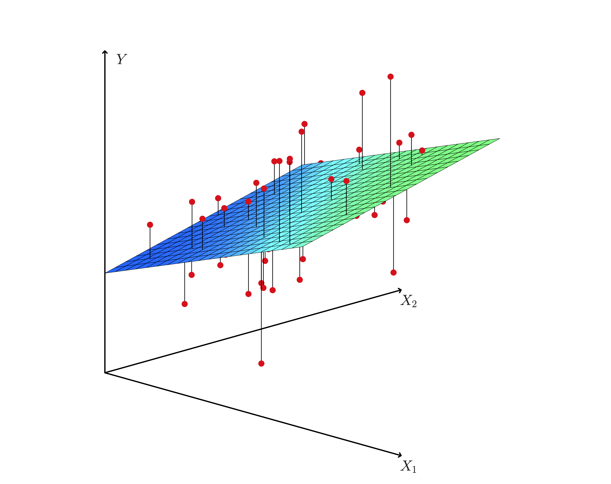

```{r setup, include=FALSE} 
knitr::opts_chunk$set(warning = FALSE, message = FALSE) 
```

## Introduction

In multilinear regression, we assume that the average y-values are a (affine) linear function of $p$ explanatory variables $x_1, \ldots, x_p$:
$$\mu_y = \beta_0 + \beta_1 x_1 + \ldots + \beta_p x_p.$$
We can use the `lm()` command in R to estimate the coefficients in the model. 

The model we get will have the form
$$\hat{y} = b_0 + b_1 x_1 + \ldots + b_p x_p.$$

## Regression (hyper)planes

If there are two explanatory variables $x_1$ and $x_2$, then you get a regression plane instead of a line. 

<center>
<figure>
</img>
<figcaption>**Figure:** A regression plane (Source: [Stanford Stats 202 Book](https://web.stanford.edu/class/stats202/notes/Linear-regression/Multiple-linear-regression.html))</figcaption>
</figure>
</center>


## Example: 2018 High Bridge half-marathon

```{r}
results <- read.csv("http://people.hsc.edu/faculty-staff/blins/classes/spring19/math222/Examples/highbridge2018.csv")
head(results)
myLM <- lm(minutes ~ age + gender, data = results)
myLM
```


## What does `plot(linear_model)` do?

You can plot a linear model in R. You get several images that help you check the assumptions for linear regression inference (normal residuals and constant variance).  The `par()` function lets you organize the plots into rows & columns. 

```{r}
par(mfrow=c(2,2))
plot(myLM)
```

<!--
## Comparing pairs of variables

```{r}
library(dplyr)
#numeric_cols <- sapply(results, is.numeric)
#pairs(results[, c(3,4)])
results |>
  select(age, gender, minutes) |>
  mutate(gender = as.integer(gender == "M")) |>
  pairs(pch = 19)
```
-->

## Example: Course evaluations

What factors explain differences in teaching evaluation scores? Here is data from 463 courses at the University of Texas - Austin that can be found in the R library `moderndive` (from the online textbook [ModernDive](https://www.moderndive.com))

```{r}
library(moderndive)
evals_data <- select(evals, ID, score, age, gender)
head(evals_data)
```

## A simple linear model

In a simple linear model, the coefficient on the `age` variable does not depend on `gender`, so the lines for predicting teaching scores are parallel. 

```{r}
simple_lm <- lm(score ~ age + gender, data = evals_data)
simple_lm
```

```{r, echo=F}
library(ggplot2)
ggplot(evals_data, aes(x = age, y = score, color = gender)) +
  geom_point() +
  labs(x = "Age", y = "Teaching Score", color = "Gender") +
  geom_parallel_slopes(se = FALSE)
```

<br>
<br>

## Linear models with interaction

A better linear model might have different slopes for men versus women.  You can get models like that by adding an **iteraction term**:
$$\mu_y = \beta_0 + \beta_1 x_1 + \beta_2 x_2 + \underbrace{\beta_{12} x_1 x_2}_{\text{interaction term}}.$$

The two trendlines are not parallel when you include interaction effects. Women appear to have a steeper age penalty on course evaluations than male instructors do.

```{r, echo=F}
ggplot(evals_data, aes(x = age, y = score, color = gender)) +
  geom_point() +
  labs(x = "Age", y = "Teaching Score", color = "Gender") +
  geom_smooth(method = "lm", se = FALSE)
```

<br>
<br>

## Interaction model

Here's how you make a linear model with interactions in R.  Notice that you use `*` instead of `+` in the `lm()` function.

```{r}
interaction_lm <- lm(score ~ age * gender, data = evals_data)
interaction_lm
```

1. Based on the output above, what is the slope for male instructors?  What is the slope for female instructors?

<br>
<br>

## Example: Babies birth weights

```{r}
babies <- read.csv('http://people.hsc.edu/faculty-staff/blins/classes/spring17/math222/data/babies.csv')
dim(babies)
```

The `babies` data frame contains data on baby birth weights. The variables are:

* bwt - birth weight (in ounces)
* gestation - length of the pregnancy (in days)
* parity - 1 if baby was first born, 0 otherwise
* age - mother's age (in years)
* height - mother's height (in inches)
* weight - mother's weight (in lbs.)
* smoke - 1 if the mother is a smoker, 0 otherwise


## Cleaning up the data

There are a lot of cells with NA (not available) entries, and these could mess up our analysis below.  The `na.omit()` command is a fast way to remove these.  
```{r}
babies <- na.omit(babies)
dim(babies)
```

Whenever you omit data, you should make sure that you aren't omitting a large percentage of the sample, and you might also want to check the way that the data was collected to make sure that individuals with missing data are not systematically different from other individuals in the sample.  In this example, we are omitting 62 rows of data (out of 1236).  That's only about 5% of the data, so we probably aren't affecting our results too much.  

## The linear model

```{r}
babies_lm <- lm(bwt ~ gestation + parity + age + height + weight + smoke, data = babies)
babies_lm
```

## Not every variable is significant

```{r}
summary(babies_lm)
```

## Selecting variables

You can use the `select()` function to select the variables you want to include in a data frame or tibble. 

```{r}
head(select(babies, bwt, gestation, parity, smoke))
```

In R, you can also use the pipe operator (`|>`) to chain functions together in an organized way. 

```{r}
babies |>
    select(bwt, gestation, parity, smoke) |>
    lm(bwt ~ gestation + parity + smoke, data = _) 
```

<br>
<br>


## ANOVA with multilinear regression

You can make an ANOVA table for multilinear regression, but it doesn't contain much information that wasn't in the summary of the linear model.

```{r}
anova(babies_lm)
```


## Checking linearity

We need to check that there is a roughly linear relationship between each of the explanatory variables and the response variable. This also lets you see how the residuals depend on each explanatory variable.


```{r}
par(mfrow=c(2, 3))
plot(babies$gestation, babies$bwt, xlab='Gestation time (in days)', ylab='Birth weight (in ounces)')
plot(babies$age, babies$bwt, xlab="Mother's age", ylab='Birth weight (in ounces)')
plot(babies$height, babies$bwt, xlab="Mother's height (inches)", ylab='Birth weight (in ounces)')
plot(babies$weight, babies$bwt, xlab="Mother's weight (lbs.)", ylab='Birth weight (in ounces)')
plot(babies$parity, babies$bwt, xlab="Parity", ylab='Birth weight (in ounces)')
plot(babies$smoke, babies$bwt, xlab="Smoker", ylab='Birth weight (in ounces)')
```

<br>
<br>

## What does `plot(data_frame)` do?

If you plot a data frame, then you get a matrix of pairwise plots between every pair of variables in the data frame.  That can help check that there is a linear relationship between the variables. 

```{r}
plot(babies)
```


## Checking the residuals

We also need to check the residuals to see that they are roughly normally distributed with constant variance.  This is harder to do with so many variables.  Here are two of the most important things to check:

* Plot the residuals versus predicted $\hat{y}$ values (residuals versus fitted data)
* A normal quantile plot of residuals (to check for normality)


```{R}
par(mfrow=c(1,2))
qqnorm(resid(babies_lm))
qqline(resid(babies_lm))
plot(fitted(babies_lm),resid(babies_lm),xlab='Predicted values',ylab='Residuals',main='Residuals vs. Predicted Values')
abline(0,0)
```

You could also get these plots automatically (with some extra junk) if you `plot()` the linear model.

<br>
<br>

## Confidence & prediction intervals

These work exactly the same as the single variable case. 

```{R}
confint(babies_lm)
```

```{R}
predict(babies_lm, data.frame(gestation = 240,height=70,weight=120,age=25,parity=1,smoke=0),interval='prediction')
```

## Interaction with more than two variables

The asterisk operator in `lm()` represents both the individual "main effects" and their interaction. For example:

```{r, eval = F}
lm(y ~ x1 * x2, data = df)
``` 
corresponds to $\mu_y = \beta_0 + \underbrace{\beta_1 x_1 + \beta_2 x_2}_\text{main effects} + \underbrace{\beta_{12} x_1 x_2}_\text{interaction term}.$


With more than two variables, you can include several interactions.  For example, 
```{r, eval = F}
lm(y ~ x1*x2 + x1*x3 + x2*x3, data = df)
```
would include both the main effects and also the interaction terms for all three pairs of variables in the model:
$$\mu_y = \beta_0 + \underbrace{\beta_{1} x_1 + \beta_2 x_2 + \beta_3 x_3}_\text{main effects} + \underbrace{\beta_{12} x_1 x_2 + \beta_{13} x_1 x_3 + \beta_{23} x_2 x_3}_\text{interaction terms}.$$

Including interaction terms between two quantitative variables makes the model nonlinear in the explanatory variables.  That isn't necessarily a bad things, but it adds complexity. 

<br>
<br>

## Practice

A group of students wanted to investigate which factors influence the price of a house (Koester, Davis, and Ross, 2003). They used <http://www.househunt.com>, limiting their search to single family homes in California. They collected a stratified sample by stratifying on three different regions in CA (northern, southern, and central), and then randomly selecting a sample from within each strata. They decided to focus on homes that were less than 5000 square feet and sold for less than \$1.5 million.

```{r}
houseData = read.csv("http://people.hsc.edu/faculty-staff/blins/classes/spring17/math222/data/housing.txt")
head(houseData)
```

1. Make a linear model to predict housing prices based on square feet, bathrooms, and bedrooms.  

2. Make a confidence interval for the average price of a 2,000 sq. foot house with 2.5 baths, and 4 bedrooms. 

3. How significant are the explanatory variables in the model?
