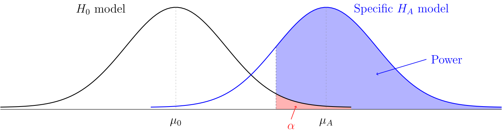

\newcommand{\on}{\operatorname}
\newcommand{\Var}{\operatorname{Var}}

## Math 222 - Spring 2026

<ul class="nav">
  <li>[Examples](examples.html)</li>
  <li>[Main](index.html)</li>
  <li>[Notes](notes.html)</li>
  <li>[Tools](http://people.hsc.edu/faculty-staff/blins/StatsTools/)</li>
</ul>


<center>
Jump to: [Math 222 homepage](index.html), [Week 1](#week-1-notes), [Week 2](#week-2-notes), [Week 3](#week-3-notes), [Week 4](#week-4-notes), [Week 5](#week-5-notes), [Week 6](#week-6-notes), [Week 7](#week-7-notes), [Week 8](#week-8-notes), [Week 9](#week-9-notes), [Week 10](#week-10-notes), [Week 11](#week-11-notes), [Week 12](#week-12-notes), [Week 13](#week-13-notes), [Week 14](#week-14-notes)
</center>
 
### Week 1 Notes

Day  | Section  | Topic
:---:|:---:|:-----------------------------------
Mon, Jan 12 |  | Working with R and Rstudio
Wed, Jan 14 | [1.3][1.3]     | Sampling principles and strategies
Fri, Jan 16 | [1.4][1.4]     | Experiments

### Mon, Jan 12

Today we went over the course syllabus and talked about making R-markdown files in Rstudio. We started the following lab in class, I recommend finishing the second half on your own. I also recommend [installing Rstudio](https://posit.co/download/rstudio-desktop/) on your own laptop (it's free).  

* **Lab:** [Working with R and Rstudio](https://htmlpreview.github.io/?https://github.com/andrewpbray/oiLabs-base-R/blob/master/intro_to_r/intro_to_r.html)
              

### Wed, Jan 14

Today we reviewed **populations** and **samples**.  We started with a famous example of a bad sample.

* **Slides:** [Literary Digest election poll 1936](https://people.hsc.edu/faculty-staff/blins/StatsExamples/samplingPresentation.pdf)

Then we reviewed population **parameters**, sample **statistics**, and **sampling frames**.  The difference between a sample statistic and a population parameter is called the **sample error**.  
There are two sources of sample error: 

1. **Bias.** Can be caused by a non-representative sample (**sample bias**) or by measurement errors, non-response, or biased questions (**non-sample bias**). The only way to avoid sample bias is a **simple random sample (SRS)** from the whole population.

2. **Random error.** This is non-systematic error.  It tends to get smaller with larger samples. 

To summarize:
$$\text{Statistics} = \text{Parameters} + \underbrace{\text{Bias } + \text{ Random error}}_\text{Sample error}.$$

We finished with this workshop. 

* **Workshop:** [Sampling](BasicSampling.pdf)

### Fri, Jan 16

If you find an association between an **explanatory** variable and a **response** variable in an **observational study**, then you can't say for sure that the explanatory variable is the cause. We say that **correlation is not causation** because there might be **lurking** variables that are **confounders**, that is, they are associated with both the explanatory and response variables and so you can tell what is the true cause.  

It turns out that **randomized experiments** can prove cause and effect because **random assignment** to treatment groups controls all **lurking variables**.  We also talked about **blocking** and **double-blind** experiments.  

* **Example:** [1954 polio vaccine trials](https://people.hsc.edu/faculty-staff/blins/StatsExamples/polioTrials.html)

* **Workshop:** [Experiments](Experiments.pdf)

We finished by simulating the results of the polio vaccine trials to see if they might just be a random fluke.  We wrote this R code in class:

```r
results = c()
trials <- 1000
for (x in 1:trials) {
  simulated.result <- sample(c(0,1), size = 244, replace = TRUE)
  percent <- sum(simulated.result) / 244
  results <- c(results, percent)
}
hist(results)
sum(results < 0.336) / trials
```


- - -

### Week 2 Notes

Day  | Section  | Topic
:---:|:---:|:-----------------------------------
Mon, Jan 19 |                | Martin Luther King day - no class
Wed, Jan 21 | [2.1][2.1]     | Examining numerical data
Fri, Jan 23 | [3.2][3.2]     | Conditional probability

### Wed, Jan 21

Today we did a lab about using R to visualize data.

* **Lab:** High Bridge half marathon ([Rmd](HighBridge.txt), [html](HighBridge.html))

You should be able to open this file in your browser, then hit CTRL-A and CTRL-C to select it and copy it so that you can paste it into Rstudio as an R-markdown document. 

We had a little trouble with R-markdown on the lab computers.  <!--While that is getting fixed, here is a [Jupyter notebook version](HighBridge.ipynb) of today's lab that you should be able to open with GoogleColab. -->

### Fri, Jan 23

Last time we talked about how to visualize data with R.  Here are two quick summaries of how to make plots in R:

* **Example**: [Basic plots with R](BasicPlots.html)
* **Example**: [Facier plots with ggplot2](GGplots.html)

After that, we started talking about probability.  We review some of the basic rules.  

<div class="Theorem">
#### Probability Rules

1. **Addition Rule** 
$$P(A \text{ or } B) = P(A) + P(B) - P(A \text{ and } B).$$
2. **Multiplication Rule** 
$$P(A \text{ and } B) = P(A) \cdot P(B \, | \, A).$$
</div>

The notation $P(B \, |\, A)$ means "the probability of B given that A happened".  Two events $A$ and $B$ are **independent** if the probability of $A$ does not depend on whether or not $B$ happens.  We did the following examples.  

1. If you shuffle a deck of 52 playing cards and then draw two, what is the probability that the second card is an ace if the first card is?  

We also talked about **tree diagrams** (see [subsection 3.2.7 from the book](https://people.hsc.edu/faculty-staff/blins/books/OpenIntroStats4e.pdf#subsection.3.2.7)) and how to use them to compute probabilities. 

2. Based on a study of women in the United States and Germany, there is an 0.8% chance that a woman in her forties has breast cancer.  Mammograms are 90% accurate at detecting breast cancer if someone has it.  They are also 93% accurate at not detecting cancer in people who don't have it.  If a woman in her forties tests positive for cancer on a mammogram screening, what is the probability that she actually has breast cancer? 

3. 5% of men are color blind, but only 0.25% of women are.  Find $P( \text{male} \, | \, \text{color-blind})$.  

- - - 

### Week 3 Notes

Day  | Section  | Topic
:---:|:---:|:-----------------------------------
Mon, Jan 26 |            | Class canceled (snow) 
Wed, Jan 28 | [4.1][4.1] | Normal distribution
Fri, Jan 30 | [3.4][3.4] | Random variables

### Wed, Jan 28

Class was canceled today because I had a doctor's appointment.  But I recommended that everyone watch the following video and then complete a workshop about the R functions `pnorm`, `qnorm`, and `rnorm`. 

* **Video:** <https://youtu.be/qLBmYfAVUdg>
* **Workshop:** [Normal distribution calculations with R](NormalCalculations.pdf)


### Fri, Jan 30

Today we talked about **random variables** and **probability distributions**. We talked about some example probability distributions:

* Flip a coin until you get a tail.  Let $X$ represent the number of flips needed. (**geometric distribution**)

* About 1 meteorite bigger than 1000 kg hits the Earth every year.  The time until the next meteorite hits the Earth has probability density function $f(t) = e^{-t}$. (**exponential distribution**) 

We talked about the difference between **continuous** and **discrete** probability distributions.  Then we introduced **expected value**.  

<div class="Theorem">
#### Definition (Expected Value).

If $X$ is a discrete random variable, then the expected value of $X$ is
$$E(X) = \sum_{k} k P(X = k).$$
If $X$ is a continuous random variable with probability density function $f(x)$, then the expected value of $X$ is
$$E(X) = \int_{-\infty}^{\infty} x f(x) \, dx.$$
</div>

We did the following example.

1. In roulette, if you bet $1 on black, there is an 18/38 probability that you win $2, and a 20/38 chance that you lose (and win nothing).  What is the expected amount of money you will win? 

We finished by talking about what we mean when we say something is "expected".

<div class="Theorem">
#### Law of Large Numbers

If you repeat a random experiment many times, then the average outcome tends to get close to the expected value.
</div>

<!--
3 students were late and 3 were absent, so I did not get far today. 
-->

- - -

### Week 4 Notes  

Day  | Section  | Topic
:---:|:---:|:-----------------------------------
Mon, Feb 2 | [3.4][3.4] | Random variables - con'd
Wed, Feb 4 | [4.3][4.3] | Binomial distribution
Fri, Feb 6 | [5.1][5.1] | Point estimates and error
 
### Mon, Feb 2

<div class="Theorem">
#### Definition (Variance and Standard Deviation).

For a random variable $X$ with expected value $\mu$, the variance of $X$ is 
$$\on{Var}(X) = E((X-\mu)^2).$$
The **standard deviation** of $X$ (denoted $\sigma$) is the square root of the variance. 
</div>

We did these examples in class.

1. Find the variance and standard deviation when you roll a 6-sided die. 

<!--    <details>
    Since every outcome is equally likely, you can use the R command `mean((1:6 - 3.5)^2)`. 
    </details>-->

2. [Exercise 3.34(a)](https://people.hsc.edu/faculty-staff/blins/books/OpenIntroStats4e.pdf#eoce.3.34)

Here is an extra example from Kahn academy that we did not do in class. 

3. Suppose a random variable $X$ has the following probability model. 

    <table class="bordered">
    <tr><td>$X$</td><td> 0 </td><td> 1 </td><td> 2 </td><td> 3 </td><td> 4</td></tr>
    <tr><td>$P(X)$</td><td> 0.1</td><td>0.15</td><td>0.4</td><td>0.25</td><td>0.1</td></tr>
    </table>

    a. Find the expected value of $X$. (<https://youtu.be/qafPcWNUiM8>)
    b. Find the variance and standard deviation of $X$. (<https://youtu.be/2egl_5c8i-g>)

<div class="Theorem">
#### Properties of Expected Value and Variance

Expected value is **linear** which means that for any two random variables $X$ and $Y$ and any constant $c$, these two properties hold:

1. $E(X + Y) = E(X) + E(Y)$ (**additivity**)
2. $E(cX) = c E(X)$ (**constant multiples**)

Variance is not linear.  Instead it has these properties:

1. $\on{Var}(X + Y) = \on{Var}(X) + \on{Var}(Y)$ if $X$ and $Y$ are independent.
2. $\on{Var}(cX) = c^2 \on{Var}(X)$
</div>


4. A single six-sided die has expected value $\mu = 3.5$ and standard deviation $\sigma = 1.7078$.  What is the mean and standard deviation if you roll two dice and add them?  


5. [Exercise 3.34(b)](https://people.hsc.edu/faculty-staff/blins/books/OpenIntroStats4e.pdf#eoce.3.34)

### Wed, Feb 4

<div class="Theorem">
**Binomial distribution.** If $X$ is the total number of successes in $n$ independent trials, each with probability $p$ of a success, then $X$ has a binomial distribution, denoted $\on{Binom}(n,p)$ for short. This distribution has

* Probability mass function (PMF):
$$P(X = k) = \frac{n!}{k! (n-k)!} p^k (1-p)^k.$$
* Expected value $\mu = np$.
* Variance $\sigma^2 = np(1-p)$.
</div>

1. If you play roulette and bet $1 on black, you have an 18/38 chance of winning $2.  If you bet on a number like 7, then you have a 1/38 chance of winning $36.  Both bets have the same expected value μ = $0.947.  What are the variances for both bets?  

We used this [binomial distribution plotting tool](https://people.hsc.edu/faculty-staff/blins/StatsTools/binomialPlotter2.html) to compare the distributions if you make these two bets 100 times.  In one case we get something that looks roughly like a bell curve, in the other case we get something that is definitely skewed to the right.  

2. In the 1954 polio vaccine trials there were 244 polio cases, but only 82 actually had polio.  Use the binomial distribution to compute the probability that 82 or fewer fair coin tosses out of 244 come up heads.  This can model the p-value under the hypothesis that the polio vaccine does not work.  Use the `pbinom(x, n, p)` function in R. 

Sometimes the assumption that the trials are independent is not justified.  

3. Suppose you want to find the percent of Hampden-Sydney students who are left handed.  So you interview a random sample of 50 students (out of the population of about 900 HSC students).  Why aren't these observations independent?  

The correct probability distribution to model the example above is called the **hypergeometric distribution**.  As long as the population is much larger than the sample, we typically do not need to worry about the trials not being independent. 

We finished by discussing the normal approximation of a binomial distribution.  When $n$ is large enough so that both $np \ge 10$ and $n(1-p) \ge 10$, then $\on{Binom}(n, p)$ is approximately normal with mean $np$ and standard deviation $\sqrt{n p (1-p)}$.  

<!--
We didn't get to this last exercise:

4. How well does the normal approximation do to estimate the $P(X \le 82)$ when $X \sim \on{Binom}(244, 0.5)$? 
-->

### Fri, Feb 6

<div class="Theorem">
#### The Central Limit Theorem

Suppose that $X_1, X_2, \ldots, X_n$ are independent random variables that all have the same probability distribution.  If $n$ is large, then the total $X_1 + X_2 + \ldots + X_n$ has an approximately normal distribution.
</div>

1. If each $X_i$ has mean $\mu$ and standard deviation $\sigma$, then what is the mean and the standard deviation of the total?  

2. In Dungeons and Dragons, you calculate the damage from a fireball spell by rolling 8 six-sided dice and adding up the results.  This has an approximately normal distribution.  What is the mean and standard deviation of this distribution.  (Recall that the mean and standard deviation of a single six-sided die is $\mu = 3.5$ and $\sigma = 1.7078$).  

We looked at a [graph of the distribution](https://people.hsc.edu/faculty-staff/blins/StatsTools/dice.html) from the previous example to see that it is indeed approximately normal. 

3. Use the normal approximation to estimate the probability of doing more than 35 points of damage with a fireball spell. 

When you use a normal approximation to estimate discrete probabilities, it is recommended to use a **continuity correction** (see [Section 4.3.3](https://people.hsc.edu/faculty-staff/blins/books/OpenIntroStats4e.pdf#subsection.4.3.3)).  To estimate $P(X \le k)$, calculate $P(X < k + 0.5)$ using the normal approximation (and likewise, to estimate $P(X \ge k)$, compute $P(X > k - 0.5)$ using the normal approximation).  

An important special case of the central limit theorem is the normal approximation of the binomial distribution, which has mean $\mu = np$ and standard deviation $\sigma = \sqrt{np(1-p)}$.  

4. About 7\% of the US population has type O-negative blood (universal donors).  If a hospital has 700 patients, use the normal approximation to estimate the probability that more than 60 have type O-negative blood.  Compare your answer with the result if you use the `pbinom(x, n, p)` function. 

We finished by talking about the difference between the distribution of the total versus the distribution of the proportion of patients who are O-negative.  The standard deviation of the sample proportion $\hat{p}$ is 
$$\sigma_{\hat{p}} = \sqrt{ \frac{p (1-p)}{n} }.$$


- - - 

### Week 5 Notes

Day  | Section  | Topic
:-----:|:---:|:-----------------------
Mon, Feb 9  | [5.2][5.2] | Confidence intervals for a proportion
Wed, Feb 11 |            | Review
Fri, Feb 13 |            | **Midterm 1**

### Mon, Feb 9

Today we talked about confidence intervals for a proportion.  

<div class="Theorem">
**Sampling Distribution for a Sample Proportion.** In a SRS of size $n$ from a large population, the sample proportion $\hat{p}$ is random, so it has a probability distribution with the following features.  

* **Shape.** The distribution gets more normal as the sample size $n$ increases. 
* **Center.** The expected value of $\hat{p}$ is the same as the population proportion $p$. 
* **Spread.** The standard deviation of $\hat{p}$ is 
$$\sigma_{\hat{p}} = \sqrt{\frac{p (1-p)}{n}}.$$
</div>

In practice, we usually don't know the population proportion $p$.  Instead we can use the sample proportion $\hat{p}$ to calculate the **standard error** of $\hat{p}$:
$$SE_{\hat{p}} =  \sqrt{\frac{\hat{p} (1-\hat{p})}{n}}.$$

1. This year, 34 out of 72 students in my statistics classes were born in Virginia.  What is the sample proportion $\hat{p}$ and the standard error?  

If the sample size is large enough, then there is a 95% chance that $\hat{p}$ will be within about two standard deviations of $p$. So if we know $\hat{p}$ and we assume that the standard error is close to the standard deviation for $\hat{p}$, then we can make a confidence interval for the location of the parameter $p$. 

<div class = "Theorem"> 
**Confidence Interval for a Proportion.**  This works well if the sample size $n$ is very large.  

$$\hat{p} \pm z^* \sqrt{\frac{\hat{p} ( 1- \hat{p})}{n}}.$$
</div>

You can use the R command `qnorm((1 - p) / 2)` to find the critical z-value ($z^*$) when you want a specific **confidence level** $p$. 

2. Use the data above to make a 95% confidence interval for the proportion of all HSC students born in VA. 

After that, we talked about the `prop.test()` function in R which can make a confidence interval (among other things).  

* **Example**: Confidence intervals for proportions with R ([Rmd](pConfidenceIntervals.Rmd), [html](pConfidenceIntervals.html))

Notice that the `prop.test()` confidence interval is not the same as what we got using the formula above. Instead of using the formula above, R uses something called a [Wilson score confidence interval](https://en.wikipedia.org/wiki/Binomial_proportion_confidence_interval#Wilson_score_interval_with_continuity_correction) with continuity correction.  The idea is to solve for the two points $p$ where
$$p - \hat{p} = \pm z^* \sqrt{\frac{p(1-p)}{n}}.$$
If you add in the continuity correction, this pretty much guarantees that there is at least a 95% chance (or whatever other confidence level you want) that the interval contains the true population parameter.  The Wilson method confidence intervals are fairly trustworthy even with relatively small samples and small numbers of successes/failures.  

### Wed, Feb 11

Today we went over the [midterm 1 review problems](midterm1review.pdf) (the [solutions](midterm1reviewSolutions.pdf) are also available now).  We also did some additional practice problems including these.

1. If you draw a random card from a deck of 52 playing cards, what is the probability that you draw an ace or a heart?   

2. Suppose you need knee surgery. There is an 11% that the surgery fails. There is a 4% chance of getting an infection. And there is a 3% chance of both infection and the surgery failing.  What is the probability that the surgery succeeds without infection?  

3. In the Wimbledon tennis tournament, serving players are more likely to win a point. A server has two chances to serve the ball. There is a 59% chance that the first serve is in, and if it is, then the server has a 73% chance of winning the point.  If the first serve is out, then they have an 86% of getting the second serve in, and in that case they have a 59% chance of winning the point. But if the second serve is out, then the server automatically loses the point.  

    a. Make a tree diagram for this situation.
    b. Find the probability that the serving player wins the point.
    c. Find the conditional probability that 1st serve was in, if the server wins the point.

- - - 

### Week 6 Notes

Day  | Section  | Topic
:-----:|:---:|:-----------------------
Mon, Feb 16 | [5.3][5.3] | Hypothesis tests for a proportion
Wed, Feb 18 | [6.2][6.2] | Difference in two proportions 
Fri, Feb 20 | [6.2][6.2] | Difference in two proportions - con'd 

### Mon, Feb 18

Today we talked about **hypothesis testing**, specifically testing hypotheses about a population proportion.  We looked at three examples. 

* **Video:** [Helper, hinderer study](https://youtu.be/HBW5vdhr_PA?t=79)
* **Picture:** [Bob vs. Tim](http://people.hsc.edu/faculty-staff/blins/classes/spring17/math222/examples/BobTim.png)
* **Picture:** [Zener cards](https://en.wikipedia.org/wiki/Zener_cards)

1. In the helper versus hinderer student, 14 out of 16 infants chose the helper toy. Could this be a random fluke?  To find out we can do a hypothesis test for proportions.  

    a. What is the parameter of interest?
    b. What are the correct null & alternative hypotheses about that parameter?
    c. What output do you get from the `prop.test()` function in this situation?
    d. What does the output mean?


When you do a hypothesis test, typically you choose a **significance level** α in advance, and then you calculate a p-value. A **p-value** is the probability of getting a result at least as extreme as the statistic, if the null hypothesis is true:
$$\text{p-value} = P(\text{Result at least as extreme } | ~ H_0).$$
 If the p-value is below the significance level, then you should reject the null hypothesis.  The following things are all equivalent:

1. The results are statistically significant.
2. The p-value is below the significance level.
3. Reject the null hypothesis. 
4. The results are probably not a random fluke.  

Conversely, if the results are not statistically significant, then we don't reject the null, and we should be aware that the results might be a random fluke.  Be careful, a common misunderstanding is to think that the p-value is $P(H_0 ~ | \text{ results as extereme as ours})$. The p-value does not directly tell you the probability that the null hypothesis is true, it only indirectly suggests that the null might not be true.

2. In another study, researchers presented 100 college students the images of two men (see the link above) and asked them to guess which was named Tim and which was named Bob.  It turned out that 67 students guessed that Tim was the man with the goatee. 

3. If someone gets 10 out of 25 guesses about what Zener card someone is looking at, is this strong evidence that they are psychic? Do a hypothesis test to find out. 

The null hypothesis in the last example is that the person is not psychic, so they only have a 1 out of 5 chance of guessing right.  Here is how you test this using the `prop.test()` function in R. 

```r
prop.test(10, 25, p = 0.2, alternative = "greater")
```

### Wed, Feb 18

We talked about how to compare two proportions using confidence intervals and hypothesis testing. We started by talking about how the `prop.test()` function in R can accept a vector of successes and another vector of totals for more than one group.  We used this to analyze the following study. 

1. A 2002 study looked at whether nicotine lozenges could help smokers who want to quit.  The subjects were randomly assigned to two treatment groups.  One group got a nicotine lozenge to take when they had cravings, while the other group got a placebo lozenge.  Of the 459 subjects who got the nicotine lozenge, 82 successfully abstained from smoking, while only 44 out of the 458 subjects in the placebo did.

    a. Make a 2-way table to show the results of this experiment. 
    b. Make a stacked bar graph that shows the column percentagages for the 2-way table. 
    c. What are the correct null and alternative hypotheses for this situation?
    d. Find the p-value and explain what it means about nicotine lozenges. 
    e. In the sample, how many times more likely were people in the nicotine lozenge group to quit smoking than people in the placebo group?
    f. What are we 95% confident will be in the confidence interval?

We created an R-markdown document to answer these questions in class. 

* **Example:** [Nicotine Lozenges](Examples/Nicotine.html) ([Rmd source](Examples/Nicotine.Rmd))

After we did that example, I let everyone work on a similar example on their own: 

2. The North Carolina State University Chemical Engineering department did a study to determine which factors affect student success in one of their introductory chemical engineering courses.  One of the factors they looked at was whether students were from a rural area, or an urban/suburban area.  Here is a two-way table showing the counts of the students who passed and failed the course. 

<center>
<table class="bordered">
<tr><td></td><td>Rural</td><td>Urban/Suburban</td></tr>
<tr><td>Passed</td><td>30</td><td>52</td></tr>
<tr><td>Failed</td><td>25</td><td>13</td></tr>
<tr><td>Total</td><td>55</td><td>65</td></tr>
</table>
</center>

Use R to visualize the results and carry out a hypothesis test to see if background make a significant difference in student pass rates. 

* **Example:** [Factors affecting pass rates in chemical engineering](Examples/PassRates.html) ([Rmd source](Examples/PassRates.Rmd))

<!--
2. A study in 2001 interviewed 2253 men and 2629 women between the ages of 19 and 25 years old.  It found that 986 of the men and 923 of the women still lived at home with their parents.  Do a 2-sample proportions test for this data.  Is there are significant difference between the proportions of young men and women who live at home with their parents?  How big of a difference does gender make? 
-->


### Fri, Feb 20

We started with this example that we did not have time for last time. 

1. One of the other factors that the North Carolina State University Chemical Engineering department looked at was gender.  Here is a two-way table showing the gender of students versus whether or not they passed the introductory chemical engineering course. 

<center>
<table class="bordered">
<tr><td></td><td>Male</td><td>Female</td></tr>
<tr><td>Passed</td><td>60</td><td>23</td></tr>
<tr><td>Failed</td><td>29</td><td>11</td></tr>
<tr><td>Total</td><td>89</td><td>34</td></tr>
</table>
</center>

After that we talked briefly about the theory behind the two-sample test for proportions. 

<div class="Theorem">
**Theorem.** If $X$ and $Y$ are independent random variables that each have a normal distribution, then $X+Y$ also has a normal distribution.
</div>

If we take two simple random samples from two populations, the two sample proportions $\hat{p}_1$ and $\hat{p}_2$ are each approximately normally distributed.  

2. By the theorem above, the difference $\hat{p}_1 - \hat{p}_2$ should be approximately normal.  What is its mean and standard deviation?  

<div class="Theorem">
**Two-Sample Hypothesis Test for Proportions.** 

<center>
<table>
<tr>
<td>$\begin{array}{lr} H_0: & p_A = p_B \\ H_A: & p_A \ne p_B \end{array}$</td><td> &nbsp; &nbsp; &nbsp; &nbsp; &nbsp; &nbsp; </td><td>$z = \dfrac{\hat{p}_A - \hat{p}_B}{\sqrt{\hat{p} (1 - \hat{p})\left( \frac{1}{N_A} + \frac{1}{N_B} \right)}}.$</td>
</tr>
</table>
</center>

where $\hat{p}$ is the **pooled proportion**:
$$\hat{p} = \frac{\text{ Total number of successes in both samples }}{N_A + N_B}.$$

Works best if both samples have at least 5 successes & 5 failures. 
</div>

<div class="Theorem">
**Two-sample Confidence Interval for Proportions.**

$$(\hat{p}_A - \hat{p}_B) \pm z^* \sqrt{\frac{\hat{p}_A (1-\hat{p}_A)}{N_A} + \frac{\hat{p}_B (1- \hat{p}_B)}{N_B}}.$$

Works best if both samples contain at least 10 successes and 10 failures.
</div>

We also talked about **one-sided confidence intervals**, which you get automatically in R when you set the `alternative` option to either `"greater"` or `"less"`.  

We finished by introducing the **chi-squared statistic**
$$\chi^2 = \sum \frac{(E_{ij} - O_{ij})^2}{E_{ij}}$$
where 
$$E_{ij} = \frac{(\text{Row } i \text{ total}) \cdot (\text{Column } j \text{ total})}{\text{Table total}}$$
is the **expected count** in row $i$, column $j$ (assuming there is no association), and $O_{ij}$ is the **observed count** in row $i$, column $j$. 

3. (Challenge problem). Use algebra to show the $\chi^2$ statistic for a 2-by-2 two-way table is the same as the square of the $z$-value from the two sample proportions test.  

- - - 


### Week 7 Notes

Day  | Section  | Topic
:-----:|:---:|:-----------------------
Mon, Feb 23 | [6.4][6.4] | Chi-squared test for association
Wed, Feb 25 | [6.3][6.3] | Chi-squared goodness of fit test
Fri, Feb 27 | [7.1][7.1] | One-sample means with t-distribution
             
### Mon, Feb 22

You can use the **chi-squared test for association** to see if there is a significant association between two categorical variables. We did this example using R.  

* **Example**: [Chi-squared test for association](Examples/SelfImage2.html) ([data](Examples/SelfImage.csv), [source](Examples/SelfImage2.Rmd))


We talked about the difference between **long tables** (also known as **tidy tables**) where each row represents one individual and each column represents a variable, versus **two-way tables** (also known as **contingency tables**) where the rows and columns represent categories for two categorical variables and the numbers in the table are the counts. 

You can easily convert a long table stored as a data frame in R to a two-way table using the `table()` function. You can transpose a two-way table (swap the rows & columns) using the function `t()`.   

We also talked about **mosaic plots** as an alternative to stacked bar graphs for showing the relationship between two categorical variables. 

#### Assumptions for Chi-Squared Test of Association

1. **Independence.** Data should come from a simple random sample from the population and each individual should only count once in the two-way table.  
2. **Sample size.** Each cell in the two-way table should have an expected count of at least 5.  

We did this example:

1. Suppose that a random sample of 100 people in a city are asked if they think the fire department is doing a satisfactory job. Shortly after the survey, there is a large fire in the city.  If the same 100 people are asked their opinions again, you might get results like this:

    <center>
    <table class="bordered">
    <tr><td></td><td>Satisfactory</td><td>Unsatisfactory</td></tr>
    <tr><td>Before</td><td>80</td><td>20</td></tr>
    <tr><td>After</td><td>72</td><td>28</td></tr>
    </table>
    </center>

    For this table, $\chi^2 = 1.754$ with a p-value of 18.5%.  Why should you not trust this p-value?

2. The right way to look at this data is to include each person once.  Each individual person has their before opinion and their after opinion recorded, so we could make a two-way table for those two variables:

    <center>
    <table class="bordered">
    <tr><td></td><td>Satisfactory Before</td><td>Unsatisfactory Before</td></tr>
    <tr><td>Satisfactory After</td><td>70</td><td>2</td></tr>
    <tr><td>Unsatisfactory After</td><td>10</td><td>18</td></tr>
    </table>
    </center>

    a. Now $\chi^2 = 47.7$ with a p-value of $5.0 \times 10^{12}$.  This is very strong evidence that there is an association between which two variables?  
    b. Should we be worried that there are only 2 people in the top right cell?  Why won't that be a problem for the chi-squared test?  


We ran out of time at the end, but I gave the following handout as extra practice to think about the chi-squared test for association.

* **Workshop:** [Chi-squared caveats](Examples/ChisqCaveats.pdf)

### Wed, Feb 25

Today we introduced the **chi-squared goodness of fit test**.  It is a lot like the chi-squared test for association, except instead of having two categorical variables, you just have one and you are testing to see whether the proportions in each category from the sample match some model for what the population should be.  

* **Workshop:** [Chi-squared goodness of fit test](Examples/BenfordsLaw.html) ([Rmd source](Examples/BenfordsLaw.Rmd)) 


### Fri, Feb 27

We started with this question:

1. Are Hampden-Sydney students significantly taller than average for men in the USA?  It is known that the average height of adult men in the United States is 70 inches with a standard deviation of 3 inches.  

We tested the hypotheses:

* $H_0: \mu_{HSC} = 70$
* $H_A: \mu_{HSC} \ne 70$. 

We started by trying to find a z-value using 
$$z = \frac{\bar{x} - \mu_0}{\sigma/\sqrt{n}}$$
but since we do not know the correct standard deviation for the population of all HSC students, we need to switch to using t-values: 
$$t = \frac{\bar{x} - \mu_0}{s / \sqrt{n}}.$$

```r
students <- read.csv("https://bclins.github.io/spring26/math222/Examples/StudentData.csv")
t.test(students$Height, mean = 70)
```

The t-distribution was discovered by William Gossett while he worked for the Guinness brewing company.  

2. Scientists studying the Earth's atmosphere found amber resin that formed 95 to 75 million years ago when dinosaurs lived. They measured the percent of nitrogen trapped in air bubbles in the resin and found the following results: `c(63.4, 65, 64.4, 63.3, 54.8, 64.5, 60.8, 49.1, 51)`.  Is this strong evidence that nitrogen levels back then were significantly different than they are now?  Currently nitrogen is 78.1% of the Earth's atmosphere.

    ```r
    nitrogen <- c(63.4, 65, 64.4, 63.3, 54.8, 64.5, 60.8, 49.1, 51)
    t.test(nitrogen, mu = 78.1)
    ```

#### Assumptions for the t-Test  

1. No bias - Ideally the data should come from a SRS from the whole population.
2. Independence - Population should be much larger than the sample. 
3. Population has a normal distribution - This assumption is less important if the sample size is large.  

If you have a small sample ($n < 30$), then you should be careful about trusting the t-distribution methods unless you are sure that the population really has a normal distribution. 

3. The two t-tests we did above both had significant p-values.  The first was $5.4 \times 10^{-4}$ and the second was $2.0 \times 10^{-5}$.  Thinking about the assumptions above, which p-value is probably stronger evidence?  

- - - 

### Week 8 Notes

Day  | Section  | Topic
:-----:|:---:|:-----------------------
Mon, Mar 2 | [7.2][7.2] | Paired data
Wed, Mar 4 | [7.3][7.3] | Difference of two means
Fri, Mar 6 | [7.4][7.4] | Power calculations
            

### Mon, Mar 2

We started by talking about using **quantile-quantile plots** to check normality.  

* **Example:** [Checking normality with qqplots](https://people.hsc.edu/faculty-staff/blins/classes/spring19/math222/Examples/qqplots.html)

We talked about how to tell the difference between left-skewed and right-skewed distributions on a qqplot.  You can also use a qqplot to tell if a distribution has tails that are too fat to be normal.

After that, we introduced **prediction intervals**.  A 95% t-distribution confidence interval is supposed to contain the population mean, but it does not contain 95% of the individuals, nor does it have a 95% chance to contain a future observation.  But you can make an interval that contains 95% of future observations by using a prediction interval. 

<div class="Theorem">
**Prediction Interval for a Quantitative Variable.**

$$\bar{x} \pm t^* \sqrt{s^2 + \dfrac{s^2}{N}}.$$

**Caution:** Unlike confidence intervals, these are not robust if the population is not normal, even if the sample size is large! 
</div>

We used R to find a 95% prediction interval for next year's rainfall here in Farmville. 

```r
rain <- read.csv('http://people.hsc.edu/faculty-staff/blins/StatsExamples/rainfall.csv')
xbar <- mean(rain$total)
s <- sd(rain$total)
N <- 81
tstar <- qt(0.975, df = 80)
upper <- xbar + tstar * sqrt(s^2 + s^2 / N)
lower <- xbar - tstar * sqrt(s^2 + s^2 / N)
```

We introduced the `qt()` function which is similar to the `qnorm()` function, except it is for the t-distribution. 

Then we talked about using the t-test with paired data. We started with this data set which shows the size in cubic centimeters of the left hippocampus region of the brain (measured using MRI) of pairs of twins.  Each pair of twins had one who was diagnosed with schizophrenia and one who was unaffected by schizophrenia.  So we want to know if the size of the hippocampus is significantly different in twins with schizophrenia.  

```r
brain = read.csv('https://www.rossmanchance.com/iscam2/data/hippocampus.txt', sep = "\t")
```

Notice the optional argument `sep = "\t"` which we had to use since the data file was stored as **tab-separated values**, not comma-separated values.  Since the twins come in matched pairs, we test the differences:

```r
t.test(brain$unaffected - brain$affected)
```

### Wed, Mar 4

Today we worked on the following examples in class:

* **Example:** [Comparing two means](Examples/ComparingMeans.html) ([Rmd source](Examples/ComparingMeans.Rmd))

For two-sample t-tests, we use [Welch's t-test](https://en.wikipedia.org/wiki/Welch's_t-test) which is a very robust method.  It uses the fact that if you sample from two populations with equal means, then the two-sample t-value:
$$t = \frac{\bar{x}_1 - \bar{x}_2}{\sqrt{\frac{s_1^2}{n_1} + \frac{s_2^2}{n_2}}}$$
will approximately follow a t-distribution (under very mild normality & independence assumptions).  The formula for the degrees of freedom is a bit complicated, but R will calculate it for you automatically. 

### Fri, Mar 6

Today we talked about statistical power, significance levels, and Type I versus II errors.  Traditionally when people do a hypothesis test, they have a **significance level** $\alpha$ in mind.  If the results have a p-value below the significance level, then the researchers can feel justified rejecting the null hypothesis.  But there are two potential problems with this type of significance test. 

<center>
<table class="bordered">
<tr><th></th><th>$H_0$ is true</th><th>$H_A$ is true</th></tr>
<tr><th>p-value below $\alpha$</th><td>Type I error (false positive)</td><td>Reject $H_0$</td></tr>
<tr><th>p-value above $\alpha$</th><td>Don't reject $H_0$</td><td>Type II error (false negative)</td></tr>
</table>
</center>

If the null hypothesis is true, then the probability of a Type I error is $1- \alpha$.  In order to talk about the probability of a Type II error, we need to make some extra assumptions about the situation, including picking a specific value for the parameter of interest.  

<div class="Theorem">
**Definition.** The **power** of a statistical study is the probability of correctly rejecting the null hypothesis if a specific alternative hypothesis is true. 
</div>

<center> 
</img>
</center>


If you are going to the trouble to design an experiment or observational study, you should probably do a quick power calculation before you start, otherwise you might just be wasting your time.  We did these examples:

1. A 1998 study looked at the herbal supplement Garcinia Cambogia to see if it can help people lose weight.  Here is the abstract from the study:

    > A total of 135 subjects were randomized to either active hydroxycitric acid [The active ingredient
in G. Cambogia] (n = 66) or placebo (n = 69); 42 (64%) in the active hydroxycitric acid group and
42 (61%) in the placebo group completed 12 weeks of treatment. Patients in both groups lost a
significant amount of weight during the 12-week treatment period; however, between-group weight
loss differences were not statistically significant (mean [SD], 3.2 [3.3] kg vs 4.1 [3.9] kg; P = 0.14).  

    If we wanted to perform a follow-up study to see if G. Cambogia can increase weight loss by at least 1 kg (over a placebo) and if we assume that the standard deviation in weight loss for each group will be around 4 kg, then how large should our groups be in order to get a power of at least 80%?  What if we want 90% power?  

In the previous example, we were doing a two-sample hypothesis test for means. In that case, the null model says that the difference in sample means $\bar{x}_1 - \bar{x}_2$ should have a normal distribution with mean $0$ and standard deviation 
$$\sigma_{\bar{x}_1 - \bar{x}_2} = \sqrt{ \frac{\sigma_1^2}{n_1} + \frac{\sigma_2^2}{n_2}}.$$


We picked an effect size that we would like to detect to be $\mu_1 - \mu_2 = 1$ kg.  And we talked about why it is safer to round standard deviations up when you are picking plausible values for $\sigma_1$ and $\sigma_2$ in a power calculation, so we picked $\sigma_1 = \sigma_2 = 4$ kg.  Then we used the following code to find the power:

```r
n = 100 # We assumed both treatment groups would be same size
sigma_1 = 4
sigma_2 = 4 
sigma = sqrt(sigma_1^2/n + sigma_2^2/n)
threshold = qnorm(0.95, mean = 0, sd = sigma)
power = 1 - pnorm(threshold, mean = 1, sd = sigma)
power # The power with n = 100 is only about 54.9%.  
```

By testing different sample sizes, you can find an n large enough to get a power of 80% or higher. We didn't have time for the following example, but it is good practice if you want a power calculation for a 1-sample hypothesis test.  For a 1-sample test for means, the null and alternative models will both be normal distributions with standard deviation 
$$\sigma_{\bar{x}} = \frac{\sigma}{\sqrt{n}}.$$

2. The Columbus Times-Dispatch wrote an article about a matched pairs experiment to see if footballs filled with helium go farther than footballs filled with regular air when you kick them.  They had a novice kicker kick 39 pairs of footballs, one fill with helium and one with air.  Their results were inconclusive.  They found that the helium filled footballs went 0.46 yards farther on average, with a standard deviation of 6.87 yards, but the results were not statistically significant. 

* **Example**: [Helium filled footballs data](http://people.hsc.edu/faculty-staff/blins/StatsExamples/football.txt)

- - - 

### Week 9 Notes

Day  | Section  | Topic
:-----:|:---:|:-----------------------
Mon, Mar 16 |            | Transforming data
Wed, Mar 18 |            | Review  
Fri, Mar 20 |            | **Midterm 2**

### Mon, Mar 16

Today we talked about using functions to transform quantitative data.  

* For data that is skewed left, the most common transformations are the exponential function $e^x$ or power functions $x^p$ with $p > 1$.
* For data that is skewed right, the most common transformations are the natural logarithm function $\ln x$ or power functions $x^p$ with $0 < p < 1$.

We looked at these examples:

* **Example**: [Log transform: turbidity](https://people.hsc.edu/faculty-staff/blins/classes/spring19/math222/Examples/turbidity.html)
* **Example**: [Log transform: cloud seeding](https://people.hsc.edu/faculty-staff/blins/classes/spring19/math222/Examples/CloudSeeding.html)
* **Example**: [Choosing the right transform: textbook prices](https://people.hsc.edu/faculty-staff/blins/classes/spring19/math222/Examples/textbooks.html)

You have to be careful when using t-distribution methods on transformed data.  The t-methods will tell you about the average of the transformed data which won't be the same as the transformed average of the original data.  Here are ways you can deal with this problem:

* If the transformed data has a normal distribution, then the average equals the median.  As long as the transformation is monotone, then medians commute with monotone transforms, which means that the median of the transformed data is the transformation applied to the original median. 

* Logarithms convert multiplication to addition. This has some important consequences:
    - The average of log-transformed data corresponds to the geometric mean of the original data.  
    - A confidence interval for log-transformed data will give you multiplicative bounds for the original data. 
    - The difference between the medians of two sets of log-transformed data corresponds to ratio of the medians of the original data.  

1. The 95% t-distribution confidence interval for the average of the log-transformed turbidity data was 4.20 to 4.40.  In other words, we are 95% confident that 
$$4.20 \le \mu_\text{log turbidity} \le 4.40.$$
To **back transform** that confidence interval to say something meaningful about the original data, you (i) assume that the mean and the median are the same for the log turbidity in the population, and (ii) use the fact that 
$$\on{median}(\text{log turbidity}) = \log( \text{median turbidity}).$$
Therefore we are 95% confident that 
$$4.20 \le \log(\text{population median turbidity}) \le 4.40.$$
and now we can apply the exponential function to all three sides of this inequality to get 
$$e^{4.20} \le \text{population median turbidity} \le e^{4.40}.$$

2. We made a confidence interval for the difference in the means of the log-rainfall in the cloud seeding example.  We were 95% confident that 
$$0.24 \le \mu_{\text{log seeded}} - \mu_\text{log unseeded} \le 2.0.$$
Once again, we can back transform to get a useful claim about the median rainfall for seeded versus unseeded clouds, although you do have to make the following strong assumption: that log-rainfall has a symmetric distribution in the population for both seeded and unseeded clouds.  Assuming that, we have 
$$0.24 \le \log(\text{median seeded}) - \log(\text{median unseeded}) \le 2.0.$$
which is equivalent to 
$$0.24 \le \log\left(\dfrac{\text{median seeded}}{\text{median unseeded}} \right) \le 2.0.$$
Taking the exponential function of both sides, we found that 
$$1.27 \le \dfrac{\text{median seeded}}{\text{median unseeded}} \le 7.4.$$
In other words, the population median rainfall is between 1.27 and 7.4 *times higher* in seeded than in unseeded clouds.  

3. We looked at the textbook prices example to talk about situations where you might use a power transform instead of a log-transform.  One popular method is the [Box-Cox transformation](https://en.wikipedia.org/wiki/Power_transform#Box%E2%80%93Cox_transformation). 

### Wed, Mar 18

We talked about the [midterm 2 review problems](midterm2review.pdf) and about the power computation on problem 3 from [project 3](Projects/project3.pdf). We also talked about how to choose the best inference method. 

* **Workshop:** [Choosing the right inference method](https://people.hsc.edu/faculty-staff/blins/StatsExamples/ChoosingRightTechnique2.pdf)


- - - 


### Week 10 Notes

Day  | Section  | Topic
:-----:|:---:|:-----------------------
Mon, Mar 23 | [7.5][7.5] | Comparing many means with ANOVA
Wed, Mar 25 | [7.5][7.5] | ANOVA - con'd
Fri, Mar 27 | [8.2][8.2] | Least squares regression

### Mon, Mar 23

If you are measuring a quantitative response variable for more than two groups, then **analysis of variance (ANOVA)** can let you test whether whether the means are significantly different in the different groups.  Before you get started, it helps to look at side-by-side boxplots to see if there looks like there might be a difference.  

* **Example:** [One-way ANOVA: Baseball positions at bat](https://people.hsc.edu/faculty-staff/blins/classes/spring18/math222/examples/batting.html)

1. In the example above, what are the explanatory & response variables?  

2. From the graph of the side-by-side boxplots, does it look like one group of baseball players might be better than others at bat?  

<div class="Theorem">
#### Analysis of Variance (ANOVA)

One-way ANOVA is based on the following model.  We have $I$ groups, and we assume that each group has a normally distribution in the  population with the same standard deviation $\sigma$, but possibly different means $\mu_1, \ldots, \mu_I$.  Within this model, we test

* $H_0: \mu_1 = \mu_2 = \ldots = \mu_I$ (i.e., the group means are all the same)
* $H_A:$ the group means are not all the same.

If we take a total of $N$ independent observations from the population, we can calculate an $F$-value for the data and use the **F-distribution** to find a p-value for this hypothesis test. 
</div>

In order to calculate the F-value, we use a tool called an **ANOVA table**.  The ANOVA table keeps track of different sources of variance in our data.  We get two different types of variance:

* Differences between the group averages.
* Variability within the groups.  

An ANOVA table has these parts
<center>
<table class="bordered">
<tr><td>Source </td><td> Degrees of Freedom </td><td> Sum of Squares </td><td> Mean Square </td><td> F</td></tr>
<tr><td>Groups </td><td> $I-1$ </td><td> $\sum_i n_i(\bar{x}_i-\bar{x})^2$ </td><td> $\on{SSG}/\on{DFG}$ </td><td> $F = \on{MSG}/\on{MSE}$</td></tr>
<tr><td>Error </td><td> $N-I$ </td><td> $\sum_i (n_i-1) s_i^2$ </td><td> $\on{SSE}/\on{DFE}$ </td><td> </td></tr>
<tr><td>Total </td><td> $N-1$ </td><td> $\sum_{ij} (x_{ij}-\bar{x})^2$ </td><td> $\on{SST}/\on{DFT}$ </td><td> </td></tr>
</table>
</center>
where MS stands for mean square, SS stands for sum of squares, and DF stands for degrees of freedom for either the Group (G), the Error (E), or the total (T).

To explain the parts of the table we talked about the formula for the **sample variance**
$$s^2 = \sum \dfrac{(x_i - \bar{x})^2}{n - 1}.$$
So for any sample, the sum of squared deviations $\sum (x_i - \bar{x})^2$ is equal to $(n-1) s^2$. 
The idea for ANOVA is that you can break up the total sum of squares into the sum of squares for the groups (SSG) and the sum of squared error (SSE).  
$$\sum_{ij} (x_{ij} - \bar{x})^2 = \underbrace{\sum_{i = 1}^I n_i (\bar{x}_i - \bar{x})^2}_{\text{Between Group Differences}} + \underbrace{\sum_{i = 1}^I \sum_{j = 1}^{n_i} (x_{ij} - \bar{x}_i)^2}_{\text{Within Group Differences}}$$


Then when you divide these by their degrees of freedom and then take the ratio of the two results, you'll get an F statistic that should follow an F-distribution .  

3. Here is a table that summarizes the number of players and the mean and standard deviation for each group in our sample.  Use it to fill in an ANOVA table. 

<center>
<table class="bordered">
<tr><td>Position </td><td>$n$</td><td>$\bar{x}$</td><td>$s$</td></tr>
<tr><td>Catcher </td><td>39</td><td>0.323</td><td>0.045</td></tr>
<tr><td>Designated Hitter </td><td>14</td><td>0.348</td><td>0.036</td></tr>
<tr><td>In Field </td><td>154</td><td>0.332</td><td>0.037</td></tr>
<tr><td>Out Field </td><td>120</td><td>0.334</td><td>0.029</td></tr>
<tr><td>All Positions</td><td>327</td><td>0.332</td><td>0.036</td></tr>
</table>
</center>

4. Suppose that 11 nursing students just graduated.  The number of years it took to complete the program for each student is listed below.  

    ```
        3   3   3   3   4   4   4   4   5   5   6
    ```

    Find the sample mean and the sample standard deviation for this data. 

5. Suppose that the nursing students were split into three groups.  The time it took the students in each group to graduate is listed below:

    ```
        Group 1:    3   3   3   3   4    (Average: 3.2, Variance: 0.2)
        Group 2:    4   4   4   5        (Average: 4.25, Variance: 0.25)
        Group 3:    5   6                (Average 5.5, Variance: 0.5) 
    ```

    Calculate the sample standard deviations for each group. 


<!--
    ```
        Group 1:    3   3   3   4    (Average: 3.25)
        Group 2:    4   4   5        (Average: 4.333)
        Group 3:    3   4   5   6    (Average 4.5) 
    ```
-->


6. Make an ANOVA table for the three groups above.  Use the table to find the mean squares for the groups and the mean squared error.  Then divide them to find the F-statistic. 


- - - 

### Week 11 Notes

Day  | Section  | Topic
:-----:|:---:|:-----------------------
Mon, Mar 30 | [9.1][9.1] | Introduction to multiple regression 
Wed, Apr 1  | [9.2][9.2] | Model selection
Fri, Apr 3  | [9.3][9.3] | Checking model conditions


- - - 

### Week 12 Notes

Day  | Section  | Topic
:-----:|:---:|:-----------------------
Mon, Apr 6  |  [9.5][9.5] | Introduction to logistic regression
Wed, Apr 8  |  [9.5][9.5] | Logistic regression - con'd     
Fri, Apr 10 |       | Hypothesis testing with randomization                 


- - - 

### Week 13 Notes

Day  | Section  | Topic
:-----:|:---:|:-----------------------
Mon, Apr 13 |            | Confidence intervals with bootstrapping
Wed, Apr 15 |            | Review
Fri, Apr 17 |            | **Midterm 3**


- - - 

### Week 14 Notes

Day  | Section  | Topic
:---:|:---:|:---------
Mon, Apr 20 |    | Introduction to Bayesian methods
Wed, Apr 22 |    | Credible intervals for proportions
Fri, Apr 24 |    | Bayesian inference 
Mon, Apr 27 |  | Last day, recap & review


- - - 


[1.2]: <http://people.hsc.edu/faculty-staff/blins/books/OpenIntroStats4e.pdf#section.1.2>
[1.3]: <http://people.hsc.edu/faculty-staff/blins/books/OpenIntroStats4e.pdf#section.1.3>
[1.4]: <http://people.hsc.edu/faculty-staff/blins/books/OpenIntroStats4e.pdf#section.1.4>
[2.1]: <http://people.hsc.edu/faculty-staff/blins/books/OpenIntroStats4e.pdf#section.2.1>
[2.1.1]: <http://people.hsc.edu/faculty-staff/blins/books/OpenIntroStats4e.pdf#subsection.2.1.1>
[2.1.3]: <http://people.hsc.edu/faculty-staff/blins/books/OpenIntroStats4e.pdf#subsection.2.1.3>
[2.1.4]: <http://people.hsc.edu/faculty-staff/blins/books/OpenIntroStats4e.pdf#subsection.2.1.4>
[2.1.5]: <http://people.hsc.edu/faculty-staff/blins/books/OpenIntroStats4e.pdf#subsection.2.1.5>
[2.2]: <http://people.hsc.edu/faculty-staff/blins/books/OpenIntroStats4e.pdf#section.2.2>
[2.3]: <http://people.hsc.edu/faculty-staff/blins/books/OpenIntroStats4e.pdf#section.2.3>
[3.1]: <http://people.hsc.edu/faculty-staff/blins/books/OpenIntroStats4e.pdf#section.3.1>
[3.2]: <http://people.hsc.edu/faculty-staff/blins/books/OpenIntroStats4e.pdf#section.3.2>
[3.4]: <http://people.hsc.edu/faculty-staff/blins/books/OpenIntroStats4e.pdf#section.3.4>
[3.5]: <http://people.hsc.edu/faculty-staff/blins/books/OpenIntroStats4e.pdf#section.3.5>
[4.1]: <http://people.hsc.edu/faculty-staff/blins/books/OpenIntroStats4e.pdf#section.4.1>
[4.1.4]: <http://people.hsc.edu/faculty-staff/blins/books/OpenIntroStats4e.pdf#subsection.4.1.4>
[4.1.5]: <http://people.hsc.edu/faculty-staff/blins/books/OpenIntroStats4e.pdf#subsection.4.1.5>
[4.3]: <http://people.hsc.edu/faculty-staff/blins/books/OpenIntroStats4e.pdf#section.4.3>
[5.1]: <http://people.hsc.edu/faculty-staff/blins/books/OpenIntroStats4e.pdf#section.5.1>
[5.1.3]: <http://people.hsc.edu/faculty-staff/blins/books/OpenIntroStats4e.pdf#subsection.5.1.3>
[5.2]: <http://people.hsc.edu/faculty-staff/blins/books/OpenIntroStats4e.pdf#section.5.2>
[5.3]: <http://people.hsc.edu/faculty-staff/blins/books/OpenIntroStats4e.pdf#section.5.3>
[5.3.3]: <http://people.hsc.edu/faculty-staff/blins/books/OpenIntroStats4e.pdf#subsection.5.3.3>
[6.1]: <http://people.hsc.edu/faculty-staff/blins/books/OpenIntroStats4e.pdf#section.6.1>
[6.2]: <http://people.hsc.edu/faculty-staff/blins/books/OpenIntroStats4e.pdf#section.6.2>
[6.2.3]: <http://people.hsc.edu/faculty-staff/blins/books/OpenIntroStats4e.pdf#subsection.6.2.3>
[6.3]: <http://people.hsc.edu/faculty-staff/blins/books/OpenIntroStats4e.pdf#section.6.3>
[6.4]: <http://people.hsc.edu/faculty-staff/blins/books/OpenIntroStats4e.pdf#section.6.4>
[7.1]: <http://people.hsc.edu/faculty-staff/blins/books/OpenIntroStats4e.pdf#section.7.1>
[7.1.4]: <http://people.hsc.edu/faculty-staff/blins/books/OpenIntroStats4e.pdf#subsection.7.1.4>
[7.1.5]: <http://people.hsc.edu/faculty-staff/blins/books/OpenIntroStats4e.pdf#subsection.7.1.5>
[7.2]: <http://people.hsc.edu/faculty-staff/blins/books/OpenIntroStats4e.pdf#section.7.2>
[7.3]: <http://people.hsc.edu/faculty-staff/blins/books/OpenIntroStats4e.pdf#section.7.3>
[7.4]: <http://people.hsc.edu/faculty-staff/blins/books/OpenIntroStats4e.pdf#section.7.4>
[7.5]: <http://people.hsc.edu/faculty-staff/blins/books/OpenIntroStats4e.pdf#section.7.5>
[8.1]: <http://people.hsc.edu/faculty-staff/blins/books/OpenIntroStats4e.pdf#section.8.1>
[8.1.4]: <http://people.hsc.edu/faculty-staff/blins/books/OpenIntroStats4e.pdf#subsection.8.1.4>
[8.2]: <http://people.hsc.edu/faculty-staff/blins/books/OpenIntroStats4e.pdf#section.8.2>
[8.4]: <http://people.hsc.edu/faculty-staff/blins/books/OpenIntroStats4e.pdf#section.8.4>
[9.1]: <http://people.hsc.edu/faculty-staff/blins/books/OpenIntroStats4e.pdf#section.9.1>
[9.2]: <http://people.hsc.edu/faculty-staff/blins/books/OpenIntroStats4e.pdf#section.9.2>
[9.3]: <http://people.hsc.edu/faculty-staff/blins/books/OpenIntroStats4e.pdf#section.9.3>
[9.4]: <http://people.hsc.edu/faculty-staff/blins/books/OpenIntroStats4e.pdf#section.9.4>
[9.5]: <http://people.hsc.edu/faculty-staff/blins/books/OpenIntroStats4e.pdf#section.9.5>
[Wk01]: <>

<br>
<br>
<br>
<br>
<br>
<br>
<br>
<br>
