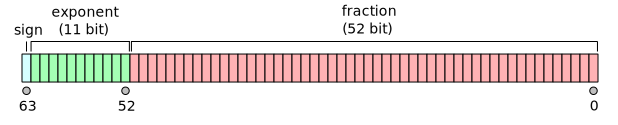
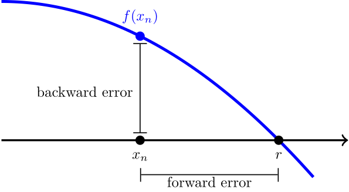
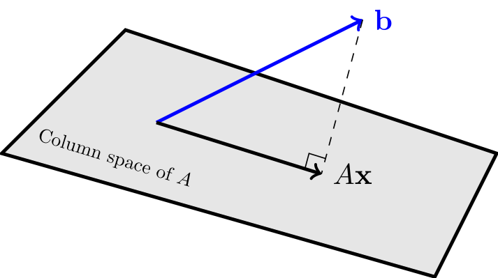
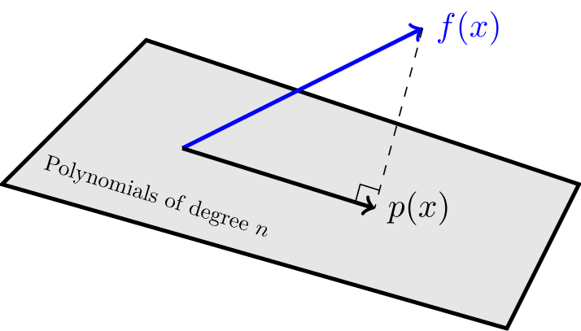
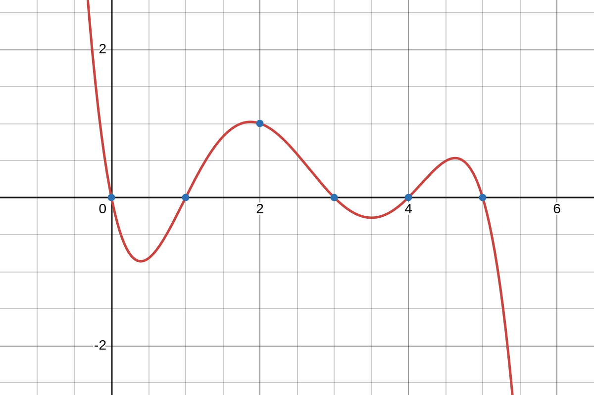
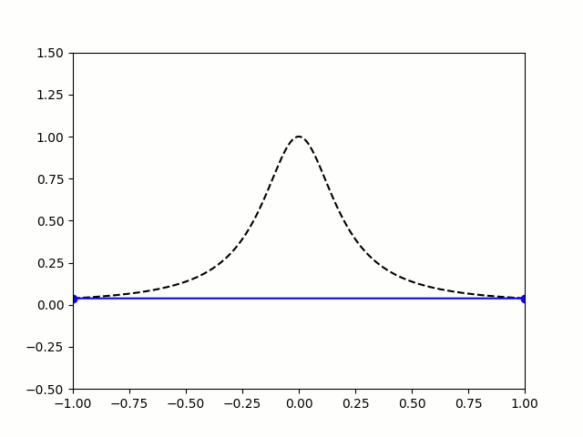
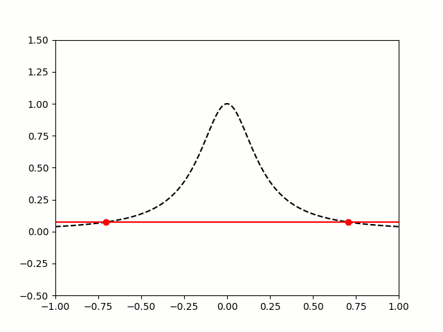

\newcommand{\on}{\operatorname}
\newcommand{\R}{\mathbb{R}}
\newcommand{\C}{\mathbb{C}}
\newcommand{\N}{\mathbb{N}}
\newcommand{\inner}[1]{\langle {#1} \rangle}

<style>
.DD {
    text-align:center;
}
.DD th {
    color: black;
    border-bottom: 1px solid black;
}
.DD td {
    padding-left: 20px;
    padding-right: 20px;
}
</style>

## Math 342 - Spring 2026

<!--
<ul class="nav">
  <li>[Class Notes](notes.html)</li>
  <li>[Schedule & Syllabus](index.html)</li>
  <li>[Software & Tables](http://people.hsc.edu/faculty-staff/blins/StatsTools/)</li>
</ul>
-->


<center>
Jump to: [Math 342 homepage](index.html), [Week 1](#week-1-notes), [Week 2](#week-2-notes), [Week 3](#week-3-notes), [Week 4](#week-4-notes), [Week 5](#week-5-notes), [Week 6](#week-6-notes), [Week 7](#week-7-notes), [Week 8](#week-8-notes), [Week 9](#week-9-notes), [Week 10](#week-10-notes), [Week 11](#week-11-notes), [Week 12](#week-12-notes), [Week 13](#week-13-notes), [Week 14](#week-14-notes)
</center>
 
### Week 1 Notes

Day  |  Topic
:---:|:-----------------------------------
Mon, Jan 12 | Floating point arithmetic
Wed, Jan 14 | Relative error, significant digits
Fri, Jan 16 | Taylor's theorem

<!--
#### Book Ideas:

* Driscol and Braun: <https://fncbook.com/> - Uses Python, and has brief coverage of most of the topics I want to cover and seems well written, but not super detailed. 
* Young and Mohlenkamp: [link](file:///Users/brian/Documents/Books/NumericalAnalysis/YoungMohlenkamp.pdf) - Even better fit for the topics I want to cover, but exclusively uses Matlab.  It has more good examples, though, and would make a great reference to add material into the course including vector-valued Newton's method, applications of eigenvectors ;
* Chasnov: <https://www.math.hkust.edu.hk/~machas/numerical-methods.pdf>More theoretical, but covers a lot of the topics that I want to cover.
* Kaw: <https://nm.mathforcollege.com/NumericalMethodsTextbookUnabridged/index.html>This one is interesting.  Seems low level (detailed coverage of really basic stuff), but that might be good.  Has okay coverage of most topics I want, but not QR decomposition or SVD. Does seem to have a lot of applications to engineering. 
* Linear Algebra w/ Applications to Engineering & AI: <https://nikolaimatni.github.io/ese-2030/>Nice book that might make a good supplement.


#### Notes from last time:

This was the second time I taught this class.  I followed the same general outline as the first time.  It worked okay, but I think that the course still has some problems.  I did spend more time on Taylor series and the Taylor remainder formula and I do not regret that.  Still, here are some things I would change. 

1. I need to spend more time on some basic concepts like:
    a. Triangle inequality (this crushed them on the Fixed Point Iteration workshop)
    b. Combining separate error terms (worst case total error -> triangle inequality again!)
    c. Orthogonality and Gram-Schmidt. There is no point covering Fourier series or Legendre polynomials if students don't understand how to find the components of a vector in a basis and why orthogonal bases are nice.  

2. I would cut out Gaussian quadrature.  It is a cool trick... but it takes too long to explain. A better use of time would be to introduce adaptive quadrature methods.  
-->


### Mon, Jan 12

We talked about how computers store [floating point numbers](https://en.wikipedia.org/wiki/Floating_point).  Most modern programming languages store floating point numbers using the [IEEE 754 standard](https://en.wikipedia.org/wiki/IEEE_754). 

{ style="width: 700px" }

In the IEEE 754 standard, a 64-bit floating point number has the form 

$$\mathbf{value} = (-1)^\mathbf{sign} \, \times \, 2^{(\mathbf{exponent} - 1023)} \, \times \, (1 + \mathbf{fraction}) $$

where 

* $\mathbf{sign}$ is a single bit: 0 for positive, 1 for negative.
* $\mathbf{fraction}$ is a 52-bit fraction (in binary) with $0 \le \mathbf{fraction} < 1$.
* $\mathbf{exponent}$ is the 11-bit binary integer which ranges from 0 to 2047. Only 1 to 2046 are used for regular floating point numbers, $\mathbf{exponent}=0$ is reserved for zero and [subnormal numbers](https://en.wikipedia.org/wiki/Subnormal_number), and $\mathbf{exponent}=2047$ is reserved for infinity and NaN ("not a number"). 

We talked about how to convert between [binary numbers](https://en.wikipedia.org/wiki/Binary_numeral_system) and decimal numbers. <!--[scientific notation](https://en.wikipedia.org/wiki/Scientific_notation) and [logarithmic scales](https://en.wikipedia.org/wiki/Logarithmic_scale ).-->
This system works very well, but it leads to weird outcomes like  `0.1 + 0.1 + 0.1 = 0.30000000000000004`.

When you convert $\tfrac{1}{10} = 0.1$ to binary, you get a infinitely repeating binary decimal: 
$$\tfrac{1}{10} = (0.000110011001100\ldots)_2.$$ 
So any finite binary representation of $\tfrac{1}{10}$ will have **rounding errors**.

We did the following examples in class:

1. Convert (10110)<sub>2</sub> to decimal. (<https://youtu.be/a2FpnU9Mm3E>)

2. Convert 35 to binary. (<https://youtu.be/gGiEu7QTi68>)

3. What is the 64-bit string that represents the number 35 in the IEEE standard? 

4. What are the largest and smallest 64-bit floating point numbers that can be stored?  

5. In Python, compute `2.0**1024` and `2**1024`.  Why do you get different results?

6. In Python, compare `2.0**1024` with `2.0**(-1024)` and `2.0**(-1070)`. What do you notice? 

<!--6. What number has mantissa (1011)<sub>2</sub> and exponent (110)<sub>2</sub>? -->

### Wed, Jan 14

Today we talked about significant digits.  Here is a [quick video on how these work](https://youtu.be/l2yuDvwYq5g). 

<div class="Theorem">
**Rules for Significant Digits.**

1. **Addition/Subtraction.** The last common digit that is significant for both numbers is the last significant digit of the answer. 
2. **Multiplication/Division.** Result has significant digits equal to the minimum number of significant digits of the two inputs. 
</div>

Next we defined absolute and relative error:

<div class="Theorem">
**Definition.** Let $x^*$ be an approximation of a real number $x$. 

* The **absolute error** is $|x^* - x|$. 
* The **relative error** is $\dfrac{|x^*-x|}{|x|}$. 
</div>

The base-10 logarithm of the relative error is approximately the number of significant digits, so you can think of significant digits as a measure of relative error.  

Intuitively, addition & subtraction "play nice" with absolute error while multiplication and division "play nice" with relative error.  This can lead to problems:

1. **Catastrophic cancellation.** When you subtract two numbers of roughly the same size, the relative error can get much worse.  For example, both 53.76 and 53.74 have 4 significant digits, but 
$$53.76 - 53.74 = 0.02$$ 
only has 1 significant digit.  

2. **Useless precision.** If you add two numbers with very different magnitudes, then having a very low relative error in the smaller one will not be useful.  

We did these examples in class.

1. $\pi = 3.141592...$.  What is the absolute and relative error if your round $\pi$ to $3.14$?  

<div class="Theorem">
**Rounding Error.** The worst case relative error from rounding to $k$ significant digits is 
$$\mathbf{relative~error} \le \begin{cases} 5 \times 10^{-k} & (\text{decimal}) \\ 2^{-k} & (\text{binary}). \end{cases}$$
Since 64-bit floating point numbers have up to 53 significant digits, they typically have a relative error of up to $2^{-53} \approx 1.11 \times 10^{-16}$.  This quantity is known as **machine epsilon**. 
</div>

You can sometimes re-write algorithms on a computer to avoid issues with floating point numbers such as overflow/underflow and catastrophic cancellation.  

2. Consider the function $f(x) = \dfrac{1 - \cos x}{\sin x}$.  Use Python to compute $f(10^{-7})$. 

3. The exact answer to previous question is $0.00000005 = 5 \times 10^{-8}$ (accurate to 22 decimal places).  Use this to find the relative error in 
your previous calculation.

4. A better way to compute $f(x)$ is to use a trick to avoid the catastrophic cancellation:
$$f(x) = \dfrac{1-\cos x}{\sin x} = \dfrac{1 - \cos x}{\sin x} \cdot \left( \frac{1+ \cos x}{1+\cos x} \right) = \dfrac{\sin x}{1 + \cos x}.$$
Use this new formula to compute $f(10^{-7})$.  What is the relative error now?

**Stirling's formula** is a famous approximation for the factorial function.
$$n! \approx \sqrt{2 \pi n} \frac{n^n}{e^n}.$$
We approximated Stirling's formula using the following code.

```python
import math
n = 100
print(float(math.factorial(n)))
f = lambda n: math.sqrt(2 * math.pi * n) * n ** n / math.exp(n)
print(f(n))
```

Our formula worked well until $n=143$, then we got an overflow error.  The problem was that $n^n$ got too big to convert to a floating point number.  But you can prevent the overflow error by adjusting the formula slightly to. 

```python
n = 143
f = lambda n: math.sqrt(2 * math.pi * n) * (n / math.e) ** n
print(f(n))
```

### Fri, Jan 26

Today we reviewed Taylor series.  We recalled the following important Maclaurin series (which are Taylor series with center $c = 0$):

* $e^x = \sum_{n=0}^\infty \dfrac{x^n}{n!}$
* $\sin(x) = \sum_{n=0}^\infty \dfrac{(-1)^n \, x^{2n+1}}{(2n+1)!}$
* $\cos(x) = \sum_{n=0}^\infty \dfrac{(-1)^n \, x^{2n}}{(2n)!}$
* $\dfrac{1}{1-x} = \sum_{n = 0}^\infty x^n$
* $\ln(1+x) = \sum_{n = 0}^\infty \dfrac{(-1)^n \, x^{n+1}}{n+1}$

We graphed Maclaurin polynomials for $\cos x$ and $\dfrac{1}{1-x}$ on [Desmos](https://www.desmos.com/calculator) to see how they converge with different **radii of convergence**. 

We also use the Maclaurin series for $\dfrac{\sin x}{x}$ to approximate the integral 

$$\displaystyle \int_{-\pi}^\pi \frac{\sin x}{x} \, dx.$$

Then we did the following workshop in class. 

* Workshop: [Taylor series](Workshops/TaylorSeries.pdf)
<!--* <mark>Interesting idea for some extra problems w/ the triangle inequality: <https://www.deanza.edu/faculty/balmcheryl/documents/M1C_Lab3_updated.pdf></mark>-->

              
- - -

### Week 2 Notes

Day  | Topic
:---:|:-----------------------------------
Mon, Jan 19 | Martin Luther King day - no class
Wed, Jan 21 | Taylor's theorem - con'd
Fri, Jan 23 | Bounding error


### Wed, Jan 21

Today we reviewed some theorems that we will need throughout the course.  The first is probably the most important theorem in numerical analysis since it lets us estimate error when using Taylor series approximations.  

<div class="Theorem">
**Taylor's Theorem.** Let $f$ be a function that has $(n+1)$ derivatives in the interval between $x$ and $c$.  Then there exists a $z$ strictly inside the interval from $x$ to $c$ such that 
$$f(x) - P_n(x) = \frac{f^{(n+1)}(z)}{(n+1)!} (x-c)^{n+1}$$
where $P_n$ is the $n$th degree Taylor polynomial for $f$ centered at $c$. 
</div>

A special case of Taylor's theorem is when $n = 0$. Then you get the Mean Value Theorem (MVT):

<div class="Theorem">
**Mean Value Theorem.** Let $f$ be a function that is differentiable in the interval between $a$ and $b$.  Then there exists a $c$ strictly inside the interval from $a$ to $b$ such that 
$$f'(c) = \frac{f(b) - f(a)}{b-a}.$$
</div>

We did this example:

1. Use Taylor's theorem to estimate the error in using the 0th and 2nd degree Maclaurin polynomials to estimate $\cos(0.03)$ and $\cos(0.6)$. 

Then we started this workshop

* **Workshop:** [Error bounds](Workshops/ErrorBounds.pdf)

<!--
Note that finding upper bounds for functions is hard to teach!  You need to figure out better examples next time you teach this and maybe find better rules to help guide the students.  For example, the triangle inequality is one rule, but you also might need to spell out other rules, like for products and for different variables? Not sure what resources are available for this, I didn't find much when I looked this year. 

Talk about ways to get upper bounds for arbitrary functions.

1. Look at the endpoints for monotone functions (but not for other functions!)

2. Use 1 for sine & cosine

3. Combine upper bounds in products and using the triangle inequality.  

4. Talk about how we typically want to find upper bounds for the absolute value so that might happen at the minimum not the maximum of a function (if it goes negative).  
-->


### Fri, Jan 23

Last time we started [this workshop](Workshops/ErrorBounds.pdf) about using Taylor's remainder formula and the triangle inequality to find upper bounds for functions.  Today we revisited that workshop, but first we talked about the following. 

<div class="Theorem">
**Taylor's Error Formula.** Let $f$ be a function that has $(n+1)$ derivatives in the interval between $x$ and $c$.  Then 
$$|f(x) - P_n(x)| \le   \frac{M \cdot |x-c|^{n+1}}{(n+1)!}$$
where $M$ is the maximum value of $|f^{(n+1)}(z)|$ with $z$ between $x$ and $c$. 
</div>

This error formula gives a way to estimate the worst case (absolute) error when you use a Taylor polynomial approximation.

1. The 3rd degree Taylor polynomial for $\cos x$ centered at $c = \pi$ is $P_3(x) = -1 + \tfrac{1}{2}(x-\pi)^2$ (the coefficient on the 3rd degree term is zero).  What is the worst case absolute error using this polynomial to estimate $\cos 3$?

<!--
2. What is the worst case absolute error if you use the 10th degree Maclaurin polynomial to estimate $e^x$ on the interval $[-1,1]$? 
-->

After that we talked about the triangle inequality. 

<div class="Theorem">
**Triangle Inequality.** For any numbers $a$ and $b$ (real or complex), 
$$|a+b| \le |a| + |b|.$$
</div>

We talked about how you can use the triangle inequality to find **upper bounds** for functions. We also talked about **tight upper bounds** versus upper bounds that are not tight. We did this example. 

2. Use the triangle inequality to find an upper bound for $|x^2 + 3x \cos x|$. 


<!-- 
### Fri, Jan 26

************
*** NOTE ***
************
I canceled this one this year because of our snow day on Monday, Jan 26. 

Today we did a workshop about the Babylonian algorithm which is an ancient method for finding square roots.  

* **Workshop**: [The Babylonian algorithm](Workshops/Babylonian.pdf) 

As part of this workshop we also covered how to define variables and functions in Python and also how to use for-loops and while-loops.  
-->

- - - 

### Week 3 Notes

Day  | Topic
:---:|:-----------------------------------
Mon, Jan 26 | No class (snow day)
Wed, Jan 28 | Bisection method
Fri, Jan 30 | Newton's method


### Wed, Jan 28

We talked about how to find the roots of a function.  Recall that a **root** (AKA a **zero**) of a function $f(x)$ is an $x$-value where the function hits the $x$-axis.  We introduced an algorithm called the **bisection method** for finding roots of a continuous function that changes sign from positive to negative or negative to positive on an interval $[a, b]$. We wrote the following code to implement this algorithm. 

```python
def bisection(f, a, b, N):
    """
    Applies the bisection method recursively up to N times to estimate a root 
    of a continuous function f on an interval [a,b]. 
    """
    m = (a + b) / 2
    if N == 0 or f(m) == 0:
        return m
    if (f(a) > 0 and f(m) > 0) or (f(a) < 0 and f(m) < 0):
        return bisection(f, m, b, N - 1)
    else:
        return bisection(f, a, m, N - 1)
```

We tested this algorithm on the function $f(x) = \tan x - 1$ which has a root at $\tfrac{\pi}{4}$.  

One feature of the bisection method is that we can easily find the worst case absolute error in our approximation of a root. That is because every time we repeat the algorithm and cut the interval in half, the error reduces by a factor of 2, so that
$$\text{Absolute error} \le \frac{(b-a)}{2^{N+1}}.$$
We saw that it takes about 10 iterations to increase the accuracy by 3 decimal places (because $2^{10} \approx 10^3$). 


### Fri, Jan 30

Today we covered **Newton's method**.  This is probably the most important method for finding roots of differentiable functions.  The formula is 
$$ x_{n+1} = x_n - \dfrac{f(x_n)}{f'(x_n)}.$$
This formula comes from the idea which is to start with a guess $x_0$ for a root and then repeatedly improve your guess by following the tangent line at $x_n$ until it hits the $x$-axis.  

1. Use Newton's method to find roots of $\tan x - 1$. 

2. How can you use Newton's method to find $e$? Hint: use $f(x) = \ln x -1$.  

<div class="Theorem">
**Theorem.** Let $f \in C^2[a,b]$ and suppose that $f$ has a root $r \in (a,b)$. Suppose that there are constants $L,M >0$ such that $|f'(x)| \ge L$ and $|f''(x)| \le M$ for all $x \in [a,b]$. Then 
$$|x_{n+1} - r| \le \frac{M}{2L} |x_n-r|^2$$
when $x_n \in [a,b]$.
</div>

*Proof.* Start with the first degree Taylor polynomial (centered at $x_n$) for $f(r)$ including the remainder term and the Newton's method iteration formula:

$$f(r) = f(x_n) + f'(x_n)(r-x_n) + \frac{1}{2} f''(z)(r-x_n)^2 = 0,$$
and
$$x_{n+1} = x_n - \frac{f(x_n)}{f'(x_n)} \Rightarrow f'(x_n)(x_{n+1} - x_n) + f(x_n)=0.$$

Subtract these two formulas to get a formula that relates $(r-x_{n+1})$ with $(r-x_n)$.

$$f'(x_n)(r-x_{n+1}) + \frac{1}{2} f''(z)(r-x_n)^2 = 0.$$

Use this to get an upper bound on $|r-x_{n+1}|$. □


<div class="Theorem">
**Corollary.** Let $C = \dfrac{2L}{M}$.  As long as the Newton method iterates $x_n$ stay in $[a,b]$, then the absolute error after $n$ steps will satisfy
$$|\frac{x_n-r}{C}| \le \left|\frac{x_0 - r}{C} \right|^{2^n}.$$
</div>

This corollary explains why, if you start with a good guess in Newton's method, the number of correct decimal places tends to double with each iteration!

<!--
### Fri, Feb 2

Today we looked at some examples of what can go wrong with Newton's method. We did these examples:

1. What happens if you use Newton's method with $x_0 = 0$ on $f(x) = x^3 - 2x + 2$?

2. Why doesn't Newton's method work for $f(x) = x^{1/3}$?

We also did this workshop.

* **Workshop:** [Newton's method](Workshops/NewtonsMethod.pdf)
-->


- - -

### Week 4 Notes

Day  | Topic
:---:|:-----------------------------------
Mon, Feb 2 | Secant method
Wed, Feb 4 | Fixed point iteration
Fri, Feb 6 | Newton's method with complex numbers
 
### Mon, Feb 2

The **secant method** is a variation of Newton's method that uses secant lines instead of tangent lines.  The advantage of the secant method is that it doesn't require calculating a derivative.  The disadvantage is that it is a little slower to converge than Newton's method, but it is still much faster than the bisection method.  Here is the formula:

$$x_{n+1} = x_n - \frac{f(x_n) \, (x_n - x_{n-1})}{f(x_n) - f(x_{n-1})}.$$

1. Solve the equation $2^x = 10$ using the secant method.  What would make good initial guesses $x_0$ and $x_1$? 

    <details>
    ```python
    # This code will do one step of the secant method.
    f = lambda x: 2 ** x - 10
    a, b = 3, 3.5
    a, b = b, b - f(b) * (b - a) / (f(b) - f(a)); print(b)
    ```
    </details>

<div class="Theorem">
**Definition.** A sequence $x_n$ **converges with order $\alpha$** if it converges to $r$ and there are constants $C > 0$ and $\alpha \ge 1$ such that 
$$\lim_{n \rightarrow \infty} \frac{|x_{n+1} - r|}{|x_n - r|^\alpha} = C.$$
</div> 

Convergence of order $\alpha = 1$ is called **linear convergence** and convergence of order $\alpha = 2$ is called **quadratic convergence**. Newton's method converges quadratically. It turns out that the secant method converges with order $\alpha = \frac{1+\sqrt{5}}{2} \approx 1.618$ which is the golden ratio!  

* **Workshop:** [Root finding methods](Workshops/NewtonsMethod.pdf)

### Wed, Feb 4

Newton's method is a special case of a method known as **fixed point iteration**.  A **fixed point** of a function $f(x)$ is a number $p$ such that $f(p) = p$.  A real-valued function $f(x)$ has a fixed point on an interval $[a, b]$ if and only if it intersects the graph $y = x$ on that interval. 

1. Show that $\cos x$ has a fixed point in $[0,\tfrac{\pi}{2}]$. 

2. Explain why $f(x) = e^x$ has no fixed points. 

3. Does $\sin x$ have any fixed points?

A fixed point $p$ is **attracting** if the recursive sequence defined by $x_{n+1} = f(x_n)$ converges to $p$ for all $x_0$ sufficiently close to $p$. It is **repelling** if points close to $p$ get pushed away from $p$ when you apply the function $f$. You can draw a picture of these fixed point iterates by drawing a [cobweb diagram](https://en.wikipedia.org/wiki/Cobweb_plot). 

<center>
</img>
</center>

To make a cobweb diagram, repeat these steps:

* Move vertically from your current x-value until you hit the graph $y = f(x)$. 
* Now move horizontally to the graph $y = x$.  

4. Show that the fixed point of $\cos x$ is attracting by repeatedly iterating. 

5. Show that $g(x) = 1 - 2x -x^5$ has a fixed point, but it is not attracting. 

<div class="Theorem">
**Theorem** If $f$ has a fixed point $p$ and 

1. $|f'(p)| < 1$, then $p$ is attracting, 
2. $|f'(p)| > 1$, then $p$ is repelling,
3. $|f'(p)| = 1$, then no info. 
</div>

*Proof.* Write down the first degree Taylor approximation for $f$ centered at $p$. Use it with $x = x_n$, $f(x_n) = x_{n+1}$ to show that if $M$ is an upper bound for $f''(z)$ (near $p$), then 
$$|x_{n+1} - p| \le |x_n - p| \left(|f'(p)| + \frac{M}{2}|x_n-p| \right).$$
Then as long as $x_n$ is close enough to $p$, the terms inside the parentheses are less than 1 which means that $|x_{n+1} - p| < |x_n - p|$, i.e, $x_{n+1}$ is closer to $p$ than $x_n$ for every $n$. □ 


<div class="Theorem">
**Theorem.** If $f$ is differentiable at a fixed point $p$ and $0 < |f'(p)| < 1$, then for any point $x_0$ sufficiently close to $p$, the fixed point iterates $x_n$ defined by $x_{n+1} = f(x_n)$ converge to $p$ with linear order.  If $f'(p) = 0$, then the iterates converge to $p$ with order $\alpha$ where $f^{(\alpha)}(p)$ is the first nonzero derivative of $f$ at $p$. 
</div>

5. For any function $f \in C^2[a,b]$ with a root $r$ in $(a,b)$, let $g(x) = x - \dfrac{f(x)}{f'(x)}$. Show that $r$ is a fixed point of $g$ and show that $g'(r) = 0$. 

<!-- 

We had some extra time today at the end, so we ended class early, but I could have used the following question: 

6. Let $f \in C^1[a,b]$ with a root $r$ in $(a,b)$.  If $c$ is a constant that is close to $f'(r)$, then iterates of the function $g(x) = x - \dfrac{f(x)}{c}$ will converge to $r$.  Why is this iteration method usually slower than Newton's method?  
-->

### Fri, Feb 6

In any root finding method, we have two ways of measuring the error when we compare an approximation $x_n$ with the actual root.  The **forward error** is the distance between the root $r$ and the approximation $x_n$ on the $x$-axis. Since we usually don't know the true value of $r$, it is hard to estimate the forward error.  The **backward error** is just $|f(x_n)|$, which is usually easy to calculate. 

<center>
</img>
</center>

1. If $x_n$ is really close to $r$, then how could you use $f'(r)$ to estimate the forward error if you know the backward error?  

We used the idea of forward and backward error to automate Newton's method.  The idea is to include an optional tolerance argument.  We stop iterating when the backward error is smaller than the tolerance. 

```python
def newton(f, Df, x, tolerance = 10 ** (-15)):
    """
    Applies Newton's method to a function f with derivative Df and initial guess x.  
    Stops when |f(x)| < tol. 
    """
    step = 0
    while not abs(f(x)) < tolerance:
        x = x - f(x) / Df(x)
        step = step + 1
    print("Converged in", step, "steps.")
    return x

```

We finished with a cool fact about Newton's method.  It also works for to find complex number roots if you use complex numbers.  We did a quick review of complex numbers.

<div class="Theorem">
**Euler's formula.**

$$e^{i \theta} = \cos \theta + i \sin \theta.$$
</div>

We used the `cmath` library in Python to do the following experiments with Newton's method.

2. **Cube roots of unity.** Use Newton's method to find all 3 roots of $x^3 - 1$.  

3. **Euler's identity.** Use Newton's method to solve $e^x + 1 = 0$.  

We finished by talking about **Newton fractals**. When you use Newton's method on a function with more than one root in the complex plane, the set of points that converge to each root (called the **basins of attraction**) form fractal patterns. 

<center>
<figure>
</img>
<figcaption>Basins of attraction for the roots of $x^3-1$.</figcaption>
</figure>
</center>

- - - 

### Week 5 Notes

Day  | Topic
:-----:|:-----------------------
Mon, Feb 9  | Solving nonlinear systems 
Wed, Feb 11 | Systems of linear equations
Fri, Feb 13 | LU decomposition
              

### Mon, Feb 9

Today we talked about how to solve systems of nonlinear equations with Newton's method. As a motivating example, we talked about how this could be used in navigation, for example in the [LORAN system](https://en.wikipedia.org/wiki/LORAN).

To solve a vector-valued system $\mathbf{F}(\mathbf{x}) = \mathbf{0}$, you can iterate the formula
$$\mathbf{x}_{n+1} = \mathbf{x}_n - \mathbf{J}(\mathbf{x}_n)^{-1} \mathbf{F}(\mathbf{x_n})$$
where $\mathbf{J}(\mathbf{x})$ is the Jacobian matrix 
$$\mathbf{J}(\mathbf{x}) = \begin{bmatrix} 
\frac{\partial F_1}{\partial x_1} &  \ldots & \frac{\partial F_1}{\partial x_n} \\  
\vdots & \ddots & \vdots \\
\frac{\partial F_n}{\partial x_1} &  \ldots & \frac{\partial F_n}{\partial x_n} \end{bmatrix}.$$

To program this formula in Python, we'll need to load the `numpy` library.  We wrote the following code to solve this system:

\begin{align*}
xy + y^2 &= 1 \\
x^2 - y^2 &= 1 
\end{align*}

```python
import numpy as np

F = lambda x: np.array([
    x[0] * x[1] + x[1]**2 - 1, 
    x[0]**2 - x[1]**2 - 1
])
J = lambda x: np.array([
    [   x[1], x[0] + 2*x[1] ], 
    [ 2*x[0],       -2*x[1] ]
])

x = np.array([1,1])
for i in range(10): 
    x = x - np.linalg.inv(J(x)) @ F(x) # Use @ not * for matrix multiplication.
    print(x)
```

* **Workshop:** [Nonlinear systems](Workshops/NonlinearSystems.pdf)

### Wed, Feb 11

Today we talked about systems of linear equations and linear algebra. 

1. Suppose you have a jar full of pennies, nickles, dimes, and quarters.  There are 80 coins in the jar, and the total value of the coins is $10.00.  If there are twice as many dimes as quarters, then how many of each type of coin are in the jar?  

We can represent this question as a system of linear equations. 
$$p+n+d+q = 80$$
$$p+5n+10d+25q = 1000$$
$$d = 2q$$
where $p,n,d,q$ are the numbers of pennies, nickles, dimes, and quarters respectively. It is convenient to use matrices to simplify these equations:
$$\begin{pmatrix} 1 & 1 & 1 & 1  \\ 1 & 5 & 10 & 25  \\ 0 & 0 & 1 & -2 \end{pmatrix} \, \begin{pmatrix} p \\ n \\ d \\ q \end{pmatrix} = \begin{pmatrix} 80 \\ 1000 \\ 0 \end{pmatrix}.$$
Here we have a matrix equation of the form $A\mathbf{x} = \mathbf{b}$ where $A \in \R^{3 \times 4}$, $\mathbf{x} \in \R^4$ is the unknown vector, and $\mathbf{b} \in \R^3$. Then you can solve the problem by row-reducing the augmented matrix

$$\left( \begin{array}{cccc|c} 1 & 1 & 1 & 1 & 80 \\ 1 & 5 & 10 & 25 & 1000 \\ 0 & 0 & 1 & -2 & 0\end{array}\right)$$

which can be put into **echelon form**

$$\left( \begin{array}{cccc|c} 1 & 1 & 1 & 1 & 80 \\ 0 & 4 & 9 & 24 & 920 \\ 0 & 0 & 1 & -2 & 0\end{array}\right).$$

The variables $p, n$, and $d$ are **pivot variables**, and the last variable $q$ is a **free variable**. Once you pick values for the free variable(s), you can solve for the pivot variables one at a time using **back substitution**.  We did this using Python:

```python
q = 20 
d = 2*q
n = (920 - 9*d - 24*q) / 4
p = 80 - n - d - q
print(p, n, q)

# Only q = 20 makes sense, otherwise either p or n will be negative.
```

After that we reviewed some more concepts and terminology from linear algebra.  The most important thing to understand is that you can think of matrix-vector multiplication as a **linear combination** of the columns of the matrix:

$$A \mathbf{x} = \begin{pmatrix} 1 & 1 & 1 & 1  \\ 1 & 5 & 10 & 25  \\ 0 & 0 & 1 & -2 \end{pmatrix} \, \begin{pmatrix} p \\ n \\ d \\ q \end{pmatrix} = \underbrace{\begin{pmatrix} 1 \\ 1 \\ 0 \end{pmatrix}p +  \begin{pmatrix} 1 \\ 5 \\ 0 \end{pmatrix}n +  \begin{pmatrix} 1 \\ 10 \\ 1 \end{pmatrix}d +  \begin{pmatrix} 1 \\ 25 \\ -2 \end{pmatrix}q}_{A \mathbf{x} \text{ is a linear combination of the columns of } A}.$$


For any matrix $A \in \R^{m \times n}$:

* The **column space** of $A$ is the set of all possible linear combinations of the columns.  It is also the **range** of $A$ as a **linear transformation** from $\R^n$ into $\R^m$. 

* The **rank** of $A$ is the dimension of the column space.  It is also the number of pivots, since the pivot columns are a **basis** for the column space. 

* The **null space** of $A$ is the set $\{\mathbf{x} \in \R^n \, : \, A \mathbf{x} = \mathbf{0}\}$.

* The **nullity** of $A$ is the number of free variables which is the same as the dimension of the null space of $A$. 

<!--
<div class="Theorem"> 
**Rank + Nullity Theorem.** Let $A \in \R^{m \times n}$.  Then $\on{rank}(A) + \on{nullity}(A) = n$. 
</div>
-->

A matrix equation $A\mathbf{x} = \mathbf{b}$ has a solution if and only if $\mathbf{b}$ is in the column space of $A$.  If $\mathbf{b}$ is in the column space, then there will be either one unique solution if there are no free variables (i.e., the nullity of $A$ is zero) or there will be infinitely many solutions if there are free variables. 

If $A \in \R^{n \times n}$ (i.e., $A$ is a square matrix) and the rank of $A$ is $n$, then $A$ is **invertible** which means that there is a matrix $A^{-1}$ such that $A A^{-1} = A^{-1} A = I$ where $I$ is the **identity matrix** which is 
$$I = \begin{pmatrix} 1 & 0 & \ldots & 0 \\ 0 & 1 & \ldots & 0 \\ \vdots & \vdots & \ddots & \vdots \\ 0 & 0 & \ldots & 1 \end{pmatrix}.$$  
You can use row-reduction to find the inverse of an invertible matrix by row reducing the augmented matrix $\left[ \begin{array}{c|c} A & I \end{array} \right]$ until you get $\left[ \begin{array}{c|c} I & A^{-1} \end{array} \right]$. We did this example in class:

2. Find the inverse of $A = \begin{pmatrix} 1 & 2 & 0 \\ 0 & 1 & 3 \\ 0 & 0 & 1 \end{pmatrix}$. 

Here is another example that we did not do in class:

3. Use row-reduction to find the inverse of $A = \begin{pmatrix} 1 & 3 \\ 2 & 5 \end{pmatrix}$. (<https://youtu.be/cJg2AuSFdjw>)

<!--
4. Use the inverse to solve $\begin{pmatrix} 1 & 3 \\ 2 & 5 \end{pmatrix} x = \begin{pmatrix} 2 \\ 1 \end{pmatrix}$. 
-->

### Fri, Feb 13

Today we talked about LU decomposition.  We defined the LU decomposition as follows.  The **LU decomposition** of a matrix $A \in \R^{m \times n}$ is a pair of matrices $L \in \R^{m \times m}$ and $U \in \R^{m \times n}$ such that $A = LU$ and $U$ is in echelon form and $L$ is a lower triangular matrix with 1's on the main diagonal, 0's above the main diagonal, and entries $L_{ij}$ in row $i$, column $j$ that are equal to the multiple of row $i$ that you *subtracted* from row $j$ as you row reduced $A$ to $U$. 

1. Compute the LU decomposition of $A = \begin{pmatrix} 1 & 1 & 1 & 1 \\ 2 & 2 & 5 & 3 \\ -1 & -1 & 14 & 4 \end{pmatrix}$. 

2. Use the LU decomposition to solve $Ax = \begin{pmatrix} 2 \\ 6 \\ 8 \end{pmatrix}$. 

We also did this workshop. 

* **Workshop:** [LU decomposition](Workshops/LUdecomposition.pdf)

We finished with one more example. 

3. For what real numbers $a$ and $b$ does the matrix $\begin{pmatrix} 1 & 0 & 1 \\ a & a & a \\ b & b & a \end{pmatrix}$ have an LU decomposition? (<https://youtu.be/-eA2D_rIcNA>)

Here's another LU decomposition example if you want more practice.

4. Decompose $A = \begin{pmatrix} 2 & 4 & 3 & 5 \\ -4 & -7 & -5 & -8 \\ 6 & 8 & 2 & 9 \\ 4 & 9 & -2 & 14 \end{pmatrix}$. (<https://youtu.be/BFYFkn-eOQk>)

- - - 

### Week 6 Notes

Day  | Topic
:-----:|:-----------------------
Mon, Feb 16 | Matrix norms and conditioning
Wed, Feb 18 | Review
Fri, Feb 20 | **Midterm 1** 

### Mon, Feb 16

1. Let $A = \begin{pmatrix} 1 & 1 \\ 1 & 1.001 \end{pmatrix}$. Let $\mathbf{y} = \begin{pmatrix} 2 \\ 2 \end{pmatrix}$ and $\mathbf{z} =  \begin{pmatrix} 2 \\ 2.001 \end{pmatrix}$. Use $A^{-1} = \begin{pmatrix} 1001 & -1000 \\ -1000 & 1000 \end{pmatrix}$ to solve $A\mathbf{x} = \mathbf{y}$ and $A\mathbf{x} = \mathbf{z}$. 

Notice that even though $\mathbf{y}$ and $\mathbf{z}$ are very close, the two solutions are not close at all.  When the solutions of a linear system $A\mathbf{x} = \mathbf{b}$ are very sensitive to small changes in $b$, we say that the matrix $A$ is **ill-conditioned**.


<!--
Consider the matrix $B = \begin{pmatrix} 0.001 & 1 \\ 1 & 1 \end{pmatrix}$ which has $LU$ decomposition 
$$B = LU = \begin{pmatrix} 1 & 0 \\ 1000 & 1 \end{pmatrix} \,  \begin{pmatrix} 0.001 & 1 \\ 0 & -999 \end{pmatrix}.$$  
Although $B$ is not ill-conditioned, you have to be careful using row reduction to solve equations with this matrix because both $L$ and $U$ in the LU-decomposition for $B$ are ill-conditioned.

2. Use the LU-decomposition to solve $Bx = \begin{pmatrix} 1 \\ 2 \end{pmatrix}.$


1. First, solve $Ly = \begin{pmatrix} 1 \\ 2 \end{pmatrix}$ to get $y = \begin{pmatrix} 1 \\ -998 \end{pmatrix}$. 

2. Then, solve $Ux = y$.  You should get $x = \begin{pmatrix} 1.001001 \\ 0.998999 \end{pmatrix}$ by solving the system 
$$0.001x_1 + x_2 = 1,$$
$$-999 x_2 = -998.$$
If you solve this system, it is easy to make a rounding mistake and get $x_2 = 1$ instead of $\frac{998}{999}$. If that happens, then you'll get $x_1 = 0$ instead of its actual value.

3. The inverse of the matrix $L$ in the LU decomposition above is 
$$L^{-1} = \begin{pmatrix} 1 & 0 \\ -1000 & 1 \end{pmatrix}.$$
Show that $L$ is ill-conditioned by finding a vector $y'$ close the $y = \begin{pmatrix} 1 \\ 2\end{pmatrix}$, but such that the corresponding solutions $x$ and $x'$ to the matrix equations $Lx = y$ and $Lx' = y'$ are not close. 


3. When you row-reduce $\left( \begin{array}{cc|c} 0.001 & 1 & 1 \\ 1 & 1 & 2 \end{array} \right)$ without swapping rows, you get $\left( \begin{array}{cc|c} 0.001 & 1 & 1 \\ 0 & -999 & -998 \end{array} \right)$.  Let $R = \begin{pmatrix} 0.001 & 1 \\ 0 & -999 \end{pmatrix}$. Show that $R$ is ill-conditioned by comparing the solutions of these two systems: 
$$Rx = \begin{pmatrix} 1 \\ 1 \end{pmatrix} \text{ and } Rx = \begin{pmatrix} 1.1 \\ 1 \end{pmatrix}.$$

This can be a problem if there is any rounding error in the extra column after row reduction.  
-->

### Norms of Vectors

<div class="Theorem">
**Definition.** A **norm** is a function $\|\cdot\|$ from a vector space $V$ to $[0,\infty)$ with the following properties:

1. **Definiteness.** $\|x\| = 0$ if and only if $x=0$.
2. **Homogeneity.** $\|c x \| = |c| \|x\|$ for all $x \in V$ and $c \in \R$.  
3. **Triangle Inequality.** $\|x+y\| \le \|x\| + \|y\|$ for all $x, y \in V$.  
</div>

Intuitively a norm measures the length of a vector.  But there are different norms and they measure length in different ways.  The three most important norms on the vector space $\R^n$ are:

1. **The $2$-norm** (also known as the **Euclidean norm**) is the most commonly used, and it is exactly the formula for the length of a vector using the Pythagorean theorem. 
$$\|x\|_2 = \sqrt{x_1^2 + x_2^2 + \ldots + x_n^2}.$$

2. **The $1$-norm** (also known as the **Manhattan norm**) is
$$\|x\|_1 = |x_1|+|x_2|+\ldots+|x_n|.$$
This is the distance you would get if you had to navigate a city where the streets are arranged in a rectangular grid and you can't take diagonal paths.  

3. **The $\infty$-norm** (also known as the **Maximum norm**) is 
$$\|x\|_\infty = \max \{ |x_1|, |x_2|, \ldots, |x_n| \}.$$

These are all special cases of **$p$-norms** which have the form
$$\|x\|_p = \sqrt[p]{|x_1|^p + |x_2|^p + \ldots + |x_n|^p}.$$

We used Desmos to graph the set of vectors in $\R^2$ with $p$-norm equal to one, then we could see how those norms change as $p$ varies between 1 and $\infty$. 

### Norms of Matrices

The set of all matrices in $\R^{m \times n}$ is a vector space. So it makes sense to talk about the norm of a matrix.  There are many ways to define norms for matrices, but the most important for us are the **induced norms** (also known as **operator norms**).  For a matrix $A \in \R^{m \times n}$, the **induced $p$-norm** is 
$$\|A\|_p = \max \{\|Ax\|_p : x \in \R^n, \|x\|=1\}.$$  
Two important special cases are 

1. When $p=2$, the induced norm $\|A\|_2$ is the square root of the largest eigenvalue of $A^T A$.  
2. When $p=\infty$, the induced norm $\|A\|_\infty$ is the largest 1-norm of the rows of $A$.

Here is a quick exercise:

2. Find $\|A\|_\infty$ for the matrix $A = \begin{pmatrix} 1 & 1 & 1 & 1 \\ 2 & 2 & 5 & 3 \\ -1 & -1 & 14 & 4 \end{pmatrix}$. 

### Condition Number

For an invertible matrix $A \in \R^{n \times n}$, the **condition number** of $A$ is $\kappa(A) = \|A\| \, \|A^{-1}\|$. You can use any induced norm to define $\kappa(A)$, but our default will be the induced $\infty$-norm since it is the only one that is easy to calculate by hand.

3. Find the condition number $\kappa(A)$ for the matrix $A = \begin{pmatrix} 1 & 1 \\ 1 & 1.001 \end{pmatrix}$ with $A^{-1} = \begin{pmatrix} 1001 & -1000 \\ -1000 & 1000 \end{pmatrix}$. 

If the condition number is large, then the matrix is ill-conditioned.  When we try to solve an ill-conditioned linear system, small errors in either $A$ or $\mathbf{b}$ could become large errors in our calculated solution. 

Just like with root finding, we can talk about forward and backward error when we try to solve a linear system $A \mathbf{x} = \mathbf{b}$. The table below defines the absolute and relative forward and backwards errors.  In the table, $\mathbf{x}$ is the exact solution to the system $A \mathbf{x} = \mathbf{b}$, and $\mathbf{x}_a$ is an approximation of $\mathbf{x}$. 

<center>
<table class="bordered">
<tr><td></td><td>Forward Error</td><td>Backward Error</td></tr>
<tr><td>Absolute</td><td>$\|\mathbf{x}_a - \mathbf{x}\|$</td><td>$\| A \mathbf{x_a} - \mathbf{b} \|$</td></tr>
<tr><td>Relative</td><td>$\dfrac{\|\mathbf{x}_a - \mathbf{x}\|}{\|\mathbf{x}\|}$</td><td>$\dfrac{\|A\mathbf{x}_a - \mathbf{b}\|}{\|\mathbf{b}\|}$</td></tr>
</table>
</center>

The following result shows how the condition number lets us estimate the relative forward error using the relative backward error.

<div class="Theorem">
**Theorem.** If $A$ is an invertible matrix with condition number $\kappa(A)$, and $\mathbf{b} \ne 0$, then 
$$\dfrac{\|\mathbf{x}_a - \mathbf{x}\|}{\|\mathbf{x}\|} \le \kappa(A) \dfrac{\|A\mathbf{x}_a - \mathbf{b}\|}{\|\mathbf{b}\|}.$$
</div>

*Proof.* By the definition of the induced norm, 
$$\dfrac{\|\mathbf{x}_a - \mathbf{x}\|}{\|\mathbf{x}\|} = \dfrac{\|A^{-1} (A\mathbf{x}_a - \mathbf{b}) \|}{\|\mathbf{x}\|} \le \|A^{-1}\| \dfrac{\|A \mathbf{x}_a - \mathbf{b} \|}{\|\mathbf{x}\|}.$$
Since $\mathbf{b} = A \mathbf{x}$, $\|\mathbf{b}\| \le \|A \| \|\mathbf{x}\|$, so
$$ \|A^{-1}\| \dfrac{\|A \mathbf{x}_a - \mathbf{b} \|}{\|\mathbf{x}\|} \le  \|A^{-1}\| \|A\| \dfrac{\|A \mathbf{x}_a - \mathbf{b} \|}{\|\mathbf{b}\|} = \kappa(A) \dfrac{\|A \mathbf{x}_a - \mathbf{b} \|}{\|\mathbf{b}\|} $$
which proves the statement. □

The following is a consequence of this theorem.

**Rule of thumb.** If the entries of $A$ and $\mathbf{b}$ are both accurate to $n$-significant digits and the condition number of $A$ is $\kappa(A) = 10^k$, then the solution of the linear system $A\mathbf{x} = \mathbf{b}$ will be accurate to $n-k$ significant digits. 


<!--
### Wed, Feb 21

Today we reviewed for the midterm exam. We reviewed the things you need to memorize. We also talked about the following problems. 

1. Find the LU decomposition of $\begin{pmatrix} 1 & 0 & 3 \\ 4 & 2 & 9 \\ & -2 & -6 & 0 \end{pmatrix}$.

2. Find and classify the fixed points of $f(x) = \dfrac{x^3}{8} + 1$. This was a little hard to solve, because it isn't easy to factor the polynomial $x^3 - 8x + 8$.  But it does have computable roots $2$ and $1 \pm \sqrt{5}$.  

3. How would you use secant method to find the one negative root of $x^3 - 8x + 8$?  What would make good choices for $x_0$ and $x_1$?  What is $x_2$ for those choices? 

4. If $a = 7.911 \times 10^{-17}$ and $b = 5.032 \times 10^{-15}$, then how many significant digits do the following have?
    a. $a - b$.
    b. $a/b$. 
-->

- - - 


### Week 7 Notes

Day  | Topic
:-----:|:-----------------------
Mon, Feb 23 | LU decomposition with pivoting
Wed, Feb 25 | Inner-products and orthogonality
Fri, Feb 27 | Orthogonal sets & matrices


### Mon, Feb 23

Consider the matrix $B = \begin{pmatrix} 0.001 & 1 \\ 1 & 1 \end{pmatrix}$ which has $LU$ decomposition 
$$B = LU = \begin{pmatrix} 1 & 0 \\ 1000 & 1 \end{pmatrix} \,  \begin{pmatrix} 0.001 & 1 \\ 0 & -999 \end{pmatrix}.$$  
Although $B$ is not ill-conditioned, you have to be careful using row reduction to solve equations with this matrix because both $L$ and $U$ in the LU-decomposition for $B$ are ill-conditioned.

In Matlab/Octave, you can use the `norm(A, inf)` function to find the induced $\infty$-norm of matrix. The function `norm(A)` computes the induced 2-norm by default.  You can also compute the condition number of a matrix using `cond(A)` or `cond(A, inf)`.  

1. Use [Octave](https://sagecell.sagemath.org/?lang=octave) to find the condition numbers for the matrices $B$, $L$, and $U$ above. 

    <details>
    ```octave
    B  = [0.001 1; 1 1]
    L = [1 0; 1000 1]
    U = [0.001 1; 0 -999]
    cond(B)
    cond(L)
    cond(U)
    ```
    </details>

It is possible to avoid this problem using the **method of partial pivoting**.  The idea is that there is a permutation $P$ such that 
$$PA = LU$$
where $P$ is a permutation matrix such that $PA$ has a nice LU-decomposition. The formula $PA = LU$ is known as the **PLU-decomposition** or sometimes the **LUP-decomposition** of $A$. This method fixes two problems:

* When there are zero entries where pivots should be, you can't do a regular LU-decomposition.
* When you do an LU-decomposition, the matrices L and U might be ill-conditioned, even if $A$ isn't. The method of partial pivots avoids that problem. 

The algorithm to find the PLU-decomposition is almost the same as the LU decomposition, except you also swap rows so that the largest available entry in a column (in absolute value) becomes the pivot at each step. When you swap two rows of the echelon form matrix $U$, you also have to swap the same rows of $A$ and the same rows in **the completed columns** of $L$ (leave the unfinished columns alone).  The permutation matrix $P$ is the matrix you get by swapping the same rows of the identity matrix as you swapped while you found the PLU decomposition. 

In Octave, you can just use the following command to get the PLU-decomposition:

```octave
[L, U, P] = lu(A)
```

One nice thing to know about permutation matrices is that they are always invertible and $P^{-1} = P^T$ where $P^T$ is the **transpose** of $P$ obtained by converting every row of $P$ to a column of $P^T$.  

<!-- OK EXAMPLE: 3. $A = \begin{pmatrix} 0 & 1 & 2 \\ 1 & 1 & 1 \end{pmatrix}$ -->
<!-- BAD EXAMPLE (I messed this one up in class, because you have to permute the completed columns of L as you go when you permute the rows...): 4. $A = \begin{pmatrix} 1 & 2 & 3 \\ 4 & 5 & 6 \\ 7 & 8 & 9 \end{pmatrix}$ -->
<!-- MAYBE EXAMPLE? 5. B= \begin{pmatrix} -2 & 8 & 2 \\ 2 & 1 & 4 \\ 4 & 2 & 0 \end{pmatrix}$-->

2. Show that when you use partial pivoting to row reduce $B = \begin{pmatrix} 0.001 & 1 \\ 1 & 1 \end{pmatrix}$ to echelon form, the resulting LU matrices are not ill-conditioned.  

3. Use the PLU-decomposition to solve $B\mathbf{x} = \begin{pmatrix} 1 \\ 2 \end{pmatrix}.$

Finding the PLU decomposition by hand is tedious, especially if you need to swap more than 2 rows, but here is a good video explanation of how it works:

4. Find the PLU decomposition for $A = \begin{pmatrix} 0 & 1 & 2 & 1 & 2 \\ 1 & 0 & 0 & 0 & 1 \\ 2 & 1 & 2 & 1 & 5 \\ 1 & 2 & 4 & 3 & 6 \end{pmatrix}$. (<https://youtu.be/E3cCRcdFGmE>)


### Wed, Feb 25

The **inner product** of two vectors $\mathbf{x}, \mathbf{y}$ in $\R^n$ is $\mathbf{x}^T \mathbf{y}$. We proved some important facts about inner products and got some practice with matrix algebra in the following workshop:

* **Workshop**: [Inner products & orthogonality](Workshops/InnerProducts.pdf)

### Fri, Feb 27

In exercise 2 from the workshop last time, we needed the property that $(\mathbf{x} + \mathbf{y})^T = \mathbf{x}^T + \mathbf{y}^T$.  This is a special case of one of the **rules for transposes**:

* $(A + B)^T = A^T + B^T$.  
* $(AB)^T = B^T A^T.$

Today we talked about two special types of matrices. 

* A **symmetric matrix** is a matrix in $\R^{n \times n}$ such that $A^T = A$.
* An **orthogonal matrix** is a matrix in $\R^{n \times n}$ such that $A^T A = I$. 

A set of vectors $S = \{\mathbf{v}_1, \ldots, \mathbf{v}_d\}$ is an **orthogonal set** if every vector in $S$ is orthogonal to every other vector in $S$.  An orthogonal set where every vector also has length equal to 1 is called an **orthonormal set**.  

1. Suppose that we have an orthonormal set in $\R^2$ that contains two vectors $\mathbf{x}$ and $\mathbf{y}$. If $\mathbf{x} = \begin{pmatrix} \cos \theta \\ \sin \theta \end{pmatrix}$ for some angle $\theta$, then there are only two possible vectors that $\mathbf{y}$ could be.  What are they?  Hint: Draw a picture!

2. If a matrix $U$ in $\R^{m \times n}$ has orthonormal columns, then $U^T U$ is the n-by-n identity matrix.  Use this fact to prove that $U$ preserves inner-products.  That is 
$$(U\mathbf{x})^T (U \mathbf{y}) = \mathbf{x}^T \mathbf{y}$$
for any vectors $\mathbf{x}, \mathbf{y}$ in $\R^n$.  

3. If $U$ has orthonormal columns, then show that $U$ preserves lengths, that is, $\|U\mathbf{x}\| = \|\mathbf{x}\|$ for all $\mathbf{x}$ in $\R^n$. 

A square matrix with orthonormal columns is called an **orthogonal matrix**.  

4. Show that every 2-by-2 orthogonal matrix must be either 
$$\begin{pmatrix} \cos \theta & -\sin \theta \\ \sin \theta & \cos \theta \end{pmatrix} \text{    or    } \begin{pmatrix} \cos \theta & \sin \theta \\ \sin \theta & -\cos \theta \end{pmatrix}.$$

The first possibility represents all possible rotations of $\R^2$.  The second represents all possible reflections.  Those are the only length-preserving linear transformations of the plane!

We finished by talking about **symmetric matrices**.  A matrix $A$ in $\R^{n \times n}$ is symmetric if $A^T = A$.  

5. Suppose that $\mathbf{x}$ and $\mathbf{y}$ are eigenvectors of a symmetric matrix $A$ that correspond to two different eigenvalues $\lambda$ and $\mu$ respectively.  Prove that $\mathbf{x}$ is orthogonal to $\mathbf{y}$.  
Hint: Observe that $(A\mathbf{x})^T \mathbf{y} = \mathbf{x}^T (A\mathbf{y})$.  

It turns out that symmetric matrices can only have real eigenvalues and they always have an orthonormal basis of eigenvectors.  

Since we had a little extra time, we finished by talking about the **conjugate transpose** of a complex matrix.  For any matrix $A$ in $\C^{m \times n}$, the conjugate transpose is $A^* = (\bar{A})^T$.  It combines taking the transpose of $A$ with computing the complex conjugate of every entry.  Recall that the **complex conjugate** of a complex number $\overline{a+ib} = a - ib$. For matrices with real number entries, $A^*$ and $A^T$ are the same thing. In Matlab/Octave you use an apostrophe to get the conjugate transpose:

```octave
A = [1 2i; 3 4i]
A'
```

The conjugate transpose mostly has the same properties as the transpose:

* $(A + B)^* = A^* + B^*$
* $(AB)^* = B^* A^*$

One very important exception is when you work with inner-products of complex vectors.  The **complex inner-product** of $\mathbf{x}, \mathbf{y}$ in $\C^n$ is $\mathbf{x}^* \mathbf{y}$.  But unlike regular inner-products, order matters for complex inner-products because 
$$\mathbf{y}^* \mathbf{x} = \overline{\mathbf{x}^* \mathbf{y}}.$$


- - - 

### Week 8 Notes

Day  | Topic
:-----:|:-----------------------
Mon, Mar 2 | Gram-Schmidt algorithm
Wed, Mar 4 | QR decomposition 
Fri, Mar 6 | Orthogonal projections  
             
### Mon, Mar 2

Last week we introduced the orthogonal complement $W^\perp$ of a set $W$ in $\R^n$. You should know that:

* $W^\perp$ is a subspace of $\R^n$.
* $(W^\perp)^\perp = \on{span} W$.
* If $V$ is a subspace of $\R^n$, then $V$ and $V^\perp$ are called **complementary subspaces** and
$$\on{dim}V + \on{dim}V^\perp = n.$$  

<div class="Theorem"> 
**The Fundamental Theorem of Linear Algebra.** Let $A$ be a real $m$-by-$n$ matrix.  Then

* The column space of $A$ is the orthogonal complement of the null space of $A^T$. 
* The row space of $A$ is the orthogonal complement of the null space of $A$. 
</div>

1. We looked at the problem of finding $\left\{ \begin{pmatrix} 1 \\ 1\\ 1 \end{pmatrix} \right\}^\perp$ in the context of the fundamental theorem of linear algebra.  The orthogonal complement is the nullspace of the matrix $\begin{pmatrix} 1 & 1 & 1 \end{pmatrix}$.  
    a. What is the dimension of the nullspace?
    b. What is a basis for the null space? 

After that we talked about why orthogonal bases are better.  We used this example:

<center>
</img>
</center>

Since the two components of the force of gravity are orthogonal, it is easy find the right coefficients for the force of gravity in the angled basis.  

<div class="Theorem">
**Gram-Schmidt Algorithm.** Converts a basis $\mathbf{v}_1, \ldots, \mathbf{v}_p$ into an orthogonal basis $\mathbf{u}_1, \ldots, \mathbf{u}_p$ for the same subspace.  

Start with $\mathbf{u}_1 = \mathbf{v}_1$. Then for each $k$ from 2 to $p$, find $\mathbf{u}_{k}$ using these steps:

1. Find the **orthogonal projection** of $\mathbf{v}_{k}$ onto the span of $\mathbf{u}_1, \ldots, \mathbf{u}_{k-1}$: 
$$\on{Proj} \mathbf{v}_{k} = \left(\frac{\mathbf{v}_{k+1} \cdot \mathbf{u}_1}{\mathbf{u}_1 \cdot \mathbf{u}_1}\right) \mathbf{u}_1 + \left(\frac{\mathbf{v}_{k} \cdot \mathbf{u}_2}{\mathbf{u}_2 \cdot \mathbf{u}_2}\right) \mathbf{u}_2 + \ldots + \left(\frac{\mathbf{v}_{k} \cdot \mathbf{u}_{k-1}}{\mathbf{u}_{k-1} \cdot \mathbf{u}_{k-1}}\right) \mathbf{u}_{k-1}.$$
2. Subtract the orthogonal projection from $\mathbf{v}_{k}$:
$$\mathbf{u}_{k} = \mathbf{v}_{k} - \on{Proj} \mathbf{v}_{k}.$$

If you want an orthonormal basis, then just normalize by dividing each $\mathbf{u}_i$ by its length. 
</div>


1. Apply Gram-Schmidt to $\mathbf{x}_1 = \begin{pmatrix} 3 \\ 6 \\ 0 \end{pmatrix}$, $\mathbf{x}_2 = \begin{pmatrix} 1 \\ 2 \\ 2 \end{pmatrix}.$ (<https://youtu.be/Rz3O6hJ9xZQ>)

2. Apply Gram-Schmidt to $\mathbf{x}_1 = \begin{pmatrix} 1\\ 1\\ 1\\ 1\end{pmatrix}$, $\mathbf{x}_2 = \begin{pmatrix} 0\\ 1\\ 1\\ 1\end{pmatrix}$, $\mathbf{x}_3 = \begin{pmatrix} 0\\ 0\\ 1\\ 1\end{pmatrix}$. (<https://youtu.be/Rz3O6hJ9xZQ?t=350>)

* **Example:** [Desmos graph of the first example](https://www.desmos.com/3d/cmphkrcm8g).

<!--
2. Apply Gram-Schmidt to $\mathbf{x}_1 = \begin{pmatrix} 1 \\ 1 \\ 1 \end{pmatrix}, \mathbf{x}_2 = \begin{pmatrix} -3 \\ -4 \\ 1 \end{pmatrix}$.  

3. The vector $\mathbf{y} = \begin{pmatrix} 1 \\ 0 \\ 5 \end{pmatrix}$ is in the subspace $W$ spanned by $\mathbf{x}_1$ and $\mathbf{x}_2$ from the previous problem.  Find the coordinates of $y$ with respect to the orthogonal basis for $W$ that you found the previous problem. 

4. Apply Gram-Schmidt to $\mathbf{v}_1 = \begin{pmatrix} 2 \\ 2 \\ 1 \end{pmatrix}$, $\mathbf{v}_2 = \begin{pmatrix} -2 \\ 1 \\ 2 \end{pmatrix}$, $\mathbf{v}_3 = \begin{pmatrix} 18 \\ 0 \\ 0 \end{pmatrix}$. (<https://youtu.be/Aslf3KGq2UE>)

5. Find an orthonormal basis for the plane $x_1 + x_2 + x_3 = 0$ in $\R^3$.  Hint: find any two (linearly independent) vectors in the plane, then apply Gram-Schmidt. 
-->

<!-- MIT QR decomposition example $A = \begin{pmatrix} 1 & 2 & 4 \\ 0 & 0 & 5 \\ 0 & 3 & 6 \end{pmatrix}$.  (<https://youtu.be/HEQuN0QELSQ>) -->

### Wed, Mar 4

We started with these two warm-up problems. 

1. Find the orthogonal projection of $\mathbf{y} = \begin{pmatrix} 1 \\ 2 \\ 3 \end{pmatrix}$ onto the line spanned by $\mathbf{x} = \begin{pmatrix} 1 \\ 0 \\ -1 \end{pmatrix}$.  Then find two orthogonal vectors $\mathbf{a}$ and $\mathbf{b}$ such that $\mathbf{a}$ lies in the span of $\mathbf{x}$ and $\mathbf{a} + \mathbf{b} = \mathbf{y}$.  

2. Find the orthogonal projection of $\mathbf{z} = \begin{pmatrix} 6 \\ -3 \\ 0 \end{pmatrix}$ onto the plane spanned by $\mathbf{x}$ and $\mathbf{y}$.  

In order to calculate the second orthogonal projection, we used the following formula:

<div class="Theorem">
**Orthogonal Projection onto a Subspace.** If $V$ is a subspace of $\R^n$ with an orthogonal basis $\mathbf{v}_1, \ldots, \mathbf{v}_d$, then 
$$\on{Proj}_V(\mathbf{x}) = \sum_{k = 1}^d \left( \frac{\mathbf{x} \cdot \mathbf{v}_k }{\mathbf{v}_k \cdot \mathbf{v}_k} \right) \mathbf{v}_k.$$
</div>

Notice that this formula is even simpler if the basis is orthonormal.  Why is that? 

<div class="Theorem"> 
**QR Decomposition.** If $A$ is a matrix in $\R^{m \times n}$, then there is a matrix $Q$ with orthonormal columns and an upper triangular matrix $R$ such that $A = QR$. 

* If $A$ is square ($m = n$), then $Q$ and $R$ are both in $\R^{n \times n}$. 
* If $A$ is tall and skinny ($m > n$), then $Q \in \R^{m \times n}$ and $R \in \R^{n \times n}$.
* If $A$ is short and fat ($m < n$), then $Q \in \R^{m \times m}$ and $R \in \R^{m \times n}$.

You can find the QR decomposition by applying Gram-Schmidt to the columns of $A$ and normalizing to get the columns of $Q$.  Then compute $R = Q^T A$.  
</div>

We did the following examples.

3. Use Octave to find the QR decomposition for $A = \begin{pmatrix} 1 & 1 & 6 \\ 0 & 2 & -3 \\ -1 & 3 & 0 \end{pmatrix}$.

    ```matlab
    A = [1 1 6; 0 2 -3; -1 3 0];
    [Q, R] = qr(A)
    ```

4. Find the QR decomposition for $B = \begin{pmatrix} 1 & 1 \\ 1 & 1 \end{pmatrix}$. 

Here is a video example with a tall-skinny matrix $A$ that we did not do in class. 

5. Find the QR decomposition for $A = \begin{pmatrix} 2 & 3 \\ 2 & 4 \\ 1 & 1 \end{pmatrix}$. (<https://youtu.be/J41Ypt6Mftc>)

### Fri, Mar 6

Today we introduced the idea of **floating point operations** (FLOPs).  Every time a computer needs to add, subtract, multiply or divide two floating point numbers, we count that as one flop.  We also count every square root computation as one flop.  This is a theoretical estimate of how long it takes the computer to calculate the operation.  

* **Workshop**: [Floating point operations](Workshops/FloatingPoint.pdf)

After we got started with that workshop, we stopped to talk about computational issues with the Gram-Schmidt algorithm.  We analyzed the following Octave code to perform the Gram-Schmidt algorithm. 

```octave
function Q = cgs(A)
    % Returns a matrix Q with orthonormal columns by applying 
    % the classical Gram-Schmidt algorithm to the columns of A. 
    
    [m,n] = size(A);
    Q = zeros(m,n);
    for i = 1:n
        v = A(:,i);
        for k = 1:i-1
            v = v - (Q(:,k)' * A(:,i)) * Q(:,k);
        end
        Q(:,i) = v / norm(v);
    end
end
```

* **Example:** [Octave classical Gram-Schmidt algorithm](https://sagecell.sagemath.org/?z=eJxNkT1vgzAYhHck_sMtUSAKbShSh6AOTJ1pxyiDQwxYwXZkDC359X0xWKkHf5yfO53selCVFVqhxAeqpo-KOAxAY4MvbgejejBIZo34JeRH2Bba2FYrbSTrUOlukMRcJrD7vZuEauD9tuWoOtb3oiLy0zCZfFetFFcL1jXaUJaE1Qu35ugaxcuasMwnuVdn6taLB6dy-aLObR_c6D6iay_W2kDQRXpUizCPkYQiOu6Fpzx5c6RI0qfs-REJopJMt3iL3WqPabdo_4K4uj4PpeOc_xXzA0WjZx3npjBQRGRhUNDSiu4Suf6b-XhKkeI9xwFvSLIcSYoMh3MYPD-HUJdcbnclteQTJ3_8B0kqcH4=&lang=octave&interacts=eJyLjgUAARUAuQ==)

We calculated that this algorithm requires $2mn^2 + mn - \tfrac{1}{2}n^2 + \tfrac{1}{2}n$ flops for a matrix with $m$ rows and $n$ columns.  Typically we only focus on the leading term, so we say that asymptotically the algorithm requires $2mn^2$ flops.  

Unfortunately the Gram-Schmidt algorithm is **numerically unstable**.  One way to show this is to start with an large ill-conditioned matrix $A$, and then compute $Q$ using the algorithm.  The columns of $Q$ usually won't be orthogonal, which is a problem.  We used the Hilbert matrix with $(i,j)$ entry equal to $\tfrac{1}{i+j-1}$ to show this. 

```octave
n = 3
A = hilb(n);
Q = cgs(A);
norm(Q'*Q - eye(n))
```


- - - 

### Week 9 Notes

Day  | Topic
:-----:|:-----------------------
Mon, Mar 16 | Least squares problems 
Wed, Mar 18 | Least squares problems - con'd 
Fri, Mar 20 | Continuous least squares
              
### Mon, Mar 16

Class was canceled today because of the weather.  But I sent everyone this workshop to try on your own.  

* **Workshop**: [Least squares introduction](Workshops/RegressionIntro2.pdf)

Don't forget that you can use the [SageMathCell](https://sagecell.sagemath.org/?lang=octave) to do Octave calculations.  Also the command to get the transpose of a matrix `A` in Octave is `A'` and the inverse is `inv(A)`. 

Since I wasn't able to explain the technique in class, here is a video with an example similar to the ones in the workshop. 

* **Video**: <https://youtu.be/-bgrezOT0VQ>

<!--
Many linear systems $A \mathbf{x} = \mathbf{b}$ are over-determined, meaning that there is no solution.  This is particularly true for tall-skinny matrices $A$ where the system has lots of equations but not a lot of variables.  Instead, we can try to find a vector $\mathbf{x}$ such that $A \mathbf{x}$ gets the closest to $\mathbf{b}$ in the 2-norm.  This is called the **least squares solution.** 

<center>
</img>
</center>

By the Fundamental Theorem of Linear Algebra, the orthogonal complement of the column space of $A$ is the null space of $A^T$, so we must have 
$$A^T(A \mathbf{x}-\mathbf{b}) = 0.$$
Rearranging terms, we get the **normal equation** for linear regression:
$$A^T A \mathbf{x} = A^T \mathbf{b}.$$

It we can solve this system, then we'll have the least squares solution.  To get a feeling for least squares problems, we did this workshop:

* **Workshop**: [Least squares introduction](Workshops/RegressionIntro2.pdf)

If $A$ is ill-conditioned, then the condition number of $A^TA$ tends to be even worse, so using the normal equations directly to solve a least squares problem is usually not a good idea numerically. Instead, it is better to use the QR-decomposition $A = QR$ where $Q \in \R^{m \times n}$ has orthonormal columns and $R \in \R^{n \times n}$ is upper triangular.  

1. Show that $A^T A = R^T R$.  

With the QR decomposition, the normal equation becomes
$$R^T R \mathbf{x} = R^T Q^T \mathbf{b}.$$

2. If $\on{rank} R = k$, explain why a vector $\mathbf{v}$ is in the nullspace of $R^T$ if and only if the first $k$ entries of $\mathbf{v}$ are zero.  

3. Explain why $\mathbf{x}$ is a least squares solution of $A\mathbf{x} = \mathbf{b}$ if and only if the first $k$ entries of $R\mathbf{x}$ equal the first $k$ entries of $Q^T \mathbf{b}$.  
-->

### Wed, Mar 18 

Today we talked some more about least squares regression. We started with this example. 

1. There has been a steady long term decline in the number of people killed by lightning every year in the United States.  The data for the years 1950 to 2020 is shown in the Octave code below.  Use Octave to solve for the coefficients of the best fit trend line $\hat{y} = b_0 + b_1 x$. 

    <figure>
    ```octave
    years = 1950:2020';
    deaths = [219;248;212;145;220;181;149;180;104;183;129;149;153;165;129;149;110;88;129;131;122;122;94;124;112;124;81;116;98;87;94;87;100;93;91;85;78;99;82;75;74;73;41;43;69;85;53;42;44;46;51;44;51;43;31;38;47;46;28;34;29;26;29;23;26;28;40;16;21;20;17];
    plot(years, deaths, '.')
    title("Lightning Fatalities per Year")
    ```
    <figcaption style="text-align:right"><a href="https://sagecell.sagemath.org/?z=eJxFkLFqAzEMhvdA3sFkuQRCsWT5LOWna6e-QCkdDnokB0caEi95-8h3QwdJn_QjyfJzHO6P8B7Icjxx5Nhhu_kdh3pp1W8mA4uCiUGSwRxBSs7m0TmKxwRiW2vZuc__OUWormnyNubFzLvYrU312AZSD1NoaZp7ihGWYATNKAozKKM4C0qCECSht6b6SmGIQHpkapAX1fclhZRWZ0US-Cu4X3xawFU_wYHQ7io_fvtt_qv7Z_uVY1j_4Ri6t-6w3dSpzuN-9zmdL_U6Xc_hY6jDPNVpfITbeA9f3rQ7vADwBFCR&lang=octave&interacts=eJyLjgUAARUAuQ==">SageCell link</a></figcaption>
    <figure>

In the last example we used the normal equations $X^T X \mathbf{b} = X^T \mathbf{y}$ to find $\mathbf{b}$.  
Unfortunately, in regression problems, the matrix $X^T X$ tends to be very ill-conditioned, so using the normal equations to solve a least squares problem directly is usually not a good idea numerically. Instead, it is better to use the QR-decomposition $X = QR$ where $Q \in \R^{m \times n}$ has orthonormal columns and $R \in \R^{n \times n}$ is upper triangular.  

2. Show that $X^T X = R^T R$.  

With the QR decomposition, the normal equation becomes
$$R^T R \mathbf{b} = R^T Q^T \mathbf{y}.$$
We don't actually need to solve this equation, we just need to find $\mathbf{b}$ so that $R\mathbf{b}$ equals $Q^T \mathbf{y}$ in all of the rows where $R$ is not zero.  

3. Show that $R \mathbf{b} - Q^T \mathbf{y}$ is in the nullspace of $R^T$ if and only if $R \mathbf{b}$ equals $Q^T \mathbf{y}$ in every row where $R$ has a pivot.  


Linear algebra packages on computers implement this approach to solve linear regression problems quickly and with very little relative error.  In Matlab/Octave you can use the backslash operator to find the least squares solution to $X \mathbf{b} \approx \mathbf{y}$.  We used this to get the least squares solution for the problem above. 

```octave
# Least squares solution using backslash operator
X = [ones(71, 1), years];
y = deaths;
b = X \ y
```

<!--
2. If $\on{rank} R = k$, explain why a vector $\mathbf{v}$ is in the nullspace of $R^T$ if and only if the first $k$ entries of $\mathbf{v}$ are zero.  

3. Explain why $\mathbf{x}$ is a least squares solution of $A\mathbf{x} = \mathbf{b}$ if and only if the first $k$ entries of $R\mathbf{x}$ equal the first $k$ entries of $Q^T \mathbf{b}$.  
-->


You can use least squares regression to find the best coefficients for any model, even nonlinear models, as long as the model is a linear function of the coefficients.  For example, if you wanted to model daily high temperatures in Farmville, VA as a function of the day of the year (from 1 to 365), you could use a function like this:

$$\hat{y} = b_0 + b_1 x + b_2 \cos\left( \dfrac{2\pi x}{365} \right) + b_3 \sin \left( \dfrac{2\pi x}{365} \right).$$

4. Use the Octave code below to create a matrix $X$ with columns corresponding to the four terms of the formula above. Then use the backslash operator to solve for the coefficient vector $\mathbf{b}$. 

    <figure>
    ```octave
    days = 1:365';
    temps = [64;64;50;53;52;59;58;41;65;49;42;42;35;32;36;50;51;39;56;54;54;35;35;59;67;45;46;46;40;40;42;39;34;51;63;69;76;71;68;63;42;43;41;37;53;62;45;41;45;38;54;34;60;47;41;63;61;63;48;54;39;54;53;48;44;42;44;43;39;63;60;58;63;74;68;57;56;52;53;56;50;56;60;59;66;57;56;65;75;74;64;50;41;74;74;66;71;78;80;74;76;76;69;67;72;60;71;83;83;73;65;67;73;83;83;82;72;74;83;62;85;86;86;83;83;75;76;79;81;80;77;73;76;66;63;71;78;84;88;92;86;80;78;84;92;88;95;85;92;92;97;84;84;84;78;77;80;87;72;73;77;81;78;76;78;76;82;88;90;86;84;88;82;78;85;90;85;87;92;88;93;93;88;91;93;92;88;87;93;86;85;89;89;91;90;95;93;93;95;92;94;96;100;90;72;82;84;91;90;95;91;93;90;88;86;91;94;84;93;88;91;92;89;91;91;91;93;83;98;93;97;94;95;92;95;85;76;75;74;79;85;85;90;92;90;90;90;94;81;86;91;92;87;89;94;97;83;82;88;92;77;79;75;79;90;95;92;86;85;94;88;93;94;79;90;96;99;83;63;74;81;66;74;75;77;78;64;76;78;64;64;66;66;57;66;65;67;70;68;74;83;72;66;67;79;57;56;59;63;70;63;66;47;46;67;71;53;38;43;50;48;48;47;54;58;55;59;42;57;59;64;59;55;57;43;44;47;56;55;55;56;48;51;49;61;49;42;38;58;58;47;56;47;40;48;45;48;52;50;55;63;61;68;65;71];
    plot(days, temps, '.')
    title("Farmville 2019 High Temperatures")
    ```
    <figcaption style="text-align:right"><a href="https://sagecell.sagemath.org/?z=eJxNVMtqXDEM3RfyD5dsJoFQ_JBluyLb0A_ornQxkEszMKFhMi3076NzbNOCuNjS0dHjSn4-_n3fHrf4JWs52M2n6_76BsV3FXMpwUq2kqx0K80kmhaTbpIguVj2rxIWLTvGzwKBqcBLq4m7KCVQEpBZ4KLZtFtVq35uuII5I1CuCK2J7hHf3MjsiTlJZTIO4FeGqTM6ryKkErC5HsiAEvxQBbFKZbaJBY4SlBgH67R6sbUQz1Z4RD_jyoRrsxaoUYiy2JpA4taWITWDBPo8NS0B416N1bViTSkDX8jWrUWS0xHkysxHUPdt1hO9wtTg6soCQj9DKpEUxziVgxszBGdFCOh1fttgCKRlCKTaSBiYZ11RMgSHyDOVsGb6OrJDYA1IaeD7SMxTVYshwOapIKr8Bx2MgYzKKwv4Fy8t6jjB3rU-cqpkH2HYCNTG_4eGllkJrGGJsNG6mCvJhb3LqyOJv6GTqq880yy1y-qILKuzdf5djprzY1yE7hUNVZlNHzumOgdOdc1KwICOEcE8KZV9jSynGZgMEzZhACJG2ZfEJx7D2iiVK-Hjzm30lQBJ50B3Kiv3TYhUagoO2KiIVdc4Fx7rRxlIxB1RCsGJK1TWTjYuT_zhb8rb-df17tkfmoeNz8vDdvh8uPe35nQ973e3T8fL65_T-bxvKcS-fT39fNm-OW6_HK-_L_v77f0HE6gJNQ==&lang=octave&interacts=eJyLjgUAARUAuQ==">SageCell link</a></figcaption>
    <figure>


We didn't have time to do an example of this in class, but here is another nice idea. 
For models that aren't linear functions of the parameters, you can often change them into a linear model by applying a log-transform.  For example, an exponential model 
$$\hat{y} = C e^{r x}$$
can be turned into a linear model after we take the (natural) logarithm of both sides:
$$\log(\hat{y}) = \log C + r x.$$

5. Find the coefficients $C$ and $r$ for an exponential model for the decline in lightning fatalities since 1950. 

### Fri, Mar 20

In discrete least squares problems, you want to minimize the sum of squared deviations over a finite set. In **continuous least squares** problems, you want to find a polynomial or other kind of function $p(x)$ that minimizes the integral of the squared distances between $p(x)$ and some target function $f(x)$ on a continuous interval $[a,b]$:
$$\int_a^b (p(x) - f(x))^2 \, dx.$$

Before we derived the normal equations for continuous least squares regression, we started with a brief introduction to functional analysis (which is like linear algebra when the vectors are functions). 

<div class="Theorem">
**Definition.** An **inner-product space** is a vector space $V$ with an **inner-product** $\langle x,y \rangle$ which is a real-valued function such that for all $x,y, z \in V$ and $c \in \R$

1. $\inner{x,y} = \inner{y,x}$,
2. $\inner{x,x} \ge 0$ and $\inner{x,x} = 0$ if and only if $x = 0$,
3. $\inner{cx,y} = c \inner{x,y}$,
4. $\inner{x+y,z} = \inner{x,z} + \inner{y,z}$.

The norm of a vector in an inner-product space is $\|x\| = \inner{x,x}^{1/2}$.
</div>

Examples of inner-product spaces include

* $\R^n$ with the dot product. 
* $L^2[a,b]$ which is the space of all functions $f:[a,b] \rightarrow \R$ such that $\int_a^b (f(x))^2 \, dx$ exists (and is finite). The inner-product on $L^2[a,b]$ is
$$\inner{f,g} = \int_a^b f(x) g(x) \, dx.$$

To solve a continuous least squares regression problem we need to find the **orthogonal projection** of a function $f \in L^2[a,b]$ onto a subspace. 

<center>

</center>

It helps if you have an orthogonal basis for the subspace.  Then you can use this formula:

<div class="Theorem">
**Orthogonal Projection Onto a Subspace with an Orthogonal Basis**

Suppose that $\phi_1, \ldots, \phi_n$ is an orthogonal basis for a subspace $V$ in an inner-product space.  Then the orthogonal projection of $f$ onto $V$ is 
$$\on{Proj}_V(f) = \sum_{k = 1}^n \frac{\inner{f, \phi_k}}{\inner{\phi_k, \phi_k}} \phi_k.$$
</div>

1. The polynomials $1, x, x^2$ are a basis for the 2nd degree polynomials in $L^2[-1,1]$.  Use the Gram-Schmidt process to find an orthogonal basis.   Hint: first calculate the following inner-products in $L^2[-1,1]$:
    a. $\inner{1, 1}$
    a. $\inner{x, 1}$
    a. $\inner{x^2, 1}$
    a. $\inner{x, x}$
    a. $\inner{x^2, x}$

    Is there a pattern for when the inner-products are zero?

The solution to the last problem is a special orthogonal basis called the (monic) **Legendre polynomials**.  If you continue the Gram-Schmidt process, you can find Legendre polynomials of any degree. 

2. Use the Legendre polynomials to find the orthogonal projection of the function $f(x) = e^x$ onto the 2nd degree polynomials in $L^2[-1,1]$. 


- - - 

### Week 10 Notes

Day  | Topic
:-----:|:-----------------------
Mon, Mar 23 | Orthogonal functions
Wed, Mar 25 | Fourier series
Fri, Mar 27 | Polynomial interpolation

### Mon, Mar 23

We started with this example that we didn't have time to finish in class last time:

1. Use the Legendre polynomials to find the orthogonal projection of the function $f(x) = e^x$ onto the 2nd degree polynomials in $L^2[-1,1]$. 

Then we talked about some shortcuts that mathematicians uses when dealing with integrals.

* A function $f(x)$ is **even** if $f(-x) = f(x)$ for all $x$ in the domain. 
* A function $f(x)$ is **odd** if $f(-x) = -f(x)$ for all $x$ in the domain. 

1. If $f(x)$ is odd, then what is $\int_{-1}^1 f(x) \, dx$?  

2. When is a polynomial an odd function?  When is a polynomial an even function?  

3. What happens when you multiply two even functions?  What about two odd functions?  What happens if you multiply an even function with an odd function? 

4. Explain why the inner-product of an odd function with an even function must be zero in $L^2[-1, 1]$. 

The Legendre polynomials on the interval $[-1,1]$ aren't the only example of an orthogonal set of functions.  Probably the most important example of an orthogonal set of functions is the **Fourier basis** 
$$\{\cos(n \pi x), \sin( n \pi  x) : n \in \N \} \cup \left\{ \frac{1}{\sqrt{2}} \right\}.$$
on the interval $[-1,1]$.  Any function in $L^2[-1,1]$ can be approximated by using continuous least squares with these trig functions. Since there are an infinite number of functions in this orthonormal set, we usually stop the approximation when we reach a high enough frequency $n$.  

5. Look at the graphs of $\sin (n \pi x)$ and $\cos( n \pi x)$ for different values of $n$.  Why is 
$$\int_{-1}^1 \cos (n \pi x) \, dx = \int_{-1}^1 \sin (n \pi x) \, dx = 0$$
for every positive integer $n$? 

6. Use the trig product formulas below to explain why the functions $\cos(n \pi x)$ and $\sin(n \pi x)$ are all orthogonal to each other. 

    \begin{align*}
    \cos(\alpha) \cos(\beta) &= \tfrac{1}{2}[\cos(\alpha+\beta)+\cos(\alpha - \beta)] \\
    \cos(\alpha) \sin(\beta) &= \tfrac{1}{2}[\sin(\alpha+\beta)+\sin(\beta - \alpha)] \\
    \sin(\alpha) \cos(\beta) &= \tfrac{1}{2}[\sin(\alpha+\beta)+\sin(\alpha - \beta)] \\
    \sin(\alpha) \sin(\beta) &= \tfrac{1}{2}[\cos(\alpha-\beta)-\cos(\alpha + \beta)] 
    \end{align*}

7. Use [Desmos](www.desmos.com) with the orthogonal projection formula 
$$\on{Proj}(f) = \sum_{k = 1}^n \frac{\inner{\phi_k, f}}{\inner{\phi_k, \phi_k}} \phi_k$$
to find the projection of $f(x) = e^x$ onto the span of the Fourier basis (up to a frequency of $n = 10$). 

### Wed, Mar 25

* **Workshop**: [Fourier series](Workshops/FourierSeries.pdf)

### Fri, Mar 27 

Today we started talking about **polynomial interpolation**. An **interpolating polynomial** is a polynomial that passes through a set of points in the coordinate plane.  We started with an example using these four points: $(-1,-4)$, $(0,3)$, $(1,0)$, and $(5,8)$. 

<center>
<figure style="display:table">
<iframe src="https://www.desmos.com/calculator/jad4nrxwt1?embed" width="300" height="300" style="border: 1px solid #ccc" frameborder=0></iframe>
<figcaption style="text-align:right"><a href="https://www.desmos.com/calculator/jad4nrxwt1">Desmos link</a></figcaption>
</figure>
</center>

In interpolation, the x-values are called **nodes** and the y-values are called **values**.

<div class="Theorem">
**Theorem.** For any set of $n+1$ different nodes and $n+1$ values, there is a unique $n$-th degree interpolating polynomial $p(x)$ that hits those values at those nodes. 
</div>

In order to find the interpolating polynomial, we used [Vandermonde matrices](https://en.wikipedia.org/wiki/Vandermonde_matrix) again.
For any set of fixed nodes $x_0, x_1, \ldots, x_n$, the **Vandermonde matrix** for those nodes is the matrix $V \in \R^{(n+1) \times (n+1)}$ such that the entry $V_{ij}$ in row $i$ and column $j$ is $x_i^j.$
In other words, $V$ looks like 
$$V = \begin{pmatrix} 1 &  x_0 & x_0^2 & \ldots & x_0^n \\ 1 & x_1 & x_1^2 & \ldots & x_1^n \\  1 & x_2 & x_2^2 & \ldots & x_2^n \\  \vdots & \vdots & \vdots & \ddots & \vdots \\ 1 & x_n & x_n^2 & \ldots & x_n^n 
\end{pmatrix}$$
Notice that when working with Vandermonde matrices, we always start counting the rows and columns with $i,j = 0$. 

Using the Vandermonde matrix $V$, we can find an $n$-th degree interpolating polynomial 
$$p(x) = b_0 + b_1 x + b_2 x^2 + \ldots + b_n x^n$$
by solving the system $V\mathbf{b} = \mathbf{y}$ where $\mathbf{b} = (b_0, b_1, \ldots, b_n)$ is the vector of coefficients and $\mathbf{y} = (y_0, y_1, \ldots y_n)$ is the vector of $y$-values corresponding to each node $x_i$. That is, we want to solve the following system of linear equations:
$$\begin{pmatrix} 1 &  x_0 & x_0^2 & \ldots & x_0^n \\ 1 & x_1 & x_1^2 & \ldots & x_1^n \\  1 & x_2 & x_2^2 & \ldots & x_2^n \\  \vdots & \vdots & \vdots & \ddots & \vdots \\ 1 & x_n & x_n^2 & \ldots & x_n^n 
\end{pmatrix} \begin{pmatrix} b_0 \\ b_1 \\ \vdots \\ b_n \end{pmatrix} = \begin{pmatrix} y_0 \\ y_1 \\ \vdots \\ y_n \end{pmatrix}.$$


Here is Octave code to get the Vandermonde matrix and solve for the coefficients of the interpolating polynomial. 

<figure>
```octave
V = fliplr(vander([-1,0,1,5]))
y = [-4; 3; 0; 8]
b = V \ y 
```
<figcaption  style="text-align:right"><a href="https://sagecell.sagemath.org/?z=eJwLU7BVSMvJLMgp0ihLzEtJLdKI1jXUMdAx1DGN1dTk5aoEykfrmlgrGFsrGFgrWMTyciUBhcIUYhQqAfFSDuI=&lang=octave&interacts=eJyLjgUAARUAuQ==">SageCell link</a></figcaption>
</figure>

Therefore the solution is 
$$p(x) = 3 + x - 5x^2 + x^3$$

After that example, we did the following examples in class. 

1. Find an interpolating polynomial for these points: $(0,0)$, $(1,4)$, $(-1,0)$, and $(2,15).$ 

2. Find a 4th degree polynomial that passes through $(0,1)$, $(1,5)$, $(2, 31)$, $(3, 121)$, $(4, 341).$


So far, we have found interpolating polynomials that are linear combinations of the **standard monomial basis** $\{1, x, x^2, \ldots, x^n\}$ for the space of all $n$-th degree polynomials.  There are other bases we could choose.  

<div class="Theorem">
For any given set of nodes $\{x_0, x_1, \ldots, x_n\}$, the **Lagrange polynomials** are
$$L_k(x) = \frac{\prod_{i = 0, i \ne k}^n (x - x_i)}{\prod_{i = 0, i \ne k}^n (x_k - x_i)}, \text{ for each } k = 0, \ldots, n.$$
</div>

The defining feature of the Lagrange polynomials is that 
$$L_k(x_i) = \begin{cases} 1 & \text{ if } i = k \\ 0 & \text{ otherwise.} \end{cases}$$
<center>
<figure>
</img>
<figcaption><b>Figure:</b> The Lagrange polynomial $L_2(x)$ with nodes $x = 0, \ldots, 5$. </figcaption>
</center>

<div class="Theorem">
#### Lagrange Polynomial Interpolation Formula

The interpolating polynomial passing through $(x_0,y_0), (x_1, y_1), \ldots, (x_n, y_n)$ is
$$p(x) = y_0 L_0(x) + y_1 L_1(x) + \ldots + y_n L_n(x).$$
</div>


3. Find the Lagrange polynomials for the nodes $x_0 = -1, x_1 = 0, x_2 = 1, x_3 = 5$.

4. Use those Lagrange polynomials to find the interpolating polynomial that passes through $(-1,-4), (0,3), (1,0), (5,8)$. 

<!--
5. Express the interpolating polynomial that passes through $(-1,-6), (1,0), (2,6)$ as a linear combination of Lagrange polynomials.
-->

Here's an example with a video that is similar to the one we did in class:

6. Find a 2nd degree polynomial that goes through the points $(1,2)$, $(2,3)$ and $(4,11)$. (<https://youtu.be/B67wkZ3DWc0>)

<!--
### Fri, Mar 27 

One of the most important bases for interpolation is the **Newton polynomials** which are 

$$N_k(x) = \begin{cases} 1 & \text{ if } k = 0 \\ \prod_{i = 0}^{k-1} (x- x_i) & \text{ if } k = 1, \ldots, n. \end{cases}$$

You can express an interpolating polynomial as a linear combination of Newton polynomials by solving the linear system 

$$\begin{pmatrix} 
N_0(x_0) & N_1(x_0) & N_2(x_0) & \ldots & N_n(x_0) \\
N_0(x_1) & N_1(x_1) & N_2(x_1) & \ldots & N_n(x_1) \\
N_0(x_2) & N_1(x_2) & N_2(x_2) & \ldots & N_n(x_2) \\
\vdots & \vdots & \vdots & \ddots & \vdots \\ 
N_0(x_n) & N_1(x_n) & N_2(x_n) & \ldots & N_n(x_n) \\
\end{pmatrix} \begin{pmatrix} c_0 \\ c_1 \\ \vdots \\ c_n \end{pmatrix} = \begin{pmatrix} y_0 \\ y_1 \\ \vdots \\ y_n \end{pmatrix}$$
to find coefficients such that the interpolating polynomial 
$$c_0 N_0(x) + c_1 N_1(x) + \ldots + c_n N_n(x)$$
passes through each point $(x_i, y_i)$. 

4. Solve the linear system above to find the interpolating polynomial through $(-1,-4), (0,3), (1,0), (5,8)$ expressed in terms of the Newton basis.

### Fri, Mar 1

Today we talked about the [method of divided differences](https://en.wikipedia.org/wiki/Divided_differences), which lets us find the coefficients of an interpolating polynomial expressed using the Newton basis.  

For a function $f$ and a set of $n+1$ distinct $x$-values, $x_0, \ldots, x_n$, the **divided differences** are defined recursively by the following formula 

$$f[x_j, \ldots, x_k] = \begin{cases}
\dfrac{f[x_{j+1}, \ldots, x_k] - f[x_j,\ldots, x_{k-1}]}{x_k - x_j} & \text{ if } k > j, \\ 
f(x_j) & \text{ if }k = j.\end{cases}$$

We did these examples. 

1. Make a divided differences table for the points $(-1,-4), (0,3), (1,0), (5,8)$, and use it to find the interpolating polynomial (in Newton form). 

2. Use the $x$-values $-\pi$, $-\pi/2$, $0$, $\pi/2$, $\pi$ to make an interpolating polynomial for $f(x) = \cos x.$
<details>
<summary>Solution</summary>
The table of divided differences is:
<table class="bordered">
<tr><td>$x$</td><td>$f(x)$</td><td> DD1</td><td> DD2</td><td> DD3</td><td> DD4</td></tr>
<tr><td>$-\pi$</td><td style="color:blue">$-1$</td><td></td><td></td><td></td><td></td></tr>
<tr><td></td><td></td><td style="color:blue">$\frac{2}{\pi}$</td><td></td><td></td><td></td></tr>
<tr><td>$-\frac{\pi}{2}$</td><td>$0$</td><td></td><td style="color:blue">$0$</td><td></td><td></td></tr>
<tr><td></td><td></td><td>$\frac{2}{\pi}$</td><td></td><td style="color:blue">$-\frac{8}{3\pi^3}$</td><td></td></tr>
<tr><td>$0$</td><td>$1$</td><td></td><td>$-\frac{4}{\pi^2}$</td><td></td><td style="color:blue">$\frac{8}{3\pi^4}$</td></tr>
<tr><td></td><td></td><td>$-\frac{2}{\pi}$</td><td></td><td>$\frac{8}{3\pi^3}$</td><td></td></tr>
<tr><td>$\frac{\pi}{2}$</td><td>$0$</td><td></td><td>$0$</td><td></td><td></td></tr>
<tr><td></td><td></td><td>$-\frac{2}{\pi}$</td><td></td><td></td><td></td></tr>
<tr><td>$\pi$</td><td>$-1$</td><td></td><td></td><td></td><td></td></tr>
</table>
So the Newton form of the interpolating polynomial is 
$$-1 + \frac{2}{\pi} (x + \pi) - \frac{8}{3\pi^3} x (x + \pi) (x+ \tfrac{\pi}{2}) + \frac{8}{3\pi^4} x (x+\pi) (x + \tfrac{\pi}{2}) (x - \tfrac{\pi}{2}).$$
Notice that the coefficients are just the numbers (in blue) at the top of each column in the divided differences table. 
</details>

Here are some videos with additional examples:

* <https://youtu.be/hcsBjizQ9X8>
* <https://youtu.be/gBEW7cfPvgQ>

After those examples, we did this workshop in class:

* **Workshop:** [Divided differences](Workshops/DividedDifferences.pdf)
-->


- - - 

### Week 11 Notes

Day  | Topic
:-----:|:-----------------------
Mon, Mar 30 | Newton polynomials 
Wed, Apr 1  | Divided differences
Fri, Apr 3  | Interpolation error


### Mon, Mar 30 

We started with this example which we did not have time for last week.  

1. Express the interpolating polynomial that passes through $(-1,-6), (1,0), (2,6)$ as a linear combination of Lagrange polynomials.

Then we introduced Newton polynomials which are the most convenient basis for interpolation.

<div class="Theorem">
**Definition.** For any set of $n+1$ different nodes $x_0, x_1, \ldots, x_n$, the **Newton polynomials** are

$$N_k(x) = \begin{cases} 1 & \text{ if } k = 0 \\ \prod_{i = 0}^{k-1} (x- x_i) & \text{ if } k = 1, \ldots, n. \end{cases}$$
</div>

Newton polynomials are constructed so that $N_k(x_i) = 0$ for all nodes with $i$ less than $k$. You can express an interpolating polynomial as a linear combination of Newton polynomials by solving the linear system 

$$\begin{pmatrix} 
N_0(x_0) & N_1(x_0) & N_2(x_0) & \ldots & N_n(x_0) \\
N_0(x_1) & N_1(x_1) & N_2(x_1) & \ldots & N_n(x_1) \\
N_0(x_2) & N_1(x_2) & N_2(x_2) & \ldots & N_n(x_2) \\
\vdots & \vdots & \vdots & \ddots & \vdots \\ 
N_0(x_n) & N_1(x_n) & N_2(x_n) & \ldots & N_n(x_n) \\
\end{pmatrix} \begin{pmatrix} c_0 \\ c_1 \\ \vdots \\ c_n \end{pmatrix} = \begin{pmatrix} y_0 \\ y_1 \\ \vdots \\ y_n \end{pmatrix}$$
to find coefficients such that the interpolating polynomial 
$$c_0 N_0(x) + c_1 N_1(x) + \ldots + c_n N_n(x)$$
passes through each point $(x_i, y_i)$. Since the matrix on the left is lower triangular, this can be solved efficiently using back substitution.  


2. Express the interpolating polynomial that passes through $(-1,-6), (1,0), (2,6)$ as a linear combination of Newton polynomials.


We finished by talking about the [method of divided differences](https://en.wikipedia.org/wiki/Divided_differences), which lets us find the coefficients of an interpolating polynomial expressed using the Newton basis.  

<div class="Theorem">
**Definition.** For a set of $n+1$ distinct nodes $x_0, \ldots, x_n$ and corresponding y-values $y_i = f(x_i)$, the **divided differences** are defined recursively for any $j < k$ in $\{0, 1, \ldots, n\}$ by 
$$[y_j] = f[x_j] = f(x_j) \text{ for each } j = 0, \ldots, n$$
and
$$[y_j, \ldots, y_k] = f[x_j, \ldots, x_k] = \dfrac{f[x_{j+1}, \ldots, x_k] - f[x_j,\ldots, x_{k-1}]}{x_k - x_j}$$
for every $0 \le j < k \le n$. 
</div>


We did this example in class. 

3. Make a divided differences table for the points $(-1,-4), (0,3), (1,0), (5,8)$, and use it to find the interpolating polynomial (in Newton form). 


Here are some additional examples with videos:

4. Use a table of divided differences to find the interpolating polynomial for a function $f(x)$ with the values shown in the table below. (<https://youtu.be/hcsBjizQ9X8>)
<center>
<table class="bordered">
<tr><td>$x$</td><td>$-5$</td><td>$-1$</td><td>$0$</td><td>$2$</td></tr>
<tr><td>$f(x)$</td><td>$-2$</td><td>$6$</td><td>$1$</td><td>$3$</td></tr>
</table>
</center>


5. Use a table of divided differences to find the interpolating polynomial for the points $(0,1), (1,4), (2, 9), (3, 16)$ (<https://youtu.be/gBEW7cfPvgQ>)


### Wed, Apr 1

We started with this example.

1. Use the $x$-values $-\pi$, $-\pi/2$, $0$, $\pi/2$, $\pi$ to make an interpolating polynomial for $f(x) = \cos x.$

The table of divided differences in the example above is:
<center>
<table class="DD" >
<tr><th>$x$</th><th>$f(x)$</th><th>$\text{DD1}$</th><th>$\text{DD2}$</th><th>$\text{DD3}$</th><th>$\text{DD4}$</th></tr>
<tr><td>$-\pi$</td><td style="color:blue">$-1$</td><td></td><td></td><td></td><td></td></tr>
<tr><td></td><td></td><td style="color:blue">$\frac{2}{\pi}$</td><td></td><td></td><td></td></tr>
<tr><td>$-\frac{\pi}{2}$</td><td>$0$</td><td></td><td style="color:blue">$0$</td><td></td><td></td></tr>
<tr><td></td><td></td><td>$\frac{2}{\pi}$</td><td></td><td style="color:blue">$-\frac{8}{3\pi^3}$</td><td></td></tr>
<tr><td>$0$</td><td>$1$</td><td></td><td>$-\frac{4}{\pi^2}$</td><td></td><td style="color:blue">$\frac{8}{3\pi^4}$</td></tr>
<tr><td></td><td></td><td>$-\frac{2}{\pi}$</td><td></td><td>$\frac{8}{3\pi^3}$</td><td></td></tr>
<tr><td>$\frac{\pi}{2}$</td><td>$0$</td><td></td><td>$0$</td><td></td><td></td></tr>
<tr><td></td><td></td><td>$-\frac{2}{\pi}$</td><td></td><td></td><td></td></tr>
<tr><td>$\pi$</td><td>$-1$</td><td></td><td></td><td></td><td></td></tr>
</table>
</center>
So the Newton form of the interpolating polynomial is 
$$-1 + \frac{2}{\pi} (x + \pi) - \frac{8}{3\pi^3} x (x + \pi) (x+ \tfrac{\pi}{2}) + \frac{8}{3\pi^4} x (x+\pi) (x + \tfrac{\pi}{2}) (x - \tfrac{\pi}{2}).$$
Notice that the coefficients are just the numbers (in blue) at the top of each column in the divided differences table. 

After that, we did this workshop in class:

* **Workshop:** [Divided differences](Workshops/DividedDifferences.pdf)


### Fri, Apr 3

<!--
Often the interpolating polynomial $P_n$ is constructed for a function $f$ so that $P_n(x_k) = f(x_k)$ for each node $x_0, \ldots, x_n$.  Then we call $P_n$ an **interpolating polynomial** for the function $f$. Using interpolating polynomials is one way to approximate a function.  For example, we did this last time with the function $f(x) = \cos x$. 

1. Find the 2nd degree interpolating polynomial for $f(x)=10^x$ with nodes $x_0=0, x_1=1, x_2 = 2.$ [Desmos graph](https://www.desmos.com/calculator/lkogr6jfin)

Here are some important results about these approximations.
-->

Last time, we looked at two examples of interpolating polynomials, one for $\cos x$ at the nodes $\{-\pi, -\tfrac{\pi}{2}, 0, \tfrac{\pi}{2}, \pi \}$ and the other for $10^x$ at the nodes $\{-1, 0, 1, 2\}$. Unfortunately, the later example is a bad approximation of $10^x$.  Why is that?

* **Example:** [Desmos graph of interpolating polynomial for $10^x$](https://www.desmos.com/calculator/a4ujl2puhj)


<div class="Theorem">
**Mean Value Theorem for Divided Differences.** Let $x_0, \ldots, x_n$ be distinct nodes in $[a,b]$ and let $f \in C^{n}[a,b]$. Then there exists a number $\xi$ between the values of $x_0, \ldots, x_n$ such that 
$$f[x_0, \ldots, x_n] = \frac{ f^{(n)}(\xi) }{n!}.$$
</div>

*Proof.* Let $P_n(x)$ be the $n$-th degree interpolating polyomial for $f$ at $x_0,\ldots, x_n$. The function $f-P_n$ has $n+1$ roots, so its derivative must have $n$ roots, and so on, until the n-th derivative has at least one root. Call that root $\xi$.  Then $f^{(n)}(\xi) = P_n^{(n)}(\xi)$.  However, $P_n$ is a linear combination of Newton basis polynomials and only the last Newton basis polynomial is $n$-th degree.  Its coefficient in the interpolating polynomial is $f[x_0, \ldots, x_n]$ so when you take $n$ derivatives of $P_n$, you get $n! f[x_0, \ldots, x_n]$ which completes the proof. □

<div class="Theorem">
**Interpolation Error Theorem.** Let $x_0, \ldots, x_n$ be distinct nodes in $[a,b]$ and let $f \in C^{n+1}[a,b]$. If $P_n(x)$ is the $n$-th degree interpolating polynomial for those nodes, then for each $x \in [a,b]$, there exists a number $\xi$ between $x_0, \ldots, x_n$, and $x$ such that 
$$f(x)-P_n(x) = \frac{f^{(n+1)}(\xi)}{(n+1)!} (x-x_0) \cdots (x-x_n).$$
</div>

*Proof.* Add $x$ to the list of nodes and construct the $(n+1)$-th degree interpolating polynomial $P_{n+1}$.  Then using the Newton form for both interpolating polynomials,
$$P_{n+1}(x) - P_n(x) = f[x_0,\ldots,x_n,x](x-x_0)\cdots (x-x_n).$$
So by the MVT for Divided Differences, there exists $\xi$ between $x$ and $x_0, \ldots, x_n$ such that 
$$f(x)-P_n(x) = P_{n+1}(x)-P_n(x) = \frac{f^{(n+1)}(\xi)}{(n+1)!} (x-x_0) \cdots (x-x_n). ~ □$$

We finished with the following examples. 


1. Estimate the error in using the fourth degree interpolating polynomial at the nodes $\{-\pi,-\tfrac{\pi}{2},0,\tfrac{\pi}{2},\pi\}$ to approximate $f(x) = \cos x$ at $x = 1.$  

1. Estimate the error in using the third degree interpolating polynomial at the nodes $\{-1,0,1,2\}$ to approximate $f(x) = 10^x$ at any $x \le 2$.  


- - - 

### Week 12 Notes

Day  | Topic
:-----:|:-----------------------
Mon, Apr 6  | Interpolation error - con'd  
Wed, Apr 8  | Review
Fri, Apr 10 | **Midterm 2**

### Mon, Apr 6

Last time we saw that the interpolation error satisfies:

$$|f(x) - p_n(x)| \le \max \frac{|f^{(n+1)}(\xi)|}{(n+1)!} |x - x_0| \, |x - x_1| \, \cdots \, |x - x_n|.$$

Intuitively, it seems like the error should get smaller if you add more nodes.  But that isn't always true.  A famous example is the function $f(x) = \dfrac{1}{1+25x^2}$ on the interval $[-1,1]$.  If you choose $n+1$ equally spaced nodes, then the error for the interpolating polynomials gets worse and worse as you add more nodes. 

<center>
<figure>
</img>
<figcaption style="text-align:right">Source: <a href="https://www.mscroggs.co.uk/blog/57">Matthew Scrogg's blog</a></figcaption>
</figure>
</center>


This is known as [**Runge's phenomena**](https://en.wikipedia.org/wiki/Runge%27s_phenomenon).


Today we looked at some interpolation examples in more detail.  <!--We used Python to implement the Vandermonde matrix and the divided difference methods for finding interpolating polynomials. Then we use the following Python notebook to look at some of the issues that arise with interpolation.  

* **Example:** [Interpolation with Python](https://colab.research.google.com/drive/1tGxmhlDhoyFOrNH25qaMHRlO052wIAb4?usp=sharing)

In the notebook, we looked at the following two examples which both raise important issues. 

1. $\sin x$ on $[0, 10\pi]$.  This example illustrates what goes wrong when you use the Vandermonde matrix approach.  As the number of nodes grows past 20, the Vandermonde matrix is ill-conditioned, so it gives an incorrect interpolating polynomial. Because large Vandermonde matrices tend to be ill-conditioned, using the method of divided differences with the Newton basis for interpolation is usually preferred.  -->

2. $f(x) = \dfrac{1}{1+25x^2}$ on $[-1,1]$. This function is a version of Runge's function (also known as the Witch of Agnesi).  

When you use equally spaced nodes interpolate the function $f(x) = \dfrac{1}{1+25x^2}$ on $[-1,1]$, the error gets worse as the number of nodes increases, particularly near the endpoints of the interval.  This problem is called **Runge's phenomenon**.  

It is possible to avoid the error from Runge's phenomenon.  The key is to use a carefully chosen set of nodes that are not equally spaced.  The best nodes to use are the roots of the [Chebyshev polynomials](https://en.wikipedia.org/wiki/Chebyshev_polynomial) which (surprisingly!) are equal to the following trigonometric functions on the interval $[-1,1]$:

$$T_{n+1}(x) = \cos ((n+1) \arccos x).$$ 
The roots of the $(n+1)$th degree Chebyshev polynomials are:
$$x_k = \cos\left( \frac{(2k+1) \pi}{2(n+1)} \right), ~ k = 0, \ldots, n.$$

The figure below shows how Runge's phenomenon goes away when you use the roots of the Chebyshev polynomials instead of equally spaced nodes.  

<center>
<figure>
</img>
<figcaption style="text-align:right">Source: <a href="https://www.mscroggs.co.uk/blog/57">Matthew Scrogg's blog</a></figcaption>
</figure>
</center>


We wrapped up our discussion of polynomial interpolation with this workshop.

* **Workshop:** [Polynomial interpolation](Workshops/interpolation.pdf)

- - - 

### Week 13 Notes

Day  | Topic
:-----:|:-----------------------
Mon, Apr 13 | Numerical integration         
Wed, Apr 15 | Newton-Cotes methods
Fri, Apr 17 | Error in Newton-Cotes methods


- - - 

### Week 14 Notes

Day  | Topic
:---:|:---------
Mon, Apr 20 | Numerical differentiation
Wed, Apr 22 | Numerical solutions of ODEs
Fri, Apr 24 | Runge-Kutta methods
Mon, Apr 27 | Last day, recap & review


- - - 


[1.2]: <http://people.hsc.edu/faculty-staff/blins/books/OpenIntroStats4e.pdf#section.1.2>
[1.3]: <http://people.hsc.edu/faculty-staff/blins/books/OpenIntroStats4e.pdf#section.1.3>
[1.4]: <http://people.hsc.edu/faculty-staff/blins/books/OpenIntroStats4e.pdf#section.1.4>
[2.1]: <http://people.hsc.edu/faculty-staff/blins/books/OpenIntroStats4e.pdf#section.2.1>
[2.1.1]: <http://people.hsc.edu/faculty-staff/blins/books/OpenIntroStats4e.pdf#subsection.2.1.1>
[2.1.3]: <http://people.hsc.edu/faculty-staff/blins/books/OpenIntroStats4e.pdf#subsection.2.1.3>
[2.1.4]: <http://people.hsc.edu/faculty-staff/blins/books/OpenIntroStats4e.pdf#subsection.2.1.4>
[2.1.5]: <http://people.hsc.edu/faculty-staff/blins/books/OpenIntroStats4e.pdf#subsection.2.1.5>
[2.2]: <http://people.hsc.edu/faculty-staff/blins/books/OpenIntroStats4e.pdf#section.2.2>
[2.3]: <http://people.hsc.edu/faculty-staff/blins/books/OpenIntroStats4e.pdf#section.2.3>
[3.1]: <http://people.hsc.edu/faculty-staff/blins/books/OpenIntroStats4e.pdf#section.3.1>
[3.2]: <http://people.hsc.edu/faculty-staff/blins/books/OpenIntroStats4e.pdf#section.3.2>
[3.4]: <http://people.hsc.edu/faculty-staff/blins/books/OpenIntroStats4e.pdf#section.3.4>
[3.5]: <http://people.hsc.edu/faculty-staff/blins/books/OpenIntroStats4e.pdf#section.3.5>
[4.1]: <http://people.hsc.edu/faculty-staff/blins/books/OpenIntroStats4e.pdf#section.4.1>
[4.1.4]: <http://people.hsc.edu/faculty-staff/blins/books/OpenIntroStats4e.pdf#subsection.4.1.4>
[4.1.5]: <http://people.hsc.edu/faculty-staff/blins/books/OpenIntroStats4e.pdf#subsection.4.1.5>
[4.3]: <http://people.hsc.edu/faculty-staff/blins/books/OpenIntroStats4e.pdf#section.4.3>
[5.1]: <http://people.hsc.edu/faculty-staff/blins/books/OpenIntroStats4e.pdf#section.5.1>
[5.1.3]: <http://people.hsc.edu/faculty-staff/blins/books/OpenIntroStats4e.pdf#subsection.5.1.3>
[5.2]: <http://people.hsc.edu/faculty-staff/blins/books/OpenIntroStats4e.pdf#section.5.2>
[5.3]: <http://people.hsc.edu/faculty-staff/blins/books/OpenIntroStats4e.pdf#section.5.3>
[5.3.3]: <http://people.hsc.edu/faculty-staff/blins/books/OpenIntroStats4e.pdf#subsection.5.3.3>
[6.1]: <http://people.hsc.edu/faculty-staff/blins/books/OpenIntroStats4e.pdf#section.6.1>
[6.2]: <http://people.hsc.edu/faculty-staff/blins/books/OpenIntroStats4e.pdf#section.6.2>
[6.2.3]: <http://people.hsc.edu/faculty-staff/blins/books/OpenIntroStats4e.pdf#subsection.6.2.3>
[6.3]: <http://people.hsc.edu/faculty-staff/blins/books/OpenIntroStats4e.pdf#section.6.3>
[6.4]: <http://people.hsc.edu/faculty-staff/blins/books/OpenIntroStats4e.pdf#section.6.4>
[7.1]: <http://people.hsc.edu/faculty-staff/blins/books/OpenIntroStats4e.pdf#section.7.1>
[7.1.4]: <http://people.hsc.edu/faculty-staff/blins/books/OpenIntroStats4e.pdf#subsection.7.1.4>
[7.1.5]: <http://people.hsc.edu/faculty-staff/blins/books/OpenIntroStats4e.pdf#subsection.7.1.5>
[7.2]: <http://people.hsc.edu/faculty-staff/blins/books/OpenIntroStats4e.pdf#section.7.2>
[7.3]: <http://people.hsc.edu/faculty-staff/blins/books/OpenIntroStats4e.pdf#section.7.3>
[7.4]: <http://people.hsc.edu/faculty-staff/blins/books/OpenIntroStats4e.pdf#section.7.4>
[7.5]: <http://people.hsc.edu/faculty-staff/blins/books/OpenIntroStats4e.pdf#section.7.5>
[8.1]: <http://people.hsc.edu/faculty-staff/blins/books/OpenIntroStats4e.pdf#section.8.1>
[8.1.4]: <http://people.hsc.edu/faculty-staff/blins/books/OpenIntroStats4e.pdf#subsection.8.1.4>
[8.2]: <http://people.hsc.edu/faculty-staff/blins/books/OpenIntroStats4e.pdf#section.8.2>
[8.4]: <http://people.hsc.edu/faculty-staff/blins/books/OpenIntroStats4e.pdf#section.8.4>
[9.1]: <http://people.hsc.edu/faculty-staff/blins/books/OpenIntroStats4e.pdf#section.9.1>
[9.2]: <http://people.hsc.edu/faculty-staff/blins/books/OpenIntroStats4e.pdf#section.9.2>
[9.3]: <http://people.hsc.edu/faculty-staff/blins/books/OpenIntroStats4e.pdf#section.9.3>
[9.4]: <http://people.hsc.edu/faculty-staff/blins/books/OpenIntroStats4e.pdf#section.9.4>
[9.5]: <http://people.hsc.edu/faculty-staff/blins/books/OpenIntroStats4e.pdf#section.9.5>
[Wk01]: <>

<br>
<br>
<br>
<br>
<br>
<br>
<br>
<br>
